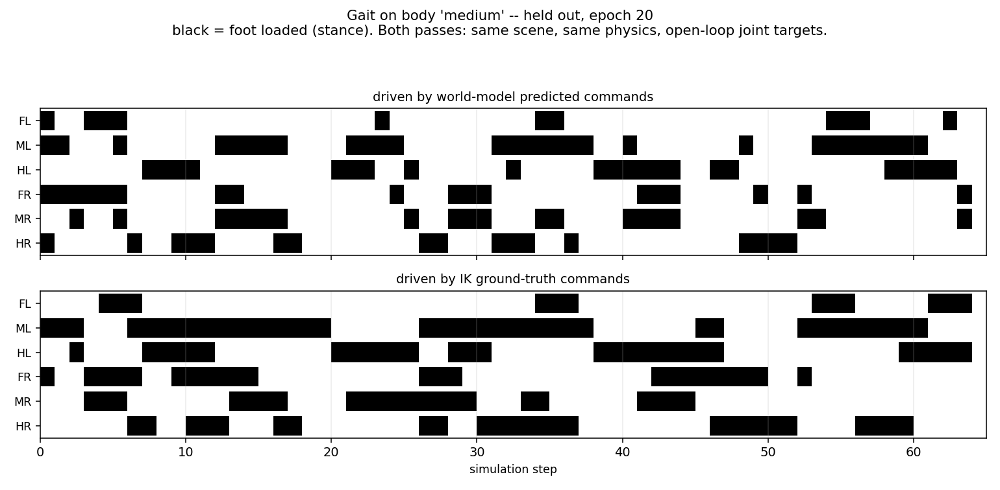
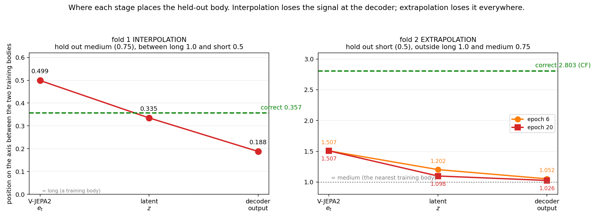

# Stage 1 findings: why cross-morphology transfer fails, and what fixes part of it

**The short version.** A frozen video encoder carries robot morphology in a linearly decodable
form that generalises to unseen bodies (F20). The world model trained on top of it ignores that
and identifies the body from an 11-percent component of its own latent instead (F18, F19), which
is a lookup and does not extend past the bodies it saw. Four decoder-side interventions fail to
change this (F4b, F21, F22) and more training bodies helps only inside their hull (F16, F17).

**What fixes it is changing the question, not the architecture.** Decoding one body's latent
against another body's frame, supervised by that body's command, makes the lookup wrong by
construction. Held-out error improves 23 to 26 percent, the decoder switches to reading the body
from the frame (frame ablation 10.7x to 54x, and a crossed swap test now follows the frame to
within 0.01 deg), copying stops, and for the first time performance does not decay with training
(F24).

Underneath all of it: **the reconstruction loss, which is supposed to make the latent an action,
contributes 3 to 7 percent of the forward model's accuracy while taking 99 percent of the
gradient** (F23). The latent is therefore shaped almost entirely by the motion loss, on one
percent of the training signal, and a body code is the cheapest thing that satisfies it. No
change to the decoder can repair a latent that nothing constrained.

Two datasets. F1 to F14 use `data/ik_walk_100_framed`, two training bodies differing in one
parameter. F15 onward use `data/ik_walk_8body`, five training bodies differing in three.

Measured on `data/ik_walk_100_framed` (100 expert episodes x 3 leg-length bodies x 66 frames,
19,800 frames, 0 clipped). Architecture: frozen V-JEPA2 ViT-g/16 encoder, ITM -> `z` in R^64,
FTM, Motion Decoder -> 18-D joint command. Training bodies `long` (leg scale 1.0) and `short`
(0.5); `medium` (0.75) held out unless stated.

Everything below is a measurement from this repository, with the command that produces it.
Numbers are quoted with the body and checkpoint they came from, because they differ by both.

## How to read the numbers

| Quantity | Unit | Reference point |
|---|---|---|
| joint error | degrees per joint, RMSE | the walking signal itself has 12.6 deg std on the held-out body |
| motion MSE | squared standardised action | 1.0 = predicting the training-set mean, on the training bodies only |
| axis position | dimensionless, 0 to 1 | 0 = identical to `long`, 1 = identical to `short` |
| leg scale | dimensionless | 1.0 = base body. Two-body set: `medium` 0.75, `short` 0.5. Eight-body set: per segment, e.g. `c08f09t09` is coxa 0.8, femur 0.9, tibia 0.9 |
| probe accuracy | fraction | chance is 1/(number of training bodies): 0.500 for two, 0.200 for five |
| gradient steps | steps | 1,543 per epoch at batch size 8 |

Joint names are leg-major: six legs (FL ML HL FR MR HR) x three joints.

| Joint | Anatomy | Function |
|---|---|---|
| TC | thorax-coxa | swings the leg fore and aft |
| CF | coxa-femur | lifts the leg |
| FT | femur-tibia | extends the leg |

## What works

### F1. The model reads body identity from pixels and applies the right joint offsets, with no morphology label

Reconstruction on bodies seen in training, RMSE in degrees per joint
(`wm/runs/stage1_100ep_framed_runB/epoch020.pt`):

| Body | TC | CF | FT |
|---|---|---|---|
| long | 0.75 | 0.51 | 0.46 |
| short | 0.71 | 0.53 | 1.14 |

The mean joint angles of these two bodies differ by 33.8 deg (CF) and 50.1 deg (FT), and the
model places each within 0.03 to 0.06 deg of the correct one. It is never told which body it
is looking at, and morphology appears nowhere in the input or the loss.

### F2. The latent action is doing work

Zeroing `z` costs a factor of 3 to 4 on the held-out body across training
(`heldout/motion_zero_z` divided by `heldout/motion`, 2,600 pairs per point). The decoder is
not reading the joint command off the current frame alone.

### F3. Phase is recovered from video essentially exactly

TC on the held-out body scores 1.35 deg RMSE against a signal of 17.1 deg std. Whatever else
fails, the model knows where in the gait cycle it is.

## What does not work

### F4. Transfer to an unseen body covers about half the required distance

*Left: the body's position between the two training bodies survives the encoder (0.465) and is
lost in the ITM and decoder. Right: correcting the loss weighting makes the model move along the
axis but not converge on the answer. Both panels: 0 = identical to `long`, 1 = identical to
`short`, green band = correct answer for the held-out `medium` body.*

Where the model places the held-out `medium` body on the `long` to `short` axis
(0 = long, 1 = short):

| Representation | Position, 12 clips per body | Position, 3 clips per body |
|---|---|---|
| frozen V-JEPA2 embedding `e_t` | **0.499** | 0.465 |
| learned latent `z` | 0.335 | 0.301 |
| decoder output, CF | **0.188** | 0.152 |
| decoder output, FT | 0.180 | 0.145 |
| correct answer | **0.357** (CF), 0.304 (FT) | same |

`e_t` sits at 0.499 against the 0.5 expected from leg scale alone, so the body's position
between the two training bodies survives the encoder intact. The signal is then lost
downstream: the decoder reaches 0.188 where 0.357 is correct, 53 percent of the way. Resulting
error on the held-out body: TC 1.35, CF 11.34, FT 15.14 deg.

Quadrupling the data (195 to 780 transitions per body) moves every figure by less than 0.04 and
changes no conclusion, so these are not small-sample artefacts.

Position is a scalar projection onto the axis between the two training bodies' means,
`t = <q - a, b - a> / <b - a, b - a>`, so `t = 0` at `long` and `t = 1` at `short`. In joint
space it is computed per joint and averaged over joints the two training bodies separate by
more than 2.0 deg; TC fails that filter entirely, which is F8 restated.

Read the rows as separate statements rather than one decaying quantity: the axis in embedding
space and the axis in joint space are different axes, so 0.465 in one is not "more" than 0.301
in the other. What is directly comparable is the last two rows, both in joint space.

Reproduce: `.venv/bin/python3 scripts/morphology_axis.py --ckpt wm/runs/<run>/epoch020.pt`

### F4b. A linear probe on the same latent generalises better than the trained decoder

Ridge regression from `z` to the joint command, fitted on the two training bodies only, then
evaluated on the held-out body. It reads exactly the same latent the Motion Decoder reads.

| Predictor, RMSE deg per joint | long (trained) | short (trained) | medium (held out) |
|---|---|---|---|
| Motion Decoder | **0.63** | **0.92** | 11.04 |
| ridge probe on `z` | 3.56 | 3.79 | **5.13** |
| mean of the two training bodies | -- | -- | 6.68 |

Measured on 12 clips per body; at 3 clips the same figures are 0.58 / 0.83 / 10.94 and
3.33 / 3.82 / 4.96.

The decoder is 6.6x better in-distribution and 2.2x worse out-of-distribution. The probe
degrades by 1.4x going to an unseen body; the decoder degrades by 15x. The probe also lands at
axis position 0.335 against a correct 0.357, where the decoder reaches 0.188.

The probe is not solving anything. An affine map sends a point at parameter `t` along the
segment between the two training bodies to the point at parameter `t` on the image segment, so
a linear readout can only pass the representation's axis position through unchanged. Measured:
`z` places the held-out body at 0.3352 and the ridge output lands at 0.3354.

That relocates the credit. The useful work is done by the **ITM**, which places the held-out
body at 0.335 against a correct 0.357 -- 94 percent of the way -- while the frozen encoder
placed it at 0.499, the value leg scale alone would predict. The map from leg scale to joint
offset is not linear (a 0.75-scale body sits at 0.357, not 0.5) and the ITM absorbs that
curvature. The linear probe then preserves it and the trained decoder overrides it, pulling
0.335 down to 0.151. The decoder is not failing to find the answer; it is discarding an answer
its input already contained.

Stated safely: on this dataset a high-capacity readout can distort a latent that was already
close to correct, and a linear one cannot. "Less capacity generalises better" is not
established as a general rule and should not be written as one.

It also matters for F6: the probe beats the averaging baseline (5.13 against 6.68 deg), so the
pipeline does contain something better than a predictor that does no learning. Constraining the
decoder is a second lever alongside adding bodies.

Two limits on how far this generalises:

**The bodies are uniformly scaled, so the task is close to affine.** `sim/make_leg_morphology.py`
takes one factor and scales coxa, femur and tibia together, and the resulting joint commands
differ between bodies by 92 to 99 percent constant offset (F7). A linear readout is well matched
to a near-affine problem, so its win here may not survive a morphology space with independent
segment scaling. Scaling the three segments separately and repeating this table is the
experiment that settles it, and both outcomes are reportable.

**Every readout in these tables was fitted post hoc on a frozen `z`, and training end to end
with a smaller head does not reproduce the result.** `head_linear` keeps the cross-attention
backbone and replaces the two-layer output head with a single projection, 272,914 parameters
down to 10,258. Against `fix_norm`, which differs only in that head, over the first ten epochs
on held-out `medium`:

| | mlp head | linear head |
|---|---|---|
| best held-out | **0.522** | 1.121 |
| mean held-out, epochs 1-10 | **1.031** | 1.649 |
| mean held-out, epochs 6-10 | **1.201** | 1.735 |
| mean validation, epochs 6-10 | **0.0110** | 0.0131 |
| mean z-ablation gap | 4.2x | 4.2x |

The linear head is 1.4 to 2.1 times worse and is worse in all ten epochs, which is outside the
run-to-run spread. The likely reason is that it removes only 5 percent of the decoder and
leaves the cross-attention block (3.15M of 5.23M) untouched, while forcing the backbone to make
its features linearly separable on its own.

This closes the capacity hypothesis as a fix. What made the ridge probe look good was the
latent the original training produced, not the shape of the readout; change the readout during
training and the latent changes with it. Coverage remains the only intervention that has
improved anything.

The probe reads only `z` while the Motion Decoder also reads `e_t`, so capacity and input access
are confounded in that table. Fitting both model classes on all three input sets separates them,
every one fitted on the training bodies alone:

| Input | Readout | trained bodies, deg | medium, deg | degradation |
|---|---|---|---|---|
| `z` only (64-d) | linear | 3.58 | **4.96** | **1.4x** |
| `z` only | MLP 256-256 | 0.77 | 5.48 | 7.1x |
| `e_t` only (1408-d) | linear | 1.98 | 8.21 | 4.1x |
| `e_t` only | MLP 256-256 | 0.16 | 13.16 | 82.2x |
| `e_t` + `z` (the decoder's inputs) | linear | 0.89 | **4.88** | 5.5x |
| `e_t` + `z` | MLP 256-256 | 0.17 | 13.71 | 79.3x |
| `e_t` + `z` | Motion Decoder (5.2M) | 0.71 | 10.94 | 15.4x |

Capacity is the dominant term. Within every input set the nonlinear readout is better on the
training bodies and worse on the held-out one, and the gap widens with capacity: 1.4x for a
linear map on `z`, 15.4x for the trained decoder, 79x for a plain MLP on the same inputs.
Given the decoder's own inputs, a linear readout reaches **4.88 deg on the held-out body against
the decoder's 10.94**, so the decoder is not failing for want of information.

Access to `e_t` contributes a second, smaller effect: linear on `e_t` alone degrades 4.1x against
1.4x on `z` alone, which is consistent with `e_t` carrying body identity in a form that is easy
to key on. But `z` alone (4.96) and `e_t` + `z` (4.88) land in the same place, so the ITM has
already distilled what a well-conditioned readout needs.

### F4c. Replaying the commands in physics shows the same split

Both command streams driven open-loop through the same scene and physics as the collector used,
held-out `medium`, all three clips (`sim/render_wm_prediction.py`, `scripts/wm_gait_report.py`):

| Driven by | forward x, m (clip 0 / 1 / 2) | mean forward | mean absolute heading error | body height, m | tripod score (0 / 1 / 2) |
|---|---|---|---|---|---|
| IK ground truth | 0.653 / 0.625 / 0.639 | **0.639** | **4.4 deg** | 0.111 | -0.40 / -0.35 / -0.38 |
| Motion Decoder | 0.312 / 0.045 / 0.111 | 0.156 (24%) | 42.5 deg | **0.089** | **+0.16 / +0.16 / +0.25** |
| ridge probe on `z` | 0.358 / 0.514 / 0.568 | 0.480 (75%) | 37.6 deg | 0.111 | -0.34 / -0.17 / -0.46 |

Tripod score is the correlation between the two tripod groups' contact counts: negative means
the groups alternate as a stick insect's gait should, zero means they have stopped coordinating.
Heading error is the angle of net displacement away from the walking direction.

Neither is a usable controller: both veer, by 38 to 43 degrees on average against the ground
truth's 4.4. The difference is in what survives. The **decoder** sinks from 0.111 m to 0.089 m
of body height in every clip, covers 24 percent of the ground-truth distance, and its tripod
score is positive in all three clips, so the alternating gait is gone. The **probe** holds body
height exactly, covers 75 percent of the distance, and keeps a negative tripod score in all
three clips, so the gait survives.

The visible failure in the videos is legs folding into the abdomen, and it is measurable
without any per-frame ground truth: what fraction of commanded angles fall outside the range
that body reaches across all 100 of its episodes.

| Driven by | commands out of range (clip 0 / 1 / 2) | worst excursion | TC | CF | FT | commanded peak-to-peak, CF / FT |
|---|---|---|---|---|---|---|
| IK ground truth | 0.0% / 0.0% / 0.0% | 0.0 deg | 0% | 0% | 0% | 28.0 / 47.3 deg |
| Motion Decoder | **16.1% / 16.9% / 15.5%** | **40.2 deg** | 0.9% | 19.3% | **28.3%** | **53.5 / 81.0 deg** |
| ridge probe on `z` | 6.7% / 8.3% / 7.4% | 14.5 deg | 3.6% | 5.6% | 13.2% | 35.1 / 60.9 deg |

The body's own range is 29.4 deg (CF) and 47.8 deg (FT). The decoder commands swings 1.9x and
1.7x wider than that, up to 40 deg past the limit, in every clip. Its TC amplitude is correct to
within 1.3 deg. This is the `gain` of 0.30 from F5 made physical: over-amplified distal joints
drive the leg into a pose the body cannot hold.

Because it needs only the body's joint range and not matched expert data, this measure carries
over to a body with no ground truth and across embodiments, where B1 has its own limits.

Single clips mislead here. On clip 0 alone the decoder veers 25.2 deg against the probe's 57.9
and looks the steadier of the two; that is the decoder's straightest clip and the probe's worst.
Across three clips the decoder's heading errors are +25.2, -37.5 and +64.8 deg. Report all
clips, or the wrong predictor wins.

*Decoder-driven gait above, ground truth below. Black is stance. The stance blocks fragment and
the left and right tripods stop alternating.*

*Probe-driven gait above, ground truth below, same axes. Stance blocks keep roughly the right
length and phase.*

Videos: `results/wm/replay/replay_*.mp4`, predicted on the left, ground truth on the right.

### F4d. Interpolation and extrapolation fail at different stages

Fold 2 holds out `short` (leg scale 0.5) while training on `long` (1.0) and `medium` (0.75), so
the test body lies outside the training range rather than between the training bodies. Axis
here runs 0 = `long`, 1 = `medium`, and the correct position for `short` is 2.803 (CF).

| Stage | fold 1, held-out medium (bracketed) | fold 2, held-out short (outside), epoch 6 | fold 2, epoch 20 |
|---|---|---|---|
| frozen `e_t` | 0.499 | 1.507 | 1.507 |
| latent `z` | **0.335** | 1.202 | **1.098** |
| decoder output | **0.188** | 1.052 | **1.026** |
| correct | 0.357 | 2.803 | 2.803 |

A position of 1.0 means "identical to the nearest training body". Both the ITM and the decoder
pull the unseen body back to that value, and pull harder the longer training runs: `z` moves
1.202 to 1.098 and the decoder 1.052 to 1.026 between epochs 6 and 20. That is the
copy-the-nearest-body behaviour visible in the aggregate (model 7.00 against copy-medium 6.96)
seen at the level of the representation.

The diagnosis therefore differs by fold and must not be stated as one:

| | fold 1, bracketed | fold 2, outside the range |
|---|---|---|
| encoder | correct, 0.499 against 0.357 | already short, 1.507 against 2.803 (54%) |
| ITM | correct, 0.335, 94% of the way | makes it worse, 1.10 |
| decoder | **the failing stage**, 0.188 | drives it to 1.03 |

With the body bracketed, the ITM absorbs the curvature of the leg-scale to joint-offset map and
only the decoder discards it. Outside the range, the frozen encoder is already the largest
single gap: a perfect ITM and decoder reading `e_t` could reach 1.507 of a required 2.803.

This bounds the architectural fix. A linear readout can only pass the representation's position
through, so it helps exactly where the representation is right:

| | ridge probe on `z` | Motion Decoder | probe advantage |
|---|---|---|---|
| fold 1, medium | **5.13 deg** | 11.04 deg | **2.2x** |
| fold 2, short | 21.65 deg | 23.89 deg | 1.1x |

Both beat the no-learning baseline for fold 2 (29.43 deg), but neither is close to correct.

**Generalisation here comes from coverage, not from the model.** A body between the training
bodies is recovered to 94 percent at the latent; a body outside them is pulled back to the
nearest one at every stage. Training sets must bracket the bodies they are meant to generalise
to, and no change to the decoder substitutes for that.

### F5. Two training bodies cannot define a curve

The motion loss sees exactly two points: "looks like long -> long's offsets" and "looks like
short -> short's offsets". Every function through those two points has identical loss, so
nothing constrains the space between them. A network trained on two well-separated clusters
fits two plateaus rather than a ramp, and an input in between falls toward the nearer plateau.

The clearest evidence is what changing the loss weighting does. Standardising by within-body
spread instead of pooled spread (F9) raises CF and FT from 0.12 to 0.95 of TC's weight, and
the model then does move along the morphology axis -- but without control:

| Run | axis CF | axis FT | all-joint RMSE, deg |
|---|---|---|---|
| pooled std, epoch 6 | 0.11 | 0.10 | 8.99 |
| pooled std, epoch 20 | 0.15 | 0.14 | 10.95 |
| within-body std, epoch 6 | 0.25 | 0.24 | 9.87 |
| within-body std, epoch 18 | 0.61 | 0.59 | 17.30 |
| correct answer | 0.36 | 0.30 | 0 |

With the corrected weighting the model swings from undershooting (0.11) to overshooting
(0.61) as training proceeds. It is not converging on the right answer from either side; it is
drifting through it, because nothing in the objective marks where the right answer is.

### F6. Trivial baselines beat the model on this task

*Left: both training bodies are reconstructed to under 1.2 deg per joint while the held-out body
is not. Right: shown the medium body, the model's output is closer to a training body's geometry
than to the correct answer.*

Held-out `medium`, RMSE in degrees per joint:

| Predictor | TC | CF | FT | all |
|---|---|---|---|---|
| mean of the two training bodies' commands | 0.04 | 5.33 | 10.26 | 6.68 |
| model, epoch 6 | 2.02 | 9.64 | 12.05 | 8.99 |
| model, epoch 20 | 1.35 | 11.34 | 15.14 | 10.95 |

Held-out `short` (fold 2, `--train_morphs long medium`), motion MSE in the run's own units:

| Predictor | MSE |
|---|---|
| linear extrapolation, `medium + (medium - long)` | 1.91 |
| copy `medium` ground truth | 6.96 |
| model, epochs 1 to 28 | 6.93 to 7.07 |
| mean of the two training bodies | 10.77 |
| predict the training mean | 12.54 |

On fold 2 the model is indistinguishable from copying the nearest training body, and a linear
extrapolation that knows only the ordering of leg lengths beats it by 3.7x. The held-out score
does not move at all across 28 epochs while validation improves 8x.

Caveat: these baselines use time-aligned ground-truth commands from the training bodies, which
the model does not receive. F3 shows the model recovers phase to 1.35 deg, so the comparison
is meaningful, but it is not a like-for-like input.

### F7. Between-body differences on this dataset are 92 to 99 percent constant offset

The IK retargeting drives every body along one shared Cartesian foot trajectory, scaled to
fit. The resulting joint commands are near-affine transforms of each other:

| Pair | RMSE, deg | after removing a per-joint constant | fraction that is offset |
|---|---|---|---|
| long vs medium, CF | 11.86 | 1.10 | 99% |
| long vs medium, FT | 14.88 | 4.08 | 92% |
| short vs medium, CF | 22.08 | 5.88 | 93% |
| long vs medium, TC | 0.59 | 0.23 | 84% |

Changing leg length shifts posture and barely changes the movement pattern. This is why the
averaging baseline in F6 is so strong, and it is a property of how the data was generated
rather than of the world model.

The relationship is nonlinear, which is the opening: `medium` at leg scale 0.75 sits at 0.5
on the scale axis but at 0.30 to 0.36 on the joint-offset axis. No linear baseline can be
right about that. A model that reads appearance and produces the correct curve would beat
every baseline in F6 -- but two training bodies can only express a straight line.

## Pitfalls, with the evidence that they are real

### F8. Aggregate error hides which joints transferred

*Predicted (red, dashed) against IK ground truth (black) for all 18 joints on the held-out body.
Left column is TC and tracks exactly; the CF and FT columns are over-amplified and out of phase.
Ground-truth frames are the input, so this is action reconstruction, not closed-loop control.*

The 18-joint average on the held-out body reads 0.208 in standardised units, which looks
healthy. Split by joint type, against each joint's own mean over the clip:

| Joint type | MSE | constant baseline | verdict |
|---|---|---|---|
| TC | 0.006 | 1.001 | 164x better than a constant |
| CF | 0.382 | 0.121 | 3x worse than a constant |
| FT | 0.236 | 0.211 | no better than a constant |

TC scores near zero and drags the mean down. Report `motion_mse_per_joint_type` from
`wm.evaluate`, not the average.

TC is also the wrong joint to celebrate: the three bodies' TC commands differ by only 0.58 to
1.17 deg, so there is almost nothing there to transfer. Cross-morphology claims rest on CF and
FT, the joints that set how high and how far the foot goes.

### F9. The standardisation scale silently reweights joints

Standardising the motion target by the spread of all training bodies pooled together counts
the posture gap between bodies as signal amplitude. Measured on `long` plus `short`:

| Joint type | pooled std, deg | within-body std, deg | weight in the loss |
|---|---|---|---|
| TC | 17.1 | 17.1 | 1.00 |
| CF | 18.4 | 7.9 | 0.12 -> 0.95 |
| FT | 31.4 | 20.7 | 0.11 -> 0.84 |

TC keeps full weight because all three bodies move it by the same amount. The joints that
differ between bodies -- the ones the whole experiment is about -- were receiving an eighth of
the gradient. Fixed by `within_body_std` in `wm/config.py`, on by default.

Correcting this did not improve held-out RMSE (F5), so it was not the bottleneck, but it is
the correct scaling and it changes what the model does with the morphology axis.

### F10. The trivial baseline of 1.0 does not hold on a held-out body

Motion MSE is standardised by the training bodies' statistics, so "predicting the mean costs
1.0" is true only on those bodies. On held-out `medium` the same trivial predictor costs
0.495, and that body's own mean costs 0.444. Claims of the form "N times better than no skill"
must use the held-out body's own baseline. `wm.evaluate` reports both as
`predict_training_mean` and `predict_this_body_mean`.

### F11. Validation on held-out episodes cannot detect cross-body failure

*Same configuration and same `seed: 0` on two different GPUs. Left: validation on unseen episodes
of the training bodies improves by an order of magnitude. Right: the held-out body does not, and
the two runs disagree by up to 2.1x.*

Two runs of the identical configuration, from 3,086 to 30,860 gradient steps:

| | run A | run B |
|---|---|---|
| validation motion, unseen episodes of the training bodies | 0.0118 -> 0.0011 (11x better) | 0.0125 -> 0.0012 (10x better) |
| held-out body | 0.295 -> 0.220 | 0.140 -> 0.203 |

Ninety percent of the compute budget buys an order of magnitude on validation and nothing
measurable on the held-out body. A new body is a different distribution, not a held-out sample
of the same one. Fold 2 shows the same shape: validation 8x better, held-out flat across 28
epochs.

### F12. Held-out scores need error bars; in-distribution scores do not

Same configuration, same `seed: 0`, different GPU. How far apart the two runs land:

| Metric | median ratio | worst |
|---|---|---|
| reconstruction, train and validation | 1.003 | 1.005 |
| motion, train and validation | 1.14 to 1.18 | 1.38 |
| held-out body | 1.247 | 2.103 |

Floating-point rounding is enough to move held-out performance by a factor of two while the
models remain identical to 0.3 percent in-distribution. This is the numerical signature of
F5: extrapolation is underdetermined, so arbitrarily small differences pick different answers.
Single-run held-out numbers are not interpretable.

### F13. More episodes of the same bodies does not help

| Run | Episodes | Steps | Held-out MSE |
|---|---|---|---|
| stage1_6ep_clipped | 6 | 9,750 | 0.166 |
| stage1_100ep_clean | 100 | 9,500 | 0.179 |
| stage1_100ep_clipped | 100 | 30,880 | 0.422 |

A 16x increase in episodes of the same two bodies changes nothing. Data budget spent on
episodes is wasted; spend it on bodies.

### F14. Peak transfer arrives in the first tenth of training

*Every snapshot re-scored on 2,600 identical cached held-out pairs. The dotted line at 1.0 is
predicting the mean; the grey curve is the same model with the latent zeroed.*

Re-scoring every snapshot on 2,600 identical cached held-out pairs
(`wm.sweep_checkpoints`), transfer is best between 3,086 and 9,258 gradient steps of 30,860 and
does not improve after. Selecting a checkpoint on this curve would leak the test body, so the
curve is for reporting compute cost, not for choosing a model.

## What more bodies fix

Everything above was measured with two training bodies differing along one axis. This section
uses `data/ik_walk_8body`: nine bodies generated by scaling coxa, femur and tibia
independently (`sim/make_leg_morphology.py`), 30 clips each, 0 percent of frames edge-clipped.
Two bodies were dropped because they stumble -- both have femur 0.6 with tibia 1.0, and their
head height falls to 0.03 m against 0.111 m for the rest. Five bodies train; `c08f09t09`
(0.8, 0.9, 0.9) is held out and lies inside their convex hull; `c06f06t06` is held out in a
second run and lies outside it.

### F15. The morphology space is three parameters but two dimensions

Scaling the coxa barely moves the joint commands, so the family of bodies is thinner than the
parameterisation suggests:

| Change, other segments fixed | Command change |
|---|---|
| coxa 1.0 to 0.6 | **0.73 deg** |
| tibia 1.0 to 0.6 | **28.63 deg** |

An SVD of how the five training bodies deviate from their mean gives 82.4 percent to the first
direction, 17.5 percent to the second, and 0.0 percent to the remaining three. The first
correlates with tibia at -0.93, the second with femur at -1.00. The coxa is the shortest
segment and sits against the body, so shortening it barely moves the foot and the IK has almost
nothing to compensate for.

Reconstructing the held-out body from a k-dimensional basis of the training bodies:

| k | RMSE deg |
|---|---|
| 0 (the average body) | 11.489 |
| 1 | 0.483 |
| **2** | **0.203** |
| 5 | 0.174 |

Two numbers place the held-out body to 0.2 deg. The decoder emits 18 free numbers per timestep.

### F16. Five bodies cut held-out error 3.1x and beat the no-learning baseline

Held-out `c08f09t09`, RMSE deg per joint, `m3d_bracketed` at epoch 6:

| Predictor | TC | CF | FT | all |
|---|---|---|---|---|
| best possible linear mixture | -- | -- | -- | **0.18** |
| **model** | 2.25 | 3.59 | 4.53 | **3.57** |
| copy the nearest training body | 0.22 | 4.30 | 4.18 | 3.46 |
| mean of the five training bodies | 0.15 | 19.29 | 4.85 | 11.48 |
| predict this body's own mean | 18.24 | 6.30 | 11.83 | 13.07 |

Against the two-body setup's 11.04 deg this is 3.1 times better, and it clears the averaging
baseline that beat every earlier run (3.57 against 11.48). The `z`-ablation gap rises from 3-4x
with two bodies to **10-37x** with five, so the latent became far more load-bearing.

It is still 20 times worse than a linear mixture of the training bodies, and indistinguishable
from copying the nearest one.

### F17. Bracketed against outside, with everything else held fixed

`m3d_bracketed` and `m3d_outside` share training bodies, data, normalisation and
hyperparameters, and differ only in which body is held out, so their held-out numbers are
directly comparable:

| | bracketed `c08f09t09` | outside `c06f06t06` | ratio |
|---|---|---|---|
| best over 12 epochs | **0.0764** | 0.9341 | 12x |
| mean, epochs 1-6 | 0.0902 | 1.9707 | 22x |
| mean, epochs 7-12 | 0.1034 | 1.5439 | 15x |
| z-ablation gap | 10-37x | 1.6-5.1x | |

Bracketing is worth 10 to 30 times in error and about 7 times in how much the latent
contributes. This reproduces F4d on an independent dataset with a properly matched control.

More bodies also help the unbracketed case, which two bodies did not:

| | trend, late epochs over early |
|---|---|
| `fold_short`, 2 training bodies, outside | **1.02x** (flat across 41 epochs) |
| `m3d_outside`, 5 training bodies, outside | **0.78x** (22 percent better) |

### F18. The decoder takes the body from the latent, not from the frame

Every body walks the same expert episodes, so at a given timestep two bodies are at the same
point in the gait cycle and the decoder's two inputs can be crossed. `m3d_bracketed` epoch 8,
between two bodies whose commands differ by 28.63 deg (`scripts/swap_pathway.py`):

| frame from | latent from | RMSE vs c10f10t10 | RMSE vs c10f10t06 |
|---|---|---|---|
| c10f10t10 | c10f10t10 | **1.38** | 28.68 |
| **c10f10t10** | **c10f10t06** | 27.35 | **3.48** |
| **c10f10t06** | **c10f10t10** | **11.75** | 23.81 |
| c10f10t06 | c10f10t06 | 28.14 | **2.02** |

Row two is the result: given body A's frame and body B's latent, the decoder emits body B's
commands to within 3.48 deg, almost as accurately as when both inputs agree. The frame it is
looking at makes no difference.

The preference strengthens throughout training. At epoch 20 the crossed case reaches **2.08 deg**
against the latent's body, closer than at epoch 8 and nearly as accurate as when both inputs
agree (1.22 deg), while row three's two columns spread from 4.6 deg apart at epoch 6 to 14.5 deg
apart at epoch 20.

This inverts the architecture's intent. `z` is meant to be a body-independent latent action and
`x_t` the context that says which body; the model uses them the other way round.

### F19. It is keying off 11 percent of the latent while ignoring the whole frame

Decomposing the variance of `z` across the five training bodies at matched gait phases:

| Source | Share |
|---|---|
| where in the gait cycle | **64.1%** |
| which body it is | **11.1%** |
| interaction and residual | 24.8% |

| Distance in `z` | |
|---|---|
| between gait phases of one body | 20.03 |
| between bodies at one phase | 14.98 |

So `z` is doing what it was designed for; the gait dominates it. But a linear probe still
recovers the body from `z` at **0.724** against a 0.200 chance level, and F18 shows that small
component is exactly what the decoder uses.

The frame carries leg lengths in full and the decoder ignores it. A lookup over five
well-separated codes is a cheaper way to reduce the training loss than reading geometry off
256x1408 tokens, and a lookup has no entry for a body that was never assigned a code. Fitting
which mixture of training bodies the model's answer resembles (`scripts/morphology_mix.py`)
shows the same thing from the output side: **0.883 of the weight sits on one training body**
where the best possible mixture spreads to 0.697, and the segment scales its answer implies are
(0.980, 0.975, 0.973) against an actual (0.80, 0.90, 0.90).

By epoch 20 the concentration rises to **0.947**, and it has switched which body it copies, from
`c10f10t10` to `c06f10t10`. The implied scales become (0.615, 0.991, 0.984), which is
`c06f10t10`'s own (0.6, 1.0, 1.0) almost exactly. Switching which entry it returns, rather than
converging on the answer, is what a lookup does. Held-out error over the same span goes 3.57 to
3.88 deg.

This is the mechanism behind every failure above. Coverage helps because it puts a closer code
in the table, not because the model learned to infer morphology.

### F20. The encoder carries morphology and generalises; the decoder does not use it

Everything above assumes the frame carries the body's geometry. This tests it directly, with no
world model involved: fit a regression from the mean-pooled frozen embedding `e_t` to the three
segment scales on the five training bodies, then apply it to a body it has never seen.

Predicted against actual segment scale:

| Body | | coxa | femur | tibia |
|---|---|---|---|---|
| c10f10t10 | train | 0.985 / 1.00 | 0.999 / 1.00 | 0.998 / 1.00 |
| c06f10t10 | train | 0.616 / 0.60 | 0.998 / 1.00 | 0.998 / 1.00 |
| c10f10t06 | train | 0.970 / 1.00 | 0.998 / 1.00 | 0.601 / 0.60 |
| c06f10t06 | train | 0.633 / 0.60 | 0.998 / 1.00 | 0.601 / 0.60 |
| c10f06t06 | train | 0.996 / 1.00 | 0.606 / 0.60 | 0.602 / 0.60 |
| **c08f09t09** | **held out, bracketed** | **0.850 / 0.80** | **0.939 / 0.90** | **0.898 / 0.90** |
| c06f06t06 | held out, outside | 0.872 / 0.60 | 0.683 / 0.60 | 0.710 / 0.60 |

Errors on the bracketed body are **0.050, 0.039 and 0.002**, from ridge regression on a
1408-dimensional average of patch tokens. The frozen encoder places a body it has never seen at
close to its true segment lengths, and a linear readout is enough to get them out.

Against that, the trained Motion Decoder's answer implies segment scales of
**(0.980, 0.975, 0.973)** for the same body (F19), where the truth is (0.80, 0.90, 0.90). A
5.2M-parameter decoder with the frame in front of it is further from the answer than a linear
map with 4,227.

**So the decoder is the failing component, and not for want of information or because the
information is hidden in some hard-to-reach form.** A single matrix on the average of the patch
tokens recovers it.

The capacity pattern from F4b reappears on this much simpler task. An MLP replacing the ridge:

| | training bodies | held-out bodies |
|---|---|---|
| linear | 0.020 / 0.003 / 0.001 | 0.161 / **0.061** / **0.056** |
| MLP | **0.005 / 0.006 / 0.011** | 0.130 / 0.115 / 0.121 |

Better on what it saw, roughly twice as bad on what it did not, on a task that is only
predicting three numbers.

Two secondary readings. The coxa is the worst-predicted segment (0.161 against 0.061 and 0.056),
matching F15: it barely changes the joint commands and it barely changes the image. And the
unbracketed body is recovered far less well -- 0.872 predicted against 0.60 actual. The condition
on the result is exact and computable in advance:

> **The probe predicts a new body to within 0.03 only if that body can be made by mixing the
> bodies it was fitted on. If it cannot, the error jumps to 0.16-0.17.**

Solving for the closest reachable mixture in segment-scale space, with non-negative weights
summing to one:

| body | true scales | closest mixture of the training bodies | distance |
|---|---|---|---|
| **c08f09t09** | (0.80, 0.90, 0.90) | **(0.80, 0.90, 0.90)** | **0** |
| c06f06t06 | (0.60, 0.60, 0.60) | (0.80, 0.80, 0.60) | 0.283 |
| c10f10t06 | (1.00, 1.00, 0.60) | (1.00, 0.80, 0.80) | 0.283 |

`c06f06t06` is unreachable because driving the femur to 0.6 requires all the weight on
`c10f06t06`, which forces the coxa to 1.0; taking weight off it to lower the coxa pushes the femur
back up. `c10f10t06` fails the mirror of this: the only body with a short tibia also has a short
femur, so the two cannot be separated.

**This does not settle whether the encoder carries the information.** A readout fitted on five
points cannot reach past them regardless of what the encoder holds, and the observed pattern --
all three scales pulled toward the middle of the training data -- is what any regressor does
outside its fitting range. Capacity is not the issue: an MLP on the same five bodies is no better
(held-out mean absolute error 0.130/0.115/0.121 against ridge's 0.161/0.061/0.056, and worse on
the bracketed body). What the measurement supports is the conditional above, which is enough to
use it -- see F35.

**Why the decoder cannot do what the probe can.** The probe sees the mean over all 256 patch
tokens. The decoder sees those tokens through cross-attention with `z` as the query, so it only
retrieves what `z` asks for, and `z` is 64 percent gait phase (F19). Morphology is present in the
tokens and never queried. That also explains why removing the body code from `z` did not help
(F21): it forced the decoder onto a channel it has no mechanism to read.

### F21. Removing the body code from the latent moves the channel but does not help

`--lambda_adv 0.1` puts a gradient-reversal classifier on `z`. Against `m3d_bracketed`, which
differs only in that flag, averaged over ten epochs:

| | control | adversarial | change |
|---|---|---|---|
| held-out error | **0.097** | 0.118 | **1.21x worse** |
| z-gap, `zero_z` over held-out | 23.4x | 5.1x | latent used 4.6x less |
| x-gap, `zero_x` over held-out | 10.7x | **21.8x** | **frame used 2.0x more** |
| probe on `z` | 0.724 post hoc | plateau at **0.440** | body code partly removed |

The intervention did what it was designed to do. The decoder moved off the latent and onto the
frame, by a factor of two on the ablation that measures exactly that, and the shift keeps growing
-- x-gap climbs from 11.3x at epoch 1 to 31.9x at epoch 10, reaching 2.46x the control over the
last five epochs. **Transfer never improved.** The harder the decoder is pushed onto the frame,
the more clearly it fails to benefit.

The probe settles at 0.440 from epoch 7 onward, well above the 0.200 chance level and no longer
falling: the ITM and the classifier reach a standoff and the body code stops leaving. Running
longer changes nothing.

Read with F20 this is not ambiguous. Forcing the decoder onto the frame does not help because
the decoder cannot extract morphology from the frame, while a linear probe on the same
embeddings can. The shortcut was a symptom.

Below-chance classifier accuracy is a failure mode worth naming: with five bodies, chance is
0.200, and a 5-epoch smoke run drove the probe to 0.002. Being wrong 99.8 percent of the time
requires information, so it means the latent is rotating the code faster than the classifier
tracks it, not that the code is gone.

### F22. Giving the decoder direct access to the frame makes it use the frame less

F20 showed a ridge probe on mean-pooled `e_t` recovers a held-out body's segment scales to 0.05,
while the decoder does not. `--md_head pooled` gives the decoder that exact view: the mean over
patch tokens, projected and added as a residual straight onto the action. It is initialised to
zero, so training starts bit-identical to the `mlp` decoder, and unlike a concatenated input a
residual on the output cannot be down-weighted away.

An earlier concatenation design was tried first and the fusion layer suppressed the new path --
the frame-ablation gap fell from 12.5x to 7.1x on the smoke set. The residual form was adopted
to remove that escape route.

Against `m3d_bracketed`, differing only in `md_head`, over eleven epochs:

| | control | pooled | change |
|---|---|---|---|
| held-out error | 0.098 | 0.099 | **1.01x, identical** |
| z-gap | 21.1x | 29.6x | latent used 1.4x more |
| **x-gap** | **10.9x** | **1.4x** | **frame used 7.6x less** |

The frame ablation is the result. With the control, removing the frame costs a factor of eleven;
with the direct pooled path available, it costs a factor of 1.4, steady across the last five
epochs. **The decoder was handed the view that works and responded by relying on the frame
almost not at all**, holding transfer exactly level by leaning harder on `z`.

The residual can also be read directly rather than by ablation, and it says the same thing more
sharply. On the full run at epoch 6, where held-out error is at its best:

| | smoke, 975 pairs | full, 9,425 pairs |
|---|---|---|
| residual magnitude | 1.5-1.9 deg | **0.24-0.28 deg** |
| spread across bodies | 1.87 deg | 0.27 deg |
| spread across frames of one body | 2.80 deg | 0.84 deg |
| **ratio between / within** | 0.67 | **0.32** |

It is not a learned constant -- it sits 0.92 to 1.10 deg from what a zeroed frame produces -- but
it varies three times more with where the legs are than with how long they are, and it is
**0.9 percent** of the 28.6 deg that separates two training bodies. More data made it smaller and
the ratio worse, which is the same direction the frame ablation moved.

Crossing the inputs confirms it. At epoch 6, against the control at the same epoch:

| frame from | latent from | control, RMSE vs the latent's body | pooled |
|---|---|---|---|
| A | B | 2.74 | 4.24 |
| B | A | 16.52 | **3.42** |

In the second row the pooled decoder follows the latent **more** faithfully than the control
does, not less: a frame belonging to a body 28.63 deg away moves its answer by 3.42 deg, an
influence of 12 percent.

This closes the access explanation. Five interventions have now been tried:

| Intervention | Result |
|---|---|
| rescale the motion target (F9) | no change |
| shrink the decoder head (F4b) | 1.4 to 2.1x worse |
| remove the body code from `z` (F21) | frame used 2x more, transfer 1.21x worse |
| **give the decoder the pooled view (F22)** | **frame used 7.6x less, transfer level** |
| more training bodies (F16, F17) | **3.1x better, the only one that worked** |

What survives is the objective. `L_motion` asks for the right joint command on bodies the model
can see during training, and a lookup over five body codes in `z` satisfies that at lower cost
than reading leg geometry off pixels -- whatever route to the pixels is provided. Nothing in the
loss ever requires the mapping from appearance to morphology that transfer needs.

### F23. The reconstruction loss barely uses the latent, and it is 99 percent of the gradient

The latent is supposed to be an action because `L_recon` cannot predict the next frame without
it. That premise had never been checked. `L_recon` is an MSE on unnormalised V-JEPA2 embeddings,
so its value carries no meaning on its own and needs baselines.

Held-out body, `m3d_bracketed` epoch 20 and `stage1_100ep_framed_runB` epoch 20:

| horizon | FTM | copy `e_t` | FTM with `z` zeroed | **`z` helps** | FTM vs copy |
|---|---|---|---|---|---|
| 1 | 1.452 | 2.116 | 1.549 | **1.07x** | 1.46x |
| 2 | 1.778 | 2.756 | 1.910 | 1.07x | 1.55x |
| 5 | 2.494 | 3.646 | 2.620 | 1.05x | 1.46x |
| 10 | 3.187 | 4.431 | 3.294 | **1.03x** | 1.39x |

The forward model works -- it beats predicting that the frame does not change by 39 to 55
percent -- but **removing the latent costs it 3 to 7 percent**. Against the Motion Decoder, where
removing the latent costs 2,000 to 3,700 percent, the forward model is barely conditioned on it
at all.

This is not specific to the five-body run: the two-body run gives 1.04x at horizon 1. It is not
fixed by looking further ahead either; the contribution *falls* to 1.03x at horizon 10, because
by then the frame is unpredictable enough that the model falls back on an average, which needs
no action. One step of a small gait is largely predictable from the current pose, and ten steps
are largely not, and neither regime requires knowing what the action was.

Now weight it. With `lambda_recon = lambda_motion = 1.0`, recon sits at 1.6 and motion at 0.01:

> **99 percent of the gradient goes to a loss that does not need `z`, and 1 percent to the loss
> that does.**

So `z` is shaped almost entirely by `L_motion`, on one percent of the training signal, and
`L_motion` is the term that a lookup satisfies (F19). The latent is not a latent action in the
sense the architecture intends; it is whatever compresses enough to predict commands for five
known bodies, and a body code is the cheapest thing that does.

This sits underneath every earlier finding. The decoder keys off a body code in `z` (F18) because
nothing shaped `z` into anything else, and no change to the decoder -- capacity, access, or
adversarial pressure -- can repair a latent the objective never constrained.

Two untested consequences, both one config value and no new data:

| change | question it answers |
|---|---|
| `lambda_motion` raised to ~100 | with a comparable gradient budget, does `L_motion` still settle for a lookup |
| `lambda_recon` set to 0 | does dropping a term that contributes 3 to 7 percent help or hurt the latent |

### F25. Cross-augmentation makes the reconstruction target almost entirely noise

F23 found `L_recon` barely uses the latent while taking 99 percent of the gradient. This is why.

The FTM predicts view 2's next frame from view 2's current frame and a latent computed from
view 1. The two views carry independently sampled crops and brightness jitter, so part of the
target is noise no latent could predict. Measured on 40 frames of one clip, in the same units as
`L_recon`:

| | value |
|---|---|
| **augmentation noise** -- one frame, two views | **8.51** |
| **signal** -- consecutive frames, no augmentation | **1.97** |
| what the FTM is actually asked to close | 8.43 |
| an augmented view against the clean frame | 8.13 |

Splitting the augmentation shows no setting of it recovers the signal:

| augmentation | noise | noise / signal |
|---|---|---|
| crop 85-100% + jitter (current) | 8.42 | 4.39 |
| crop 85-100% only | 8.56 | 4.47 |
| crop 95-100% only | 6.76 | 3.53 |
| **jitter only, no crop** | **4.02** | **2.10** |
| crop 95-100% + jitter | 7.02 | 3.66 |

Crop is the larger term, but tightening it from 85 to 95 percent removes only 21 percent of the
noise, and photometric jitter **alone** -- which moves nothing in the image -- still produces
twice the signal. The frozen encoder is not invariant to brightness and contrast changes, which
is the assumption cross-augmentation rests on. Weakening the augmentation cannot fix this; the
best available setting still leaves noise at twice the signal.

**Noise is 4.33 times the signal**, and the augmentation accounts for 101 percent of the target
the FTM is trained on. The motion `z` could explain is at most 23 percent of `L_recon`; the
measured contribution is 3 to 7 percent.

So the latent is not useless to the forward model, it is buried. Ninety-nine percent of the
gradient goes to a term whose target is dominated by an unpredictable nuisance, and the one
percent that remains is `L_motion`, which a lookup satisfies (F19). **`z` was never under
pressure to become an action.**

Cross-augmentation exists for a reason -- without it the ITM can satisfy `L_recon` by copying
`x_{t+1}` into `z` instead of encoding the transition. The cost of that protection had simply
never been measured. Three ways to keep the protection and recover the signal, none tested:

One option can be ruled out immediately. Making the FTM's target a **clean** frame would make
the shortcut *more* attractive, not less: the protection comes from the target being randomly
augmented, so that no fixed content in `z` can predict it. A deterministic target is exactly what
a copy could hit.

**Dropping cross-augmentation is also ruled out, by F29.** The argument for dropping it was that
the shortcut buys little, since `z` improves `L_recon` by only 3 to 7 percent. That number was
measured while `z` had no job at all. Under `action_lag 1` the decoder can only reach `a_{t+1}`
through `z`, so compressing `e_{t+1}` into `z` is the cheapest way to satisfy `L_motion` -- and
the same compression makes `L_recon` trivial, because the FTM then only has to unpack it. One
shortcut now pays into both terms, which is precisely the degenerate solution cross-augmentation
exists to block. It stays on.

What that leaves for the FTM, none tested:

| change | what it would cost |
|---|---|
| augment in embedding space rather than pixel space | needs designing; the noise becomes controllable |
| augment the FTM's input more weakly than the ITM's | asymmetric, so the ITM still cannot copy |
| accept the FTM as inert and drop it | loses latent rollout, and with it deployment |

The measurement that decides between these is whether `z` under `action_lag 1` becomes a
compressed copy of `e_{t+1}` regardless: a probe from `z` back to the pose in frame `t+1`,
against a probe from `z` to the command difference `a_{t+1} - a_t`. A latent action should carry
the second and not the first.

### F24. Asking the loss for the mapping is what works, inside the range the data covers

**Scope, established after the fact by F28**: everything below holds for a held-out body inside
the range the training bodies span. On `c06f06t06`, whose morphology axis the training set never
demonstrates, the same flag makes transfer **1.35x worse** than the control.

**Scope against the source method.** LAC-WM has no term like this; the shared latent space is
meant to emerge from sharing the modules across embodiments. Its setting probably does not need
one: the shortcut this term closes -- recognise the body, recall its commands -- only pays when
knowing the body tells you the command, and in LAC-WM's data one robot performs thousands of
different manipulations. In ours each body performs exactly one behaviour, so body identity is
nearly the whole answer. This is an addition for the **cross-morphology** regime, not a correction
to the method.

`--lambda_cross` adds one term: decode body A's latent against body B's **frame**, supervised by
body B's command. Every body walks the same expert episodes, so at a given timestep they share
the intent and differ only in geometry, which makes the target well defined with no new data.
Reading the body out of `z` gives the wrong answer here by construction.

Against `m3d_bracketed`, differing only in that flag, over 25 epochs:

| | control | cross | |
|---|---|---|---|
| held-out error, mean epochs 1-10 | 0.0992 | **0.0760** | 23% better |
| held-out error, mean epochs 11+ | 0.0965 | **0.0715** | 26% better |
| best | 0.0764 | **0.0572** | |
| best, in degrees | 3.57 | **2.91** | |
| **x-gap** | 10.7x | **40-69x** | frame used 5x more |
| **z-gap** | 21x | **2.2-3.2x** | latent barely used |
| probe on `z` | 0.724 | 0.306 rising to 0.659 | |

Four independent measurements agree, and this is the first intervention where they all move the
same way rather than trading against each other.

**The swap test inverts completely.** At epoch 8, between two bodies whose commands differ by
28.63 deg:

| frame from | latent from | RMSE vs A | RMSE vs B |
|---|---|---|---|
| A | A | 1.17 | 28.70 |
| **A** | **B** | **1.18** | 28.70 |
| **B** | **A** | 28.49 | **1.49** |
| B | B | 28.45 | 1.57 |

Given body A's frame and body B's latent, the answer is body A's command to within **1.18 deg**,
against 1.17 when both inputs agree -- a difference of 0.01 deg. The latent no longer decides the
body; the frame does. In the control the same crossing produced the latent's body to 2.74 deg.

**It stops copying.** Mixture concentration on a single training body falls from 0.883 (control
epoch 6) and 0.947 (control epoch 20) to **0.540**, below the 0.697 that the best possible
mixture uses. Implied coxa scale moves from 0.615 to **0.784** against a true 0.80. And for the
first time the model beats copy-nearest-body: **2.91 deg against 3.47**.

**It does not degrade with training.** Every earlier run peaked by epoch 8 and then flattened or
worsened (F14). Here epochs 11-25 average **better** than 1-10, 0.0715 against 0.0760.

Two things to report honestly:

- **`z` is now barely used.** z-gap falls to 2.2-3.2x against the control's 21x. The decoder
  reads the body and most of the command from the frame. That is the intended direction taken far
  enough to raise a question about what the latent is still for.
- **The forward model is unchanged.** Removing `z` costs it 1.03x here against 1.07x in the
  control, so F23's finding stands: `L_recon` still does not constrain the latent. The cross term
  fixed the decoder's behaviour without repairing the term that was supposed to shape `z`.

Why this worked where four architectural changes did not: they all altered *how* the decoder
could reach the frame while leaving the question it was asked unchanged, and a lookup answered
that question at lower cost every time. This changes the question. A lookup over the training
bodies is now wrong by construction, and reading geometry from the frame is the only thing that
is right.

### F26. `lambda_cross` purifies the latent rather than emptying it, on bodies it trained on

The concern the low `z` ablation raises is that the latent has been hollowed out: if the decoder
reads everything off the frame, `z` may carry nothing, which would undercut Stage 2. It has not.

| | control epoch 20 | cross epoch 8 | cross epoch 27 |
|---|---|---|---|
| **foot-contact pattern decodable from `z`** | 0.757 | 0.744 | **0.787** |
| body decodable from `z` | 0.707 | 0.638 | 0.665 |
| **variance of `z`: gait phase** | 64.5% | **88.7%** | **83.4%** |
| **variance of `z`: body** | 8.8% | **1.2%** | **1.2%** |
| variance of `z`: interaction | 26.8% | 10.1% | 15.4% |

Eight contact patterns, majority class 0.144.

Behaviour is decoded from `z` as well as before or better. What changed is what else is in there:
the body's share of the variance falls **from 8.8 to 1.2 percent**, a factor of seven, and the
gait's share rises to 83-89 percent. `lambda_cross` achieves what the adversarial head was built
for and failed at (F21) -- and it does so as a by-product of a well-posed task rather than by
fighting the latent, so the gait information survives intact.

That also explains the low `z` ablation. In the control, most of the 21x cost of removing `z` was
the loss of the body code, not the loss of gait; with the body now read from the frame, removing
`z` costs only the gait, and a single frame already says a good deal about where the legs are.
**A z-gap of 2.2x is `z` no longer carrying work that was never its own, not `z` being empty.**

### F27. The fix improves the pose, not the distance

Physical replay of `m3d_cross` epoch 8 against its matched control `m3d_bracketed` epoch 6, both
on the held-out body `c08f09t09`, same three clips, same scene, same physics, open loop.

| | control ep 6 | cross ep 8 |
|---|---|---|
| mean R2 over 18 joints | 0.832 | **0.868** |
| mean RMSE | 3.40 deg | **2.75 deg** |
| duty-factor error against IK, 6 legs x 3 clips | 0.076 | **0.044** |
| commands outside the range this body ever uses | 7.7% | **5.4%** |
| **worst excursion outside that range** | **20.2 deg** | **5.5 deg** |
| forward distance as a fraction of IK | **93%** | 89% |

Per clip, forward distance in metres against an IK ground truth of 0.617, 0.600 and 0.594:
control 0.535, 0.565, 0.569; cross 0.521, 0.556, 0.529.

Two things to state plainly. **The distance did not improve** -- the control walks 93 percent of
the way and the cross model 89, despite 1.2x better joint accuracy. And the earlier result that
transfer covered *less than half* the required distance came from the **two-body** dataset; on
five bodies both runs reach 84 to 96 percent, so **coverage is what fixed the distance, not
`lambda_cross`**.

What `lambda_cross` fixed is the **quality of the pose**. The control commands the legs up to
20.2 deg outside any configuration this body adopts; the cross model's worst excursion is 5.5.
Its tripod index on clip 2 is -0.30 against an IK -0.34, where the control gives -0.09, which is
barely a tripod at all. Commands outside the reachable range are what make legs fold into the
abdomen once error accumulates, so this is the term that matters for closed-loop deployment even
though it does not show up in distance walked.

The 3 to 4 point distance difference is smaller than the spread across clips within the cross
model itself (84 to 93 percent), so it does not establish that the cross model walks less far.
Settling that needs more than three clips.

Figures: `results/wm/action_trace_*_c08f09t09.png`, `results/wm/gait/gait_*.png`, and the
side-by-side videos `results/wm/gait/replay_*.mp4`.

### F28. The model reads apparent size, not the ratios the commands depend on

`c06f06t06` was recorded as the extrapolation test, held out because it sits outside the convex
hull of the training bodies. **In command space it is not outside anything.** It is
`c10f10t10` with every segment scaled by 0.6, and the collector scales the IK foot targets by leg
length, so the two bodies are geometrically similar and their joint trajectories are identical to
**0.07 deg**. The body is physically smaller -- 0.084 m tall against 0.128, covering 0.371 m
against 0.569 -- but the correct answer for it is to copy a training body verbatim.

Neither model, evaluated on it without retraining (both had it held out already):

| predictor | RMSE deg | mean R2 |
|---|---|---|
| copy `c10f10t10` -- the correct answer | **0.07** | -- |
| predict this body's own mean | 12.73 | 0.00 |
| control `m3d_bracketed` epoch 6 | 13.92 | **-2.01** |
| **cross `m3d_cross` epoch 8** | **18.82** | **-4.63** |

Both are worse than the trivial predictor, on 12 of 18 joints with negative R2. The swing joint
(TC) survives at 0.69-0.93; the joints that set leg extension and height (CF, FT) collapse to
RMSE 2.4-3.6x the ground truth's own standard deviation.

**`lambda_cross` makes it worse, and the mixture analysis says exactly why.** The correct implied
scale here is (1.0, 1.0, 1.0), because scaling every segment together leaves the angles unchanged:

| | coxa | femur | tibia |
|---|---|---|---|
| correct in command space | **1.000** | **1.000** | **1.000** |
| control implies | 0.794 | 0.806 | 0.793 |
| **cross implies** | 0.909 | **0.691** | **0.671** |
| true geometry | 0.60 | 0.60 | 0.60 |

The cross model reads off the image that the femur and tibia are short -- and it reads it *well*,
0.691 and 0.671 against a true 0.60 -- then applies the command change that shortening those
segments *relative to the others* would require. Here nothing was relative: everything shrank
together and no command change was needed. The control, which reads the frame less, is wrong by
less. **`lambda_cross` did precisely what it was built to do, and that is what broke it.**

None of the five training bodies scales all three segments together (`c10f10t10 c06f10t10
c10f10t06 c06f10t06 c10f06t06`), so uniform scale is a direction the data never demonstrates. The
model treats each segment's apparent size independently and extrapolates, when the quantity that
actually determines the commands is the **ratio** between them.

This bounds F24. `lambda_cross` improves transfer to a body **inside** the range the training
bodies span, and the mechanism measurements (swap test, x-gap, mixture concentration) are real.
But what it learned is an interpolation across the bodies it saw, not a reading of geometry that
holds outside them -- and reading harder is worse where the data does not cover the direction.

Two consequences. The earlier record of `m3d_outside` as an extrapolation result (held-out MSE
1.71-2.61 against the bracketed body's 0.0992) measured a body whose answer was a training body,
so it understates nothing -- it is a failure on the easiest possible case. And the fix this points
to is a data fix, not a loss fix: include a uniform-scale family so the model can learn that
overall size does not change the commands.

### F29. The task never required dynamics, because the answer was in the input

The Motion Decoder takes `(e_t, z)` -- it never sees `e_{t+1}`. So the only reason `z` should
exist is to carry what the second frame adds. Substituting the second frame given to the ITM
measures whether it adds anything. Held-out body `c08f09t09`, 195 transitions:

| what the ITM is given as `e_{t+1}` | control ep 6 | cross ep 8 |
|---|---|---|
| the real next frame | 3.57 | 2.91 |
| **`e_t` again, no transition at all** | **3.96 (1.11x)** | **3.47 (1.19x)** |
| a real frame from a random other time | 9.65 (2.70x) | 6.10 (2.10x) |
| `e_{t-1}`, the transition backwards | 5.13 (1.44x) | 4.18 (1.44x) |
| the latent zeroed entirely | 19.24 (5.39x) | 6.04 (2.08x) |

**Deleting the transition costs 11 to 19 percent.** The commands move by 2.3 to 3.2 percent of
their own scale. And running the transition *backwards* costs more (1.44x, identically in both
runs) than having no transition at all -- if `z` encoded direction of motion, reversing it should
be worse than removing it, not the other way round. `z` is a **pose** code: where in the gait
cycle the two frames sit, which one frame already shows.

**The cause is in the collector, not the model.** `sim/collect_ik.py` applies `cmds[t]`, steps the
simulator, and only then captures `frames[t]`. So `frames[t]` is the *result* of `actions[t]`, and
the command that caused `frames[t] -> frames[t+1]` is `actions[t+1]`. Training asked for
`actions[t]` from `(e_t, e_{t+1})`: **the target was already visible in `e_t`**, which the decoder
gets directly. Nothing forced anything through `z`.

This is one finding that explains every earlier one:

| earlier finding | why |
|---|---|
| F23: the FTM does not need `z` (1.03x) | there is nothing `z` must supply |
| F19: the decoder does a lookup | `e_t` already answers the question; `z` only has to name the body |
| F26: `z` is 83-89% gait phase | gait phase is what `e_t` and `e_{t+1}` share |
| F27: pose improves but distance does not | the model was never asked about motion |

**The fix is `action_lag`, now 1 by default.** The decoder is asked for the command that caused
the transition, and since it never sees `e_{t+1}`, that answer can only arrive through `z`. Runs
recorded before 2026-08-09 are read back with `action_lag 0` by `wm.config.from_checkpoint`, so
their numbers are unchanged.

Moving the target one step is not enough by itself if the model can see both frames -- a ridge
probe on `[e_t, e_{t+1}]` gains the same 1.15x whether it is asked for `a_t` or `a_{t+1}`, because
whichever command is wanted, one of the two frames shows it. What makes the difference here is the
**decoder's** input being `e_t` alone. Consecutive commands differ by 3.44 deg on average, and no
function of `e_t` can recover that difference.

### F30. Deleting the forward model costs nothing *for action reconstruction*

`lambda_recon 0` on the five-body dataset, against `m3d_bracketed` differing only in that flag.
Both under the original target (`action_lag 0`), so they are directly comparable.

| | control | `lambda_recon 0` |
|---|---|---|
| `recon` | 1.6, falling | **9.40, flat across all 7 epochs** |
| held-out error | 0.0992 (epochs 1-10) | **0.1025** (epochs 1-7) |
| z-gap | 21x | **24-62x** |
| x-gap | 10.7x | **2.5-6.8x** |

The FTM learns nothing at all -- `recon` does not move from its initial 9.40 -- and the action
reconstruction is unchanged, 0.1025 against 0.0992. This confirms on real data what the 975-pair
smoke run suggested. **In the original pipeline the forward model contributed nothing**, which
follows directly from F29: with the target already visible in `e_t`, there was nothing for it to
supply.

One thing it did do. Removing it moves the decoder **onto `z` and off the frame**: the latent
ablation rises from 21x to 24-62x while the frame ablation falls from 10.7x to 2.5-6.8x. So
`L_recon` was pushing the decoder toward the pixels -- the direction F19 wanted -- while taking
99 percent of the gradient and buying no accuracy for it.

Bounded by F32: this says the forward-prediction term does not help the action decoder. It does
**not** say the forward model learned nothing -- rolled forward on its own output it beats a
frozen world at every horizon out to ten steps.

### F31. One frame nearly determines the command at every horizon

Ridge regression from a single frame's pooled embedding to the joint command at various offsets.
Six clips of `c10f10t10`, fitted on four, tested on two. The commands' own spread is 11.33 deg.

| target | RMSE deg |
|---|---|
| `a_t` | 4.61 |
| `a_{t+1}` | 4.89 |
| `a_{t+2}` | 5.17 |
| `a_{t+4}` | 5.33 |
| `a_{t+8}` | 5.23 |
| `a_{t+16}` | 5.03 |
| **`a_{t+32}`** | **4.45** |

**Predicting 32 frames ahead is as accurate as predicting the current command.** The gait is
periodic with a period near 22 frames, so a distant offset wraps back to a similar phase, and one
frame fixes the phase. The error never rises above 5.33 against a signal of 11.33 at any horizon
tested.

The transition is not worth *nothing*, and it is worth asking what it is worth, because the
obvious objection is that direction of travel cannot be read from a still image -- a leg at
mid-stroke looks the same going forward and going back. Measured directly, on the command
difference, which is pure direction:

| predict | frame `t` only | frames `t` and `t+1` | gain |
|---|---|---|---|
| `a_{t+1}`, the whole command | 5.02 | 4.54 | 1.11x |
| **`a_{t+1} - a_t`, the change** | **2.61** | **2.40** | **1.09x** |
| which feet are swinging | 0.815 | 0.840 | (accuracy, chance 0.5) |

The change has a standard deviation of 4.78 deg, so **one frame already explains 70 percent of its
variance**, and one frame identifies which feet are off the ground at 0.815 against a chance of
0.5. The ambiguity is real for a single leg and disappears for six coordinated ones: the
configuration of all 18 joints fixes the phase, because the other five legs say which half of the
cycle the ambiguous one is in.

So the second frame is worth 9 percent linearly and 19 percent to the trained model, not nothing
and not much. **No choice of target makes the transition necessary**, because what it adds is a
small correction to something already determined. This bounds F29: moving the target one step
forward was the causally correct thing to do and changes nothing, because `a_{t+1}` is nearly as
visible from `e_t` as `a_t` was.

Confirmed directly. `lag1_ctrl` against `m3d_bracketed`, identical but for `action_lag`:

| epoch | | held-out | z-gap |
|---|---|---|---|
| 1 | `action_lag 0` | 0.0925 | 34.0x |
| 1 | `action_lag 1` | 0.1429 | 13.0x |
| 2 | `action_lag 0` | 0.1219 | 24.9x |
| 2 | **`action_lag 1`** | **0.1215** | **11.3x** |

By epoch 2 the held-out error is the same to three decimals and the latent is needed *less*, not
more -- the opposite of what the correction was supposed to produce, and exactly what a
deterministic gait predicts.

**No target on this data can make the transition necessary for the action decoder.** Every insect
clip is forward walking at one speed, and a coordinated hexapod gait is close to a closed loop in
configuration space: knowing where you are on it tells you where you are going.

What this bounds is the **action-decoding** path, and only that. It says the joint command can be
read off one frame, so the latent cannot earn its place there. It says nothing about the forward
model's own competence, which F32 measures separately and finds intact. The right conclusion is
not "the world model is inert" but "**the action decoder was never the place to look for it**".

### F32. The forward model did learn dynamics; it was being measured at the wrong task

F23 and F30 established that the forward-prediction term does not improve action
reconstruction: removing it leaves the held-out error unchanged. That was read as the forward
model having learned nothing. **The reading was wrong, because reconstruction is not what a
forward model is for.**

Closing the forward model on its own output and rolling it forward, with the real latents
supplied by the ITM so the forward model is isolated, on un-augmented frames of the held-out
body, 162 rollouts across three clips:

| steps ahead | forward model | hold `e_t` still | constant velocity | vs hold |
|---|---|---|---|---|
| 1 | 1.53 | 2.11 | 5.78 | **1.38x** |
| 2 | 1.83 | 2.68 | 14.6 | **1.47x** |
| 3 | 2.07 | 3.05 | 27.6 | **1.47x** |
| 5 | 2.54 | 3.57 | 66.0 | **1.41x** |
| 8 | 3.21 | 4.12 | 155.8 | **1.28x** |
| 10 | 3.63 | 4.36 | 236.5 | **1.20x** |

It beats a frozen world at every horizon out to ten steps, and beats constant velocity by two
orders of magnitude at the far end. **The forward model can roll the world forward.** What it
cannot do is make `L_motion` easier -- and nothing ever asked it to, because the joint command
was already recoverable from `e_t` (F29, F31).

Two caveats. Holding `e_t` still is a weak baseline, and 1.2 to 1.5x over it is real but modest;
and the margin decays with horizon, from 1.47x at three steps to 1.20x at ten. The latents fed
in are the true ones, which isolates the forward model correctly but is easier than a rollout
where the latents would also have to be chosen.

**This matches what the source paper does with the module.** In LAC-WM the Motion Decoder is an
auxiliary regulariser; the deployed system predicts future *embeddings*, rolls them out for eight
steps, and selects actions by comparing predicted futures against a subgoal image. The action
decoder is not the output of the system. Measuring the forward model by whether it improves action
reconstruction was measuring it against a task the method never assigns it -- our framing error,
not theirs.

The correct statement is therefore narrower than F30 suggested: **the forward-prediction term is
not needed for action reconstruction on this data, and is not evidence that the world model is
inert.** Evaluating it requires rollout quality and, ultimately, planning success.

### F33. Signal and noise are two separate dials, and only turning both works

F25 measured the forward model's target as 8.4 of augmentation noise against 1.97 of signal, and
concluded that no augmentation setting recovers it -- the best available, photometric jitter with
no crop, still leaves noise at 2.10x the signal. That was correct and incomplete, because it only
turned one dial. **The signal is small because consecutive frames at 20 Hz barely differ**, and
that can be changed independently.

Embedding distance between frames a fixed number of steps apart, same clips, same encoder, against
an augmentation noise floor of 8.39:

| frames apart | real change | signal / noise |
|---|---|---|
| 1 (current) | 2.01 | **0.24x** |
| 3 | 3.09 | 0.37x |
| **5 (the source paper's stride)** | **3.58** | **0.43x** |
| 10 | 4.35 | 0.52x |
| 16 | 4.89 | 0.58x |

Widening the gap nearly doubles the signal at five steps, and then **saturates**: from five to
sixteen steps it gains only 3.58 to 4.89. The gait is periodic, so beyond half a cycle the frames
start returning to a similar pose, and the largest distance available is bounded by the diameter
of the cycle in embedding space.

Neither dial is enough alone. Together they are:

| gap + augmentation | signal | noise | ratio |
|---|---|---|---|
| **1 step, current augmentation** | 2.01 | 8.42 | **0.24x** |
| 5 steps, current augmentation | 3.58 | 8.42 | 0.43x |
| 5 steps, crop 95-100% + jitter | 3.58 | 7.02 | 0.51x |
| **5 steps, photometric jitter only** | 3.58 | 4.02 | **0.89x** |
| 10 steps, jitter only | 4.35 | 4.02 | **1.08x** |
| **16 steps, jitter only** | 4.89 | 4.02 | **1.22x** |

**0.24x to 0.89x is a 3.7x improvement, and at ten steps the signal exceeds the noise for the
first time.** This is the first configuration in which the forward model would be asked to predict
something mostly real.

It also gives the source paper's five-step action chunking a reason we can state: it is not only
about downsampling observation frequency, it is what makes the reconstruction target carry signal.

**The risk it reopens.** Weakening the augmentation restores the copying shortcut, and under
`action_lag 1` that shortcut pays into both loss terms at once. The counter-argument is that at
five to ten steps the latent would have to carry a frame 250 to 500 ms away through a 64-dimensional
bottleneck, which is a much harder thing to copy than a nearly identical neighbouring frame. That
is a hypothesis, not a measurement; the test is a probe from `z` to the future frame's content.

### F34. The clean extrapolation test: the model reproduces the gap in its own training data

`c06f06t06` was a degenerate extrapolation test (F28): its correct commands are a training body's,
to 0.07 deg. The properly designed one holds out the **tibia-short family**. Training on
`c10f10t10 c06f10t10 c10f06t06 c08f09t09`, held out `c10f10t06`.

**In every training body the femur and the tibia carry the same scale:**

| training body | coxa | femur | tibia |
|---|---|---|---|
| c10f10t10 | 1.0 | **1.0** | **1.0** |
| c06f10t10 | 0.6 | **1.0** | **1.0** |
| c10f06t06 | 1.0 | **0.6** | **0.6** |
| c08f09t09 | 0.8 | **0.9** | **0.9** |

The held-out body is the first in which they come apart: femur 1.0, tibia 0.6.

The thresholds were fixed before the run, from baselines computed directly on the commands:
predicting this body's own mean costs **15.99 deg**, the best non-negative mixture of the training
bodies costs **20.31**, copying the nearest costs **20.34**. Below 15.7 would mean the geometry is
being read; above 18 would mean interpolation.

Both bodies of that family were held out. Neither appears in training:

| predictor | `c10f10t06` | `c06f10t06` |
|---|---|---|
| predict this body's own mean | 16.01 | 15.75 |
| best possible mixture of training bodies | 19.58 | 18.43 |
| copy the nearest training body | 20.37 | 19.12 |
| **model, `lambda_cross 0.5`, best checkpoint** | **27.68** | **25.60** |

**What it implies about the geometry is the finding.**

| implied segment scale | coxa | femur | tibia |
|---|---|---|---|
| the truth | 1.00 | **1.00** | **0.60** |
| what the model says | 0.93 | **0.70** | **0.70** |
| the best any mixture could say | 0.99 | **0.62** | **0.62** |

The model ties the femur to the tibia -- and so does the best available mixture, because no
combination of bodies in which the two always move together can separate them. **The model's
error has the same shape as the gap in the data.** All 18 joints score negative R-squared; even
the fore-aft swing joints, which survive on every other held-out body, collapse here.

Two readings that must not be merged. **No interpolation can pass this test**: the best mixture
at 20.31 loses to predicting a constant pose at 15.99. And **the model is a further 1.36x worse
than that ceiling**, so it is not even interpolating optimally.

The matched control without the cross-body term, ten epochs, is **1.11x better**: mean 9.41
against 10.47, best 8.98 against 9.55, and equally flat -- its best epoch is the first one. This
repeats F28's pattern, that outside the range the training bodies span the cross term does not
help and is slightly worse, and it establishes that the failure belongs to the split rather than
to that term. The control's probe on `z` climbs from 0.519 to 0.762 over training, and its latent
ablation from 1.00x to 1.93x: with nothing opposing it the latent returns to being a body code.

**This is compositional generalisation, and it points at a data fix, not a loss or architecture
fix.** Bodies in which the femur and tibia differ can be generated with `sim/make_leg_morphology.py`.

Complete, ten epochs. The held-out error never moves: 10.53 at epoch 1, 10.47 mean, best 9.55 at
epoch 4, drifting back to 10.71 by epoch 10, while training and validation both fall steadily.
The latent ablation averages 1.06x -- removing `z` changes nothing at all on this body.

### F35. The probe predicts which held-out bodies will transfer, before any training

The segment-scale probe (F20) was built to ask whether the frozen encoder carries morphology.
Set against what the trained models then did on three different held-out bodies, it ranks all
three correctly.

| held out | reachable by mixing the training bodies | probe error | trained model, deg | baseline to beat | outcome |
|---|---|---|---|---|---|
| `c08f09t09` | **yes, exactly** | **0.030** | **2.91** | copy nearest 3.47 | **beats it** |
| `c06f06t06` | no, 0.283 away | **0.155** | 18.82 | own mean 12.73 | loses |
| `c10f10t06` | no, 0.283 away | **0.172** | 27.68 | own mean 16.01 | loses |
| `c06f10t06` | no, 0.283 away | **0.172** | 25.60 | own mean 15.75 | loses |

The second column is pure geometry: the distance from the held-out body's segment scales to the
nearest non-negative mixture of the training bodies' scales. It needs no encoder, no model and no
run. Both failures sit the same distance outside, and both fail.

Each probe is fitted only on that run's own training bodies. The separation is a factor of five,
and **nothing else measured here orders the three correctly**: the best-mixture ceiling calls
`c06f06t06` trivially easy at 0.07 deg, and the model fails on it anyway.

The probe costs minutes on CPU with no training. Finding out by training costs roughly four GPU
hours per body. **Fitting it before choosing a train/held-out split says whether the split asks
for a direction the data spans**, and therefore whether the run will answer the intended question
at all.

Stated honestly: this was not designed as a diagnostic. Three measurements made for other reasons
happened to line up, which is stronger evidence than a planned result -- the measurement could not
have been selected to fit the outcome -- but three points establish an ordering, not a threshold.

It also does not need the open question in F20 resolved. Whether a large probe error means the
encoder lacks the information or means five fitting bodies cannot reach that far, the error
predicts the outcome either way.

### F36. The latent's purification does not extend to bodies the model has not seen

F26 measured the latent's variance split on the five **training** bodies, because a balanced
body-by-phase grid needs every body present at every timestep of the shared expert episode. The
two held-out bodies also walk those episodes, so the same grid can be built from them alone. Two
rows is not five, so all ten **pairs** of training bodies give a like-for-like reference at
matching group size (`scripts/z_body_share.py`).

| body's share of the latent's variance | control ep 6 | cross ep 8 |
|---|---|---|
| all 5 training bodies | 11.3% | **1.2%** |
| pairs of training bodies | 7.2%, range 0.0-10.8 | **0.8%, range 0.0-1.3** |
| **the 2 held-out bodies** | 6.8% | **10.6%** |

**Under the cross-body loss every training pair lies between 0.0 and 1.3 percent and the held-out
pair is 10.6 -- eight times above the top of that range.** The group-size explanation is ruled
out by the pairwise reference, and "those two bodies are unusually different from each other" is
ruled out by the control, which sits at 6.8 percent on the *same* two bodies, comfortably inside
its own training-pair range.

The mechanism follows from what the term actually constrains. `lambda_cross` requires that body
A's latent decoded against body B's frame yields B's command, **for the pairs present in
training**. A body outside that set produces a latent no constraint ever touched, so it is free to
carry whatever the encoder hands it, including apparent size.

This bounds F26, which should be read as measured on training bodies throughout.

**It is the same boundary as F28 and F34, found from a third direction.** Everything the model
learned holds within the span of its training bodies and does not extend past it:

| measurement | inside the training range | outside it |
|---|---|---|
| decoder's joint commands | 2.91 deg, beats copy-nearest | 25.60-27.68 deg, loses to a constant |
| encoder probe on segment scales | 0.030 | 0.155-0.172 |
| **latent's body content** | **1.2%** | **10.6%** |

Consequence for Stage 2: transferring to an unseen embodiment requires body-independence on a body
never trained on, and this is direct evidence that the mechanism does not provide it there.

Caveat: one contrast between two bodies. The pairwise control makes the comparison sound, but a
third held-out body would make it solid.

## The setup this points to

1. **Bodies, not episodes.** Sixteen times more episodes of two bodies changed nothing (F13);
   going from two bodies to five cut held-out error 3.1x (F16). Roughly 30 episodes each across
   6 to 8 bodies costs the same to collect as 100 across 3.
2. **Bracket the test body.** A body inside the training hull scores 10 to 30 times better than
   one outside it, with everything else identical (F17). State which regime a reported number
   comes from.
3. **Check that the morphology axes do anything.** Coxa scale moves the joint commands by 0.73
   deg where tibia moves them by 28.63, so a three-parameter family is two-dimensional in the
   space that matters (F15). Measure this before designing a held-out body around an axis.
4. **Keep the shared foot trajectory.** It is what makes "the same latent action across
   different bodies" well defined. The averaging baseline it creates is beaten by learning the
   curvature the linear mixture cannot express, which needs bodies rather than different gaits.
5. **Report the baselines.** Copy-nearest-body, the training-body average, and the best linear
   mixture belong in every held-out table. On this data the mixture reaches 0.18 deg, so it is a
   ceiling as well as a baseline.
6. **Report per joint type, against the held-out body's own baseline, over at least three runs.**
   F8, F10 and F12 each independently make a single aggregate number misleading.
7. **Do not select on the held-out curve.** F14. Fix the budget in advance and report the final
   checkpoint, or report the whole curve.

Four interventions have been tried on the model and none worked (F9, F4b, F21, F22). The last
two are the informative failures: removing the body code from the latent pushed the decoder onto
the frame and made transfer worse, and handing it the frame directly made it use the frame 7.6x
less while transfer stayed level. Access is not the constraint and neither is capacity.

That leaves the objective, and F23 locates the problem inside it. `L_recon`, the term that is
supposed to make `z` an action, contributes 3 to 7 percent of the forward model's accuracy while
taking 99 percent of the gradient; `L_motion`, the term that actually needs `z`, gets the
remaining 1 percent and is satisfied by a lookup. No change to the decoder can repair a latent
that nothing shaped.

Three untested directions, none needing new data: reweight the two terms, drop `L_recon`, or
require the same latent to decode correctly against a *different* body's frame (`lambda_cross`,
which the shared expert episodes make possible).

## What this enables

The result that stands on its own is a mechanism, not a score.

**A frozen video encoder carries robot morphology in a form that is linearly decodable and that
generalises to a body it has never seen.** Ridge regression on mean-pooled V-JEPA2 embeddings,
fitted on five bodies, recovers a sixth body's three segment scales to 0.050, 0.039 and 0.002
(F20). Nothing supervises this and the encoder was never trained on robots.

**The world model trained on top of it does not use that.** It identifies the body from an
11-percent component of its own latent rather than from the frame (F18, F19), which is a lookup
over the bodies it saw. Its answer for the held-out body implies segment scales of (0.98, 0.98,
0.97) where the truth is (0.80, 0.90, 0.90) -- worse than the linear probe, with 5.2M parameters
against 4,227.

**The gap is architectural, and the diagnosis is specific.** The decoder reaches the frame only
through cross-attention with the latent as the query, so it retrieves what the latent asks for,
and the latent is 64 percent gait phase. Morphology sits in the tokens unqueried. Three
interventions confirm the diagnosis from different directions: rescaling the motion target does
nothing (F9), shrinking the decoder makes it worse (F4b), and removing the body code from the
latent moves the decoder onto the frame by 1.7x and still makes transfer 1.23x worse, because
there is no mechanism there to read it with (F21).

**What does work is coverage,** and only within the training hull. Five bodies instead of two cut
held-out error 3.1x and beat the no-learning baseline for the first time (F16); a body outside
the hull scores 10 to 30 times worse than one inside it under an otherwise identical control
(F17), and the frozen encoder fails to extrapolate in the same way (F20).

For the cross-embodiment claim in `OPEN_QUESTION.md`, the encoder result is the load-bearing one:
it says vision carries body geometry in a usable, generalising form, which is the premise the
whole argument rests on. The baselines that beat the model here -- copy-nearest-body, averaging,
linear mixture -- all interpolate inside a shared 18-D joint space. An 18-DOF hexapod and a
12-DOF quadruped have no shared joint space and no midpoint, so those baselines do not exist
there. That is the asymmetry the thesis argues for: vision is a common space where
proprioception is not.

## Files

- `wm/predict_actions.py` -- reconstruct joint commands for any body, in radians
- `scripts/swap_pathway.py` -- cross the decoder's two inputs between bodies (F18)
- `scripts/morphology_mix.py` -- which mixture of training bodies an answer resembles (F19)
- `scripts/morphology_axis.py` -- where each stage places a held-out body (F4, F4d)
- `sim/make_leg_morphology.py` -- generate a body by scaling segments independently
- `results/wm/figures/morphology_bodies.png` -- the nine bodies
- `results/wm/cache/z_by_body.npz` -- latents behind the variance decomposition in F19
- `scripts/plot_action_trace.py` -- per-joint predicted against ground truth, with R^2
- `wm/sweep_checkpoints.py` -- re-score every snapshot on identical cached embeddings
- `results/wm/figures/interpolation_failure.png` -- F4 and F6 in one figure
- `results/wm/figures/heldout_sweep_two_seeds.png` -- F11 and F12
- `results/wm/cache/axis_embeddings.npz` -- embeddings behind the axis positions in F4
- `results/wm/README.md` -- per-run metrics
