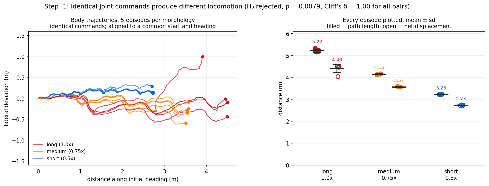
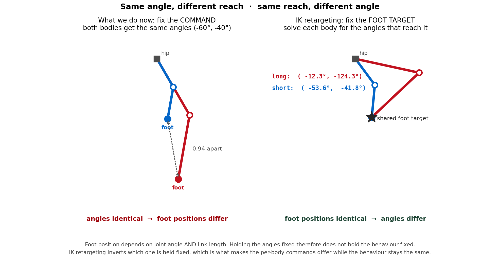
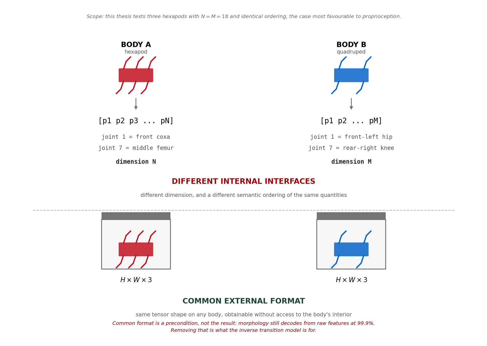
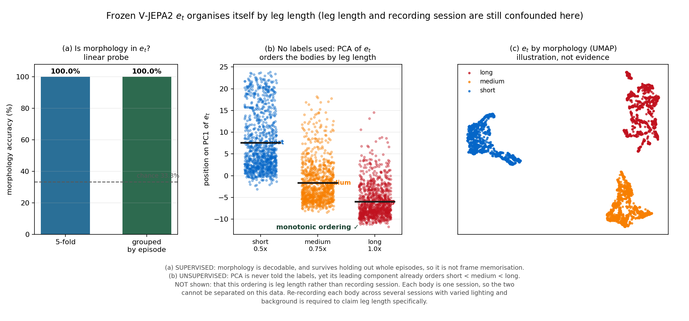
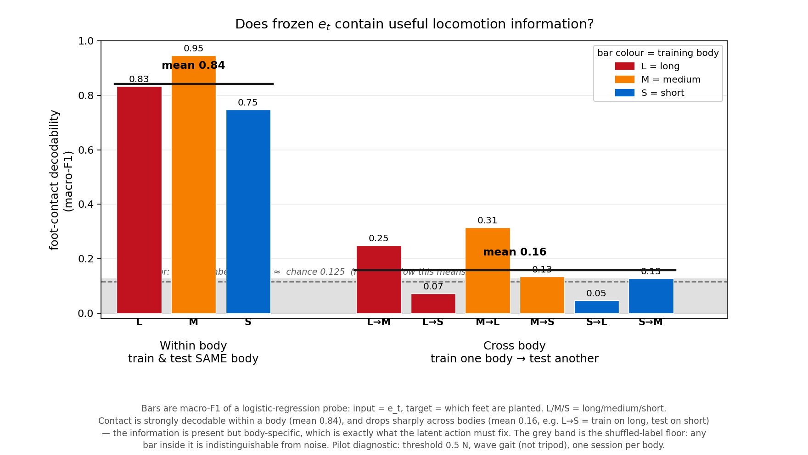
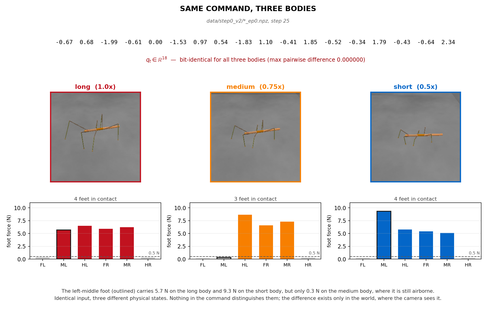

# Presentation — Cross-Morphology Locomotion via Visual Latent Action World Models
### Ideal / corrected deck (25 slides). Proposal, ~25 min, mixed committee (some new to the project).

Conventions used here:
- **Section label** (declarative) + **sub-headline** (a question when we are investigating, a statement when we are reporting a result).
- `[FIG: name]` marks which generated figure goes on the slide.
- `Speaker:` lines are for you, not the slide.
- Numbers are the regenerated / reproducible values (`report/NUMBERS.md`, `exp_*.md`). Report ranges, not false-precision decimals.

Section order (fixed so Literature Review is contiguous and Problem Formulation is not sandwiched inside it):
Background (2–4) → Literature Review (5–9) → Problem Formulation (10) → Research Question (11) → Method (12–16) → Evaluation (17) → Preliminary Results (18–20) → Final Protocol (21) → Outcomes (22) → Scope (23) → Product & Downstream Use (24) → Contributions (25). Backup (after 25): latent-vs-raw comparison.

---

## Slide 1 — Title

**Cross-Morphology Locomotion via Visual Latent Action World Models**

Disthorn Suttawet
6-month Work Integrated Learning internship, Vidyasirimedhi Institute of Science and Technology (VISTEC)
University advisor: Mr. Bawornsak Sakulkueakulsuk (FIBO, KMUTT)
Lab advisor: Prof. Poramate Manoonpong (Bio-inspired Robotics and Neural Engineering Lab, VISTEC)

🎤 **บทพูด:** "สวัสดีครับ/ค่ะ ผม/ดิฉัน ณ วันนี้จะมานำเสนอ proposal หัวข้อ Cross-Morphology Locomotion via Visual Latent Action World Models ครับ งานนี้เป็นส่วนหนึ่งของ Work Integrated Learning ที่ VISTEC โดยสั้นๆ คือ เราจะทำให้โมเดลเรียนรู้ 'ภาษากลาง' ที่อธิบายพฤติกรรมการเดินของหุ่นที่มีรูปร่างต่างกัน โดยใช้ 'ภาพ' เป็นตัวสังเกตหลัก เดี๋ยวผมจะไล่ตั้งแต่ปัญหา ทำไมต้องใช้เทคนิคนี้ วิธีการ เกณฑ์วัดผล และผลเบื้องต้นที่ทำมาแล้วครับ"

---

## Slide 2 — Background: A locomotion controller is fitted to one body

A locomotion controller maps the robot's current state to a motor command: **π : sₜ → aₜ**.
For the simulated stick insect, **aₜ ∈ ℝ¹⁸** (6 legs × 3 joints).

- Legged controllers are written in robot-specific variables: joint positions, torques, motor velocities, contact measurements. These work while the body is known and unchanged.
- Even when morphology is not given as an input, it is **baked into the controller through training**. The controller has learned not "how to walk" but "how *this* body walks."
- **When the body changes, the same numerical command can produce a different physical outcome.**

Bodies do not stay fixed: leg dimensions change between prototypes, payload and repair alter the dynamics, and one controller may need to run across related platforms.

The field calls this **cross-morphology locomotion transfer** (or cross-embodiment generalization):
**sₜ →(π) aₜ →(physical body, morphology m) sₜ₊₁**

Speaker: this is the setup slide. One sentence to land: the command is not the behaviour; the body sits between them.

🎤 **บทพูด:** "เริ่มจากพื้นฐานก่อนครับ หุ่นเดินได้เพราะมีสิ่งที่เรียกว่า controller หรือ policy — มันคือฟังก์ชันที่รับสภาพของหุ่นเข้าไป แล้วสั่งออกมาเป็นคำสั่งมอเตอร์ที่ข้อต่อ สำหรับแมลงกิ่งไม้ของเราคือ 18 ค่า จาก 6 ขา ขาละ 3 ข้อต่อ

ปัญหาคือ policy ตัวนี้มัน**ผูกติดกับร่างกายที่มันถูกเทรนมา** ถึงเราจะไม่ได้บอกมันตรงๆ ว่าร่างกายเป็นยังไง แต่ตอนเทรน มันซึมซับรูปร่างเข้าไปแล้ว มันไม่ได้เรียนว่า 'เดินยังไง' แต่เรียนว่า '**ร่างนี้**เดินยังไง' พอเปลี่ยนร่าง เช่น ขายาวขึ้น คำสั่งตัวเลขเดิมจะให้ผลทางกายภาพคนละแบบทันที

และร่างกายมันไม่ได้อยู่นิ่งครับ — prototype แต่ละตัวขายาวไม่เท่ากัน โดนซ่อม โดนเพิ่มน้ำหนัก dynamics ก็เปลี่ยน วงการเรียกปัญหานี้ว่า cross-morphology transfer ประโยคเดียวที่อยากให้จำจากสไลด์นี้คือ — **คำสั่ง ไม่ใช่ พฤติกรรม เพราะมีร่างกายคั่นอยู่ตรงกลาง**"

---

## Slide 3 — Background: Does morphology alone change the outcome? (Step −1)

**Question:** does changing leg length alone change locomotion when the motor command is held constant?

**H₀ (null): the locomotion outcomes are equivalent across morphologies.** If H₀ cannot be rejected, cross-morphology transfer is not yet a real problem in this setting, and nothing after this slide is worth building.

Setup: 3 *Medauroidea extradentata* variants in CoppeliaSim, identical topology and identical 18-D joint action space, differing only in leg length. All three receive a **bit-identical** command sequence. Body position is read directly from the simulator (ground truth, not inferred). Two distance measures are reported so the open-loop gait's side-to-side oscillation cannot be misread as a locomotion difference.


*Trajectories at true aspect ratio + per-episode dots with mean±sd.*

| Morphology | Path length (n=5) | Net displacement |
|---|---|---|
| Long, 1.0× | 5.217 ± 0.069 m | 4.404 ± 0.187 m |
| Medium, 0.75× | 4.149 ± 0.019 m | 3.569 ± 0.010 m |
| Short, 0.5× | 3.228 ± 0.011 m | 2.729 ± 0.011 m |

**Result — H₀ is rejected for all three pairs:** Mann-Whitney p = 0.0079, **Cliff's δ = 1.00** (every episode of the longer body exceeds every episode of the shorter one; distributions do not overlap). p = 0.0079 is the smallest value the test can return at n = 5, i.e. the strongest statement this sample size allows.

The gap is also not a rescaling: walking speed falls with roughly the **0.69 power** of leg length, not 1.0.

Speaker: the punchline is the stats line, not the table. "Same command, different outcome, and it does not overlap."

🎤 **บทพูด:** "ก่อนจะเสนออะไร ผมต้องพิสูจน์ก่อนว่า 'ปัญหามีจริง' สไลด์นี้คือการทดลองแรกสุด เราตั้งสมมติฐานว่าง (H-zero) ว่า 'ขายาว กลาง สั้น เดินได้เท่ากัน' — ซึ่งเป็นสิ่งที่เรา**อยากล้ม** ถ้าล้มไม่ได้ แปลว่าปัญหานี้ไม่มีจริง งานทั้งหมดก็ไม่ต้องทำ

เราสร้างแมลง 3 ตัวใน CoppeliaSim เหมือนกันทุกอย่าง ต่างแค่ความยาวขา แล้ว**สั่งด้วยคำสั่งชุดเดียวกันเป๊ะทุก bit** วัดระยะทางจาก simulator ตรงๆ

ผลคือ — ดูที่กราฟนะครับ สามกลุ่มแยกขาดจากกันเลย ขาสั้น 3.2 เมตร ขายาว 5.2 เมตร

ผมยืนยันด้วยสถิติสองตัว ตัวแรก **Mann-Whitney** — มันเป็นการทดสอบที่ถามว่า 'สองกลุ่มนี้ต่างกันจริง หรือบังเอิญ' ค่าที่ได้คือ **p** ซึ่งแปลว่า 'ถ้าจริงๆ แล้วมันเท่ากัน โอกาสที่จะสุ่มได้ข้อมูลแยกกันขนาดนี้มีเท่าไหร่' ของเราได้ **p เท่ากับ 0.0079 คือ 0.79 เปอร์เซ็นต์** น้อยมาก แปลว่าไม่ใช่บังเอิญ — ต่างกันจริง

ตัวที่สอง **Cliff's delta** — อันนี้วัด 'สองกลุ่มแยกขาดกันแค่ไหน' ค่าอยู่ระหว่าง 0 ถึง 1 โดย 1 คือแยกขาดสมบูรณ์ ของเราได้ **1.00 เต็ม** ซึ่งแปลว่า **ทุก episode ของขายาว เดินไกลกว่าทุก episode ของขาสั้น ไม่มีทับกันเลยแม้แต่ครั้งเดียว**

แล้วมีจุดหนึ่งที่ต้องอธิบายกันงง — ค่า p ทั้ง 3 คู่ได้เท่ากันเป๊ะที่ 0.0079 อันนี้ไม่ใช่บังเอิญนะครับ แต่เพราะที่ 5 ตัวอย่างต่อกลุ่ม การทดสอบมันมี**เพดาน** — 0.0079 คือค่าต่ำสุดที่มันคำนวณได้ พอทุกคู่แยกขาดสมบูรณ์เหมือนกัน มันเลยชนเพดานพร้อมกันทั้งสามคู่

ประโยคเดียวที่อยากให้จำ — **คำสั่งเดียวกัน ผลไม่เหมือนกัน และไม่ทับกันเลย** ปัญหามีจริงครับ"

---

## Slide 4 — Background: We need a middle language of locomotion change

The action space is already shared (all three are 18-D), yet the controller does not transfer. So what should carry across bodies?


*Use the LEFT panel here: same joint angles (−60°, −40°) put the foot 0.94 apart on long vs short. Same motor command ≠ same physical consequence. (The right panel is used on Slide 20.)*

- **Joint command** is too body-specific: `aₜ = [q₁ᵗᵃʳᵍᵉᵗ, …, q₁₈ᵗᵃʳᵍᵉᵗ]ᵀ`. Different bodies need different commands to realise the same behaviour.
- **A task label** (walk / turn) is too coarse to condition a dynamics model.

We want something **between** the two — an *observable locomotion event*: entering swing, establishing contact, transferring support, moving forward. Four properties we will **require and test** (design requirements, not established facts):

| Requirement | Meaning |
|---|---|
| Behavioural grounding | describes an observable locomotion change |
| Predictive sufficiency | with the current state, helps predict what happens next |
| Morphology robustness | similar behaviours stay comparable across bodies |
| Executability | retains enough information to recover body-specific motor commands |

Speaker: this frames the whole thesis — behaviour-level, not command-level, not task-level.

🎤 **บทพูด:** "ทีนี้มีจุดที่น่าคิดครับ — ทั้ง 3 ร่างใช้ action space เดียวกัน คือ 18 มิติเหมือนกันหมด แต่ controller ก็ยัง transfer ข้ามร่างไม่ได้ แล้วอะไรล่ะที่ควรถ่ายข้ามร่างได้

ดูรูปซ้ายครับ ถ้าเราสั่งมุมข้อต่อชุดเดียวกันบนขายาวกับขาสั้น เท้ามันไปตกคนละที่ ห่างกันเกือบ 1 เมตร — **คำสั่งมอเตอร์เดียวกัน ผลทางกายภาพคนละอย่าง**

เพราะงั้น 'คำสั่งข้อต่อ' มันเฉพาะเจาะจงกับร่างกายเกินไป ส่วน 'ป้ายงาน' อย่างคำว่า เดิน/เลี้ยว ก็หยาบเกินไปที่จะเอาไปป้อนโมเดล เราเลยอยากได้อะไรที่**อยู่ตรงกลาง** — เหตุการณ์การเคลื่อนไหวที่สังเกตเห็นได้ เช่น 'ยกเท้าเข้าสู่ช่วง swing' 'วางเท้าลงแตะพื้น' 'ถ่ายน้ำหนักระหว่างขา' สิ่งนี้แหละคือแกนของทั้ง thesis — เราจะเรียนภาษากลางที่**ระดับพฤติกรรม** ไม่ใช่ระดับคำสั่ง ไม่ใช่ระดับป้ายงาน และผมลิสต์คุณสมบัติ 4 ข้อที่มันต้องมีไว้ ซึ่งเราจะเอาไปทดสอบจริงทีหลัง"

---

## Slide 5 — Literature Review: Existing methods transfer by supplying information about the new body

| Strategy | Example | Main idea | Body-specific info required | Limitation |
|---|---|---|---|---|
| Per-body retraining | DreamerV3 (Hafner et al., 2023) | learn a new controller per body | new interactions, rewards, optimisation | training cost repeats per body |
| Morphology conditioning | QWM (Danesh et al., 2026) | condition policy/world-model on physical parameters | leg lengths, masses, torque limits, CAD/URDF/USD | assumes morphology is accurately known |
| Online system identification | — | infer hidden dynamics from recent history | proprioception, past commands, observed responses | needs the robot's internal signals + interaction |
| Shared policy + per-robot adapters | L3P (Zheng et al., 2025) | shared backbone, per-robot encoder/decoder | sensor definitions, joint ordering, actuator conventions | a new adapter must still be fitted per platform |

**Common structure:** all obtain body information through at least one of three channels — **Design specification ∨ Internal sensing ∨ New interaction**.

**Shared assumption:** *the learner has access to an internal description of the body.*

🎤 **บทพูด:** "ทีนี้มาดูว่าวงการเขาแก้ปัญหานี้ยังไงกันบ้างครับ ในตารางมีหลายวิธี แต่ผมอยากให้มองภาพรวมมากกว่าจำทีละอัน

บางวิธีเลือก**เทรนใหม่ทุกร่าง**ไปเลย อย่าง DreamerV3 — ได้ผลดีแต่จ่ายค่าเทรนซ้ำทุกตัว บางวิธี**บอกร่างกายให้โมเดลตรงๆ** อย่าง QWM ที่อ่านความยาวขากับมวลจากไฟล์ CAD แล้วป้อนเข้าไป บางวิธี**ให้หุ่นขยับแล้วเดาค่าร่างกายเอง**จากการเคลื่อนไหวล่าสุด และบางวิธี**แชร์ policy หลักไว้ แล้วต่อหัวเล็กๆ เฉพาะแต่ละร่าง** อย่าง L3P

แต่ละวิธีต่างกันในรายละเอียด — แต่ถ้าถอยมามองภาพรวม **ทุกวิธีมีสิ่งหนึ่งเหมือนกัน** คือมันต้องได้ข้อมูลร่างกายมาจากช่องทางใดช่องทางหนึ่ง: ไฟล์สเปก, เซนเซอร์ในตัว, หรือการลองขยับ

พูดอีกแบบ — **ทุกวิธีสมมติว่าเราเข้าถึง 'ข้อมูลภายใน' ของร่างกายได้** จำประโยคนี้ไว้นะครับ เพราะช่องว่างของงานเราจะโผล่มาจากตรงนี้ — แล้วถ้าเราเข้าไม่ถึงข้างในล่ะ"

---

## Slide 6 — Literature Review: Research gap — the body is observable but not described

Prior strategies work when at least one is available: an accurate geometric/dynamic model, known joint/actuator conventions, proprioceptive/force measurements, permission to collect new interaction data, or time to retrain.

**Research gap:** *Can visual transitions provide a shared, behaviour-level representation across morphology changes — and how does it compare with proprioception?*

Why this gap is real:
- Even for a lab robot, CAD/URDF/motor specs are an approximation. The *documented* body is what we believe it has; the *physical* body is what actually moves. QWM concedes this by routing "unmodeled real-world residuals" through a separate latent.
- Motivating cases: animals, and undocumented / repaired / payload-changed hardware whose real parameters no longer match their design files.
- We may observe how a system walks while having no access to its joint encoders, actuator commands, or exact dynamics.
- Across substantially different bodies, proprioceptive vectors differ in dimension, ordering, units, and semantics. **External vision offers a common observation format.**

*If the body cannot be described directly, perhaps its dynamics can be inferred from how its observable state changes over time.*

🎤 **บทพูด:** "จากสไลด์ที่แล้ว ทุกวิธีต้องการ 'คำอธิบายภายใน' ของร่างกาย — แต่**ถ้าเราไม่มีล่ะ?** นี่คือช่องว่างที่งานนี้จับ

คำถามวิจัยคือ — 'การเปลี่ยนแปลงเชิงภาพ' จะเป็นตัวแทนพฤติกรรมที่ถ่ายข้ามร่างได้ไหม และเทียบกับ proprioception แล้วเป็นยังไง

ทำไมช่องว่างนี้ถึงสำคัญจริงครับ — หนึ่ง ต่อให้เป็นหุ่นในแล็บ ไฟล์ CAD ก็เป็นแค่ค่าประมาณ ร่างที่ 'เขียนไว้' กับร่างที่ 'เดินจริง' ไม่เหมือนกัน มีการสึกหรอ มีน้ำหนักเพิ่ม สอง กรณีจริงเช่น สัตว์ หรือหุ่นที่ไม่มีเอกสาร เราเห็นมันเดินได้ แต่เข้าไม่ถึง encoder ข้อต่อข้างในเลย และสาม พอร่างต่างกันมากๆ เวกเตอร์ proprioception มันคนละมิติ คนละลำดับ คนละความหมาย แต่**ภาพจากภายนอกให้ format เดียวกันเสมอ**

สรุปคือ — ถ้าอธิบายร่างกายตรงๆ ไม่ได้ บางทีเราอาจอนุมาน dynamics ได้จาก 'การที่สภาพที่มองเห็นเปลี่ยนไปตามเวลา' แทน"

---

## Slide 6B — Literature Review: Where the observer idea sits — the gap, filled

Slide 6 said the body is **observable but not described**. This is the payoff table: the same prior strategies as Slide 5, now with our approach added as the bottom row, so the contrast is visual (Beam-style).

The single axis that matters: **to place a *new* body into a shared representation, does the method need a description of that body's internals — or only a view of it moving?**

| Approach | To slot in a *new* body, it needs | Needs the body's internal description |
|---|---|:--:|
| Per-body retraining — DreamerV3 | a full retrain: new interaction + a reward | — (retrains, no sharing) |
| Morphology conditioning — QWM | accurate CAD/URDF params (leg lengths, masses) | **✓** |
| Online system identification | recent proprioceptive + command history | **✓** |
| Shared policy + adapters — L3P | that body's sensor/joint conventions | **✓** |
| **This work — visual latent action** | **a video of it moving** | **✗** |

**Bottom line:** every prior method needs the body's **internal description** — a spec file, sensor semantics, or joint conventions — before it can place that body in a shared structure. Those are exactly what you do **not** have for an animal, an undocumented robot, or a worn/repaired one. We place a body from **external video alone.**

**⚠️ Honest scope (say this if asked "but don't you need the new body's joint commands?"):** yes — to make the new body *execute*, the motion decoder still outputs its 18-D motor command, like any controller. But that command is obtained as **ordinary logged interaction** (a decoder-supervision signal), **not from a kinematic model of the body**, and adaptation needs **fewer** such samples (Slide 24). "Observation only" describes how we learn and test the shared, morphology-agnostic representation — not a claim that the body is never commanded.

Speaker: point at the last row. "Everyone above needs a description of the body's insides; we need only a view of its outside." If asked about actions, use the honest-scope line — don't dodge it, it's a strength: we need commands as supervision, not a body model, and fewer of them.

🎤 **บทพูด:** "สไลด์ก่อนหน้าบอกว่า ร่างกาย 'มองเห็นได้ แต่อธิบายไม่ได้' — สไลด์นี้คือ**ตารางสรุปว่าไอเดีย observer ของเราไปเติมช่องว่างตรงไหน** เอาวิธีเดิมจากสไลด์ 5 มาเรียง แล้วเติมแถวล่างสุดเป็นของเรา

แกนเดียวที่ต้องดูคือ — **เวลาจะเอาร่างใหม่มาใส่ในตัวแทนร่วม (shared representation) วิธีนั้นต้องรู้ 'ข้างใน' ของร่างนั้นไหม หรือแค่ 'ดูมันขยับ' ก็พอ** QWM ต้องมีไฟล์ CAD ที่แม่นยำ, online system-ID ต้องอ่าน proprioception ย้อนหลัง, L3P ต้องรู้ convention เซนเซอร์ของร่างนั้น — ทั้งหมดนี้ต้องรู้ **'คำอธิบายภายใน'** ของร่างก่อน ซึ่งเป็นสิ่งที่เรา**ไม่มี**สำหรับสัตว์ หุ่นที่ไม่มีเอกสาร หรือหุ่นที่สึกหรอ ส่วนของเรา — วางร่างใหม่ลงในพื้นที่ร่วมได้จาก**วิดีโอที่มันเดิน**อย่างเดียว

**แต่ตรงนี้ต้องพูดให้ตรงครับ** เผื่อกรรมการถามว่า 'อ้าว แล้วไม่ต้องใช้คำสั่งข้อต่อของร่างใหม่เหรอ' — **ต้องใช้ครับ** ตอนจะให้ร่างใหม่**เดินจริง** motion decoder มันก็ต้องพ่นคำสั่งมอเตอร์ 18 ค่าออกมา เหมือน controller ทุกตัว แต่จุดต่างคือ — คำสั่งนั้นเราได้มาจาก**การบันทึกการขยับธรรมดา** (เป็นแค่สัญญาณสอน decoder) **ไม่ใช่จากโมเดลจลนศาสตร์ของร่างกาย** และเราต้องใช้มัน**น้อยลง** (เดี๋ยวโชว์ที่สไลด์ 22) เพราะงั้นคำว่า 'ใช้แค่การสังเกต' มันหมายถึง **วิธีที่เราเรียนและทดสอบตัวแทนที่ไม่ผูกกับรูปร่าง** ไม่ได้แปลว่าร่างนั้นไม่เคยถูกสั่งเลย

พูดง่ายๆ — ทุกวิธีข้างบนต้องรู้ 'ข้างในร่าง' ก่อน ของเราขอแค่ 'มองร่างจากข้างนอก' ถ้าโดนถามเรื่อง action อย่าเลี่ยงนะครับ ตอบตรงๆ ว่าเราใช้ action เป็นแค่สัญญาณสอน ไม่ใช่โมเดลร่างกาย และใช้น้อยกว่า — อันนี้เป็นจุดแข็ง ไม่ใช่จุดอ่อน"

---

## Slide 7 — Literature Review: Why test vision when proprioception is available?

This thesis does **not** assume vision is superior. It tests whether vision can recover a transferable behaviour representation, and compares it against proprioception.

Most locomotion systems use proprioception (joint angles, joint velocities, IMU, foot forces, motor states). These are powerful but **body-internal and convention-specific** — proprioception reports the internal command/state.

Vision is different — it reports the **external consequence**: same input format on any body, external, needs no joint conventions or CAD, captures what happened in the world.


*Body A / Body B: **different internal interfaces → common external format** (plain-text vectors with index meanings, then identical H×W×3).*

But vision is also the **harder** setting, and we say so up front: a camera sees morphology very clearly. In the current pilot, raw V-JEPA2 features decode morphology at **around 100%**.

*Can the latent action model extract behaviour-relevant change from visual features that strongly contain body shape?*

Speaker note (only if asked "why not just remap the indices?"): remapping needs documentation of both bodies — exactly what the access argument on Slide 6 assumes is missing.

🎤 **บทพูด:** "ตรงนี้ต้องพูดให้ชัดครับ เพราะเป็นคำถามที่กรรมการน่าจะถาม — งานนี้**ไม่ได้อ้างว่า vision ดีกว่า proprioception** เราแค่ทดสอบว่า vision ทำได้ไหม แล้วเอาไปเทียบกัน

ระบบเดินส่วนใหญ่ใช้ proprioception — มุมข้อต่อ ความเร็ว IMU แรงที่เท้า มันทรงพลังนะครับ แต่มันเป็นข้อมูล**ภายในตัว** และผูกกับ convention เฉพาะร่าง ส่วน vision ต่างตรงที่มันรายงาน**ผลลัพธ์ภายนอก** — format เดียวกันบนทุกร่าง ไม่ต้องรู้ convention ข้อต่อ ไม่ต้องมี CAD

ดูรูปครับ ร่าง A กับ B ข้างในต่างกัน — เวกเตอร์คนละมิติ คนละลำดับ แต่พอมองจากกล้อง ได้ภาพ format เดียวกัน

**แต่**ผมพูดตรงๆ ว่า vision เป็นสนามที่**ยากกว่า** เพราะกล้องมันเห็นรูปร่างชัดมาก — ใน pilot ของเรา ฟีเจอร์ดิบจาก V-JEPA2 ทายรูปร่างได้เกือบ 100 เปอร์เซ็นต์ เพราะงั้นคำถามคือ — โมเดลจะดึง 'การเปลี่ยนแปลงเชิงพฤติกรรม' ออกมาจากฟีเจอร์ที่เต็มไปด้วยรูปร่างได้ไหม นั่นคือโจทย์ที่ latent action ต้องแก้"

---

## Slide 8 — Literature Review: Why a world model?

A world model is a learned simulator. The feature that matters here is that **it must predict consequences**.

It learns how actions produce transitions by approximating the environment's dynamics: **ŝₜ₊₁ = F_θ(sₜ, aₜ)**.
For visual input, images become compact features first: **eₜ = E(oₜ)**, and the transition model predicts **êₜ₊₁ = F_θ(eₜ, aₜ)**, trained by **L_pred = ‖êₜ₊₁ − eₜ₊₁‖²**.

We use a world model not mainly to imagine rollouts, but because **transition prediction is an objective test** of whether an action representation captures meaningful locomotion change.

`[FIG: DreamerV3 paper figure]` — Mastering Diverse Domains through World Models (Hafner et al., 2023). One algorithm, one hyperparameter set, 150+ domains.
*Limitation for us:* a model per domain, explicit action labels throughout, nothing carries across bodies — and it conditions on the robot's native command aₜ, whose physical meaning changes with morphology.

🎤 **บทพูด:** "แล้วทำไมต้องใช้ world model ครับ — world model คือ 'ตัวจำลองที่เรียนรู้เอง' หัวใจที่สำคัญกับงานเราคือ **มันต้องทำนายผลลัพธ์ได้** คือรับสภาพตอนนี้กับ action แล้วทำนายสภาพถัดไป

สำหรับภาพ เราแปลงเป็นฟีเจอร์ก่อน (e-t) แล้วให้โมเดลทำนายฟีเจอร์ของเฟรมถัดไป เทรนด้วยการเทียบว่าทายใกล้ของจริงแค่ไหน

เหตุผลที่เราใช้ world model ไม่ใช่เพื่อจินตนาการ rollout เป็นหลัก แต่เพราะ **การทำนายการเปลี่ยนผ่านคือ 'บททดสอบเชิงวัตถุวิสัย'** ว่า action representation ของเราจับการเคลื่อนไหวที่มีความหมายได้จริงไหม — ถ้า z-t ดีจริง มันต้องช่วยทำนายเฟรมถัดไปได้

ตัวอ้างอิงคือ DreamerV3 ครับ อัลกอริทึมเดียว ครอบคลุมกว่า 150 โดเมน แต่**ข้อจำกัดสำหรับเราคือ** — มันเทรนโมเดลแยกต่อโดเมน ต้องมี action label ตลอด และที่สำคัญ มันใช้ 'คำสั่งดั้งเดิมของหุ่น' เป็นตัว condition ซึ่งความหมายทางกายภาพของคำสั่งนั้นเปลี่ยนตามรูปร่าง — นั่นคือจุดที่เราต้องแก้ในสไลด์ถัดไป"

---

## Slide 9 — Literature Review: What should the world model treat as an action?

Standard formulation: **(eₜ, aₜ) → eₜ₊₁**. But across morphologies, **aₜ = same numerical command → eₜ₊₁ − eₜ = different physical change**.

So instead of assuming the native command is the shared action, we ask whether an intermediate variable can be inferred from the observed transition: **(eₜ, eₜ₊₁) → zₜ**.

`[FIG: LAC-WM paper figure]` — **LAC-WM (Huang et al., ICML 2026)** discards explicit action labels as the conditioning signal. An inverse model infers an abstract action z from consecutive observations; the world model is conditioned on z rather than any robot's native command. One latent space then covers several embodiments, and adding embodiments improves it rather than fragmenting it.

*(Citation verified: Huang Huang et al., "Cross-Embodiment Robot Foundation World Models with Latent Actions" (LAC-WM), ICML 2026.)*

- **LAC-WM's setting:** different robots have genuinely different action *formats*.
- **This project's setting:** robots share the same 18-D action format, **but the same 18-D command has a different dynamics meaning per body.** That is the gap we adapt the idea to.

🎤 **บทพูด:** "จากสไลด์ที่แล้ว ปัญหาคือคำสั่งดั้งเดิมเป็นตัว condition ที่ไม่ดีข้ามร่าง แบบมาตรฐานคือ (e-t, a-t) ทำนาย e-t+1 แต่ข้ามร่างแล้ว a-t เดิม ให้การเปลี่ยนแปลงคนละแบบ

เพราะงั้น แทนที่จะสมมติว่าคำสั่งดั้งเดิมคือ action ร่วม เราถามว่า — มีตัวแปรตรงกลางที่**อนุมานได้จากการเปลี่ยนผ่านที่สังเกตเห็น**ไหม เราเรียกมันว่า z-t คือดูจากเฟรมก่อนกับเฟรมหลัง แล้วอนุมานว่า 'เกิดอะไรขึ้นระหว่างสองเฟรมนี้'

อันนี้อ้างอิงจาก paper ชื่อ LAC-WM ของ Huang และคณะ ICML 2026 — เขาทิ้ง action label ทิ้ง แล้วให้ inverse model อนุมาน action นามธรรมจากภาพสองเฟรมแทน แล้ว condition world model ด้วยตัวนั้น ทำให้ latent space เดียวครอบคลุมหลายร่าง และยิ่งเพิ่มร่าง โมเดลยิ่งดีขึ้น ไม่แตกกระจาย

**จุดต่างของงานเรา** — LAC-WM ใช้กับหุ่นที่ action format ต่างกันจริงๆ แต่ของเรา ทั้ง 3 ร่างใช้ format 18 มิติเหมือนกัน **แต่คำสั่ง 18 มิติเดียวกัน ให้ dynamics คนละแบบต่อร่าง** นี่คือช่องว่างที่เราเอาไอเดียนี้มาปรับใช้ครับ"

---

## Slide 10 — Problem Formulation: External observation shows the consequences of hidden body dynamics

An observer records a sequence **o₁, o₂, …, o_T**, where oₜ is an external observation of the body at time t.

A single observation reveals body shape, limb configuration, approximate pose, foot locations, surrounding terrain. It does **not** give exact link lengths, masses, actuator limits, or internal sensor readings — but it gives the **visible consequences** of those hidden properties.

A single image says what the system looks like. A **transition** between images says how it behaves: **Oₜ, aₜ → Oₜ₊₁** reveals which limbs move, which feet enter/leave contact, how the body responds to support, whether it progresses or slips, how balance changes.

The learning problem becomes **sₜ₊₁ = f_m(sₜ, aₜ)**: the morphology m may be unknown but it shapes the observable transition.
*This changes the problem from body description to transition prediction.*

🎤 **บทพูด:** "สไลด์นี้คือการฟอร์มโจทย์ให้เป็นทางการครับ สมมติมีผู้สังเกตบันทึกลำดับภาพ o-1 ถึง o-T

ภาพเดียวบอกเราได้ว่า **หน้าตา** ระบบเป็นยังไง — รูปร่าง ตำแหน่งขา พื้นรอบๆ แต่มันไม่บอกความยาวลิงก์ มวล หรือค่าเซนเซอร์ภายในเลย — มันให้แค่ '**ผลลัพธ์ที่มองเห็น**' ของค่าที่ซ่อนอยู่พวกนั้น

แต่พอเป็น **การเปลี่ยนผ่านระหว่างสองภาพ** — จากเฟรมนี้ไปเฟรมถัดไป — มันบอก **พฤติกรรม** ได้: ขาไหนขยับ เท้าไหนแตะ/หลุดพื้น ตัวตอบสนองยังไง เดินไปข้างหน้าหรือลื่น สมดุลเปลี่ยนยังไง

โจทย์การเรียนรู้เลยกลายเป็น s-t+1 เท่ากับ f-m ของ (s-t, a-t) — รูปร่าง m อาจไม่รู้ค่า แต่มันกำหนดการเปลี่ยนผ่านที่มองเห็น ประเด็นสำคัญคือ — **เราเปลี่ยนโจทย์จาก 'อธิบายร่างกาย' เป็น 'ทำนายการเปลี่ยนผ่าน'** ซึ่งอันหลังทำได้จากการสังเกตล้วนๆ"

---

## Slide 11 — Research Question: Can observable locomotion change become a shared action representation?

**Primary question.** Can a latent action inferred from visual state transitions preserve behaviour-relevant locomotion information while reducing morphology-specific information across different leg lengths?

**Secondary question.** How does the visual latent representation compare with raw visual features, native joint commands, and proprioceptive observations?

| Testable hypothesis | Statement |
|---|---|
| **H1 — Behavioural information** | Foot-contact / support-transition is decodable from zₜ (behaviour is preserved). |
| **H2 — Reduced morphology dependence** | Morphology is **less** recoverable from zₜ than from the raw visual features eₜ. |
| **H3 — Predictive sufficiency** | (eₜ, zₜ) predicts eₜ₊₁ (the latent action explains the visual transition). |
| **H4 — Added value over native commands** | A latent-conditioned dynamics model is compared against one conditioned on the 18-D command. If the native-command model does equally well across morphologies, the latent action may be unnecessary in this controlled setting. |

**\*Success is not "vision wins."** The intended result is a scientific comparison: which information source produces the most transferable behaviour representation, under which assumptions, and at what cost.

🎤 **บทพูด:** "รวบเป็นคำถามวิจัยครับ คำถามหลักคือ — latent action ที่อนุมานจากการเปลี่ยนผ่านเชิงภาพ จะ**เก็บข้อมูลพฤติกรรมไว้ได้ พร้อมกับลดข้อมูลรูปร่างลง**ไหม ข้ามความยาวขาที่ต่างกัน คำถามรองคือเอาไปเทียบกับฟีเจอร์ภาพดิบ คำสั่งข้อต่อ และ proprioception เป็นยังไง

ผมแตกเป็น 4 สมมติฐานที่ทดสอบได้ — H1 พฤติกรรมยัง decode จาก z-t ได้ H2 รูปร่าง decode จาก z-t ได้**น้อยลง**กว่าฟีเจอร์ดิบ H3 (e-t, z-t) ทำนายเฟรมถัดไปได้ และ H4 ที่สำคัญ — เอาไปเทียบกับโมเดลที่ใช้คำสั่ง 18 มิติดิบ ถ้าคำสั่งดิบทำได้ดีพอกัน แปลว่า latent อาจไม่จำเป็นในเซ็ตอัพนี้

ย้ำดอกจันไว้เลยครับ — **ความสำเร็จไม่ใช่ 'vision ชนะ'** เป้าหมายคือการเปรียบเทียบเชิงวิทยาศาสตร์: แหล่งข้อมูลไหนให้ตัวแทนพฤติกรรมที่ถ่ายข้ามร่างได้ดีที่สุด ภายใต้สมมติฐานอะไร และแลกด้วยต้นทุนเท่าไหร่ ต่อให้ผลออกมาลบก็เป็นผลวิจัยที่มีค่า"

---

## Slide 11B — Overview: the whole idea in one picture

We have shown the problem is real (Step −1) and posed the question. **Before the detailed pipeline, here is the whole approach in one picture.**

Instead of describing a new body **from the inside** (its link lengths, masses, sensors), we **watch it from the outside** and let a model read off *what it is doing*.

`[FIG: observer_arc — draw in slides]` One left-to-right arc, four stages, arrows labelled underneath:

```
 ┌─────────────┐      ┌──────────────┐      ┌───────────┐      ┌──────────────┐
 │  video of a │      │      👁       │      │    🧬     │      │  new body,   │
 │ body walking│ ───► │   OBSERVER   │ ───► │  zₜ code  │ ───► │ diff. shape, │
 │ (long legs) │      │ reads what   │      │ "behaviour│      │ same walk    │
 │             │      │ it's DOING,  │      │  gene"    │      │ (medium/short│
 │             │      │ not its shape│      │           │      │  legs)       │
 └─────────────┘      └──────────────┘      └───────────┘      └──────────────┘
      input             ── Observe ──         ── Encode ──        ── Transfer ──
```
*Show a long-leg silhouette entering on the left and a medium/short silhouette on the right, to make "same behaviour, different body" literal. This same figure doubles as the validation-pipeline picture Ajan Go asked for.*

Three claims this talk defends — one per arrow:
1. **Observe.** Behaviour can be captured externally, from video alone — no joint encoders, no CAD.
2. **Encode.** The observer's code keeps the **behaviour** (foot contact, support transfer) …
3. **Transfer.** … while dropping the **body shape**, so the code carries to an **unseen morphology**.

The mechanism that turns "observe" into "predict the next observation" is a **world model**; the compact code we extract from it is the **latent action**. Both are introduced properly later — this slide is only the map.

Speaker: this is the map for everything that follows. The pipeline slides after this detail each block; the preliminary results test whether each arrow holds. Say the arc out loud once, slowly, then go into the pipeline.

🎤 **บทพูด:** "ก่อนลงรายละเอียด ผมขอวางภาพรวมทั้งงานไว้ในสไลด์เดียวก่อนครับ — ไอเดียหลักคือ แทนที่เราจะไป**เปิดร่างกายดูข้างใน** ว่าขายาวเท่าไหร่ มวลเท่าไหร่ เซนเซอร์อะไรบ้าง เรา**มองมันจากภายนอก** คือดูมันเคลื่อนไหวเฉยๆ

ดูตามลูกศรนะครับ — เริ่มจาก **วิดีโอ**ของร่างที่กำลังเดิน ป้อนเข้า **ตัวสังเกต (observer)** หน้าที่ของมันคือ**อ่านว่าร่างนั้นกำลังทำพฤติกรรมอะไร ไม่ใช่จำว่าร่างหน้าตายังไง** แล้วบีบพฤติกรรมนั้นออกมาเป็น**โค้ดสั้นๆ** ตัวหนึ่ง — ผมชอบเรียกมันว่า '**จีน**' ของพฤติกรรม — จากนั้นเราเอาจีนตัวนี้ไป**ถ่ายให้ร่างที่รูปร่างต่างออกไป** แล้วให้มันทำพฤติกรรมเดียวกันได้

ทั้ง talk นี้ผมกำลังจะพิสูจน์ 3 ข้อ ข้อละลูกศร — หนึ่ง พฤติกรรม**สังเกตจากภาพภายนอกได้จริง** ไม่ต้องแกะข้อต่อ สอง โค้ดที่ได้**เก็บพฤติกรรมไว้** เช่นจังหวะแตะพื้น การถ่ายน้ำหนัก และสาม โค้ดนั้น**ทิ้งรูปร่างทิ้ง** เลยถ่ายข้ามไปร่างที่ไม่เคยเห็นได้ กลไกที่ทำให้ 'สังเกต' กลายเป็น 'ทำนายเฟรมถัดไป' เราเรียกว่า world model และโค้ดที่ดึงออกมาคือ latent action — เดี๋ยวผมอธิบายทั้งสองอย่างละเอียดทีหลัง สไลด์นี้เป็นแค่แผนที่ครับ"

---

## Slide 12 — Method: Data source and pre-processing

`[FIG: pipeline diagram, stages 1–2 highlighted, 3–6 greyed]`

- **Simulator (CoppeliaSim 4.10) → camera sensor → RGB frame 256×256×3.**
- Consecutive frames fₜ, fₜ₊₁ → **frozen V-JEPA2 RGB tokenizer** → per-frame embeddings **eₜ, eₜ₊₁ ∈ ℝ²⁵⁶ˣ¹⁴⁰⁸** (256 patch tokens × 1408).
- In parallel, a **joint logger** records the logged joint-position target **aₜ ∈ ℝ¹⁸** that caused the transition.
- Each RGB frame and joint command are recorded in the **same simulation step**, so aₜ corresponds to the observed transition oₜ → oₜ₊₁.

Speaker: this is the "where the data comes from" slide; the trainable part is greyed and expanded on Slide 14.

🎤 **บทพูด:** "ก่อนเทรนอะไร เราต้องมีข้อมูลก่อน สไลด์นี้คือ 'ข้อมูลมาจากไหน' ครับ

เริ่มจาก simulator เราวางกล้องมองหุ่นเดิน แต่ละ step ถ่ายภาพ RGB ออกมา ขนาด 256 คูณ 256 จากนั้นเอา**สองเฟรมติดกัน** — เฟรมตอนนี้กับเฟรมถัดไป — ป้อนเข้า V-JEPA2 ซึ่งเป็น encoder ที่แปลงภาพเป็นเวกเตอร์ตัวเลขที่สรุปว่าในภาพมีอะไร ได้ออกมาเป็น e-t กับ e-t+1 รายละเอียดของ V-JEPA2 อยู่สไลด์ถัดไป

**พร้อมกันนั้น** เราจดคำสั่งข้อต่อ a-t ที่ส่งให้หุ่นใน step เดียวกันไว้ด้วย จุดสำคัญคือ **ภาพกับคำสั่งถูกจดพร้อมกันใน step เดียว** เพราะงั้นคำสั่ง a-t มัน 'ตรงกับ' การเปลี่ยนแปลงที่เห็นในภาพ นี่คือคู่ข้อมูลที่โมเดลต้องการ — ดูภาพเปลี่ยน แล้วรู้ว่าคำสั่งอะไรทำให้มันเปลี่ยน

สไลด์นี้โชว์แค่ครึ่งหน้า ส่วนที่จางไว้คือส่วนที่ต้องเทรน เดี๋ยวขยายทีหลัง ตอนนี้ขอเจาะที่ V-JEPA2 ก่อนครับ"

---

## Slide 13 — Method: Frozen front-end (V-JEPA2)

V-JEPA2 is self-supervised on ~1 million hours of video with an objective that predicts masked content in **representation space**, which rewards motion-relevant features — a reasonable starting point for gait.

We adopt V-JEPA2's frozen RGB tokenizer as the visual encoder, extracting per-frame **eₜ ∈ ℝ²⁵⁶ˣ¹⁴⁰⁸** with **no fine-tuning**. These feed the ITM and FTM, which learn the shared latent action zₜ.

`[FIG: V-JEPA2 encoder figure + patch pipeline]`
frameₜ ∈ ℝ²⁵⁶ˣ²⁵⁶ˣ³ → **patch split** (256×256 ÷ 16 = 16×16 grid → 256 patches) → **positional embedding** → **ViT transformer (frozen)** → **eₜ ∈ ℝ²⁵⁶ˣ¹⁴⁰⁸**. Weights come from 1M hours of video + 1M images.

Whether these frozen features actually contain locomotion information is tested empirically (Slide 18), not assumed.

🎤 **บทพูด:** "V-JEPA2 คือ encoder ภาพที่เราใช้ครับ มันถูกเทรนแบบ self-supervised บนวิดีโอประมาณ 1 ล้านชั่วโมง ด้วยวิธีที่เรียกว่า — ปิดบางส่วนของภาพไว้ แล้วให้ทำนาย '**ตัวแทนเชิงนามธรรม**' ของส่วนที่ปิด ไม่ใช่ทำนาย pixel ตรงๆ ข้อดีคือมันถูกบังคับให้จับฟีเจอร์ที่เกี่ยวกับ 'การเคลื่อนไหว' ซึ่งเหมาะกับงาน gait ของเรา

เราเอา encoder ตัวนี้มาใช้แบบ **frozen** คือไม่เทรนต่อเลย ดึงฟีเจอร์ต่อเฟรมออกมา 256 patch token ขนาด 1408

ดูแถบล่างครับ กระบวนการคือ — ภาพ 256 คูณ 256 หั่นเป็น patch เล็กๆ 16 คูณ 16 ได้ 256 ชิ้น ใส่ตำแหน่งเข้าไป แล้วผ่าน ViT transformer ที่ frozen ออกมาเป็นเวกเตอร์ e-t น้ำหนักทั้งหมดมาจากการเทรนบนวิดีโอ 1 ล้านชั่วโมง บวกภาพ 1 ล้านรูป

แต่ผมย้ำว่า — **เราไม่เชื่อลอยๆ** ว่าฟีเจอร์พวกนี้มีข้อมูล locomotion เราทดสอบจริงในสไลด์ผลเบื้องต้น เดี๋ยวจะเห็นครับ"

---

## Slide 14 — Method: How zₜ is learned

`[FIG: full pipeline diagram, stages 3–6 visible]`

- **ITM (Inverse Transition Model)** = infer zₜ from the observed change eₜ → eₜ₊₁.
- **FTM (Forward Transition Model)** = test whether zₜ explains the next visual state.
- **Motion Decoder (MD)** = keep zₜ connected to executable joint commands.

Signals: ITM updates from **both** objectives through zₜ (z takes gradient both ways). Reconstruction loss **L_recon = ‖êₜ₊₁ − eₜ₊₁‖²** is computed in embedding space, so **no pixel decoder is needed**. Motion loss **L_motion = ‖âₜ − aₜ‖²** uses the logged joint targets.

**Keep the Motion Decoder's weights after pretraining** — it is the module that maps a latent action back to a body-specific joint command, so it carries the "executability" property (Slide 4) and is the bridge to any later control use. (It is *not* discarded.)

**How to read the whole pretraining phase (one paragraph):** the **world model itself is the FTM** — it predicts the **next visual embedding** êₜ₊₁. The "map back to a real joint command" is a **side head (the Motion Decoder)** that keeps the latent *executable*; it is not the world model. **Both train together**, so during pretraining we **do** feed the paired joint command **aₜ** for the two training bodies (long + short) — we have it, generated by IK in simulation — as the **decoder's supervision target**. So pretraining is **not 100% action-free**: it is **observation-driven, with aₜ as a supervision signal**, not as a world-model input. What we walk away with is a **world model whose latent zₜ is behaviour-grounded and shared across the 2 morphologies.**

🎤 **บทพูด:** "นี่คือหัวใจของวิธีการครับ เรามีเวกเตอร์ภาพจากเมื่อกี้แล้ว ทีนี้จะเรียน latent action z-t มี 3 โมดูลเล็กๆ ทำงานร่วมกัน

**หนึ่ง ITM — Inverse Transition Model** ดูภาพก่อนกับภาพหลัง แล้วถามว่า 'เกิดอะไรขึ้นระหว่างนั้น' คำตอบคือ z-t เหมือนดู before-after แล้วเดาว่าขยับอะไร **สอง FTM — Forward Transition Model** เป็นตัวเช็ก เราให้ภาพก่อนกับ z-t แล้วให้มัน**ทำนายภาพหลัง** ถ้า z-t จับได้จริง การทำนายต้องถูก **สาม Motion Decoder** ทำหน้าที่ยึด z-t ไว้กับความจริง คือแปลง z-t กลับเป็นคำสั่งข้อต่อจริง กันไม่ให้ z-t กลายเป็นอะไรที่ไร้ความหมาย

จุดฉลาดคือ — **z-t อยู่ตรงกลางแล้วโดนดึงจากทั้งสองเป้าหมายพร้อมกัน** มันต้องทั้งอธิบายภาพถัดไปได้ และเชื่อมกับคำสั่งจริงได้ นั่นแหละที่บังคับให้มันเป็น action code ที่ใช้ได้จริง

สองจุดเล็กแต่สำคัญ — reconstruction loss วัดใน**ปริภูมิเวกเตอร์ ไม่ใช่ pixel** เลยไม่ต้องสร้างภาพกลับ ประหยัดมาก และเรา**เก็บ Motion Decoder ไว้หลังเทรน** เพราะมันคือตัวที่แปลง latent action กลับเป็นคำสั่งเฉพาะร่าง เป็นสะพานไปสู่การควบคุมจริง — ไม่ได้ทิ้งครับ (อันนี้ตอบ feedback อาจารย์เรื่องนิยาม 'Transition' ด้วย เพราะโมดูลพวกนี้ทำงานบนการเปลี่ยนผ่านของ embedding ไม่ใช่ dynamics เชิงฟิสิกส์)

ขอสรุปภาพรวมของ pretraining เป็นย่อหน้าเดียวนะครับ เผื่อกรรมการงง — **ตัว world model จริงๆ คือ FTM** มันทำนาย '**เวกเตอร์ภาพเฟรมถัดไป**' (e-t+1) ส่วนตัวที่แปลงกลับเป็นคำสั่งข้อต่อจริงคือ **หัวเสริมด้านข้าง (Motion Decoder)** ที่คอยยึด latent ให้ยังสั่งงานได้ — มันไม่ใช่ world model นะครับ **แต่ทั้งสองเทรนไปพร้อมกัน** เพราะงั้นตอน pretraining เรา**ต้องป้อนคำสั่งข้อต่อ a-t ของสองร่างที่ใช้เทรน (ขายาว ขาสั้น) เข้าไปด้วย** — ซึ่งเรามี เพราะสร้างจาก IK ใน simulation — โดยใช้มันเป็น**เป้าหมายสอน decoder** พูดให้ตรงคือ pretraining **ไม่ได้ปลอด action ร้อยเปอร์เซ็นต์** มันคือ '**ขับเคลื่อนด้วยการสังเกต โดยมี a-t เป็นสัญญาณสอน**' ไม่ใช่เอา a-t มาเป็น input ของ world model และสิ่งที่เราได้ตอนจบคือ — **world model ที่มี latent z-t ซึ่งผูกกับพฤติกรรม ไม่ผูกกับรูปร่าง และใช้ร่วมกันได้ทั้ง 2 morphology**"

---

## Slide 15 — Method: Proposed trainable modules

**ITM: (eₜ, eₜ₊₁) → zₜ.** Compresses the observed transition into a latent action explaining what changed.
Input: [eₜ, eₜ₊₁] (512 tokens × 1408) + a query. ×4 causal self-attention (eₜ₊₁ absorbs context of eₜ), ×N cross-attention (query focuses on moving patches). **Output: zₜ ∈ ℝ⁶⁴.**

**FTM: (eₜ, zₜ) → êₜ₊₁.** Tests whether current state + zₜ are sufficient to explain the next visual state.
Input: eₜ (256×1408) + zₜ (64). ×8 transformer blocks: self-attn(eₜ) → self-attn(zₜ) → cross-attn(eₜ→zₜ). Output: êₜ₊₁ (256×1408). **L_recon = ‖êₜ₊₁ − eₜ₊₁‖².**

**Motion Decoder: (eₜ, zₜ) → âₜ.** Requires zₜ to retain information tied to executable, body-specific commands.
Input: zₜ (64) + eₜ (256×1408). cross-attn(zₜ→eₜ) + MLP. Output: âₜ ∈ ℝ¹⁸. **L_motion = ‖âₜ − aₜ‖².**

**L_total = L_recon + λ · L_motion.** ITM receives training signal from both objectives through zₜ.
(λ is not published in LAC-WM; start equal and ablate. z_t = 64 per LAC-WM §4.2 "action embedding dimension of 64" — the 512 in Table 4 is the hidden width.)

🎤 **บทพูด:** "สไลด์นี้ลงรายละเอียด input/output ของแต่ละโมดูลให้ชัด ตามที่อาจารย์ย้ำครับ — จะไล่เร็วๆ

**ITM** รับภาพสองเฟรมรวมกัน 512 token บวก query ผ่าน attention แล้วบีบออกมาเป็น z-t ขนาด**64 มิติ** — นี่คือ latent action **FTM** รับภาพปัจจุบันบวก z-t ผ่าน transformer 8 บล็อก ทำนายเวกเตอร์ภาพถัดไป loss คือความต่างจากของจริง **Motion Decoder** รับ z-t บวกภาพ ผ่าน cross-attention บวก MLP ออกมาเป็นคำสั่ง 18 มิติ loss คือความต่างจากคำสั่งจริง

loss รวมคือ L-recon บวก แลมบ์ดา คูณ L-motion — ITM ได้สัญญาณเทรนจากทั้งสองทางผ่าน z-t ค่าแลมบ์ดา paper ต้นทางไม่ได้บอก เราจะเริ่มเท่ากันแล้วค่อย ablate ส่วนขนาด z-t เท่ากับ 64 อ้างอิงจาก paper โดยตรง

ผมจะไม่อ่านตัวเลขทุกตัวนะครับ ให้อยู่บนสไลด์ ประเด็นคือ — ทุกบล็อกมี input output และหน่วยที่ชัดเจน ตอบได้หมด"

---

## Slide 16 — Method: What prevents a shortcut?

Problem: without a safeguard, zₜ can become a **compressed copy of the next state** rather than a representation of the action between states (the ITM smuggles eₜ₊₁ into zₜ).

**Fix — cross-augmentation.** Apply two independently sampled augmentations A and B to the frame pair before encoding. Use the **same** augmentation parameters for fₜ and fₜ₊₁ within a branch (temporal change preserved), but A and B are sampled independently.

`[FIG: cross-augmentation diagram]`
- ITM sees pair **A**: zₜ = ITM(eₜᴬ, eₜ₊₁ᴬ).
- FTM starts from pair **B** and is scored against pair **B**: êₜ₊₁ = FTM(eₜᴮ, zₜ), **L_recon = ‖êₜ₊₁ − eₜ₊₁ᴮ‖²**.

Because the ITM's view of t+1 (aug A) is not what the FTM is scored against (aug B), copying exact pixels no longer helps — zₜ must capture the abstract action. (Both augmentations use the same one frozen encoder, applied per frame; there is one encoder, not several.)

🎤 **บทพูด:** "มีปัญหาหนึ่งที่ต้องกันไว้ครับ — ถ้าไม่ระวัง z-t อาจกลายเป็นแค่ '**สำเนาย่อของเฟรมถัดไป**' แทนที่จะเป็นตัวแทนของ action ระหว่างสองเฟรม เพราะ ITM มันแอบก๊อป e-t+1 ใส่ z-t ไปเลยก็ได้ เพื่อให้ทายง่าย

วิธีแก้เรียกว่า **cross-augmentation** — เราแต่งภาพสองแบบอิสระจากกัน เรียกว่า A กับ B ในสายเดียวกันใช้พารามิเตอร์แต่งเหมือนกัน แต่ A กับ B สุ่มแยกกัน

จากนั้น — **ITM เห็นแต่ภาพชุด A** สร้าง z-t ส่วน **FTM เริ่มจากภาพชุด B และถูกวัดกับภาพชุด B** เพราะภาพที่ ITM เห็นตอน t+1 (ชุด A) ไม่ใช่ภาพที่ FTM ถูกวัด (ชุด B) การก๊อป pixel ตรงๆ เลยใช้ไม่ได้ผลอีก z-t ถูกบังคับให้จับ action นามธรรมที่ข้ามการแต่งภาพได้จริง

ย้ำนิดนึงครับ — ใช้ encoder ตัวเดียว frozen ตัวเดิม แค่ป้อนภาพต่างกัน ไม่ได้มีหลาย encoder"

---

## Slide 17 — Evaluation: What counts as success?

| Requirement | Measurement | Success criterion |
|---|---|---|
| Behaviour preservation | foot-contact macro-F1 (balanced) | zₜ transfers better than raw features eₜ |
| Morphology robustness | morphology probe accuracy; silhouette as support | morphology is **less** decodable from zₜ than from eₜ |
| Predictive value | next-embedding error on held-out medium | F(eₜ, zₜ) transfers better / degrades less than F(eₜ, aₜ) |
| Executability | Motion Decoder reconstruction MAE | MD(eₜ, zₜ) outperforms MD(eₜ, 0) |
| Adaptation efficiency | medium-leg learning curve | pretrained model reaches target error with fewer episodes than from scratch |

**Two conditions must hold together:**
**BehaviorTransfer(zₜ) > BehaviorTransfer(eₜ)  AND  MorphologyDecode(zₜ) < MorphologyDecode(eₜ).**
Reducing morphology alone is not enough: a collapsed representation would also make morphology hard to decode. Behaviour must survive at the same time.

🎤 **บทพูด:** "แล้วจะรู้ได้ยังไงว่างานสำเร็จ สไลด์นี้คือเกณฑ์วัดผลครับ

เราวัด 5 ด้าน — พฤติกรรมยังอยู่ไหม, รูปร่างลดลงไหม, ทำนายเฟรมถัดไปได้ไหม, แปลงกลับเป็นคำสั่งได้ไหม, และปรับตัวเข้าร่างใหม่ด้วยข้อมูลน้อยลงไหม

แต่จุดที่สำคัญที่สุดอยู่ล่างสุด — **เงื่อนไขสองข้อต้องเป็นจริงพร้อมกัน** คือ z-t ต้องทำให้พฤติกรรมถ่ายข้ามร่างได้**ดีขึ้น** และรูปร่าง decode ได้**น้อยลง** พร้อมกัน

ทำไมต้องสองข้อ — เพราะถ้าดูข้อเดียว โมเดล**โกงได้** ลองคิดดูครับ ถ้าเราแค่บอกให้ลดการ decode รูปร่าง โมเดลอาจ**ทำลาย representation ทิ้งหมด** — พอไม่มีข้อมูลอะไรเลย รูปร่างก็ decode ไม่ได้จริง แต่พฤติกรรมก็หายไปด้วย กลายเป็นของไร้ค่า เกณฑ์สองด้านนี้กันการ 'collapse' แบบนั้นพอดี — ต้องลบรูปร่างออก**โดยที่ยังเก็บพฤติกรรมไว้** ถึงจะผ่าน นี่คือสิ่งที่ทำให้บททดสอบนี้เชื่อถือได้ ไม่ใช่การยืนยันตัวเอง"

---

## Slide 18 — Preliminary Check: Frozen V-JEPA2 features encode morphology (and behaviour, entangled)





Shared setup: input = frozen V-JEPA2 eₜ (1408-d/frame, mean-pooled over 256 patches, encoder never trained); model = logistic-regression linear probe + standardisation; data = 3 bodies × 5 episodes × 200 steps = 3000 frames, same bit-identical command sequence; 5-fold CV.

**Morphology encoding** (target = which body, chance 33%):
- (a) supervised probe → **~100%**, holds under episode-grouped CV (not frame memorisation).
- (b) unsupervised PCA → PC1 orders short < medium < long **with no labels** (self-organises).
- (c) UMAP → illustration only, not evidence.
- Reads as: **body identity is a dominant axis of eₜ — the baseline zₜ must reduce.**

**Behaviour encoding** (target = which feet planted, macro-F1, chance 0.125):
- within-body **0.84**, cross-body **0.16**, shuffle **≈ chance** (0.84 is real, not an artefact).
- Reads as: **eₜ encodes behaviour but entangled with body shape** (wider leg-length gap → worse transfer; L↔S worst). The signal zₜ must **keep** while making it body-independent.

**Pilot caveat (one line, keep on the slide):** single session per body (morphology confounded with session), wave gait (not tripod), contact threshold 0.5 N, top-8 patterns = 43% of frames, within-body 0.83 ± 0.18. Numbers are preliminary and will shift after re-collection.

🎤 **บทพูด:** "ทีนี้มาถึงผลที่ทำมาจริงแล้วครับ สไลด์นี้ตอบสองคำถาม โดยใช้เครื่องมือชื่อ linear probe — คือเอาตัวจำแนกง่ายๆ มาลองดึงข้อมูลออกจากฟีเจอร์ ถ้าดึงได้ แปลว่าข้อมูลนั้นมีอยู่จริง

**ฝั่งรูปร่าง (ซ้าย)** — probe ทายว่าเป็นร่างไหน ได้เกือบ 100 เปอร์เซ็นต์ และที่น่าสนใจกว่าคือ PCA ซึ่ง**ไม่เห็น label เลย** ก็ยังจัดเรียงสามร่างตามความยาวขาเองได้ แปลว่า — **รูปร่างเป็นแกนเด่นของฟีเจอร์ภาพ นี่คือ baseline ที่ z-t ต้องลดลง**

**ฝั่งพฤติกรรม (ขวา)** — probe ทายว่าเท้าไหนแตะพื้น ในร่างเดียวกันได้ 0.84 พอสับ label มั่วก็ตกไปที่ chance ยืนยันว่าเป็นของจริง **แต่พอข้ามร่าง ตกเหลือ 0.16** แปลว่า — พฤติกรรมมีอยู่ในฟีเจอร์ **แต่ผูกติดกับรูปร่าง** ถ่ายข้ามร่างไม่ได้ นี่คือสัญญาณที่ z-t ต้อง**เก็บไว้ แต่ทำให้เป็นอิสระจากร่างกาย**

ผมพูดตรงๆ ว่าตัวเลขพวกนี้เป็น**ผลเบื้องต้น** — อัดร่างละ session เดียว gait เป็นแบบคลื่น ตัวเลขจะขยับหลังเก็บข้อมูลชุดสมบูรณ์ แต่ข้อสรุปเชิงทิศทางชัดแล้วครับ"

---

## Slide 19 — Preliminary Check: Identical commands, different physical states



Type: direct measurement (no model) — reads the simulator state at one timestep.
Controlled: the 18-D joint command qₜ, **bit-identical across all 3 bodies** (max pairwise difference 0.000000).
Measured: per-foot contact force and the rendered RGB frame. Varied: only leg length.

**Same command → different physical state:** at this step the left-middle foot carries 5.7 N (long) and 9.3 N (short) but only 0.3 N (medium) — airborne on the medium body while planted on the other two.

**The command cannot tell the bodies apart** — it is identical, yet the outcome is not. This is why the pilot's shared aₜ makes the latent action vacuous (nothing to retarget, the Motion Decoder has no reason to condition on the body), and why **per-body commands (IK retargeting) are needed before training**.

🎤 **บทพูด:** "สไลด์นี้เจอปัญหาของเซ็ตอัพปัจจุบัน และเป็นการวัดตรงๆ ไม่มีโมเดล — อ่านค่าจาก simulator ที่ timestep เดียว

เราคุมคำสั่งข้อต่อให้**เหมือนกันทุก bit ทั้ง 3 ร่าง** วัดแรงที่เท้ากับภาพ ผลคือ — ที่ step นี้ เท้ากลางซ้ายกดพื้น 5.7 นิวตันบนขายาว 9.3 บนขาสั้น **แต่บนขากลางแค่ 0.3 นิวตัน คือมันยังลอยอยู่** ในขณะที่อีกสองตัวเหยียบแล้ว

**คำสั่งแยกสามร่างนี้ไม่ออกเลย** — มันเหมือนกัน แต่ผลไม่เหมือน นี่คือปัญหาสำคัญครับ เพราะใน pilot คำสั่ง a-t เหมือนกันหมด แปลว่า Motion Decoder ไม่มีเหตุผลต้องสนใจว่าร่างไหน **latent action เลยกลวง — ไม่มีอะไรให้ retarget** เพราะคำสั่งมันไม่ขึ้นกับร่างตั้งแต่แรก

เพราะงั้นก่อนเทรนจริง เราต้องมี **คำสั่งที่ต่างกันต่อร่าง** — ซึ่งนำไปสู่วิธีแก้ในสไลด์ถัดไปครับ"

---

## Slide 20 — Preliminary Check: Better expert data — shared targets, body-specific commands


*Use the RIGHT panel here: same foot target → different per-body angles.*

Shared task-space target → body-specific joint commands.
Foot position depends on angle **and** link length. Fixing the *angles* does not fix the *behaviour*; fixing the *foot target* does — and the per-body angle difference (long (−12.3°, −124.3°) vs short (−53.6°, −41.8°) for the same target) is exactly the body-specific command the Motion Decoder must learn to produce.

Where the shared target comes from:
- **Old CSV (`ds_loopsm`)** = joint angles + contact only → foot trajectory must be derived via forward kinematics; one animal, one cycle.
- **New 66k CSV (`expert_66k_aug3c_fcontact`)** = foot trajectories logged directly → ready-made IK targets, plus the simulator's own binary contact labels.

Speaker note (pre-empt "isn't MD just learning IK?"): the claim is that the model recovers this body-specific retargeting **from observation alone, without being given the kinematics** — not that IK is unknown.

🎤 **บทพูด:** "วิธีแก้คือ inverse kinematics retargeting ครับ

แนวคิดคือ — แทนที่จะนิยามพฤติกรรมเป็น 'มุมข้อต่อ' เรานิยามเป็น '**เส้นทางของเท้าในอวกาศ**' แทน ดูรูปขวานะครับ ให้เป้าหมายเป็นตำแหน่งที่อยากให้เท้าไปอยู่ (ดาวดวงนั้น) แล้วให้ IK แก้สมการหามุมข้อต่อ **แยกต่อร่าง** เพราะตำแหน่งเท้าขึ้นกับทั้งมุมและความยาวลิงก์ เป้าเดียวกันเลยได้มุมคนละชุด — ขายาวต้องพับเข่า 124 องศา ขาสั้นเกือบเหยียดตรง

**นี่แหละคือสิ่งที่ Motion Decoder ต้องเรียนพอดี** — เจตนาเดียวกัน (z-t) แปลงเป็นคำสั่งเฉพาะร่าง

แล้วเป้าหมายเท้ามาจากไหน — เรามี expert dataset ของแล็บชื่อ 66k ที่ log เส้นทางเท้าไว้ตรงๆ พร้อม contact label จาก simulator เลย ไม่ต้อง derive เอง

มีคนอาจแย้งว่า 'งั้น Motion Decoder ก็แค่เรียน IK' — ผมตอบว่า ข้ออ้างของเราคือ โมเดล**กู้ retargeting เฉพาะร่างคืนมาได้จากการสังเกตล้วนๆ โดยไม่เคยถูกบอกค่า kinematics** ไม่ใช่ว่า IK เป็นความลับครับ"

---

## Slide 21 — Final Experimental Protocol: train on two bodies, test on one

**Execution plan.**
Platform: CoppeliaSim. Robot: *Medauroidea extradentata*, 3 morphologies (short / medium / long), 6 legs × 3 joints. Native action: **task-space foot trajectories** (→ IK per body). Data policy: **IK-retargeted expert dataset**. Behaviours: walk (may extend to turn / stop — these come for free from IK as extra foot trajectories; watch turn-vs-drift and a possibly-trivial stop). Train on **short + long**; hold out **medium** as the interpolation transfer test (extrapolation is a future direction).

Camera control: script-created camera identical across morphologies, third-person, ~40° elevation, ~45° FOV, matte lightly-textured floor, fixed relative offset following the body, no empty-background pixels.

**Validation logic (each step gates the next):**
- ✅ Step 0 — Does a morphology gap exist? (Slide 3)
- ✅ Step 1 — Does frozen vision contain locomotion information? (Slide 18)
- ⬜ Step 2 — Does zₜ preserve behaviour while reducing morphology information?
- ⬜ Step 3 — Does zₜ improve held-out transfer over raw commands? (Backup)

Recorded per step: RGB, proprioception, command, contact, next RGB.

*(This slide replaces the earlier "Experimental Design / TBD" draft — there is now one protocol, not two.)*

🎤 **บทพูด:** "สไลด์นี้คือแผนการทดลองสุดท้ายครับ

หุ่นคือแมลงกิ่งไม้ 3 ร่าง action เป็นเส้นทางเท้าใน task-space แล้ว IK ต่อร่าง ข้อมูลจาก expert ที่ retarget แล้ว พฤติกรรมหลักคือเดิน อาจต่อยอดเป็นเลี้ยว/หยุด **เทรนบนขาสั้นกับขายาว แล้วกันขากลางไว้ทดสอบ** — ย้ำว่านี่เป็น **interpolation** คือทายสิ่งที่อยู่ตรงกลาง ส่วน extrapolation เป็นทิศทางอนาคต (อันนี้ตอบ feedback อาจารย์ที่ทักไว้ว่าขากลางคือ interpolation ครับ)

กล้องคุมให้เหมือนกันทุกร่าง มุมเดียวกัน พื้นเดียวกัน

ตรรกะการตรวจสอบเป็นขั้นบันได แต่ละขั้นเป็นประตูสู่ขั้นถัดไป — **Step 0 ปัญหามีจริงไหม ผ่านแล้ว** (สไลด์ 3) **Step 1 ฟีเจอร์ภาพมีข้อมูล locomotion ไหม ผ่านแล้ว** (สไลด์ 18) เหลือ **Step 2 z-t เก็บพฤติกรรมพร้อมลดรูปร่างได้ไหม** และ **Step 3 z-t ดีกว่าคำสั่งดิบไหม** สองอันหลังคือสิ่งที่จะทำต่อครับ"

---

## Slide 22 — Possible Outcomes: what would the results mean?

| Behaviour in zₜ | Morphology in zₜ | Prediction / transfer | Interpretation |
|---|---|---|---|
| Preserved | Reduced | Improved | **Intended result** — a morphology-invariant behaviour representation. |
| Preserved | Still high | Improved | Useful representation, but it did not remove body shape — partial success. |
| Lost | Reduced | Poor | Representation collapse — morphology dropped by destroying the signal. |
| Preserved | Reduced | No improvement | Clean latent space, but no measurable transfer benefit over eₜ. |
| Preserved | Reduced | Worse than aₜ | Raw commands remain the more useful action in this controlled setting. |

**Success requires all three simultaneously: behaviour preserved + morphology reduced + transfer improved.** Any single one alone is not enough — this is what makes the test decisive rather than self-confirming.

🎤 **บทพูด:** "สไลด์นี้บอกว่าถ้าผลออกมาแบบต่างๆ จะแปลว่าอะไร — เพื่อให้เห็นว่าเราคิดเรื่องการตีความไว้ล่วงหน้าแล้ว

ดูตารางครับ ถ้า z-t **เก็บพฤติกรรม + ลดรูปร่าง + transfer ดีขึ้น** พร้อมกัน — นั่นคือผลที่ตั้งใจ ได้ตัวแทนพฤติกรรมที่ไม่ขึ้นกับร่างจริง แต่ถ้าลดรูปร่างไม่ได้ ก็สำเร็จบางส่วน ถ้าพฤติกรรมหายไปด้วย นั่นคือ collapse ถ้าสะอาดแต่ไม่ช่วย transfer ก็แปลว่า latent ไม่เพิ่มค่า และถ้าแพ้คำสั่งดิบ ก็แปลว่าคำสั่งดิบดีกว่าในเซ็ตอัพนี้

ประเด็นล่างสุด — **ความสำเร็จต้องได้ครบทั้งสามพร้อมกัน: พฤติกรรมอยู่ + รูปร่างลด + transfer ดีขึ้น** อย่างใดอย่างหนึ่งเดี่ยวๆ ไม่พอ นี่แหละที่ทำให้บททดสอบนี้เด็ดขาด ไม่ใช่การเข้าข้างตัวเอง — ทุกผลลัพธ์ที่เป็นไปได้ เราตีความได้หมดครับ"

---

## Slide 23 — Scope and Limitations

**Included:** simulation-based hexapod locomotion; three leg-length morphologies; fixed third-person RGB camera; forward locomotion and foot-contact behaviour; medium-leg interpolation test; ITM, FTM, Motion Decoder, and frozen V-JEPA2 encoder.

**Not claimed:** real-robot or animal transfer; extrapolation beyond the training morphology range; camera-viewpoint invariance; generalization to manipulation or complex terrain; fully autonomous control through zₜ.

**Honest caveat:** IK creates comparable task-space objectives, but it does not guarantee identical contact dynamics or identical behaviour across morphologies. The pilot numbers on Slides 18–19 are diagnostic (single session per body → morphology confounded with session; wave gait; top-8 contact = 43% coverage) and will be regenerated on the IK dataset.

🎤 **บทพูด:** "ก่อนปิด ผมขอวางขอบเขตให้ชัดครับ ว่าอะไรอยู่ในงาน อะไรไม่อยู่

**ที่ทำ** — locomotion ใน simulation, สามร่างต่างความยาวขา, กล้องมุมเดียว, เดินไปข้างหน้า, ทดสอบ interpolation ที่ขากลาง

**ที่ไม่ได้อ้าง** — ไม่ได้อ้างว่าไปหุ่นจริงหรือสัตว์จริง, ไม่ได้อ้าง extrapolation นอกช่วงที่เทรน, ไม่ได้อ้างว่าทนต่อมุมกล้อง, ไม่ได้อ้างว่าไปงานหยิบจับหรือภูมิประเทศซับซ้อน, และไม่ได้อ้างการควบคุมอัตโนมัติเต็มรูปแบบผ่าน z-t

และผมพูดตรงๆ อีกข้อ — IK สร้างเป้าหมายที่เทียบกันได้ในเชิง task-space **แต่ไม่การันตีว่า contact dynamics หรือพฤติกรรมจะเหมือนกันเป๊ะข้ามร่าง** และตัวเลข pilot ทั้งหมดเป็นค่าวินิจฉัย จะเก็บใหม่บนชุดข้อมูล IK อีกที การพูดขอบเขตให้ชัดแบบนี้ ผมคิดว่าสำคัญกว่าการอ้างเกินจริงครับ"

---

## Slide 24 — Where this lands: adapting a new body by matching behaviour in latent space

**What this thesis delivers (Phase 1 — the product).** A pretrained **visual latent-action world model** = a **frozen encoder + ITM + FTM + Motion Decoder**, with a **morphology-agnostic latent action zₜ** (behaviour, not body). The thesis tests this directly (the two-sided probe, Slide 18). **Adapting it to a new, unseen body is future work** — this is the cleanest route.

**Adapt by matching behaviour in latent space — no action labels.** For the new body, close a loop:
1. demo → **ITM** → **z_target** (the behaviour to reproduce);
2. **Motion Decoder** decodes z_target to the new body's command → **execute**;
3. re-encode the body's **actual** transition with **ITM** → **z_achieved**;
4. reward **r = −‖z_achieved − z_target‖²**; **update the decoder** so achieved → target. Repeat.

**Two things this buys:**
- **Supervision is in zₜ-space → morphology-invariant.** We compare achieved-vs-target *behaviour*, not raw embeddings, so **body shape can't leak in** (no cross-body confound).
- **No ground-truth commands needed.** The signal is "did the body *achieve* the intended behaviour?", not "match this exact aₜ."

**Honest cost — it is RL, not backprop.** `aₜ → eₜ₊₁` is **real physics (not differentiable)**, so the match error is a **reward** and the decoder is trained by **RL**. Use a **sample-efficient** method (**CEM / off-policy actor-critic like SAC**) — **not PPO** (on-policy, sample-hungry, fights the few-shot goal). Because the loop reads the body's **real state each step**, phase can't drift.

**Reused (frozen):** encoder, ITM. **Adapted:** the Motion Decoder. **Not used in this loop:** FTM. The controller acts in the compact **64-D zₜ — one behaviour space for every body** → competence in **fewer real episodes than from scratch**.

`[FIG: pipeline_diagram.tex — online behaviour-matching loop]`

```
  demo → Encoder → ITM → z_target ───────────────┐  (decode to new body)
                                                  ▼
  ┌───► Motion Decoder → aₜ → New body → Encoder → eₜ,eₜ₊₁ → ITM → z_achieved
  │        ▲(adapted)         (real physics)                          │
  │        └──── RL update ◄──── reward = −‖z_achieved − z_target‖² ◄──┘
  └ closed loop · z-space reward · no aₜ labels · no FTM
```

**Honest scope.** Phase 1 delivers *and tests* the representation; this adaptation loop is future work. Alternatives exist — offline (eₜ,aₜ) regression *if* you have action labels (differentiable, but needs labels); or a hand-designed task reward for autonomous goals. This z-matching route is the one that needs **neither action labels nor a body model** (Slide 6B).

Speaker: this is how a new body is adapted. Key line: we score the body on **whether it achieved the intended behaviour, measured in zₜ-space** — so no command labels, and no body-shape confound. Say plainly it's RL (physics isn't differentiable), and you'd use a sample-efficient method, not PPO.

🎤 **บทพูด:** "ก่อนสรุป ผมอยากให้เห็นว่า **ผลิตภัณฑ์ที่เราส่งมอบ เอาไปปรับให้ร่างใหม่ยังไง** — ส่วนนี้เป็นงานอนาคต

**สิ่งที่ thesis นี้ให้ (Phase 1)** คือ visual latent-action world model ที่เทรนแล้ว = encoder + ITM + FTM + Motion Decoder ได้พื้นที่ latent z ที่ผูกกับพฤติกรรมไม่ผูกกับรูปร่าง เราทดสอบตัวนี้ตรงๆ ด้วย probe

**ไอเดียการปรับร่างใหม่คือ 'จับคู่พฤติกรรมในปริภูมิ latent' โดยไม่ต้องมี label ของคำสั่ง** — เอา demo มาผ่าน ITM ได้ **z-target** (พฤติกรรมที่อยากได้) แล้วให้ Motion Decoder แปลงเป็นคำสั่งของร่างใหม่ สั่งให้ขยับจริง จากนั้น**เอา transition ที่ร่างทำได้จริงมาเข้า ITM อีกที** ได้ **z-achieved** แล้ววัด reward = ลบระยะห่าง ‖z-achieved − z-target‖² เอาไปอัปเดต decoder ให้ทำได้ใกล้เป้าขึ้น วนแบบนี้

**สองข้อที่ได้จากการวัดใน z-space** — หนึ่ง z มันไม่ผูกกับรูปร่าง เราเลยเทียบ 'พฤติกรรม' ไม่ใช่เทียบภาพดิบ **ไม่มีปัญหา body shape ปนข้ามร่าง** สอง **ไม่ต้องมีคำสั่งจริง (a-t) เป็น label** — แค่ถามว่า 'ร่างทำพฤติกรรมได้ตามเป้าไหม'

**พูดตรงๆ เรื่องต้นทุน — อันนี้เป็น RL ไม่ใช่ backprop** เพราะ a-t ไป e-t+1 มันคือฟิสิกส์จริง ต่าง diff ไม่ได้ เพราะงั้น match error เลยเป็น reward แล้วเทรน decoder ด้วย RL — ควรใช้วิธีที่ประหยัด sample เช่น CEM หรือ off-policy อย่าง SAC **ไม่ใช่ PPO** เพราะ PPO กิน sample เยอะ ขัดกับเป้า few-shot ของเรา และเพราะมันอ่านสภาพจริงของร่างทุก step phase เลยไม่หลุด

ของที่ reuse: encoder กับ ITM (frozen) ที่ปรับคือ decoder ตัวเดียว ส่วน FTM ไม่ได้ใช้ในลูปนี้ครับ"

---

## Slide 25 — Contributions and Milestones

**Expected contributions.** The **first port of a latent-action world model from manipulation to legged locomotion**. A controlled, single-axis leg-length benchmark for locomotion representation across changing body morphology. A visual latent-action world model combining ITM, FTM, and command reconstruction. An evaluation framework separating behaviour preservation, morphology leakage, predictive sufficiency, executability, and adaptation efficiency. Evidence establishing whether visual latent actions improve held-out morphology transfer over raw joint commands.

**Objectives.** Design and train the latent-action pipeline (ITM/FTM/MD) on simulation video with auto-logged action labels, stick insect × 3 morphologies. Test whether the learned latent action is morphology-agnostic (PCA / probe on zₜ across bodies performing the same behaviour). Test transfer to the unseen medium leg, and **measure whether the resulting world model reduces the data needed for a new morphology.**

Milestones follow the remaining-work steps (proposal §3.8–3.9). Pilot setup and the two preliminary checks are done; the latent-vs-raw comparison (E) is scheduled early so a negative answer surfaces before transfer.

| Step | Milestone | Aug | Sep | Oct | Nov |
|---|---|:---:|:---:|:---:|:---:|
| — | Sim setup + preliminary checks | ✅ done | | | |
| A | Dataset redesign (IK) + multi-session | ██ | | | |
| B | Regenerate baselines on IK data | ██ | ██ | | |
| C | Train ITM + FTM + MD | | ██ | | |
| E | Latent-vs-raw comparison — early | | ██ | | |
| D | Latent validation (two-sided) | | ██ | ██ | |
| F | Transfer to held-out medium | | | ██ | |
| G | Analysis + writing | | | ██ | ██ |

*Target: core experiments (through F) complete by end of October; November for analysis and writing.*

`[[DECIDE]]` confirm the calendar with both advisors.

The contribution is **not** an assumption that latent action must work — it is a controlled test of whether transition-based visual representations provide measurable cross-morphology value.

🎤 **บทพูด:** "สไลด์สุดท้ายครับ — สรุป contribution กับแผนงาน

**สิ่งที่งานนี้ให้** — หนึ่ง เป็น**ครั้งแรกที่นำ latent-action world model จากงานหยิบจับ มาสู่ locomotion** สอง benchmark ที่คุมตัวแปรความยาวขาแกนเดียว สาม visual latent-action world model ที่รวม ITM FTM และการ reconstruct คำสั่ง และสี่ กรอบการวัดผลที่แยกพฤติกรรม รูปร่าง การทำนาย และการปรับตัวออกจากกันชัดเจน

ดูตาราง milestone ครับ — setup กับ preliminary check **เสร็จแล้ว** ที่เหลือคือ Step A ถึง G ตั้งแต่ออกแบบชุดข้อมูล IK ไปจนถึงเทรน validate ทำ ablation ที่ตัดสิน แล้วทดสอบ transfer เป้าคือ core experiment เสร็จภายในตุลา แล้วพฤศจิกายนไว้เขียน

ปิดท้ายด้วยประโยคที่อยากให้จำครับ — **งานนี้ไม่ได้ตั้งสมมติฐานว่า latent action ต้องเวิร์ก แต่เป็นการทดสอบแบบมีการควบคุม ว่าตัวแทนเชิงภาพที่อิงการเปลี่ยนผ่าน ให้คุณค่าข้ามรูปร่างที่วัดได้จริงหรือไม่** ต่อให้คำตอบเป็นลบ ก็เป็นผลวิจัยที่มีความหมาย ขอบคุณครับ ยินดีรับคำถามครับ"

---

## Backup (not in main flow) — If asked: why not just IK the raw joint command?

*Use only if the committee raises the raw-command objection. The decisive evidence for the thesis is the two-sided probe (Slide 18 / Step 2); this slide only addresses whether the latent adds value **beyond** the raw command.*

The primary evidence is the two-sided probe (Slide 18 / Step 2). This slide answers a *second* question: is the latent worth more than just using the raw command? Answered by **two measures that are deliberately not a reconstruction-loss comparison** (a direct loss comparison would be unfair — zₜ is inferred from the transition, so it has already seen the next frame, and it has more dimensions than aₜ).

**1. Adaptation efficiency — the lab advisor's main usefulness metric.** Adapt the pretrained world model to the held-out medium body and count the **training episodes to reach a target error**, versus from-scratch and versus a model pretrained on the raw command. Fewer episodes = the representation transfers.

| Start from | Episodes to target (fewer = better) |
|---|---|
| From scratch | reference |
| Pretrained on raw command aₜ | ? |
| **Pretrained on latent zₜ** | **should be fewest** |

**2. The availability argument.** The raw command aₜ is *privileged*: getting the correct command for a new body needs that body's **kinematics** (via IK), which the motivating scenario assumes we do not have. zₜ is inferred from **video** and needs no kinematics. So a latent that merely *matches* the raw-command result is already a win — it recovers from vision what otherwise requires the body's internals.

If neither measure favours the latent, we report that honestly.

🎤 **บทพูด:** "สไลด์นี้ตอบคำถามที่กรรมการน่าจะถาม — 'ถ้า action format เหมือนกันหมด แล้วจะมี latent ไปทำไม ใช้คำสั่งดิบก็ได้'

ผมขอเคลียร์ก่อน — หลักฐานหลักของ thesis คือ probe สไลด์ที่แล้ว (z-t เก็บพฤติกรรม + ลบรูปร่าง) สไลด์นี้ตอบคำถามที่**สอง** คือ latent คุ้มกว่าคำสั่งดิบไหม

และผมจะ**ไม่**เทียบด้วยการวัด loss ตรงๆ นะครับ เพราะมันไม่แฟร์ — z-t มันอนุมานมาจากภาพสองเฟรม แปลว่ามันเห็นเฟรมอนาคตแล้ว ส่วนคำสั่งดิบไม่เห็น เทียบ loss ตรงๆ z-t ได้เปรียบฟรีๆ

ผมวัดสองอย่างที่แฟร์กว่าแทน — **หนึ่ง adaptation efficiency** คือ เอา world model ที่เทรนแล้วไปปรับกับขากลาง นับว่าใช้กี่ episode ถึงจะถึงเป้า เทียบกับเทรนใหม่หมด ถ้าใช้ episode น้อยกว่าชัดเจน แปลว่า representation transfer ได้จริง — **อันนี้คือ metric ที่อาจารย์โก้บอกตั้งแต่แรกว่าเป็นตัววัดหลักว่า world model มีประโยชน์**

**สอง — argument เรื่องความพร้อมใช้** คำสั่งดิบ a-t มันต้องรู้ kinematics ของขากลางถึงจะ IK ออกมาได้ แต่ในกรณีจริงร่างใหม่เราไม่รู้ kinematics ส่วน z-t อนุมานจากวิดีโอ ไม่ต้องรู้ kinematics เลย เพราะงั้นต่อให้ z-t แค่**เสมอ**กับคำสั่งดิบ ก็ถือว่าชนะแล้ว เพราะมันกู้สิ่งที่ปกติต้องมาจากข้างในร่างกาย ได้จากภาพภายนอกล้วนๆ

ถ้าทั้งสองตัววัดไม่เข้าข้าง latent เราก็รายงานตรงๆ ครับ"

---

