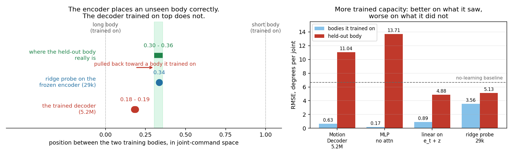
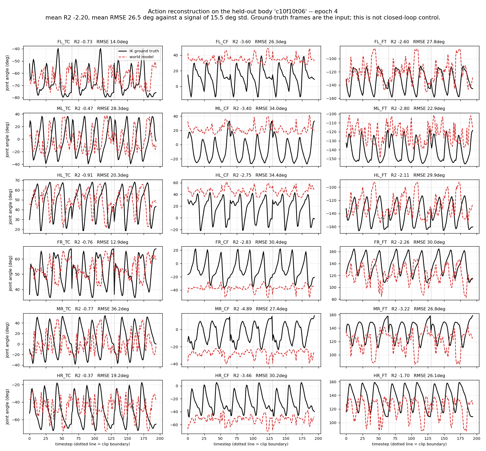

# Progress Update — Stage 1: Cross-Morphology Latent Action Model

Stick insect (*Medauroidea extradentata*), simulated in CoppeliaSim. Stage 1 only: one
18-DOF topology, several leg geometries. Stage 2 (Unitree B1 quadruped) appears only in
the closing questions.

Slides 1 to 6 are background already covered previously. The update starts at slide 7.

---

## Slide 1 — Title

**Cross-Morphology Locomotion via a Latent Action Model**

Stage 1 progress update: what was built, what it measures, what it found.

---

## Slide 2 — The question this stage answers

- A controller maps state to joint command. Change the leg lengths and the same
  numerical command produces a different physical result.
- Can a model learn a latent action `z` from video alone, with no morphology label and
  no kinematics supplied, that separates **what movement is happening** from **which
  body is doing it**, and then produce the correct body-specific joint command?
- This is cross-**morphology**, not cross-embodiment. All bodies share one 18-D joint
  space (6 legs x 3 joints); only the geometry differs.

---

## Slide 3 — Pipeline

```
frame_t  --[frozen V-JEPA2]-->  e_t  --+--[ITM]--> z_t --[FTM]--> ê_{t+1}
                                       |
                                       +--[Motion Decoder]--> â
```

- **Encoder**: V-JEPA2 ViT-g/16, 1B parameters, **frozen throughout**. Never trained on
  robots. Each frame encoded independently, so `e_t` cannot see the future.
- **Trained**: three small modules on top, about 5M parameters each.
- **Data**: CoppeliaSim, 20 Hz, fixed 256x256 side camera, joint targets in radians.

---

## Slide 4 — The three trained modules

| Module | Input | Output | Why it exists |
|---|---|---|---|
| **ITM** inverse transition | `e_t`, `e_{t+1}` | `z ∈ ℝ^64` | Given a transition, what action produced it? |
| **FTM** forward transition | `e_t`, `z` | `ê_{t+1}` | Does `z` let you predict the next frame? |
| **Motion Decoder** | `e_t`, `z` | `â ∈ ℝ^18` | Can `z` be turned back into an executable joint command? |

Note the Motion Decoder receives `e_t` but **never `e_{t+1}`**. Anything the second
frame contributes has to travel through `z`. This becomes important on slide 13.

---

## Slide 5 — Datasets

| Dataset | Bodies | Size |
|---|---|---|
| `ik_walk_100_framed` | 3, uniform leg scale (1.0, 0.75, 0.5) | 100 episodes x 3 bodies x 66 frames |
| `ik_walk_8body` | 7 usable, coxa/femur/tibia scaled independently | 30 clips per body |

- Commands come from **IK retargeting**: one shared foot trajectory in Cartesian space,
  solved separately per body. Same intended behaviour, genuinely different joint
  commands. Without this the transfer question would not be well posed.
- Behaviour: forward walking only.
- Held-out bodies are never trained on and are used only for evaluation.

---

## Slide 6 — How we measure

| Tool | What it does | What it tells us |
|---|---|---|
| **Linear probe** | Fit a ridge regression on training bodies, apply to a held-out body | Is the information present and readable, regardless of what the trained model does |
| **Swap test** | Give the decoder body A's frame with body B's latent | Does the decoder take the body from the frame or from the latent |
| **Input ablation** | Zero out `z`, or zero out `e_t`, and re-measure | Which input the decoder actually depends on |
| **Mixture fitting** | Find the best combination of training bodies' commands explaining the model's output | Is the model interpolating, or copying one body |
| **Physical replay** | Drive the predicted commands through the same physics | Do the commands actually walk, not just score well per joint |

All error figures below are RMSE in degrees on a held-out body, against joint commands
whose own spread is about 11.7 deg.

---

## Slide 7 — The geometry is in the frame, and the model does not use it

**The information is there.** Fit a linear probe from the **frozen** encoder's output to the three
segment scales, using the five training bodies, and apply it to a body it has never seen.

| Body | | coxa pred / true | femur | tibia |
|---|---|---|---|---|
| c10f10t10 | train | 0.985 / 1.00 | 0.999 / 1.00 | 0.998 / 1.00 |
| c06f10t10 | train | 0.616 / 0.60 | 0.998 / 1.00 | 0.998 / 1.00 |
| c10f10t06 | train | 0.970 / 1.00 | 0.998 / 1.00 | 0.601 / 0.60 |
| c06f10t06 | train | 0.633 / 0.60 | 0.998 / 1.00 | 0.601 / 0.60 |
| c10f06t06 | train | 0.996 / 1.00 | 0.606 / 0.60 | 0.602 / 0.60 |
| **c08f09t09** | **held out** | **0.850 / 0.80** | **0.939 / 0.90** | **0.898 / 0.90** |

Errors of **0.05, 0.04 and 0.002** on a 0-to-1 scale, from **4,227 parameters**, on a body never
seen. Nothing supervises the encoder to do this. **This is the premise the project rests on.**

**The model trained on top does not use it.**

- **Swap test**: give the Motion Decoder body A's frame together with body B's latent. The two
  bodies' commands differ by 28.6 deg. It answers with **body B's** command, to within 3.5 deg —
  it followed the latent and ignored the frame it was holding.
- Asked what geometry it thinks the held-out body has, its answer implies **(0.98, 0.98, 0.97)**
  against a true (0.80, 0.90, 0.90) — worse than the 4,227-parameter probe, with 5.2M trained
  parameters.



**This figure is from the earlier three-body dataset** — train on a long and a short body, hold out
a medium one — because an axis only draws cleanly with two training bodies. It shows on three
bodies what the table above measures on seven.

**Left.** Everything is placed on one line: 0 is the long training body, 1 is the short one, and
the position is measured **in joint-command space**, so all three rows are directly comparable.

| | position |
|---|---|
| where the held-out body's true commands sit | **0.30 - 0.36** |
| the 29k-parameter probe on the frozen encoder | **0.34** |
| the 5.2M-parameter trained decoder | **0.18 - 0.19** |

The held-out body is not at 0.5 because leg length and joint angle are not linearly related — its
commands genuinely sit nearer the long body's. The probe lands inside the correct band. The
decoder lands well short of it, **pulled back toward the training body it is nearest**.

**Right.** More trained capacity buys lower error on the bodies it saw and higher error on the one
it did not. The 29k-parameter probe is the only predictor that stays below the no-learning
baseline on both.

**Reading**: the decoder learned to recognise which of the five training bodies it is looking at
and recall that body's commands. There is no entry for a body it has not seen.

---

## Slide 8 — Four changes to the model that did not help

| What we changed | Result |
|---|---|
| Rescale the command target per body | No change |
| Shrink the decoder head, to force it to generalise | 1.4-2.1x worse |
| Remove body identity from `z` by adversarial training | Decoder used the frame 2x more, transfer 1.2x **worse** |
| Hand the decoder a pooled global view of the frame | Used the frame 7.6x **less** |

- Capacity, access, and the contents of the latent were each ruled out.
- What remained was the **objective**: nothing in the loss ever required the model to
  read geometry from pixels. Recognising the body was always cheaper and scored the same.

---

## Slide 9 — What worked: change what the loss asks for

**The idea.** Every body walks the same expert episodes, so at a given timestep two
bodies share the intent and differ only in geometry. So: take body A's latent, decode it
against body **B's** frame, and require body **B's** command.

Reading the body out of the latent now gives the wrong answer by construction. The only
way to be right is to read the geometry from the frame.

| Held-out body, inside the training range | Before | After |
|---|---|---|
| Error, deg | 3.57 | **2.91** |
| Copy the nearest training body (baseline) | 3.47 | 3.47 |
| Share of the latent explained by body identity | 8.8% | **1.2%** |
| Share explained by gait phase | 64.5% | **88.7%** |


**Left**: error on the held-out body, per epoch. Blue is below red almost everywhere and
far steadier — the control swings between 0.076 and 0.190 across epochs, the cross-body
run stays between 0.057 and 0.116. **Right**: how much the decoder depends on the latent,
which falls from 10-37x to 2-4x. It stopped needing the latent to tell it which body it
was looking at, because it now reads that from the frame.

- First configuration to beat the copy-nearest baseline, and the first that does not get
  worse as training continues.
- The swap test fully reverses: the decoder now follows the **frame**.
- The latent was not emptied, it was **cleaned**: it still encodes the gait as well as
  before, but has almost stopped encoding which body it is.

---

## Slide 10 — The commands actually walk

Predicted commands driven open-loop through the same physics used to collect the data,
on a body never trained on.

| | Ground truth (IK) | Control | With the cross-body loss |
|---|---|---|---|
| Forward distance | 0.60 m | 93% of it | 89% of it |
| Mean heading deviation | 6.9-7.2 deg | 3.7 deg | 6.8 deg |
| Commands outside the body's own joint range | 0% | 7.7% | **5.4%** |
| Worst such excursion | 0 deg | 20.2 deg | **5.5 deg** |

- Both models walk. Neither veers more than the IK reference itself does.
- The cross-body loss improves the **quality of the pose**, not the distance: it stops
  commanding leg configurations the body never actually adopts, which is what makes legs
  fold once error accumulates.


Black is stance, white is swing, over 65 simulation steps. The top block is driven by the
predicted commands, the bottom by the IK ground truth. The tripod alternation and the
stance durations line up; duty-factor error averaged over six legs and three clips is
0.044 with the cross-body loss against 0.076 for the control.

Video, side by side with distance travelled stamped on each frame:
`results/wm/gait/replay_m3d_cross_epoch008_c08f09t09_clip0.mp4`

- Distance was fixed by **having more training bodies**, not by the loss: on the earlier
  two-body dataset the same replay covered less than half the required distance.

---

## Slide 11 — The limit: it interpolates, it does not measure

The clean test. In every training body, **the femur and the tibia are scaled by the same
amount** — it happens to be true of all four:

| Training body | coxa | femur | tibia |
|---|---|---|---|
| c10f10t10 | 1.0 | **1.0** | **1.0** |
| c06f10t10 | 0.6 | **1.0** | **1.0** |
| c10f06t06 | 1.0 | **0.6** | **0.6** |
| c08f09t09 | 0.8 | **0.9** | **0.9** |

The held-out body is `c10f10t06`: femur 1.0, tibia 0.6. **The first time the two come
apart.** Nothing in training ever showed them moving independently.

**The model answers that they are equal.**

| Implied segment scale | coxa | femur | tibia |
|---|---|---|---|
| The truth | 1.00 | **1.00** | **0.60** |
| What the model says | 0.93 | **0.70** | **0.70** |
| The best any mixture of training bodies could say | 0.99 | **0.62** | **0.62** |

The third row is the important one. **No combination of the bodies it saw can separate the
femur from the tibia**, because in all of them the two move together. The model's answer and
the best available answer make the same mistake.

Two bodies were held out, both from this family. Neither was trained on:

| Predictor | `c10f10t06` | `c06f10t06` |
|---|---|---|
| Just predict this body's average pose | 16.01 | 15.75 |
| Best possible mixture of training bodies | 19.58 | 18.43 |
| Copy the nearest training body | 20.37 | 19.12 |
| **The model** | **27.68** | **25.60** |



Red is the model, black is ground truth. **All 18 joints have negative R-squared** — every one
is worse than predicting a constant. Even the fore-aft swing joints, which survive on every
other held-out body, have collapsed here.

Two separate readings:

- **No interpolation can pass this test.** On both bodies the best possible mixture (19.58, 18.43)
  loses to predicting a constant pose (16.01, 15.75). The threshold for "actually reads the
  geometry" was set at **15.7 deg before running it**.
- **The model does worse than that ceiling**, by 1.4x on both.

**This is compositional generalisation, and the failure is precisely the shape of the gap in
the data.** The model learned to slide along the axis its training bodies span; it did not
learn to measure a leg.

**The encoder's probe fails in the same direction.** Refitted on this run's four training bodies
and applied to the held-out one, it predicts (0.88, 0.78, 0.78) against a true (1.00, 1.00, 0.60)
— the same tied femur and tibia, error 0.172 against the 0.030 it achieves on a body inside the
range. So the condition on slide 7's result is:

> **The probe predicts a new body to within 0.03 only if that body can be made by mixing the
> bodies it was fitted on. If it cannot, the error jumps to 0.16-0.17.**

Capacity is not what is missing: an MLP on the same bodies is no better. Neither is the encoder
necessarily at fault — a readout fitted on four or five points cannot reach past them whatever the
encoder holds. What matters practically is that the condition is checkable in advance, which is
the next slide.

Both runs are complete, ten epochs each, and **neither improves on the held-out body at any point
in training** while training and validation error fall steadily:

| | epoch 1 | mean over 10 | best | latent ablation |
|---|---|---|---|---|
| with the cross-body loss | 10.53 | 10.47 | 9.55 | 1.06x |
| matched control, no cross term | 8.98 | **9.41** | 8.98 | 1.66x |

Speaker note: the control is 1.11x better here, repeating what we saw on the other out-of-range
body — outside the span of the training bodies the cross-body term does not help and is slightly
worse. **This is a property of the split, not of that term.** Note also the control's probe on the
latent climbing 0.519 to 0.762 across training: with nothing stopping it, the latent goes back to
being a code for which body this is.

**And it says what to do about it**: add training bodies where the femur and tibia differ. The
scene generator already supports it. This is a data gap, not a loss or architecture problem.

---

## Slide 12 — The same measurement predicts, before training, which bodies will transfer

The probe from slide 7 was built to answer a different question. Compared against what the
trained models actually did, it turns out to predict the outcome every time.

| Held-out body | **Can it be mixed from the training bodies?** | **Probe error** | Model, deg | Baseline to beat | Outcome |
|---|---|---|---|---|---|
| `c08f09t09` | **yes, exactly** | **0.030** | **2.91** | copy nearest, 3.47 | **beats it** |
| `c06f06t06` | no, off by 0.283 | **0.155** | 18.82 | own mean, 12.73 | loses |
| `c10f10t06` | no, off by 0.283 | **0.172** | 27.68 | own mean, 16.01 | loses |
| `c06f10t06` | no, off by 0.283 | **0.172** | 25.60 | own mean, 15.75 | loses |

The second column is pure geometry — the distance from the held-out body's segment scales to the
nearest mixture of the training bodies' — and needs no encoder, no model and no data at all. Every
body that cannot be mixed from the training set fails, and the one that can, succeeds.

- The probe separation is clean and the gap is a factor of five. Nothing else we measured orders
  the three cases correctly: the best-mixture ceiling in *command* space calls `c06f06t06`
  trivially easy (0.07 deg) and the model still fails on it.
- **Cost of the probe: a few minutes on CPU, no training at all.** Cost of finding out by
  training: about four hours of GPU per body.

**This turns the limitation into a tool.** Before committing to a train/held-out split, fit the
probe on the training bodies and read off how well it recovers the held-out one. A large error
says the split is asking for a direction the data does not span, and the run will not answer the
question you meant to ask.

Speaker note, and this is the honest version: this was not designed as a diagnostic. It was three
measurements made for other reasons that happened to line up. That is worth more than a planned
result, because the measurement could not have been chosen to fit the outcome — but three points
is not enough to set a numeric threshold, only to establish the ordering.

---

## Slide 13 — Two structural facts found last

**One. The answer was already visible in the decoder's own input.**

The data collector applies a command, steps the simulator, and only then captures the
frame. So the frame is the *result* of that command, and the command was being asked for
from a frame that already shows it. The latent never had to carry anything.

- Replace the second frame given to the ITM with a copy of the first, removing the
  transition entirely: costs only **11-19%**.
- Running the transition **backwards** costs *more* than deleting it — the opposite of
  what a latent encoding direction of motion would do.
- Corrected, and the corrected target is now the default.

**Two. One frame nearly determines the command at any horizon.**

| Predict, from a single frame | now | 8 frames ahead | 32 frames ahead |
|---|---|---|---|
| Error, deg (signal spread 11.3 deg) | 4.6 | 5.2 | **4.5** |

- Predicting 32 frames ahead is as accurate as predicting the present, because the gait
  is periodic with a cycle near 22 frames and one frame fixes the phase.
- Six coordinated legs remove the ambiguity a single leg would have: one frame already
  identifies which feet are swinging with 81.5% accuracy, against 50% by chance.
- Consequence: the joint command cannot be the place the latent earns its keep. Removing the
  forward-prediction term entirely leaves the action reconstruction unchanged.
- **This bounds the action-decoding path only.** Slide 14 measures the forward model itself.

---

## Slide 14 — The forward model was being judged on the wrong task

Every measurement above asks whether forward prediction helps **reconstruct the action**. It
does not. That is not what a forward model is for.

Closing it on its own output and rolling it forward, with the true latents supplied so the
module is isolated, on the held-out body, 162 rollouts:

| steps ahead | forward model | hold the frame still | constant velocity | **beats holding still by** |
|---|---|---|---|---|
| 1 | 1.53 | 2.11 | 5.78 | **1.38x** |
| 3 | 2.07 | 3.05 | 27.6 | **1.47x** |
| 5 | 2.54 | 3.57 | 66.0 | **1.41x** |
| 10 | 3.63 | 4.36 | 236.5 | **1.20x** |

- It beats a frozen world at **every horizon out to ten steps**, and beats constant velocity by
  two orders of magnitude. **The forward model can roll the world forward.**
- Reading the source paper confirms the mistake was ours: in LAC-WM the Motion Decoder is an
  **auxiliary regulariser**. The deployed system predicts future embeddings, rolls them eight
  steps, and picks actions by comparing predicted futures to a goal image. The action decoder is
  not the system's output. **We had made the auxiliary term the whole evaluation.**
- **The cross-body loss costs nothing here.** The control scores 1.36x, 1.47x, 1.42x and 1.23x at
  the same horizons — identical within noise. The term that fixed morphology reading leaves the
  world model's own competence untouched, which makes sense: it never touches the prediction loss.
- Honest limits: holding still is a weak baseline, 1.2-1.5x over it is real but modest, and the
  margin decays with horizon.

Speaker note: this is why the earlier slides say "the command can be read off one frame" rather
than "the world model does nothing". Those are different claims and only the first is supported.

---

## Slide 15 — Where this leaves each piece

| Piece | Status |
|---|---|
| Frozen encoder | Carries body geometry in a directly readable, generalising form. Holds. |
| Latent `z` | With the cross-body loss, a body-independent gait representation: 88.7% gait, 1.2% body. |
| Motion Decoder | Transfers within the range of bodies it saw. Does not extrapolate beyond it, and we can say precisely why. |
| Forward model | Does not help action reconstruction, but **does roll the world forward**: 1.2-1.5x better than a frozen world out to ten steps. It was being measured against a task the method never assigns it. |
| Physical replay | Commands walk, stay inside the body's joint range, and do not veer more than the IK reference. |

**The through-line**: the information transfer needs is readable from vision. Every failure we
found came from the model not being *required* to use it, or from the data not covering the
direction we were asking about. Both are now measured rather than guessed — and the second one we
can now check before spending the training run.

---

## Slide 16 — Two questions for the professor

**1. Our evaluation was aimed at the wrong module. What should Stage 2 be scored on?**

We measured the system by how accurately it reconstructs joint commands. The source method does
not: it rolls the world model forward and selects actions by comparing imagined futures against a
goal image. Our forward model does roll forward usefully, and we only found that out by testing it
directly.

- Should Stage 2's headline metric be **rollout quality and planning success** rather than
  per-joint reconstruction error?
- The source method groups actions into **five-step chunks**, stating this improves world model
  learning. We measured why that matters: at one step the forward model's target is 76 percent
  augmentation noise, because consecutive frames at 20 Hz barely differ. Widening the gap to five
  steps and dropping the crop from the augmentation moves the signal-to-noise ratio **from 0.24 to
  0.89**, and at ten steps the signal exceeds the noise for the first time. Is it worth rebuilding
  Stage 1's main comparison at that setting? It would make every number so far incomparable.
- One structural fact remains regardless: our data is forward walking at one speed, and we
  measured that a single frame predicts the joint command at every horizon out to 32 frames.
  The commands come from inverse kinematics, which is open loop -- knowing the gait phase fixes
  everything that follows.
- **We already have an alternative asset**: AMP reinforcement-learning policies trained on three
  leg-scale bodies, 200 checkpoints each across training, so distinctly different gaits, speeds
  and body heights. A closed-loop policy's command depends on the robot's velocity and foot
  forces, which a still frame does not show, so a single frame should stop determining the
  future. Cost: a rollout-and-render pipeline, and only three morphologies on one axis, against
  the seven bodies on three axes we have now. **Is it worth building a dataset from these?**

**2. How should cross-embodiment training pairs be defined for Stage 2?**

The mechanism that fixed Stage 1 decodes one body's latent against another body's frame,
supervised by that body's command at the same moment. It is well defined only because
every insect body walks identical expert episodes, so pairing is exact.

The hexapod and B1 share no episodes. Candidate substitutes are pairing by matched body
speed, or by gait phase estimated from the image, and both are inexact — and a mis-paired
frame is a **wrong label**, not just a noisy one. There is also no physically correct
answer to what "the same phase" means between a six-leg tripod and a four-leg trot.

Reading the source paper changes the shape of this question. **It has no cross-embodiment pairing
term** — the shared latent space emerges from sharing the model weights across embodiments. So the
pairing mechanism is **our addition**, and Stage 2 can follow the paper without it.

Their setting likely does not need one. The shortcut we measured only pays when knowing which body
you are looking at tells you the command, and in our data each body does exactly one thing. In
theirs, one robot performs thousands of different manipulations, so body identity says almost
nothing. **We are applying the method to a regime it was not tested in** — bodies that differ
slightly, one behaviour — and that regime is where the shortcut appears.

The question is therefore whether to keep our term. Without it, Stage 1's failure mode is what we
measured happening. With it, we need a pairing definition that does not exist yet.

Also worth noting: the paper's transfer is **not zero-shot**. It is a three-stage LoRA finetune on
7,265 trajectories of the target robot. The sample-efficiency framing is the comparable claim.
