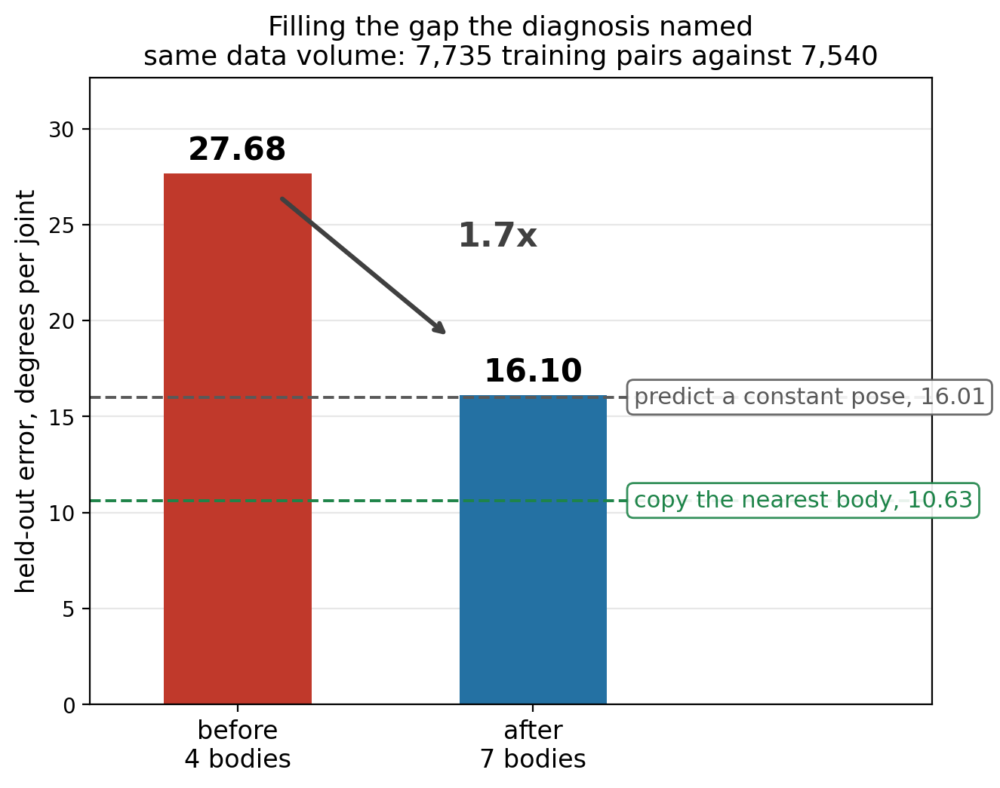
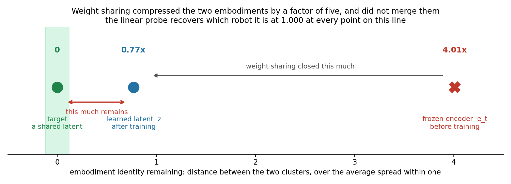
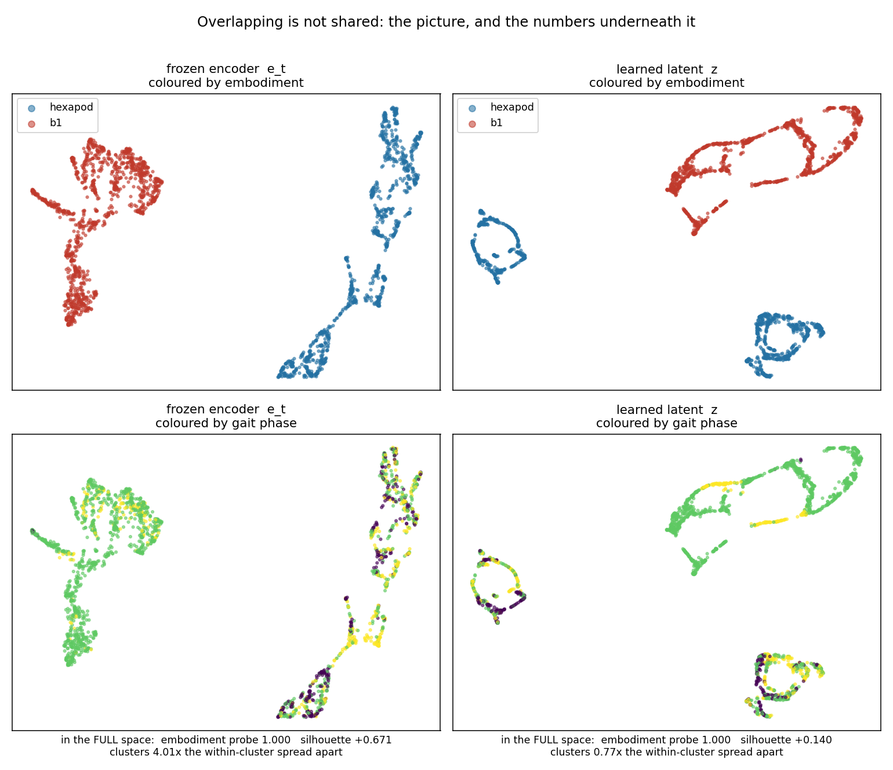

# Progress Update — Stage 1: Cross-Morphology Latent Action Model

Stick insect (*Medauroidea extradentata*), simulated in CoppeliaSim. Stage 1 only: one 18-DOF
topology, several leg geometries. Stage 2 (Unitree B1 quadruped) appears once, on slide 14, because a first run
of it turns the closing question from a risk into a number. Fifteen slides.

Slides 1 to 3 are background already covered previously. The update starts at slide 4.

---

## Slide 1 — Cross-morphology locomotion from a latent action model

Stage 1 progress update: what was built, what it measures, what it found.

**The problem.** A locomotion controller maps state to joint command. Change the leg lengths and
the same numerical command produces a different physical result — the robot stumbles, or stands at
a different height, or does not move. Every body needs its own commands for the same behaviour.

**The question this stage asks.** Can a model learn a latent action `z` from **video alone** — no
morphology label, no kinematics supplied — that separates *what movement is happening* from *which
body is doing it*, and then turn that latent into the correct body-specific joint command?

**The scope, stated precisely.** This is cross-**morphology**, not cross-embodiment. All bodies
share one 18-D joint space, six legs times three joints; only the geometry differs. The quadruped
appears only in the closing questions.

**Why it matters for what comes after.** If the latent really separates behaviour from body, the
same latent should drive a robot with a different number of legs, which no proprioceptive
controller can do because the joint spaces cannot even be compared. Stage 1 is the test of whether
that separation happens at all, in the easy case where the joint spaces do match.

**What this update covers.**

| | |
|---|---|
| Slides 2-3 | what was built, the data, and how every number below is measured |
| Slides 4-7 | the central result: the geometry is readable, the model ignores it, what fixed that, and what the fix did to the latent |
| Slides 8-10 | where it stops working, why, a test of that explanation, and a check that predicts it in advance |
| Slides 11-12 | two structural facts about the task itself, found last, that reframe the rest |
| Slides 13-15 | status, a first cross-embodiment run, and two decisions I need help with |

---

## Slide 2 — The pipeline and its three trained modules

```
frame_t  --[frozen V-JEPA2]-->  e_t  --+--[ITM]--> z --[FTM]--> ê_{t+1}
                                       |
                                       +--[Motion Decoder]--> â
```

- **Encoder**: V-JEPA2 ViT-g/16, 1B parameters, **frozen throughout**, never trained on robots.
- **Trained**: three modules on top, about 5M parameters each.
- **Data**: CoppeliaSim, 20 Hz, fixed 256x256 side camera, joint targets in radians.

| Module | Input | Output | Why it exists |
|---|---|---|---|
| **ITM** inverse transition | `e_t`, `e_{t+1}` | `z ∈ ℝ^64` | Given a transition, what action produced it? |
| **FTM** forward transition | `e_t`, `z` | `ê_{t+1}` | Does `z` let you predict the next frame? |
| **Motion Decoder** | `e_t`, `z` | `â ∈ ℝ^18` | Can `z` be turned back into an executable joint command? |

**The objective, as inherited from LAC-WM.** Two terms:

```
z      = ITM(e_t, e_{t+1})
L_recon  = || FTM(e_t, z) - e_{t+1} ||^2          predict the next frame
L_motion = || MD(e_t, z)  - a      ||^2          recover the real joint command
L        = 1.0 * L_recon  +  1.0 * L_motion
```

**Two structural facts to hold on to.**

The Motion Decoder receives `e_t` but **never `e_{t+1}`**. Anything the second frame contributes
has to travel through the 64-number latent. That bottleneck is the whole design, and it is what
slides 8 and 10 turn out to hinge on.

The two terms sit on very different scales — reconstruction around 1.5, motion around 0.01 in
standardised units — so weighting them equally at 1.0 does **not** give them equal influence.
**Reconstruction takes roughly 99 percent of the gradient in practice**, which means the term
meant to ground the latent in real commands is running on the remaining one percent.

---

## Slide 3 — The data, and how everything below is measured

| Dataset | Bodies | Size |
|---|---|---|
| `ik_walk_100_framed` | 3, uniform leg scale (1.0, 0.75, 0.5) | 100 episodes x 3 bodies x 66 frames |
| `ik_walk_8body` | 7 usable, coxa/femur/tibia scaled independently | 30 clips per body |

- Commands come from **IK retargeting**: one shared foot trajectory in Cartesian space, solved
  separately per body. Same intended behaviour, genuinely different joint commands. Without this
  the transfer question would not be well posed — every body would receive the same command.
- Behaviour: forward walking only, one speed. This becomes important on slide 10.
- Held-out bodies are never trained on and are used only for evaluation.

| Tool | What it does | What it tells us |
|---|---|---|
| **Linear probe** | Fit a ridge regression on training bodies, apply to a held-out body | Is the information present and readable, independent of what the trained model does with it |
| **Swap test** | Give the decoder body A's frame with body B's latent | Does the decoder take the body from the frame or from the latent |
| **Input ablation** | Zero out `z`, or zero out `e_t`, and re-measure | Which of its two inputs the decoder actually depends on |
| **Mixture fitting** | Find the best combination of training bodies' commands explaining the output | Is the model interpolating, or copying one body |
| **Physical replay** | Drive the predicted commands through the same physics | Do the commands actually walk, not just score well per joint |

All error figures below are RMSE in degrees, pooled over all 18 joints and all timesteps, on a
body never trained on. The commands' own spread is about 11.7 deg per joint, so that is the number
to read every error against.

**"Control" throughout means the matched run**: identical data, identical split, identical
architecture, identical seed, with **one flag changed** — the cross-body loss turned off. Which
run that is depends on which split is being discussed, so it is named each time:

| Split | With the cross-body loss | Its control |
|---|---|---|
| 5 training bodies, held out `c08f09t09` (inside the range) | `m3d_cross` | `m3d_bracketed` |
| 4 training bodies, held out the tibia-short pair (outside it) | `tib_cross` | `tib_ctrl` |

---

## Slide 4 — The geometry is in the frame, and the model does not use it

**The information is there.** Fit a linear probe from the **frozen** encoder's output to the three
segment scales, using the five training bodies, and apply it to a body it has never seen.

| Body | | coxa pred / true | femur | tibia |
|---|---|---|---|---|
| c10f10t10 | train | 0.985 / 1.00 | 0.999 / 1.00 | 0.998 / 1.00 |
| c06f10t10 | train | 0.616 / 0.60 | 0.998 / 1.00 | 0.998 / 1.00 |
| c10f10t06 | train | 0.970 / 1.00 | 0.998 / 1.00 | 0.601 / 0.60 |
| c06f10t06 | train | 0.633 / 0.60 | 0.998 / 1.00 | 0.601 / 0.60 |
| c10f06t06 | train | 0.996 / 1.00 | 0.606 / 0.60 | 0.602 / 0.60 |
| **c08f09t09** | **held out** | **0.850 / 0.80** | **0.939 / 0.90** | **0.898 / 0.90** |

Errors of **0.05, 0.04 and 0.002** on a 0-to-1 scale, from **4,227 parameters**, on a body never
seen. Nothing supervises the encoder to do this. **This is the premise the project rests on.**

**The model trained on top does not use it.**

- **Swap test**: give the Motion Decoder body A's frame together with body B's latent. The two
  bodies' commands differ by 28.6 deg. It answers with **body B's** command, to within 3.5 deg —
  it followed the latent and ignored the frame it was holding.
- **What geometry does each one think the held-out body has?** The probe reads it off the encoder
  directly. The decoder is asked indirectly: fit its output commands as a mixture of the training
  bodies' commands, and read off the segment scales that mixture implies.

| Held-out body `c08f09t09` | coxa | femur | tibia |
|---|---|---|---|
| **The truth** | **0.80** | **0.90** | **0.90** |
| The probe on the frozen encoder, 4,227 parameters | 0.85 | 0.94 | 0.90 |
| The trained decoder, 5.2M parameters | **0.98** | **0.98** | **0.97** |

The two rows are **different estimators, not the same number twice**. The probe lands within 0.05
of the truth. The decoder answers "essentially a full-size body" for a body whose legs are 10 to
20 percent short — it has slid its answer onto the nearest training body, `c10f10t10`. The larger
model, holding the same frame, is the one that gets it wrong.


**This figure is from the earlier three-body dataset** — train on a long and a short body, hold out
a medium one — because an axis only draws cleanly with two training bodies. It shows on three
bodies what the table above measures on seven.

**Left.** Everything is placed on one line: 0 is the long training body, 1 is the short one, and
the position is measured **in joint-command space**, so all three rows are directly comparable.

| | position |
|---|---|
| where the held-out body's true commands sit | **0.30 - 0.36** |
| the 29k-parameter probe on the frozen encoder | **0.34** |
| the 5.2M-parameter trained decoder | **0.18 - 0.19** |

The held-out body is not at 0.5 because leg length and joint angle are not linearly related — its
commands genuinely sit nearer the long body's. The probe lands inside the correct band. The
decoder lands well short of it, **pulled back toward the training body it is nearest**.

**Right.** More trained capacity buys lower error on the bodies it saw and higher error on the one
it did not. The 29k-parameter probe is the only predictor that stays below the no-learning
baseline on both.

**Reading**: the decoder learned to recognise which of the five training bodies it is looking at
and recall that body's commands. There is no entry for a body it has not seen.

---

## Slide 5 — Four changes that did not help, and the one that did

**Four attempts to fix it at the model.** All on the same split, one flag changed each time:

| What we changed | Result |
|---|---|
| Rescale the command target per body | No change |
| Shrink the decoder head, to force it to generalise | 1.4-2.1x worse |
| Remove body identity from `z` by adversarial training | Used the frame 2x more, transfer 1.2x **worse** |
| Hand the decoder a pooled global view of the frame | Used the frame 7.6x **less** |

Capacity, access, and the contents of the latent were each ruled out. What remained was the
**objective**: nothing in the loss ever *required* the model to read geometry from pixels.
Recognising the body was always cheaper and scored exactly as well.

**So change what the loss asks for.** Every body walks the same expert episodes, so at a given
timestep two bodies share the intent and differ only in geometry. Take body A's latent, decode it
against body **B's** frame, and require body **B's** command:

```
z^A      = ITM(e_t^A, e_{t+1}^A)                  the latent from body A's own transition
L_cross  = || MD(e_t^B, z^A) - a^B ||^2           A's latent, B's frame, B's command
L        = 1.0 * L_recon + 1.0 * L_motion + 0.5 * L_cross
```

**One added term, weight 0.5, and one extra decoder pass per batch** — the same `z^A` is reused,
so there is no second pass through the encoder or the ITM. Everything else is untouched.

Body B is drawn from the same episode at the same timestep, which is what makes `a^B` well
defined. Reading the body out of the latent now gives the **wrong** answer by construction, since
that latent came from A while the required answer belongs to B. The only way to be right is to
read the geometry from the frame.

| Held-out body, inside the training range | Before | After |
|---|---|---|
| Error, deg | 3.57 | **2.91** |
| Copy the nearest training body (baseline) | 3.47 | 3.47 |


**Left**: error on the held-out body per epoch, `m3d_cross` against its control `m3d_bracketed`.
The control swings between 0.076 and 0.190 across epochs; the cross-body run stays between 0.057
and 0.116 and is steadier throughout. **Right**: how much the decoder depends on the latent,
falling from 10-37x to 2-4x — it no longer needs the latent to tell it which body it is looking
at, because it now reads that from the frame.

- First configuration to beat the copy-nearest baseline, and the first that does not get worse as
  training continues.
- The swap test fully reverses: the decoder now follows the **frame**.

---

## Slide 6 — What is inside the latent, before and after

**What is inside the latent, before and after.** Split its variance by what explains it, and
separately ask what can still be decoded out of it:

| | Before | After |
|---|---|---|
| variance explained by **gait phase** | 64.5% | **88.7%** |
| variance explained by **which body it is** | 8.8% | **1.2%** |
| variance explained by neither, the interaction | 26.8% | 10.1% |
| **foot-contact pattern decodable from it** (8 patterns, chance 0.144) | 0.757 | **0.744** |
| which body it is, decodable from it (5 bodies, chance 0.200) | 0.707 | 0.638 |

The body's share of the latent falls by a factor of **seven** while the gait's share rises to
almost 90 percent. The last two rows are the check that this is purification and not destruction:
behaviour comes out of the latent just as well as before, so the latent did not shrink — it
**stopped carrying a job that was never its own.**

**But all of that is measured on bodies the model trained on**, because the variance split needs
every body present at every timestep of the shared episode. Repeating it on the two held-out
bodies, with all ten *pairs* of training bodies as a like-for-like reference at the same group
size:

| body's share of the latent's variance | training bodies | training pairs | **held-out bodies** |
|---|---|---|---|
| old target, no cross term | 11.3% | 7.2% | 6.8% |
| corrected target, no cross term | 10.4% | 6.7% | 11.7% |
| old target, with cross term | 1.2% | 0.8% | 10.6% |
| **corrected target, with cross term** | **0.8%** | **0.5%** | 8.6% |

Reading down the first column: the corrected target alone moves it by less than a percentage
point, 11.3 to 10.4. **The cross term moves it by an order of magnitude**, and the two together
reach 0.8 percent — the best cell, with the tightest spread across the ten pairs (0.0-0.8 against
0.0-1.3). That matches the best configuration also being the best run overall and producing the
lowest reconstruction error of any checkpoint, 2.82 deg.

**The last column resists all four.** 6.8, 11.7, 10.6, 8.6 — and the best configuration is not
even the best cell there. Every training pair under the cross term sits between 0.0 and 0.8
percent while the held-out pair is 8.6, an order of magnitude above.

**One caveat, stated because it matters.** The decomposition needs at least two bodies, and the
only two held out here are `c08f09t09`, which is reachable by mixing the training bodies, and
`c06f06t06`, which is not. **The 8.6 percent could be coming entirely from the out-of-range one**,
and this measurement cannot separate them. So the claim is not "the latent stays dirty on unseen
bodies" but the narrower "on a pair that includes an out-of-range body" — which is the same
coverage boundary as slide 8, not a new one. Separating them needs two held-out bodies both inside
the range, which the current body set cannot supply.

The mechanism is straightforward: the cross-body term constrains "decode A's latent against B's
frame" only for the pairs that exist in training. For an unseen body the latent was never subject
to that constraint. **This is the same limit as slide 7, reached from a different direction**, and
it is the first direct evidence bearing on question 2 — Stage 2 needs body-independence on an
embodiment it has not seen, and this says our mechanism does not deliver it there.

---

## Slide 7 — The commands actually walk

Predicted commands driven open-loop through the same physics used to collect the data,
on a body never trained on. `m3d_cross` against its control `m3d_bracketed`.

| | Ground truth (IK) | Control | With the cross-body loss |
|---|---|---|---|
| Forward distance | 0.60 m | 93% of it | 89% of it |
| Mean heading deviation | 6.9-7.2 deg | 3.7 deg | 6.8 deg |
| Commands outside the body's own joint range | 0% | 7.7% | **5.4%** |
| Worst such excursion | 0 deg | 20.2 deg | **5.5 deg** |

- Both models walk. Neither veers more than the IK reference itself does.
- The cross-body loss improves the **quality of the pose**, not the distance: it stops
  commanding leg configurations the body never actually adopts, which is what makes legs
  fold once error accumulates.


Black is stance, white is swing, over 65 simulation steps. The top block is driven by the
predicted commands, the bottom by the IK ground truth. The tripod alternation and the
stance durations line up; duty-factor error averaged over six legs and three clips is
0.044 with the cross-body loss against 0.076 for the control.

Video, side by side with distance travelled stamped on each frame:
`results/wm/gait/replay_m3d_cross_epoch008_c08f09t09_clip0.mp4`

- Distance was fixed by **having more training bodies**, not by the loss: on the earlier two-body
  dataset the same replay covered less than half the required distance.

**Why the joint-range column is the one to watch.** A command outside the range a body ever adopts
asks the leg for a pose it cannot hold. Open loop, those errors accumulate and the leg folds into
the abdomen. The control does this on 7.7 percent of commands with a worst excursion of 20.2 deg;
the cross-body loss cuts that to 5.4 percent and 5.5 deg. That is the difference between a gait
that degrades gracefully and one that collapses, and it does not show up in per-joint RMSE at all.

Per-joint accuracy on this body, for reference: mean R-squared **0.868** with the cross-body loss
against **0.832** for the control, and the fore-aft swing joints reach 0.99 while the leg-lift
joints sit at 0.60-0.82 — those carry the least signal, 5.2-8.0 deg of spread against 9.9-27.3 for
the swing joints.

---

## Slide 8 — The limit: everything ties the femur to the tibia, because the data does

**The setup.** In all four training bodies, the femur and the tibia carry the same scale. Not by
design — it is simply true of the four:

| Training body | coxa | femur | tibia |
|---|---|---|---|
| c10f10t10 | 1.0 | **1.0** | **1.0** |
| c06f10t10 | 0.6 | **1.0** | **1.0** |
| c10f06t06 | 1.0 | **0.6** | **0.6** |
| c08f09t09 | 0.8 | **0.9** | **0.9** |

The held-out body is `c10f10t06`: **femur 1.0, tibia 0.6**. The first time the two come apart.
Nothing in training ever showed them moving independently.

**Now ask three completely separate things what geometry this body has.**

| | coxa | femur | tibia |
|---|---|---|---|
| **The truth** | 1.00 | **1.00** | **0.60** |
| The trained decoder, from its output commands | 0.93 | **0.70** | **0.70** |
| The linear probe on the frozen encoder | 0.88 | **0.78** | **0.78** |
| The best any mixture of training bodies could say | 0.99 | **0.62** | **0.62** |

**All three give the femur and the tibia the same number.** The 5.2M-parameter decoder, the
4,227-parameter probe reading the raw encoder, and a mixture calculation that involves no learning
at all — three things with almost nothing in common, making the identical mistake.

The last row is why. **No combination of bodies in which the femur and tibia always move together
can pull them apart.** The other two are not failing independently; they are reproducing the shape
of the gap in the data.

That also puts a condition on the encoder result from slide 4, which was 0.030 error on a body
inside the range and is 0.172 here:

> **The probe recovers a new body to within 0.03 only if that body can be made by mixing the
> bodies it was fitted on. If it cannot, the error jumps to 0.16-0.17.**

Capacity is not the missing ingredient — an MLP in place of the ridge is no better.


Red is the model, black is ground truth, across three clips. **All 18 joints have negative
R-squared** — every one is worse than predicting that body's own average posture.

**But this body is also the worst-behaved one we have**, so the same checkpoint was scored on
three more held-out bodies that walk straight. Same weights, only the test body changes:

| held out | femur/tibia | deg per joint | **R²** |
|---|---|---|---|
| **c10f10t06** — the body above, veers off course | 1.38 | **27.76** | **−3.16** |
| c10f10t08 | 1.04 | 13.49 | **−1.07** |
| c10f09t07 | 1.07 | 12.52 | **−0.42** |
| c10f08t06 | 1.10 | 11.39 | **−0.47** |

**The failure is real and it is not about one body: R² is negative on all four**, so on every
unseen femur/tibia ratio the model does worse than someone who saw the body once and memorised its
average posture.

**And the headline body overstates it by 3 to 7 times.** On bodies that walk cleanly the error is
11–13 degrees per joint rather than 27.8, and R² is −0.4 to −1.1 rather than −3.2. The commands'
own spread is 11.7 degrees per joint, so the honest statement is *comparable to the signal*, not
*four times it*.

**The fix this points to is more bodies where the femur and tibia differ.** The scene generator
already supports it. A data gap, not a loss or architecture problem — and no regularizer touches
it, because the information was never present to begin with.

---

## Slide 9 — Testing the diagnosis instead of asserting it

Slide 8 ends with an explanation, and an explanation makes a prediction: **if the femur and tibia
are tied because every training body ties them, then adding bodies where they differ should untie
them.** Three such bodies were generated, checked to walk, and collected at the full 30 episodes.

The run is **volume-matched** — seven bodies at 18 episodes gives 7,735 training pairs against the
original four bodies' 7,540 — so a better result cannot be put down to more data.

| | before, 4 bodies | after, 7 bodies |
|---|---|---|
| training pairs | 7,540 | 7,735 |
| best possible mixture | 19.58 deg | **9.65 deg** |
| copy the nearest training body | 20.37 deg | **10.63 deg** |
| predict a constant pose | 16.01 deg | 16.01 deg |
| **the model** | **27.68 deg** | **16.10 deg** |



**A second prediction, costing no GPU at all.** Refit the encoder probe on the enlarged set and its
error on the held-out body should fall. It did — **0.172 → 0.098** — and the specific thing the
diagnosis named is what moved:

| | coxa | femur | tibia |
|---|---|---|---|
| the truth | 1.00 | **1.00** | **0.60** |
| probe fitted on the 4 old bodies | 0.88 | **0.78** | **0.78** |
| probe fitted on all 7 | 0.95 | **0.89** | **0.73** |

The gap between femur and tibia went from **0.000 to 0.157** against a true 0.400. The tying broke.

**And the honest reading.** A 1.7x improvement from coverage alone, at matched data volume —
the gap was real and filling it helped substantially. But 16.10 lands **exactly on the
constant-pose baseline** and well short of the 10.63 that would show the model doing better than
nearest-neighbour lookup. The run was flat across its last five epochs, so this is not a
convergence issue.

**Coverage was a real cause and is not the whole cause.** That is a sharper result than a clean
pass would have been, and it is what the next question is built on.

**One thing to know about both numbers.** Both sides of this comparison hold out the same body,
`c10f10t06`, so the before/after is matched and the 1.7x is real. But slide 8 showed that body
scores 3 to 7 times worse than held-out bodies which walk cleanly, so **27.68 and 16.10 are both
inflated in absolute terms** — the ratio between them is the trustworthy part, not their size.
Repeating this on a sound held-out body needs a new run, because the three mild-ratio bodies are
all inside the seven-body training set and so cannot serve as its test.

---

## Slide 10 — The same measurement predicts, before training, which bodies will transfer

The probe from slide 4 was built to answer a different question. Compared against what the
trained models actually did, it turns out to predict the outcome every time.

| Held-out body | **Can it be mixed from the training bodies?** | **Probe error** | Model, deg | Baseline to beat | Outcome |
|---|---|---|---|---|---|
| `c08f09t09` | **yes, exactly** | **0.030** | **2.91** | copy nearest, 3.47 | **beats it** |
| `c06f06t06` | no, off by 0.283 | **0.155** | 18.82 | own mean, 12.73 | loses |
| `c10f10t06` | no, off by 0.283 | **0.172** | 27.68 | own mean, 16.01 | loses |
| `c06f10t06` | no, off by 0.283 | **0.172** | 25.60 | own mean, 15.75 | loses |

The second column is pure geometry — the distance from the held-out body's segment scales to the
nearest mixture of the training bodies' — and needs no encoder, no model and no data at all. Every
body that cannot be mixed from the training set fails, and the one that can, succeeds.

- The probe separation is clean and the gap is a factor of five. Nothing else we measured orders
  the three cases correctly: the best-mixture ceiling in *command* space calls `c06f06t06`
  trivially easy (0.07 deg) and the model still fails on it.
- **Cost of the probe: a few minutes on CPU, no training at all.** Cost of finding out by
  training: about four hours of GPU per body.

**This turns the limitation into a tool.** Before committing to a train/held-out split, fit the
probe on the training bodies and read off how well it recovers the held-out one. A large error
says the split is asking for a direction the data does not span, and the run will not answer the
question you meant to ask.

Speaker note, and this is the honest version: this was not designed as a diagnostic. It was three
measurements made for other reasons that happened to line up. That is worth more than a planned
result, because the measurement could not have been chosen to fit the outcome — but three points
is not enough to set a numeric threshold, only to establish the ordering.

---

## Slide 11 — Two structural facts found last

**One. The answer was already visible in the decoder's own input.**

The data collector applies a command, steps the simulator, and only then captures the
frame. So the frame is the *result* of that command, and the command was being asked for
from a frame that already shows it. The latent never had to carry anything.

Substituting the second frame the ITM is given, on the held-out body, 195 transitions:

| what the ITM is given as `e_{t+1}` | old target | corrected target |
|---|---|---|
| the real next frame | 3.57 / 2.91 deg | 3.53 / **2.82 deg** |
| **a copy of `e_t`, no transition at all** | **1.11x / 1.19x** | **1.36x / 1.23x** |
| `e_{t-1}`, a wrong transition | 1.44x / 1.44x | 1.65x / 1.44x |
| a frame from a random other time | 2.70x / 2.10x | 2.96x / 1.91x |
| the latent zeroed entirely | 5.39x / 2.08x | 3.97x / 2.61x |

Each cell is control / with-the-cross-term. Read the rows in pairs first: **wrong transitions hurt
more than missing ones**, and nonsense hurts most, so the latent is genuinely sensitive to what
the second frame contains.

Then the second row, which carries the conclusion. On the old target, **removing the transition
entirely cost 11 to 19 percent** — almost everything the decoder needed was already in `e_t`,
which is exactly what the collector's ordering guaranteed. The correction raises that to 23 to 36
percent, so it did what it was designed to do. It did not improve transfer, because the transition
was never what transfer was short of.

**Two. One frame nearly determines the command at any horizon.**

| Predict, from a single frame | now | 8 frames ahead | 32 frames ahead |
|---|---|---|---|
| Error, deg (signal spread 11.3 deg) | 4.6 | 5.2 | **4.5** |

- Predicting 32 frames ahead is as accurate as predicting the present, because the gait
  is periodic with a cycle near 22 frames and one frame fixes the phase.
- Six coordinated legs remove the ambiguity a single leg would have: one frame already
  identifies which feet are swinging with 81.5% accuracy, against 50% by chance.
- Consequence: the joint command cannot be the place the latent earns its keep. Removing the
  forward-prediction term entirely leaves the action reconstruction unchanged.
- **This bounds the action-decoding path only.** Slide 12 measures the forward model itself.

---

## Slide 12 — The forward model was being judged on the wrong task

Every measurement above asks whether forward prediction helps **reconstruct the action**. It
does not. That is not what a forward model is for.

Closing it on its own output and rolling it forward, with the true latents supplied so the
module is isolated, on the held-out body, 162 rollouts:

| steps ahead | forward model | hold the frame still | constant velocity | **beats holding still by** |
|---|---|---|---|---|
| 1 | 1.53 | 2.11 | 5.78 | **1.38x** |
| 3 | 2.07 | 3.05 | 27.6 | **1.47x** |
| 5 | 2.54 | 3.57 | 66.0 | **1.41x** |
| 10 | 3.63 | 4.36 | 236.5 | **1.20x** |

- It beats a frozen world at **every horizon out to ten steps**, and beats constant velocity by
  two orders of magnitude. **The forward model can roll the world forward.**
- Reading the source paper confirms the mistake was ours: in LAC-WM the Motion Decoder is an
  **auxiliary regulariser**. The deployed system predicts future embeddings, rolls them eight
  steps, and picks actions by comparing predicted futures to a goal image. The action decoder is
  not the system's output. **We had made the auxiliary term the whole evaluation.**
- **The cross-body loss costs nothing here.** The control `m3d_bracketed` scores 1.36x, 1.47x,
  1.42x and 1.23x at
  the same horizons — identical within noise. The term that fixed morphology reading leaves the
  world model's own competence untouched, which makes sense: it never touches the prediction loss.
- Honest limits: holding still is a weak baseline, 1.2-1.5x over it is real but modest, and the
  margin decays with horizon.

Speaker note: this is why the earlier slides say "the command can be read off one frame" rather
than "the world model does nothing". Those are different claims and only the first is supported.

---

## Slide 13 — Where this leaves each piece

| Piece | Status |
|---|---|
| Frozen encoder | Carries body geometry in a directly readable, generalising form. Holds. |
| Latent `z` | With the cross-body loss, 88.7% gait and 1.2% body — **on bodies it trained on**. On two held-out bodies the body share is 10.6%, against 0.0-1.3% for every training pair. Across two *embodiments* it is **33.0%**. The purification does not extend past the training range. |
| Motion Decoder | Transfers within the range of bodies it saw. Does not extrapolate beyond it, and we can say precisely why — and **filling the named gap moved it 27.68 to 16.10 deg at matched data volume**, which is most of the way to the constant-pose baseline and not past it. |
| Forward model | Does not help action reconstruction, but **does roll the world forward**: 1.2-1.5x better than a frozen world out to ten steps. It was being measured against a task the method never assigns it. |
| Physical replay | Commands walk, stay inside the body's joint range, and do not veer more than the IK reference. |

**The through-line**: the information transfer needs is readable from vision. Every failure we
found came from the model not being *required* to use it, or from the data not covering the
direction we were asking about. Both are now measured rather than guessed — and the second one we
can now check before spending the training run.

**What is settled enough to write up**

- A frozen video encoder, never trained on robots, carries leg geometry in a linearly readable
  form that generalises to an unseen body — 0.05, 0.04 and 0.002 on a 0-to-1 scale.
- A world model trained on top does not use it, and we can show which pathway it uses instead.
- Making the objective require the mapping fixes that, with four independent measurements moving
  together, and costs nothing in the world model's own competence — within the training range.
- Transfer holds inside the range the training bodies span and fails outside it, and the failure
  reproduces the exact shape of the gap in the data. **Four independent measurements agree on
  where that boundary is**: the decoder's commands (2.91 deg inside, 25.6-27.7 outside), the
  encoder probe (0.030 inside, 0.155-0.172 outside), the latent's body content (1.2% inside,
  10.6% outside), and across embodiments the latent's robot content (33.0%).
- Filling a gap the diagnosis named improves the number without closing it: **27.68 to 16.10 deg**
  at matched data volume, and the encoder probe **0.172 to 0.098** with no training at all.

**What is not settled**

- Whether the forward model earns its place, because our data has no unpredictable future to
  predict — slide 13, question 1.
- How to define cross-embodiment pairing, or whether to need it at all — slide 13, question 2.
- Whether the encoder itself or the five-point readout is the limit outside the training range.

---

## Slide 14 — Stage 2, first look

The cross-embodiment path had never been run. It works: one ITM, one forward model and one decoder
backbone shared across an **18-DOF hexapod and a 12-DOF quadruped**, with a per-embodiment output
head. No cross-embodiment term — the source method has none, and claims the shared latent emerges
from weight sharing alone.

**Before training, the frozen encoder does not hand over a shared space.** Fit a readout for stance
fraction — the proportion of feet on the ground, defined for six legs and for four — on one
embodiment and apply it to the other:

| fitted on | tested on | error / the target's own spread |
|---|---|---|
| insect | insect | 0.82x |
| B1 | B1 | 0.89x |
| **insect** | **B1** | **1.16x** |
| **B1** | **insect** | **1.04x** |

**1.00x is the line where looking at the image stops being worth anything.** Within an embodiment
the readout beats guessing; across, it does not.


**Two things that are not behaviour had to be controlled for first, and both moved the number a
lot.** They are reported rather than buried, because either one alone would have made this
measurement say whatever we wanted.

*How the frame is reduced.* The encoder emits 256 patch tokens per frame, which must be collapsed
to one vector. Which feet are loaded occupies perhaps 6–12 of those patches, so averaging all 256
buries it — while faithfully preserving a large constant offset between insect frames and B1
frames, which a fitted readout absorbs into its intercept and then mis-applies to the other robot.

*How the two robots look.* The insect renders orange and occupies about a quarter of the frame; the
B1 renders grey and occupies about three quarters. Neither is behaviour. Standardising each
embodiment by its own statistics removes both, using only which dataset a frame came from and never
the stance fraction being predicted.

| cross cells | mean-pooled | band-pooled | max-pooled |
|---|---|---|---|
| raw | **4.72x / 3.00x** | 2.74x / 2.35x | 1.32x / 1.06x |
| **appearance controlled** | 1.57x / 1.07x | **1.16x / 1.04x** | 1.22x / 1.02x |

Raw, the answer swings by a factor of four depending on nothing but the pooling. Controlled, every
reduction agrees within 1.02–1.57x. **The controlled row is the one that is a property of the
encoder rather than of our choices**, so it is the one reported.

The claim that survives is the flat one, and it is now the strong version of itself: **even with
colour, apparent size and pooling all controlled, the frozen encoder gives nothing usable across
embodiments.** Not that it is actively misleading — and not something that could be explained away
by our two robots looking different.

One honest limit: standardising per embodiment needs a batch of the new robot's frames to compute
statistics from, so this is domain adaptation rather than zero-shot. That is already true of the
setting, since a new embodiment needs a new output head fitted on some of its data regardless.

**After training, what the latent is made of:**

| | share of variance |
|---|---|
| gait phase | 39.6% |
| **which robot this is** | **33.0%** |
| interaction | 27.4% |

Against Stage 1's **1.2%** body share with the cross-body loss on. Embodiment decodes at **1.000**.



One axis, with the target marked — the same form as slide 4's left panel, and asking the mirror
question. There we wanted the model to **keep** what the encoder carries about the body; here we
want it to **remove** what the encoder carries about the robot. Same information, opposite goal.

The conventional view of the same thing, for comparison against how this is usually shown:



**Weight sharing did most of the work and did not finish it.**

| | frozen encoder `e_t` | learned latent `z` | |
|---|---|---|---|
| silhouette, how separated the two embodiments are | **+0.671** | **+0.140** | 4.8x less separated |
| cluster separation, distance between means over within-cluster spread | **4.01x** | **0.77x** | means now closer than the spread |
| embodiment recoverable by a linear probe | **1.000** | **1.000** | unchanged |
| what the panels show | two far-apart masses | two tighter clusters | still two |

The first two rows are a large, real compression and it is visible in the figure. The last two are
why it is not enough: the identity is still perfectly recoverable, and still draws as two clusters.

Worth saying about the figure itself: **the projection overstates the separation.** A
representation whose cluster means sit closer than their own spread still draws as two clean
blobs, because UMAP is built to find and sharpen structure. A picture cannot tell you how much
embodiment identity remains, in either direction — which is why the decomposition sits beside it.

**So the shared trunk produced a switch rather than a shared language**, and Stage 2 needs a
mechanism that actively removes embodiment identity. That is question 2.

Caveats, both real: validation for this run is unusable, since `val_fraction 0.1` on 14 B1 clips
leaves **67 transitions** which balanced sampling then repeats to fill half of every validation
batch. And the learning rate reached zero at epoch 6 while validation was still falling at 12.

---

## Slide 15 — Two questions for the professor

**1. Our evaluation was aimed at the wrong module. What should Stage 2 be scored on?**

We measured the system by how accurately it reconstructs joint commands. The source method does
not: it rolls the world model forward and selects actions by comparing imagined futures against a
goal image. Our forward model does roll forward usefully, and we only found that out by testing it
directly.

- Should Stage 2's headline metric be **rollout quality and planning success** rather than
  per-joint reconstruction error?
- The source method groups actions into **five-step chunks**, stating this improves world model
  learning. We measured why that matters: at one step the forward model's target is 76 percent
  augmentation noise, because consecutive frames at 20 Hz barely differ. Widening the gap to five
  steps and dropping the crop from the augmentation moves the signal-to-noise ratio **from 0.24 to
  0.89**, and at ten steps the signal exceeds the noise for the first time. Is it worth rebuilding
  Stage 1's main comparison at that setting? It would make every number so far incomparable.
- One structural fact remains regardless: our data is forward walking at one speed, and we
  measured that a single frame predicts the joint command at every horizon out to 32 frames.
  The commands come from inverse kinematics, which is open loop -- knowing the gait phase fixes
  everything that follows.
- **We already have an alternative asset**: AMP reinforcement-learning policies trained on three
  leg-scale bodies, 200 checkpoints each across training, so distinctly different gaits, speeds
  and body heights. A closed-loop policy's command depends on the robot's velocity and foot
  forces, which a still frame does not show, so a single frame should stop determining the
  future. Cost: a rollout-and-render pipeline, and only three morphologies on one axis, against
  the seven bodies on three axes we have now. **Is it worth building a dataset from these?**

**2. How should cross-embodiment training pairs be defined for Stage 2?**

The mechanism that fixed Stage 1 decodes one body's latent against another body's frame,
supervised by that body's command at the same moment. It is well defined only because
every insect body walks identical expert episodes, so pairing is exact.

The hexapod and B1 share no episodes. Candidate substitutes are pairing by matched body
speed, or by gait phase estimated from the image, and both are inexact — and a mis-paired
frame is a **wrong label**, not just a noisy one. There is also no physically correct
answer to what "the same phase" means between a six-leg tripod and a four-leg trot.

**Slide 14 turns this from a risk into a measurement.** Weight sharing alone leaves **33.0% of the
latent as embodiment identity**, decodable at 1.000, against 1.2% for the body within the insect
family where the cross-body loss applies. So the pairing mechanism is **our addition**, and Stage 2
can follow the paper without it — but the number says what that costs.

**One concrete thing being tried first, which does not need pairing at all.** Give the forward model
an embodiment embedding, `FTM(e_t, z, id)`, so the module that wants the identity gets it directly
and `z` has no reason to carry it. Same principle as the per-embodiment output heads: known,
non-behavioural information should arrive through structure rather than through the latent.

**Whether that is the right fix was tested before building it**, by asking whether the identity in
`z` is used or merely present — two different things, and only the first justifies a side channel.
Delete the directions carrying the embodiment and re-score the decoder, against the cost of
deleting the same number of random directions:

| latent | B1 | hexapod | mean vs intact |
|---|---|---|---|
| intact | 3.42 | 3.39 | 1.00x |
| **embodiment identity removed** | 4.03 | **7.45** | **1.69x** |
| random directions removed, same count | 3.79 | 4.13 | 1.16x |

Degrees per joint. **1.69x against a 1.16x control: something reads the identity out of `z`**, and
almost all of the cost is the hexapod, at 2.20x against random's 1.22x — even though its output
head already encodes which robot it is.

A second number changes what the fix can be. Peeling directions off one at a time, the embodiment
still decodes at **0.806 against a 0.500 chance level** after eight of 64 directions are gone. The
identity is **smeared across the latent, not localised**, so there is nothing for an adversary to
excise — which is why Stage 1's adversary drove the probe *below* chance, scrambling the code
rather than dropping it.

So the two interventions are not alternatives and their order is forced: **the side channel
relieves the need, and only then does removing the ability cost nothing.** Adversarial removal
becomes the safe second step rather than the destructive one it was.

Their setting likely does not need one. The shortcut we measured only pays when knowing which body
you are looking at tells you the command, and in our data each body does exactly one thing. In
theirs, one robot performs thousands of different manipulations, so body identity says almost
nothing. **We are applying the method to a regime it was not tested in** — bodies that differ
slightly, one behaviour — and that regime is where the shortcut appears.

---

## Slide 16 — Three questions left open in Week 11, now with answers

### 1. "How is this different from Diffusion?"

**The latent is inferred, not sampled.** A diffusion model starts from noise that is isotropic
Gaussian *by construction* — structureless by design, because the structure is meant to come from
the denoiser. Our `z` is produced by the ITM from an observed pair of frames, and there is no
sampling anywhere at inference. The whole pipeline is deterministic.

That difference is measurable rather than rhetorical, and we measured it. Ask what a latent is made
of and a diffusion prior answers "nothing, by design". Ours answers:

| | share of `z`'s variance |
|---|---|
| gait phase | **88.7%** |
| which body | **1.2%** |
| interaction | 10.1% |

**The requirement on the latent is also different in kind.** A diffusion policy is trained for one
robot and never has to satisfy a cross-body constraint. Ours must decode to *different joint values
for different bodies from the same latent*, because the same intent is a different set of angles on
different geometry — which is exactly what `lambda_cross` enforces and what the held-out body tests.

**The part of the question that stands.** At the level of "a conditioned generator produces motion",
the two are swappable, and swapping in a different generator would be a plumbing change rather than
a contribution. The honest differentiator is not the architecture but the claim being tested:
**transfer to a body, or an embodiment, that was never in the training set.** Diffusion policies,
Sora and animation pipelines do not attempt that. It is also why our evaluation is a held-out body
rather than sample quality — a generated video that looks right is not evidence of transfer.

### 2. "Few sensors and fast, or many sensors and slow?"

Measured, not estimated. V-JEPA2 ViT-g/16 is **1 billion parameters, frozen**, and encoding one
frame on our 2080 Ti takes **94.9 ms — 10.5 Hz**.

| | sensors | loop time |
|---|---|---|
| biological, his example | ~10^6 nerve endings | 200 ms |
| robot control, his example | few | 20 ms, 50 Hz |
| **our vision path** | one camera | **94.9 ms, 10.5 Hz** |

**We sit on the biological side of the dichotomy, and that was not a mistake.** Vision here is not
buying sensor bandwidth or speed — it is buying **commensurability**. An 18-DOF hexapod and a
12-DOF quadruped have no shared joint space, no correspondence between their sensor vectors and no
midpoint between them. A camera is the only channel in which both are described in the same
coordinates. That property costs 95 ms per frame and is worth it, because no amount of
proprioceptive bandwidth produces it.

So the architecture is **two-rate by necessity**: perception plans at ~10 Hz, control stabilises at
50 Hz. That is the role the camera was assigned in the same meeting — planner, not reflex.

### 3. "Removing proprioception entirely is not possible"

**Agreed, and our own measurement supports the objection.** Fit a readout for stance fraction — the
proportion of feet on the ground — on the frozen encoder of one embodiment and apply it to the
other. Within an embodiment it beats guessing, at **0.82x and 0.89x** of the target's own spread.
Across embodiments it is **1.16x and 1.04x** — at or past the line where looking at the image is
worth nothing — and that is *after* controlling for colour, apparent size and pooling, any of which
would otherwise have flattered the result (slide 14).

Vision does not read load transfer between bodies. The six-legs-minus-two weight-distribution
argument is correct, and this is the number for it.

**What that changes is the scope of the claim, not the claim.** The thesis is that vision is the
only channel that can carry a skill *between* incomparable bodies. It is not that vision closes the
balance loop. Those are different jobs at different rates, and the deployment loop uses both:
the latent supplies **what to do**, proprioception supplies **how to stay up while doing it**.

The question is therefore whether to keep our term. Without it, Stage 1's failure mode is what we
measured happening. With it, we need a pairing definition that does not exist yet.

Also worth noting: the paper's transfer is **not zero-shot**. It is a three-stage LoRA finetune on
7,265 trajectories of the target robot. The sample-efficiency framing is the comparable claim.
