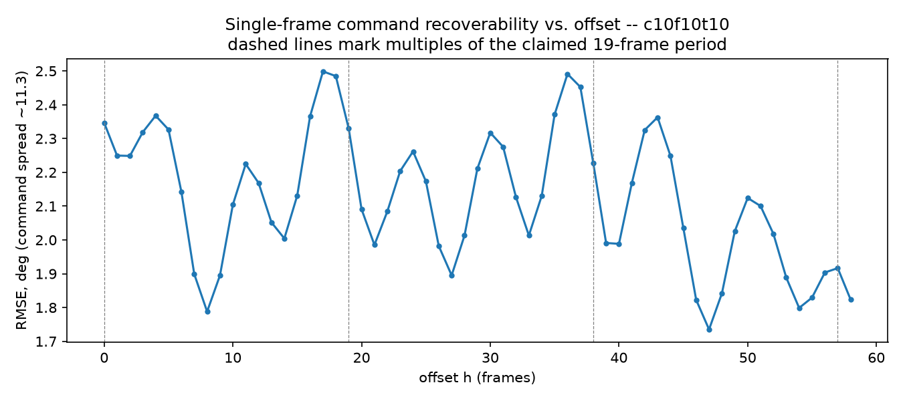
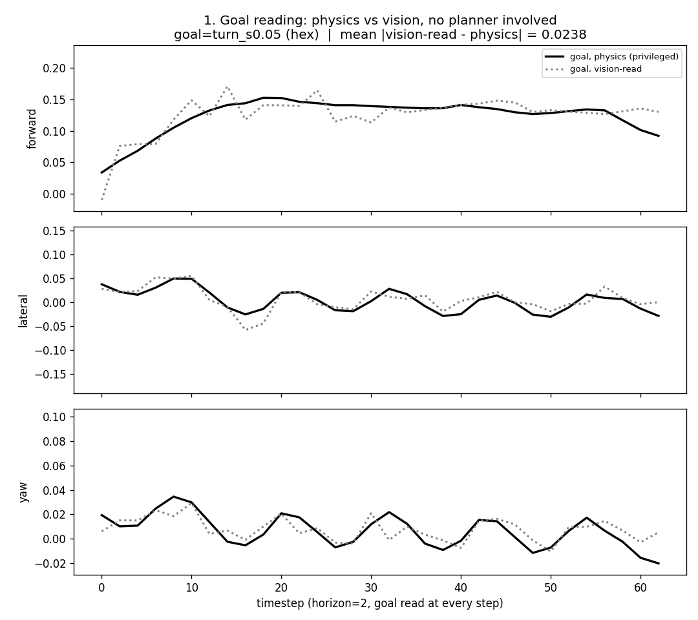
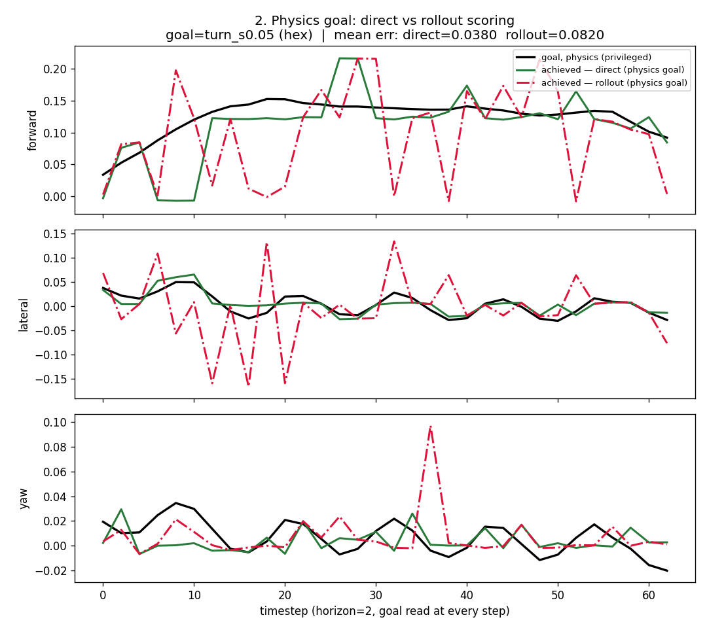

# Progress Update — Cross-Morphology and Cross-Embodiment Latent Action Models

Stick insect (*Medauroidea extradentata*) and Unitree B1, simulated in CoppeliaSim.

> **How to read this deck — one throughline, three stages.** Stage 1 (Sections 1–6) builds the
> pipeline and forces a shared latent objective on a controlled testbed where every body shares one
> joint space. Stage 2 (Sections 7–10, Slides 11–15) extends that objective to two bodies whose
> action spaces share nothing, validates that the shared coordinate transfers, and then asks the
> question that leaves open: does the resulting world model actually *use* the action it's given?
> Two independent fixes answer it — one on the training objective (Slide 15), one on the camera
> (Slides 13–14) — and both stay in, since neither one subsumes the other. Stage 3 (Slide 16 on) is
> where the resulting model stands today: a closed-loop test of what those fixes bought, and two
> real controllers built on top of it.

## 1. Background — A locomotion controller is fitted to one body

The analogy this thesis attempts is a real one in psychology: **Social Learning Theory**, vicarious
learning (Albert Bandura, 1977) — the acquisition of a behaviour by observing another agent perform
it, with no direct instruction. A held-out body's controller, with no prior knowledge of the
behaviour required of it, is informed only by video of a different body's behaviour. It does not
resemble that body and has never itself performed the behaviour, with no direct instruction and no
kinematic account of either body supplied to bridge them.

- The behaviour crosses through what is *observed*, not by telling the model about the bodies
  involved.
- **The problem.** A locomotion controller maps state to joint commands. With a morphology change,
  the same numerical command can produce a different physical result: the robot stumbles, stands at
  a different height, or does not move at all. Every body needs its own commands for the same
  behaviour.
- **The contribution.** A world model that plans toward a goal defined in a coordinate shared across
  bodies whose action spaces have nothing in common — no kinematic model, no retargeting, no
  existing controller on the target robot. The only thing the two robots share is what a camera
  sees.
- **The gap, stated against what exists:**

```
                          needs a kinematic model
                                    ▲
          joint-tokenised universal  │   retargeting-based cross-morphology
          controllers (graph /       │   controllers (body description + IK)
          transformer over the tree) │
      ────────────────────────────────┼────────────────────────────────▶  crosses leg count
                                    │
          morphology-parameter       │   ███ THIS WORK ███
          quadruped world models     │   video only, eighteen joints ↔ twelve
                                    │
                          needs no kinematics
```

Everything that crosses leg count needs a body model. Everything that needs no body model doesn't
cross leg count. The lower-right quadrant is empty, and locomotion has no end-effector pose to
retreat to the way manipulation does: eighteen and twelve joint targets share no dimension.

> **บทพูด (TH).** ปัญหาคือ policy ที่เทรนให้หุ่นตัวหนึ่งใช้กับหุ่นตัวอื่นไม่ได้เลย เปลี่ยนความยาวขา
> เปลี่ยนโครงกระดูก ต้องเทรนใหม่ทุกครั้ง แนวคิดที่ตรงที่สุดมีชื่อในจิตวิทยาอยู่แล้วคือ **vicarious
> learning** — เรียนรู้พฤติกรรมจากการ**ดู**ตัวอื่นทำ ไม่ต้องมีใครสอนตรง ๆ ไม่ต้องเคยทำเองมาก่อน และร่างไม่
> จำเป็นต้องเหมือนกัน **โจทย์**: หุ่นคนละร่างสั่งคำสั่งตัวเลขเดียวกันแล้วได้ผลจริงต่างกัน ต้องมีของตัวเอง
> **สิ่งที่เราเสนอ**: world model ที่วางแผนผ่านพิกัดร่วม ไม่ต้อง kinematic model ไม่ retarget ไม่ต้องมี
> controller อยู่แล้วบนหุ่นเป้าหมาย — สิ่งเดียวที่สองตัวแชร์กันคือสิ่งที่กล้องเห็น ดูแผนภาพ: ช่องขวาล่าง
> (ข้ามขาได้ + ไม่ต้อง kinematics) ว่างอยู่ เพราะการเดินไม่มีตำแหน่งปลายมือให้หนีไปแบบ manipulation

### Requirements

| # | requirement | why |
|---|---|---|
| R1 | the shared quantity must mean the same physical thing on both bodies without a hand-built correspondence | otherwise it isn't cross-embodiment, it's relabelling |
| R2 | no CAD/URDF, no kinematic tree, no per-robot adapter fitted from that robot's own proprioception | this is the exact thing every existing route (Section 2) supplies and this thesis withholds |
| R3 | readable from **egocentric video alone** at deployment time | proprioception-free is the whole point — an animal or damaged robot has no other channel |
| R4 | the visual encoder stays frozen | isolates the claim to what a frozen, off-the-shelf video model already carries |
| R5 | the representation must be shown to be *used* by the forward model, not just decodable from it | Experiment 2.3/2.4 exist because R5 is not automatically satisfied by R1–R4 |

### Scope and Assumptions

- Entirely simulation: hexapod in CoppeliaSim/Bullet, Unitree B1 in MuJoCo. No sim-to-real.
- Two-stage design: Stage 1 (hexapod leg-length variants, one joint space) is a **controlled
  prerequisite**, not the claim — it cannot show vision beats proprioception, because all variants
  share one 18-D joint space. Stage 2 (hexapod × B1, disjoint 18-D/12-D spaces) is where the claim
  is actually tested.
- Camera is egocentric by design decision, not accident — and that decision is itself one of the
  measured results (Experiment 2.4), not an assumption taken for granted going in.
- Behaviours are drawn from a **curated library** (forward/turn/strafe at several speeds), not an
  unconstrained babble space, for Stages 1–2; babble is a separate, later extension (Slide 25).
- **Explicitly not claimed:** real-robot transfer, zero-shot cross-embodiment, reliable multi-step
  closed-loop control, a scaling law over many embodiments.

---

## 2. Background — Idea forming from the literature

- **Hu, Chen, and Lipson (2025)**, *Egocentric Visual Self-Modeling for Autonomous Robot Dynamics
  Prediction and Adaptation*. They learn a task-agnostic visual self-model for a legged robot from a
  single egocentric camera and random motor babbling, with no prior knowledge of the robot's
  morphology, kinematics, or task, and use it to plan locomotion and even to detect and recover from
  physical damage. Their claim is that the body description was never necessary. Their self-model is
  fitted to one robot at a time: each body is babbled and modelled separately, there is no action
  representation shared between bodies, and nothing is ever transferred from one body to another.
  **Extending that premise across embodiments is what this thesis attempts.**
- **Huang et al., *Cross-Embodiment Robot Foundation World Models with Latent Actions*, ICML 2026.**
  Different robots have different action formats, so they discard explicit action labels as the
  conditioning signal and define a latent action instead — the world model is conditioned on `z`
  rather than on any robot's native command vector. One latent space covers several embodiments, and
  adding embodiments *improves* it rather than fragmenting it. **This is the piece we adapt into
  locomotion.** Their setting is manipulation, where every embodiment already shares one task space
  (end-effector pose); locomotion has no such shared space to condition on, which is exactly the gap
  Section 1 draws.

> **บทพูด (TH).** สองงานนี้เป็นจุดเริ่ม **Hu et al. (2025)** พิสูจน์ว่าไม่ต้องรู้ kinematics เลยก็ควบคุม
> ได้ ด้วยแค่ babble กับกล้องตัวเดียว แต่ทำทีละตัว ไม่เคยแชร์อะไรข้ามหุ่น — งานนี้เอาแนวคิดนั้นไปทดสอบข้ามหุ่น
> **Huang et al. (ICML 2026)** เสนอ latent action แทนคำสั่งดิบของแต่ละหุ่น เพราะหุ่นแต่ละตัวมี action
> format ไม่เหมือนกัน ใช้ latent เดียวครอบหลายร่างได้ และยิ่งเพิ่มร่างยิ่งดีขึ้น — แต่ของเขาคือ manipulation
> ที่มี task space ร่วมอยู่แล้ว (ตำแหน่งปลายมือ) การเดินไม่มีของแบบนั้นให้ยืม นี่คือช่องว่างที่ section 1 พูดถึง

---

## 3. Methodology — Pretraining pipeline

```
   frame ──▶ [ frozen visual encoder ] ──▶ observation
                                               │
                            observation pair ──┴──▶ [ inverse model ] ──▶ latent action
                                                                              │
            observation + latent action ──▶ [ forward model  ] ──▶ predicted next observation
            observation + latent action ──▶ [ command decoder] ──▶ joint command
```

- **Encoder:** a one-billion-parameter video model, frozen throughout, never trained on robots. The
  three modules on top of it are about five million parameters each.
- **Inverse model:** given a transition, what action produced it? — this is where the latent action
  comes from.
- **Forward model:** does the latent action let us predict what happens next?
- **Command decoder:** can the latent action be turned back into an executable joint command? It
  never sees the second frame — whatever the transition contributes has to pass through the 64-number
  latent, and that bottleneck is the whole design.
- **Training signal:** predict the next observation, and recover the real joint command, nominally
  equal weight — but the two losses differ in scale by two orders of magnitude, so next-observation
  prediction takes roughly 99% of the gradient in practice. The term meant to ground the latent in
  real commands runs on the remainder.

> **บทพูด (TH).** encoder เป็นโมเดลวิดีโอพันล้านพารามิเตอร์ **แช่แข็งไว้ ไม่เคยเทรนกับหุ่นยนต์เลย** เทรนแค่
> สามโมดูลเล็ก ๆ บนมัน: inverse model ถามว่า "เปลี่ยนจากภาพนี้ไปภาพนั้น เกิดจากคำสั่งอะไร", forward model
> ถามว่า "คำสั่งที่ถอดได้ ทำนายอนาคตได้ไหม", command decoder ถามว่า "แปลงกลับเป็นคำสั่งข้อต่อที่สั่งได้จริง
> ไหม" — decoder ไม่เคยเห็นเฟรมที่สอง ต้องลอดผ่าน latent 64 ตัวเท่านั้น และ loss สองก้อนต่างสเกลกันร้อยเท่า
> ทำให้การทำนายภาพกินเกรเดียนต์ไปราว 99%

---

## 4. Methodology — Stage 1, Experiment 1.1: does the decoder read the frame, or recall the nearest training body?

**Assumption / Input→Output / Answers.** If the latent truly separates movement from body, a
held-out body's commands should come from its own geometry, not a memorized nearby body. Input:
body A's frame + body B's latent (a forced conflict); output: predicted joint command, checked
against body B's true command. Answers **Objective 1** — establishes the fix the shared coordinate
needs before it can be trusted at all.

**The bodies.** Training data uses six-legged walkers differing only in segment lengths. Held-out
bodies are what the model is never trained on, and become the unseen-body test.

**Commands are retargeted.** Data used in training takes one foot trajectory in Cartesian space,
solved separately for each body by inverse kinematics: same intended behaviour, genuinely different
joint numbers.

**Behaviour:** forward walking, one speed.

**The hypothesis.** If the latent truly separates movement from body, then a body never seen in
training should receive commands appropriate to its own geometry — not the commands of whichever
training body it most resembles.

| held-out c08f09t09 | coxa | femur | tibia |
|---|---|---|---|
| the truth | 0.80 | 0.90 | 0.90 |
| probe on the visual encoder (4,227 params) | 0.84 | 0.91 | 0.91 |
| the motion decoder (5.2M params) | 0.62 | 0.96 | 0.96 |

The probe lands close everywhere; the decoder implies a coxa **22% shorter than the body actually
has**. The bigger model is the one that misreads it.

**Follow-up experiment: is the decoder reading the frame, or recalling the latent's nearest body?**
Give the motion decoder body A's frame together with body B's latent — a conflict a decoder that
reads geometry should resolve toward the frame it's holding. The two bodies' true commands differ by
21°. The decoder answers with body B's command, to within 6°: it follows the latent and ignores the
frame. **Interpretation:** the decoder has learned to recognise the closest body in its training set
and recall that body's commands, not to read geometry from the frame it's given. Under this failure
mode, "make the new body observe the old body and behave like it" would fail outright, because the
model never learned the frame-action relationship that idea depends on.

**Ruling out capacity and access before touching the objective.** Four candidate fixes were tested
first — rescaling the target, shrinking the decoder, stripping body identity from the latent
adversarially, and giving the decoder a global view of the frame — and each failed or made transfer
worse. None of them change what the loss function actually requires the decoder to do, which is the
property tying the four failures together. **The fix is therefore in the objective:** every body
shares the same intent and differs only in geometry, so add one loss term that makes that explicit —
take body A's latent, show the decoder body B's frame, and require body B's command (`A's latent,
B's frame, B's command`).

| held-out body test | without the term | with it |
|---|---|---|
| command error | 3.67° | 3.44° |
| image's worth to the decoder | 0.4× | 9.6× |
| movement's share of the latent | 82% | 93% |
| body identity's share of the latent | 12% | 3% |

The latent stopped carrying a job that was never its own, and the two inputs ended up with separate
jobs: the image carries which body, the latent carries what movement.

**Finding / remaining gap.** The decoder was recalling the nearest training body, not reading
geometry; the cross-body loss term fixes it, validated in-distribution. Not yet tested: whether the
fix holds outside the geometry the training data spans — bridges directly to Experiment 1.2.

> **บทพูด (TH).** หุ่นทุกตัวมีขา 6 ขา 18 ข้อต่อเหมือนกัน ต่างกันแค่ความยาวขา คำสั่งได้จากแก้ IK จาก
> รอยเท้าเดียวกัน — เจตนาเดียวกัน ตัวเลขคำสั่งต่างกันจริง **probe เล็กจิ๋วอ่านความยาวขาของหุ่นที่ไม่เคยเห็นได้
> แม่น แต่ decoder ใหญ่กว่าพันเท่าอ่านผิด** (coxa สั้นกว่าจริง 22%) swap test บอกสาเหตุ: สลับ latent คนละตัว
> มันตอบตาม latent ไม่สนใจภาพเลย — **มันจำหุ่นที่ใกล้ที่สุดในชุดเทรนได้ ไม่ได้อ่านรูปร่างจากภาพ** ลองแก้ที่
> โมเดลมาสี่ทางแล้วไม่ได้ผล เพราะปัญหาไม่ใช่ความสามารถ แต่ loss ไม่เคยบังคับให้อ่านรูปร่างจากภาพเลย — เพิ่ม
> loss term เดียว (latent ของ A คู่กับภาพของ B ต้องตอบคำสั่งของ B) ภาพมีค่าต่อ decoder เพิ่มขึ้น 22 เท่า
> และ latent สะอาดขึ้น (การเคลื่อนไหว 82→93%, ตัวตนของร่าง 12→3%)

---

## 5. Methodology — Stage 1, Experiment 1.2: transfer inside vs. outside the training geometry's span

**Assumption / Input→Output / Answers.** Transfer only holds within the geometric span the training
data actually covers — extrapolation is not assumed to work. Input: a held-out body's frame; output:
predicted joint command (R² against ground truth), measured inside vs. outside the training span.
Scopes **Objective 1** — states the condition under which the coordinate is learnable at all.

| | ground truth (IK) | control | with the cross-body loss |
|---|---|---|---|
| forward distance | 100% | 85% | 90% |
| heading deviation | 0° | 11.8° | 5.5° |
| worst joint-limit excursion | 0° | 8.2° | 3.9° |

Inside the geometry the training set spans, the predicted commands actually walk, driven open-loop
through the same physics used to collect the data, on a body never trained on.

| same model | error | R² |
|---|---|---|
| a body with geometry inside the training span | 3.4° | 0.81 |
| a body with femur/tibia ratio outside the training span | 13.4° | −0.34 |

Outside that span, the same weights fail — proved, not assumed.

**Test:** same budget, same held-out body, but the training set now contains bodies whose segments
don't move together the way every other training body's do.

| same model | coxa | femur | tibia |
|---|---|---|---|
| ground truth | 1.00 | 1.00 | 0.80 |
| probe fitted on the original dataset | 0.955 | 0.819 | 0.819 |
| probe fitted on the original dataset + the added bodies | 0.973 | 0.954 | 0.772 |

The distance from the held-out body's segment scales to the nearest mixture of the training bodies
predicts this failure on its own — no encoder, no model, no learning at all. Every body that cannot
be mixed from the training set fails; the one that can, succeeds.

**A tool this produced:** before committing to a train/held-out split, fit the probe on the training
bodies and read off how well it recovers the held-out one. A large error there says the split is
asking for a direction the data does not span, and the run will not answer the question meant to be
asked — check this before spending the training run, not after.

**Finding / remaining gap.** Transfer holds inside the training geometry's span, fails outside it —
and the failure is predictable in advance from the probe alone. Not yet tested: whether the action
itself matters at all, or the whole prediction is pose-driven — bridges to Experiment 1.3.

> **บทพูด (TH).** ในช่วงรูปร่างที่ข้อมูลครอบคลุม คำสั่งที่ทำนายเดินได้จริง (ระยะ 90%, เลี้ยวเพี้ยนน้อยกว่า
> ครึ่ง) นอกช่วงนั้นพังทันที (13.4°, R² ติดลบ) **สาเหตุพิสูจน์ได้ ไม่ใช่แค่เดา**: ลองเพิ่มหุ่นที่สองท่อนขา
> ไม่เท่ากันเข้าไปในชุดเทรน แค่ probe อย่างเดียว (ไม่ต้องเทรน decoder ใหม่เลย) ก็บอกได้แล้วว่าจะพังไหม —
> **เครื่องมือที่ได้จากตรงนี้**: ก่อนจะ split train/held-out ให้ fit probe บนชุดเทรนแล้วดูว่า probe อ่านตัว
> held-out ได้แม่นแค่ไหนก่อน ถ้าคลาดมากคือ split นั้นถามคำถามที่ข้อมูลตอบไม่ได้ตั้งแต่ต้น

---

## 6. Methodology — Stage 1, Experiment 1.3: how much of the command comes from the transition, not just the pose

**Assumption / Input→Output / Answers.** Gait periodicity may make the pose alone predictive of what
comes next, independent of the action — a hypothesis this stage motivates but does not test directly.
Input: the current frame's embedding, with the true transition corrupted or removed; output: predicted command / next
embedding. Motivates **Objective 3**'s mechanism question; the direct test is Experiment 2.3.

| what the ITM is given as the next frame | change |
|---|---|
| the true next frame | 3.37° (1×) |
| the current frame again (no transition) | 1.34× |
| `e_{t-1}` (wrong transition) | 1.65× |
| `e_random` (other time) | 3.44× |
| `ITM(None)` | 3.48× |

Without the transition, the motion decoder `MD(e_t, z_t)` cannot work — `z` is carrying the movement
it needs. A wrong transition hurts *more* than no transition; removing the transition entirely costs
31% accuracy. The latent action is genuinely sensitive to what the second frame contains.

| predict from 1 frame | t | t+1 | t+2 | t+4 | t+8 | t+16 | t+32 |
|---|---|---|---|---|---|---|---|
| error, deg (signal spread 11.3°) | 4.61 | 4.89 | 5.17 | 5.33 | 5.23 | 5.03 | 4.45 |

*(4-clip ridge fit — noisier than the rest of this deck's numbers; a cleaner 18-clip re-fit exists
only at t/t+8/t+32, 3.00/3.40/2.86°, and agrees in kind.)*

| steps ahead | `e_{t+h}` | `e_0` | beats `e_0` by |
|---|---|---|---|
| 1 | 1.39 | 2.11 | 1.52× |
| 3 | 1.78 | 3.05 | 1.72× |
| 5 | 2.12 | 3.57 | 1.69× |
| 10 | 2.98 | 4.36 | 1.46× |

Error does not grow with horizon out to 32 frames — but stated precisely, not overclaimed: 7 sampled
offsets (above) is not enough to show an *oscillating*, periodic error curve, only that it stays
roughly flat at the points sampled. One frame already identifies which feet are swinging (81.5%
accuracy against 50% by chance), and a second frame is worth only 1.11× on the step-to-step change.

**Does the error trace actually oscillate with the gait, and at what period?** Same one-frame ridge
regression as above, now scored continuously at every offset from 0 to 58 frames instead of 7
sampled points, holding the same set of starting frames fixed across every offset so the curve
isn't confounded by later offsets simply having less (and different) data to score against.



The error genuinely oscillates — it is not flat, and it is not a monotonic drift. Its spectrum has
one clearly dominant component at a period of **≈6.6 frames** (roughly 3× the spectral power of
anything else in the curve), plus a real but secondary component at **≈19.7 frames** — close to
this project's previously-assumed "period ≈19" figure, but not the dominant one. Read as: the gait
does have a fine-grained periodic structure, at roughly a third of the previously-assumed period,
with the ≈19-frame figure showing up as a weaker harmonic rather than the fundamental.

```
   a gait is a limit cycle — hypothesis, motivated by the numbers above
     one frame already reads most of the phase (81.5% feet-swinging accuracy)
       does the phase alone fix what comes next, with the action worth nothing extra?
         not tested here — Stage 1 never isolates the action from the pose;
         that isolation (real z vs. null z, through the forward model) is Experiment 2.3
       is the error periodic, and at what period?
         yes — dominant period ≈6.6 frames, ≈19.7-frame component present but secondary (above)
```

**What this stage does and does not establish.** The forward model's rollout clearly captures real
structure — it beats a trivial "hold the current frame still" baseline by 46–72% at every horizon
tested (table above). But that comparison never isolates the action itself: it compares "run the
model" against "don't run the model," not "the real action" against "a null action" through the
same model. Stage 1 never ran that isolation. It's a real gap, not a rounding error — the "<3%"
figure this project reports for the action's own contribution comes from a later, Stage 2-era
measurement (Experiment 2.3, F142) that tested both bodies together; reporting it here as a Stage 1
result would overstate what this stage alone shows.

**Stage 1 proves the pipeline is promising and that the remaining problem is tied to locomotion's
structural periodicity, now measured, not assumed** (above). It cannot yet prove that vision helps
share behaviour where proprioception could not, because this setup doesn't have the variety needed
for that — it needs a second body whose action space is genuinely disjoint from the first.

**Finding / remaining gap.** Pose carries most of the phase signal on its own (81.5% one-frame); the
gait is confirmed periodic, dominant period ≈6.6 frames with a secondary ≈19.7-frame component. The
action's own marginal contribution is still never isolated here. Not yet tested: real-vs-null action
through the forward model — bridges to Stage 2 (Experiment 2.1a), where a second, disjoint body
finally forces the question a single joint space can't ask.

> **บทพูด (TH).** ไม่มี transition, MD ทำงานไม่ได้เลย — z แบกข้อมูลการเคลื่อนไหวไว้จริง transition ที่ผิด
> ยิ่งแย่กว่าไม่มี transition ตัด transition ออกเสียแม่นยำแค่ 31%
> **เรื่อง horizon**: ทดสอบ 7 จุด (t, t+1, t+2, t+4, t+8, t+16, t+32) error 4.61/4.89/5.17/5.33/
> 5.23/5.03/4.45° (fit จาก 4 คลิป มี noise; re-fit ที่สะอาดกว่ามีแค่ 3 จุด 3.00/3.40/2.86° ตรงกัน) —
> **error ไม่โตขึ้นตาม horizon แต่แค่นี้ยังพิสูจน์ "เป็นวงรอบ" ไม่ได้** 7 จุดพิสูจน์ได้แค่ว่า "ราบเรียบ" ไม่ใช่
> "แกว่งเป็นคาบ" เฟรมเดียวบอกได้แล้วว่าขาไหนกำลังยก (81.5% เทียบเหรียญ 50%)
> **วัดต่อเนื่องทุก offset 0-58 เฟรมแล้ว (ตรึงชุดจุดเริ่มต้นให้เหมือนกันทุก offset กันความลำเอียง)**: error
> แกว่งจริง ไม่ราบ ไม่ใช่แนวโน้มทางเดียว — สเปกตรัมมี component เด่นที่คาบ **≈6.6 เฟรม** (แรงกว่าอันอื่นราว 3
> เท่า) และมี component รองจริงที่ **≈19.7 เฟรม** ใกล้ตัวเลข "≈19" ที่เคยอ้างไว้ แต่ไม่ใช่ตัวหลัก — สรุปคือ
> การเดินเป็นวงรอบจริง แต่คาบพื้นฐานสั้นกว่าที่เคยคิดไว้ราวสามเท่า ส่วนคาบ 19 เฟรมเป็น harmonic รอง
> **ข้อจำกัดที่ต้องพูดตรง ๆ**: FTM ทำนายได้ดีกว่า baseline ที่ไม่ขยับเลย 46-72% แต่การเทียบนั้นไม่ได้แยก action
> ออกจาก pose เลย — เทียบแค่ "รันโมเดล" กับ "ไม่รันโมเดล" ไม่ใช่ "action จริง" กับ "action ว่างเปล่า" ผ่านโมเดล
> เดียวกัน **stage นี้ยังไม่เคยแยกทดสอบแบบนั้น** ตัวเลข "<3%" ที่โปรเจกต์นี้ใช้อ้างเป็นของ stage 2 (experiment 2.3,
> F142) ซึ่งวัดทั้งสองหุ่นพร้อมกัน เอามาใช้ตรงนี้จะเกินจริงจากที่ stage นี้พิสูจน์ได้เอง
> **สรุป Stage 1**: พิสูจน์ได้ว่า pipeline มีทางไปได้ และปัญหาที่เหลือเกี่ยวกับความเป็นวงรอบของการเดินจริง
> (วัดแล้ว ไม่ใช่แค่สมมติ) — ยังพิสูจน์ไม่ได้ว่าภาพช่วยแชร์พฤติกรรมที่ proprioception ทำไม่ได้ เพราะ setup นี้
> ยังไม่มีหุ่นตัวที่สองที่ action space แยกจากตัวแรกจริง ๆ

---

## 7. Methodology — Stage 2: what crossing embodiments with vision requires

Vision-based world models for locomotion and manipulation, and what each leaves open — separated on
purpose so the search across both literatures is visible:

| | what it establishes | what it does not do |
|---|---|---|
| egocentric visual self-model (locomotion) — Hu et al. 2025 | morphology and kinematics are not needed; babble + a camera suffice to plan, and can detect and recover from damage | no cross-embodiment, no transferring between bodies |
| latent-action world models (manipulation) — Huang et al. 2026 | a shared action between bodies, inferred from video alone | no need to map anything, because all bodies already share the same task space |
| cross-embodiment latent-goal planning (manipulation) | a shared latent goal space across different bodies is achievable | built from retargeted, temporally aligned paired demonstrations |
| action-conditioned video world models | name the failure when prediction ignores the action | diagnosed on manipulation or single-body locomotion, never across embodiments — this is Section 6's own problem, still open, and Section 11 is where it gets confronted directly |

**The key thing none of these three hand us: a shared GOAL.** Manipulation gets its cross-embodiment
coordinate for free — end-effector pose already means the same thing on every arm, because the
kinematics are known. Locomotion has no such prior knowledge at all. No kinematics, no task space,
nothing but vision.

**So a new shared coordinate has to be found, in that same sense — one number that means the same
thing on any legged body. That's Froude.** But computing it still needs privileged knowledge of the
body — true velocity, gravity, hip length (`v`, `g`, `L`) — to build the training label in the first
place. That privilege is only there to *shape the network*: once trained, it reads Froude off video
alone. Privileged at training time, proprioception-free at deployment.

**That coordinate is the Froude number, and the claim rides on it entirely:**

```
   Fr = v / sqrt(g · L)
```

speed made dimensionless by body size (`L` ≈ hip height). Two robots of very different size, walking
"the same way," land on the *same* Froude number:

| | hexapod | B1 |
|---|---|---|
| hip height `L` | ~0.09 m | ~0.56 m |
| a normal walk, m/s | 0.13 | 0.29 |
| **same walk, in Froude** | **~0.13** | **~0.13** |

Three channels: forward, lateral, yaw. This single equation is what makes a goal read off one
body's video mean anything at all to a body that shares no joint, no size, and no kinematics with
it — without it there is no shared target to plan toward, and the whole cross-embodiment claim has
nothing to stand on.

**And this is also where the "no prior" claim actually gets tested.** The goal can be produced two
ways: read the true, privileged number directly off the source body's recorded motion, or read it
off nothing but the source body's *video* — no proprioception, no state, no kinematics, exactly what
a genuinely novel body would have to work with. The claim this thesis needs is that the second way is
**good enough to replace the first**: that vision alone recovers the same shared coordinate a
privileged read would, so that nothing about crossing bodies secretly depends on information the
motivating scenario (an animal, a damaged robot, unknown hardware) could never actually supply.

> **บทพูด (TH).** สามงานนี้ไม่มีตัวไหนให้ **เป้าหมายร่วม** มาเปล่า ๆ เลย — **manipulation ได้พิกัดร่วมมาฟรี**
> (ตำแหน่งปลายมือ) เพราะรู้ kinematics อยู่แล้ว **การเดินไม่มี prior knowledge อะไรเลย** ไม่มี kinematics
> ไม่มี task space มีแค่ภาพ
> **เลยต้องหาพิกัดร่วมใหม่ ในความหมายเดียวกันนั้น** — ตัวเลขเดียวที่ความหมายเหมือนกันบนหุ่นมีขาทุกตัว นั่นคือ
> **Froude** แต่การจะคำนวณมันได้ ยังต้องใช้ความรู้พิเศษของร่างกาย (ความเร็วจริง, แรงโน้มถ่วง, ความยาวขา —
> `v`, `g`, `L`) เพื่อสร้าง label ตอนเทรน — สิทธิพิเศษนี้มีไว้แค่ **สร้างเน็ตเวิร์ก** พอเทรนเสร็จแล้ว มันอ่าน
> Froude จากวิดีโอล้วน ๆ ได้เลย **มีสิทธิพิเศษตอนเทรน ไม่ต้องมี proprioception ตอนใช้งานจริง**
> **ข้อเคลมทั้งหมดตั้งอยู่บนสมการนี้**: `Fr = v / sqrt(g·L)` — ความเร็วหาร
> ด้วยขนาดตัว หุ่นคนละขนาดที่เดินแบบเดียวกันได้ค่าเท่ากันเป๊ะ ถ้าไม่มีสมการนี้ก็ไม่มีเป้าหมายร่วมให้วางแผนไปหา
> เลย ข้อเคลมเรื่องข้ามร่างทั้งหมดจะไม่มีอะไรค้ำ
> **และตรงนี้คือจุดที่ทดสอบข้อเคลม "ไม่ใช้ข้อมูลพิเศษ" จริง ๆ**: เป้าหมายทำได้สองแบบ — อ่านตัวเลขจริงที่อัดไว้
> (มีข้อมูลพิเศษ) กับอ่านจาก**วิดีโอ**ล้วน ๆ ไม่มี proprioception ไม่มี kinematics เลย ซึ่งคือสิ่งเดียวที่หุ่น
> ตัวใหม่จริง ๆ จะมี **ข้อเคลมที่ต้องพิสูจน์คือวิธีที่สองต้องดีพอที่จะแทนวิธีแรกได้** — ว่าภาพเพียงอย่างเดียว
> อ่านพิกัดร่วมได้เท่ากับการอ่านแบบมีสิทธิพิเศษ ไม่งั้นข้อเคลมเรื่องข้ามร่างจะแอบพึ่งข้อมูลที่หุ่นตัวใหม่จริง ๆ
> ไม่มีทางมีได้

---

## 8. Methodology — Stage 2, Experiment 2.1a: does a shared-coordinate loss need to exist at all?

**Assumption / Input→Output / Answers.** A body-motion loss term is necessary to force `z` to mean
the same thing on both bodies — nothing shares that structure for free. Input: the latent action; output: the
Cross-Body Head's Froude prediction, R² measured in all four directions (insect/B1 × insect/B1).
Answers **Objective 1** (the coordinate exists) and part of **Objective 2** (the objective it needs).

Same as Stage 1: a hypothesis, an objective needs to be handed. Froude is the shared target. To force it to actually be shared across the two bodies' latents, add one loss term, read by a single small
network shared across both bodies — called the **Cross-Body Head** from here on (code: `body_head`):

```
   L_body = || b_hat_t − b_t ||        b_hat_t = body_head(z_t)
```

**Setup.** One world model, pretrained jointly on both bodies in a single run. Behaviour: forward
walking, matched Froude speed across both robots (Section 7's own worked example, ~0.13). Both
robots are walked at that matched speed, so a readout fitted on one body should work on the other —
a bad score is the representation's fault, not the question's.

| | insect→insect | b1→b1 | insect→b1 | b1→insect |
|---|---|---|---|---|
| frozen encoder | 0.676 | 0.753 | −0.046 | 0.131 |
| control, no term | 0.664 | 0.167 | −7.083 | −2.357 |
| + Cross-Body Head, λ=0.5 (2 seeds) | 0.798 / 0.815 | 0.879 / 0.881 | +0.544 / +0.749 | +0.435 / +0.704 |
| + Cross-Body Head, λ=0.1 | 0.809 | 0.868 | 0.675 | 0.624 |

Without the term, cross-robot readout is systematically wrong. With it, both directions go
positive — and the model is not preserving structure V-JEPA2 already supplied (the frozen-encoder
row is itself negative on `insect→b1`); it is creating structure the encoder did not have.

**One term, two payoffs, checked side by side.** Left column: does the shared term also help a robot
decode its *own* joint commands (18-D insect, 12-D B1)? Right column: same cross-robot R² as above,
just placed next to it.

| | decode own joints (loss, lower better) | cross-robot transfer (same R² as above) |
|---|---|---|
| no body term | 0.3517 | −28.9 / −43.1 |
| **+ shared body term** | **0.2183** | **+0.610 / +0.573** |

One term, two wins at once: 38% better at decoding the robot's own joints, and the same cross-robot
transfer already shown above.

**But "shared" is not the same claim as "transferred," and this is the open question the term does
not settle.** The readout improving on both bodies is consistent with two different mechanisms: the
latent genuinely learning what a shared body-motion coordinate should look like across robots, or
the term simply making the latent more normalized/well-scaled in a way that happens to help a linear
readout regardless of whether the network anywhere *uses* that shared structure for anything.
Section 9 is what happens when that question gets asked directly.

**Finding / remaining gap.** Without the Cross-Body Head term, cross-robot readout is systematically
negative; with it, both directions go positive. Not yet settled: whether that's the latent genuinely
learning a shared coordinate, or just better-scaled normalization — bridges directly to Experiment 2.1b.

> **บทพูด (TH).** ไอเดีย: Froude คือเป้าหมายร่วม (section 7) เพิ่ม loss term บังคับให้ latent สองหุ่น
> ถูกอ่านออกมาตรงกันได้จริง (`L_body = ||b_hat_t − b_t||`) — สองหุ่นเดินที่ Froude เท่ากัน ถ้า readout ที่
> fit จากหุ่นหนึ่งเอาไปใช้กับอีกหุ่นแล้วแย่ ก็เป็นความผิดของ representation ไม่ใช่คำถาม
> **ผล**: ไม่มี term การอ่านข้ามหุ่นผิดเพี้ยนสิ้นเชิง (ติดลบหนัก) มี term แล้วทั้งสองทิศเป็นบวก **term เดียว
> ได้สองอย่างพร้อมกัน**: ถอดคำสั่งข้อต่อของหุ่นตัวเองแม่นขึ้น 38% และข้ามหุ่นได้ด้วย (ตัวเลข R² เดียวกับที่พูด
> ไปแล้วด้านบน ไม่ใช่การทดสอบใหม่)
> **แต่ "แชร์กันได้" ไม่เท่ากับ "เอาไปใช้จริง"** — readout ดีขึ้นอาจเป็นเพราะ latent แค่ normalize เนียนขึ้น
> ไม่ได้แปลว่า network เข้าใจพิกัดร่วมจริง ๆ **นี่คือคำถามที่ค้างไว้ ให้ section 9 ไปตอบต่อ**

---

## 9. Methodology — Stage 2, Experiment 2.1b: should the shared-coordinate loss's gradient reshape z, or only train body_head?

**Assumption / Input→Output / Answers.** The bottleneck is the Cross-Body Head's own training
dynamics (competing gradients reshaping `z` every step), not the information content of `z` itself.
Input: frozen `z`; output: a freshly-trained head's Froude prediction, real-vs-mean cosine gap.
Answers **Objective 2** — which training regime is required for the transfer to actually be usable.

**Two separable questions, not one.** Section 8 asked whether the shared-coordinate loss needs to
exist at all — it does; without it, cross-robot readout is systematically negative. This section
asks a different question: once it exists, should its gradient also reshape `z`, or only train the
Cross-Body Head?

**Why the Cross-Body Head has to exist at all.** `z` is an opaque 64-number code — nothing in it is
inherently "forward speed," and nothing guarantees coordinate 17 of the insect's `z` means the same
thing as coordinate 17 of B1's `z`. Somebody has to know how to read it — a trained function mapping
`z` onto the one space that *is* shared: the three-channel Froude coordinate. That's the Cross-Body
Head, and it's not a training-time extra — it's what every real use calls: reading a goal off video,
scoring an action at control time (`score(a) = |body_head(proj(a)) − goal|`). No Cross-Body Head, no
cross-embodiment claim to test.

**"z already contains Froude" only ever means: some function fitted on z can read it out.** Not that
the raw numbers in z are Froude, or line up the same way across bodies for free. Even the test below
uses a small trained network to do that reading — that network *is* the Cross-Body Head's job, just
done separately. The question is whether the real one is trained well.

**Test: is the signal there regardless of whether the real head found it?** Freeze the same `z`
Section 8 already used, bolt on a fresh head, train it on Froude alone, nothing else competing:

| latent source | action-lever gap (bar 0.110) |
|---|---|
| inverse model, read from a real frame pair | +1.048 to +1.226 |
| projector, read from the action alone | +1.049 to +1.092 |

**Passes by ~10×.** So `z` was never the problem — the original Cross-Body Head, co-trained alongside
it, simply never learned to read it this well.

**Why not.** The reconstruction, motion, and body-motion losses all push gradient into the same `z`,
every step. The Cross-Body Head is trying to learn `z → Froude` while `z` itself keeps getting
reshaped by two losses that have nothing to do with Froude — a moving target it never converges
against.

**Fix: stop the body-motion loss's gradient from reaching `z`.** The Cross-Body Head still trains,
but can no longer push back and reshape `z` — `z` is now shaped by reconstruction and motion alone.
One line, one full retrain, same hex+B1 recipe as Section 8:

| action-lever, real retrain | value |
|---|---|
| real z, median cos | 0.693 |
| mean z, median cos (baseline) | −0.315 |
| **gap (bar: 0.110)** | **+1.008 (~9× the bar)** |

| channel | gap (real − mean) |
|---|---|
| forward | +0.238 |
| lateral | +0.031 (weakest, still positive) |
| yaw | +0.243 |

**Not free — `z` gets measurably worse.** The body-motion loss's gradient wasn't pure competition, it
was also doing real work shaping `z`. Cut it, and `z` develops only **32-76%** of its old signal. A
real trade: `z` comes out weaker, the Cross-Body Head trains against a stable target instead and
actually learns to use it — net result still 9× better despite the weaker `z`.

**Not yet shown: this improves control** — only that the Cross-Body Head is now correctly
direction-sensitive. Whether that becomes working closed-loop behaviour is separate, unproven.

**Open item: the direct comparison this invites hasn't been run — but it's a cheap eval, not a
retrain.** Section 8's insect↔B1 R² table (0.798/0.879/+0.544/+0.435, etc.) was measured on the
co-trained version, where the body-motion loss still shapes `z`. Nobody has refit a Cross-Body Head
on *this* section's detached-`z` checkpoint and re-measured that same 4-way R² table — but that
checkpoint
(`beh12_body_stopgrad/best.pt`) is already fully trained jointly on both bodies (50 epochs, already
on disk, already used downstream for babble/gecko work), with a projector already fitted on it.
Closing this gap only needs fitting one readout and measuring R², the same protocol Section 8 used
— no new pretraining. The action-lever gap above and Section 8's R² table remain different metrics
on different checkpoints in the meantime — a real gap in the evidence, just an inexpensive one to close.

**Finding / remaining gap.** `z` was never the bottleneck — the co-trained head was; `z.detach()`
clears the bar by ~9×, at the cost of a measurably weaker `z`. Not yet shown: that this improves
actual control, and the 4-way cross-body R² re-test on this checkpoint — bridges to Experiment 2.2.

> **บทพูด (TH).** ทำไมต้องมี body_head: z คือเลข 64 ตัวที่ไม่มีความหมายในตัวเอง ต้องมี "ใครสักคนอ่านมันเป็น"
> — คือฟังก์ชันที่เทรนมาแมป z ไปยังพื้นที่ร่วม (Froude 3 ช่อง) ไม่ใช่ของช่วยตอนเทรน แต่คือสิ่งที่ทุกการใช้งาน
> จริงเรียกใช้ (อ่านเป้าจากวิดีโอ, ให้คะแนน action ตอนควบคุม) ไม่มี body_head ก็ไม่มีข้อเคลมข้ามร่างเหลือทดสอบ
> **"z มีสัญญาณอยู่แล้ว" แปลว่าแค่ "มีฟังก์ชันอ่านออกได้"** ไม่ใช่ตัวเลขดิบเป็น Froude เอง — แม้แต่ตอนทดสอบก็
> ยังต้องมีเน็ตเวิร์กเล็ก ๆ อ่านมันอยู่ดี (นั่นคืองานของ body_head) คำถามจริงคือ head ตัวจริงเทรนมาดีพอไหม
> **ทดสอบ**: freeze z ตัวเดิม ต่อหัวใหม่ เทรนอ่าน Froude อย่างเดียว **ผ่าน 10 เท่า** → z ไม่ใช่ปัญหา
> **ปัญหาคือ**: body_head ตัวเดิมเทรนพร้อม loss อื่น (recon, motion) ที่แย่ง gradient เข้า z ตลอด z เลย
> ขยับตลอดเวลา body_head ไล่จับเป้าที่วิ่งหนีไม่ทัน
> **แก้ด้วย** `z.detach()` — body_head เทรนได้ แต่บีบ z ไม่ได้อีก เทรนใหม่รอบเดียว **ดีขึ้น ~9 เท่า**
> **แต่ไม่ฟรี**: z เองอ่อนลงจริง (เหลือ 32-76% เพราะ L_body เคยช่วยสร้างสัญญาณด้วย) — trade คือ z อ่อนลง
> แลกกับ body_head นิ่งพอเรียนได้จริง **ยังไม่ได้พิสูจน์ว่าคุมหุ่นได้จริง** แค่ไวต่อทิศทางที่ควรไวแล้วเท่านั้น
> **ที่ยังไม่ได้ทำ**: ตาราง R² ข้ามหุ่นแบบเดียวกับ Section 8 แต่บน checkpoint ที่ detach z ตัวนี้ — ยังไม่มีใครรัน
> **แต่ checkpoint (`beh12_body_stopgrad/best.pt`) เทรนจบแล้วบนทั้งสองหุ่นอยู่แล้ว** (มี projector fit ไว้แล้ว
> ด้วย) แค่ fit head แล้ววัด R² เหมือน Section 8 ก็พอ **ไม่ต้องเทรนใหม่**

---

## 10. Methodology — Stage 2, Experiment 2.2: zero-shot vs. staged adaptation to a genuinely different robot

**Assumption / Input→Output / Answers.** Pretrained dynamics knowledge transfers to a structurally
different body through staged adaptation, cheaper than retraining from nothing. Input: B1's own
clips; output: adapted `z`'s correlation (ρ) to Froude, per channel, zero-shot vs. staged. Answers
**Objective 2** — correspondence-free transfer, under a specific adaptation procedure.

**The setup.** Backbone: the hexapod, pretrained across several behaviours and speeds. Question: can
that pretrain transfer its behaviour understanding to a genuinely different robot — B1 — by adapting
on B1's own clips, rather than retraining from nothing? Measured on a stratified, zero-overlap
train/held-out split (`wm/runs/beh12_hinge_cleansplit/`), scored on a held-out set never touched by
any adaptation stage, independently reproduced on two machines.

| B1 | held-out ratio | forward ρ | lateral ρ | yaw ρ | median ρ |
|---|---|---|---|---|---|
| zero-shot, no B1 adaptation | 1.061 | +0.178 | +0.125 | +0.187 | +0.178 |
| **staged adaptation** | **0.730** | **+0.261** | **+0.578** | **+0.474** | **+0.474** |

| hexapod (rehearsal) | held-out ratio | forward ρ | lateral ρ | yaw ρ | median ρ |
|---|---|---|---|---|---|
| staged adaptation | 0.659 | +0.714 | +0.403 | +0.558 | +0.558 |

Ratio is MSE against predicting the target's mean — above 1.0 means worse than guessing the average,
below 1.0 means real signal. **Zero-shot fails outright on B1** (1.061, no better than the mean) and
**staged adaptation clearly works** (0.730, every channel positive). Median ρ nearly triples
(+0.178 → +0.474), and hexapod holds a strong readout throughout rehearsal.

**The staged procedure this uses, assembled from pieces that already existed separately but had
never been run as one pipeline before:**

```
  stage 1  wm.adapt        — fine-tune ONLY the inverse/forward model on B1's own clips
  stage 2  fit_projector   — fit a separate network, the PROJECTOR: action → z, no frame pair needed
  stage 3  wm.adapt3       — optional joint fine-tune (skipped here)
  stage 4  fit_body_head   — refit the Cross-Body Head against the projector's own latent
```

**How `z` is read here.** `z = ITM(e_t, e_{t+1})`, the inverse model reading a real, already-happened
frame pair — the table above is a readout-quality measurement, not a control-time one. At the
moment a controller has to pick an action, the next frame doesn't exist yet; a separate network (the
projector, `z = proj(action)`) exists precisely to supply a `z` from the action alone, before the
outcome is known. Section 9 uses both `z` sources side by side for that reason. Stage 2's projector
is already fitted as part of this pipeline; a projector-path re-measurement of the table above is the
natural next step, not yet run.

**"A handful of clips" is only true of stage 1 — stated precisely, not as one round number:**

| stage | data it actually uses |
|---|---|
| 1 — `wm.adapt` (ITM/FTM fine-tune) | **9 B1 clips** — genuinely small, checked in the script's own defaults |
| 2 — `fit_projector` | **all available clips**, both bodies — no small-sample limiter exists |
| 4 — `fit_body_head` | 24 B1 clips, plus all 24 hexapod clips for rehearsal |

Only stage 1 is cheap by design. Stages 2 and 4 use most or all of the available B1 set, not a
handful — **the true cost of bringing up this body is closer to "the full B1 dataset across the
later stages," not "9 clips."**

**Finding / remaining gap.** Staged adaptation takes B1 from failing outright (ratio 1.061) to
genuine signal on every channel (ratio 0.730, median ρ +0.474), on a clean, leak-free, independently
reproduced split. Not yet tested: the same table under `z = proj(action)`, the control-relevant
latent; and whether the forward model, now well-calibrated to *read* the action, actually *uses* it
when predicting — bridges to Experiment 2.3/2.4.

> **บทพูด (TH).** Backbone คือแมลงหกขาที่ pretrain ไว้หลายพฤติกรรม/ความเร็ว คำถาม: เอาความเข้าใจนั้นไปใช้กับ
> หุ่นที่ต่างกันจริง (B1) ได้ไหม โดย fine-tune ด้วยคลิปของ B1 เอง ไม่ต้องเทรนใหม่ทั้งหมด วัดบน split ที่ไม่มี leak
> ยืนยันซ้ำได้บนสองเครื่อง
> **ผล**: ไม่ปรับตัวเลย (zero-shot) พังสนิท (ratio 1.061 แย่กว่าเดาค่าเฉลี่ย) ปรับแบบ 4 stage แล้วมีสัญญาณจริง
> ทุกช่อง (ratio 0.730, median ρ 0.178→0.474) หุ่นแมลงเองก็ยังอ่านได้ดีตลอด (0.659)
> **z ที่ใช้วัดตรงนี้คือ ITM(e_t, e_{t+1})** อ่านจากคู่เฟรมจริง — ไม่ใช่ z ที่ควบคุมจริงใช้ (ตอนควบคุมยังไม่มีเฟรม
> ถัดไป ต้องใช้ **projector**: z = proj(action) แทน) วัดเวอร์ชัน projector ยังไม่ได้ทำ เป็นขั้นต่อไป
> **แต่ "แค่คลิปไม่กี่คลิป" จริงแค่ stage 1 เดียว** (9 คลิป B1 เท่านั้น) — stage 2 ใช้คลิปทั้งหมดที่มีของทั้งสองร่าง
> ไม่มีตัวจำกัดจำนวนเลย stage 4 ใช้ B1 24 คลิป บวก hexapod 24 คลิปด้วย **ต้นทุนจริงเลยใกล้เคียง
> "ข้อมูล B1 ทั้งชุด" มากกว่า "9 คลิป"**

---

**Stage 2 leaves one problem untouched.** The Cross-Body Head can now correctly read the shared coordinate
out of `z` (Sections 8–10) — but that's a readout question. Whether the forward model actually
*uses* the action it's conditioned on is a separate, untested one: the Cross-Body Head and the forward model
are different parts of the network, so fixing the readout says nothing about the predictor. Two
independent fixes answer it below.

> **Reading order note.** Slides 11–12 state the mechanism first and Slides 13–14 test the fix it
> predicts, because that's the easier story to follow. Slide 15 is a second, independent fix —
> found later, on different data — folded in after, not because it matters less.

## Slide 11 — Motivation for Experiment 2.4: pose determines the future, so the action is redundant

> **When the agent's own configuration is visible and determines what happens next, the action
> carries no information the observation lacks — and a model trained to predict the next observation
> will ignore it.**

**It is not simply "the agent is in frame."** Manipulation puts the arm in frame and its world models
work. The condition is stronger: the visible configuration must determine the **future**, not merely
reveal the current command.

```
  THIRD-PERSON LOCOMOTION           MANIPULATION                  EGOCENTRIC LOCOMOTION
  ┌─────────────────────┐          ┌─────────────────────┐       ┌─────────────────────┐
  │  whole body visible │          │  arm ──▶ object     │       │      the world      │
  │                     │          │       (independent) │       │    (body unseen)    │
  └─────────────────────┘          └─────────────────────┘       └─────────────────────┘
   pose ⇒ the command               pose ≠ the outcome             pose is invisible
   pose ⇒ the next pose (cycle)     object state is free           future depends on action
   ──────────────────────           ──────────────────────         ──────────────────────
   ACTION REDUNDANT                 action needed                  action needed
   the world model collapses        world models work              ◀── the prediction
```

**Periodicity is what makes locomotion the severe case.** A gait is a limit cycle: the pose fixes the
phase and the phase fixes the next pose, so the pose determines not just what the robot is doing but
what it is *about to* do — which is exactly the quantity a forward model is trained on.

**Two interventions separate rhythm from redundancy:**

| break the gait with | does the action gain value? |
|---|---|
| random command noise | **yes** — action-sensitivity more than doubles |
| real stops, speed changes and turn onsets, verified to reach the robot | **no** |

**So the cause is not rhythm as such.** Any command a controller would actually issue is still
visible in the pose.


> **บทพูด (TH).** ประโยคในกรอบคือหลักการของงานนี้: **ถ้าท่าทางของตัวเองมองเห็นได้ และท่าทางนั้นกำหนดอนาคต
> คำสั่งก็ไม่ได้เพิ่มข้อมูลอะไรจากที่ภาพบอกอยู่แล้ว** โมเดลที่ถูกเทรนให้ทำนายภาพถัดไปจึงเมินมันทิ้ง
> **ไม่ใช่แค่ "เห็นตัวเองในภาพ"** — งาน manipulation ก็เห็นแขนตัวเองและยังทำงานได้ เพราะท่าแขนไม่ได้บอกว่า
> **ของ** จะไปอยู่ไหน เงื่อนไขจริงแรงกว่านั้น: ท่าทางต้องกำหนด **อนาคต** ไม่ใช่แค่บอกคำสั่งปัจจุบัน
> **การเดินเป็นกรณีที่หนักที่สุดเพราะมันเป็นวงรอบ** ท่าบอกเฟส เฟสบอกท่าถัดไป
> และ **สาเหตุไม่ใช่ "จังหวะ"**: ใส่ noise มั่ว ๆ ให้จังหวะเสีย คำสั่งมีค่าขึ้นจริง แต่ใส่การหยุด/เปลี่ยนความเร็ว/
> เริ่มเลี้ยว แบบที่ controller จริงจะสั่ง — **ไม่ช่วยเลย** เพราะคำสั่งแบบนั้นยังมองเห็นได้จากท่าทางอยู่

---

## Slide 12 — Motivation for Experiment 2.4, continued: the principle explains results that are already published

**The pieces are not ours; the connection is.** Sort existing systems by the single question the
principle says matters — *does the visible configuration determine the future?* — and their
published outcomes line up without exception:

| system | agent visible? | pose determines the future? | does it work? | what the principle adds |
|---|---|---|---|---|
| cross-embodiment latent-goal planning (manipulation) | yes, and the object | **no** — object state is independent of arm pose | **yes** | why it *can* work: the arm's pose says nothing about where the object ends up, so the action stays informative |
| egocentric locomotion self-model | **no** | **no** — the body is unseen | **yes** | **why egocentric is necessary** — which that paper does not claim |
| static tabletop manipulation | yes | partly | mixed | names the exception its own authors noted only in passing |
| **ours — third-person locomotion** | yes | **yes** — the gait is a limit cycle | **no** | this is the collapse, measured end to end |

```
  FOUR separate observations in the literature, none connected to the others
    context collapse named · the action-invariant solution named · adjacent-frame
    redundancy assumed as a design premise · static scenes noted as an exception
                                │
                                ▼   WE MEASURED WHERE THEY DID NOT
                         how far the substitution goes in PERIODIC locomotion
                                │
                                ▼   recoverable  ≠  necessary
        ⇒ ONE mechanism joins all four — and it is a VIEWPOINT property,
          not an objective and not a target, that decides whether an
          action-conditioned world model can exist for a given task at all
```

**Two limits, stated because a reader will look for them.** We closed the residual-target version of
one proposed route; **we did not train the counterfactual-target version, and do not claim it
fails.** And the rows above read published results *through* the principle — they are not
re-measurements of those systems.

> **บทพูด (TH).** ชิ้นส่วนทั้งหมดในตารางนี้ไม่ใช่ของเรา **สิ่งที่เป็นของเราคือเส้นที่ลากเชื่อมมัน**
> เรียงงานที่มีอยู่ด้วยคำถามเดียวคือ "ท่าทางที่มองเห็นได้ กำหนดอนาคตไหม" — **ผลที่เขาตีพิมพ์เรียงตามนั้นพอดีทุกงาน**
> งานที่สำเร็จคืองานที่ท่าทางไม่กำหนดอนาคต (ของวางอยู่บนโต๊ะ / มองไม่เห็นตัวเอง)
> งานที่ล้มคือของเรา ซึ่งท่าทางกำหนดอนาคตเต็มที่เพราะการเดินเป็นวงรอบ
> **ข้อสรุปคือมันเป็นเรื่องของ "มุมกล้อง" ไม่ใช่เรื่อง objective หรือเป้าของการเทรน**
> และขอบเขตที่ต้องพูดเอง: เราปิดเส้นทางแก้แบบหนึ่งไปแล้ว **แต่ยังไม่ได้ลองอีกแบบ จึงไม่เคลมว่ามันแก้ไม่ได้**

---

**The prediction, tested.** If *pose determines the future* is what kills action-conditioning, then
removing the agent's own pose from view should restore it — this is the second, independent fix,
separate from Slide 15's objective-side one. What follows tests that directly and reports which
half held.

## Slide 13 — Experiment 2.4: the second, independent fix — move the camera onto the body

**Assumption / Input→Output / Answers.** If pose visibility is what kills action-conditioning
(Slides 11–12's falsifiable prediction), removing the agent's own pose from view should restore it.
Input: egocentric video; output: command recoverability (R²) and the shared coordinate's own
readout, before vs. after the camera move. Answers **Objective 3** — the mechanism, and one of its
two independent fixes.

**The cheapest test that could answer it, built to be discarded:** four textured walls and a ceiling
around the spawn point, camera moved onto the robot's head. **Not an environment.**

**A leak guard ran first, and the result was not read until it passed:** room appearance predicts
heading **below chance** on held-out clips, on both bodies. Nothing is being read off the wallpaper.

| command recoverable from, six-legged insect | third-person | egocentric |
|---|---|---|
| one frame | **0.78** | **0.29** |
| a frame pair | 0.89 | 0.58 |
| **what the transition adds** | +0.11 | **+0.29** |

**Single-frame readability falls by two thirds, and the transition's value nearly triples.** Sideways
motion reads **nothing at all** from one egocentric frame, against 0.61 third-person. **This is the
first intervention in the entire chain to move the quantity all six measurements were trying to
move.**

**And the risk it had to clear.** A head camera could break the redundancy and simultaneously destroy
the one cross-body result the project has. Fitted on the insect's egocentric observations and applied
to the quadruped **with no refitting at all**:

| the shared coordinate, quadruped unrefitted | forward | lateral | turn |
|---|---|---|---|
| third-person | 0.63 | 0.43 | **0.07** |
| **egocentric** | 0.50 | 0.39 | **0.64** |

**Turning goes from dead to the strongest channel** — the channel this project has fought longest,
and the one the view change helps most, which the physics predicts: a head camera sees rotation as
global image flow whatever body is underneath. **Forward and lateral fall.** The coordinate is harder
to read from a head view and it still crosses; that trade is the honest summary.


**What this does not say.** It shows the action is no longer redundant with the pose. It does **not**
show that a trained world model then uses the transition — this project's own record is of signals
that existed and were ignored, so that measurement needs the trained model.

**Finding / remaining gap.** Egocentric view cuts single-frame recoverability by two-thirds, and the
cross-body turn channel survives with no refitting. Not yet shown: that a trained model actually uses
the restored signal — bridges directly to Slide 14's five-check results.

> **บทพูด (TH).** การทดสอบที่ถูกที่สุดที่ตอบคำถามนี้ได้: **ย้ายกล้องจากข้างสนามไปไว้บนหัวหุ่น** กับห้องสี่ผนัง
> ที่สร้างมาเพื่อทิ้ง ไม่ใช่ environment จริงจัง
> **เช็คการรั่วก่อนอ่านผล**: สีผนังทำนายทิศทางได้ **แย่กว่าการเดาสุ่ม** ทั้งสองตัว → ไม่ได้แอบอ่านจากวอลเปเปอร์
> **ผลแรก**: อ่านคำสั่งจากเฟรมเดียวได้ 0.78 → **0.29** และค่าของ "การเปลี่ยนระหว่างเฟรม" เพิ่มเกือบสามเท่า
> **ผลที่สองคือความเสี่ยงที่ต้องผ่าน**: กล้องบนหัวอาจทำลายผลข้ามร่างที่เรามีอยู่อันเดียว — **ไม่ทำลาย**
> fit บนแมลงแล้วเอาไปใช้กับสี่ขา **โดยไม่ fit ใหม่เลย**: ช่องเลี้ยวจาก 0.07 (ตาย) → **0.64 (แข็งแรงที่สุด)**
> ส่วนเดินหน้า/ไถลข้างลดลง — **อ่านยากขึ้นจากมุมนี้ แต่ยังข้ามร่างได้ นี่คือสรุปที่ซื่อสัตย์**

**So what does removing that redundancy actually buy?** Not full behaviour, and not fine control —
just the one thing it was tested for. The next slide draws that line precisely, then Stage 3 builds
the harder test (closed-loop, RL) that this result has to survive.

---

## Slide 14 — Experiment 2.4, continued: what egocentric actually fixed, and what it didn't

**Five things were checked, not two.** Stated at its true strength, against chance and against the
allocentric baseline:

| can it... | allocentric | egocentric | verdict |
|---|---|---|---|
| does the prediction depend on the action at all | 1.03, unmoved by six interventions | 1.16 insect · 1.08 B1, one step | **fixed** |
| read ego-motion in the shared coordinate (turn) | 0.07 | 0.64 | **fixed** |
| order two similar actions within one behaviour | 33% (chance 50%) | 47% | **not fixed** — still near a coin |
| order two different behaviours | 55% (chance 33%) | 52% | **unchanged** — already worked, still does |
| recover the command from (frame, z) | 0.982 | 0.847 | **−14%, a real cost** |

**Two capabilities, not one, and egocentric only touches the first.** "Does prediction depend on the action at all" asks whether the
forward model's prediction *depends* on the action at all — the core action-blindness problem this
whole arc addresses — and it is genuinely fixed here. Ordering two similar actions within one
behaviour is a different capability entirely — resolving which of two nearly-identical outcomes an
action leads to — and egocentric moves it from one coin flip to another. **A model can attend to the
action channel and still be unable to resolve a small difference in where that action leads.** What
that split means for Stage 3's own two control mechanisms is covered in that stage's own intro, not
repeated here.

> **บทพูด (TH).** เช็คไปทั้งหมด 5 อย่าง ไม่ใช่ 2 อย่าง: **สิ่งที่แก้ได้จริง** คือ (1) การทำนายขึ้นกับ action
> ไหม (1.03 → 1.16/1.08) และ (2) อ่านการเลี้ยวจากพิกัดร่วมได้ไหม (0.07 → 0.64)
> **สิ่งที่ยังไม่แก้**: เรียงลำดับ 2 action ที่คล้ายกันในพฤติกรรมเดียวกัน (33% → 47% ยังใกล้เหรียญ) และเรียง
> ระหว่างพฤติกรรมต่างกัน (55% → 52% ไม่เปลี่ยน เพราะทำได้อยู่แล้วตั้งแต่ต้น) ส่วนการถอดคำสั่งจาก (frame, z)
> กลับแย่ลง 14% ด้วย
> **นี่คือ 2 ความสามารถคนละอย่างกัน**: egocentric แก้ได้แค่ "สนใจ action ไหม" ไม่ได้แก้ "แยกออกไหมว่า action
> ที่คล้ายกันสองอันนำไปสู่ผลต่างกันเล็กน้อยยังไง" — ความหมายของเรื่องนี้ต่อกลไกสองแบบของ Stage 3 อยู่ใน intro
> ของ stage นั้นแล้ว ไม่พูดซ้ำที่นี่

---

## Slide 15 — Experiment 2.3: context collapse — a second, independent fix, found later

**Assumption / Input→Output / Answers.** Context collapse is fixable by anchoring prediction over
the same horizon the separation hinge acts on, not by reweighting the loss alone. Input: a frame's
embedding plus the real or a null action; output: rolled prediction error, real-vs-null separation.
Answers **Objective 3** — the mechanism, an algorithm-level fix on this pretrain, checked on its own
terms.

**Where this starts: the command is already readable from one frame (R², ridge regression, held
out by clip).**

| command recoverable from | one frame | a frame pair |
|---|---|---|
| six-legged insect | **0.78** | 0.89 |
| — turning only | **0.93** | 0.96 |
| quadruped | 0.16 | 0.34 |

**Prior work found the ingredient; we measured how far it goes.** One group showed a frozen video
encoder carries action structure recoverable by an inverse model, and noted in passing that a static
tabletop scene lets per-frame appearance stand in for temporal context. **In periodic locomotion
that substitution is nearly total:** one frame recovers 88% of what a pair recovers on the insect,
and 97% on turning.

**That gap between "recoverable" and "necessary" is the actual problem.** Feeding the forward model
the real recorded action instead of a null one changes its prediction error by under 3% (F142) — the
model can already tell what happens next from the pose alone. The
field has a name for this: **context collapse** (ActSWM, 2607.26712) — the predictor extrapolates
from the observation context alone and becomes insensitive to the action channel.

```
   RECOVERABLE FROM the observation     ≠     NECESSARY FOR predicting the next observation
        the command reads out at 0.89              the same command is worth under 3%
                              │
                              ▼
        in locomotion the ACTION-INVARIANT SOLUTION IS NEAR-OPTIMAL,
        so a fix applied to the training target has nothing better to converge to
```

**Diagnosis: the objective doesn't force separation far enough forward.** The pretraining loss
separates a real action's rolled-forward prediction from a null action's over a multi-step window
(the hinge), but only anchors prediction accuracy at step 1 — nothing stops steps 2 and beyond from
diverging just to satisfy that separation cheaply.

**Fix: add a reconstruction anchor matching the hinge's own horizon.** An existing, already-wired
loss term (`lambda_rollout`, a multi-step auto-regressive consistency loss) supplies exactly the
missing anchor — no new architecture, just a combination of flags nobody had run together before.
Found and measured later than the camera fix (Slides 13–14), and on the original camera's data — a
second, independent lever, not built on top of the first.

| measurement | before this fix | after this fix |
|---|---|---|
| rollout error vs. a frozen frame (ratio; 1.0 = no better than not predicting at all) | 0.74 at step 1, climbing to **3.1–3.3×** by steps 2–5 | flat at **0.52–0.58×**, holds through step 10 |
| real-vs-null separation, over training | rises then collapses: 0.02 → 0.14 → 0.50 → **0.008** | rises **0.0007 → 0.35** and holds |

Both measured directly on the hexapod pretrain itself — this fix's own, confirmed result.

**What this does and doesn't claim.** The fix works, checked on this pretrain's own terms. It does
not mean the redundancy problem is gone: a follow-up check on the same run found the family's own
real actions are barely more separated in the data than repeats of the same clip — the fix recovers
what headroom exists, it doesn't manufacture more. That's consistent with, not a rival to, the camera
fix already shown: two independent levers on the same underlying redundancy, never tested together.

**Finding / remaining gap.** The multi-step anchor fix passes all three pre-registered criteria.
Bridges to Stage 3.

> **บทพูด (TH).** เริ่มจากตัวเลขเดิม: **คำสั่งข้อต่ออ่านออกได้จากเฟรมเดียว** (R², ridge regression, held out
> by clip) — แมลง 0.78 จากเฟรมเดียว 0.89 จากคู่ ถ้าเลี้ยวอย่างเดียว 0.93→0.96 B1 ต่ำกว่ามาก 0.16→0.34
> **ช่องว่างระหว่าง "อ่านออก" กับ "จำเป็น" คือปัญหาจริง**: ป้อน action จริงแทน action ว่างเปล่า เปลี่ยน error
> การทำนายไม่ถึง 3% (F142) — วงการเรียกอาการนี้ว่า **context collapse** (ActSWM)
> **สาเหตุที่วัดได้**: loss เดิมบังคับแยก action จริงกับ action ว่างเปล่าไปหลายสเต็ปข้างหน้า (hinge) แต่ยึด
> ความแม่นการทำนายไว้แค่สเต็ปแรก — สเต็ปถัดไปเลยหนีไปได้ง่าย ๆ เพื่อสนองแค่ hinge
> **วิธีแก้**: เพิ่ม anchor การทำนายให้ครอบคลุมเท่ากับ horizon ของ hinge (ใช้ loss ที่มีอยู่แล้ว `lambda_rollout`
> แค่ไม่เคยเปิดคู่กัน) — **ค้นพบทีหลังกล้อง egocentric และบนข้อมูลกล้องเดิม เป็นคันโยกที่สองที่แยกจากกันจริง ๆ
> ไม่ได้ต่อยอดจากอันแรก**
> **ก่อนแก้ → หลังแก้ (วัดบน hexapod pretrain เอง)**: rollout error เทียบเฟรมนิ่ง จาก 0.74 พุ่งเป็น 3.1-3.3 เท่า
> ตอน step 2-5 → คงที่ 0.52-0.58 เท่า ถึง step 10 / separation จริง-เท็จ จาก แกว่งแล้วยุบ (0.02→0.14→0.50→0.008)
> → ไต่ขึ้น 0.0007→0.35 แล้วคงที่
> **ข้อจำกัด**: เช็คต่อจากรันนี้พบว่า action จริงในข้อมูลเองก็แทบไม่ต่างจากคลิปซ้ำของเงื่อนไขเดียวกัน — วิธีนี้
> ดึงสัญญาณที่มีอยู่ออกมาได้เกือบหมดแล้ว ไม่ได้สร้างสัญญาณเพิ่ม **สอดคล้องกับวิธีแก้กล้อง ไม่ใช่คู่แข่งกัน** —
> คันโยกสองอันที่แยกกันจริง บนความซ้ำซ้อนเดียวกัน ยังไม่เคยทดสอบร่วมกันเลย

---
# Stage 3 — Closed-loop control and real controllers

> **All of Stage 3 is a preliminary study, not the thesis's real action-selection mechanism, and
> that should not get lost under the numbers below.** Every closed-loop result from here through
> Slide 22 scores candidates drawn from a small library of 12 *recorded* clips (Slide 19: a library,
> not a controller). That library exists on B1 only because B1 already has an expert controller —
> exactly the thing a genuinely new body won't have. So this stage proves the scoring mechanism
> (Froude-space, not frame-space) works when given something to choose between; it does not yet
> prove the pipeline can produce that "something" on its own. Two ways to close that gap, not yet
> built: **(1)** replace the recorded library with a real motor-babble candidate set — cheapest,
> reuses this stage's own loop unchanged, genuinely open (Slide 24); **(2)** turn the Froude readout
> into a reward term for an RL policy that acts without any library at all — untested, not the same
> thing F179 killed (that trained inside the world model's own imagined rollout; this would score
> real physics steps instead). Read every number below as "the scorer works, given candidates" —
> not yet "the pipeline picks its own candidates." **Path (2)'s own prerequisite — can this scoring
> function tell a locally better action from a slightly worse one, the ability an RL reward needs —
> is checked directly and currently fails: at or below chance on B1 (1.0-2.1% vs. 3.0% chance,
> large-sample re-test), the same place it stood before any fix was thought to help it.**

**Why this stage exists.** Stage 2 fixed whether the model uses the action at all (Slides 11, 15–16)
and whether the camera exposes or hides it (same slides). This stage asks a different, practical
question: can the fixed model actually *select* the right behaviour once scoring is added on top?
An early version scored candidates by raw frame/embedding distance and got almost nothing for it
(18–23%, barely above the 28% chance floor) — because that space carries plenty that has nothing to
do with the dynamics. Switching the comparison space to the shared Froude coordinate instead
(Slide 18) is what turns selection on. That's the throughline for everything below.

**Two capabilities, not one — Slide 14 already drew this line, restated here because it's what the
rest of this stage is organized around:**

| | behaviour selection (coarse) | action selection (fine) |
|---|---|---|
| what it can do | pick the best-matching *whole recorded clip* from a small library (walk, turn, strafe) | rank small variations of *the same* behaviour — nearly-identical actions, different magnitude |
| status (Slide 14) | order different behaviours: 55%→52%, already worked | order similar actions: 33%→47%, still near a coin |

**Two different ways this stage tries to route around the fine half:**

| | teacher-graded policy | imagination-RL |
|---|---|---|
| mechanism | clone the expert first, then perturb around the student's own action and score each candidate for closest Froude to the goal | an actor-critic trained purely against the world model's *imagined* rollouts; the actor's parameters are updated by gradient, not discrete comparison |
| what it needs | an existing library of the new body's actions — reconstructs the goal's behaviour from that | nothing recorded for the goal itself — reconstructs it through fresh exploration against the world model |
| still needs, underneath | the same fine-grained ranking above, still missing | the critic to value nearby *imagined* futures precisely — the same gap, one level removed |

**Why this matters for what follows.** One path needs the ranking capability directly (grading
discrete candidates); the other tries to avoid needing it at all (reward through exploration) — but
its critic still has to tell nearby imagined outcomes apart to produce a useful gradient. Neither
route escapes the gap in the table above; Slide 16 is imagination-RL hitting it, and later slides
are the teacher-graded route hitting the same wall from a different angle.

> **How to read the rest of this stage.** Slides 16–24 are the closed-loop diagnostics and the
> controllers, on bodies already in pretrain. Slides 25–26 are a separate topic — **motor babble**,
> the standard way to bootstrap a robot nobody has a controller for. B1 and gecko results are kept
> apart there: B1 was in pretrain, gecko never was, and all gecko work stays on Slide 26 alone.
>
> **บทพูด (TH).** เหตุผลที่ stage นี้มีอยู่: stage 2 แก้เรื่อง "โมเดลใช้ action ไหม" กับ "กล้องเปิดหรือปิดสัญญาณ
> นั้น" ไปแล้ว (สไลด์ 15, 13-14) stage นี้ถามคำถามที่ใช้งานจริงกว่า — พอมีระบบให้คะแนนแล้ว เลือกพฤติกรรมที่ถูกได้
> จริงไหม ตอนแรกให้คะแนนด้วยระยะห่างของภาพ/embedding ได้ผลแทบไม่ต่างจากสุ่ม (18-23% เทียบสุ่ม 28%) เพราะพื้นที่
> นั้นมีเรื่องที่ไม่เกี่ยวกับพลศาสตร์ปนอยู่เยอะ พอเปลี่ยนไปให้คะแนนในพิกัด Froude ร่วมแทน (สไลด์ 18) การเลือกถึง
> เริ่มทำงานจริง — นี่คือเส้นเรื่องหลักของทั้ง stage นี้
> **สองความสามารถคนละอย่าง**: behaviour selection (หยาบ) เลือกคลิปที่บันทึกไว้ทั้งคลิป ทำได้ดีอยู่แล้ว (55%→52%)
> action selection (ละเอียด) จัดอันดับ action ที่ใกล้เคียงกัน ยังใกล้เหรียญ (33%→47%)
> **สองทางที่ stage นี้ลองอ้อมปัญหานี้**: teacher-graded policy ต้องใช้ library ของ action หุ่นตัวใหม่ที่มีอยู่
> แล้ว มา perturb แล้วให้คะแนน — ต้องการความสามารถจัดอันดับตรง ๆ / imagination-RL ไม่ต้องมี library เลย เรียนจาก
> การสำรวจกับ world model แทน — แต่ critic ก็ยังต้องแยกอนาคตที่จินตนาการไว้ใกล้ ๆ กันให้ออก **คือช่องว่างเดียวกัน
> แค่ย้ายไปอีกชั้นหนึ่ง** ไม่มีทางไหนหนีพ้นช่องว่างนี้ไปได้
> **ส่วนที่เหลือ**: สไลด์ 16-24 คือ closed-loop กับ controller บนหุ่นที่เคยอยู่ใน pretrain สไลด์ 25-26 คือ
> **motor babble** คนละเรื่อง — วิธีตั้งต้นหุ่นที่ยังไม่มี controller แยก B1 กับ gecko ชัดเจน (B1 เคยอยู่ใน
> pretrain, gecko ไม่เคย) เรื่อง gecko อยู่ที่สไลด์ 26 หน้าเดียว

---

## Slide 16 — Experiment 3.1: imagination-RL — the wall is the rollout

**Preliminary study — unresolved, not a closed result.** Assumption: a critic trained against the
frozen world model's imagined rollouts can learn to value nearby futures precisely enough to drive a
policy. Input: imagined rollout; output: critic value → policy gradient. It does not yet clear its
own pre-registered bar, and the wall traces to the same open ranking gap Slide 14 measured — this
slide records where that attempt currently stands, not a finished answer.

**The natural next step after Slide 14, and exactly where its unfixed half bites.** Slide 14 drew a
line between two capabilities: the model *depends on* the action (fixed, see Slide 14) and the model can
*order* two similar actions by outcome (still near chance). A policy trained on imagined rollouts
needs the second one, not the first — its critic has to value slightly different futures accurately
enough to tell them apart, every step, to build a correct return. **This is not a new failure Stage 3
introduces; it is that same still-open ranking gap, and imagining many steps in a row only compounds
it.**

**The true-value numbers, from the isolation test — frozen FTM, no re-grounding, 5,000 iterations,
a target that provably cannot move:**

| | first quarter | last quarter | reading |
|---|---|---|---|
| realized return | −37.3 | **−39.6** | no improvement — flat, slightly worse |
| critic's own value estimate | −82 | **−421** | 5× drift, chasing its own bootstrap target, not the real return |
| gap: value − realized return | — | **−381.9** | what the critic believes and what's actually happening have split apart |

**First fix (symlog critic + return normalisation), same budget, replicated twice:**

| | before | after |
|---|---|---|
| realized return | −37.3 → −39.6 (flat/worse) | **−37.5 → −9.0 / −9.2** (converges, replicated) |

**That fix works — and the wall reappears one level up, once the critic is asked to value nearby
imagined futures precisely enough to rank them, not just converge on average:**

```
  looked like: the actor exploits the frozen FTM's blind spots
        │
        ▼  isolation test above: not exploitation — the critic never converges
        ▼  first fix (table above) makes the critic converge
        ▼  proper apples-to-apples check (Monte Carlo discounted return, bar below)
  best Dreamer variant still fails the pre-registered bar
        │
        ▼  switch algorithm entirely (PPO -- no bootstrapped imagined-rollout value)
  lands on the SAME wall as the best Dreamer variant
        │
        ▼  shorten the horizon instead (GAMMA 0.99 → 0.95)
  gap does not shrink -- policy freezes into a static stance instead
        │
        ▼  every one of these iterates the SAME single-step predictor to build a return
  failure localises to the FTM's rollout, not the algorithm
```

| fix | MC-check relative difference (bar: < 0.25) |
|---|---|
| EMA target critic alone | fails outright (unbounded value drift) |
| + symlog critic, + return normalisation | 0.464 |
| hard/periodic target updates | 0.624 — worse |
| + two-hot distributional critic (DreamerV3's own fix) | **0.272** — best Dreamer variant, still fails |
| **PPO** (different algorithm, no imagined-rollout bootstrap) | **0.281** |
| PPO, GAMMA 0.99 → 0.95 (horizon ~100 → ~20 steps) | 0.306 — worse, policy went static (action variation −92%) |

**Two unrelated algorithms, same ~0.27-0.28 wall; shortening the horizon doesn't move it.** Not an
algorithm problem — every one of these returns iterates the same single-step predictor. The exact
failure mode Koopman Dreamer (2607.19719) names.

**Finding / remaining gap.** The critic doesn't converge even against a static target; fixing that
still lands on the same ~0.27 wall regardless of algorithm. Traces to the same fine-ranking gap Slide
14 measured — bridges to Slide 18, where a different selection mechanism is what actually works.

---

> **บทพูด (TH).** ต่อจากสไลด์ 14 ตรง ๆ: สไลด์ 14 แยกไว้ว่า "โมเดล**สนใจ** action ไหม" (สนใจ action ไหม, แก้แล้ว)
> กับ "โมเดล**จัดลำดับ** สอง action ที่ใกล้เคียงกันได้ไหม" (ยังใกล้เหรียญอยู่) เป็นคนละความสามารถกัน
> policy ที่เทรนจากการจินตนาการ rollout ต้องการอย่างหลัง ไม่ใช่อย่างแรก — critic ต้องให้คะแนนอนาคตที่ต่างกัน
> นิดเดียวได้แม่นพอจะแยกออก ทุกสเต็ป ถึงจะสร้าง return ที่ถูกต้องได้ **นี่ไม่ใช่ปัญหาใหม่ที่ Stage 3 เจอ แต่คือ
> ช่องว่างเรื่องการจัดลำดับเดิมที่ยังไม่แก้ และการจินตนาการหลายสเต็ปติดกันยิ่งขยายปัญหานั้นให้ใหญ่ขึ้น**
>
> สไลด์นี้คือความพยายามใช้ RL บนโลกจำลอง (imagination) แล้วมันไม่ผ่าน
> **ตัวเลขจริงจาก isolation test** (frozen FTM, 5,000 iterations, เป้าที่ขยับไม่ได้เลย): realized return
> ไตรมาสแรก -37.3 → ไตรมาสสุดท้าย **-39.6** ไม่ดีขึ้น ส่วน critic เองกลับลอยไป -82 → **-421** (ห่างจาก
> return จริง -381.9) — แปลว่า critic ไล่ตามเป้าของตัวเอง ไม่ใช่ return จริง
> **แก้ครั้งแรก** (symlog critic + return normalization) เทรนซ้ำสองรอบ: return ลู่เข้าจริง -37.5 → **-9.0
> ถึง -9.2**
> แต่กำแพงโผล่มาอีกชั้นหนึ่ง: ตอนแรกคิดว่า actor ไปหาช่องโหว่ของ forward model แต่จริง ๆ คือ **critic ไม่ลู่เข้า
> เลยตอนแรก** พอแก้แล้ว ต้องเช็คแบบเข้มกว่านี้ (MC discounted return) แก้ 4 อย่างตามตำรา Dreamer แล้วก็ยังไม่ผ่าน
> เกณฑ์ เปลี่ยนไปใช้ PPO ซึ่งคนละอัลกอริทึมกันเลย ก็ไปชนกำแพงเดียวกัน แปลว่าปัญหาไม่ใช่อัลกอริทึม แต่เป็นการเอา
> forward model แบบ 1 สเต็ปมาม้วนต่อกันยาว ๆ

---

> **Cut from a standalone slide, 2026-09-18 — folded here as a one-paragraph aside, not a result.**
> The sharpest instance of one-action-many-outcomes (F154: a bit-identical reset branching into two
> behaviours 42° apart in the world reads at just 1.1× the noise floor in the encoder) motivated the
> egocentric camera fix on Slides 13–14, but the direct before/after re-test of *this specific*
> branch under the egocentric camera has never been run — it earned a whole slide only by proximity
> to a real fix, not by being one itself. If it's worth re-running later, do it and report a real
> number; until then it doesn't carry its own weight in the deck.

---

## Slide 18 — Experiment 3.3: scoring in the shared coordinate vs. raw frame distance

**Assumption / Input→Output / Answers.** Scoring candidates in the shared Froude coordinate, not raw
frame/embedding distance, is what a working closed loop needs. Input: a candidate library plus a
goal; output: selection accuracy, frame-distance vs. Froude-distance scoring. Answers **Objective 3**
— establishes coarse action-conditioning as working.

**Setup, stated once, applies everywhere on this slide: the goal is read fresh every timestep
(froude_t), never averaged over a clip.** Nothing here reads a whole-clip mean — the model itself is
trained on the instantaneous quantity, so it's graded on the same thing. At horizon 1 that's a single
timestep exactly; horizons 3/5/10 average a candidate's own short execution window against the
matching window of the goal, the same way a controller running that many open-loop steps would be
judged.

**Scoring in the right space is what turned selection on.** Frame distance reads the current frame,
not the goal. Rescoring by body-motion (Froude) distance fixes that immediately.

| selection rule | same-robot | cross-embod., 1ch | cross-embod., 3ch |
|---|---|---|---|
| frame/embedding distance | 18-23% (28% chance) | — | — |
| **Froude distance, no rollout** | **76-86%** | 35-38% | **68-70%** |
| + FTM rollout added back | — | — | 33-44%, turning destroyed |

| strafing | 1-channel | 3-channel |
|---|---|---|
| | 13-25% (17% chance) | **86-100%** |

### How close is a "miss," in real units

Per-family accuracy says whether the pick named the right behaviour. It does not say how far off a
wrong pick was. Added a second measure, **regret**: the true distance-to-goal of the candidate
actually picked, minus the true distance-to-goal of the best real candidate available — real
(forward/lateral/yaw) Froude units, ground truth on both sides, no model prediction involved in the
grading itself.

| horizon | side_L | side_R | speed | turn | **mean regret** |
|---|---|---|---|---|---|
| 1 | 78% | 83% | 20% | 47% | **0.041** |
| 3 | 76% | 80% | 24% | 55% | **0.032** |
| 5 | 73% | 93% | 14% | 64% | **0.034** |
| 10 | 92% | 84% | 11% | 70% | **0.026** |

`speed` names the wrong family most of the time (11-24%), but its regret is still small — the
candidate it actually picks stays close to the true best one in real units, even when graded a miss.

**Longer horizon scores better because it averages out noise, not because the model predicts
further ahead.** Horizon 1 reads a single instantaneous frame pair — one wobble in the gait and the
reading shifts. Horizon 10 averages the candidate's own motion over 10 frames, which cancels that
noise and leaves the sustained direction. Regret falls 0.041→0.026 and family accuracy rises as
horizon grows for exactly this reason.

**Checkpoint note.** This table used the closest available sibling to the checkpoint the top table's
68-70% number came from (F127), not the exact same one — the exact checkpoint isn't on this machine.
Numbers here are a fresh, independent measurement, not a re-statement of F127's.

### Limitation: telling similar actions apart, not tracking a moving goal

Picking the right family works. Telling two *nearly identical* actions apart does not.

| question | result |
|---|---|
| which family? (walk / turn / strafe) | works, crosses embodiments |
| rank 12 conditions by fine magnitude | 28% exact, mean rank 2.33/12 |
| 0.5-sd perturbations of one behaviour, pick the closer | 47% vs a 50% coin |
| direction of correction | 0.867 — right way |
| extent of correction | 0.71 sd — wrong amount |

Probed straight off the frozen embedding delta — no ITM, no FTM, no trained head — the fine speed
signal reads out clearly. The encoder did not discard it; the pipeline does not use it. Six
independent readout fixes, all null.

**Finding / remaining gap.** Froude-space scoring turns selection on (76–86% vs. ~20% frame-distance).
Family selection works; wrong picks stay close in real units (regret). Telling nearly-identical
actions apart stays near chance regardless of representation tried. Bridges to Slide 21: isolating
which half of the closed loop — goal or scoring — is actually broken.

> **บทพูด (TH).** ตั้งต้นเดียว ใช้ทั้งสไลด์: **อ่านเป้าใหม่ทุก timestep เสมอ (froude_t) ไม่เคยเฉลี่ยทั้งคลิป**
> — เพราะโมเดลเองก็เทรนด้วยค่าที่ timestep เดียวกันนี้แหละ
>
> **ส่วนที่แก้ได้**: เดิมให้คะแนนด้วยระยะห่างของภาพ ซึ่งไปอ่านเฟรมปัจจุบัน ไม่ได้อ่านเป้า พอเปลี่ยนเป็น Froude
> การทำตามเป้าโผล่มาทันที ขยายจาก 1 เป็น 3 ช่อง การเลือกข้ามหุ่นดีขึ้นเกือบเท่าตัว การไถลข้างจากมองไม่เห็นเลยเป็นเกือบสมบูรณ์
>
> **เพิ่มเติม**: ตอบแค่ "ถูก/ผิด" ไม่พอ — วัด **regret** ด้วย (ผิดจริงแค่ไหน หน่วยเดียวกับ Froude ทั้งเดค)
> `speed` แม่นแค่ 11-24% ด้วยเกณฑ์ถูก/ผิด แต่ regret ยังเล็ก — แปลว่าแม้ "ผิด" ตัวที่เลือกก็ยังใกล้ตัวที่ดีที่สุด
> จริง ๆ (checkpoint ที่ใช้เป็นตัวใกล้เคียง ไม่ใช่ตัวเป๊ะเดียวกับที่เคยรายงานไว้)
>
> **ทำไม horizon ยาวขึ้นแล้วแม่นขึ้น**: ไม่ใช่เพราะโมเดลทำนายอนาคตเก่งขึ้น — horizon 1 อ่านจากคู่เฟรมเดียว
> พอมีจังหวะสั่น/noise นิดเดียวค่าก็เพี้ยน horizon 10 เฉลี่ยการเคลื่อนไหว 10 เฟรม noise หักล้างกันไป เหลือแค่
> ทิศทางจริง regret เลยลดจาก 0.041 เหลือ 0.026 ตามไปด้วย
>
> **ข้อจำกัดจริง**: เลือก**ชนิดท่า**ได้ แยก action ที่**คล้ายกันมาก ๆ** ออกจากกันไม่ได้ (47% เทียบเหรียญ 50%)
> ข้อมูลไม่ได้หาย — probe ตรง ๆ บน embedding ดิบยังอ่านออกชัด แปลว่า pipeline ใช้มันไม่เป็น ไม่ใช่ encoder ทิ้ง
> ลองแก้มา 6 วิธี null หมด claim คือพิกัดกลางที่ข้ามหุ่นได้ ซึ่งเป็นงานหยาบ ๆ และอันนั้นทำได้แล้ว

---

## Slide 19 — Controller vs. what we test, and what Froude is

```
  A CONTROLLER / POLICY                 WHAT WE TEST (a "closed loop")
  ────────────────────                  ──────────────────────────────
  state ──▶ network ──▶ torques         goal ──▶ score 12 RECORDED clips ──▶ replay winner
  invents the motion                    picks from motions that already exist
  can fall over                         cannot fall — the body is posed directly
```

| | controller/policy | our closed loop |
|---|---|---|
| motion comes from | invented by the network | **a library of 12 recorded clips** |
| what "survival" proves | the policy is stable | **nothing — it cannot fall by construction** |
| what it DOES prove | — | **was the goal read, and the right motion chosen** |

**Everything on this slide and through Slide 26 is about selection, not control, and was true when
measured.** A real controller exists now — Slide 27, dated, separate, and bounded — but it does not
retroactively apply to any result below: those numbers are about picking the right recorded clip
from a library, and remain exactly what they say they are.

### How a goal is actually made

Froude itself is already defined (Section 7) — the equation stays the same here. What's new is how
a *goal* gets built and scored from it:

```
  GOAL — two sources, kept separate
    physics :  read the recorded NUMBER off the source clip   (privileged ceiling)
    vision  :  source clip's video → ITM → body_head          (what deployment does)

  SCORING — two mechanisms, kept separate
    DIRECT   a ──▶ projector ──▶ z ──▶ body_head ──▶ Froude          (no world model)
    ROLLOUT  e_t + z ──▶ FTM ──▶ imagined ──▶ ITM ──▶ body_head      (world model in)

  score = | candidate Froude − goal Froude |   → pick the smallest
```

Crossing the two gives the 2×2 on Slide 21 — separated **on purpose**, since bundling
them confounded an earlier version of this test.

> **บทพูด (TH).** ผมเองก็สับสนบ่อย ขอแยกให้ชัด
> **Controller จริง ๆ** = เน็ตเวิร์ก**คิดท่าเองจาก state** ส่งแรงให้ข้อต่อ และ **ล้มได้**
> **สิ่งที่เราทดสอบ** = มีคลิปอัดไว้ 12 คลิป ระบบแค่**เลือกว่าจะเล่นอันไหน** แล้ว replay — **ล้มไม่ได้เลยโดยโครงสร้าง**
> ตัวเลข "รอด 3/3" จึงไม่ได้แปลว่าเก่ง มันแปลว่าไม่มีอะไรให้ล้ม สิ่งที่พิสูจน์จริงคือ**อ่านเป้าถูกไหม เลือกท่าถูกไหม**
>
> **Froude นิยามไว้แล้วใน Section 7** ตรงนี้แค่พูดว่า **เป้าหมาย**ถูกสร้างขึ้นมายังไง
> **เป้าผลิตได้ 2 แบบ** (อ่านตัวเลขที่อัดไว้ = มีข้อมูลพิเศษ / ถอดจากวิดีโอ = แบบที่ใช้จริง)
> **ให้คะแนนได้ 2 แบบ** (Direct ไม่ใช้ world model / Rollout ใช้) — ที่ต้องแยกสองแกนนี้เพราะเวอร์ชันก่อนเรามัดรวมกัน เลยสรุปไม่ได้ว่าตัวไหนพัง

## Slide 20 — Experiment 2.2, control: does the staged procedure matter, or would any fine-tune do?

**Assumption / Input→Output / Answers.** The staged 4-step adaptation procedure is load-bearing, not
incidental — a naive single-step fine-tune would not reach the same place. Input: B1's own clips,
naive vs. staged adaptation; output: Froude correlation per channel. Answers **Objective 2** — a
control validating the method its own result depends on.

**The staged 4-step adaptation pipeline and its results are Section 10 — not repeated here.** This
slide reports the control that motivated building it as four separate stages instead of one
fine-tune call: does adaptation require the staged procedure specifically, or does a naive,
single-step fine-tune reach the same place?

```
  control: wm.train --init_ckpt
    jointly retrains ITM+FTM+decoder+body_head+probe under the FULL pretrain loss
    → B1 got WORSE than zero-shot (0.264 → 0.231), forward went negative
        │
        ▼  diagnostic question: does this measure "does adaptation work,"
           or "is this even LAC-WM's adaptation"?
        ▼  the latter — Section 10's 4-stage procedure answers the real question:
           every channel more than doubles once run correctly, forward included,
           never once positive under the naive control
```

**The naive control is a process check, not a result about the claim.** It shows the staged
procedure is load-bearing: collapsing it into one joint retrain does not merely underperform, it
reverses the sign of the result — which is why Section 10 runs four separate stages rather than one
fine-tune call.

**Finding / remaining gap.** The naive retrain reverses the sign of the result; the staged procedure
is confirmed load-bearing, not incidental. No remaining gap — a closed control, validating Section
10's design choice rather than opening a new question.

> **บทพูด (TH).** ตารางและขั้นตอน 4 stage ที่ถูกต้องอยู่ใน Section 10 แล้ว ไม่พูดซ้ำที่นี่
> สไลด์นี้เก็บไว้แค่ **ความผิดพลาดที่เกิดก่อนหน้านั้น** เพราะเป็นเหตุผลที่ต้องมาประกอบ pipeline ที่ถูกต้องขึ้นใหม่
> ตอนแรกเรา "fine-tune" ด้วยวิธีที่ผิดสนิท — มันไป retrain ทุกอย่างพร้อมกันด้วย loss ของการ pretrain
> ผลคือ B1 **แย่ลงกว่าไม่ทำอะไรเลย** (0.264 → 0.231) เสียเวลาไล่หาว่าทำไมมันพัง ทั้งที่คำถามที่ถูกคือ
> "เราใช้วิธี adaptation จริง ๆ หรือยัง" — **คำตอบคือยัง** บทเรียน: **มันเป็นบั๊กเครื่องมือ ไม่ใช่ข้อสรุปว่าวิธีเราไม่เวิร์ก**
> และเป็นบทเรียนคนละแบบกับ Section 10: ไม่ใช่ "adaptation ได้ผลไหม" แต่คือ "เรารัน adaptation จริงหรือยัง"

---

## Slide 21 — Experiment 3.4: the 2×2 — which half is broken, goal source or scoring mechanism

**Assumption / Input→Output / Answers.** Candidate scoring can fail on either axis independently —
the goal's source (vision vs. privileged) or the scoring mechanism (direct vs. rollout) — and the
two must be crossed, not bundled, or a failure can't be attributed. Input: goal (vision/physics) ×
scoring (direct/rollout); output: selection accuracy, distance to the true goal. Answers
**Objectives 2 and 3 together** — transfer quality, and where the closed loop actually breaks.

```
  goal source (physics / vision)  ×  candidate scoring (direct / rollout)
```

**Corrected methodology — the original version of this test was itself wrong, found and fixed by a
parallel session.** The first cut read the goal as `body_motion.mean(0)` — one constant 3-vector for
the whole clip — then scored whether the picked candidate's *family* matched that average at each
step. The planner (`wm/policy/planner.py`) never picks "a clip" or "a condition" as an atomic unit;
it picks a horizon-window from any candidate at any offset to match a goal that is itself changing
every frame (a turn accelerating into its steady state, say). A whole-clip mean is the wrong target
for that. `scripts/diagnostics/objective_experiments/froude_match_timevarying.py` re-reads the goal
fresh at every timestep instead, both ways (physics-privileged and vision-read), and reports the
continuous L2 distance from the picked candidate's own true local Froude to the goal's value at that
same instant — three time series (forward/lateral/yaw), not one collapsed accuracy number.

**Real candidates, real checkpoint, all 12 hexapod goal conditions, each tracked continuously:**

| comparison | mean error, real Froude units | range across the 12 conditions |
|---|---|---|
| **direct scoring, physics goal (privileged)** | **0.0495** | 0.0280 – 0.0935 |
| direct scoring, vision-read goal | **0.0438** | 0.0238 – 0.0729 |
| rollout scoring, physics goal | 0.1044 | 0.0695 – 0.2062 |

**Direct beats rollout on 12 of 12 conditions**, not one clip — mean error less than half (0.0495 vs.
0.1044). **A goal read from the other body's video costs nothing on average, and beats the privileged
number** (0.0438 vs. 0.0495) — the same result the single-clip check found, now confirmed across the
whole set, not one condition. Rollout's own number carries one stated simplification: no live closed
loop runs here, so its input frame is held fixed across the trial rather than updated as a real
rollout would — read that number with that caveat attached, not as a finished closed-loop
demonstration.

*(`turn_s0.05` alone: direct/physics 0.0280, direct/vision 0.0385, rollout 0.0980 — the single-clip
result this section first reported, now one row of the 12 above, not a separate number.)*





**This replaces the withdrawn "92% across all 12 goal conditions" claim — same scope, corrected
methodology, a different kind of number.** The old figure was a family-match accuracy computed
against a whole-clip-mean goal (the bug this section opened by fixing) on a held-out split later
found to have only 1 of 12 conditions genuinely held out — both wrong, and it is not being revived.
What replaces it is not a percentage: it's the continuous real-unit distance-to-goal above, on all 12
conditions, per-timestep goal, the same checkpoint family this whole section already uses. Do not
quote "92%" going forward — quote the table above instead.

**Checkpoint note.** This ran on the nearest available sibling to the exact checkpoint the original
single-clip number used (`beh12_hinge_multistep_anchor_v2/...`, not on this machine — checkpoints
move via Google Drive only). The single-clip row reproduces closely (0.038→0.0280 physics,
0.034→0.0385 vision on `turn_s0.05`), so the substitution is not distorting the shape of the result.

**Reminder (Slide 19): selections from a library, not a controller.** Nothing here can fall.

**📹 VIDEO — C vs D.** Three panels, aligned by elapsed time (the two bodies record at 20 Hz and
50 Hz, so matching by frame index puts the goal 2.5× ahead). Goal panel shows both what the system
read and the true value; footer shows both errors.

| panel | shows |
|---|---|
| left | source body ego — the goal |
| middle | new body ego — what the loop sees |
| right | new body allocentric — **replayed ground truth, not control** |

**Finding / remaining gap.** Direct scoring beats rollout on all 12 goal conditions under the
corrected, continuous, per-timestep methodology (mean 0.0495 vs. 0.1044); a vision-read goal costs
nothing on average and beats the privileged one (0.0438 vs. 0.0495). One real gap remains: rollout's
failure is structural and still unexplained architecturally. Bridges to Slide 22: is the architecture
itself why rollout fails, or would any equal-capacity nonlinearity do as well?

> **บทพูด (TH).** สไลด์นี้แยกว่า**ครึ่งไหนของลูปพัง** โดยไขว้สองแกน: เป้ามาจากไหน × ให้คะแนนยังไง
> **แก้วิธีวัดใหม่**: เดิมอ่านเป้าเป็นค่าเฉลี่ยทั้งคลิป (`body_motion.mean(0)`) คงที่ตลอดคลิป แล้ววัดแค่ว่า
> เลือกคลิปตระกูลถูกไหม — แต่ planner จริงไม่เคยเลือก "ทั้งคลิป" มันเลือกช่วงเวลาใดก็ได้จากคลิปไหนก็ได้ให้ตรง
> เป้าที่เปลี่ยนทุกเฟรม ค่าเฉลี่ยจึงผิดเป้าตั้งแต่ต้น **แก้แล้ว**: อ่านเป้าใหม่ทุก timestep ทั้งสองแบบ (physics
> กับ vision) วัดระยะทางต่อเนื่องแทน
> **ผลวัดครบทั้ง 12 เงื่อนไข**: direct/physics เฉลี่ย 0.0495 ชนะ rollout 0.1044 ทุกเงื่อนไข (12/12) — เป้าจาก
> วิดีโอ (0.0438) ยังดีกว่าเป้าที่มีสิทธิพิเศษด้วยซ้ำ ไม่ใช่แค่ clip เดียวแล้ว — rollout มี caveat ว่ายังไม่ใช่
> closed loop จริง เฟรมอินพุตคงที่ตลอด ไม่ได้อัปเดตตามที่ตัวจริงจะขยับ
> **นี่คือตัวแทนตัวเลข "92%" เดิมที่ถอนไปแล้ว** — ของเดิมวัดด้วยวิธีผิด (ค่าเฉลี่ยทั้งคลิป + split ที่ held-out
> จริงแค่ 1 ใน 12) ตัวเลขใหม่นี้ไม่ใช่ % แต่เป็นระยะทางจริงต่อเนื่องทุก timestep บนครบ 12 เงื่อนไข — ใช้ตัวนี้แทน
> ต่อจากนี้ ไม่ต้องพูดถึง 92% อีก
> (checkpoint ที่ใช้เป็นตัวใกล้เคียง ไม่ใช่ตัวเป๊ะที่เคยรายงาน — เช็คแล้ว `turn_s0.05` ตัวเดียวได้ค่าใกล้กันมาก
> กับที่เคยวัดไว้ 0.038→0.028, 0.034→0.039 แปลว่าใช้แทนกันได้)
> **ย้ำ:** นี่คือการเลือกคลิปจากคลัง ไม่ใช่ controller — มันล้มไม่ได้อยู่แล้ว

---

## Slide 22 — Experiment 3.5: the latent action is the shared thing that makes cross-embodiment work at all

**This is the claim this whole deck has been building to, so it belongs here, stated directly.**
Every earlier fix (Sections 8–10, Slides 13–15) was in service of one thing: making the latent
action `z` mean the same kind of thing across two robots that share no joint, no size, and no
kinematics. The evidence that it actually does: same-behaviour clips from the insect and B1 cluster
together in `z`-space, held out and three-fold cross-validated, and **89% of the clustering signal
measured within one body survives crossing to the other.** That is a geometric measurement of the
actual claim — a shared body-motion coordinate — not a proxy for it through candidate-selection
accuracy. Everything downstream in Stage 3 (behaviour selection working, fine magnitude not) is a
consequence of this, not a separate finding.

**⚠ Flagged, not yet fixed — every number on this slide, including the 89% figure above, needs
re-verification before it's load-bearing.** A parallel session (`doc/START_HERE.md`) found the
"held-out" split used for this measurement (a random 25% split, seed=0) has ~zero overlap with the
model's real deterministic held-out set — every number here was likely measuring train-set/memorized
performance, not genuine generalization. This is the **worst-affected** of the three slides that
session flagged, and that includes the clustering number, not only the R² table below, unless a
check turns up that the clustering test used a different split (not yet confirmed either way). A
clean, stratified split now exists; a confirming retrain is in progress, status unconfirmed as of
2026-09-18. **Read the claim above as the shape of the result this project is arguing for — not yet
as an established number** — and re-run this exact test the moment the clean checkpoint lands.

**Assumption / Input→Output / Answers.** ITM's own transition structure earns its keep over any
equal-capacity nonlinearity reading the raw frame pair directly. Input: `(e_t, e_t+1)`; output: Froude
prediction via linear / MLP / `ITM→z→`Cross-Body Head. Answers **Objective 1** — justifies the
architecture, not only the objective it's trained under.

**The claim: ITM's own transition structure beats reading the raw frame pair directly, even with a
matched-capacity nonlinear reader.** Three independent ways to fit the same target, same held-out
data — only the last one is the real pipeline, and only it routes through ITM:

| way to fit Froude (shared coordinate) | held-out R² |
|---|---|
| linear(e_t, e_t+1) → Froude | 0.486 |
| MLP(e_t, e_t+1) → Froude | 0.667 |
| **ITM(e_t, e_t+1) → z → body_head → Froude** | **0.736** |

The middle row's MLP is shaped identically to the Cross-Body Head (same capacity) precisely so the
comparison is fair — it is otherwise a separately-trained network with no connection to ITM or the
real Cross-Body Head.

**Most of the gain over linear is just "any nonlinearity" — a real, smaller remainder is specific to
ITM's transition structure**, not the reader. And it holds up better out of sample than the raw-pair
MLP does (which fits training data almost perfectly, 0.997, yet generalises worse, 0.667 — evidence
of overfitting raw-pixel noise that ITM's structure doesn't). Both baselines still lose to ITM;
neither replaces it.

**A second, more direct piece of evidence for the same claim:** same-behaviour clustering across
the two bodies, using the Cross-Body Head's own Froude output, held out and three-fold cross-validated
— **89% of the within-body clustering signal survives crossing embodiments.** This measures the
actual claim geometrically (what crosses bodies is a shared body-motion coordinate, not a shared
latent) rather than only through candidate-selection accuracy.

**Finding / remaining gap.** ITM's structure earns real keep over any equal-capacity nonlinearity,
and most of the within-body clustering signal survives crossing embodiments — **but flagged above as
the worst-affected of the leak-compromised measurements; treat as unmeasured until the clean retrain
confirms it.** That re-verification, not the timeline, is the actual remaining gap here.

> **บทพูด (TH).** ข้อเคลม: transition ที่ ITM อนุมานเอง ดีกว่าอ่านคู่เฟรมดิบตรง ๆ แม้จะให้ตัวอ่านความจุเท่ากันก็ตาม
> สามวิธีอิสระต่อกัน วัดผลบน held-out ชุดเดียวกัน มีแค่แถวสุดท้ายที่เป็น pipeline จริงและผ่าน ITM:
> linear(e_t, e_t+1) → Froude (0.486) < MLP(e_t, e_t+1) → Froude (0.667) <
> **ITM(e_t, e_t+1) → z → body_head → Froude (0.736)**
> MLP แถวกลางมีรูปร่างเหมือน body_head เป๊ะ (ความจุเท่ากัน) เพื่อให้เทียบกันแฟร์ ๆ เท่านั้น — เป็นเน็ตเวิร์ก
> ที่เทรนแยกต่างหาก ไม่เกี่ยวกับ ITM หรือ body_head จริงเลย
> ส่วนใหญ่ของกำไรมาจาก "ไม่ใช่ linear" ส่วนที่เหลือมาจากโครงสร้าง transition ของ ITM เองจริง ๆ ไม่ใช่ตัวอ่าน
> และ generalize ดีกว่า MLP ที่ fit train เกือบสมบูรณ์ (0.997) แต่ generalize แย่กว่า (0.667) — ร่องรอยของ
> การ overfit สัญญาณรบกวนดิบที่โครงสร้างของ ITM ไม่ทำ
> **หลักฐานตรงอีกชิ้น**: cluster พฤติกรรมเดียวกันข้ามสองร่าง ด้วย output ของ Cross-Body Head เอง held-out และ
> cross-validate สามรอบ — **89% ของสัญญาณ cluster ในร่างเดียวกัน ยังอยู่รอดตอนข้ามร่าง** วัดข้อเคลมจริง ๆ
> ด้วยรูปทรงทางเรขาคณิต ไม่ใช่แค่ผ่าน accuracy ของการเลือก candidate

---

## Slide 23 — Timeline: progress against the proposed procedure, so far

Solo thesis — one researcher owns every stage below (design, implementation, diagnosis, writing);
the advisor's role is milestone review between stages, as already stated in the proposal's own
Research Procedure. The five stages are exactly the five in that section — this table is progress
against that plan, not a new plan.

| stage | Jun | Jul | Aug | Sep | Oct | Nov |
|---|---|---|---|---|---|---|
| 1. Cross-morphology (Stage 1) | ● | ● | | | | |
| 2. Cross-embodiment (Stage 2, Froude coordinate) | | ◐ | ● | | | |
| 3. Closed-loop diagnostic (candidate-scoring loop) | | | ◐ | ● | | |
| 4. Root-cause diagnosis (viewpoint, periodicity, objective) | | | ◐ | ● | | |
| 5. Characterize the limit + the path past it (trained controller: PPO, BC clone) | | | | ◐ | ◐ | |
| Thesis writing (Chapters 4–5) and defense prep | | | | | ◐ | ● |

`●` = done this period · `◐` = in progress / partial · blank = not yet started.

**Milestones:** proposal defended **27 Jul** (done) · progress update **23 Sep** (this week,
this deck) · final defense **end of Nov**.

> **บทพูด (TH).** เป็นวิทยานิพนธ์เดี่ยว ผู้วิจัยรับผิดชอบทุก stage เอง (ออกแบบ, implement, วินิจฉัย, เขียน)
> อาจารย์ที่ปรึกษามีบทบาทรีวิวจุดสิ้นสุดแต่ละ stage ตามที่ระบุไว้แล้วใน Research Procedure ของ proposal —
> ตารางนี้คือความคืบหน้าเทียบกับแผนเดิม ไม่ใช่แผนใหม่
> **milestone**: สอบเสนอโครงร่างผ่านแล้ว 27 ก.ค. — อัปเดตความคืบหน้ารอบนี้ 23 ก.ย. (สัปดาห์นี้) — สอบจบ
> ปลายเดือน พ.ย.

---

## Slide 24 — Next plan: the remaining milestones

**One open scientific decision, three writing-track tasks, and one parked extension.**

| item | status | what happens next |
|---|---|---|
| B1 multi-behaviour goal-conditioning gate | paused, failing (Slide 31) | push toward a pass, attempt babble if it clears in time, or write up the current bounded state as the thesis's own characterization of the limit — decided once writing starts |
| babble-based real claim (the actual thesis claim, step 2) | not started | gated on the line above — only worth attempting if the gate clears |
| PPO goal-conditioning extension | parked | same open question as the gate above, moved into a slower RL setting — held until the gate resolves, not attempted in parallel |
| Chapter 4 (Experiments and Results) | can start now | draft-able directly from Parts 1–4 plus the closed-loop and controller work already measured |
| Chapter 5 (Conclusion and Recommendations) | blocked on the gate decision | follows once Stage 5's scope is settled, one way or the other |
| generalization to a second, different hexapod (not just leg-length variants) | not started | needed before claiming a framework rather than one specific-case success (ajan's Week 16 note); scoped for after the gate above |
| periodicity, proven properly | offset-sweep curve done (Slide 6: dominant period ≈6.6 frames) | still needs a literal null-action (z=0) test alongside it; the curve alone is real but not the whole picture |
| Froude as a shared RL reward signal | idea only | not a separate architecture — one line under future plan: the same coordinate already built could double as the reward a policy trains against, across bodies |

**The one decision everything else hangs on:** whether Stage 5 resolves as a pass, a bounded
negative result, or gets left open for future work — that choice, not new experiments, is what
determines the shape of the final two chapters.

> **บทพูด (TH).** เหลือ 1 การตัดสินใจเชิงวิทยาศาสตร์, 3 งานเขียน, 1 งานที่พักไว้
> **เกณฑ์ multi-behaviour ของ B1** (พักไว้ ยังไม่ผ่าน สไลด์ 31): ดันต่อจนผ่าน / ลอง babble ถ้าทันเวลา /
> หรือเขียนสถานะปัจจุบันเป็นข้อจำกัดที่บอกขอบเขตชัดเจน — ตัดสินใจตอนเริ่มเขียนจริง
> **babble-based real claim** (ข้อเคลมจริงของวิทยานิพนธ์): ยังไม่เริ่ม รอเกณฑ์ข้างบนผ่านก่อน
> **PPO goal-conditioning**: พักไว้ คำถามเดียวกับข้างบน แค่ย้ายไปอยู่ใน RL — รอให้เกณฑ์หลักจบก่อน ไม่ทำขนาน
> **บทที่ 4**: เริ่มร่างได้เลยจาก Part 1-4 บวกงาน closed-loop/controller **บทที่ 5**: รอขอบเขต stage 5 นิ่งก่อน
> **เพิ่มจาก feedback อาจารย์ (Week 16)**: (1) ทดสอบกับหุ่นหกขาตัวที่สองที่ต่างจากเดิมจริง ๆ ไม่ใช่แค่ปรับความยาวขา
> — ยังไม่เริ่ม ต้องมีก่อนเคลมว่าเป็น framework ไม่ใช่แค่ทำสำเร็จกรณีเดียว (2) พิสูจน์เรื่อง periodicity ให้ครบ
> กราฟ error ต่อ offset ทำเสร็จแล้ว (สไลด์ 6: คาบหลัก ≈6.6 เฟรม) **ยังขาด** null action (z=0) จริง ๆ อีกชิ้น
> (3) Froude เป็น shared reward ของ RL — แค่ไอเดียในหัวข้อ future plan ยังไม่ใช่สถาปัตยกรรมใหม่
> **การตัดสินใจเดียวที่ทุกอย่างขึ้นอยู่กับ**: stage 5 จะจบแบบผ่าน, เป็นผลลบที่มีขอบเขตชัดเจน, หรือปล่อยเปิดไว้
> ให้งานต่อไป — ตัวเลือกนี้ ไม่ใช่การทดลองใหม่ คือสิ่งที่กำหนดรูปร่างของสองบทสุดท้าย

---

## Slide 25 — Motor babble, and what we added


```
  a robot nobody has a controller for
        │  flail semi-randomly, record (action, video, body motion)
        ▼
  clips that are NOT demonstrations — nobody is doing the task well
        │  fit: action ──▶ latent ──▶ physical body motion
        ▼
  the robot's own commands become readable in a coordinate shared with other robots
```

**What we contributed is calibration and convention, not a controller.** Babble gives a *map* from a
new body's commands to a shared coordinate. Turning that map into behaviour still needs our pipeline
to construct the motion — **that part is not working yet.** The method is widely used and has real
potential; this deck reports how far the calibration gets and where it stops.

### Zero-shot vs fine-tune (median ρ, `z = proj`, held-out)

| | clips needed | hexapod (in pretrain) | B1 (in pretrain) | gecko (never) |
|---|---|---|---|---|
| zero-shot, frozen head | **0** | 0.454 | 0.427 | 0.113 ⚠ |
| wrong "fine-tune" (`wm.train`) | 48 | — | 0.231 | not run |
| **correct staged adaptation** | **9** | — | **0.572** | 0.249 ⚠ |

**Nine clips.** Stage 1 adapts ITM+FTM on **9 babble clips, 1000 steps** — that is the whole cost of
a new body. Stages 2 and 4 refit two small heads (projector, and an 8.8k-parameter Froude head) on
the same babble set; no new recording. Zero-shot needs none of it and gets 0.427 on B1.

⚠ **The gecko column is not comparable and must not be read as one.** Its 0.113 was measured through
a body-frame bug found later and is withdrawn; its 0.249 comes from a later mechanism. Gecko is a
separate experiment — below.

**B1 is the defensible claim:** zero-shot to a body the world model saw in pretrain already
half-works (0.427); adapting on that body's own babble takes it to 0.572.

---

## Slide 26 — Gecko: the actual unseen body


**Separate from everything above.** B1 was in pretrain. Gecko was not — no URDF, no kinematics, no
expert clips, only babble. This is early work, kept apart on purpose.

### Two measurement bugs, found and fixed

| | |
|---|---|
| the stage-1 "gate" | sign inverted — it is anti-correlated with success, not a gate |
| gecko's body frame | built on an axis pointing straight up; all three channels scrambled |
| after both fixes | yaw went from **dead (−0.04) to strongest (+0.50)** |

### Where it stands

| stage-4 held-out (below 1.0 = the head learned something) | |
|---|---|
| broken frame, projector sees 1 action frame | 1.010 — dataset mean only |
| corrected frame, 1 action frame | 1.004 — still the mean |
| **corrected frame + 20 action frames** | **0.970** — first time below 1.0 |
| B1, same metric | **0.751** |

**Why 20 frames:** one action frame predicts gecko's motion at ρ 0.215; twenty predict it at
**0.736** ≈ B1's 0.770. Gecko's speed is set by gait *frequency*, invisible in one snapshot.

### The remaining gap is the camera

| what carries the signal | ρ | |
|---|---|---|
| actions (20-frame window) | **0.736** | ≈ B1's 0.770 — data is fine |
| **egocentric video** | **0.374** | B1's 0.747 — **the ceiling** |
| pipeline delivers | 0.249 | 67% of what the video allows |

Gecko's forward Froude is 0.038–0.048 vs B1's 0.126, flat across gait frequency. A robot that slow
barely moves between frames while its legs fill the view. **A limit of the sensor, not the
coordinate** — it bounds which bodies this method reaches.

**The 2×2 has not been run on gecko and should not be yet.**

---


## Slide 27 — A real controller now walks, on B1, bounded

**Referenced from Slide 19.** Everything above this slide is selection from a library of recorded
clips. This is a network that invents its own motion from state, trained by RL, that can fall —
and does not, and moves.

**Two real bugs, not six failed mechanisms, explain a whole prior arc of null results.** Building a
real-physics RL controller (Q21 step 3: real MuJoCo physics, the world model only scoring the action
just taken, never rolled forward — deliberately not the mechanism that killed Slide 16's
imagination-RL attempt) produced a policy frozen at a single pose across six independently-tested
fixes (action-space reachability, reward-scale calibration, no-fall-termination, correlated
exploration noise, a command curriculum, a feet-air-time reward). Two bugs, found by testing a
known-working gait through the pipeline rather than trusting the training curve:

| bug | real gait, measured directly | through the bug |
|---|---|---|
| an action-space remap built on the wrong premise (calibrated from an *unbounded* expert-policy action range, not a real requirement) | Froude 0.196 | ~0.005 |
| per-step velocity read with 2 samples through a function built to smooth over ~50 | Froude 0.196 | 0.0025 |

Both reverted/fixed. The same real gait, through the corrected environment end to end: Froude 0.155,
tracking reward 0.336 — against the ~0.09 ceiling every prior configuration hit with zero exception.

**Retrained from scratch on the corrected environment.** 300 updates + 300 more resumed (real PPO
instability along the way: tracking peaked ~0.20-0.22, dropped to ~0.09-0.11, partially recovered —
periodic checkpointing is a named gap, not yet built). Evaluated deterministically, not on the
training-time proxy:

| | value |
|---|---|
| forward Froude, deterministic policy | 0.113, against a goal of 0.105 |
| accumulated forward travel, 4 s | 2.25 m (**0.56 m/s — about twice a normal B1 walk**) |
| **falls per 4-second episode** | **2** |
| **mean body height** | **0.405** (nominal stand 0.56) |

> **This is a fast, unstable lunge — not walking.** Watching the render is what caught it; the
> numbers alone read as success. Two reporting faults did the hiding: displacement was measured
> across the teleport a fall-reset causes (giving a plausible-looking 0.45 m), and "survival" was
> read off the fall flag at the *final* step, which is meaningless once falls stop ending episodes —
> a policy that falls every two seconds still finishes upright. **The cause is a change made earlier
> in this same arc**: removing episode-termination-on-fall (to defeat the "standing still is safe"
> optimum) made falling cheap, and a forward dive is the fastest way to earn forward Froude. This is
> Slide 19's own warning, walked into: *what survival proves — nothing.*

**Bounded, stated precisely.** This is `reward_mode="true_froude"` — ground truth, a diagnostic
never available on a genuinely novel body — not yet the WM-only reward
(`body_head(proj(action))`, currently failing its own local-discrimination check — see the Stage 3
intro) that a deployed system would actually have; that test is the immediate next step, on this
same now-corrected environment. Lateral and yaw
tracking remain weak (goal 0.302/0.254, achieved 0.009/-0.048) — this controller tracks forward
speed, not the full three-channel goal.

---

## Slide 28 — A second, independent controller attempt: imitation instead of RL, same discipline, same result

**Same rigor as Slide 27, a different route and a different failure mode.** Slide 27's controller is
trained by RL and invents its own motion from state. This asks the same question a different way:
clone a policy directly from B1's own recorded expert clips (34-d proprioceptive state → 12-d joint
target), pre-register the same kind of bar in advance (upright the whole window **and** ≥50% of the
distance the expert itself covers, replayed under the same physics the student is judged in), and
report whichever way it comes out.

**Two real bugs caught by watching the video, not by trusting a number — the same lesson this
project has already learned once.** A first pass reported "246% of D_real, PASS"; the clip showed
the robot walking backward.

| bug | effect once fixed |
|---|---|
| the distance bar (`D_real`) was measured from the wrong starting state — a clip's first recorded action assumes a body already mid-stride, not one freshly reset | replaying the expert's own actions now reproduces its recorded distance at 95.5% fidelity |
| the environment's action clip (`[-1, 1]`, correct for a bounded RL actor) silently truncated a third of this dataset's unbounded expert commands | fixed to reproduce the collection script's own convention exactly |

**With both fixed, no condition clears the pre-registered bar** — and the way it fails depends on
which physics evaluates it, not on the student:

| student | trained-on physics | judged-on physics | result |
|---|---|---|---|
| forward-only | placeholder joint damping | **system-identified (the eval default)** | 52% of D_real, **falls** |
| forward-only | placeholder joint damping | placeholder (matched to training) | 35%, **stays upright** |
| all 3 behaviours | placeholder joint damping | system-identified | 30%, upright |
| all 3 behaviours | placeholder joint damping | placeholder | 7%, upright, barely moves |

**The same weights produce a qualitatively different failure depending only on which physics
executes them** — fast-and-falling under one, stable-and-stationary under the other. That rules out
reading either failure as evidence about the cloning mechanism itself; the physics mismatch between
training and evaluation was never controlled going in.

---

## Slide 29 — Grading the clone with the world model: seen on the insect first, now measured directly on B1

**This exact failure was already visible on the insect — tested directly there too, not just
assumed to carry over.** A teacher-graded policy: the same world-model scoring, applied instead to
small variations of one behaviour, to grade a policy being trained. Checked the grades against what
physics actually produced for those same variations.

| | recorded walk | clone only | clone + world-model teacher |
|---|---|---|---|
| travelled | 100% | 36% | **31%** |

**The teacher subtracts.** The variations it was asked to rank were **physically indistinguishable**
(0.1304 against 0.1299) — no representation, however good, can order what the outcome itself does
not separate.


**Built for B1 anyway, rather than left as an assumption carried over from the insect.** Grading
small variations of one behaviour asks the model to rank outcomes physics itself barely separates,
so no representation can order them — the same mechanism as above. Built the grading stage for B1
anyway, using the properly-fit Cross-Body Head (Slide 22), to check that reasoning directly rather than
keep assuming it.

**Same physics, same clip, same bar as Slide 28; the only addition is 30 rounds of grading small
perturbations of the cloned policy's own action against the Cross-Body Head's Froude prediction, and
refitting on the winner.**

| policy | travelled | stays upright | verdict |
|---|---|---|---|
| clone only | 52% of D_real | falls near the end of the window | FAIL |
| **clone + 30 rounds of grading** | **31%** | **falls at roughly the halfway point** | FAIL |

**Grading made it worse, not better — confirmed by watching both videos, not by the number alone:**
the graded policy visibly collapses onto its back well before the clone-only one's later, milder
tip-over.

**Why, measured rather than assumed.** The expert's own recorded actions, replayed through the exact
physics the student is judged in, complete all 66 steps, cover the full recorded distance, and never
once command a joint past its physical limit. The cloned policy's own actions do — climbing from the
expert's typical command size to nearly triple it by the point the body starts to sink, and
beginning to hit joint limits the expert itself never touches. That is a **compounding-error
signature**: a small early deviation from the expert's trajectory reaches a state the policy was
never shown, so it answers increasingly badly, which pushes it further off course. Grading is
supposed to correct exactly that — but if the grader cannot tell nearby actions apart (precisely what
the insect case above measured), the "correction" it hands back is close to a random label, added on top of an
otherwise-clean training set.

```
  what breaks the clone            what grading was supposed to fix it with
  ────────────────────             ─────────────────────────────────────────
  small drift → unseen state       ask the model: which nearby action recovers best?
  → the policy answers worse       → the model can't tell nearby actions apart (as above)
  → drift compounds                → the "best" pick is close to random
                                    → refitting on it teaches the wrong lesson
```

**Open, not yet tested: whether the model helps through a different mechanism entirely** — not by
ranking discrete nearby actions, but as a training-time signal computed once, directly, by gradient,
at the policy's own action, using the same frozen model. That sidesteps the specific failure measured
here (comparing noisy nearby candidates), but could still fail if the Cross-Body Head's local sensitivity
is genuinely flat rather than merely noisily estimated — a question this test does not answer either
way.

---

## Slide 30 — Slide 28's own baseline was buggy in four separate ways; fixed, plain cloning passes

**Same student, same physics family, four independent bugs found in Slide 28/30's own setup —
not a new mechanism, the measurement underneath it.** Each was found and fixed one at a time, each
verified before moving to the next, on the same held-out clip throughout:

| # | bug | fix |
|---|---|---|
| 1 | trained on placeholder-physics data, evaluated on the system-identified model — the exact confound Slide 28 already names, never actually checked | re-collected training data directly on the system-identified model |
| 2 | recorded actions are 20 Hz, replayed one row per 50 Hz physics step — every clip played back 2.5× too fast, at 40% of its recorded resolution | hold each action for its real 0.05 s, not the environment's 0.02 s substep |
| 3 | the goal fed to the student is the whole-clip mean Froude, dragged 12% below cruising speed by every clip's accel/decel edges | average only the steady-state middle window |
| 4 | the expert's straight-line behaviour depends on a live external heading-correction signal the student's state never included | append live heading error as a 35th state input |

```
  bug 1 fixed → falling stops, travel 20% (stable but slow — a DIFFERENT failure)
       │
  bug 2 fixed → 20% → 29%
       │
  bug 3 fixed → 29% → 37%
       │
  bug 4 fixed → drift halved (53.8° → 25.7°), but distance drops again (37% → 23%)
       │            a real trade-off, not a regression: same total action effort,
       │            redirected toward correction instead of peak speed
       ▼
  still short of the bar — one thing never in any of these fixes: an example of RECOVERING
```

**The fifth fix closed it: the training data never demonstrated recovery.** Every clip starts at
zero heading error by construction, so bug 4's fix gave the student the right *input* with no
example of what to *do* with a large value of it. Added spawns rotated 10/20/30° off target, target
pinned at the canonical heading — six new clips, confirmed to show real, scaled recovery (e.g.
+25.6° → +1.8° within one clip).

| student | travelled / expert distance | upright | verdict |
|---|---|---|---|
| plain BC, Slide 28's original buggy baseline | 52% | falls | FAIL |
| + all four bugs fixed, no recovery data | 23-37% (varies by fix) | stable | FAIL |
| **+ recovery data** | **65%** | **stable** | **PASS** |

**What this settles, and what it doesn't.** A properly-measured, properly-informed plain clone
*can* clear the bar for this one goal — none of Slide 29's grading/gradient mechanisms were
necessary, the blocker was measurement and a missing input, not a need for a teacher. It does not
settle whether a teacher earns its keep *on top of* a baseline that already works, since this one
needed no such mechanism to start working. And this result is forward-walking only, in isolation —
Slide 31 is what happened when the same goal-conditioned student was asked to handle more than one
behaviour at once.

---

## Slide 31 — Reframed, and where the multi-behaviour gate still fails

**A methodological correction came before this result, and governs how to read it.** Slide 30's
student is trained and tested on B1's *own full expert data* — every goal it is asked about has a
labelled demonstration behind it. That is a fair, cheap **gate**: does a goal-conditioned clone even
change behaviour correctly when given a different goal, before anything cross-embodiment is
attempted? It is not yet the thesis's actual claim, which needs a genuinely novel body with *no*
full expert demonstrations, only babble.

```
  STEP 1 — the gate (this slide)          STEP 2 — the real claim (not started)
  B1's own labelled expert data      ──▶  babble instead of expert data
  cheap, fast to iterate                  the actual thing a novel body would have
  privileged, NOT the thesis claim        gated on step 1 passing first
```

**The gate is not yet passed.** Slide 30 only ever tested one goal family (forward) in isolation.
Asked to condition on speed, turn, *and* side goals from the same 54-clip mixed set, using the exact
same recipe that passed alone, a new failure appeared:

| goal family | what happened |
|---|---|
| speed, turn | **static-pose collapse** — action converges to a fixed, non-cyclic vector; body freezes within 10-20 steps and never moves again |
| side | reaches 133% of expert distance, but **falls** |

**Ruled out one at a time, each checked directly rather than assumed:** fall-contaminated training
data (checked every clip's own height trace — clean), action-normalisation skew across the three
behaviours (per-behaviour action statistics nearly identical), undertraining (5000 vs. 2000 epochs:
no offline or closed-loop improvement). Removing the heading-error input eliminates the freeze
specifically — all three goals move again — but then all three **fall** instead (75-120% of
distance, min body height ~0.09 m vs. ~0.58 m settled). The heading-error input is a confirmed
contributing cause of the freeze, not the whole story.

**The decisive check: even a training goal, fit to R² 0.99 offline, still falls in closed loop.**
This rules out "can't generalise to unseen goals" entirely — it is the same compounding closed-loop
drift Slide 28 already diagnosed for forward-only, before recovery data fixed that one case. Turn
and side simply never received the equivalent treatment. Built the natural extension — recovery
clips for turn, spawned off-heading with the target advancing at the real turn rate instead of
sitting still — and retrained on the enlarged 60-clip set:

| behaviour | result |
|---|---|
| speed | 13% of expert distance, stable (slow, not frozen — a third distinct failure) |
| turn | 132%, falls |
| side | not yet given recovery data at all |

**Neither the original collapse nor a clean pass — a still-unresolved failure mode.** Whether it
needs more/better recovery coverage, a different state representation, or something else entirely is
open. **Paused here** to redirect effort to writing.

**One further avenue considered and also paused, for the same reason.** The one existing real
controller (Slide 27) has no goal input at all — its network only ever tracks one fixed goal it was
trained against, the Froude channel is used to *shape the reward*, never fed to the policy. Making
it genuinely goal-conditioned (so a goal read from another body's video could later drive it) needs
a real architecture change and a full retrain, not a rerun — and it is the identical open question
above, moved into a slower, noisier setting to debug. Held for after this gate resolves.

---
