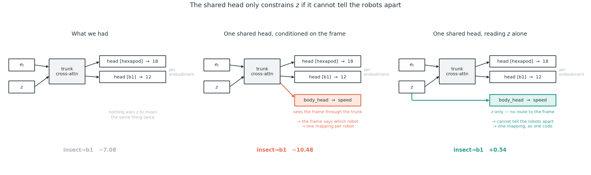
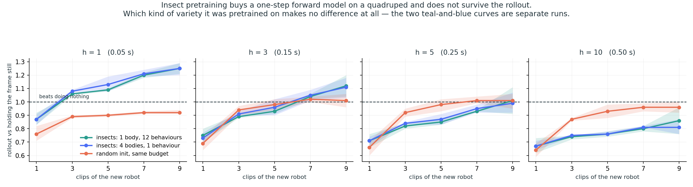

# Progress Update — Stage 1: Cross-Morphology Latent Action Model

Stick insect (*Medauroidea extradentata*), simulated in CoppeliaSim. Stage 1: one 18-DOF
topology, several leg geometries. Stage 2 starts at slide 6: a second robot with a different
number of legs, and what it takes to make one latent mean the same thing on both.

Slides 1 to 4 are background already covered. The update starts at slide 5. **A longer version
with every diagnostic is kept in `update_slide_full.md`.**

---

## Slide 1 — Cross-morphology locomotion from a latent action model

Stage 1 progress update: what was built, what it measures, what it found.

**The problem.** A locomotion controller maps state to joint command. Change the leg lengths and
the same numerical command produces a different physical result — the robot stumbles, or stands at
a different height, or does not move. Every body needs its own commands for the same behaviour.

**The question this stage asks.** Can a model learn a latent action `z` from **video alone** — no
morphology label, no kinematics supplied — that separates *what movement is happening* from *which
body is doing it*, and then turn that latent into the correct body-specific joint command?

**The scope, stated precisely.** Stage 1 is cross-**morphology**, not cross-embodiment. All Stage
1 bodies share one 18-D joint space, six legs times three joints; only the geometry differs.
Stage 2 extends the same question to cross-embodiment with a quadruped, and tests a held-out
4-leg action space.

**Why it matters for what comes after.** If the latent really separates behaviour from body, the
same latent should drive a robot with a different number of legs. A camera gives that for free:
`256x256x3` is the same input space whatever the body, so one encoder serves both robots without
being told anything about either. Joint space has no such property — 18 numbers and 12 numbers with
no correspondence between them — so a proprioceptive method has to be **handed the kinematic
structure** before it can compare the two. Stage 1 is the test of whether the separation happens at
all, in the easy case where the joint spaces do match.

**What this update covers.**

| | |
|---|---|
| Slides 2-4 | what was built, the data, and a check that the commands actually walk |
| Slide 5 | the central result: the geometry is readable and the model ignores it |
| Slides 6-8 | a second robot, the term that makes one latent mean the same thing on both, and what we contribute |
| Slide 9 | adapting to a genuinely different robot: zero-shot fails, a few clips buy one step |
| Slides 10-11 | pretraining to a controller, and where the candidate actions come from |
| Slide 12 | the loop closed, in physics, on two robots it was not trained on |
| Slide 13 | crossing to a quadruped: what blocked it, and what unblocked it |
| Slide 14 | what actually made things work, and what did not |
| Slide 15 | conclusion: what was asked, what the measurements say, and the scope |
| Slide 16 | where this goes next |

---

## Slide 2 — The pipeline and its three trained modules

```
frame_t  --[frozen V-JEPA2]-->  e_t  --+--[ITM]--> z --[FTM]--> ê_{t+1}
                                       |
                                       +--[Motion Decoder]--> â
```

- **Encoder**: V-JEPA2 ViT-g/16, 1B parameters, **frozen throughout**, never trained on robots.
- **Trained**: three modules on top, about 5M parameters each.
- **Data**: CoppeliaSim, 20 Hz, fixed 256x256 side camera, joint targets in radians.

| Module | Input | Output | Why it exists |
|---|---|---|---|
| **ITM** inverse transition | `e_t`, `e_{t+1}` | `z ∈ ℝ^64` | Given a transition, what action produced it? |
| **FTM** forward transition | `e_t`, `z` | `ê_{t+1}` | Does `z` let you predict the next frame? |
| **Motion Decoder** | `e_t`, `z` | `â ∈ ℝ^18` | Can `z` be turned back into an executable joint command? |

**The objective, as inherited from LAC-WM.** Two terms:

```
z      = ITM(e_t, e_{t+1})
L_recon  = || FTM(e_t, z) - e_{t+1} ||^2          predict the next frame
L_motion = || MD(e_t, z)  - a      ||^2          recover the real joint command
L        = 1.0 * L_recon  +  1.0 * L_motion
```

**Two structural facts to hold on to.**

The Motion Decoder receives `e_t` but **never `e_{t+1}`**. Anything the second frame contributes
has to travel through the 64-number latent. That bottleneck is the whole design, and two of the
limits below turn out to hinge on it.

The two terms sit on very different scales — reconstruction around 1.5, motion around 0.01 in
standardised units — so weighting them equally at 1.0 does **not** give them equal influence.
**Reconstruction takes roughly 99 percent of the gradient in practice**, which means the term
meant to ground the latent in real commands is running on the remaining one percent.

---

## Slide 3 — The data, and how everything below is measured

Every run below draws from one of three directories, each built by linking only the clips where
the body actually walked — signed forward travel ≥ 0.30 m and lateral drift < 0.20 m. Bodies that
collapse or veer are excluded by name, not by hope.

| Dataset | Bodies | Size | Used by |
|---|---|---|---|
| `ik_walk_m3d_clean` | 4 training, all femur = tibia | 140 clips | `m3d_cross`, `m3d_bracketed` |

The one exception is flagged where it occurs: the Stage 2 transfer slides compare **R²**, where
higher is better, so that ratio runs the other way.

**"Control" throughout means the matched run**: identical data, identical split, identical
architecture, identical seed, with **one flag changed** — the cross-body loss turned off. Which
run that is depends on which split is being discussed, so it is named each time:

| Split | With the cross-body loss | Its control |
|---|---|---|
| 4 training bodies, held out `c08f09t09` (inside the range) | `m3d_cross` | `m3d_bracketed` |
| 4 training bodies tied at femur/tibia 0.83, held out `c10f10t08` (outside it) | `tib_cross` | `tib_ctrl` |

---

## Slide 4 — The commands actually walk

Predicted commands driven open-loop through the same physics used to collect the data, on a body
never trained on. `m3d_cross` against its control `m3d_bracketed`, three clips. Cells are the mean
with the range in brackets; the last column counts clips where the cross-body run wins — same
episodes, same physics, so the comparison is paired.

| | IK | Control | With cross-body loss | cross wins |
|---|---|---|---|---|
| Forward distance, share of IK | 100% | 85% [74–91] | **90%** [89–91] | 1 / 3 |
| Heading deviation from IK | 0 deg | 11.8 [6.1–17.0] | **5.5** [0.6–12.3] | **3 / 3** |
| Commands outside the body's joint range | 0% | **6.1%** [5.8–6.2] | 6.4% [6.3–6.6] | 0 / 3 |
| Worst such excursion | 0 deg | 8.2 [4.0–**16.6**] | **3.9** [3.7–4.1] | 2 / 3 |

**Both walk, and on averages they are close. Read the ranges and the win column instead.**

**Heading is the only measure won outright** — closer to IK on every clip.

**The others say the cross-body run is steadier, not better.** It stays in a narrow band everywhere
(89–91% of the distance, worst excursion 3.7–4.1 deg) while the control matches it on two clips
then fails badly on the third — 74% of the distance, a 16.6 deg excursion. Both step outside the
joint range on ~6% of commands, so the *frequency* is a property of the task; what differs is the
worst case, and that decides whether a gait degrades gracefully or collapses.

> **Stated plainly:** on one clip IK walks almost straight (−0.8 deg) and both models veer, to
> +11.5 and +15.0. Neither reproduces a straight walk on demand.


Black is stance, white swing, 65 steps. Top block is the predicted commands, bottom the IK ground
truth; tripod alternation and stance durations line up, mean feet on the ground 3.02 of six against
the reference's 3.08. Video:
`results/wm/stage1_correct/gait/replay_stage1_m3d_cross_clip0.mp4`


**Per joint** — black is ground truth, red the model, three clips end to end. The mean **R² 0.81**
averages three very different groups:

| joint | R² | RMSE |
|---|---|---|
| **TC**, fore-aft swing | **1.00 on all six legs** | 0.4–1.0 deg |
| **FT**, the knee | 0.81–0.91 | 4.0–4.5 deg |
| **CF**, the leg lift | **0.49–0.80** | 3.7–4.1 deg |

**CF is where it struggles, and in a specific way.** The red trace follows the *shape* of every
cycle and sits at the wrong *height* — it knows what the leg is doing and misplaces how high it
holds it. That is the same failure as slide 5's geometry read, where the decoder puts the coxa at
0.622 against a true 0.80: **the coxa sets leg height.** Two unrelated measurements land on the
same joint.

---

## Slide 5 — The geometry is in the frame, and the model does not use it

**The information is there.** A ridge probe from the **frozen** encoder to the three segment
scales, fitted on the four training bodies and applied to one it has never seen.

| Body | | coxa pred / true | femur | tibia |
|---|---|---|---|---|
| c10f10t10 | train | 0.978 / 1.00 | 0.999 / 1.00 | 0.999 / 1.00 |
| c06f10t10 | train | 0.623 / 0.60 | 0.998 / 1.00 | 0.998 / 1.00 |
| c10f06t06 | train | 0.997 / 1.00 | 0.602 / 0.60 | 0.602 / 0.60 |
| c06f06t06 | train | 0.602 / 0.60 | 0.600 / 0.60 | 0.600 / 0.60 |
| **c08f09t09** | **held out** | **0.836 / 0.80** | **0.914 / 0.90** | **0.914 / 0.90** |

Training rows are in-sample and near-exact, which is what makes the last row readable. Held-out
errors are **0.036, 0.014, 0.014** on a 0–1 scale, from **4,227 parameters** on a 1B-parameter
encoder that has never seen a robot, with nothing supervising it. **This is the premise the project
rests on.**

**The model trained on top does not use it.**

**Swap test** — give the decoder body A's frame with body B's latent, where the two bodies'
commands differ by 21.1 deg. It answers with **body B's** command to within 6.0 deg: it followed
the latent and ignored the frame.

**What geometry does each estimator think the held-out body has?** The probe reads it off the
encoder. The decoder is asked indirectly — fit its output as a mixture of the training bodies'
commands and read off the scales that mixture implies.

| Held-out `c08f09t09` | coxa | femur | tibia |
|---|---|---|---|
| **The truth** | **0.80** | **0.90** | **0.90** |
| Probe on the frozen encoder, 4,227 params | **0.836** | 0.914 | 0.914 |
| The trained decoder, 5.2M params | **0.622** | 0.962 | 0.962 |

Different estimators reading the same frame. The probe lands within 0.04 everywhere; the decoder
implies a **coxa 22% shorter than the body has**. The larger model is the one that misreads it.

> **What this table cannot test.** All four training bodies and the held-out one have femur equal
> to tibia, so neither estimator can produce two different numbers for them. 0.914 / 0.914 is
> interpolation along an axis the data spans. **They come apart once the data stops spanning the
> axis**, which is where both estimators fail together — measured a few slides on.


**From the earlier three-body dataset** — an axis only draws cleanly with two training bodies — so
it shows on three bodies what the table above measures on four.

**Left**: everything placed on one line in joint-command space, 0 = long training body, 1 = short.

| | position |
|---|---|
| the held-out body's true commands | **0.30–0.36** |
| the 29k-parameter probe on the frozen encoder | **0.34** |
| the 5.2M-parameter trained decoder | **0.18–0.19** |

It is not at 0.5 because leg length and joint angle are not linearly related. The probe lands
inside the correct band; the decoder falls short, **pulled toward the training body it is nearest**.

**Right**: more trained capacity buys lower error on bodies it saw and higher error on the one it
did not. The 29k probe is the only predictor below the no-learning baseline on both.

**Reading**: the decoder learned to recognise which of the four training bodies it is looking at
and recall that body's commands. There is no entry for a body it has not seen.

---

## Slide 6 — Stage 2: it transfers, but not by sharing a latent

> **Two datasets, and no number crosses between them.**
>
> | | **A — speed only** | **B — matched behaviour** |
> |---|---|---|
> | behaviours | forward walking only | speed, turning, sideways |
> | balance | 91 insect clips vs 14 B1 | **48 vs 48**, 12 conditions each |
> | B1 frame rate | 20 ms against the insect's 50 ms — **wrong** | fixed |
> | held out by | clip | **behaviour** |
>
> Composition, dynamic range, clip count, frame rate and split protocol all differ, and three
> attempts to control for that each found a different confound (F84). **Where both exist, B is
> current.** Every table says which it is on.

**This slide is dataset A.** One ITM, forward model and decoder trunk shared across an **18-DOF
hexapod and a 12-DOF quadruped**; only the output head is per-embodiment, because 18 and 12 cannot
share one projection. **No cross-embodiment loss** — the shared latent was expected to emerge from
weight sharing alone, and that is what this slide tests.

| module | takes | returns |
|---|---|---|
| **V-JEPA2** | the image | `e_t` — frozen, never trained |
| **ITM** | `e_t, e_t+1` | **`z`** — the latent under test |
| **FTM** | `e_t, z` | `ê_t+1` — what a planner rolls |
| **trunk** | `e_t, z` | shared features, `z` queries the image |
| `head[hexapod]` / `head[b1]` | those features | 18 / 12 joints |

### The decoder transfers

**R² +0.87 and +0.90 on a held-out body**, where every Stage 1 held-out body scored negative (−0.42
to −3.16). Driven through physics it walks **63% as far as the IK reference** — reconstruction
accuracy and locomotion are not the same claim.

### The latent does not

Both robots walk at the same Froude speed — 0.155 and 0.159, at hip heights of 0.13 m and 0.56 m —
so a body-speed readout fitted on one **should** work on the other. A bad score is the
representation's fault, not the question's.

| R², 0 = no better than guessing the average | insect→b1 | b1→insect |
|---|---|---|
| frozen V-JEPA2 `e_t` | +0.01 | +0.08 |
| **`z`, our Stage 2** | **−4.60** | **−24.36** |

**Faint in the encoder, and training destroys it.** Negative means a readout fitted on one robot is
systematically *wrong* on the other. **Weight sharing bought a sharper per-robot code and a poorer
shared one.**

### So

**The trunk produces a latent *less* transferable than the frozen encoder it started from, and the
body code is not why.** Transfer still happens, so whatever carries it is not a shared latent in the
sense the paper claims. **What is responsible, and what fixes it, is where this update goes next.**

## Slide 7 — We decode joint angles. LAC-WM does not, and that is the whole problem



**LAC-WM has no joint-angle head anywhere.** One decoder, one MLP, one target — and that target is a
**position in a physical space both embodiments share**. It cannot be satisfied without a
representation both robots share, so alignment is not a term they add; it is the shape of the
problem they chose.

**We chose joint angles.** They are what you can send to a robot whose kinematics you do not have —
no IK, no URDF, no calibration. But 18-D and 12-D joint commands have **no correspondence**, so each
robot needs its own head, and nothing in `L_motion` requires one `z` to mean the same thing twice.

> **If the action space is already shared, the hard part has been assumed away.** Position targets
> need the robot's kinematics; joint targets need nothing. The full argument comes later.

> **So predict foot positions instead?** No, and two objections agree. *Measured:* foot motion is
> body speed rewritten plus the gait, and the gait transfers at **0.373, below chance**.
> *Structural:* a Cartesian target needs a kinematic model and IK per robot — which breaks on odd
> morphologies and weakens this project's own claim.

### Can a joint-space target cross robots at all?

A speed readout fitted on one robot and applied to the other. **R², where 0 is no better than
guessing that robot's average and negative is systematically wrong.**

| | insect→insect | b1→b1 | **insect→b1** | **b1→insect** |
|---|---:|---:|---:|---:|
| frozen V-JEPA2 encoder | 0.676 | 0.753 | **−0.046** | +0.131 |
| control, no term | 0.664 | 0.167 | **−7.083** | −2.357 |
| **+ shared body term, λ=0.5** | **0.798** | **0.879** | **+0.544** | **+0.435** |
| + shared body term, λ=0.1 | 0.809 | 0.868 | **+0.675** | +0.624 |

**Both robots walk at matched Froude speed.** A readout fitted on one *should* work on the other,
so a bad score is the representation's fault and not the question's.

**Read the control row, not the encoder row.** The encoder is scored on one frame while `z` is
built from two, so that comparison is loaded in our favour. The control has identical two-frame
access, identical data, and differs in this one term.

**Three things the two right-hand columns say.** Without the term, cross-robot readout is not weak
but *systematically wrong* — **−7.083**, while both robots perform matched behaviours. With it,
both directions go positive. And the frozen encoder is **negative** in `insect→b1`, so the model is
not preserving structure V-JEPA2 supplied: **it is creating structure the encoder did not have.**

Within one robot the same term cuts joint error **0.3517 → 0.2183**.

### And the term pays for itself inside one robot

**A 38% cut in per-robot joint error**, at no cost to reconstruction — and the `insect→insect` and
`b1→b1` columns above move the same way, 0.664 → 0.798 and 0.167 → 0.879. One shared scalar makes
each robot's *own* 18-D and 12-D decoding substantially better. **The alignment term is not a tax
paid for transfer** — it is LAC-WM's stated *"mitigates shortcuts"* mechanism, measured rather than
asserted.

### So

**Joint-space targets are the right action space for robots we know nothing about, and they do not
align themselves.** One shared scalar, decoded blind, is what makes them cross. **What that did to
the latent is next.**

## Slide 8 — What we contribute: a joint-space action target where no shared space exists

### The setting is a robot we know nothing about

No kinematic tree, no URDF, no action labels. **Video of it moving, and nothing else.**

Morphology-agnostic *proprioceptive* control exists — joints as a token set over the kinematic
graph — so "proprioception cannot do this" is not defensible and we do not claim it. **Those
methods must be handed the kinematic graph. A camera has to be handed nothing.**

What the world model supplies is knowledge of **how to drive joints so the result is locomotion** —
the expensive part of bringing up a new robot, and the part that otherwise costs a training run per
body.

### Where we differ from LAC-WM: the coordinate, not the architecture

| | LAC-WM | ours |
|---|---|---|
| what the head decodes into | wrist pose, fingertip position, camera pose | **joint angles** |
| do the embodiments share that space? | **yes** — a fingertip at (x,y,z) means the same for a human hand and a gripper | **no** — no dimension of an 18-DOF hexapod corresponds to any dimension of a 12-DOF quadruped |
| is the commanded quantity the shared one? | **nearly** — a manipulator is commanded in end-effector pose | **no** — you command joints; body motion *emerges* through contact |

**Decoding the shared space would hand us the correspondence instead of making the model learn it.**
Body velocity *is* shared and *is* commandable — the B1's policy takes m/s directly — and that is
precisely why it is not our action space. Using it would dissolve the problem.

> Careful: 0.3 m/s is not the same behaviour on a 0.176 m insect and a 0.561 m quadruped — one is
> near its limit, the other strolling. Commensurable is not equivalent, which is why every match in
> this dataset is on **Froude** and **ŵ**, never on m/s and rad/s.

### The research question, and the answer

*Can a joint-space action target work at all when no shared action space exists?*

| | within-robot joint error | cross-robot transfer |
|---|---|---|
| joint target, no body term | 0.3517 | **−28.9 / −43.1** |
| joint target + shared body term | **0.2183** | **+0.610 / +0.573** |

**A joint-space target works within a robot on its own. It crosses robots only when a shared
body-motion term is present** — and that term also improves the within-robot decoding by **38%**.

That is a conditional result, not a caveat: we can say what works *and* the condition under which
it works, which is stronger than either alone.

---

## Slide 9 — Adapting to a genuinely different robot

**This is the deployment case the project is for**: a robot we know nothing about — no kinematics,
no URDF, no calibration — and a world model that is supposed to make it cheaper to model than
starting from nothing. The B1 is genuinely different: 12 joints against 18, a trot against a wave.

> **Read this slide for one comparison and nothing else.** It asks whether *pretraining on insects
> is worth anything to a quadruped*, and it answers that by putting two identical models side by
> side. **What it does not measure is whether the planner picks the right action** — that is a
> different capability, it is what actually decides this project, and it is slides 12-13.

Adapt the forward model on N clips of the B1; compare against the identical architecture from
random weights, same clips, same budget. Scored against **predicting that the frame does not
change**, so 1.0x is the break-even line.



| clips | pretrained on insects | from scratch |
|---|---:|---:|
| 1 | 0.87x | 0.76x |
| 3 | **1.06x** | 0.89x |
| 9 | **1.25x** | 0.92x |

**Three clips of the new robot are enough — if the model watched insects first.** Starting cold
never clears break-even at any budget we ran, and is flat from three clips onwards.

**Which kind of variety it saw makes no difference.** One insect performing twelve behaviours and
four insects walking forward give curves that lie on top of each other.

**The advantage is short-horizon.** At half a second neither model beats predicting no motion at
all. *That is a limit on prediction; slide 13 shows it is not the limit on planning.*

### So

**Watching stick insects is worth something to a quadruped the model has never seen** — enough that
starting cold never catches up. **That is the whole claim on this slide.** Whether the same model
can then *choose* what the robot should do is a separate question with a separate answer.

## Slide 10 — From pretraining to a controller: what exists and what does not

### The pipeline, and the one structural constraint in it

```
PRETRAIN   video ──► V-JEPA2 (frozen) ──► e_t
                                          ├── ITM (e_t, e_t+1) ──► z      done
                                          ├── FTM (e_t, z) ──► ê_t+1      done
                                          └── MotionDecoder ──► joints    done
                                              + shared body head

ADAPT      1  fine-tune ITM and FDM on the new robot                       done
           2  freeze the FDM, fit the action projector                      done
           3  fine-tune projector and FDM together                          done

CONTROL    behaviours ──► project ──► roll FTM ──► score ──► execute
           └── scored on recorded frames        90% right behaviour   done
           └── closed loop, trained body        78% speed, 100% up    done
           └── closed loop, unseen body        15/15 behaviour, 15/15 up  done
           └── closed loop, quadruped from an INSECT goal   67% forward   done
           └── closed loop, quadruped           1 of 3 demonstrations  partial

DEPLOY     distil to a proprioception-only student                          NOT BUILT
```

### One control step, in order

```
1  photograph the robot ──► encoder ──► e_t          "this is now"

2  try all twelve candidates, in imagination
   ┌────────────────────────────────────────────┐
   │  e_t + candidate A's action ──► FTM ──► ê  │
   │  e_t + candidate B's action ──► FTM ──► ê  │   nothing moves;
   │  ...                                       │   the robot has not acted
   │  e_t + candidate L's action ──► FTM ──► ê  │
   └────────────────────────────────────────────┘

3  score each ê against the goal image ──► take the closest

4  send the winner's command to the robot       ← the only real motion

5  photograph again, go to 1
```

**`ê` is not a picture.** The forward model predicts the *embedding* of the next frame, and the
comparison happens there — we never render an imagined future, because ranking only needs to know
which candidate lands closer.

**No future frame appears anywhere above.** `e_t` was photographed and `z` comes from an action we
chose to try, so both exist before the robot moves.

**`z_t = ITM(e_t, e_{t+1})` needs the next frame — which at control time is the thing being
decided. The inverse model can never run in the loop.** Most numbers in this deck read `z` off two
ground-truth frames, which is reconstruction rather than control. **Everything from here on does
not**: the CONTROL and ADAPT rows, and slides 11-13, use the action projector and the forward model
only.

**Adapting to a new robot is three stages, not one.** A projector fitted against a frozen forward
model is only the middle one:

| | what it does | why it is needed |
|---|---|---|
| **1** | fine-tune the ITM and forward model on the new robot | the frozen model is worse than assuming the frame does not move |
| **2** | freeze the forward model, fit the action projector | the inverse model cannot run in the loop, so something must turn an action into `z` |
| **3** | fine-tune projector and forward model **together** | freezing the forward model and making the projector chase `z` exactly is not enough — **the forward model has to move to meet it** |

The source paper spends **35k of its 60k adaptation iterations on stage 3** — more than the other
two together. All three are now built. **Ours are full fine-tunes**; the paper uses LoRA adapters,
an efficiency choice rather than a difference in what is adapted. **Slide 13 is what happened when
we ran stage 3, and the answer was not the one we expected.**

---

## Slide 11 — Where the candidate actions come from

**We hand the planner the answer and ask whether it can find it.** Twelve recorded behaviours of
the new robot, one of which is the one the demonstration performs. **This is cheating, and it is
deliberate** — the planner is not searching for an action, it is choosing from ground truth we
supplied.

**It is the weakest test that can still fail, and it does fail**: on the quadruped the loop clears
chance on two demonstrations of three, and the robot falls on the other two.

**And it contradicts our own premise.** Slide 9 opens with *"a robot we know nothing about — no
kinematics, no URDF, no calibration"*. **Recording twelve walking, turning and strafing clips means
something already knew how to make that robot walk.** **Random motor babbling would close the gap** —
flail the joints, record, let the planner find which fragments go where, with nothing having to know
what *forward* means. Untested, and it is the experiment that would make the premise true.

### Is the world model doing anything, or just pattern-matching?

Sixty forward-model calls per control step is the planner's whole cost. Three scoring rules, same
candidates, same clips — **`blind` never looks at the goal, so it is the rate available without
planning at all**:

| horizon | roll the model | **no model** — match `proj(a)` to `ITM(now, goal)` | **blind** |
|---|---:|---:|---:|
| 1 | **62%** | 38% | 33% |
| 5 | **65%** | 38% | 32% |
| 10 | **67%** | 37% | 34% |

*chance 28%*

**Deleting the forward model costs 24 points** and lands within five of not using the goal at all.
**The world model is predicting, not matching.**

**And one step is nearly all of it** — one to ten adds five points, none to one adds
twenty-four. The planner can run at **twelve calls per step instead of sixty**.

### Why not sample actions instead

| | |
|---|---|
| **no cheap validity test** | a random 18-D posture is usually a robot on its side, and the only way to find out is to simulate it — **the thing planning exists to avoid** |
| **walking is a sequence, not a point** | joint targets sampled per frame ignore gait phase and cannot walk at any value. The real search space is whole trajectories |
| **out of distribution** | the forward model has only seen `z` from real walking. A sampled action projects outside that, so its score is extrapolation, not a ranking |

A sampled *end-effector trajectory* has none of these problems, which is why the source paper can
sample and we cannot.

### The source paper needs a prior too

> *"we assume access to one demonstration trajectory for sampling a subgoal image every p
> timesteps"* — their goal comes from a demonstration, like ours. And *"random action sequence
> sampling... is inefficient... especially for a difficult dexterous manipulation task"*, so they
> draw **500 candidates from a pretrained VLA**.

**Their prior is a policy; ours is twelve clips.** Both answer the same question — what does a
plausible action look like — and **both have to come from somewhere.**

**And a list of twelve is not a distribution.** We can choose a behaviour; we cannot compose a new
one.

## Slide 12 — The loop, closed, on two robots it was not trained on

> **How these are scored.** `speed` — achieved against commanded Froude, within 15%. `behaviour` —
> right class by dominant channel: forward, turn, sideways. `survival` — body height held, did not
> fall. Survival is not optional for locomotion: a manipulator that fails a grasp is still standing.

### A hexapod of the training family, never seen

`c08f09t09` — shorter coxa, femur and tibia. Full physics in CoppeliaSim.

| | the body it trained on | **unseen body**, old projector reused | **unseen body**, projector refitted on its own clips |
|---|---|---|---|
| survival | 100% | **100%** | **15 / 15** |
| behaviour class | 100% | 83% | **15 / 15** |
| rate within 15% | 78% | 17% | **13%** |
| median error | 7.0% | 37.1% | 36.2% |

> **The last column is fifteen runs and the rate column was rescored.** `S.R. speed` used to grade
> each run on whichever channel was largest in the demonstration -- and forward speed exceeds yaw in
> **every** turn condition here, so turning was graded on forward speed and its **yaw error was
> never measured**. Graded on the channel each behaviour is named for, the rate falls from 47% to
> 13%. **Survival and behaviour class do not depend on that choice and are unchanged.**


**Nothing in the world model moved in any column** — encoder, inverse model and forward model are
the same weights throughout. The only difference between the last two columns is the **action
projector**, the network that turns a joint command into a latent: a two-layer MLP, minutes of
fitting on the new body's own clips.

**Why it has to be refitted at all.** The same 30° at a joint moves a short leg less far than a
long one, so the old projector tells the forward model the wrong thing about what a command will
do. **The expensive part — fifty epochs of world model — is reused untouched; the cheap part is
replaced.**

### A quadruped, a different family

MuJoCo carries the weight; CoppeliaSim poses the body from MuJoCo's state and returns the camera
image, so both robots are still rendered by the same renderer. Slide 13 is how this became possible.

| | survival | behaviour class | speed within 15% |
|---|---:|---:|---:|
| **B1, physics** | **3 / 3** | 2 / 3 | 1 / 3 |

Errors on each behaviour's own channel: **6.4%** forward, 20.3% turn rate, 85.5% lateral. On the
turning demonstration the planner picks the exact condition, not merely the family, on **52 of 55**
steps -- it identifies the behaviour and misses the rate.

> **One free parameter was doing this.** `--commit`, how many steps a chosen behaviour is held
> before deciding again, defaulted to 1 -- re-decide every step -- and nothing had ever justified
> it. **Holding for three steps takes speed from 0/3 to 2/3** on this robot, because every switch
> interrupts the stride and switching was measured to cost half the turning and four fifths of the
> lateral travel. On the hexapod, whose commands replay exactly, the same change is neutral.

**It holds itself up for a full episode and goes at a speed nobody asked for.**


> *Both run the full 65 steps without falling. The first is asked to walk forward and does, within
> **6.4%**. **The second is asked to strafe right and walks forward instead** — upright the whole
> way, 85.5% off in the channel that was commanded. The pair is the result and the limit in one
> place.*

> **We had called this impossible**, from a replay test where B1 actions fall — 0 of 8. That was
> **six seconds**; this loop is three. **And our first version of it was wrong**: it started the
> robot standing while the clips begin mid-stride, so the first command asked a leg to finish a
> swing it never started and the body leapt a third above its own stance height. Seeding the
> simulator from the demonstration's first frame took survival from **1/3 to 3/3**. *Found by
> watching the video, not by reading the numbers.*

### What this buys, and what it does not

**Same family: no world-model retraining.** Different family: the world model has to be adapted
too, on a few dozen clips. **Neither controls speed** — the loop picks the behaviour and runs it at
the wrong rate, which for a locomotion controller is a real gap and not a rounding error.

---

## Slide 13 — Crossing to a quadruped: what blocked it, and what unblocked it

The same world model, pointed at a Unitree B1. **It answers with the same candidate no matter what
it is shown.**

> **What this model has seen.** Fifty epochs of hexapod video and **no quadruped at all**; then
> **9 clips of the B1** to adapt the inverse and forward models, and **24** to fit the projector
> against them. So the pretraining is cross-embodiment and the adaptation is not. Frozen, with no
> B1 clips, it rolls **worse than assuming the frame does not move** — that arm is on slide 9.

```
demo: walk forward  ──►  planner  ──►  speed_vx0.50
demo: turn          ──►  planner  ──►  speed_vx0.50
demo: strafe        ──►  planner  ──►  speed_vx0.50
```

### 1. Blame the robot's actions? Measured, and no

A classifier given **actions only** — no images — naming which of twelve behaviours is happening:

| | 1 frame | 5 frames | by family |
|---|---:|---:|---:|
| hexapod joint targets | 68% | **100%** | 100% |
| B1 policy actions | 61% | **80%** | **85%** |
| *chance* | *8%* | *8%* | *28%* |

**The behaviour is in the action.** A policy's action being a *response* does not empty it.

### 2. The forward model is throwing it away

```
feed the real action    ──►  forward model predicts  X
feed the average action ──►  forward model predicts  X      ← identical, 3 decimals
```

15k adaptation steps: training loss falls **6×**, held-out prediction improves, and that line never
changes. **It learned what a quadruped looks like and never learned to read the command.**

### 3. The objective allowed the shortcut

**MSE — one action in, is the prediction close?**

```
  e_t ─────────────────────┐
                           ├──► FTM ──► ê ──► distance to the real e_t+1
  a ──► projector ──► z ───┘
```

*The next frame looks like this one, so copying `e_t` already scores well.* **Nothing penalises
ignoring `z`.**

**Contrastive — four actions in, which one was real?**

```
  the real action ──► z₀ ──► FTM(e_t, z₀) ──► ê₀ ──► d₀
  a wrong action  ──► z₁ ──► FTM(e_t, z₁) ──► ê₁ ──► d₁      loss: d₀ must be
  a wrong action  ──► z₂ ──► FTM(e_t, z₂) ──► ê₂ ──► d₂      the smallest
  a wrong action  ──► z₃ ──► FTM(e_t, z₃) ──► ê₃ ──► d₃
```

*Ignore `z` and all four predictions are identical, all four distances are equal, and the answer is
never findable.* **The shortcut stops paying.**

> Wrong actions are taken from **other behaviours at the same time index** — same point in the gait,
> so the model cannot separate them by stride phase instead of by behaviour.

**The point is the shape of the task, not the loss formula.** MSE trains on **one** action, the one
that happened; the planner's job is to choose among **twelve**. Contrastive makes training look like
the job — four options, one right answer — and four is enough, because ignoring `z` caps you at 25%
whatever the pool size.

| behaviour selection | chance 28% |
|---|---|
| hexapod, a body never seen | **60%** |
| B1, before | 30% |
| B1, after the contrastive term | **57%** |

**Same data, same robot, same architecture, same budget — only the loss changed.** LAC-WM's three
adaptation stages are MSE throughout; this term is ours.

---

## Slide 14 — What actually made things work, and what did not

Last update we said **the blocker is the data**: both robots only ever walked forwards, so five of
six body channels were constants. So we built the data — twelve matched behaviours per robot,
forward matched to 4% and yaw to 2%. **It did not work, and three interventions since have sorted
themselves into a pattern.**

### More variety: necessary, not sufficient

| yaw, held out by behaviour | score |
|---|---:|
| collected the behaviour, **did not supervise it** | **−5.2** |
| collected it **and supervised it** | **+0.37** |

Same data, same architecture, one loss term different — **no overlap between the two arms across
five splits.** On the frozen encoder, before any training, the new channels still sat at zero.
**Collecting the behaviour bought the possibility; the loss term realised it.**

### A different kind of variety: no difference at all

One insect performing twelve behaviours, against four insects walking forward — adapting to the
quadruped, the two curves lie **on top of each other at every clip count and every horizon**
(slide 9). More kinds of variety is not the lever.

### Making prediction harder: fixes one thing, breaks two

| training pair | forward model's use of `z` | joint decoder | transfer |
|---|---:|---:|---:|
| adjacent frames | 4.257 | **0.218** | **+0.83** |
| 5 apart | 7.662 | 0.906 | −0.10 |
| 10 apart | **12.279** | 0.879 | −0.45 |

The forward model reads the latent **three times** as much — and `z` becomes a *clip identifier*
rather than a movement code, so the decoder memorises and transfer dies. **Nothing in this deck
uses a widened pair.**

### What worked, twice, for the same reason

| | what it added | result |
|---|---|---|
| **shared body term** | one number both robots share, decoded blind | cross-robot readout **−28.9 → +0.61** |
| **contrastive term** | the true action must beat actions from other behaviours | quadruped selection **30% → 57%** |

**Neither added data and neither made prediction harder. Both added something the latent has to
tell apart** — and that is the only intervention in this project that has moved a number twice.

---

## Slide 15 — Conclusion: what was asked, and what the measurements say

**The question.** Can a latent action learned from video alone — no morphology label, no kinematics
given — separate *what movement is happening* from *which body is doing it*, well enough to drive a
body the model has never seen?

### Answered, at three scopes

| | result |
|---|---|
| **within one robot family, no retraining** | held-out hexapod at **3.44 deg per joint, R² +0.81** against a command spread of 11.7; the commands walk through physics |
| **a body of that family it has never seen, closed loop, physics** | **survival 15/15, behaviour 15/15** — world model frozen, only a two-layer projector refitted. **Rate within 15% on 13%** of runs |
| **a quadruped, closed loop, physics** | **stands through every episode, 3/3**; behaviour family 38-58% against 28% chance; **speed 0/3** |

**Across incomparable robots the blocker was the objective, not the robot.** Adapting the forward
model with MSE improves its predictions while it **discards the action channel entirely**. A
contrastive term — asking for the ranking a planner performs — lifts quadruped selection from 30%
to 57%, and that is what the physics loop above runs on. **The quadruped now walks under the world
model's control for a full episode without falling** — and at a speed nobody asked for.

### The contribution, in one line

**A joint-space action target crosses incomparable embodiments only when a shared body-motion term
is present.**

| | within-robot joint error | cross-robot transfer |
|---|---|---|
| joint target alone | 0.3517 | **−28.9** |
| joint target + shared body term | **0.2183** | **+0.61** |

Both robots perform twelve matched behaviours at matched speeds. **One loss term separates a
readout dozens of times worse than a constant from one that works in both directions.**

### What is not done, stated plainly

| | |
|---|---|
| **rate, on both robots** | the loop picks the right behaviour and runs it at the wrong rate — within 15% on **13%** of hexapod runs and **1 of 3** on the quadruped. Turn rate is the worst: 130% error at the gentlest turn, 79% at the strongest, and only the middle rate tracked |
| **the candidate library** | it holds recorded forward, turning and sideways clips, so something already made the robot do those. **"No kinematics needed" is not yet earned** — random motor babbling is the untested fix |
| **yaw** | it stops being harmful, it does not start working; four explanations tested and rejected |
| **the scaling claim** | needs a third embodiment. **We have two** |

### What the planner result is, and is not

**It is a viability result, at two different costs.** Selecting actions by rolling a world model —
the source paper's approach in its action-space form — **controls a hexapod it has never seen with
the world model completely frozen**, and **keeps a quadruped walking after adapting that world model
on 24 of its clips.** The world model earns its place either way: deleting the rollout costs **24
points** of selection accuracy.

**It is not an optimality result.** Every choice is made with the right answer already in the
candidate list, the list has to be recorded by something that could already make the robot walk,
speed is not controlled, and a control step costs **twelve forward-model rolls** where a policy
costs one. **Those are not separate bugs** — a planner searching a small recorded library at run
time is doing the hardest version of the job.

---

## Slide 16 — Where this goes next: vision at learning time, not at run time

**Vision is the medium that lets one model span incomparable bodies *during learning*. Nothing
requires it to be the sensor at run time.** Our fixed side camera is a **research instrument** — it
exists so two robots render comparably — and should not be read as the intended deployment.

**So: use the world model as a teacher and distil a policy** — the student reads proprioception
only, which is standard in legged locomotion. Its reward is *reach this latent*, so it needs no
kinematics and no behaviour library.

| what is wrong now | what distillation does to it |
|---|---|
| the candidate library must be recorded by something that can already walk | gone — the policy outputs continuous joint targets |
| twelve forward-model rolls per control step | gone — one forward pass |
| the planner meets states it drove itself into, having only been scored on recorded ones | the student is trained **on the states it reaches** |
| a camera is needed at run time | gone — vision was only ever needed to learn |

**None of this is built.** It is the direction tonight's measurements point at, not a result.

**The immediate milestone**: drive the B1 from a *hexapod* goal image — the demonstration that makes
cross-embodiment a control result rather than a measurement, and the same test whether a planner or
a distilled policy is driving.

---
