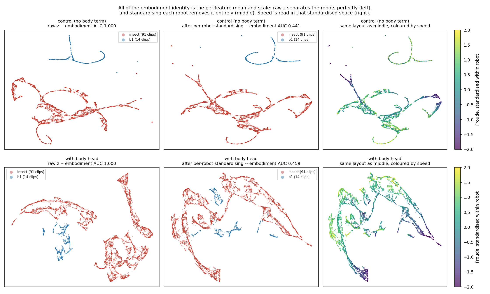

# Progress Update — Stage 1: Cross-Morphology Latent Action Model

Stick insect (*Medauroidea extradentata*), simulated in CoppeliaSim. Stage 1: one 18-DOF
topology, several leg geometries. Stage 2 starts at slide 14: the clean hexapod+B1 run,
transfer to a genuinely different robot, and what it takes to make one latent mean the same
thing on both.

Slides 1 to 3 are background already covered previously. The update starts at slide 4.

---

## Slide 1 — Cross-morphology locomotion from a latent action model

Stage 1 progress update: what was built, what it measures, what it found.

**The problem.** A locomotion controller maps state to joint command. Change the leg lengths and
the same numerical command produces a different physical result — the robot stumbles, or stands at
a different height, or does not move. Every body needs its own commands for the same behaviour.

**The question this stage asks.** Can a model learn a latent action `z` from **video alone** — no
morphology label, no kinematics supplied — that separates *what movement is happening* from *which
body is doing it*, and then turn that latent into the correct body-specific joint command?

**The scope, stated precisely.** Stage 1 is cross-**morphology**, not cross-embodiment. All Stage
1 bodies share one 18-D joint space, six legs times three joints; only the geometry differs.
Stage 2 extends the same question to cross-embodiment with a quadruped, and tests a held-out
4-leg action space.

**Why it matters for what comes after.** If the latent really separates behaviour from body, the
same latent should drive a robot with a different number of legs. A camera gives that for free:
`256x256x3` is the same input space whatever the body, so one encoder serves both robots without
being told anything about either. Joint space has no such property — 18 numbers and 12 numbers with
no correspondence between them — so a proprioceptive method has to be **handed the kinematic
structure** before it can compare the two. Stage 1 is the test of whether the separation happens at
all, in the easy case where the joint spaces do match.

**What this update covers.**

| | |
|---|---|
| Slides 2-3 | what was built, the data, and how every number below is measured |
| Slides 4-7 | the central result: the geometry is readable, the model ignores it, what fixed that, and what the fix did to the latent |
| Slides 8-10 | where it stops working, why, a test of that explanation, and a check that predicts it in advance |
| Slides 11-12 | two facts about the task itself that bound what the latent can be worth |
| Slides 13-15 | status, a first cross-embodiment run, and the B1: zero-shot fails, three clips buy one step |
| Slide 16 | we decode joint angles and LAC-WM does not — the divergence, and the term it forces |
| Slide 17 | what the shared axis did to the latent |
| Slide 18 | what it did not do: the forward model, and why |
| Slides 19-20 | what we contribute, and the pipeline from pretraining to a controller |
| Slide 21 | variety was necessary, supervision is what carries a channel |
| Slide 22 | the conclusion: what was asked, what the measurements say, and the scope |
| Appendix | last term's three questions, answered |

---

## Slide 2 — The pipeline and its three trained modules

```
frame_t  --[frozen V-JEPA2]-->  e_t  --+--[ITM]--> z --[FTM]--> ê_{t+1}
                                       |
                                       +--[Motion Decoder]--> â
```

- **Encoder**: V-JEPA2 ViT-g/16, 1B parameters, **frozen throughout**, never trained on robots.
- **Trained**: three modules on top, about 5M parameters each.
- **Data**: CoppeliaSim, 20 Hz, fixed 256x256 side camera, joint targets in radians.

| Module | Input | Output | Why it exists |
|---|---|---|---|
| **ITM** inverse transition | `e_t`, `e_{t+1}` | `z ∈ ℝ^64` | Given a transition, what action produced it? |
| **FTM** forward transition | `e_t`, `z` | `ê_{t+1}` | Does `z` let you predict the next frame? |
| **Motion Decoder** | `e_t`, `z` | `â ∈ ℝ^18` | Can `z` be turned back into an executable joint command? |

**The objective, as inherited from LAC-WM.** Two terms:

```
z      = ITM(e_t, e_{t+1})
L_recon  = || FTM(e_t, z) - e_{t+1} ||^2          predict the next frame
L_motion = || MD(e_t, z)  - a      ||^2          recover the real joint command
L        = 1.0 * L_recon  +  1.0 * L_motion
```

**Two structural facts to hold on to.**

The Motion Decoder receives `e_t` but **never `e_{t+1}`**. Anything the second frame contributes
has to travel through the 64-number latent. That bottleneck is the whole design, and two of the
limits below turn out to hinge on it.

The two terms sit on very different scales — reconstruction around 1.5, motion around 0.01 in
standardised units — so weighting them equally at 1.0 does **not** give them equal influence.
**Reconstruction takes roughly 99 percent of the gradient in practice**, which means the term
meant to ground the latent in real commands is running on the remaining one percent.

---

## Slide 3 — The data, and how everything below is measured

Every run below draws from one of three directories, each built by linking only the clips where
the body actually walked — signed forward travel ≥ 0.30 m and lateral drift < 0.20 m. Bodies that
collapse or veer are excluded by name, not by hope.

| Dataset | Bodies | Size | Used by |
|---|---|---|---|
| `ik_walk_m3d_clean` | 4 training, all femur = tibia | 140 clips | `m3d_cross`, `m3d_bracketed` — slides 4-8 |
| `ik_walk_cov_narrow` | 4 training, all at femur/tibia 0.83 | 96 + 20 clips | `tib_cross`, `tib_ctrl` — slide 9 |
| `ik_walk_cov_wide` | 6 training, femur/tibia decoupled | 96 + 20 clips | `bracket_cross` — slide 9 |

The two coverage directories are **volume-matched at 96 training clips**, which is what lets slide
9 attribute its result to coverage rather than to more data.

- Commands come from **IK retargeting**: one shared foot trajectory in Cartesian space, solved
  separately per body. Same intended behaviour, genuinely different joint commands. Without this
  the transfer question would not be well posed — every body would receive the same command.
- Behaviour: forward walking only, one speed. This turns out to matter, and is picked up later.
- Held-out bodies are never trained on and are used only for evaluation.

| Tool | What it does | What it tells us |
|---|---|---|
| **Linear probe** | Fit a ridge regression on training bodies, apply to a held-out body | Is the information present and readable, independent of what the trained model does with it |
| **Swap test** | Give the decoder body A's frame with body B's latent | Does the decoder take the body from the frame or from the latent |
| **Input ablation** | Zero out `z`, or zero out `e_t`, and re-measure | Which of its two inputs the decoder actually depends on |
| **Mixture fitting** | Find the best combination of training bodies' commands explaining the output | Is the model interpolating, or copying one body |
| **Physical replay** | Drive the predicted commands through the same physics | Do the commands actually walk, not just score well per joint |

All error figures below are RMSE in degrees, pooled over all 18 joints and all timesteps, on a
body never trained on. The commands' own spread is about 11.7 deg per joint, so that is the number
to read every error against.

**One rule for every `x` in this deck: `comparison error ÷ our error`. Above 1.0 the comparison is
worse; 1.0 is a tie.** Only what we compare against changes, and each table names it:

| compared against | so `1.4x` means | slides |
|---|---|---|
| **a random backbone** — same head, same clips, untrained weights | pretraining is worth 1.4x | 15, 16 |
| **holding the frame still** — predicting no change at all | the forward model beats doing nothing by 1.4x | 11, 12, 13, 16 |
| **the same model with a part deleted** | that part was worth 1.4x — read as a *cost* of removing it | 14, 19 |

The one exception is flagged where it occurs: the Stage 2 transfer slides compare **R²**, where
higher is better, so that ratio runs the other way.

**"Control" throughout means the matched run**: identical data, identical split, identical
architecture, identical seed, with **one flag changed** — the cross-body loss turned off. Which
run that is depends on which split is being discussed, so it is named each time:

| Split | With the cross-body loss | Its control |
|---|---|---|
| 4 training bodies, held out `c08f09t09` (inside the range) | `m3d_cross` | `m3d_bracketed` |
| 4 training bodies tied at femur/tibia 0.83, held out `c10f10t08` (outside it) | `tib_cross` | `tib_ctrl` |

---

## Slide 4 — The geometry is in the frame, and the model does not use it

**The information is there.** A ridge probe from the **frozen** encoder to the three segment
scales, fitted on the four training bodies and applied to one it has never seen.

| Body | | coxa pred / true | femur | tibia |
|---|---|---|---|---|
| c10f10t10 | train | 0.978 / 1.00 | 0.999 / 1.00 | 0.999 / 1.00 |
| c06f10t10 | train | 0.623 / 0.60 | 0.998 / 1.00 | 0.998 / 1.00 |
| c10f06t06 | train | 0.997 / 1.00 | 0.602 / 0.60 | 0.602 / 0.60 |
| c06f06t06 | train | 0.602 / 0.60 | 0.600 / 0.60 | 0.600 / 0.60 |
| **c08f09t09** | **held out** | **0.836 / 0.80** | **0.914 / 0.90** | **0.914 / 0.90** |

Training rows are in-sample and near-exact, which is what makes the last row readable. Held-out
errors are **0.036, 0.014, 0.014** on a 0–1 scale, from **4,227 parameters** on a 1B-parameter
encoder that has never seen a robot, with nothing supervising it. **This is the premise the project
rests on.**

**The model trained on top does not use it.**

**Swap test** — give the decoder body A's frame with body B's latent, where the two bodies'
commands differ by 21.1 deg. It answers with **body B's** command to within 6.0 deg: it followed
the latent and ignored the frame.

**What geometry does each estimator think the held-out body has?** The probe reads it off the
encoder. The decoder is asked indirectly — fit its output as a mixture of the training bodies'
commands and read off the scales that mixture implies.

| Held-out `c08f09t09` | coxa | femur | tibia |
|---|---|---|---|
| **The truth** | **0.80** | **0.90** | **0.90** |
| Probe on the frozen encoder, 4,227 params | **0.836** | 0.914 | 0.914 |
| The trained decoder, 5.2M params | **0.622** | 0.962 | 0.962 |

Different estimators reading the same frame. The probe lands within 0.04 everywhere; the decoder
implies a **coxa 22% shorter than the body has**. The larger model is the one that misreads it.

> **What this table cannot test.** All four training bodies and the held-out one have femur equal
> to tibia, so neither estimator can produce two different numbers for them. 0.914 / 0.914 is
> interpolation along an axis the data spans. **They come apart once the data stops spanning the
> axis**, which is where both estimators fail together — measured a few slides on.


**From the earlier three-body dataset** — an axis only draws cleanly with two training bodies — so
it shows on three bodies what the table above measures on four.

**Left**: everything placed on one line in joint-command space, 0 = long training body, 1 = short.

| | position |
|---|---|
| the held-out body's true commands | **0.30–0.36** |
| the 29k-parameter probe on the frozen encoder | **0.34** |
| the 5.2M-parameter trained decoder | **0.18–0.19** |

It is not at 0.5 because leg length and joint angle are not linearly related. The probe lands
inside the correct band; the decoder falls short, **pulled toward the training body it is nearest**.

**Right**: more trained capacity buys lower error on bodies it saw and higher error on the one it
did not. The 29k probe is the only predictor below the no-learning baseline on both.

**Reading**: the decoder learned to recognise which of the four training bodies it is looking at
and recall that body's commands. There is no entry for a body it has not seen.

---

## Slide 5 — Four changes that did not help, and the one that did

**Four attempts to fix it at the model**, same split, one flag each:

| What we changed | Result |
|---|---|
| Rescale the command target per body | No change |
| Shrink the decoder head to force generalisation | 1.4–2.1x worse |
| Remove body identity from `z` by adversarial training | Frame used 2x more, transfer 1.2x **worse** |
| Hand the decoder a pooled global view of the frame | Frame used 7.6x **less** |

Capacity, access and the contents of the latent were each ruled out. What remained was the
**objective**: nothing in the loss ever *required* reading geometry from pixels. Recognising the
body was cheaper and scored just as well.

**So change what the loss asks for.** Every body walks the same expert episodes, so at a given
timestep two bodies share the intent and differ only in geometry:

```
z^A      = ITM(e_t^A, e_{t+1}^A)                  the latent from body A's own transition
L_cross  = || MD(e_t^B, z^A) - a^B ||^2           A's latent, B's frame, B's command
L        = 1.0 * L_recon + 1.0 * L_motion + 0.5 * L_cross
```

**One term, weight 0.5, one extra decoder pass per batch** — `z^A` is reused, so no second encoder
or ITM pass. Reading the body out of the latent now gives the **wrong** answer by construction, so
the only way to be right is to read geometry from the frame.

Matched pair, identical but for `lambda_cross`, held-out `c08f09t09`:

| | Without | With |
|---|---|---|
| Error, deg | 3.67 | **3.44** |
| **cost of deleting the frame** (`zero_x`) | **0.083** | **1.621** |
| cost of deleting the latent (`zero_z`) | 0.729 | 0.917 |

**The second row is the result.** As a multiplier on each run's own error, **0.4x without the term
against 9.6x with it — a 22-fold difference in what the frame is worth**, from one flag.


**Left**: held-out error through training — the control spikes repeatedly (1.20 at epoch 13, 0.55
at 24) while the cross-body run is smooth and settles lower. **Right**: what each input is worth.
Read these *between* runs; zeroing an input is out of distribution, so control-against-cross is the
comparison that means something, not the raw multiplier.

**The swap test says something stronger.** One body's frame with the other's latent, commands
21.1 deg apart:

| frame from | latent from | matches `c10f10t10` | matches `c10f06t06` | follows |
|---|---|---|---|---|
| c10f10t10 | c10f06t06 | **4.79** | 21.64 | **the frame** |
| c10f06t06 | c10f10t10 | 21.59 | **5.84** | **the frame** |

Crossed rows score 4.79 and 5.84; uncrossed score 4.77 and 5.88. **Swapping the latent changes the
answer by 0.04 deg** — the decoder reads geometry from pixels and the latent contributes nothing to
that question.

**The two inputs end up with separate jobs.** The frame carries *which body*, the latent carries
*what movement* — `z` is 92.6% gait and 3.4% body (slide 6), and deleting it still costs 3.5x. That
division of labour is what the objective was supposed to produce and what reconstruction alone
never asks for.

---

## Slide 6 — What is inside the latent, with and without the cross-body loss

**What the cross-body loss does to the latent.** Split its variance by what explains it, and
separately ask what can still be decoded out of it:

| | Without | With |
|---|---|---|
| variance explained by **gait phase** | 81.9% | **92.6%** |
| variance explained by **which body it is** | 12.4% | **3.4%** |
| variance explained by neither, the interaction | 5.7% | 4.1% |
| **foot-contact pattern decodable from it** (8 patterns, majority class 0.172) | 0.729 | **0.732** |
| which body it is, decodable from it (4 bodies, chance 0.250) | 0.764 | **0.694** |

The body's share of the latent falls by a factor of **3.6** while the gait's share rises to 93
percent. The last two rows are the check that this is purification and not destruction: behaviour
comes out of the latent **slightly better** than before, so nothing was lost in the process — the
latent **stopped carrying a job that was never its own**, and kept the one that was.


---

## Slide 7 — The commands actually walk

Predicted commands driven open-loop through the same physics used to collect the data, on a body
never trained on. `m3d_cross` against its control `m3d_bracketed`, three clips. Cells are the mean
with the range in brackets; the last column counts clips where the cross-body run wins — same
episodes, same physics, so the comparison is paired.

| | IK | Control | With cross-body loss | cross wins |
|---|---|---|---|---|
| Forward distance, share of IK | 100% | 85% [74–91] | **90%** [89–91] | 1 / 3 |
| Heading deviation from IK | 0 deg | 11.8 [6.1–17.0] | **5.5** [0.6–12.3] | **3 / 3** |
| Commands outside the body's joint range | 0% | **6.1%** [5.8–6.2] | 6.4% [6.3–6.6] | 0 / 3 |
| Worst such excursion | 0 deg | 8.2 [4.0–**16.6**] | **3.9** [3.7–4.1] | 2 / 3 |

**Both walk, and on averages they are close. Read the ranges and the win column instead.**

**Heading is the only measure won outright** — closer to IK on every clip.

**The others say the cross-body run is steadier, not better.** It stays in a narrow band everywhere
(89–91% of the distance, worst excursion 3.7–4.1 deg) while the control matches it on two clips
then fails badly on the third — 74% of the distance, a 16.6 deg excursion. Both step outside the
joint range on ~6% of commands, so the *frequency* is a property of the task; what differs is the
worst case, and that decides whether a gait degrades gracefully or collapses.

> **Stated plainly:** on one clip IK walks almost straight (−0.8 deg) and both models veer, to
> +11.5 and +15.0. Neither reproduces a straight walk on demand.


Black is stance, white swing, 65 steps. Top block is the predicted commands, bottom the IK ground
truth; tripod alternation and stance durations line up, mean feet on the ground 3.02 of six against
the reference's 3.08. Video:
`results/wm/stage1_correct/gait/replay_stage1_m3d_cross_clip0.mp4`


**Per joint** — black is ground truth, red the model, three clips end to end. The mean **R² 0.81**
averages three very different groups:

| joint | R² | RMSE |
|---|---|---|
| **TC**, fore-aft swing | **1.00 on all six legs** | 0.4–1.0 deg |
| **FT**, the knee | 0.81–0.91 | 4.0–4.5 deg |
| **CF**, the leg lift | **0.49–0.80** | 3.7–4.1 deg |

**CF is where it struggles, and in a specific way.** The red trace follows the *shape* of every
cycle and sits at the wrong *height* — it knows what the leg is doing and misplaces how high it
holds it. That is the same failure as slide 4's geometry read, where the decoder puts the coxa at
0.622 against a true 0.80: **the coxa sets leg height.** Two unrelated measurements land on the
same joint.

---

## Slide 8 — The limit: everything ties the femur to the tibia, because the data does

**Same model as the last four slides** — `m3d_cross`, same weights, same frozen encoder. Only the
body it is asked about changes.

| Training body | coxa | femur | tibia |
|---|---|---|---|
| c10f10t10 | 1.0 | **1.0** | **1.0** |
| c06f10t10 | 0.6 | **1.0** | **1.0** |
| c10f06t06 | 1.0 | **0.6** | **0.6** |
| c06f06t06 | 0.6 | **0.6** | **0.6** |

All four tie femur to tibia. Not by design — every body in the dataset where they differ is one
that does not walk (F42), so a training set of bodies that *do* walk is one where those two
segments have never moved apart.

| the same weights, asked about | deg | **R²** |
|---|---|---|
| `c08f09t09` — femur 0.9, tibia 0.9, **inside the range** | **3.44** | **+0.81** |
| `c10f10t08` — femur 1.0, **tibia 0.8**, the first time they differ | 13.35 | **−0.34** |

**Now ask three separate things what geometry `c10f10t08` has.**

| | coxa | femur | tibia |
|---|---|---|---|
| **The truth** | 1.00 | **1.00** | **0.80** |
| The trained decoder, from its output commands | 1.000 | **0.681** | **0.681** |
| The linear probe on the frozen encoder | 0.920 | **0.843** | **0.843** |
| The best any mixture of training bodies could say | 0.809 | **0.600** | **0.600** |

**All three give femur and tibia the same number** — a 5.2M-parameter decoder, a 4,227-parameter
readout of the raw encoder, and a mixture calculation with no learning in it at all, making the
identical mistake. The last row is why: **no combination of bodies in which the two always move
together can pull them apart.**

**And the size of that gap is geometry, not experiment.** The closest all-tied point to (1.00,
0.80) is (0.90, 0.90), a distance of **0.141** — exactly the mixture gap the probe reports, for any
all-tied training set, whichever bodies were used.

### Where the failure sits


| joint | what it moves | R² |
|---|---|---|
| **TC**, thorax-coxa | swings the leg fore and aft | **+0.46 to +0.83 — still works** |
| **CF**, coxa-femur | lifts the leg | −0.53 to +0.05 |
| **FT**, femur-tibia | the knee | **−0.45 to −3.99** |

**The joint that fails worst is the one between the two segments the data could not separate**, and
the joint not involving the tibia still works. The body differs in the tibia and nothing else, and
the damage is localised accordingly — a fingerprint of the data gap, not a model that simply got
worse.

**Not one unlucky body.** Every unseen femur/tibia ratio available, same weights:

| held out | femur/tibia | deg per joint | **R²** |
|---|---|---|---|
| c10f10t08 | 1.04 | 13.35 | **−0.34** |
| c10f09t07 | 1.07 | 11.63 | **−0.14** |
| c10f08t06 | 1.10 | 10.51 | **−0.33** |

**Negative on all three** — worse than memorising the body's average posture — at 10–13 deg per
joint against a command spread of 11.7, comparable to the whole signal.

**The fix is more bodies where femur and tibia differ.** The scene generator already supports it.
A data gap, not a loss or architecture problem, and no regulariser touches it because the
information was never there.

---

## Slide 9 — Testing the diagnosis instead of asserting it

Slide 8 ends with an explanation, and an explanation makes a prediction: **if the femur and tibia
are tied because every training body ties them, then adding bodies where they differ should untie
them.** Two such bodies were generated and checked to walk: `c10f09t07` and `c10f08t06`, at
femur/tibia 1.07 and 1.10.

**Testing that needs two purpose-built runs, and here is why.** If the six-body set simply had more
clips, any improvement could be put down to more data. So a matched pair was trained instead —
**`tib_cross`** on four tied bodies and **`bracket_cross`** on those four plus the two decoupled
ones, at **96 training clips each**, holding out the same body from the same clips.

| | `tib_cross` — 4 bodies, femur tied to tibia | `bracket_cross` — 6 bodies, decoupled |
|---|---|---|
| training clips | 96 | 96 |
| bodies | 4 x 24 clips | 6 x 16 clips |
| held out | `c10f10t08` | `c10f10t08`, the same 20 clips |
| **the model** | **12.67 deg** | **3.27 deg** |
| **R² against the body's own mean** | **−0.78** | **+0.89** |

Only one thing differs between the columns: whether the training set contains bodies whose femur
and tibia move apart.

**A 3.9x improvement, and it crosses zero.** The four-body run is worse than memorising the
held-out body's average posture; the six-body run explains 89% of its variance and beats every
baseline. Filling the gap the diagnosis named does not merely improve extrapolation — **it removes
the failure.**


**A second prediction, costing no GPU at all.** Refit the encoder probe on the enlarged set and its
error on the held-out body should fall. It did — **0.082 → 0.034** — and the specific thing the
diagnosis named is what moved:

| | coxa | femur | tibia |
|---|---|---|---|
| the truth | 1.00 | **1.00** | **0.80** |
| probe fitted on the 4 tied bodies | 0.955 | **0.819** | **0.819** |
| probe fitted on all 6 | 0.973 | **0.954** | **0.772** |

**The four-body probe gives the femur and the tibia the identical number, 0.819 and 0.819** — it
cannot separate two quantities that never varied apart in anything it was fitted on. With the two
decoupled bodies added, the gap between them opens to **0.182 against a true 0.200**, recovering
91 percent of a separation that was previously invisible. The tying broke, and it broke in the
encoder's readout before any decoder was trained.

**Two things to state, because they qualify the number.**

**The held-out body moves inside the hull.** Both sides hold out `c10f10t08` at ratio 1.04. The
four training bodies all sit at 0.83, so for them that is extrapolation; the six-body set spans
0.83–1.10, so for them it is interpolation. **That is exactly what coverage is supposed to do** —
it converts an extrapolation problem into an interpolation one — but it means the two runs do not
face equally hard tasks, and the 3.9x measures the conversion rather than the same task done
better.

**These runs are 10 epochs and peaked at epoch 10**, still improving when the budget ended, where
the m3d pair on the earlier slides had 50. They are not converged, so both figures are a lower
bound rather than a settled value.

---

## Slide 10 — The same measurement predicts, before training, which bodies will transfer

The probe from slide 4 was built to answer a different question. Compared against what the trained
models actually did, it turns out to predict the outcome before a single epoch is run.

| Training set | Held out | **Mixture gap** | **Probe error** | Model, deg | R² | Outcome |
|---|---|---|---|---|---|---|
| 4 bodies, spanning | `c08f09t09` | **0.000** | **0.021** | **3.44** | +0.81 | **beats copy-nearest, 3.47** |
| 6 bodies, decoupled | `c10f10t08` | **0.063** | **0.034** | **3.27** | **+0.89** | **beats every baseline** |
| 4 bodies, all tied at 0.83 | `c10f10t08` | **0.141** | **0.082** | 12.67 | −0.78 | loses to the body's own mean |

**The bottom two rows are the same held-out body.** Nothing about the test changes between them —
same geometry, same clips, same frames. Only the training set does, and the outcome flips from
worse-than-memorising-a-pose to explaining 89 percent of its variance. That rules out the obvious
objection to a table like this, that some bodies are simply harder than others.

Both cheap columns order all three correctly. **The mixture gap is pure geometry** — the distance
from the held-out body's segment scales to the nearest convex mixture of the training bodies' —
and needs no encoder, no model and no data at all. **The probe error** needs one CPU pass of the
frozen encoder and a ridge fit, 4,227 parameters.

- **Neither threshold is zero.** The six-body split sits at a gap of 0.063 and succeeds
  comfortably; the boundary lies between 0.063 and 0.141. What matters is being *near* the hull
  the training bodies span, not inside it.
- **Cost: a few minutes on CPU, no training at all.** Cost of finding out by training: hours of
  GPU per run.

**This turns the limitation into a tool.** Before committing to a train/held-out split, fit the
probe on the training bodies and read off how well it recovers the held-out one. A large error
says the split is asking for a direction the data does not span, and the run will not answer the
question you meant to ask.

Speaker note, and this is the honest version: this was not designed as a diagnostic. The probe was
built to ask whether the encoder carries geometry at all, and only later compared against what the
runs did. That is worth more than a planned result, because the measurement could not have been
chosen to fit the outcome — but three points is enough to establish the ordering and not enough to
set a numeric threshold.

---

## Slide 11 — One frame nearly determines the command

A structural fact about the task, not about the model, and it bounds what any latent could be
worth here. Two measurements say it independently.

### The transition is worth about a third

Substitute what the ITM is given as its second frame, on the held-out body, 195 transitions:

| what the ITM is given as `e_{t+1}` | control | with the cross term |
|---|---|---|
| the real next frame | 3.71 deg | **3.37 deg** |
| **a copy of `e_t`, no transition at all** | **1.28x** | **1.34x** |
| `e_{t-1}`, a wrong transition | 1.67x | 1.65x |
| a frame from a random other time | 3.54x | 3.44x |
| the latent zeroed entirely | 2.88x | 3.48x |

Read the middle rows first: **a wrong transition hurts more than a missing one**, and nonsense
hurts most, so the latent is genuinely sensitive to what the second frame contains — it is not
ignoring it.

Then the second row, which carries the conclusion. **Removing the transition entirely costs 28 to
34 percent.** The other two thirds of what the decoder needs is already in `e_t` alone.

The last row belongs to slide 5's division of labour: **deleting the latent costs the cross-term
run more, 3.48x against 2.88x.** Once the frame carries the body, `z` is left carrying the
movement, and the decoder cannot do without it.

### And the horizon does not matter

| Predict, from a single frame | now | 8 frames ahead | 32 frames ahead |
|---|---|---|---|
| Error, deg (signal spread 11.3 deg) | 3.0 | 3.4 | **2.9** |

- **Predicting 32 frames ahead is as accurate as predicting the present.** The commands come from
  inverse kinematics, which is open loop, and the gait is periodic with a measured cycle of 19
  frames — so one frame fixes the phase and every horizon after it follows.
- Six coordinated legs remove the ambiguity a single leg would have: one frame already identifies
  which feet are swinging with 81.5% accuracy, against 50% by chance.
- A second frame is worth only **1.11x** on the step-to-step change, so almost nothing is left in
  the transition for the latent to carry.

Measured on `c10f10t10` in `ik_walk_m3d_clean`, ridge from mean-pooled frozen encoder features,
18 clips fitted and 8 held out. Pooling all five bodies instead gives the same fractions of the
signal — 26, 30 and 25 percent — against a spread widened to 15.0 deg by the between-body
variance, so the claim does not depend on that choice.

**Why this bounds the whole design.** The joint command cannot be where the latent earns its keep,
because the frame nearly determines it on its own. That is a property of forward walking at one
speed, not a fault in the model — and it is the reason the next slide scores the forward model on
rolling the world forward instead.

**This bounds the action-decoding path only.** The forward model itself is measured next.

---

## Slide 12 — The forward model was being judged on the wrong task

Every measurement above asks whether forward prediction helps **reconstruct the action**. It
does not. That is not what a forward model is for.

Closing it on its own output and rolling it forward, with the true latents supplied so the
module is isolated, on the held-out body, 162 rollouts:

| steps ahead | forward model | hold the frame still | constant velocity | **beats holding still by** |
|---|---|---|---|---|
| 1 | 1.39 | 2.11 | 5.78 | **1.52x** |
| 3 | 1.78 | 3.05 | 27.6 | **1.72x** |
| 5 | 2.12 | 3.57 | 66.0 | **1.69x** |
| 10 | 2.98 | 4.36 | 236.5 | **1.46x** |

- It beats a frozen world at **every horizon out to ten steps**, and beats constant velocity by
  two orders of magnitude. **The forward model can roll the world forward.**
- Reading the source paper confirms the mistake was ours: in LAC-WM the Motion Decoder is an
  **auxiliary regulariser**. The deployed system predicts future embeddings, rolls them eight
  steps, and picks actions by comparing predicted futures to a goal image. The action decoder is
  not the system's output. **We had made the auxiliary term the whole evaluation.**
- **The cross-body loss costs nothing here.** The control `m3d_bracketed` scores 1.52x, 1.72x,
  1.69x and 1.47x at the same horizons — **identical to two decimal places**. The term that fixed
  morphology reading leaves the world model's own competence untouched, which makes sense: it
  never touches the prediction loss.
- Honest limits: holding still is a weak baseline, 1.5-1.7x over it is real but not dramatic, and
  the margin decays with horizon. **And this is measured on a body the model trained near.** What
  the same module does on a genuinely different robot is a Stage 2 question, and the answer is not
  this one.

Speaker note: this is why the earlier slides say "the command can be read off one frame" rather
than "the world model does nothing". Those are different claims and only the first is supported.

---

## Slide 13 — Where this leaves each piece

| Piece | Status |
|---|---|
| Frozen encoder | Carries body geometry in a directly readable, generalising form. Holds. |
| Latent `z` | With the cross-body loss, 92.6% gait and 3.4% body, and behaviour still decodable from it. Across two *embodiments* the picture is different: the identity is fully decodable and the per-leg readout does not transfer. |
| Motion Decoder | Transfers within the range of bodies it saw. Does not extrapolate beyond it, and we can say precisely why — and on the clean retrain **filling the named gap moved it 12.67 to 3.27 deg at matched data volume, R² −0.78 to +0.89**, which crosses zero and beats every baseline. |
| Forward model | Does not help action reconstruction, but **does roll the world forward**: 1.46-1.72x better than a frozen world out to ten steps, on a body it was trained near. **Across embodiments it fails outright** — 0.57-0.71x on the B1, worse than predicting no motion. Coverage does not repair it: the intervention that moved the decoder 3.9x moves the forward model 5-8%. |
| Physical replay | Commands walk, stay inside the body's joint range, and do not veer more than the IK reference. |

**The through-line**: the information transfer needs is readable from vision. Every failure we
found came from the model not being *required* to use it, or from the data not covering the
direction we were asking about. Both are now measured rather than guessed — and the second one we
can now check before spending the training run.

**What is settled enough to write up**

- A frozen video encoder, never trained on robots, carries leg geometry in a linearly readable
  form that generalises to an unseen body — 0.05, 0.04 and 0.002 on a 0-to-1 scale.
- A world model trained on top does not use it, and we can show which pathway it uses instead.
- Making the objective require the mapping fixes that, with four independent measurements moving
  together, and costs nothing in the world model's own competence — within the training range.
- Transfer holds inside the range the training bodies span and fails outside it, and the failure
  reproduces the exact shape of the gap in the data. **Four independent measurements agree on
  where that boundary is**: the decoder's commands (3.44 deg inside, 12.7 outside), the
  encoder probe (0.021 inside, 0.082 outside), and the mixture gap that predicts both
  (0.000 and 0.063 inside, 0.141 outside).
- Filling a gap the diagnosis named closes it, on clean data: **12.67 to 3.27 deg, R² −0.78 to +0.89**
  at matched data volume, and the encoder probe **0.082 to 0.034** with no training at all.

**What is not settled**

- Whether a forward model can be adapted to an unseen robot cheaply enough to plan with — the
  frozen one cannot, and coverage does not fix it. Stage 2 takes this up.
- Whether one genuinely different robot is enough to scope the claim on.
- Whether the encoder itself or the five-point readout is the limit outside the training range.

---

## Slide 14 — Stage 2: it transfers, but not by sharing a latent

> **Two datasets, and no number crosses between them.**
>
> | | **A — speed only** | **B — matched behaviour** |
> |---|---|---|
> | behaviours | forward walking only | speed, turning, sideways |
> | balance | 91 insect clips vs 14 B1 | **48 vs 48**, 12 conditions each |
> | B1 frame rate | 20 ms against the insect's 50 ms — **wrong** | fixed |
> | held out by | clip | **behaviour** |
>
> Composition, dynamic range, clip count, frame rate and split protocol all differ, and three
> attempts to control for that each found a different confound (F84). **Where both exist, B is
> current.** Every table says which it is on.

**This slide is dataset A.** One ITM, forward model and decoder trunk shared across an **18-DOF
hexapod and a 12-DOF quadruped**; only the output head is per-embodiment, because 18 and 12 cannot
share one projection. **No cross-embodiment loss** — the shared latent was expected to emerge from
weight sharing alone, and that is what this slide tests.

| module | takes | returns |
|---|---|---|
| **V-JEPA2** | the image | `e_t` — frozen, never trained |
| **ITM** | `e_t, e_t+1` | **`z`** — the latent under test |
| **FTM** | `e_t, z` | `ê_t+1` — what a planner rolls |
| **trunk** | `e_t, z` | shared features, `z` queries the image |
| `head[hexapod]` / `head[b1]` | those features | 18 / 12 joints |

### The decoder transfers

**R² +0.87 and +0.90 on a held-out body**, where every Stage 1 held-out body scored negative (−0.42
to −3.16). Driven through physics it walks **63% as far as the IK reference** — reconstruction
accuracy and locomotion are not the same claim.

### The latent does not

Both robots walk at the same Froude speed — 0.155 and 0.159, at hip heights of 0.13 m and 0.56 m —
so a body-speed readout fitted on one **should** work on the other. A bad score is the
representation's fault, not the question's.

| R², 0 = no better than guessing the average | insect→b1 | b1→insect |
|---|---|---|
| frozen V-JEPA2 `e_t` | +0.01 | +0.08 |
| **`z`, our Stage 2** | **−4.60** | **−24.36** |

**Faint in the encoder, and training destroys it.** Negative means a readout fitted on one robot is
systematically *wrong* on the other. **Weight sharing bought a sharper per-robot code and a poorer
shared one.**

### And the obvious culprit is not the culprit

The embodiment is decodable from `z` at **0.994**, so identity looks like what blocks transfer.
**Deleting it costs 1.03x, against 1.18x for deleting the same number of *random* directions** — it
is readable and inert. Stripping it cannot help, which is why the adversary moved nothing (F44).

### So

**The trunk produces a latent *less* transferable than the frozen encoder it started from, and the
body code is not why.** Transfer still happens, so whatever carries it is not a shared latent in the
sense the paper claims. **What is responsible, and what fixes it, is where this update goes next.**

## Slide 15 — Adapting to a genuinely different robot

> **Two backbones, both frozen, neither has ever seen a quadruped**: `beh12_hexonly` — one hexapod,
> twelve behaviours — and `m3d_body` — four hexapods, forward walking only. Same 48 clips, same
> ~2,800 transitions, same body head. **Not** the Stage 2 model of slide 14, which trains on the B1 and so cannot test it.
> Target is the matched 48-clip B1 set; a step is 50 ms. Pretraining in general is what is under
> test here, not the shared body head — that term needs two robots to do anything.

**This is the deployment case the whole project is for**: a robot we know nothing about — no
kinematics, no URDF, no calibration — and a world model that is supposed to make it cheaper to
model than starting from nothing. The B1 is genuinely different: 12 joints against 18, a trot
against a wave.

Adapt the forward model on N clips of it; compare against the identical architecture from random
weights, same clips, same budget.

> Scored against **holding the frame still**. **1.0x = no better than predicting no motion**, and
> below it the rollout cannot support planning however low its training loss went.


### One step: pretraining wins, and the margin grows

| clips | pretrained | scratch | margin |
|---|---:|---:|---:|
| 1 | 0.87x | 0.76x | 1.14x |
| 3 | **1.06x** | 0.89x | 1.19x |
| 5 | **1.09x** | 0.90x | 1.21x |
| 7 | **1.20x** | 0.92x | 1.30x |
| 9 | **1.25x** | 0.92x | **1.36x** |

**Starting cold never clears break-even at all** — 0.92x at nine clips, and flat from three onwards.
Insect pretraining clears it at **three clips** and keeps pulling away. The curves separate rather
than converge, which is the shape that says the features are worth something rather than being
overwritten.

### And which kind of variety it saw makes no difference

| 9 clips | h=1 | h=3 | h=5 | h=10 |
|---|---|---|---|---|
| 1 body, 12 behaviours | 1.25x | 1.12x | 1.01x | 0.86x |
| 4 bodies, 1 behaviour | 1.25x | 1.11x | 0.99x | 0.81x |

**Separate runs, indistinguishable curves** — closer together than either one's own spread across
splits. Two pretraining sets that differ in exactly the axis this project cares about produce the
same adaptation behaviour. **What transfers here is generic visual dynamics, not knowledge of
morphology or of behaviour** — which also means collecting more bodies, or more behaviours, will
not move this number.

### Half a second: it reverses

| clips | pretrained | scratch |
|---|---:|---:|
| 3 | 0.74x | **0.87x** |
| 5 | 0.78x | **0.93x** |
| 9 | 0.87x | **0.96x** |

**Neither arm ever clears 1.0x at h=10**, and from three clips on the pretrained model is the
*worse* of the two.

**It is not that scratch learned to sit still.** Reporting how far each arm predicts the embedding
moves, as a fraction of how far it really moves:

| 9 clips | h=1 | h=3 | h=5 | h=10 |
|---|---|---|---|---|
| pretrained | **0.54** | 0.82 | 0.97 | **1.17** |
| scratch | 0.88 | 0.85 | 0.86 | 0.91 |

**The pretrained rollout compounds.** At one step it is conservative — moving half as far as it
should, and being right about the direction. Closed on its own output ten times, that becomes an
**over**shoot. Scratch stays at ~0.9 throughout: it moves about the right distance in roughly the
wrong direction, which lands near the hold-still baseline by default.

**So the better one-step model is the less stable roller**, which is the same problem the forward
model has everywhere in this deck.

### The action head does not transfer at this budget, and we cannot yet say more

Fitting a fresh 12-D B1 head on seven clips: **28.09 deg pretrained against 28.99 random, a margin
of 1.03x.** But **both arms score R² near zero** — neither predicts anything beyond the mean, so the
comparison is at the measurement floor and cannot separate the backbones.

Seven clips out of 48 covers seven of twelve behaviour conditions, leaving whole behaviours unseen
at test time. **Being re-run stratified**, one clip per condition, so both sides cover the same
behaviours.

### So

**Zero-shot across robots does not work. Three clips buys a one-step model, and nothing we have buys
half a second.** Watching video of stick insects is worth something to a quadruped the model has
never seen — enough that starting cold never catches up at one step, at any budget we ran.

## Slide 16 — We decode joint angles. LAC-WM does not, and that is the whole problem


**LAC-WM has no joint-angle head anywhere.** One decoder, one MLP, one target — and that target is a
**position in a physical space both embodiments share**. It cannot be satisfied without a
representation both robots share, so alignment is not a term they add; it is the shape of the
problem they chose.

**We chose joint angles.** They are what you can send to a robot whose kinematics you do not have —
no IK, no URDF, no calibration. But 18-D and 12-D joint commands have **no correspondence**, so each
robot needs its own head, and nothing in `L_motion` requires one `z` to mean the same thing twice.

> **If the action space is already shared, the hard part has been assumed away.** Position targets
> need the robot's kinematics; joint targets need nothing. The full argument comes later.

> **So predict foot positions instead?** No, and two objections agree. *Measured:* foot motion is
> body speed rewritten plus the gait, and the gait transfers at **0.373, below chance**.
> *Structural:* a Cartesian target needs a kinematic model and IK per robot — which breaks on odd
> morphologies and weakens this project's own claim.

### Can a joint-space target cross robots at all?

|  | **own robot** — joint error | **across robots** — speed readout |
|---|---:|---:|
| joint targets alone | 0.3517 | **−28.9** |
| joint targets **+ body term** | **0.2183** | **+0.61** |

> Left: validation joint MSE, standardised — **1.0 is predicting the mean**, lower is better.
> Right: a speed readout fitted on one robot, applied to the other — **0 is no better than a
> constant**, higher is better.

**A joint-space target works within one robot on its own.** Nothing is broken about the design.

**It does not cross.** −28.9 is not weak transfer, it is a readout that is *systematically wrong* on
the other robot — **while both are performing matched behaviours at matched speeds.** That is what
per-embodiment heads buy: the trunk becomes a switch, and the switch is invisible in every logged
number.

### And the term pays for itself inside one robot

**0.3517 → 0.2183 is a 38% cut in per-robot joint error**, at no cost to reconstruction. One shared
scalar makes each robot's *own* 18-D and 12-D decoding substantially better — LAC-WM's stated
*"mitigates shortcuts"* mechanism, measured rather than asserted. **The alignment term is not a tax
paid for transfer.**

### The head has to be blind, and that is measured

It reads **`z` alone**. Give it the frame — which is what LAC-WM's decoder does — and transfer goes
to **−10.5 / −57.2**, worse than no term at all (F64). It is not ignoring `z`: ablating `z` still
costs 2.32×. It is using a **private code per robot**, because the image says which robot this is.

> **Why they can condition on the frame and we cannot.** Body speed is readable from a single still
> frame here — the frozen encoder scores R² 0.676. Their end-effector target is not. The shortcut
> exists in our setting and not in theirs.

### So

**Joint-space targets are the right action space for robots we know nothing about, and they do not
align themselves.** One shared scalar, decoded blind, is what makes them cross. **What that did to
the latent is next.**

## Slide 17 — What one shared axis did to the latent

> **Dataset B** — matched behaviour, held out by behaviour, five condition-level splits.

R² has no floor, so −28.9 cannot be read as a magnitude. Ask instead whether the two robots read
speed **the same way**:

```
fit ridge  z → forward Froude  on insect clips  →  readout A
                               on b1 clips      →  readout B
                run BOTH over the same frames → corr( A(z), B(z) )
```

1.0 means the two robots' notions of speed point the same way inside `z`; 0.0 means unrelated.

| | hexapod→b1 | b1→hexapod | seeds positive |
|---|---|---|---|
| frozen encoder, no training | +0.36 ± 0.10 | −0.56 ± 0.39 | 4/5, 1/5 |
| **control**, no body term | **−28.9** | **−43.1** | 0/5, 0/5 |
| **shared body head** | **+0.610** ± 0.140 | **+0.573** ± 0.240 | **5/5, 5/5** |

**Both directions positive on every split.** Same script, same clips, same protocol — **one loss
term is the only difference between the last two rows.** Without it, a readout fitted on one robot
is dozens of times worse than a constant on the other, *while both robots are performing matched
behaviours at matched speeds.*

> **Held out by behaviour, not by clip.** A clip-level split leaves near-duplicates of the training
> behaviours in the test set: measured on identical data, yaw scored +0.31 by clip and **+0.10 by
> behaviour**.

### Nothing in training can see this

The two body-head arms are **indistinguishable on every logged number** — val 1.7602 against 1.7596,
motion 0.2183 against 0.2186 — while their transfer rows differ completely.

**And `probe` saturates in all three arms: 0.936, 0.982, 0.994.** A classifier reads the embodiment
from `z` near-perfectly **whether or not the term is there**. Identity-in-`z` and shared-readout
direction are independent properties, and only the post-hoc screen measures the second.

### Where the two robots sit

> **Dataset A** — this figure predates the matched collection.



Every panel carries a number: how well a classifier says which robot a latent came from. **1.0 =
told apart perfectly, 0.5 = a coin flip.** Raw `z` reads **1.000**. Remove each robot's own mean and
spread — appearance, not movement — and it falls to **0.44**. That is the space the readouts above
are fitted in, so the transfer numbers are not "which robot is this" sneaking through.

**Top row without the term, bottom row with it.** Without it the quadruped is one clean island; with
it, it breaks into pieces sitting inside the insect's structure — the same before-and-after as the
source paper's Figure 2.

> That number comes from a *linear* classifier. A nonlinear one still reads the robot at 0.999.
> Enough to trust the linear readouts; nowhere near enough to claim `z` forgets the body.

### So

**The latent can be made to share meaning, and we know what forces it: a head that cannot tell the
robots apart.** It left one thing completely untouched, which is the next slide.

---

## Slide 18 — What it did not buy: the forward model

**The test:** is rolling the forward model better than guessing the next frame is identical to this
one? **1.0x = no better than that guess.**

> **Dataset A**, at matched epochs.

Rolling on B1 video reads **1.42x for the control and 1.42x with the shared head.** The alignment is
real and **the forward model does not move at all.**

### Why

The quantity we aligned is one the frozen encoder already reads **from a single still frame** at R²
**0.676** — and the forward model sees that frame. **Aligning something the frame already supplies
cannot give the forward model information it lacked.**

### So we measured what it actually reads, and it is barely `z`

The forward model takes two inputs. **Change one, keep the other, and see how much the answer
moves** — a model that ignores an input gives the same answer whichever value it gets.

```
sweep z     same frame, many different latents   ──►  how much does z matter?
sweep e     same latent, many different frames   ──►  how much does the frame matter?
```

| control arm | sweep `z` | sweep `e` | frame dominates |
|---|---|---|---|
| speed conditions | 1.376 | 38.567 | **28x** |
| sideways conditions | 3.163 | 35.392 | 11x |

**Changing the frame moves the prediction 28 times further than changing the latent.** And feeding
it a latent from a *completely different behaviour* costs **0.25%** — the model barely notices.

The body term partly repairs this — sweep `z` 1.376 → **4.257**, frame dominance 28x → **9.3x** —
while `recon` moves 1.5580 → 1.5400, a 1% change that looks like nothing.

### The loss values say the opposite of the truth

Each term's gradient with respect to the **same** `z`:

| term | λ | share of loss | share of **gradient into `z`** |
|---|---|---|---|
| recon | 1.00 | **99%** | **18%** |
| motion | 1.00 | 0.5% | 43% |
| body | 0.50 | 0.5% | **39%** |

Lowering `λ_recon` — the obvious move — is ruled out: it removes gradient without rebalancing
anything. **The weighting is not the problem; the prediction task being too easy is.** At 20 Hz,
`t → t+1` is 50 ms — one nineteenth of a stride.

### So we widened the pair — and it works, and we cannot use it

LAC-WM down-samples for exactly this reason, chunking frames **and** actions to five steps. We did
both:

| | stride 1 | stride 5 | stride 10 |
|---|---|---|---|
| forward model's use of `z` | 4.257 | 7.662 | **12.279** |
| **joint decoder**, val motion | **0.218** | 0.906 | 0.879 |
| **transfer**, forward smoothed | **+0.83 / +0.33** | −0.10 / +0.05 | −0.45 / +0.10 |

**The prescription works on the thing it was prescribed for** — the forward model reads the latent
nearly **three times** as much. **And it costs both of the things this project is about**: the joint
decoder falls to the level of predicting the mean, and cross-embodiment transfer goes to zero.

**Why, and it is one mechanism.** A wider pair turns `z` into a **clip identifier** rather than a
movement code. That predicts the clip's own future very well, so `sweep z` rises; the decoder
memorises it rather than generalising (train 0.06, validate 1.28); and an identifier is
robot-specific by construction, so transfer dies. `probe` rises **0.94 → 0.997** — `z` becomes
*more* separable by robot, not less.

**So the two goals are in tension.** Making `z` more predictive of the next frame has, every way we
have measured it, made `z` more robot-specific. **The one intervention that moved both together is
the body term** — `sweep z` 1.376 → 4.257 *and* transfer −28.9 → +0.610 — and it did that by adding
a **shared target**, not by making the prediction harder.

> No number elsewhere in this deck uses a widened pair. Everything reported is stride 1.

### And then we asked the planner's question directly, and it answers

The ratios above say how far the prediction **moves** when the latent changes. A planner needs
something else: that the movement be **consistently in the right direction**, so candidates can be
ordered. Those are close to independent, and we had been reading the wrong one.

Give the model 4 candidate action sequences — the true one and three **other speeds of the same
behaviour**, every distractor taken at the same point of the gait cycle — project each through the
action projector, roll from the same frame, and score. **No inverse model: this is the deployment
path.**

| | chance | top-1 | top-2 |
|---|---|---|---|
| the candidate's own latent — the ceiling | 25% | 72.8% | 88.4% |
| **through the action projector** | 25% | **57.8%** | **76.2%** |

**Nine standard errors above chance, on the hardest version of the question.** The forward model
carries usable ranking signal even though the frame outweighs the latent 9x. **The planner has
something to choose between** — the precondition the closed loop needed, and one no sensitivity
ratio on this slide could have told us.

> **The projector costs 15 points.** That gap is the price of LAC-WM's stage 3, which is not built.

### So

**The alignment is real, the forward model is untouched, and we know why: we aligned something the
frame already gives away.** The next target has to be something a single frame does not determine.

**And the forward model is good enough to plan with anyway** — which the ratios on this slide would
have talked us out of.

---

## Slide 19 — What we contribute: a joint-space action target where no shared space exists

### The setting is a robot we know nothing about

No kinematic tree, no URDF, no action labels. **Video of it moving, and nothing else.**

Morphology-agnostic *proprioceptive* control exists — joints as a token set over the kinematic
graph — so "proprioception cannot do this" is not defensible and we do not claim it. **Those
methods must be handed the kinematic graph. A camera has to be handed nothing.**

What the world model supplies is knowledge of **how to drive joints so the result is locomotion** —
the expensive part of bringing up a new robot, and the part that otherwise costs a training run per
body.

### Where we differ from LAC-WM: the coordinate, not the architecture

| | LAC-WM | ours |
|---|---|---|
| what the head decodes into | wrist pose, fingertip position, camera pose | **joint angles** |
| do the embodiments share that space? | **yes** — a fingertip at (x,y,z) means the same for a human hand and a gripper | **no** — no dimension of an 18-DOF hexapod corresponds to any dimension of a 12-DOF quadruped |
| is the commanded quantity the shared one? | **nearly** — a manipulator is commanded in end-effector pose | **no** — you command joints; body motion *emerges* through contact |

**Decoding the shared space would hand us the correspondence instead of making the model learn it.**
Body velocity *is* shared and *is* commandable — the B1's policy takes m/s directly — and that is
precisely why it is not our action space. Using it would dissolve the problem.

> Careful: 0.3 m/s is not the same behaviour on a 0.176 m insect and a 0.561 m quadruped — one is
> near its limit, the other strolling. Commensurable is not equivalent, which is why every match in
> this dataset is on **Froude** and **ŵ**, never on m/s and rad/s.

### The research question, and the answer

*Can a joint-space action target work at all when no shared action space exists?*

| | within-robot joint error | cross-robot transfer |
|---|---|---|
| joint target, no body term | 0.3517 | **−28.9 / −43.1** |
| joint target + shared body term | **0.2183** | **+0.610 / +0.573** |

**A joint-space target works within a robot on its own. It crosses robots only when a shared
body-motion term is present** — and that term also improves the within-robot decoding by **38%**.

That is a conditional result, not a caveat: we can say what works *and* the condition under which
it works, which is stronger than either alone.

---

## Slide 20 — From pretraining to a controller: what exists and what does not

### The pipeline, and the one structural constraint in it

```
PRETRAIN   video ──► V-JEPA2 (frozen) ──► e_t
                                          ├── ITM (e_t, e_t+1) ──► z      done
                                          ├── FTM (e_t, z) ──► ê_t+1      done
                                          └── MotionDecoder ──► joints    done
                                              + shared body head

FINETUNE   action projector   a ──► z        per robot       fitted, ranks at 57.8%
           + LoRA adapters on the FDM (their stage 3)              NOT BUILT

CONTROL    sample actions ──► project ──► roll FTM ──► score ──► execute   NOT BUILT
                                          └─ measured: it ranks ─┘

DEPLOY     distil to a proprioception-only student                          NOT BUILT
```

**`z_t = ITM(e_t, e_{t+1})` needs the next frame — which at control time is the thing being
decided. The inverse model can never run in the loop.** Every number in this deck reads `z` off two
ground-truth frames — that is reconstruction, not control — **with one exception, and it is the
ranking result above**, which uses the projector and the forward model only.

LAC-WM states the same constraint and the same answer — *"since future observations, required by
the IDM, are unavailable at inference time, we train an **action projector** that maps explicit
actions into the latent action space"*.

**Their adaptation is three stages, and we had assumed one.** A new robot costs a projector **and**
adapters:

| | what they do | where we are |
|---|---|---|
| **1** | fine-tune IDM and FDM on the new robot, **LoRA rank 2** | full fine-tune, no LoRA |
| **2** | freeze the FDM, train the projector from scratch | **written and now fitted** |
| **3** | fine-tune projector and FDM **jointly**, LoRA rank 2 | **not built** |

Stage 3 takes **35k of their 60k iterations** — more than the other two together. Freezing the FDM
and making the projector chase `z` exactly is not enough; **the FDM has to move to meet it.**

**And we have priced it.** Ranking 4 candidate actions, the projector reaches **57.8%** top-1 where
the candidate's own latent — the ceiling any projector could hit — reaches **72.8%**. Stage 3 is
worth about **15 points of planning accuracy**, and that is the reason to build it.

### Why sampling happens in action space, not latent space

```
✗   sample z ──► MotionDecoder ──► a       a sampled z need not be an executable behaviour,
                                            and the decoder must transfer to the new body

✓   sample a ──► projector ──► z ──► FTM   every candidate is executable by construction,
                                            and nothing decodes z at run time
```

**The Motion Decoder is an auxiliary loss during pretraining, not the controller.**

### What the planner may and may not ask for

`z_t` describes a *transition*, so its fast component is gait phase — and the two robots have no
correspondence there at all: phase concentration **0.07–0.24** against **0.99–1.00**. Forward speed
reads **−1.45 per frame and +0.54 stride-averaged**.

**What crosses is what the robot is doing, not how it moves its legs.** The target robot supplies
its own gait. The claim is *"the new body performs the same behaviour with its own gait"* — never
*"the new body walks like the source"*, which is impossible when no dimension of one action space
corresponds to any dimension of the other, and is the weaker claim anyway.

### Success criteria, since the source paper's are manipulation-specific

```
S.R. speed       | Fr_achieved − Fr_commanded | / Fr_commanded  < 15%
S.R. behaviour   correct class by dominant channel — forward / turn / sideways
S.R. survival    body height held, did not fall
```

Reported with the **graded error** beside the binary rate. Survival is not optional for us: a
manipulator that fails a grasp is still standing.

### The next milestone, and it is now unblocked

**Close the loop on the body it was trained on** — same robot, no transfer. The precondition was
whether the forward model can rank candidate actions at all; **measured, it can.** If the loop
cannot hold a gait on the body it learned from, cross-body is not worth attempting, and that is
worth knowing now rather than in October.

---

## Slide 21 — Variety was necessary, supervision is what carries a channel

Last update this slide said **the blocker is the data**: the other body channels failed only because
both robots always walked forwards, so five of six were constants. We built the data — twelve
matched conditions per robot, forward matched to 4% and yaw to 2%.

**The prediction was half right, and the half it got wrong is the interesting one.**

| channel, held out by behaviour | before training | after training |
|---|---|---|
| forward | +0.36 ± 0.10 | **+0.610 / +0.573** |
| yaw, **not** in the target | — | **−5.2 / −10.3** |
| yaw, **in** the target | +0.10 ± 0.19 | **+0.367 / −0.415** |

**Yaw sits at −5.2 unsupervised and +0.37 supervised** — identical data, identical architecture, one
term different, **no overlap between the two arms across five splits**.

**The variety was necessary and not sufficient.** On the frozen encoder — before any training — the
new channels still sat at zero. The collection bought the *possibility*; supervision realises it.

> Judged by its frozen value, **forward speed would fail too**: 0.31 untrained against 0.85–0.92
> trained. A channel's untrained score does not decide whether it is usable.

### Where yaw stops, and why it is not a missing experiment

| explanation tested | rejected because |
|---|---|
| yaw carries less signal | identical signal share, 0.86 both |
| the length scale is wrong | an affine rescale cancels against a standardised target |
| its noise floor is our artefact | giving the insect heading control makes it **worse** at every gain |
| it needs a longer window | degrades monotonically |

What remains is real: the hexapod's sprawling gait swings its body **2.6×** more than a compact trot
in the conditions where neither robot is turning — two thirds of the data. **Nothing at the
collection level removes it**, and three invariance methods moved nothing.

### The contribution

**A shared latent needs shared behaviour *and* a term that supervises it.** We built matched
behaviour across two robots with no common action space, measured that variety alone changes
nothing, and showed one shared dimensionless number turns a readout from **−28.9 to +0.61** —
channel by channel, for exactly the channels it is taught.

---

## Slide 22 — Conclusion: what was asked, and what the measurements say

**The question.** Can a latent action learned from video alone — no morphology label, no kinematics
given — separate *what movement is happening* from *which body is doing it*, well enough to drive a
body the model has never seen?

### Answered, at two scopes

**Within one robot family the latent transfers with no retraining at all.** A held-out hexapod
scores **3.44 deg per joint, R² +0.81** against a command spread of 11.7, and the commands walk when
driven open-loop through physics.

**Across incomparable robots it does not transfer frozen, and it adapts cheaply instead.** A frozen
forward model is worse than assuming the frame does not move, and **three clips** of the new robot
buy a one-step model that beats that baseline — where **starting cold never does, at any budget we
ran.** Beyond one step the advantage does not survive.

### The contribution, in one line

**A joint-space action target crosses incomparable embodiments only when a shared body-motion term
is present — and it crosses channel by channel, for exactly the channels that term supervises.**

| | within-robot joint error | cross-robot transfer |
|---|---|---|
| joint target alone | 0.3517 | **−28.9 / −43.1** |
| joint target + shared body term | **0.2183** | **+0.610 / +0.573** |

Both robots perform twelve matched behaviours at matched speeds. **One loss term is the difference
between a readout that is dozens of times worse than a constant and one that works in both
directions on every split.**

### What this round found that it did not set out to find

**1. Variety is necessary and not sufficient.** We predicted the other channels failed because they
were constants, built matched turning and sideways travel, and measured that untrained they still
sat at zero. **Yaw goes from −5.2 to +0.37 when it is supervised** — identical data, identical
architecture, no overlap across five splits. The collection bought the possibility; the term
realises it.

**2. The smallest term does most of the work on the latent.** Reconstruction is **99% of the loss
and 18% of the gradient** reaching `z`; the body term is **0.5% of the loss and 39%**. That is why a
1% change in the training log corresponds to the forward model **tripling** its use of its own
conditioning input — and why loss values were never the right thing to read.

**3. The forward model barely reads the latent — and can still be planned with.** The frame
outweighs the latent **28×** in the control and 9.3× with the body term, and widening the training
pair raises that threefold while destroying both the joint decoder and cross-robot transfer. **But
asked the planner's question directly** — rank four candidate actions of the same behaviour at
different speeds — it answers at **57.8% against 25% chance**, nine standard errors. *Sensitivity
ratios measure how far the prediction moves; ranking needs only that it move the right way.* We had
been reading the wrong number, and the alarm it raised was false.

**4. Four defects in our own pipeline, and every cross-embodiment number predates at least one.**
The two robots were recorded at different frame rates; they were turning in opposite directions
under a magnitude-only match; the B1's heading controller left a standing bias; and the body target
was differenced in the world frame, so "forward speed" was partly a rotation measurement. All four
were invisible in summary statistics. **The result survived all four and came back stronger.**

### What is not done, stated plainly

| | |
|---|---|
| a controller | **not built.** The inverse model needs the next frame and can never run in the loop; the action projector that replaces it is written, fitted, and measured to rank candidate actions at **57.8% against 25% chance** — the loop itself is what remains |
| yaw as a usable channel | it stops being harmful, it does not start working — and four explanations for that were tested and rejected |
| the scaling claim | needs a third embodiment. **We have two** — and so does measuring whether the shared body head makes a *new* robot cheaper, since the term needs two robots in pretraining and the test needs one held out |

**The next milestone is not another measurement.** It is closing the loop on the body it was
trained on. The precondition — can the forward model rank candidates at all — is now measured, and
it can. If the loop still fails, everything downstream is moot, and it is worth knowing now.

---

## Appendix — three questions from Week 11, now with answers

> Not part of the argument. Kept because these were asked and the answers are measurements.

### 1. "How is this different from Diffusion?"

**The latent is inferred, not sampled.** A diffusion model starts from noise that is isotropic
Gaussian *by construction* — structureless by design. Our `z` comes from the ITM given an observed
pair of frames, with no sampling anywhere at inference. The pipeline is deterministic.

Ask what a latent is made of and a diffusion prior answers "nothing, by design". Ours answers:

| | share of `z`'s variance |
|---|---|
| gait phase | **92.6%** |
| which body | **3.4%** |
| interaction | 4.1% |

**The requirement is also different in kind.** A diffusion policy is trained for one robot and
never has to satisfy a cross-body constraint. Ours must decode to *different joint values for
different bodies from the same latent* — which is what `lambda_cross` enforces and the held-out
body tests.

**The part of the question that stands.** At the level of "a conditioned generator produces
motion", the two are swappable, and swapping generators would be plumbing rather than a
contribution. The differentiator is not the architecture but the claim: **transfer to a body, or an
embodiment, never in the training set.** Diffusion policies, Sora and animation pipelines do not
attempt that — which is also why the evaluation is a held-out body rather than sample quality.

### 2. "Few sensors and fast, or many sensors and slow?"

V-JEPA2 ViT-g/16 is **1 billion parameters, frozen**; encoding one frame on our 2080 Ti takes
**94.9 ms — 10.5 Hz**.

| | sensors | loop time |
|---|---|---|
| biological, his example | ~10^6 nerve endings | 200 ms |
| robot control, his example | few | 20 ms, 50 Hz |
| **our vision path** | one camera | **94.9 ms, 10.5 Hz** |

**We sit on the biological side, and that was not a mistake.** Vision is not buying bandwidth or
speed — it is buying **commensurability**. An 18-DOF hexapod and a 12-DOF quadruped have no shared
joint space and no midpoint between them; a camera describes both in the same coordinates **without
being told anything about either body**. Bandwidth is not what is missing, a shared coordinate
system is.

> **State it carefully.** Proprioceptive methods that act across morphologies do exist — joints as
> a token set over a graph — so the claim is not that joint space cannot be made to work. It is
> that those methods must be **given the kinematic tree**, and ours is given a camera pointed at a
> robot it knows nothing about.

So the architecture is **two-rate by necessity**: perception plans at ~10 Hz, control stabilises at
50 Hz — planner, not reflex.

### 3. "Removing proprioception entirely is not possible"

**Agreed, and our own measurement supports the objection.** A stance-fraction readout fitted on one
embodiment's frozen encoder and applied to the other scores **0.82x and 0.89x** of the target's
spread within an embodiment, and **1.16x and 1.04x** across — at or past the line where looking at
the image is worth nothing.

**That is after controlling for colour, apparent size and pooling, and the controls do the work:
uncontrolled and mean-pooled the same measurement reads 4.72x.** Reporting the range rather than
the best reduction is the only way this number means anything.

> **Read with the F70 caveat.** Stance fraction is a leg-level quantity compared across robots,
> and one leg's phase fixes all four of the B1's and almost none of the
> insect's other five. So this may be measuring the impossibility of the question rather than a
> limit of vision. The answer below is unchanged; the evidence for it is weaker than it reads.

Vision does not read load transfer between bodies. The six-legs-minus-two argument is correct, and
this is the number for it.

**That changes the scope of the claim, not the claim.** The thesis is that vision can carry a skill
*between* incomparable bodies **without a description of either one** — not that vision closes the
balance loop. The deployment loop uses both: the latent supplies **what to do**, proprioception
**how to stay up while doing it**.

Also worth noting: the paper's transfer is **not zero-shot** either. It is a three-stage LoRA
finetune on 7,265 trajectories of the target robot, which is why sample efficiency is the
comparable claim.

---
