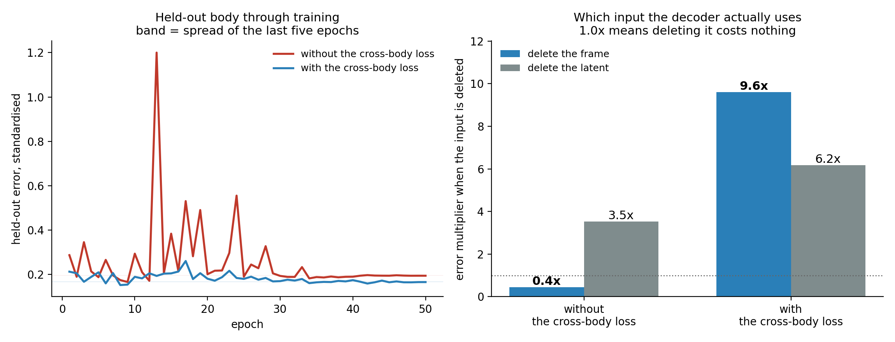
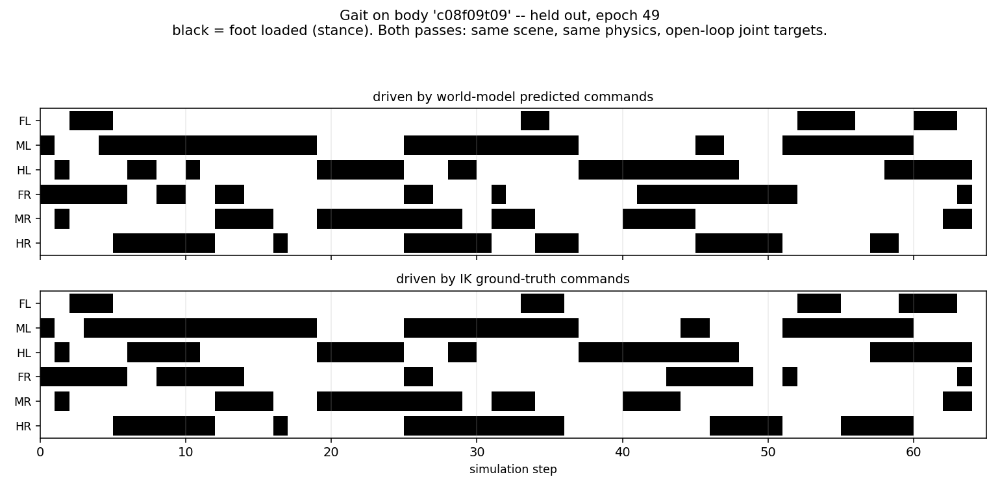
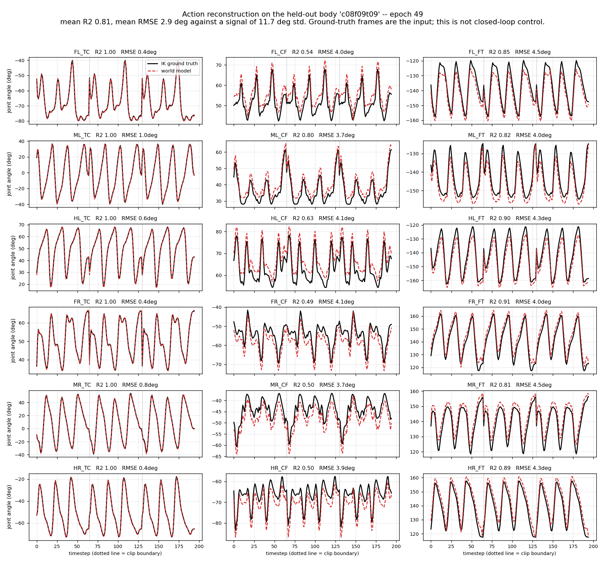
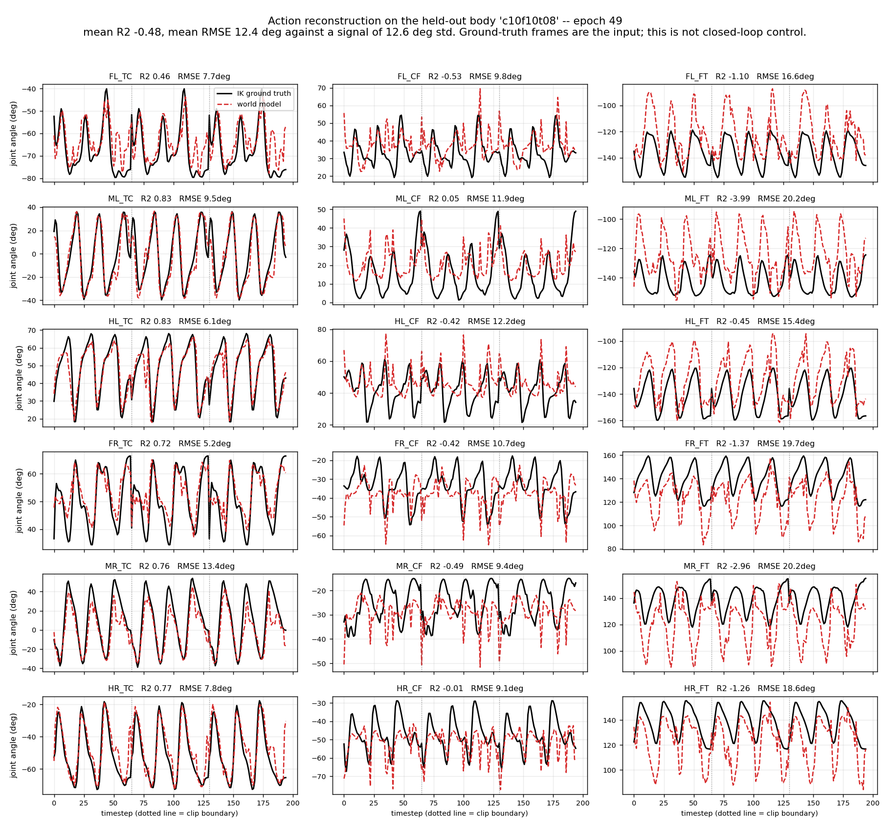
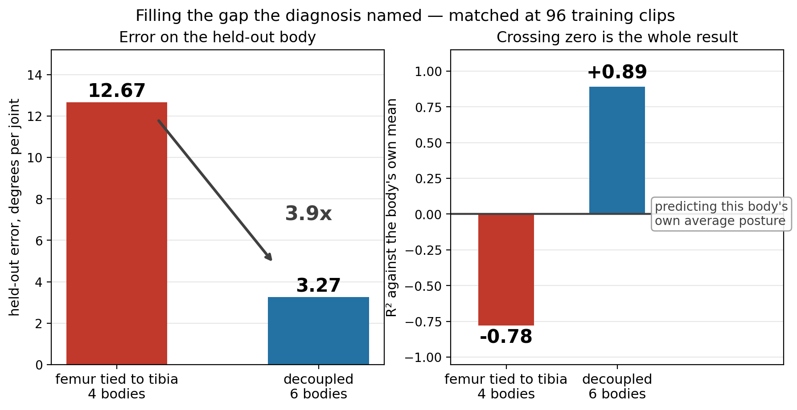
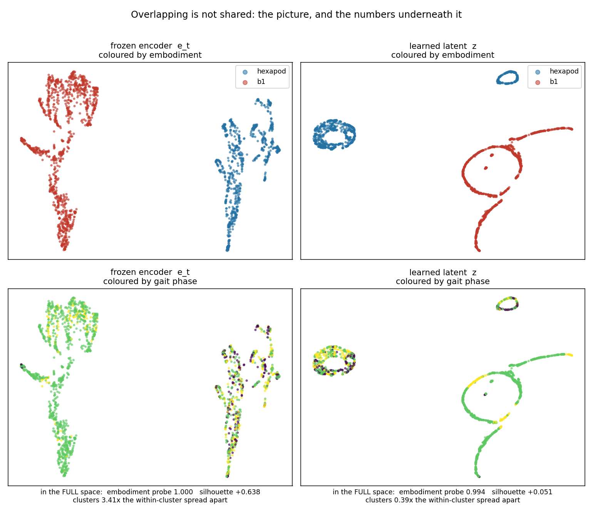
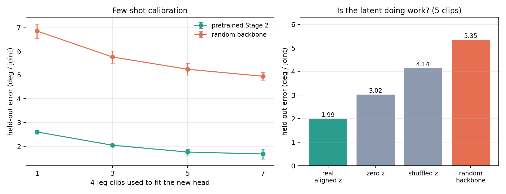
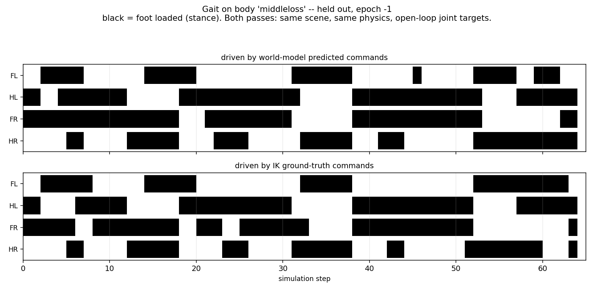

# Progress Update — Stage 1: Cross-Morphology Latent Action Model

Stick insect (*Medauroidea extradentata*), simulated in CoppeliaSim. Stage 1: one 18-DOF
topology, several leg geometries. Stage 2 now appears on slides 14-15: first the clean
hexapod+B1 run, a held-out 4-leg action space, and transfer to a genuinely different robot.
Eighteen slides.

Slides 1 to 3 are background already covered previously. The update starts at slide 4.

---

## Slide 1 — Cross-morphology locomotion from a latent action model

Stage 1 progress update: what was built, what it measures, what it found.

**The problem.** A locomotion controller maps state to joint command. Change the leg lengths and
the same numerical command produces a different physical result — the robot stumbles, or stands at
a different height, or does not move. Every body needs its own commands for the same behaviour.

**The question this stage asks.** Can a model learn a latent action `z` from **video alone** — no
morphology label, no kinematics supplied — that separates *what movement is happening* from *which
body is doing it*, and then turn that latent into the correct body-specific joint command?

**The scope, stated precisely.** Stage 1 is cross-**morphology**, not cross-embodiment. All Stage
1 bodies share one 18-D joint space, six legs times three joints; only the geometry differs.
Stage 2 extends the same question to cross-embodiment with a quadruped, and tests a held-out
4-leg action space.

**Why it matters for what comes after.** If the latent really separates behaviour from body, the
same latent should drive a robot with a different number of legs. A camera gives that for free:
`256x256x3` is the same input space whatever the body, so one encoder serves both robots without
being told anything about either. Joint space has no such property — 18 numbers and 12 numbers with
no correspondence between them — so a proprioceptive method has to be **handed the kinematic
structure** before it can compare the two. Stage 1 is the test of whether the separation happens at
all, in the easy case where the joint spaces do match.

**What this update covers.**

| | |
|---|---|
| Slides 2-3 | what was built, the data, and how every number below is measured |
| Slides 4-7 | the central result: the geometry is readable, the model ignores it, what fixed that, and what the fix did to the latent |
| Slides 8-10 | where it stops working, why, a test of that explanation, and a check that predicts it in advance |
| Slides 11-12 | two facts about the task itself that bound what the latent can be worth |
| Slides 13-16 | status, a first cross-embodiment run, a held-out 4-leg action space, and the B1: zero-shot fails, one clip is enough |
| Slide 17 | what is settled, and the one decision left |
| Slide 18 | why the latent is not shared, and which part the data fixes |
| Slide 19 | the fix for the part it does not: one head both robots share |
| Slide 20 | the conclusion: what was asked, what the measurements say, and the scope |
| Appendix | last term's three questions, answered |

---

## Slide 2 — The pipeline and its three trained modules

```
frame_t  --[frozen V-JEPA2]-->  e_t  --+--[ITM]--> z --[FTM]--> ê_{t+1}
                                       |
                                       +--[Motion Decoder]--> â
```

- **Encoder**: V-JEPA2 ViT-g/16, 1B parameters, **frozen throughout**, never trained on robots.
- **Trained**: three modules on top, about 5M parameters each.
- **Data**: CoppeliaSim, 20 Hz, fixed 256x256 side camera, joint targets in radians.

| Module | Input | Output | Why it exists |
|---|---|---|---|
| **ITM** inverse transition | `e_t`, `e_{t+1}` | `z ∈ ℝ^64` | Given a transition, what action produced it? |
| **FTM** forward transition | `e_t`, `z` | `ê_{t+1}` | Does `z` let you predict the next frame? |
| **Motion Decoder** | `e_t`, `z` | `â ∈ ℝ^18` | Can `z` be turned back into an executable joint command? |

**The objective, as inherited from LAC-WM.** Two terms:

```
z      = ITM(e_t, e_{t+1})
L_recon  = || FTM(e_t, z) - e_{t+1} ||^2          predict the next frame
L_motion = || MD(e_t, z)  - a      ||^2          recover the real joint command
L        = 1.0 * L_recon  +  1.0 * L_motion
```

**Two structural facts to hold on to.**

The Motion Decoder receives `e_t` but **never `e_{t+1}`**. Anything the second frame contributes
has to travel through the 64-number latent. That bottleneck is the whole design, and it is what
slides 8 and 10 turn out to hinge on.

The two terms sit on very different scales — reconstruction around 1.5, motion around 0.01 in
standardised units — so weighting them equally at 1.0 does **not** give them equal influence.
**Reconstruction takes roughly 99 percent of the gradient in practice**, which means the term
meant to ground the latent in real commands is running on the remaining one percent.

---

## Slide 3 — The data, and how everything below is measured

Every run below draws from one of three directories, each built by linking only the clips where
the body actually walked — signed forward travel ≥ 0.30 m and lateral drift < 0.20 m. Bodies that
collapse or veer are excluded by name, not by hope.

| Dataset | Bodies | Size | Used by |
|---|---|---|---|
| `ik_walk_m3d_clean` | 4 training, all femur = tibia | 140 clips | `m3d_cross`, `m3d_bracketed` — slides 4-8 |
| `ik_walk_cov_narrow` | 4 training, all at femur/tibia 0.83 | 96 + 20 clips | `tib_cross`, `tib_ctrl` — slide 9 |
| `ik_walk_cov_wide` | 6 training, femur/tibia decoupled | 96 + 20 clips | `bracket_cross` — slide 9 |

The two coverage directories are **volume-matched at 96 training clips**, which is what lets slide
9 attribute its result to coverage rather than to more data.

- Commands come from **IK retargeting**: one shared foot trajectory in Cartesian space, solved
  separately per body. Same intended behaviour, genuinely different joint commands. Without this
  the transfer question would not be well posed — every body would receive the same command.
- Behaviour: forward walking only, one speed. This becomes important on slide 10.
- Held-out bodies are never trained on and are used only for evaluation.

| Tool | What it does | What it tells us |
|---|---|---|
| **Linear probe** | Fit a ridge regression on training bodies, apply to a held-out body | Is the information present and readable, independent of what the trained model does with it |
| **Swap test** | Give the decoder body A's frame with body B's latent | Does the decoder take the body from the frame or from the latent |
| **Input ablation** | Zero out `z`, or zero out `e_t`, and re-measure | Which of its two inputs the decoder actually depends on |
| **Mixture fitting** | Find the best combination of training bodies' commands explaining the output | Is the model interpolating, or copying one body |
| **Physical replay** | Drive the predicted commands through the same physics | Do the commands actually walk, not just score well per joint |

All error figures below are RMSE in degrees, pooled over all 18 joints and all timesteps, on a
body never trained on. The commands' own spread is about 11.7 deg per joint, so that is the number
to read every error against.

**One rule for every `x` in this deck: `comparison error ÷ our error`. Above 1.0 the comparison is
worse; 1.0 is a tie.** Only what we compare against changes, and each table names it:

| compared against | so `1.4x` means | slides |
|---|---|---|
| **a random backbone** — same head, same clips, untrained weights | pretraining is worth 1.4x | 15, 16 |
| **holding the frame still** — predicting no change at all | the forward model beats doing nothing by 1.4x | 11, 12, 13, 16 |
| **the same model with a part deleted** | that part was worth 1.4x — read as a *cost* of removing it | 14, 19 |

The one exception is flagged where it occurs: slide 19 compares **R²**, where higher is better, so
that ratio runs the other way.

**"Control" throughout means the matched run**: identical data, identical split, identical
architecture, identical seed, with **one flag changed** — the cross-body loss turned off. Which
run that is depends on which split is being discussed, so it is named each time:

| Split | With the cross-body loss | Its control |
|---|---|---|
| 4 training bodies, held out `c08f09t09` (inside the range) | `m3d_cross` | `m3d_bracketed` |
| 4 training bodies tied at femur/tibia 0.83, held out `c10f10t08` (outside it) | `tib_cross` | `tib_ctrl` |

---

## Slide 4 — The geometry is in the frame, and the model does not use it

**The information is there.** A ridge probe from the **frozen** encoder to the three segment
scales, fitted on the four training bodies and applied to one it has never seen.

| Body | | coxa pred / true | femur | tibia |
|---|---|---|---|---|
| c10f10t10 | train | 0.978 / 1.00 | 0.999 / 1.00 | 0.999 / 1.00 |
| c06f10t10 | train | 0.623 / 0.60 | 0.998 / 1.00 | 0.998 / 1.00 |
| c10f06t06 | train | 0.997 / 1.00 | 0.602 / 0.60 | 0.602 / 0.60 |
| c06f06t06 | train | 0.602 / 0.60 | 0.600 / 0.60 | 0.600 / 0.60 |
| **c08f09t09** | **held out** | **0.836 / 0.80** | **0.914 / 0.90** | **0.914 / 0.90** |

Training rows are in-sample and near-exact, which is what makes the last row readable. Held-out
errors are **0.036, 0.014, 0.014** on a 0–1 scale, from **4,227 parameters** on a 1B-parameter
encoder that has never seen a robot, with nothing supervising it. **This is the premise the project
rests on.**

**The model trained on top does not use it.**

**Swap test** — give the decoder body A's frame with body B's latent, where the two bodies'
commands differ by 21.1 deg. It answers with **body B's** command to within 6.0 deg: it followed
the latent and ignored the frame.

**What geometry does each estimator think the held-out body has?** The probe reads it off the
encoder. The decoder is asked indirectly — fit its output as a mixture of the training bodies'
commands and read off the scales that mixture implies.

| Held-out `c08f09t09` | coxa | femur | tibia |
|---|---|---|---|
| **The truth** | **0.80** | **0.90** | **0.90** |
| Probe on the frozen encoder, 4,227 params | **0.836** | 0.914 | 0.914 |
| The trained decoder, 5.2M params | **0.622** | 0.962 | 0.962 |

Different estimators reading the same frame. The probe lands within 0.04 everywhere; the decoder
implies a **coxa 22% shorter than the body has**. The larger model is the one that misreads it.

> **What this table cannot test.** All four training bodies and the held-out one have femur equal
> to tibia, so neither estimator can produce two different numbers for them. 0.914 / 0.914 is
> interpolation along an axis the data spans. **Slide 8 is where they come apart** — and where both
> estimators fail together.


**From the earlier three-body dataset** — an axis only draws cleanly with two training bodies — so
it shows on three bodies what the table above measures on four.

**Left**: everything placed on one line in joint-command space, 0 = long training body, 1 = short.

| | position |
|---|---|
| the held-out body's true commands | **0.30–0.36** |
| the 29k-parameter probe on the frozen encoder | **0.34** |
| the 5.2M-parameter trained decoder | **0.18–0.19** |

It is not at 0.5 because leg length and joint angle are not linearly related. The probe lands
inside the correct band; the decoder falls short, **pulled toward the training body it is nearest**.

**Right**: more trained capacity buys lower error on bodies it saw and higher error on the one it
did not. The 29k probe is the only predictor below the no-learning baseline on both.

**Reading**: the decoder learned to recognise which of the four training bodies it is looking at
and recall that body's commands. There is no entry for a body it has not seen.

---

## Slide 5 — Four changes that did not help, and the one that did

**Four attempts to fix it at the model**, same split, one flag each:

| What we changed | Result |
|---|---|
| Rescale the command target per body | No change |
| Shrink the decoder head to force generalisation | 1.4–2.1x worse |
| Remove body identity from `z` by adversarial training | Frame used 2x more, transfer 1.2x **worse** |
| Hand the decoder a pooled global view of the frame | Frame used 7.6x **less** |

Capacity, access and the contents of the latent were each ruled out. What remained was the
**objective**: nothing in the loss ever *required* reading geometry from pixels. Recognising the
body was cheaper and scored just as well.

**So change what the loss asks for.** Every body walks the same expert episodes, so at a given
timestep two bodies share the intent and differ only in geometry:

```
z^A      = ITM(e_t^A, e_{t+1}^A)                  the latent from body A's own transition
L_cross  = || MD(e_t^B, z^A) - a^B ||^2           A's latent, B's frame, B's command
L        = 1.0 * L_recon + 1.0 * L_motion + 0.5 * L_cross
```

**One term, weight 0.5, one extra decoder pass per batch** — `z^A` is reused, so no second encoder
or ITM pass. Reading the body out of the latent now gives the **wrong** answer by construction, so
the only way to be right is to read geometry from the frame.

Matched pair, identical but for `lambda_cross`, held-out `c08f09t09`:

| | Without | With |
|---|---|---|
| Error, deg | 3.67 | **3.44** |
| **cost of deleting the frame** (`zero_x`) | **0.083** | **1.621** |
| cost of deleting the latent (`zero_z`) | 0.729 | 0.917 |

**The second row is the result.** As a multiplier on each run's own error, **0.4x without the term
against 9.6x with it — a 22-fold difference in what the frame is worth**, from one flag.



**Left**: held-out error through training — the control spikes repeatedly (1.20 at epoch 13, 0.55
at 24) while the cross-body run is smooth and settles lower. **Right**: what each input is worth.
Read these *between* runs; zeroing an input is out of distribution, so control-against-cross is the
comparison that means something, not the raw multiplier.

**The swap test says something stronger.** One body's frame with the other's latent, commands
21.1 deg apart:

| frame from | latent from | matches `c10f10t10` | matches `c10f06t06` | follows |
|---|---|---|---|---|
| c10f10t10 | c10f06t06 | **4.79** | 21.64 | **the frame** |
| c10f06t06 | c10f10t10 | 21.59 | **5.84** | **the frame** |

Crossed rows score 4.79 and 5.84; uncrossed score 4.77 and 5.88. **Swapping the latent changes the
answer by 0.04 deg** — the decoder reads geometry from pixels and the latent contributes nothing to
that question.

**The two inputs end up with separate jobs.** The frame carries *which body*, the latent carries
*what movement* — `z` is 92.6% gait and 3.4% body (slide 6), and deleting it still costs 3.5x. That
division of labour is what the objective was supposed to produce and what reconstruction alone
never asks for.

---

## Slide 6 — What is inside the latent, with and without the cross-body loss

**What the cross-body loss does to the latent.** Split its variance by what explains it, and
separately ask what can still be decoded out of it:

| | Without | With |
|---|---|---|
| variance explained by **gait phase** | 81.9% | **92.6%** |
| variance explained by **which body it is** | 12.4% | **3.4%** |
| variance explained by neither, the interaction | 5.7% | 4.1% |
| **foot-contact pattern decodable from it** (8 patterns, majority class 0.172) | 0.729 | **0.732** |
| which body it is, decodable from it (4 bodies, chance 0.250) | 0.764 | **0.694** |

The body's share of the latent falls by a factor of **3.6** while the gait's share rises to 93
percent. The last two rows are the check that this is purification and not destruction: behaviour
comes out of the latent **slightly better** than before, so nothing was lost in the process — the
latent **stopped carrying a job that was never its own**, and kept the one that was.


---

## Slide 7 — The commands actually walk

Predicted commands driven open-loop through the same physics used to collect the data, on a body
never trained on. `m3d_cross` against its control `m3d_bracketed`, three clips. Cells are the mean
with the range in brackets; the last column counts clips where the cross-body run wins — same
episodes, same physics, so the comparison is paired.

| | IK | Control | With cross-body loss | cross wins |
|---|---|---|---|---|
| Forward distance, share of IK | 100% | 85% [74–91] | **90%** [89–91] | 1 / 3 |
| Heading deviation from IK | 0 deg | 11.8 [6.1–17.0] | **5.5** [0.6–12.3] | **3 / 3** |
| Commands outside the body's joint range | 0% | **6.1%** [5.8–6.2] | 6.4% [6.3–6.6] | 0 / 3 |
| Worst such excursion | 0 deg | 8.2 [4.0–**16.6**] | **3.9** [3.7–4.1] | 2 / 3 |

**Both walk, and on averages they are close. Read the ranges and the win column instead.**

**Heading is the only measure won outright** — closer to IK on every clip.

**The others say the cross-body run is steadier, not better.** It stays in a narrow band everywhere
(89–91% of the distance, worst excursion 3.7–4.1 deg) while the control matches it on two clips
then fails badly on the third — 74% of the distance, a 16.6 deg excursion. Both step outside the
joint range on ~6% of commands, so the *frequency* is a property of the task; what differs is the
worst case, and that decides whether a gait degrades gracefully or collapses.

> **Stated plainly:** on one clip IK walks almost straight (−0.8 deg) and both models veer, to
> +11.5 and +15.0. Neither reproduces a straight walk on demand.



Black is stance, white swing, 65 steps. Top block is the predicted commands, bottom the IK ground
truth; tripod alternation and stance durations line up, mean feet on the ground 3.02 of six against
the reference's 3.08. Video:
`results/wm/stage1_correct/gait/replay_stage1_m3d_cross_clip0.mp4`



**Per joint** — black is ground truth, red the model, three clips end to end. The mean **R² 0.81**
averages three very different groups:

| joint | R² | RMSE |
|---|---|---|
| **TC**, fore-aft swing | **1.00 on all six legs** | 0.4–1.0 deg |
| **FT**, the knee | 0.81–0.91 | 4.0–4.5 deg |
| **CF**, the leg lift | **0.49–0.80** | 3.7–4.1 deg |

**CF is where it struggles, and in a specific way.** The red trace follows the *shape* of every
cycle and sits at the wrong *height* — it knows what the leg is doing and misplaces how high it
holds it. That is the same failure as slide 4's geometry read, where the decoder puts the coxa at
0.622 against a true 0.80: **the coxa sets leg height.** Two unrelated measurements land on the
same joint.

---

## Slide 8 — The limit: everything ties the femur to the tibia, because the data does

**Same model as the last four slides** — `m3d_cross`, same weights, same frozen encoder. Only the
body it is asked about changes.

| Training body | coxa | femur | tibia |
|---|---|---|---|
| c10f10t10 | 1.0 | **1.0** | **1.0** |
| c06f10t10 | 0.6 | **1.0** | **1.0** |
| c10f06t06 | 1.0 | **0.6** | **0.6** |
| c06f06t06 | 0.6 | **0.6** | **0.6** |

All four tie femur to tibia. Not by design — every body in the dataset where they differ is one
that does not walk (F42), so a training set of bodies that *do* walk is one where those two
segments have never moved apart.

| the same weights, asked about | deg | **R²** |
|---|---|---|
| `c08f09t09` — femur 0.9, tibia 0.9, **inside the range** | **3.44** | **+0.81** |
| `c10f10t08` — femur 1.0, **tibia 0.8**, the first time they differ | 13.35 | **−0.34** |

**Now ask three separate things what geometry `c10f10t08` has.**

| | coxa | femur | tibia |
|---|---|---|---|
| **The truth** | 1.00 | **1.00** | **0.80** |
| The trained decoder, from its output commands | 1.000 | **0.681** | **0.681** |
| The linear probe on the frozen encoder | 0.920 | **0.843** | **0.843** |
| The best any mixture of training bodies could say | 0.809 | **0.600** | **0.600** |

**All three give femur and tibia the same number** — a 5.2M-parameter decoder, a 4,227-parameter
readout of the raw encoder, and a mixture calculation with no learning in it at all, making the
identical mistake. The last row is why: **no combination of bodies in which the two always move
together can pull them apart.**

**And the size of that gap is geometry, not experiment.** The closest all-tied point to (1.00,
0.80) is (0.90, 0.90), a distance of **0.141** — exactly the mixture gap the probe reports, for any
all-tied training set, whichever bodies were used.

### Where the failure sits



| joint | what it moves | R² |
|---|---|---|
| **TC**, thorax-coxa | swings the leg fore and aft | **+0.46 to +0.83 — still works** |
| **CF**, coxa-femur | lifts the leg | −0.53 to +0.05 |
| **FT**, femur-tibia | the knee | **−0.45 to −3.99** |

**The joint that fails worst is the one between the two segments the data could not separate**, and
the joint not involving the tibia still works. The body differs in the tibia and nothing else, and
the damage is localised accordingly — a fingerprint of the data gap, not a model that simply got
worse.

**Not one unlucky body.** Every unseen femur/tibia ratio available, same weights:

| held out | femur/tibia | deg per joint | **R²** |
|---|---|---|---|
| c10f10t08 | 1.04 | 13.35 | **−0.34** |
| c10f09t07 | 1.07 | 11.63 | **−0.14** |
| c10f08t06 | 1.10 | 10.51 | **−0.33** |

**Negative on all three** — worse than memorising the body's average posture — at 10–13 deg per
joint against a command spread of 11.7, comparable to the whole signal.

**The fix is more bodies where femur and tibia differ.** The scene generator already supports it.
A data gap, not a loss or architecture problem, and no regulariser touches it because the
information was never there.

---

## Slide 9 — Testing the diagnosis instead of asserting it

Slide 8 ends with an explanation, and an explanation makes a prediction: **if the femur and tibia
are tied because every training body ties them, then adding bodies where they differ should untie
them.** Two such bodies were generated and checked to walk: `c10f09t07` and `c10f08t06`, at
femur/tibia 1.07 and 1.10.

**Testing that needs two purpose-built runs, and here is why.** If the six-body set simply had more
clips, any improvement could be put down to more data. So a matched pair was trained instead —
**`tib_cross`** on four tied bodies and **`bracket_cross`** on those four plus the two decoupled
ones, at **96 training clips each**, holding out the same body from the same clips.

| | `tib_cross` — 4 bodies, femur tied to tibia | `bracket_cross` — 6 bodies, decoupled |
|---|---|---|
| training clips | 96 | 96 |
| bodies | 4 x 24 clips | 6 x 16 clips |
| held out | `c10f10t08` | `c10f10t08`, the same 20 clips |
| **the model** | **12.67 deg** | **3.27 deg** |
| **R² against the body's own mean** | **−0.78** | **+0.89** |

Only one thing differs between the columns: whether the training set contains bodies whose femur
and tibia move apart.

**A 3.9x improvement, and it crosses zero.** The four-body run is worse than memorising the
held-out body's average posture; the six-body run explains 89% of its variance and beats every
baseline. Filling the gap the diagnosis named does not merely improve extrapolation — **it removes
the failure.**



**A second prediction, costing no GPU at all.** Refit the encoder probe on the enlarged set and its
error on the held-out body should fall. It did — **0.082 → 0.034** — and the specific thing the
diagnosis named is what moved:

| | coxa | femur | tibia |
|---|---|---|---|
| the truth | 1.00 | **1.00** | **0.80** |
| probe fitted on the 4 tied bodies | 0.955 | **0.819** | **0.819** |
| probe fitted on all 6 | 0.973 | **0.954** | **0.772** |

**The four-body probe gives the femur and the tibia the identical number, 0.819 and 0.819** — it
cannot separate two quantities that never varied apart in anything it was fitted on. With the two
decoupled bodies added, the gap between them opens to **0.182 against a true 0.200**, recovering
91 percent of a separation that was previously invisible. The tying broke, and it broke in the
encoder's readout before any decoder was trained.

**Two things to state, because they qualify the number.**

**The held-out body moves inside the hull.** Both sides hold out `c10f10t08` at ratio 1.04. The
four training bodies all sit at 0.83, so for them that is extrapolation; the six-body set spans
0.83–1.10, so for them it is interpolation. **That is exactly what coverage is supposed to do** —
it converts an extrapolation problem into an interpolation one — but it means the two runs do not
face equally hard tasks, and the 3.9x measures the conversion rather than the same task done
better.

**These runs are 10 epochs and peaked at epoch 10**, still improving when the budget ended, where
the m3d pair on the earlier slides had 50. They are not converged, so both figures are a lower
bound rather than a settled value.

---

## Slide 10 — The same measurement predicts, before training, which bodies will transfer

The probe from slide 4 was built to answer a different question. Compared against what the trained
models actually did, it turns out to predict the outcome before a single epoch is run.

| Training set | Held out | **Mixture gap** | **Probe error** | Model, deg | R² | Outcome |
|---|---|---|---|---|---|---|
| 4 bodies, spanning | `c08f09t09` | **0.000** | **0.021** | **3.44** | +0.81 | **beats copy-nearest, 3.47** |
| 6 bodies, decoupled | `c10f10t08` | **0.063** | **0.034** | **3.27** | **+0.89** | **beats every baseline** |
| 4 bodies, all tied at 0.83 | `c10f10t08` | **0.141** | **0.082** | 12.67 | −0.78 | loses to the body's own mean |

**The bottom two rows are the same held-out body.** Nothing about the test changes between them —
same geometry, same clips, same frames. Only the training set does, and the outcome flips from
worse-than-memorising-a-pose to explaining 89 percent of its variance. That rules out the obvious
objection to a table like this, that some bodies are simply harder than others.

Both cheap columns order all three correctly. **The mixture gap is pure geometry** — the distance
from the held-out body's segment scales to the nearest convex mixture of the training bodies' —
and needs no encoder, no model and no data at all. **The probe error** needs one CPU pass of the
frozen encoder and a ridge fit, 4,227 parameters.

- **Neither threshold is zero.** The six-body split sits at a gap of 0.063 and succeeds
  comfortably; the boundary lies between 0.063 and 0.141. What matters is being *near* the hull
  the training bodies span, not inside it.
- **Cost: a few minutes on CPU, no training at all.** Cost of finding out by training: hours of
  GPU per run.

**This turns the limitation into a tool.** Before committing to a train/held-out split, fit the
probe on the training bodies and read off how well it recovers the held-out one. A large error
says the split is asking for a direction the data does not span, and the run will not answer the
question you meant to ask.

Speaker note, and this is the honest version: this was not designed as a diagnostic. The probe was
built to ask whether the encoder carries geometry at all, and only later compared against what the
runs did. That is worth more than a planned result, because the measurement could not have been
chosen to fit the outcome — but three points is enough to establish the ordering and not enough to
set a numeric threshold.

---

## Slide 11 — One frame nearly determines the command

A structural fact about the task, not about the model, and it bounds what any latent could be
worth here. Two measurements say it independently.

### The transition is worth about a third

Substitute what the ITM is given as its second frame, on the held-out body, 195 transitions:

| what the ITM is given as `e_{t+1}` | control | with the cross term |
|---|---|---|
| the real next frame | 3.71 deg | **3.37 deg** |
| **a copy of `e_t`, no transition at all** | **1.28x** | **1.34x** |
| `e_{t-1}`, a wrong transition | 1.67x | 1.65x |
| a frame from a random other time | 3.54x | 3.44x |
| the latent zeroed entirely | 2.88x | 3.48x |

Read the middle rows first: **a wrong transition hurts more than a missing one**, and nonsense
hurts most, so the latent is genuinely sensitive to what the second frame contains — it is not
ignoring it.

Then the second row, which carries the conclusion. **Removing the transition entirely costs 28 to
34 percent.** The other two thirds of what the decoder needs is already in `e_t` alone.

The last row belongs to slide 5's division of labour: **deleting the latent costs the cross-term
run more, 3.48x against 2.88x.** Once the frame carries the body, `z` is left carrying the
movement, and the decoder cannot do without it.

### And the horizon does not matter

| Predict, from a single frame | now | 8 frames ahead | 32 frames ahead |
|---|---|---|---|
| Error, deg (signal spread 11.3 deg) | 3.0 | 3.4 | **2.9** |

- **Predicting 32 frames ahead is as accurate as predicting the present.** The commands come from
  inverse kinematics, which is open loop, and the gait is periodic with a measured cycle of 19
  frames — so one frame fixes the phase and every horizon after it follows.
- Six coordinated legs remove the ambiguity a single leg would have: one frame already identifies
  which feet are swinging with 81.5% accuracy, against 50% by chance.
- A second frame is worth only **1.11x** on the step-to-step change, so almost nothing is left in
  the transition for the latent to carry.

Measured on `c10f10t10` in `ik_walk_m3d_clean`, ridge from mean-pooled frozen encoder features,
18 clips fitted and 8 held out. Pooling all five bodies instead gives the same fractions of the
signal — 26, 30 and 25 percent — against a spread widened to 15.0 deg by the between-body
variance, so the claim does not depend on that choice.

**Why this bounds the whole design.** The joint command cannot be where the latent earns its keep,
because the frame nearly determines it on its own. That is a property of forward walking at one
speed, not a fault in the model — and it is the reason the next slide scores the forward model on
rolling the world forward instead.

**This bounds the action-decoding path only.** Slide 12 measures the forward model itself.

---

## Slide 12 — The forward model was being judged on the wrong task

Every measurement above asks whether forward prediction helps **reconstruct the action**. It
does not. That is not what a forward model is for.

Closing it on its own output and rolling it forward, with the true latents supplied so the
module is isolated, on the held-out body, 162 rollouts:

| steps ahead | forward model | hold the frame still | constant velocity | **beats holding still by** |
|---|---|---|---|---|
| 1 | 1.39 | 2.11 | 5.78 | **1.52x** |
| 3 | 1.78 | 3.05 | 27.6 | **1.72x** |
| 5 | 2.12 | 3.57 | 66.0 | **1.69x** |
| 10 | 2.98 | 4.36 | 236.5 | **1.46x** |

- It beats a frozen world at **every horizon out to ten steps**, and beats constant velocity by
  two orders of magnitude. **The forward model can roll the world forward.**
- Reading the source paper confirms the mistake was ours: in LAC-WM the Motion Decoder is an
  **auxiliary regulariser**. The deployed system predicts future embeddings, rolls them eight
  steps, and picks actions by comparing predicted futures to a goal image. The action decoder is
  not the system's output. **We had made the auxiliary term the whole evaluation.**
- **The cross-body loss costs nothing here.** The control `m3d_bracketed` scores 1.52x, 1.72x,
  1.69x and 1.47x at the same horizons — **identical to two decimal places**. The term that fixed
  morphology reading leaves the world model's own competence untouched, which makes sense: it
  never touches the prediction loss.
- Honest limits: holding still is a weak baseline, 1.5-1.7x over it is real but not dramatic, and
  the margin decays with horizon. **And this is measured on a body the model trained near** —
  slide 16 shows the same module scoring 0.57-0.71x on a robot it has never seen.

Speaker note: this is why the earlier slides say "the command can be read off one frame" rather
than "the world model does nothing". Those are different claims and only the first is supported.

---

## Slide 13 — Where this leaves each piece

| Piece | Status |
|---|---|
| Frozen encoder | Carries body geometry in a directly readable, generalising form. Holds. |
| Latent `z` | With the cross-body loss, 92.6% gait and 3.4% body, and behaviour still decodable from it. Across two *embodiments* the picture is different: the identity is fully decodable and the per-leg readout does not transfer. |
| Motion Decoder | Transfers within the range of bodies it saw. Does not extrapolate beyond it, and we can say precisely why — and on the clean retrain **filling the named gap moved it 12.67 to 3.27 deg at matched data volume, R² −0.78 to +0.89**, which crosses zero and beats every baseline. |
| Forward model | Does not help action reconstruction, but **does roll the world forward**: 1.46-1.72x better than a frozen world out to ten steps, on a body it was trained near. **Across embodiments it fails outright** — 0.57-0.71x on the B1, worse than predicting no motion (slide 16). Coverage does not repair it: the intervention that moved the decoder 3.9x moves the forward model 5-8%. |
| Physical replay | Commands walk, stay inside the body's joint range, and do not veer more than the IK reference. |

**The through-line**: the information transfer needs is readable from vision. Every failure we
found came from the model not being *required* to use it, or from the data not covering the
direction we were asking about. Both are now measured rather than guessed — and the second one we
can now check before spending the training run.

**What is settled enough to write up**

- A frozen video encoder, never trained on robots, carries leg geometry in a linearly readable
  form that generalises to an unseen body — 0.05, 0.04 and 0.002 on a 0-to-1 scale.
- A world model trained on top does not use it, and we can show which pathway it uses instead.
- Making the objective require the mapping fixes that, with four independent measurements moving
  together, and costs nothing in the world model's own competence — within the training range.
- Transfer holds inside the range the training bodies span and fails outside it, and the failure
  reproduces the exact shape of the gap in the data. **Four independent measurements agree on
  where that boundary is**: the decoder's commands (3.44 deg inside, 12.7 outside), the
  encoder probe (0.021 inside, 0.082 outside), and the mixture gap that predicts both
  (0.000 and 0.063 inside, 0.141 outside).
- Filling a gap the diagnosis named closes it, on clean data: **12.67 to 3.27 deg, R² −0.78 to +0.89**
  at matched data volume, and the encoder probe **0.082 to 0.034** with no training at all.

**What is not settled**

- Whether a forward model can be adapted to an unseen robot cheaply enough to plan with — the
  frozen one cannot, and coverage does not fix it (slide 16).
- Whether one genuinely different robot is enough to scope the claim on — slide 17, decision 2.
- Whether the encoder itself or the five-point readout is the limit outside the training range.

---

## Slide 14 — Stage 2: it transfers, but not by sharing a latent

One ITM, forward model and decoder backbone shared across an **18-DOF hexapod and a 12-DOF
quadruped**, with a per-embodiment output head. No cross-embodiment loss — the source method has
none and claims the shared latent emerges from weight sharing alone. **That claim is what this
slide tests.** Two seeds, balanced embodiments, `c08f09t09` withheld.

### It works on a held-out body

**RMSE 3.85 and 3.43 deg, R² +0.87 and +0.90** against a command spread of 11.73 deg — positive on
both seeds, where **every Stage 1 held-out body scored negative** (−0.42 to −3.16).

Driven through physics, though, the predicted commands walk only **63% as far as the IK reference**
while scoring 3.98 deg. Reconstruction accuracy and locomotion are not the same claim. (Zeroing the
latent stops it walking outright — 0.100 m against 0.592, spinning 59.6° off course.)

### But the latent is not shared

**Both robots have exactly one forward speed**, and in Froude terms they walk at the same one —
0.155 and 0.159, despite hip heights of 0.13 m and 0.56 m. So a body-speed readout fitted on one
robot *should* work on the other. That makes it a fair test: a bad score is the representation's
fault, not the question's.

Fit it on one robot, apply it to the other. R², so 0 is "no better than guessing the average":

| | insect→b1 | b1→insect |
|---|---|---|
| frozen V-JEPA2 `e_t` | +0.01 | +0.08 |
| **`z`, our Stage 2** | **−4.60** | **−24.36** |

**Faint in the encoder, and training destroys it.** Negative means a readout fitted on one robot is
systematically *wrong* on the other. Capacity does not explain it — `z` is 64 numbers against
5,632, and it is *better* than the encoder within a single robot.

**Weight sharing bought a sharper per-robot code and a poorer shared one.**

> A per-leg contact readout gives the same verdict, 0.373 across against the encoder's 0.531 — but
> slide 18 shows that quantity cannot transfer between these two gaits at all, so it is not
> evidence about the latent. Body speed is the target that can.

### The identity is there and nothing uses it

| | |
|---|---|
| embodiment decodable from `z` | **0.994** |
| cost of deleting it | **1.03x** |
| cost of deleting the same number of *random* directions | 1.18x |
| cost of deleting `z` entirely | 7.63x |

Removing the identity costs **less than removing arbitrary directions**. It is present and inert.

### A picture would have told you the opposite



Weight sharing compresses the clusters **12.5x** by silhouette. The probe still recovers the
embodiment at **0.994**, and the per-leg readout shows the compression bought no shared meaning.

### So

**The trunk leaves the identity readable but inert, and produces a latent *less* transferable than
the frozen encoder it started from.** Transfer still happens — slides 15 and 16 — so whatever
carries it is not a shared latent in the sense the paper claims. **Slide 18 is why, and slide 19 is
the fix.**

## Slide 15 — A held-out action space: 4-leg insect with a new head

> **Slides 15 and 16 ask one question on two axes: is adaptation cheap?** A novel *action space*
> here, a novel *robot* on 16. Each uses the backbone that genuinely withholds its target — Stage 2
> for the 4-leg, which Stage 2 never saw; **Stage 1 for the B1, because Stage 2 trains on it.**
> Whether the latent is *shared* is a separate question and resumes on slide 18.

Trained on two embodiments — insect to an 18-D head, B1 to a 12-D head. The test body is neither:
the same stick insect with the middle legs removed, leaving `FL, HL, FR, HR` into a **new 12-D
insect head**. The dimensionality matches B1, the semantics do not, so this is **not** a zero-shot
B1-head test.

> **Backbone: `stage2_clean` — trained on stick insects *and* the B1.** Frozen here. The B1 is
> therefore *not* a novel robot on this slide; the 4-leg action space is what is novel.

**Protocol.** Freeze that backbone, add a new 12-D head, fit only that head on N 4-leg clips, test
on held-out clips, compare against the same head on a random backbone.

**The test body is built from `c08f09t09`, which Stage 2 withholds**, so leg count *and* geometry
are both unseen. Three seeds per budget:

> **`gain` = how many times worse the random backbone is.** 2.97x means it makes nearly three
> times the error on the same clips.

| clips for the new head | pretrained Stage 2 | random backbone | gain |
|---:|---:|---:|---:|
| 1 | **2.60 ± 0.08 deg**, R² +0.93 | 6.84 ± 0.30, +0.57 | 2.63x |
| 3 | **2.05 ± 0.03**, +0.96 | 5.75 ± 0.25, +0.68 | 2.81x |
| 5 | **1.76 ± 0.12**, +0.97 | 5.23 ± 0.24, +0.73 | **2.97x** |
| 7 | **1.68 ± 0.21**, +0.97 | 4.94 ± 0.15, +0.76 | 2.94x |



**One clip reaches 2.60 deg; the random backbone never reaches that with seven.** The claim is
**sample efficiency**, not final accuracy.

**The commands execute physically.** Replayed open-loop with the middle legs ghosted out, all five
held-out clips walk 0.61-0.69 m and their stance pattern matches the IK reference **90.2%
frame-for-frame**.



**Reconstruction, not improvement.** The model reproduces the reference including its faults:
removing the middle pair makes this body drift sideways, the IK reference drifts 0.22-0.31 m, and
the model drifts with it. Beating the reference is a policy-training question and out of scope
here. What is measured is whether commands can be *recovered* for an action space the model never
had a head for.

**And the body is a variant, not a new robot** — the same animal with legs taken away. That is
deliberate: it varies the **output coordinates while holding the embodiment nearly fixed**, where
slide 16's B1 varies both at once. Run separately, the two say which axis costs what; run together,
a failure would be unattributable.

**`z` is not redundant** — right panel. Zeroing it costs **1.52x** and shuffling **2.08x**, though
zeroed still beats a random backbone, so the frame carries a lot. Shuffling preserves the latent's
distribution and destroys only its alignment, so that gap is what alignment buys.

---

## Slide 16 — Adapting to a genuinely different robot

> **Backbone: `stage1_m3d_cross` — four stick insect bodies, never a quadruped.** Frozen. **Not**
> the Stage 2 model of slides 14 and 15, which trains on the B1 and so cannot test it.

**The B1 is the one genuinely different robot here** — 12 joints against 18, a trot against a wave.
Fit a fresh 12-D B1 head on a few clips; compare against the same head on random weights.

> `x` = how many times worse the random backbone is. 1.0x means pretraining bought nothing.

| clips fitted | split | pretrained on insects | random weights | margin |
|---|---|---:|---:|---:|
| 5 | random | 20.49 deg | 23.80 | 1.16x |
| 7 | random | 16.05 | 20.09 | **1.25x** |
| 9 | random | 15.62 | 20.48 | **1.31x** |
| 7 | **all 7 speeds both halves** | **15.98** | 20.49 | **1.28x** |

**Insect features make a quadruped head cheaper to fit.** At five clips both arms score R² near
zero, so read seven and nine only.

**The last row is a confound control, not a bigger budget.** The B1 set is 2 policies x 7 commanded
speeds, so a random split can leave speeds unseen and confuse "new robot" with "new speed". Forcing
both halves to cover all seven: **1.28x against 1.25x**. The confound explains none of it.

### All of it travels through the latent

Give the **motion decoder** an all-zero latent instead of the ITM's and it scores **20.86 against
random weights' 20.49** — identical. What the decoder learned about reading a *frame* is worth
**nothing** on a quadruped.

> **This is where slide 15 differs, and it locates the embodiment gap.** On the 4-leg the same
> ablation leaves the frame pathway worth 1.77x; on a genuinely different robot, 0.98x. **The frame
> pathway is what fails to cross; the latent is what survives.**

### The forward model does not cross at all

> Baseline here is **holding the frame still** — predicting no change. Above 1.0x the model beats
> doing nothing.

| FTM rolled on B1 video | 1 step | 3 | 5 | 10 |
|---|---|---|---|---|
| trained on insects **and** B1 | **1.39x** | **1.53x** | **1.52x** | **1.34x** |
| trained on insects only | 0.63x | 0.57x | 0.63x | 0.71x |

**Below 1.0 at every horizon** — worse than doing nothing. Identical modules; the only difference is
whether a quadruped was ever seen. **Exposure, not architecture.**

### But one clip of the new robot is enough

| clips | | h=1 | h=3 | h=5 | h=10 |
|---|---|---|---|---|---|
| 1 | pretrained | **1.02x** | 1.00x | 0.94x | 0.83x |
| 1 | scratch | 0.89x | 0.68x | 0.64x | 0.66x |
| 9 | pretrained | **1.37x** | **1.36x** | **1.26x** | **1.05x** |
| 9 | scratch | 1.01x | 1.10x | 1.06x | 0.96x |

**Pretrained clears 1.0x at one clip; scratch needs seven — 7x less target data.** The curves
separate rather than converge, and at nine clips only pretrained clears break-even at every horizon.

**Zero-shot across robots does not work. One clip does.** Fourteen B1 clips with four held out caps
the clean budget at ten, on one robot pair.

## Slide 17 — What is settled, and the one decision left

### Four questions that were open last time and are now measurements

**1. What Stage 2 should be scored on — both.** The source method picks actions by rolling the
world model forward, so per-joint reconstruction was never the metric it was built for. But
reconstruction is what makes the commands checkable against IK, and slide 16 shows the two disagree
about which model is usable. **Report rollout quality *and* per-joint error.**

**2. How to pair frames across embodiments — it cannot be done on this data.** The mechanism that
fixed Stage 1 needs to know two frames show the same intent. Insect bodies walk identical expert
episodes; the hexapod and B1 share none.

| pairing label | overlap between robots | hexapod frames pairable | pins down the command? |
|---|---|---|---|
| feet on the ground, 0–4 | 0.572 | 98.9% | **no** — 0.998 on the B1, a coin flip |
| which diagonal is loaded | 0.711 | 100% | **no** — 0.918 on the hexapod |
| full 4-leg contact pattern | **0.240** | **33.8%** | yes, 0.63 / 0.52 |

**No label is both covered and meaningful** — coarsening is what destroys the meaning. The B1
spends 84.6% of its time in two trot diagonals while the insect spreads across all sixteen
patterns, nine never visited by the B1. **A mis-paired frame is a wrong label, not a noisy one.**

**3. Whether the 4-leg body tests a new embodiment — it does not.** A leg-removal variant is the
same animal with legs taken away. It tests a new action space, which is why slide 16 exists.

**4. What the claim is — the model is cheap to adapt to a new robot.** Adaptation on target data
was always the design; the source method is itself a LoRA finetune on **7,265 trajectories**. The
question was never whether a finetune is needed but **how small it can be**: **one clip to clear
break-even, nine to clear every horizon tested**, about **7x fewer clips** than starting cold.

The zero-shot measurements (0.57–0.71x) are not a failed attempt at a stronger claim — they are
what shows the finetune is doing real work rather than being a formality.

**The caveat is scope, not capability:** one robot pair, clean budget capped at ten clips.

### The decision left — is one genuinely different robot enough?

**Everything cross-embodiment rests on a single pair**, insect against B1, and slide 16 tests
transfer on that same B1 by holding it out.

A third embodiment would test whether the result generalises, and Stage 1's evidence says coverage
matters — four bodies to six moved the held-out body from R² −0.78 to +0.89. But at the embodiment
level that means a new robot, policy and render path, and **slide 16 measured that coverage buys
the forward model only 5–8%** where it bought the decoder 3.9x. The case for spending it is weaker
than it looks.

**Two ways to go**: report the single pair honestly as the scope of the claim, or invest in a third
robot and accept a later finish. **This is the only item left that needs a decision rather than a
measurement.**

---

## Slide 18 — Why, and what fixes which part

### The chain

| step | evidence |
|---|---|
| no cross-embodiment frame pairing exists | no contact label is both covered and meaningful |
| so `lambda_cross` cannot be applied | it needs to know two frames show the same intent |
| so nothing forces one `z` to mean the same thing on both robots | embodiment is decodable from `z` at **0.994** yet deleting it costs **1.03x**, *less* than deleting random directions — present and inert |

**Stage 1 is the positive control.** Swap the decoder's two inputs — body A's frame with body B's
latent — and ask which body the output resembles. `lambda_cross` makes Stage 1 answer with the
*frame's* body; without it, the latent's. **Stage 2 has no such term available**, for the reason in
the first row.

### The pairing cannot be fixed by finding a better label

Anchor phase at front-left touchdown and ask where every other foot lands. Concentration is 1.0 for
perfectly repeatable, 0.0 for uniform:

| B1 | | | hexapod | |
|---|---|---|---|---|
| FL | **1.00** | | FL | **1.00** |
| RR | **1.00** | | ML | **0.22** |
| FR | **0.99** | | HL | **0.09** |
| RL | **0.99** | | HR | **0.07** |

**One leg's phase fixes all four of the B1's legs and almost none of the insect's other five.** The
B1 trots; the insect walks the variable wave of the real animal it was recorded from. Its gait
state needs roughly six loosely coupled numbers where the B1's needs one, so **any low-dimensional
label that describes the B1 completely must underdetermine the insect**. That is structural, not a
search problem.

### First we tried the data, and it did more than expected

Every insect clip in Stage 2 was the same walking speed. Widening that — retiming the recorded foot
path so the insect walks five speeds instead of one, matched to the B1's range — **fixes several
things at once, with no change to the loss**:

| | one speed | more speeds |
|---|---|---|
| which input the decoder reads the body from | **the latent**, 3.1–3.8x | **the frame**, 2.9–3.9x |
| is a body-level question answerable at all | no — the insect has no speed to read | yes |
| the forward model, rolled on its own output | — | **+7%**, and rising with horizon |

The first row is the switch behaviour, reversed. Same four training bodies, same clips per body,
same epochs; and scoring the old model on the new clips still gives the latent, so it is the
training data that changed and not the evaluation.

The third row is the module nothing else had moved — coverage shifted it 5–8% where it shifted the
decoder 3.9x. **24 of 24 comparisons** across two bodies and both evaluation sets, including the
clips the old model trained on and the new one never saw.

**Behavioural variety is worth handling carefully — it buys more than it looks like.** It also
explains why the source paper did not hit this: their datasets vary, ours did not.

### But one thing does not move

`z` still cannot carry body speed across the two robots. With five speeds and no new term the
readout scores **−7.1**, against the frozen encoder's near-zero.

**That is the part the data cannot fix**, and it is where the loss has to do the work. `L_motion`
supervises `z` through per-embodiment heads onto 18-D and 12-D joint commands with no
correspondence between them, so nothing in the objective ever asks one latent to mean the same
thing twice. LAC-WM's equivalent term targets an end-effector pose every arm shares; locomotion has
no such quantity at leg level — but it does at body level, and that is slide 19.

---

## Slide 19 — The fix: one decoding head both robots share

**Is there any shared body-level signal at all?** Before adding anything, ask what the frozen
encoder already has. Fit a body-speed readout on one robot, apply it to the other:

| | insect→b1 | b1→insect |
|---|---|---|
| **frozen V-JEPA2** | **−0.05** | **+0.13** |
| Stage 2 as built | −7.10 | −2.33 |

R², so 0 is "no better than guessing the average" and negative is worse. **Something is there and
it is faint — and training destroys it.**

**Nothing in the loss ever asked for it.** `L_motion` supervises `z` through per-embodiment heads
onto 18-D and 12-D joint commands with no correspondence between them. LAC-WM's equivalent term
targets an end-effector pose every arm shares; locomotion has no such quantity at leg level, for
the reason on slide 18. **Body motion is where a correspondence exists** — both robots have a
forward speed, and in Froude terms they walk at the same one.

So: decode body speed from `z` through **one head shared by both embodiments**. Matched control,
one flag apart.

| | insect→insect | b1→b1 | **insect→b1** | **b1→insect** |
|---|---|---|---|---|
| frozen encoder | 0.676 | 0.753 | −0.046 | +0.131 |
| control, no term | 0.664 | 0.167 | −7.083 | −2.357 |
| **+ shared head** | **0.798** | **0.879** | **+0.544** | **+0.435** |

**Both cross-robot directions turn positive**, against controls at −7.1 and −2.4, and all four
cells beat the frozen encoder. Both arms scored at the same epoch.

> Read against the control, not the encoder: the encoder row is scored on one frame where `z` is
> built from two, so it is handicapped. The control has identical access and identical data.

### Two things the data had to provide

**The insect walked one speed**, so there was nothing to read. Retiming the recorded foot path
gives five speeds matched to the B1's range, with inter-leg phase untouched — the gait stays the
animal's.

**And speed had to vary inside each clip, not just between them.** With one speed per clip the
shared head memorises rather than learns: held-out loss 0.86 against 1.0 for guessing. Ramping the
speed across a clip brings that to 0.71. **It reduces memorisation; it does not make the head
understand speed.**

### What it costs

**Val motion worsens 56%**, 0.0166 to 0.0259 — the metric slide 14 reports as its headline. That is
the trade, and `lambda_body` has never been swept, so it is not known how much of it is necessary.

**It costs the forward model nothing.** Rolled on B1 video at matched epochs, both arms sit at
1.42x at one step and 1.31–1.33x at ten. The term does one thing and leaves the rest alone.

**One seed on the ramped set.** `insect→b1` has flipped sign once already; a second seed is running.

---

## Slide 20 — Conclusion: what was asked, and what the measurements say

**The question.** Can a latent action learned from video alone — no morphology label, no kinematics
given — separate *what movement is happening* from *which body is doing it*, well enough to drive a
body the model has never seen?

### Answered, at two scopes

**Within one robot family the latent transfers with no retraining at all.** A held-out hexapod
scores **3.44 deg per joint, R² +0.81** against a command spread of 11.7, and the commands walk
when driven open-loop through physics.

**Across incomparable robots it does not transfer, and it adapts cheaply instead.** A frozen
forward model scores **0.57–0.71x** on the B1 — worse than assuming the frame does not move — but
**one clip** of the new robot clears break-even and **nine** clear every horizon tested, about
**7x fewer clips** than starting cold.

> **Zero-shot across robots does not work.** But one clip of the new robot puts this pipeline over
> the line, where starting from scratch takes seven.

### The three things this project found that it did not set out to find

**1. The mechanism is the opposite of the intuition.** The decoder reads *which body* from the
pixels and the latent carries *what movement* — swapping the latent between two bodies whose
commands differ by 21.1 deg moves the answer by **0.04 deg**. The separation the thesis wanted
happens, but not in the module it was expected in.

**2. The failure was in the data, and naming it predicted the fix.** Every walking body tied femur
to tibia, so three unrelated estimators — a 5.2M decoder, a 4,227-parameter probe, and a mixture
calculation with no learning at all — made the identical mistake. Adding decoupled bodies at
matched volume moved a held-out body from **12.67 deg, R² −0.78** to **3.27 deg, R² +0.89**.

**3. What survives a change of robot is the shared representation, not the learned dynamics.**
Pretraining supplies both, and they separate: frozen, real time order beats shuffled by **1.38x**,
yet after a thousand adaptation steps the two are identical. The **1.38x → 0.54x** drop between an
insect body and the B1, on the same weights with nothing retrained, is the embodiment gap in one
line.

### What the claim is, stated so it cannot be overread

The model is **cheap to adapt** to a robot it has never seen, and a camera is the only thing it has
to be given about that robot. It is **not** that the model transfers to a new robot unassisted —
that was measured and is false — and **not** that proprioception cannot cross morphologies, which
existing work does; the difference is that those methods must be handed the kinematic tree.

### Scope, stated once

| | |
|---|---|
| cross-embodiment evidence rests on | **one robot pair**, insect ↔ B1 |
| B1 data available | 14 clips, clean budget capped at **10** |
| behaviours | the insect now spans five speeds matched to the B1's range; turning on neither |
| never run | the EAC-WM analogue baseline — a decoder conditioned on raw joint state |

### What is open, in the order it is being worked

**1. Whether the shared latent can be repaired — the first evidence that it can.** Slide 19 clears
the frozen-encoder bar by 5.2x in one direction, on one seed, at a 50% cost to command accuracy.
The other direction is still negative and the diagnosis points at a continuous speed target as the
next step.

**2. Whether one robot pair is enough scope — no measurement can decide it.** Report the single
pair honestly, or invest in a third embodiment: a biped, on the leg-count axis 6 → 4 → 2, and
accept a later finish.

**3. Closed-loop control and a benchmark comparison.** Every number in this deck is command
reconstruction against IK, replayed open-loop. The pipeline exists to control a robot, and that is
not yet tested. The EAC-WM baseline is the comparison arm that makes a benchmark meaningful, and it
is the one item this deck lists as required and never run.

---

## Appendix — three questions from Week 11, now with answers

> Not part of the argument. Kept because these were asked and the answers are measurements.

### 1. "How is this different from Diffusion?"

**The latent is inferred, not sampled.** A diffusion model starts from noise that is isotropic
Gaussian *by construction* — structureless by design. Our `z` comes from the ITM given an observed
pair of frames, with no sampling anywhere at inference. The pipeline is deterministic.

Ask what a latent is made of and a diffusion prior answers "nothing, by design". Ours answers:

| | share of `z`'s variance |
|---|---|
| gait phase | **92.6%** |
| which body | **3.4%** |
| interaction | 4.1% |

**The requirement is also different in kind.** A diffusion policy is trained for one robot and
never has to satisfy a cross-body constraint. Ours must decode to *different joint values for
different bodies from the same latent* — which is what `lambda_cross` enforces and the held-out
body tests.

**The part of the question that stands.** At the level of "a conditioned generator produces
motion", the two are swappable, and swapping generators would be plumbing rather than a
contribution. The differentiator is not the architecture but the claim: **transfer to a body, or an
embodiment, never in the training set.** Diffusion policies, Sora and animation pipelines do not
attempt that — which is also why the evaluation is a held-out body rather than sample quality.

### 2. "Few sensors and fast, or many sensors and slow?"

V-JEPA2 ViT-g/16 is **1 billion parameters, frozen**; encoding one frame on our 2080 Ti takes
**94.9 ms — 10.5 Hz**.

| | sensors | loop time |
|---|---|---|
| biological, his example | ~10^6 nerve endings | 200 ms |
| robot control, his example | few | 20 ms, 50 Hz |
| **our vision path** | one camera | **94.9 ms, 10.5 Hz** |

**We sit on the biological side, and that was not a mistake.** Vision is not buying bandwidth or
speed — it is buying **commensurability**. An 18-DOF hexapod and a 12-DOF quadruped have no shared
joint space and no midpoint between them; a camera describes both in the same coordinates **without
being told anything about either body**. Bandwidth is not what is missing, a shared coordinate
system is.

> **State it carefully.** Proprioceptive methods that act across morphologies do exist — joints as
> a token set over a graph — so the claim is not that joint space cannot be made to work. It is
> that those methods must be **given the kinematic tree**, and ours is given a camera pointed at a
> robot it knows nothing about.

So the architecture is **two-rate by necessity**: perception plans at ~10 Hz, control stabilises at
50 Hz — planner, not reflex.

### 3. "Removing proprioception entirely is not possible"

**Agreed, and our own measurement supports the objection.** A stance-fraction readout fitted on one
embodiment's frozen encoder and applied to the other scores **0.82x and 0.89x** of the target's
spread within an embodiment, and **1.16x and 1.04x** across — at or past the line where looking at
the image is worth nothing.

**That is after controlling for colour, apparent size and pooling, and the controls do the work:
uncontrolled and mean-pooled the same measurement reads 4.72x.** Reporting the range rather than
the best reduction is the only way this number means anything.

> **Read with slide 18's caveat.** Stance fraction is a leg-level quantity compared across robots,
> and slide 18 measures that one leg's phase fixes all four of the B1's and almost none of the
> insect's other five. So this may be measuring the impossibility of the question rather than a
> limit of vision. The answer below is unchanged; the evidence for it is weaker than it reads.

Vision does not read load transfer between bodies. The six-legs-minus-two argument is correct, and
this is the number for it.

**That changes the scope of the claim, not the claim.** The thesis is that vision can carry a skill
*between* incomparable bodies **without a description of either one** — not that vision closes the
balance loop. The deployment loop uses both: the latent supplies **what to do**, proprioception
**how to stay up while doing it**.

Also worth noting: the paper's transfer is **not zero-shot** either. It is a three-stage LoRA
finetune on 7,265 trajectories of the target robot, which is why sample efficiency is the
comparable claim.

---
