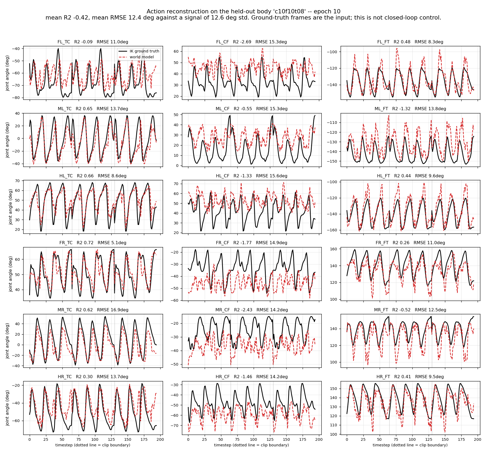
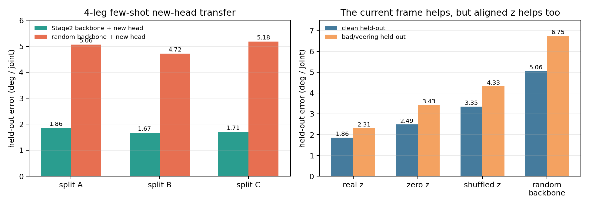
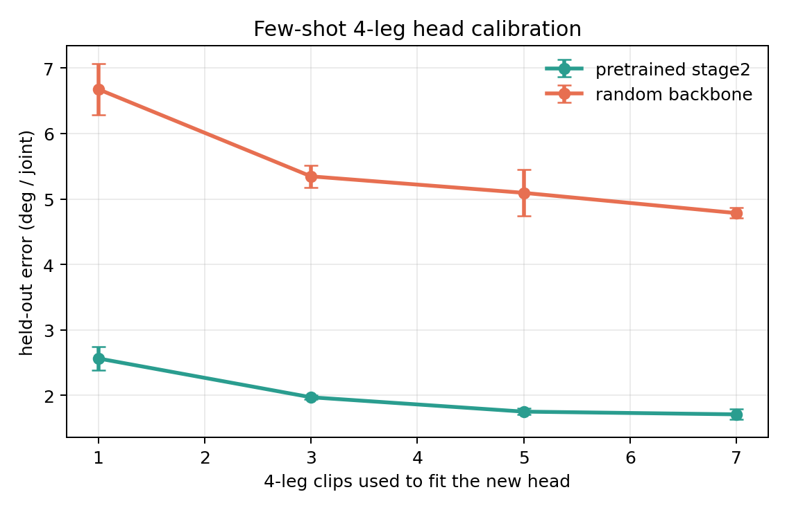
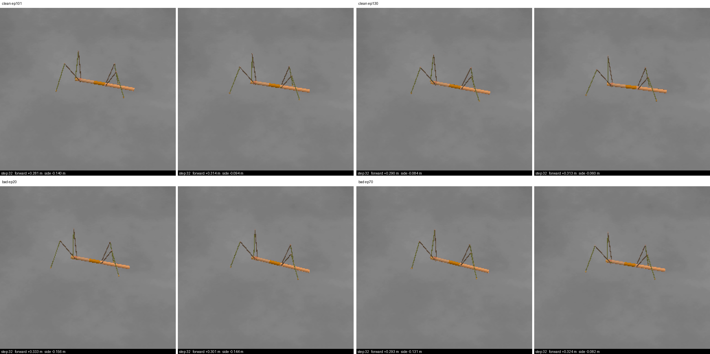
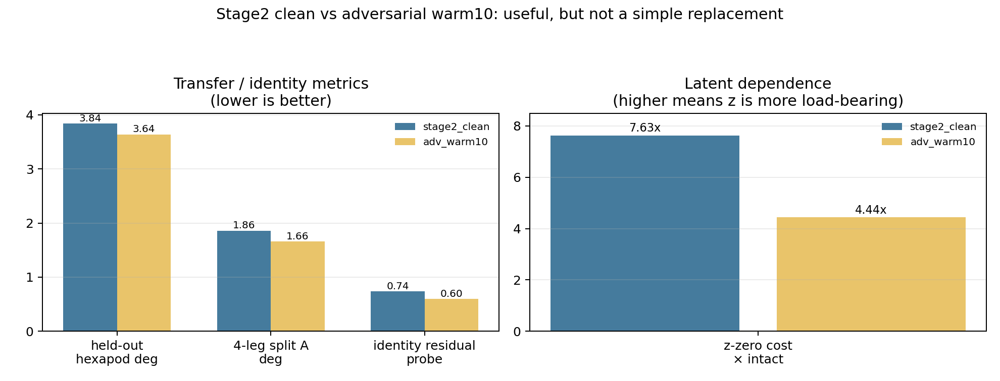

# Progress Update — Stage 1: Cross-Morphology Latent Action Model

Stick insect (*Medauroidea extradentata*), simulated in CoppeliaSim. Stage 1: one 18-DOF
topology, several leg geometries. Stage 2 now appears on slides 14-15: first the clean
hexapod+B1 run, then a held-out 4-leg action space. Seventeen slides.

Slides 1 to 3 are background already covered previously. The update starts at slide 4.

---

## Slide 1 — Cross-morphology locomotion from a latent action model

Stage 1 progress update: what was built, what it measures, what it found.

**The problem.** A locomotion controller maps state to joint command. Change the leg lengths and
the same numerical command produces a different physical result — the robot stumbles, or stands at
a different height, or does not move. Every body needs its own commands for the same behaviour.

**The question this stage asks.** Can a model learn a latent action `z` from **video alone** — no
morphology label, no kinematics supplied — that separates *what movement is happening* from *which
body is doing it*, and then turn that latent into the correct body-specific joint command?

**The scope, stated precisely.** Stage 1 is cross-**morphology**, not cross-embodiment. All Stage
1 bodies share one 18-D joint space, six legs times three joints; only the geometry differs.
Stage 2 extends the same question to cross-embodiment with a quadruped, and tests a held-out
4-leg action space.

**Why it matters for what comes after.** If the latent really separates behaviour from body, the
same latent should drive a robot with a different number of legs, which no proprioceptive
controller can do because the joint spaces cannot even be compared. Stage 1 is the test of whether
that separation happens at all, in the easy case where the joint spaces do match.

**What this update covers.**

| | |
|---|---|
| Slides 2-3 | what was built, the data, and how every number below is measured |
| Slides 4-7 | the central result: the geometry is readable, the model ignores it, what fixed that, and what the fix did to the latent |
| Slides 8-10 | where it stops working, why, a test of that explanation, and a check that predicts it in advance |
| Slides 11-12 | two structural facts about the task itself, found last, that reframe the rest |
| Slides 13-16 | status, a first cross-embodiment run, a held-out 4-leg action space, and the decisions still open |

---

## Slide 2 — The pipeline and its three trained modules

```
frame_t  --[frozen V-JEPA2]-->  e_t  --+--[ITM]--> z --[FTM]--> ê_{t+1}
                                       |
                                       +--[Motion Decoder]--> â
```

- **Encoder**: V-JEPA2 ViT-g/16, 1B parameters, **frozen throughout**, never trained on robots.
- **Trained**: three modules on top, about 5M parameters each.
- **Data**: CoppeliaSim, 20 Hz, fixed 256x256 side camera, joint targets in radians.

| Module | Input | Output | Why it exists |
|---|---|---|---|
| **ITM** inverse transition | `e_t`, `e_{t+1}` | `z ∈ ℝ^64` | Given a transition, what action produced it? |
| **FTM** forward transition | `e_t`, `z` | `ê_{t+1}` | Does `z` let you predict the next frame? |
| **Motion Decoder** | `e_t`, `z` | `â ∈ ℝ^18` | Can `z` be turned back into an executable joint command? |

**The objective, as inherited from LAC-WM.** Two terms:

```
z      = ITM(e_t, e_{t+1})
L_recon  = || FTM(e_t, z) - e_{t+1} ||^2          predict the next frame
L_motion = || MD(e_t, z)  - a      ||^2          recover the real joint command
L        = 1.0 * L_recon  +  1.0 * L_motion
```

**Two structural facts to hold on to.**

The Motion Decoder receives `e_t` but **never `e_{t+1}`**. Anything the second frame contributes
has to travel through the 64-number latent. That bottleneck is the whole design, and it is what
slides 8 and 10 turn out to hinge on.

The two terms sit on very different scales — reconstruction around 1.5, motion around 0.01 in
standardised units — so weighting them equally at 1.0 does **not** give them equal influence.
**Reconstruction takes roughly 99 percent of the gradient in practice**, which means the term
meant to ground the latent in real commands is running on the remaining one percent.

---

## Slide 3 — The data, and how everything below is measured

Every run below draws from one of three directories, each built by linking only the clips where
the body actually walked — signed forward travel ≥ 0.30 m and lateral drift < 0.20 m. Bodies that
collapse or veer are excluded by name, not by hope.

| Dataset | Bodies | Size | Used by |
|---|---|---|---|
| `ik_walk_m3d_clean` | 4 training + 1 held out | 140 clips | `m3d_cross`, `m3d_bracketed` |
| `ik_walk_cov_narrow` | 4 training, all at femur/tibia 0.83 | 96 + 20 clips | `tib_cross`, `tib_ctrl` |
| `ik_walk_cov_wide` | 6 training, femur/tibia decoupled | 96 + 20 clips | `bracket_cross` |

The two coverage directories are **volume-matched at 96 training clips**, which is what lets slide
9 attribute its result to coverage rather than to more data.

- Commands come from **IK retargeting**: one shared foot trajectory in Cartesian space, solved
  separately per body. Same intended behaviour, genuinely different joint commands. Without this
  the transfer question would not be well posed — every body would receive the same command.
- Behaviour: forward walking only, one speed. This becomes important on slide 10.
- Held-out bodies are never trained on and are used only for evaluation.

| Tool | What it does | What it tells us |
|---|---|---|
| **Linear probe** | Fit a ridge regression on training bodies, apply to a held-out body | Is the information present and readable, independent of what the trained model does with it |
| **Swap test** | Give the decoder body A's frame with body B's latent | Does the decoder take the body from the frame or from the latent |
| **Input ablation** | Zero out `z`, or zero out `e_t`, and re-measure | Which of its two inputs the decoder actually depends on |
| **Mixture fitting** | Find the best combination of training bodies' commands explaining the output | Is the model interpolating, or copying one body |
| **Physical replay** | Drive the predicted commands through the same physics | Do the commands actually walk, not just score well per joint |

All error figures below are RMSE in degrees, pooled over all 18 joints and all timesteps, on a
body never trained on. The commands' own spread is about 11.7 deg per joint, so that is the number
to read every error against.

**"Control" throughout means the matched run**: identical data, identical split, identical
architecture, identical seed, with **one flag changed** — the cross-body loss turned off. Which
run that is depends on which split is being discussed, so it is named each time:

| Split | With the cross-body loss | Its control |
|---|---|---|
| 4 training bodies, held out `c08f09t09` (inside the range) | `m3d_cross` | `m3d_bracketed` |
| 4 training bodies tied at femur/tibia 0.83, held out `c10f10t08` (outside it) | `tib_cross` | `tib_ctrl` |

---

## Slide 4 — The geometry is in the frame, and the model does not use it

**The information is there.** Fit a ridge probe from the **frozen** encoder's output to the three
segment scales, using the four training bodies — `c10f10t10`, `c06f10t10`, `c10f06t06`,
`c06f06t06` — and apply it to a body it has never seen.

| held-out `c08f09t09` | coxa | femur | tibia |
|---|---|---|---|
| the truth | 0.80 | 0.90 | 0.90 |
| **the probe** | **0.836** | **0.914** | **0.914** |
| error | 0.036 | 0.014 | 0.014 |

Errors of **0.036, 0.014 and 0.014** on a 0-to-1 scale, from **4,227 parameters** sitting on a
1B-parameter encoder that has never seen a robot. Nothing supervises it to do this. **This is the
premise the project rests on.**

**The model trained on top does not use it.**

- **Swap test**: give the Motion Decoder body A's frame together with body B's latent. The two
  bodies' commands differ by 21.1 deg. It answers with **body B's** command, to within 6.0 deg —
  it followed the latent and ignored the frame it was holding.
- **What geometry does each one think the held-out body has?** The probe reads it off the encoder
  directly. The decoder is asked indirectly: fit its output commands as a mixture of the training
  bodies' commands, and read off the segment scales that mixture implies.

| Held-out body `c08f09t09` | coxa | femur | tibia |
|---|---|---|---|
| **The truth** | **0.80** | **0.90** | **0.90** |
| The probe on the frozen encoder, 4,227 parameters | 0.836 | 0.914 | 0.914 |
| The trained decoder, 5.2M parameters | **0.98** | **0.98** | **0.97** |

The two rows are **different estimators, not the same number twice**. The probe lands within 0.04
of the truth. The decoder answers "essentially a full-size body" for a body whose legs are 10 to
20 percent short — it has slid its answer onto the nearest training body, `c10f10t10`. The larger
model, holding the same frame, is the one that gets it wrong.


**This figure is from the earlier three-body dataset** — train on a long and a short body, hold out
a medium one — because an axis only draws cleanly with two training bodies. It shows on three
bodies what the table above measures on four.

**Left.** Everything is placed on one line: 0 is the long training body, 1 is the short one, and
the position is measured **in joint-command space**, so all three rows are directly comparable.

| | position |
|---|---|
| where the held-out body's true commands sit | **0.30 - 0.36** |
| the 29k-parameter probe on the frozen encoder | **0.34** |
| the 5.2M-parameter trained decoder | **0.18 - 0.19** |

The held-out body is not at 0.5 because leg length and joint angle are not linearly related — its
commands genuinely sit nearer the long body's. The probe lands inside the correct band. The
decoder lands well short of it, **pulled back toward the training body it is nearest**.

**Right.** More trained capacity buys lower error on the bodies it saw and higher error on the one
it did not. The 29k-parameter probe is the only predictor that stays below the no-learning
baseline on both.

**Reading**: the decoder learned to recognise which of the four training bodies it is looking at
and recall that body's commands. There is no entry for a body it has not seen.

---

## Slide 5 — Four changes that did not help, and the one that did

**Four attempts to fix it at the model.** All on the same split, one flag changed each time:

| What we changed | Result |
|---|---|
| Rescale the command target per body | No change |
| Shrink the decoder head, to force it to generalise | 1.4-2.1x worse |
| Remove body identity from `z` by adversarial training | Used the frame 2x more, transfer 1.2x **worse** |
| Hand the decoder a pooled global view of the frame | Used the frame 7.6x **less** |

Capacity, access, and the contents of the latent were each ruled out. What remained was the
**objective**: nothing in the loss ever *required* the model to read geometry from pixels.
Recognising the body was always cheaper and scored exactly as well.

**So change what the loss asks for.** Every body walks the same expert episodes, so at a given
timestep two bodies share the intent and differ only in geometry. Take body A's latent, decode it
against body **B's** frame, and require body **B's** command:

```
z^A      = ITM(e_t^A, e_{t+1}^A)                  the latent from body A's own transition
L_cross  = || MD(e_t^B, z^A) - a^B ||^2           A's latent, B's frame, B's command
L        = 1.0 * L_recon + 1.0 * L_motion + 0.5 * L_cross
```

**One added term, weight 0.5, and one extra decoder pass per batch** — the same `z^A` is reused,
so there is no second pass through the encoder or the ITM. Everything else is untouched.

Body B is drawn from the same episode at the same timestep, which is what makes `a^B` well
defined. Reading the body out of the latent now gives the **wrong** answer by construction, since
that latent came from A while the required answer belongs to B. The only way to be right is to
read the geometry from the frame.

Matched pair, identical in everything but `lambda_cross`, held-out body `c08f09t09`:

| | Without | With |
|---|---|---|
| Error, deg | 3.67 | **3.44** |
| **cost of deleting the frame** (`zero_x`) | **0.083** | **1.621** |
| cost of deleting the latent (`zero_z`) | 0.729 | 0.917 |

**The second row is the result.** Deleting the frame costs the control almost nothing and the
cross-body run a great deal. As a multiplier on each run's own error: **0.4x without the term
against 9.6x with it** — a 22-fold difference in how much the frame is worth to the decoder, from
one flag. Without it the decoder is not reading the frame; it identifies the body from `z` and
recalls that body's commands.


**Left**: held-out error through training. The control spikes repeatedly — 1.20 at epoch 13, 0.55
at 24 — while the cross-body run is smooth from the start and settles lower. **Right**: what each
input is worth. Read these *between* runs rather than as absolute costs: zeroing an input is out of
distribution, so the comparison that means something is control-against-cross, not the raw
multiplier.

**The swap test confirms it directly, and says something stronger.** Give the decoder one body's
frame and the other body's latent, on two bodies whose commands differ by 21.1 deg:

| frame from | latent from | matches `c10f10t10` | matches `c10f06t06` | follows |
|---|---|---|---|---|
| c10f10t10 | c10f06t06 | **4.79** | 21.64 | **the frame** |
| c10f06t06 | c10f10t10 | 21.59 | **5.84** | **the frame** |

The crossed rows score 4.79 and 5.84; the uncrossed rows score 4.77 and 5.88. **Swapping the
latent changes the answer by 0.04 deg.** The decoder is not merely preferring the frame — it reads
the body's geometry from pixels and the latent contributes nothing to that question.

**The two inputs end up with separate jobs.** The frame carries *which body*, and the latent
carries *what movement* — `z` is 92.6% gait and 3.4% body (slide 6), and deleting it still costs
3.5x, so the decoder genuinely needs it. That division of labour is what the objective was
supposed to produce and what the reconstruction term alone never asks for.

- Beats the copy-nearest baseline, and does not get worse as training continues.
- Costs one extra decoder pass per batch, no extra encoder or ITM work.

---

## Slide 6 — What is inside the latent, before and after

**What is inside the latent, before and after.** Split its variance by what explains it, and
separately ask what can still be decoded out of it:

| | Without | With |
|---|---|---|
| variance explained by **gait phase** | 81.9% | **92.6%** |
| variance explained by **which body it is** | 12.4% | **3.4%** |
| variance explained by neither, the interaction | 5.7% | 4.1% |
| **foot-contact pattern decodable from it** (8 patterns, majority class 0.172) | 0.729 | **0.732** |
| which body it is, decodable from it (4 bodies, chance 0.250) | 0.764 | **0.694** |

The body's share of the latent falls by a factor of **3.6** while the gait's share rises to 93
percent. The last two rows are the check that this is purification and not destruction: behaviour
comes out of the latent **slightly better** than before, so nothing was lost in the process — the
latent **stopped carrying a job that was never its own**, and kept the one that was.


---

## Slide 7 — The commands actually walk

Predicted commands driven open-loop through the same physics used to collect the data,
on a body never trained on. `m3d_cross` against its control `m3d_bracketed`.

Three clips, each figure the mean with the range across clips in brackets.

| | Ground truth (IK) | Control | With the cross-body loss |
|---|---|---|---|
| Forward distance, share of IK | 100% | 85% [74–91] | **90%** [89–91] |
| Heading deviation from IK | 0 deg | 11.8 deg | **5.5 deg** |
| Commands outside the body's own joint range | 0% | 6.1% | 6.4% |
| Worst such excursion | 0 deg | 8.2 deg [4.0–**16.6**] | **3.9 deg** [3.7–4.1] |

**Both models walk, and the averages are close. The spread is where they differ.** The cross-body
run lands in a narrow band on every measure — 89 to 91 percent of the distance, worst excursion
3.7 to 4.1 deg. The control matches it on two clips out of three and then fails badly on the
third: 74 percent of the distance and a 16.6 deg excursion.

**Heading is the one measure it wins outright**, on all three clips: 5.5 deg of deviation from the
IK reference against 11.8.

**What the joint-range row means.** A command outside the range a body ever adopts asks the leg
for a pose it cannot hold; open loop those errors accumulate and the leg folds under the abdomen.
Both models step outside that range on about 6 percent of commands, so the *frequency* is a
property of the task rather than of the loss. What differs is the *worst case*, and that is what
decides whether a gait degrades gracefully or collapses.

**A limit worth stating plainly.** On one clip the IK reference walks almost straight, −0.8 deg,
and both models veer to +11.5 and +15.0 deg. Neither reproduces a straight walk on demand; the
cross-body run is closer to the reference, not faithful to it.


Black is stance, white is swing, over 65 simulation steps. The top block is driven by the
predicted commands, the bottom by the IK ground truth; tripod alternation and stance durations
line up. Mean feet on the ground is 3.02 of six against the reference's 3.08.

Video, side by side with distance travelled stamped on each frame:
`results/wm/stage1_correct/gait/replay_stage1_m3d_cross_clip0.mp4`

---

## Slide 8 — The limit: everything ties the femur to the tibia, because the data does

**The setup.** In all four training bodies, the femur and the tibia carry the same scale. Not by
design — it is simply true of the four:

| Training body | coxa | femur | tibia |
|---|---|---|---|
| c10f10t10 | 1.0 | **1.0** | **1.0** |
| c06f10t10 | 0.6 | **1.0** | **1.0** |
| c10f06t06 | 1.0 | **0.6** | **0.6** |
| c08f09t09 | 0.8 | **0.9** | **0.9** |

The held-out body is `c10f10t08`: **femur 1.0, tibia 0.8**, a ratio of 1.04 where every training
body sits at 0.83. The first time the two come apart. Nothing in training ever showed them moving
independently.

**Now ask three completely separate things what geometry this body has.**

| | coxa | femur | tibia |
|---|---|---|---|
| **The truth** | 1.00 | **1.00** | **0.80** |
| The trained decoder, from its output commands | 0.868 | **0.799** | **0.799** |
| The linear probe on the frozen encoder | 0.955 | **0.819** | **0.819** |
| The best any mixture of training bodies could say | 0.884 | **0.774** | **0.774** |

**All three give the femur and the tibia the same number, to three decimals.** The 5.2M-parameter
decoder, the 4,227-parameter probe reading the raw encoder, and a mixture calculation that involves
no learning at all — three things with almost nothing in common, making the identical mistake.

The decoder also scores **12.48 deg against copy-the-nearest-body's 12.33** — marginally worse than
simply reusing `c08f09t09`'s commands wholesale. There is no entry for a body it has not seen.

The last row is why. **No combination of bodies in which the femur and tibia always move together
can pull them apart.** The other two are not failing independently; they are reproducing the shape
of the gap in the data.

That also puts a condition on the encoder result from slide 4, which was 0.021 error on a body
inside the range and is 0.082 here:

> **The probe recovers a new body to within 0.02 only if that body can be made by mixing the
> bodies it was fitted on. If it cannot, the error jumps four-fold, to 0.08.**

Capacity is not the missing ingredient — an MLP in place of the ridge is no better.



Red is the model, black is ground truth, across three clips. **Mean R-squared is −0.42 across the
18 joints** — on average worse than predicting that body's own posture, and no joint carries the
reconstruction on its own.

**And it is not about one body.** The same checkpoint, same weights, scored on every unseen
femur/tibia ratio available — only the test body changes:

| held out | femur/tibia | deg per joint | **R²** |
|---|---|---|---|
| c10f10t08 | 1.04 | 12.67 | **−0.78** |
| c10f09t07 | 1.07 | 12.08 | **−0.33** |
| c10f08t06 | 1.10 | 11.24 | **−0.43** |

**R² is negative on all three**, so on every unseen ratio the model does worse than someone who saw
the body once and memorised its average posture. The errors cluster at 11–13 degrees per joint
against a command spread of 11.7, so the honest statement is *comparable to the whole signal*.

**Measured on a body that walks straight**, held out from a training set where all four bodies sit
at femur/tibia 0.83:

| held out `c10f10t08`, ratio 1.04 | deg | **R²** |
|---|---|---|
| `tib_cross` (cross term on) | 12.67 | **−0.78** |
| `tib_ctrl` (its matched control) | 13.41 | **−0.41** |

**Negative R² on both**, so the limit is not something the cross-body loss can reach: on an unseen
femur/tibia ratio the model does worse than someone who saw the body once and memorised its
average posture. The commands' own spread is 11.7 deg per joint, so the error is comparable to the
whole signal.

The two columns rank the pair differently — degrees pool raw error while R² is in standardised
units where low-variance joints weigh more. Nothing here rests on which of the two runs is better;
both fail, and that is the point of the slide.

**The fix this points to is more bodies where the femur and tibia differ.** The scene generator
already supports it. A data gap, not a loss or architecture problem — and no regularizer touches
it, because the information was never present to begin with.

---

## Slide 9 — Testing the diagnosis instead of asserting it

Slide 8 ends with an explanation, and an explanation makes a prediction: **if the femur and tibia
are tied because every training body ties them, then adding bodies where they differ should untie
them.** Two such bodies were generated, checked to walk, and added to the training set.

The run is **volume-matched** — six bodies at 16 clips each against four bodies at 24, both 96
training clips — so a better result cannot be put down to more data.

**Retrained on clean data**, held out `c10f10t08`, matched volume at 96 training clips per side:

| | 4 bodies, femur tied to tibia | 6 bodies, decoupled |
|---|---|---|
| training clips | 96 | 96 |
| **the model** | **12.67 deg** | **3.27 deg** |
| **R² against the body's own mean** | **−0.78** | **+0.89** |

**A 3.9x improvement, and it crosses zero.** The four-body run is worse than memorising the
held-out body's average posture; the six-body run explains 89% of its variance and beats every
baseline. Filling the gap the diagnosis named does not merely improve extrapolation — **it removes
the failure.**


**A second prediction, costing no GPU at all.** Refit the encoder probe on the enlarged set and its
error on the held-out body should fall. It did — **0.082 → 0.034** — and the specific thing the
diagnosis named is what moved:

| | coxa | femur | tibia |
|---|---|---|---|
| the truth | 1.00 | **1.00** | **0.80** |
| probe fitted on the 4 tied bodies | 0.955 | **0.819** | **0.819** |
| probe fitted on all 6 | 0.973 | **0.954** | **0.772** |

**The four-body probe gives the femur and the tibia the identical number, 0.819 and 0.819** — it
cannot separate two quantities that never varied apart in anything it was fitted on. With the two
decoupled bodies added, the gap between them opens to **0.182 against a true 0.200**, recovering
91 percent of a separation that was previously invisible. The tying broke, and it broke in the
encoder's readout before any decoder was trained.

**Two things to state, because they qualify the number.**

**The held-out body moves inside the hull.** Both sides hold out `c10f10t08` at ratio 1.04. The
four training bodies all sit at 0.83, so for them that is extrapolation; the six-body set spans
0.83–1.10, so for them it is interpolation. **That is exactly what coverage is supposed to do** —
it converts an extrapolation problem into an interpolation one — but it means the two runs do not
face equally hard tasks, and the 3.9x measures the conversion rather than the same task done
better.

**These runs are 10 epochs and peaked at epoch 10**, still improving when the budget ended. The
old numbers came from runs flat across their last five epochs; these are not converged, so the
figures are a lower bound on both sides rather than settled values.

---

## Slide 10 — The same measurement predicts, before training, which bodies will transfer

The probe from slide 4 was built to answer a different question. Compared against what the trained
models actually did, it turns out to predict the outcome before a single epoch is run.

| Training set | Held out | **Mixture gap** | **Probe error** | Model, deg | R² | Outcome |
|---|---|---|---|---|---|---|
| 4 bodies, spanning | `c08f09t09` | **0.000** | **0.021** | **3.44** | +0.81 | **beats copy-nearest, 3.47** |
| 6 bodies, decoupled | `c10f10t08` | **0.063** | **0.034** | **3.27** | **+0.89** | **beats every baseline** |
| 4 bodies, all tied at 0.83 | `c10f10t08` | **0.141** | **0.082** | 12.67 | −0.78 | loses to the body's own mean |

**The bottom two rows are the same held-out body.** Nothing about the test changes between them —
same geometry, same clips, same frames. Only the training set does, and the outcome flips from
worse-than-memorising-a-pose to explaining 89 percent of its variance. That rules out the obvious
objection to a table like this, that some bodies are simply harder than others.

Both cheap columns order all three correctly. **The mixture gap is pure geometry** — the distance
from the held-out body's segment scales to the nearest convex mixture of the training bodies' —
and needs no encoder, no model and no data at all. **The probe error** needs one CPU pass of the
frozen encoder and a ridge fit, 4,227 parameters.

- **Neither threshold is zero.** The six-body split sits at a gap of 0.063 and succeeds
  comfortably; the boundary lies between 0.063 and 0.141. What matters is being *near* the hull
  the training bodies span, not inside it.
- **Cost: a few minutes on CPU, no training at all.** Cost of finding out by training: hours of
  GPU per run.

**This turns the limitation into a tool.** Before committing to a train/held-out split, fit the
probe on the training bodies and read off how well it recovers the held-out one. A large error
says the split is asking for a direction the data does not span, and the run will not answer the
question you meant to ask.

Speaker note, and this is the honest version: this was not designed as a diagnostic. The probe was
built to ask whether the encoder carries geometry at all, and only later compared against what the
runs did. That is worth more than a planned result, because the measurement could not have been
chosen to fit the outcome — but three points is enough to establish the ordering and not enough to
set a numeric threshold.

---

## Slide 11 — Two structural facts found last

**One. The answer was already visible in the decoder's own input.**

The data collector applies a command, steps the simulator, and only then captures the
frame. So the frame is the *result* of that command, and the command was being asked for
from a frame that already shows it. The latent never had to carry anything.

The collector's ordering is corrected — the command is now the one that produced the transition,
not one already visible in the frame it is read from. Substituting the second frame the ITM is
given, on the held-out body, 195 transitions:

| what the ITM is given as `e_{t+1}` | control | with the cross term |
|---|---|---|
| the real next frame | 3.71 deg | **3.37 deg** |
| **a copy of `e_t`, no transition at all** | **1.28x** | **1.34x** |
| `e_{t-1}`, a wrong transition | 1.67x | 1.65x |
| a frame from a random other time | 3.54x | 3.44x |
| the latent zeroed entirely | 2.88x | 3.48x |

Read the rows in pairs first: **wrong transitions hurt more than missing ones**, and nonsense
hurts most, so the latent is genuinely sensitive to what the second frame contains.

Then the second row, which carries the conclusion. **Removing the transition entirely costs 28 to
34 percent** — the rest of what the decoder needs is already in `e_t`, because one frame nearly
fixes the gait phase. The transition matters, and it is not where the bulk of the answer lives.

The last row is the other half of slide 5's division of labour: **deleting the latent costs the
cross-term run more, 3.48x against 2.88x.** Once the frame carries the body, `z` is left carrying
the movement, and the decoder cannot do without it.

**Two. One frame nearly determines the command at any horizon.**

| Predict, from a single frame | now | 8 frames ahead | 32 frames ahead |
|---|---|---|---|
| Error, deg (signal spread 11.3 deg) | 4.6 | 5.2 | **4.5** |

- Predicting 32 frames ahead is as accurate as predicting the present, because the gait
  is periodic with a cycle near 22 frames and one frame fixes the phase.
- Six coordinated legs remove the ambiguity a single leg would have: one frame already
  identifies which feet are swinging with 81.5% accuracy, against 50% by chance.
- Consequence: the joint command cannot be the place the latent earns its keep. Removing the
  forward-prediction term entirely leaves the action reconstruction unchanged.
- **This bounds the action-decoding path only.** Slide 12 measures the forward model itself.

---

## Slide 12 — The forward model was being judged on the wrong task

Every measurement above asks whether forward prediction helps **reconstruct the action**. It
does not. That is not what a forward model is for.

Closing it on its own output and rolling it forward, with the true latents supplied so the
module is isolated, on the held-out body, 162 rollouts:

| steps ahead | forward model | hold the frame still | constant velocity | **beats holding still by** |
|---|---|---|---|---|
| 1 | 1.39 | 2.11 | 5.78 | **1.52x** |
| 3 | 1.78 | 3.05 | 27.6 | **1.72x** |
| 5 | 2.12 | 3.57 | 66.0 | **1.69x** |
| 10 | 2.98 | 4.36 | 236.5 | **1.46x** |

- It beats a frozen world at **every horizon out to ten steps**, and beats constant velocity by
  two orders of magnitude. **The forward model can roll the world forward.**
- Reading the source paper confirms the mistake was ours: in LAC-WM the Motion Decoder is an
  **auxiliary regulariser**. The deployed system predicts future embeddings, rolls them eight
  steps, and picks actions by comparing predicted futures to a goal image. The action decoder is
  not the system's output. **We had made the auxiliary term the whole evaluation.**
- **The cross-body loss costs nothing here.** The control `m3d_bracketed` scores 1.36x, 1.47x,
  1.42x and 1.23x at
  the same horizons — identical within noise. The term that fixed morphology reading leaves the
  world model's own competence untouched, which makes sense: it never touches the prediction loss.
- Honest limits: holding still is a weak baseline, 1.2-1.5x over it is real but modest, and the
  margin decays with horizon.

Speaker note: this is why the earlier slides say "the command can be read off one frame" rather
than "the world model does nothing". Those are different claims and only the first is supported.

---

## Slide 13 — Where this leaves each piece

| Piece | Status |
|---|---|
| Frozen encoder | Carries body geometry in a directly readable, generalising form. Holds. |
| Latent `z` | With the cross-body loss, 92.6% gait and 3.4% body, and behaviour still decodable from it. Across two *embodiments* the picture is different: the identity is fully decodable and the per-leg readout does not transfer. |
| Motion Decoder | Transfers within the range of bodies it saw. Does not extrapolate beyond it, and we can say precisely why — and on the clean retrain **filling the named gap moved it 12.67 to 3.27 deg at matched data volume, R² −0.78 to +0.89**, which crosses zero and beats every baseline. On the contaminated data the same comparison only reached the constant-pose baseline. |
| Forward model | Does not help action reconstruction, but **does roll the world forward**: 1.2-1.5x better than a frozen world out to ten steps. It was being measured against a task the method never assigns it. |
| Physical replay | Commands walk, stay inside the body's joint range, and do not veer more than the IK reference. |

**The through-line**: the information transfer needs is readable from vision. Every failure we
found came from the model not being *required* to use it, or from the data not covering the
direction we were asking about. Both are now measured rather than guessed — and the second one we
can now check before spending the training run.

**What is settled enough to write up**

- A frozen video encoder, never trained on robots, carries leg geometry in a linearly readable
  form that generalises to an unseen body — 0.05, 0.04 and 0.002 on a 0-to-1 scale.
- A world model trained on top does not use it, and we can show which pathway it uses instead.
- Making the objective require the mapping fixes that, with four independent measurements moving
  together, and costs nothing in the world model's own competence — within the training range.
- Transfer holds inside the range the training bodies span and fails outside it, and the failure
  reproduces the exact shape of the gap in the data. **Four independent measurements agree on
  where that boundary is**: the decoder's commands (3.44 deg inside, 12.7 outside), the
  encoder probe (0.021 inside, 0.082 outside), and the mixture gap that predicts both
  (0.000 and 0.063 inside, 0.141 outside).
- Filling a gap the diagnosis named closes it, on clean data: **12.67 to 3.27 deg, R² −0.78 to +0.89**
  at matched data volume, and the encoder probe **0.082 to 0.034** with no training at all.

**What is not settled**

- Whether the forward model earns its place, because our data has no unpredictable future to
  predict — slide 13, question 1.
- How to define cross-embodiment pairing, or whether to need it at all — slide 13, question 2.
- Whether the encoder itself or the five-point readout is the limit outside the training range.

---

## Slide 14 — Stage 2: it transfers, but not by sharing a latent

One ITM, one forward model and one decoder backbone shared across an **18-DOF hexapod and a 12-DOF
quadruped**, with a per-embodiment output head. No cross-embodiment loss term — the source method
has none, and claims the shared latent emerges from weight sharing alone. That claim is what this
slide tests.

### First, the data had to be fixed

Our first Stage 2 numbers came from a dataset containing **two robots that collapse and rotate**
rather than walk, with the embodiments at 10.5:1 balanced only by repeating the quadruped's data
ten times an epoch. Found while measuring it:

| | before | now |
|---|---|---|
| bodies that do not walk, in training | **2** | 0 |
| hexapod : B1 | 10.5 : 1, faked by repetition | **1.04 : 1**, real |
| validation | 67 B1 transitions, one hexapod body | 126 B1, **all four bodies** |
| held-out body | **none** | **c08f09t09** |

Everything below is on the fixed data, two seeds, 60 epochs, converged.

### Stage 2 now has a held-out body, and beats the no-learning baseline on it

**What is measured.** Two consecutive frames of `c08f09t09` — a body withheld from training — go
through the frozen encoder and the ITM to give `z`; the Motion Decoder turns `(e_t, z)` into 18
joint commands through the hexapod head; those are compared against the IK commands that actually
produced the clip.

| held-out `c08f09t09` | seed 0 | seed 1 | |
|---|---|---|---|
| RMSE per joint, **degrees** | 3.85 | 3.43 | against a command spread of **11.73 deg** — so 29–33% of the signal |
| **R²**, unitless | **+0.87** | **+0.90** | 87–90% of the variance around **this body's own** mean posture |

Two things about those units. The error is degrees per joint, averaged over all 18 joints and every
timestep, and it only means something beside the spread of the commands themselves — **11.73 deg**
for this body, so the model is missing by about a third of the signal.

And R² is measured against **that body's own average posture**, not the training set's. Beating the
training mean only says the model noticed this is not an average body; beating the body's own mean
is the claim that matters, and **0 is the line** — negative means worse than someone who saw the
body once and memorised how it stands.

Positive on both seeds, where **every Stage 1 held-out body scored negative** (−0.42 to −3.16).
Stage 1 scores 3.44 deg on this same body, so learning a quadruped alongside costs about 12% of
hexapod accuracy and does not break it.

**Three limits on what this shows.**

It is **command reconstruction, not control.** The ground truth is the IK solution, so the ceiling
is reproducing IK exactly — this can confirm imitation and never beat it. Unlike the 4-leg body on
slide 15, these predictions were **not replayed through physics**, so "it walks" is not claimed
here.

It is **interpolation, not extrapolation.** `c08f09t09` is coxa 0.8, femur 0.9, tibia 0.9 — inside
the training range on all three axes. It was chosen because Stage 1 held out the same body, which
is what makes the two stages comparable.

And **R² > 0 is a low bar** — it only says the model beats memorising this body's average posture.
It is worth stating because Stage 1 never cleared it, not because clearing it is impressive.

**Slide 15 is the real test.**

### The ablations as behaviour, not as ratios

Per-joint error and R² do not tell you whether the robot walks. The same ablations, driven through
the physics on the held-out body:

| | forward (m) | heading | RMSE deg |
|---|---|---|---|
| **ground truth (IK)** | **+0.592** | +13.8° | — |
| intact | +0.374 | +14.0° | 3.98 |
| embodiment identity removed | +0.345 | +24.8° | 4.18 |
| frame zeroed | +0.297 | +26.8° | 7.26 |
| **latent zeroed** | **+0.100** | **+59.6°** | 9.68 |

**Zeroing the latent stops it walking** — a fifth of the distance, 59.6° off course, front-right
foot down 9% of the time against 51%. It drags a leg and spins.

**And the intact model walks only 63% as far as the reference**, while scoring 3.98 deg per joint
on a spread of 11.7 and R² +0.87. The number reads small; the behaviour is a robot covering
two-thirds of the ground, with 7.9% of its commands outside the range this body ever uses.

**That gap is the lesson.** Reconstruction accuracy and locomotion are not the same claim, and only
the second is what the thesis is about — which is why slide 15's replay matters more than any error
figure on this slide.

### But the latent is not shared, and training made that worse

The direct question: can a readout of **"is this leg loaded"** move between the two robots? It
needs no shared gait phase, it is binary and near-balanced so chance is exactly 0.500, and the four
corner legs correspond anatomically.

| | insect→insect | B1→B1 | **insect→B1** | **B1→insect** |
|---|---|---|---|---|
| frozen encoder `e_t` | 0.806 | 0.941 | 0.531 | 0.547 |
| **`z`, our Stage 2** | 0.811 | **0.986** | **0.373** | **0.401** |
| `z`, with an adversary | 0.798 | 0.969 | 0.490 | 0.500 |

**The diagonal is a real ceiling** — the encoder reads a loaded leg well — so a weak cross cell
cannot be dismissed as nothing being there to find.

**The frozen encoder barely shares anything. Training makes it worse.** The trained latent falls
*below* chance, meaning a readout fitted on one robot is systematically **wrong** on the other:
`z` encodes "this leg is loaded" along an axis pointing the opposite way for each.

Capacity does not explain it — `z` is 64 features against 5,632, yet it is **better** within an
embodiment (0.986 on the B1) and worse across. **Weight sharing bought a sharper per-robot code and
a poorer shared one.**

The adversary repairs exactly that, back to chance. But **nothing gets above chance**: the ceiling
for every intervention is *where the frozen encoder already was.*

### What is inside the latent

| | seed 0 | seed 1 |
|---|---|---|
| embodiment decodable from `z` | **0.994** | **0.992** |
| cost of deleting the embodiment from `z` | **1.03x** | **1.04x** |
| cost of deleting the same number of random directions | 1.18x | 1.14x |
| cost of deleting `z` entirely | 7.63x | 8.29x |

**The identity is fully present and nothing uses it** — removing it costs *less* than removing
arbitrary directions. Meanwhile `z` is doing real work: deleting it costs eight-fold.

We previously reported 33.0% from a variance decomposition. That number is withdrawn: it needs a
shared gait phase, and there isn't one — the B1 trots with two feet down 86.6% of the time while
the insect walks a wave, so the phase label predicts the embodiment. The same measurement reads
**32.0% at three bins and 12.0% at six.** The probe and the ablation reproduce to three decimals
and say more anyway.

### The conventional picture, for comparison


| | frozen `e_t` | learned `z` | |
|---|---|---|---|
| silhouette | +0.638 | +0.051 | 12.5x less separated |
| cluster separation | 3.41x | 0.39x | means closer than the spread |
| probe | 1.000 | 0.994 | **almost unchanged** |

Weight sharing compresses the two clusters a great deal, and it is visible. **But the identity
stays perfectly recoverable, and the per-leg probe shows the compression did not buy shared
meaning.** A picture cannot tell you that, in either direction, which is why the numbers sit beside
it.

### So

**The trunk leaves the identity fully readable but inert, and produces a latent that is *less*
transferable than the frozen encoder it started from.** Transfer still happens — slide 15 — so
whatever carries it is not a shared latent in the sense the paper claims.

Two caveats that remain real: with two embodiments there is no held-out *embodiment*, only a
held-out body; and `lambda_cross`, the term that created sharing in Stage 1, cannot be used here
because a hexapod and a B1 share no expert episodes. Slide 16 is what to do about that.

## Slide 15 — A held-out action space: 4-leg insect with a new head

The model was trained on two embodiments:

```text
6-leg stick insect  -> 18-D output head
Unitree B1          -> 12-D output head
```

The test body is neither of those: the same stick insect with the middle legs removed (`ML,MR`),
leaving four active insect legs:

```text
FL, HL, FR, HR  -> 12-D insect output head
```

The dimensionality matches B1, but the semantics do not. So this is **not** a zero-shot B1-head
test. The fair test is few-shot calibration:

1. Freeze the Stage 2 encoder/ITM/decoder backbone.
2. Add a new `middleloss` 12-D output head.
3. Fit only that head on five 4-leg clips.
4. Test on held-out 4-leg clips.
5. Compare against the same new-head fit on a random backbone.

**Result: the pretrained Stage 2 backbone makes the new 4-leg head much easier to fit.**



Across three 5-train / 4-test splits:

| | pretrained Stage 2 | random backbone |
|---|---:|---:|
| mean held-out error | **1.75 deg / joint** | 4.99 deg / joint |
| gain | **2.86x lower error** | — |
| R² range | **+0.96 to +0.97** | +0.72 to +0.77 |

The same result holds as a few-shot curve. Each point averages three random train/test splits:



| clips used for the new head | pretrained Stage 2 | random backbone | gain |
|---:|---:|---:|---:|
| 1 | **2.56 ± 0.18 deg** | 6.68 ± 0.39 deg | 2.61x |
| 3 | **1.97 ± 0.04 deg** | 5.35 ± 0.17 deg | 2.72x |
| 5 | **1.75 ± 0.05 deg** | 5.09 ± 0.35 deg | 2.91x |
| 7 | **1.71 ± 0.08 deg** | 4.78 ± 0.08 deg | 2.80x |

So the claim is not only "better final accuracy"; it is **sample efficiency**. The pretrained
backbone needs much less 4-leg data to calibrate a usable action head.

**The commands also execute physically.** The predicted actions were replayed open-loop in
CoppeliaSim with the middle legs ghost-removed, side-by-side with the IK ground truth:



The four clean held-out clips all walk stably and closely track the IK reference. Example numbers:

| clip | predicted forward / side | IK forward / side |
|---|---:|---:|
| ep101 | +0.660 / -0.233 m | +0.701 / -0.239 m |
| ep130 | +0.665 / -0.188 m | +0.694 / -0.181 m |
| ep6 | +0.713 / -0.168 m | +0.692 / -0.277 m |
| ep69 | +0.650 / -0.167 m | +0.655 / -0.273 m |

**What this does and does not claim.**

This is evidence for **few-shot transfer through a reusable visual-action backbone**, not direct
zero-shot control. The model still needs a small output head for the new action coordinates.

**And the model does not perceive this body as a new robot.** Measured directly: the latent
inferred from 4-leg video sits **0.578** from the base body's latent, against a chance level of
**0.981** and against **1.103** for two genuinely different bodies at the same timestep. **It reads
the 4-leg as the base body at that gait phase and barely registers the missing legs.**

That bounds what the slide can claim. Removing legs changes the **action space** — 12 numbers where
there were 18, with no correspondence a proprioceptive controller could bridge — but it does not
produce a robot the encoder sees as new. The novel axis here is the output coordinates, not the
embodiment.

The control is the same leg removal applied to `c08f09t09`, which Stage 2 withholds from training,
so geometry and leg count are both unseen. Identical collection settings, identical protocol,
three splits:

| | pretrained Stage 2 | random backbone | margin |
|---|---:|---:|---:|
| base geometry (above) | 1.75 ± 0.10 deg | 4.99 ± 0.24 | 2.86x |
| **held-out geometry** | **1.91 ± 0.08 deg** | **5.45 ± 0.16** | **2.85x** |

**The margin does not move: 2.85x against 2.86x.** Both absolute errors get slightly worse on a
body whose geometry was never trained on — the expected direction — while the ratio the claim
rests on is unchanged. The confound was real in the evidence and did not change the conclusion, so
the few-shot result is not an artefact of the target's geometry being in distribution.

**What is therefore still untested is transfer to a genuinely different robot.** The training set
contains exactly one cross-embodiment pair, insect against B1, and this test body is a derivative
of one of them. Leg-removal variants cannot close that gap, however many are built — the
measurement above says the model treats them as the body they were cut from. Answering it needs a
robot that is neither the stick insect nor B1-shaped.

It is also not gait correction. When tested on deliberately bad/veering 4-leg clips, the model
still decodes them far better than the random control:

| bad/veering test set | test deg | R² |
|---|---:|---:|
| pretrained Stage 2 | **2.31** | **+0.94** |
| random backbone | 6.75 | +0.53 |

and replay generally veers too. Matching a bad demonstration means the decoder learned the
visual/action correspondence; it does not mean the model knows the gait is undesirable.

**The structural caveat from slides 11-12 is still real.** A single frame already carries strong
gait phase information. The z-ablation quantifies how much:

| clean 4-leg test | test deg |
|---|---:|
| real aligned `z` | **1.86** |
| zero `z` | 2.49 |
| shuffled `z` | 3.35 |
| random backbone | 5.06 |

So the current frame is doing real work, but aligned `z` is not redundant. The honest claim is:
the 4-leg transfer uses both the current visual representation and an aligned transition latent.

**Adversarial identity removal helps, but does not fix the pathway.** A completed
`stage2_clean_adv_warm10` run lowers the removable identity signal and improves held-out and
4-leg scores:



| | clean | adv warm10 |
|---|---:|---:|
| held-out `c08f09t09` | 3.84 deg | **3.64 deg** |
| 4-leg split-A real `z` | 1.86 deg | **1.66 deg** |
| identity residual after removal | 0.738 | **0.598** |
| cost of zeroing `z` | **7.63x** | 4.44x |

The last row looked like a cost -- a weaker latent -- until checked directly. Rolling the
**forward model** on its own output, true latents supplied, held-out body, 162 rollouts:

| steps ahead | clean | adversary |
|---|---:|---:|
| 1 | 1.38x | 1.37x |
| 3 | 1.52x | 1.51x |
| 5 | 1.48x | 1.47x |
| 10 | 1.30x | 1.30x |

Identical within 1% at every horizon. `z` still carries everything the world model needs; nothing
was lost. What actually changed is the **decoder's** balance between its two inputs:

| | `zero_z` | `zero_x` |
|---|---:|---:|
| clean | 0.365 | 0.193 |
| adversary | **0.140** | **0.266** |

That reads as the decoder moving toward the frame -- the direction slide 4 asks for. **The swap
test says it does not get there.** Zeroing an input is out of distribution, so those ratios compare
runs rather than measuring the pathway; the swap test feeds real embeddings and does not have that
problem. Body A's frame with body B's latent, on two training bodies whose commands differ by
21.13 deg:

| | frame from | latent from | vs `c10f10t10` | vs `c10f06t06` | follows |
|---|---|---|---|---|---|
| clean | c10f10t10 | c10f06t06 | 21.03 | **6.98** | latent |
| clean | c10f06t06 | c10f10t10 | **5.26** | 20.19 | latent |
| adversary | c10f10t10 | c10f06t06 | 18.76 | **8.04** | latent |
| adversary | c10f06t06 | c10f10t10 | **6.87** | 18.04 | latent |

**Both models answer with the latent's body, not the frame's.** The adversary narrows the margin
from 3.0-3.8x to 2.3-2.6x and never approaches 1.0, where following the frame would begin. In
Stage 1 `lambda_cross` reversed this test outright; the adversary does not. So it is a real but
partial improvement -- worth reporting, not yet a replacement for `stage2_clean` as the baseline.

**And this is the first direct evidence that Stage 2 needs a cross term at all.** Until now that
was assumed from Stage 1 rather than measured here.

---

## Slide 16 — Two questions for the professor

**1. Our evaluation was aimed at the wrong module. What should Stage 2 be scored on?**

We measured the system by how accurately it reconstructs joint commands. The source method does
not: it rolls the world model forward and selects actions by comparing imagined futures against a
goal image. Our forward model does roll forward usefully, and we only found that out by testing it
directly.

- Should Stage 2's headline metric be **rollout quality and planning success** rather than
  per-joint reconstruction error?
- The source method groups actions into **five-step chunks**, stating this improves world model
  learning. We measured why that matters: at one step the forward model's target is 76 percent
  augmentation noise, because consecutive frames at 20 Hz barely differ. Widening the gap to five
  steps and dropping the crop from the augmentation moves the signal-to-noise ratio **from 0.24 to
  0.89**, and at ten steps the signal exceeds the noise for the first time. Is it worth rebuilding
  Stage 1's main comparison at that setting? It would make every number so far incomparable.
- One structural fact remains regardless: our data is forward walking at one speed, and we
  measured that a single frame predicts the joint command at every horizon out to 32 frames.
  The commands come from inverse kinematics, which is open loop -- knowing the gait phase fixes
  everything that follows.
- **We already have an alternative asset**: AMP reinforcement-learning policies trained on three
  leg-scale bodies, 200 checkpoints each across training, so distinctly different gaits, speeds
  and body heights. A closed-loop policy's command depends on the robot's velocity and foot
  forces, which a still frame does not show, so a single frame should stop determining the
  future. Cost: a rollout-and-render pipeline, and only three morphologies on one axis, against
  the six bodies on three axes we have now. **Is it worth building a dataset from these?**

**2. How should cross-embodiment training pairs be defined for Stage 2?**

The mechanism that fixed Stage 1 decodes one body's latent against another body's frame,
supervised by that body's command at the same moment. It is well defined only because
every insect body walks identical expert episodes, so pairing is exact.

The hexapod and B1 share no episodes. Candidate substitutes are pairing by matched body
speed, or by gait phase estimated from the image, and both are inexact — and a mis-paired
frame is a **wrong label**, not just a noisy one. There is also no physically correct
answer to what "the same phase" means between a six-leg tripod and a four-leg trot.

**Slide 14 turns this from a risk into a measurement.** Weight sharing alone leaves the embodiment
**fully decodable from the latent at 0.99**, against 3.4% of variance for the body within the insect
family where the cross-body loss applies. So the pairing mechanism is **our addition**, and Stage 2
can follow the paper without it — but the measurement says what that costs.

**One concrete thing being tried first, which does not need pairing at all.** Give the forward model
an embodiment embedding, `FTM(e_t, z, id)`, so the module that wants the identity gets it directly
and `z` has no reason to carry it. Same principle as the per-embodiment output heads: known,
non-behavioural information should arrive through structure rather than through the latent.

**We built and ran that. It did nothing** — the embodiment share did not fall, and the identity
stayed exactly as recoverable. The reason turned out to be more interesting than the fix:

**there was no pressure to relieve.** Delete the directions carrying the embodiment from `z` and
re-score the decoder, against the cost of deleting the same number of *random* directions:

| | identity removed | random control | verdict |
|---|---|---|---|
| our first measurement | 1.69x | 1.16x | load-bearing |
| **clean data, seed 0** | **1.03x** | 1.18x | **passive** |
| **clean data, seed 1** | **1.04x** | 1.14x | **passive** |

Removing the identity costs **less** than removing arbitrary directions. Nothing downstream reads
it — which makes sense once stated: the decoder's output head is *selected* by embodiment, and the
forward model sees `x_t`, a picture of the robot. Neither has to ask `z`.

The first row was measured on the contaminated dataset, and is wrong. Two robots that fall over,
plus a 10.5:1 imbalance, made a passive quantity look functional.

**So the honest statement is not that the trunk built a switch.** The identity is leakage from the
frozen encoder: fully readable, consumed by nothing, penalised by nothing. Whether that costs
anything for a third embodiment is untested — and with two embodiments it is untestable.

**All three interventions have now been built, run and measured**, against the 4-leg few-shot fit
as the discriminating test:

| | 4-leg few-shot | held-out hexapod R² | residual identity probe | `z` zeroed |
|---|---|---|---|---|
| `stage2_clean` — baseline | 1.86 deg | +0.87 | 0.738 | 7.63x |
| **side channel** — remove the *need* | — | — | no change | — |
| **centring** — remove the *supply* | 1.88 | +0.89 | 0.697 | **9.96x** |
| **adversary** — remove the *ability* | **1.66** | +0.88 | **0.598** | **4.44x** |
| random backbone | 5.06 | — | — | — |

**Centring does nothing**, and the way it fails is informative. Its online probe starts at 0.594
and climbs back to **1.000** over 25 epochs — the model relearns the identity with the offset
already removed. Centring subtracts the *average*; two robots differ in shape, silhouette and leg
count, which change every frame and survive it. An offset wrecks a **linear readout fitted on one
embodiment** (slide 14) but not a nonlinear model trained on both.

**The adversary is the only lever that moves anything** — best 4-leg result, lowest residual
identity. Zeroing `z` costing less too, 7.63x → 4.44x, looked like a weaker latent bought at the
same time — checked directly on the forward model (rollout, 162 held-out sequences), clean and
adversary agree within 1% at every horizon out to ten steps, so nothing about `z`'s own competence
changed. But the swap test (slide 15) shows the decoder **still reads the body from `z`** under the
adversary, margin only narrowing 3.0-3.8x → 2.3-2.6x where `lambda_cross` reversed it outright in
Stage 1. So the `zero_z`/`zero_x` shift overstates what moved: a useful partial lever, not a fix.

**And the honest summary of all three: none of them changed transfer.** Held-out R² is +0.87,
+0.89, +0.88, and the 4-leg result moves 1.86 → 1.88 → 1.66 against a random-backbone floor of
5.06. Whatever carries the transfer is not the thing we spent three experiments removing.

Their setting likely does not need one. The shortcut we measured only pays when knowing which body
you are looking at tells you the command, and in our data each body does exactly one thing. In
theirs, one robot performs thousands of different manipulations, so body identity says almost
nothing. **We are applying the method to a regime it was not tested in** — bodies that differ
slightly, one behaviour — and that regime is where the shortcut appears.

---

## Slide 17 — Three questions left open in Week 11, now with answers

### 1. "How is this different from Diffusion?"

**The latent is inferred, not sampled.** A diffusion model starts from noise that is isotropic
Gaussian *by construction* — structureless by design, because the structure is meant to come from
the denoiser. Our `z` is produced by the ITM from an observed pair of frames, and there is no
sampling anywhere at inference. The whole pipeline is deterministic.

That difference is measurable rather than rhetorical, and we measured it. Ask what a latent is made
of and a diffusion prior answers "nothing, by design". Ours answers:

| | share of `z`'s variance |
|---|---|
| gait phase | **92.6%** |
| which body | **3.4%** |
| interaction | 4.1% |

**The requirement on the latent is also different in kind.** A diffusion policy is trained for one
robot and never has to satisfy a cross-body constraint. Ours must decode to *different joint values
for different bodies from the same latent*, because the same intent is a different set of angles on
different geometry — which is exactly what `lambda_cross` enforces and what the held-out body tests.

**The part of the question that stands.** At the level of "a conditioned generator produces motion",
the two are swappable, and swapping in a different generator would be a plumbing change rather than
a contribution. The honest differentiator is not the architecture but the claim being tested:
**transfer to a body, or an embodiment, that was never in the training set.** Diffusion policies,
Sora and animation pipelines do not attempt that. It is also why our evaluation is a held-out body
rather than sample quality — a generated video that looks right is not evidence of transfer.

### 2. "Few sensors and fast, or many sensors and slow?"

Measured, not estimated. V-JEPA2 ViT-g/16 is **1 billion parameters, frozen**, and encoding one
frame on our 2080 Ti takes **94.9 ms — 10.5 Hz**.

| | sensors | loop time |
|---|---|---|
| biological, his example | ~10^6 nerve endings | 200 ms |
| robot control, his example | few | 20 ms, 50 Hz |
| **our vision path** | one camera | **94.9 ms, 10.5 Hz** |

**We sit on the biological side of the dichotomy, and that was not a mistake.** Vision here is not
buying sensor bandwidth or speed — it is buying **commensurability**. An 18-DOF hexapod and a
12-DOF quadruped have no shared joint space, no correspondence between their sensor vectors and no
midpoint between them. A camera is the only channel in which both are described in the same
coordinates. That property costs 95 ms per frame and is worth it, because no amount of
proprioceptive bandwidth produces it.

So the architecture is **two-rate by necessity**: perception plans at ~10 Hz, control stabilises at
50 Hz. That is the role the camera was assigned in the same meeting — planner, not reflex.

### 3. "Removing proprioception entirely is not possible"

**Agreed, and our own measurement supports the objection.** Fit a readout for stance fraction — the
proportion of feet on the ground — on the frozen encoder of one embodiment and apply it to the
other. Within an embodiment it beats guessing, at **0.82x and 0.89x** of the target's own spread.
Across embodiments it is **1.16x and 1.04x** — at or past the line where looking at the image is
worth nothing — and that is *after* controlling for colour, apparent size and pooling, any of which
would otherwise have flattered the result (slide 14).

Vision does not read load transfer between bodies. The six-legs-minus-two weight-distribution
argument is correct, and this is the number for it.

**What that changes is the scope of the claim, not the claim.** The thesis is that vision is the
only channel that can carry a skill *between* incomparable bodies. It is not that vision closes the
balance loop. Those are different jobs at different rates, and the deployment loop uses both:
the latent supplies **what to do**, proprioception supplies **how to stay up while doing it**.

The question is therefore whether to keep our term. Without it, Stage 1's failure mode is what we
measured happening. With it, we need a pairing definition that does not exist yet.

Also worth noting: the paper's transfer is **not zero-shot**. It is a three-stage LoRA finetune on
7,265 trajectories of the target robot. The sample-efficiency framing is the comparable claim.
