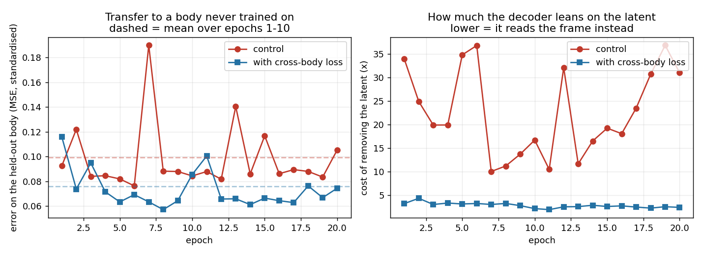
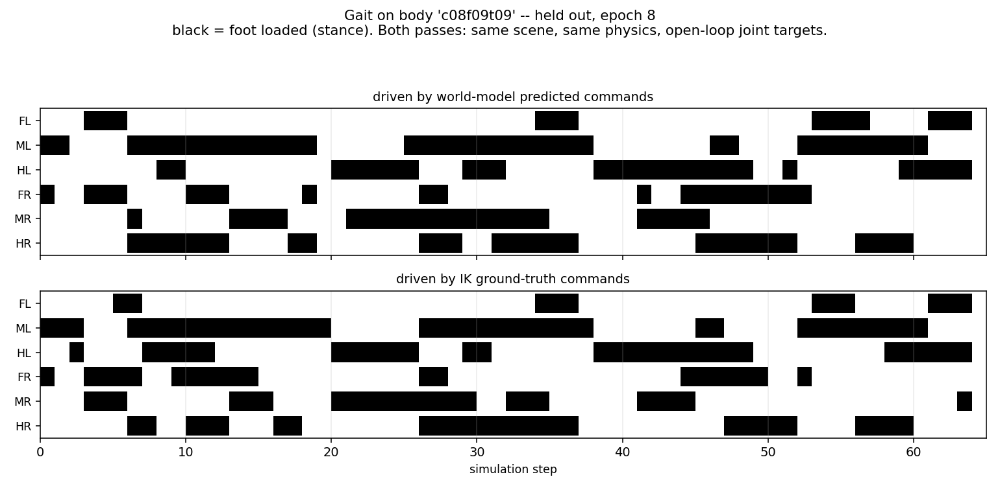
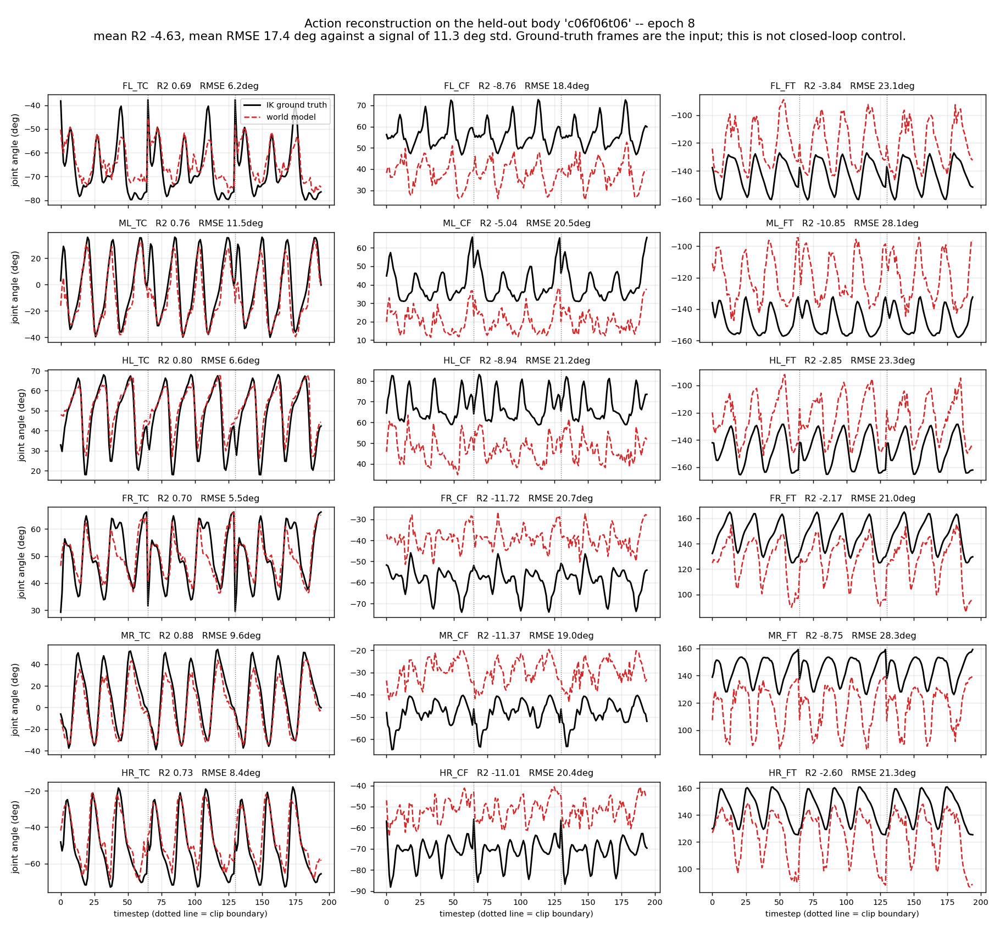

# Progress Update — Stage 1: Cross-Morphology Latent Action Model

Stick insect (*Medauroidea extradentata*), simulated in CoppeliaSim. Stage 1 only: one
18-DOF topology, several leg geometries. Stage 2 (Unitree B1 quadruped) appears only in
the closing questions.

Slides 1 to 6 are background already covered previously. The update starts at slide 7.

---

## Slide 1 — Title

**Cross-Morphology Locomotion via a Latent Action Model**

Stage 1 progress update: what was built, what it measures, what it found.

---

## Slide 2 — The question this stage answers

- A controller maps state to joint command. Change the leg lengths and the same
  numerical command produces a different physical result.
- Can a model learn a latent action `z` from video alone, with no morphology label and
  no kinematics supplied, that separates **what movement is happening** from **which
  body is doing it**, and then produce the correct body-specific joint command?
- This is cross-**morphology**, not cross-embodiment. All bodies share one 18-D joint
  space (6 legs x 3 joints); only the geometry differs.

---

## Slide 3 — Pipeline

```
frame_t  --[frozen V-JEPA2]-->  e_t  --+--[ITM]--> z_t --[FTM]--> ê_{t+1}
                                       |
                                       +--[Motion Decoder]--> â
```

- **Encoder**: V-JEPA2 ViT-g/16, 1B parameters, **frozen throughout**. Never trained on
  robots. Each frame encoded independently, so `e_t` cannot see the future.
- **Trained**: three small modules on top, about 5M parameters each.
- **Data**: CoppeliaSim, 20 Hz, fixed 256x256 side camera, joint targets in radians.

---

## Slide 4 — The three trained modules

| Module | Input | Output | Why it exists |
|---|---|---|---|
| **ITM** inverse transition | `e_t`, `e_{t+1}` | `z ∈ ℝ^64` | Given a transition, what action produced it? |
| **FTM** forward transition | `e_t`, `z` | `ê_{t+1}` | Does `z` let you predict the next frame? |
| **Motion Decoder** | `e_t`, `z` | `â ∈ ℝ^18` | Can `z` be turned back into an executable joint command? |

Note the Motion Decoder receives `e_t` but **never `e_{t+1}`**. Anything the second
frame contributes has to travel through `z`. This becomes important on slide 13.

---

## Slide 5 — Datasets

| Dataset | Bodies | Size |
|---|---|---|
| `ik_walk_100_framed` | 3, uniform leg scale (1.0, 0.75, 0.5) | 100 episodes x 3 bodies x 66 frames |
| `ik_walk_8body` | 7 usable, coxa/femur/tibia scaled independently | 30 clips per body |

- Commands come from **IK retargeting**: one shared foot trajectory in Cartesian space,
  solved separately per body. Same intended behaviour, genuinely different joint
  commands. Without this the transfer question would not be well posed.
- Behaviour: forward walking only.
- Held-out bodies are never trained on and are used only for evaluation.

---

## Slide 6 — How we measure

| Tool | What it does | What it tells us |
|---|---|---|
| **Linear probe** | Fit a ridge regression on training bodies, apply to a held-out body | Is the information present and readable, regardless of what the trained model does |
| **Swap test** | Give the decoder body A's frame with body B's latent | Does the decoder take the body from the frame or from the latent |
| **Input ablation** | Zero out `z`, or zero out `e_t`, and re-measure | Which input the decoder actually depends on |
| **Mixture fitting** | Find the best combination of training bodies' commands explaining the model's output | Is the model interpolating, or copying one body |
| **Physical replay** | Drive the predicted commands through the same physics | Do the commands actually walk, not just score well per joint |

All error figures below are RMSE in degrees on a held-out body, against joint commands
whose own spread is about 11.7 deg.

---

## Slide 7 — The encoder already knows the body's shape

- Fit a linear probe from the **frozen** encoder's output to the three segment scales,
  using five training bodies. Apply it to a body it has never seen.
- True scale (0.80, 0.90, 0.90). Predicted **(0.85, 0.94, 0.90)** — errors of 0.05, 0.04
  and 0.002 on a 0-to-1 scale.
- The probe has **4,227 parameters** and nothing supervises the encoder to do this.
- **This is the premise the whole project rests on**: vision carries body geometry in a
  form that is directly usable, and it generalises to a new body.

**Evidence** — linear probe on the frozen encoder, fitted on five bodies, applied to the
sixth:

| Body | | coxa pred / true | femur | tibia |
|---|---|---|---|---|
| c10f10t10 | train | 0.985 / 1.00 | 0.999 / 1.00 | 0.998 / 1.00 |
| c06f10t10 | train | 0.616 / 0.60 | 0.998 / 1.00 | 0.998 / 1.00 |
| c10f10t06 | train | 0.970 / 1.00 | 0.998 / 1.00 | 0.601 / 0.60 |
| c06f10t06 | train | 0.633 / 0.60 | 0.998 / 1.00 | 0.601 / 0.60 |
| c10f06t06 | train | 0.996 / 1.00 | 0.606 / 0.60 | 0.602 / 0.60 |
| **c08f09t09** | **held out** | **0.850 / 0.80** | **0.939 / 0.90** | **0.898 / 0.90** |
| c06f06t06 | held out, outside the range | 0.872 / 0.60 | 0.683 / 0.60 | 0.710 / 0.60 |

The last row is the warning: for a body **outside** the range the probe was fitted on, the
same readout is off by 0.11 to 0.27. **The encoder's generalisation is interpolation too.**
Slide 12 is what that costs.

---

## Slide 8 — The model we trained ignores it

- The Motion Decoder holds `e_t` in its hand. It does not read the geometry from it.
- **Swap test**: give the decoder body A's frame together with body B's latent. The two
  bodies' commands differ by 28.6 deg. The decoder answers with **body B's** command, to
  within 3.5 deg. It followed the latent and ignored the frame.
- Asked what geometry it thinks the held-out body has, its answer implies
  **(0.98, 0.98, 0.97)** against a true (0.80, 0.90, 0.90) — worse than the 4,227-parameter
  probe, with 5.2M trained parameters.


**Left panel**: where each stage of the pipeline places the held-out body on the axis
between two training bodies. 0.30-0.36 is correct. The input frame and the encoder are at
0.500 (they see it correctly); the latent is at 0.335 (correct); the decoder's output
collapses to 0.188 — **it slides the answer back toward a training body.**

**Right panel**: more trained capacity gives lower error on the bodies it saw (0.63 deg)
and higher error on the one it did not (11.04 deg). The 29k-parameter ridge probe is the
only predictor that stays below the no-learning baseline on both.

- Reading: the decoder learned to **recognise which of the five training bodies it is
  looking at** and recall that body's commands. There is no entry for a body it has not
  seen.

---

## Slide 9 — Four changes to the model that did not help

| What we changed | Result |
|---|---|
| Rescale the command target per body | No change |
| Shrink the decoder head, to force it to generalise | 1.4-2.1x worse |
| Remove body identity from `z` by adversarial training | Decoder used the frame 2x more, transfer 1.2x **worse** |
| Hand the decoder a pooled global view of the frame | Used the frame 7.6x **less** |

- Capacity, access, and the contents of the latent were each ruled out.
- What remained was the **objective**: nothing in the loss ever required the model to
  read geometry from pixels. Recognising the body was always cheaper and scored the same.

---

## Slide 10 — What worked: change what the loss asks for

**The idea.** Every body walks the same expert episodes, so at a given timestep two
bodies share the intent and differ only in geometry. So: take body A's latent, decode it
against body **B's** frame, and require body **B's** command.

Reading the body out of the latent now gives the wrong answer by construction. The only
way to be right is to read the geometry from the frame.

| Held-out body, inside the training range | Before | After |
|---|---|---|
| Error, deg | 3.57 | **2.91** |
| Copy the nearest training body (baseline) | 3.47 | 3.47 |
| Share of the latent explained by body identity | 8.8% | **1.2%** |
| Share explained by gait phase | 64.5% | **88.7%** |



**Left**: error on the held-out body, per epoch. Blue is below red almost everywhere and
far steadier — the control swings between 0.076 and 0.190 across epochs, the cross-body
run stays between 0.057 and 0.116. **Right**: how much the decoder depends on the latent,
which falls from 10-37x to 2-4x. It stopped needing the latent to tell it which body it
was looking at, because it now reads that from the frame.

- First configuration to beat the copy-nearest baseline, and the first that does not get
  worse as training continues.
- The swap test fully reverses: the decoder now follows the **frame**.
- The latent was not emptied, it was **cleaned**: it still encodes the gait as well as
  before, but has almost stopped encoding which body it is.

---

## Slide 11 — The commands actually walk

Predicted commands driven open-loop through the same physics used to collect the data,
on a body never trained on.

| | Ground truth (IK) | Control | With the cross-body loss |
|---|---|---|---|
| Forward distance | 0.60 m | 93% of it | 89% of it |
| Mean heading deviation | 6.9-7.2 deg | 3.7 deg | 6.8 deg |
| Commands outside the body's own joint range | 0% | 7.7% | **5.4%** |
| Worst such excursion | 0 deg | 20.2 deg | **5.5 deg** |

- Both models walk. Neither veers more than the IK reference itself does.
- The cross-body loss improves the **quality of the pose**, not the distance: it stops
  commanding leg configurations the body never actually adopts, which is what makes legs
  fold once error accumulates.


Black is stance, white is swing, over 65 simulation steps. The top block is driven by the
predicted commands, the bottom by the IK ground truth. The tripod alternation and the
stance durations line up; duty-factor error averaged over six legs and three clips is
0.044 with the cross-body loss against 0.076 for the control.

Video, side by side with distance travelled stamped on each frame:
`results/wm/gait/replay_m3d_cross_epoch008_c08f09t09_clip0.mp4`

- Distance was fixed by **having more training bodies**, not by the loss: on the earlier
  two-body dataset the same replay covered less than half the required distance.

---

## Slide 12 — The limit: it interpolates, it does not measure

Tested on a body **outside** the range of the training bodies: every segment scaled to
0.6. Because all three segments shrank together, this body is geometrically similar to a
training body, and **its correct joint commands are identical to that body's, to 0.07 deg.**
The right answer is to copy a body the model has already seen.

| Predictor | Error, deg |
|---|---|
| Copy the correct training body (the right answer) | 0.07 |
| Just predict this body's average pose | 12.7 |
| Control model | 13.9 |
| With the cross-body loss | 18.8 |

- Both models lose to the trivial baseline, and the cross-body loss is **worse**.
- Why: the model reads **absolute segment size** off the image — and reads it accurately.
  But joint commands depend only on the **proportions** between segments. Everything
  shrank together, so no command change was needed, and the model applied one anyway.


Red is the model, black is ground truth, over three clips. The fore-aft swing joints (TC,
left column) still track. The joints that set leg lift and extension (CF and FT) are
inverted or flat — **12 of 18 joints have negative R-squared**, meaning worse than
predicting a constant.

| Implied segment scale | coxa | femur | tibia |
|---|---|---|---|
| Correct answer in command space | 1.00 | 1.00 | 1.00 |
| What the model implies | 0.91 | 0.69 | 0.67 |
| The body's true geometry | 0.60 | 0.60 | 0.60 |

It read the shortened femur and tibia off the image, and read them **accurately**. Then it
applied the command change that shortening those segments *relative to the others* would
require. Nothing was relative here.

- No training body scales all three segments together, so that direction was never
  demonstrated. **The model learned to interpolate between the bodies it saw, not to
  measure geometry.**

---

## Slide 13 — Two structural facts found last

**One. The answer was already visible in the decoder's own input.**

The data collector applies a command, steps the simulator, and only then captures the
frame. So the frame is the *result* of that command, and the command was being asked for
from a frame that already shows it. The latent never had to carry anything.

- Replace the second frame given to the ITM with a copy of the first, removing the
  transition entirely: costs only **11-19%**.
- Running the transition **backwards** costs *more* than deleting it — the opposite of
  what a latent encoding direction of motion would do.
- Corrected, and the corrected target is now the default.

**Two. One frame nearly determines the command at any horizon.**

| Predict, from a single frame | now | 8 frames ahead | 32 frames ahead |
|---|---|---|---|
| Error, deg (signal spread 11.3 deg) | 4.6 | 5.2 | **4.5** |

- Predicting 32 frames ahead is as accurate as predicting the present, because the gait
  is periodic with a cycle near 22 frames and one frame fixes the phase.
- Six coordinated legs remove the ambiguity a single leg would have: one frame already
  identifies which feet are swinging with 81.5% accuracy, against 50% by chance.
- Consequence: the joint command cannot be the place the latent earns its keep. Removing the
  forward-prediction term entirely leaves the action reconstruction unchanged.
- **This bounds the action-decoding path only.** Slide 14 measures the forward model itself.

---

## Slide 14 — The forward model was being judged on the wrong task

Every measurement above asks whether forward prediction helps **reconstruct the action**. It
does not. That is not what a forward model is for.

Closing it on its own output and rolling it forward, with the true latents supplied so the
module is isolated, on the held-out body, 162 rollouts:

| steps ahead | forward model | hold the frame still | constant velocity | **beats holding still by** |
|---|---|---|---|---|
| 1 | 1.53 | 2.11 | 5.78 | **1.38x** |
| 3 | 2.07 | 3.05 | 27.6 | **1.47x** |
| 5 | 2.54 | 3.57 | 66.0 | **1.41x** |
| 10 | 3.63 | 4.36 | 236.5 | **1.20x** |

- It beats a frozen world at **every horizon out to ten steps**, and beats constant velocity by
  two orders of magnitude. **The forward model can roll the world forward.**
- Reading the source paper confirms the mistake was ours: in LAC-WM the Motion Decoder is an
  **auxiliary regulariser**. The deployed system predicts future embeddings, rolls them eight
  steps, and picks actions by comparing predicted futures to a goal image. The action decoder is
  not the system's output. **We had made the auxiliary term the whole evaluation.**
- Honest limits: holding still is a weak baseline, 1.2-1.5x over it is real but modest, and the
  margin decays with horizon.

Speaker note: this is why the earlier slides say "the command can be read off one frame" rather
than "the world model does nothing". Those are different claims and only the first is supported.

---

## Slide 15 — Where this leaves each piece

| Piece | Status |
|---|---|
| Frozen encoder | Carries body geometry in a directly readable, generalising form. Holds. |
| Latent `z` | With the cross-body loss, a body-independent gait representation: 88.7% gait, 1.2% body. |
| Motion Decoder | Transfers within the range of bodies it saw. Does not extrapolate beyond it, and we can say precisely why. |
| Forward model | Does not help action reconstruction, but **does roll the world forward**: 1.2-1.5x better than a frozen world out to ten steps. It was being measured against a task the method never assigns it. |
| Physical replay | Commands walk, stay inside the body's joint range, and do not veer more than the IK reference. |

**The through-line**: the information transfer needs is present in vision and readable.
Every failure we found came from the model not being *required* to use it, and from the
data not covering the direction being asked about. Both are now measured, not guessed.

---

## Slide 16 — Two questions for the professor

**1. Our evaluation was aimed at the wrong module. What should Stage 2 be scored on?**

We measured the system by how accurately it reconstructs joint commands. The source method does
not: it rolls the world model forward and selects actions by comparing imagined futures against a
goal image. Our forward model does roll forward usefully, and we only found that out by testing it
directly.

- Should Stage 2's headline metric be **rollout quality and planning success** rather than
  per-joint reconstruction error?
- The source method also groups actions into **five-step chunks**, stating this improves world
  model learning; we use single steps. Worth adopting?
- One structural fact remains regardless: our data is forward walking at one speed, and we
  measured that a single frame predicts the joint command at every horizon out to 32 frames.
  Is it worth collecting varying speed, turning, or disturbance so the imagined futures are
  genuinely uncertain?

**2. How should cross-embodiment training pairs be defined for Stage 2?**

The mechanism that fixed Stage 1 decodes one body's latent against another body's frame,
supervised by that body's command at the same moment. It is well defined only because
every insect body walks identical expert episodes, so pairing is exact.

The hexapod and B1 share no episodes. Candidate substitutes are pairing by matched body
speed, or by gait phase estimated from the image, and both are inexact — and a mis-paired
frame is a **wrong label**, not just a noisy one. There is also no physically correct
answer to what "the same phase" means between a six-leg tripod and a four-leg trot.

Reading the source paper changes the shape of this question. **It has no cross-embodiment pairing
term at all** — the shared latent space is claimed to emerge from sharing the model weights across
embodiments, evidenced by overlapping UMAP clusters and one qualitative example. So the pairing
mechanism is **our addition**, and Stage 2 can follow the paper without it.

The question is therefore whether to. Without it, Stage 1's failure mode — the latent becoming a
code for which body it is — is what we measured happening. With it, we need a pairing definition
that does not exist yet. Our measurements of body-independence are quantitative where the paper's
are not, which is an argument for keeping the term and solving the pairing.

Also worth noting: the paper's transfer is **not zero-shot**. It is a three-stage LoRA finetune on
7,265 trajectories of the target robot. The sample-efficiency framing is the comparable claim.
