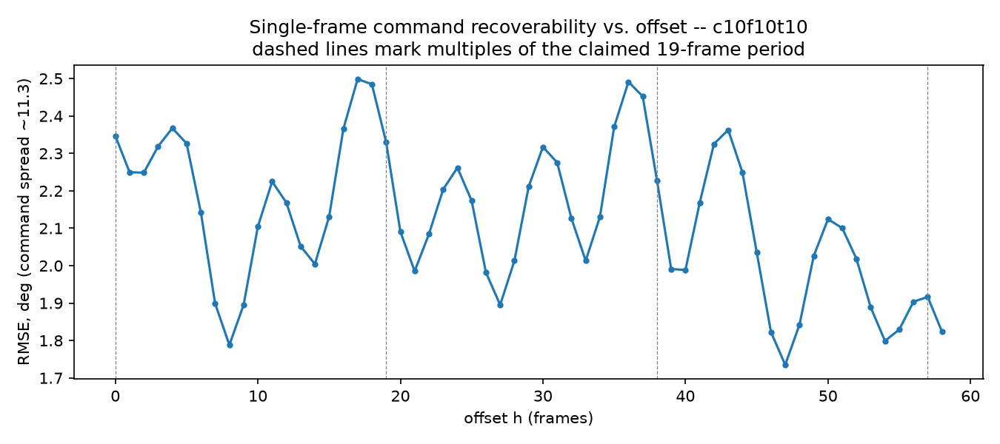
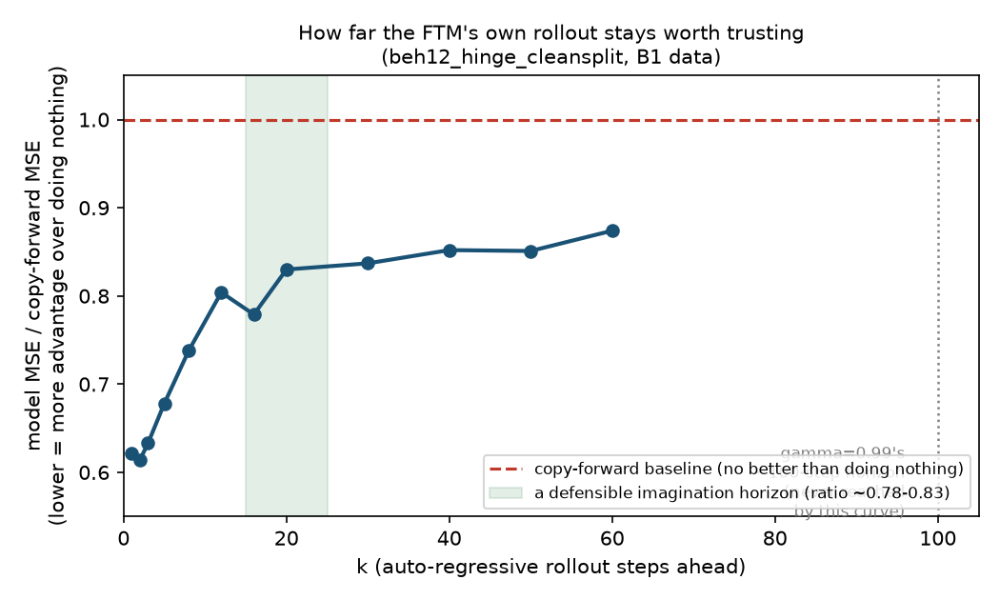
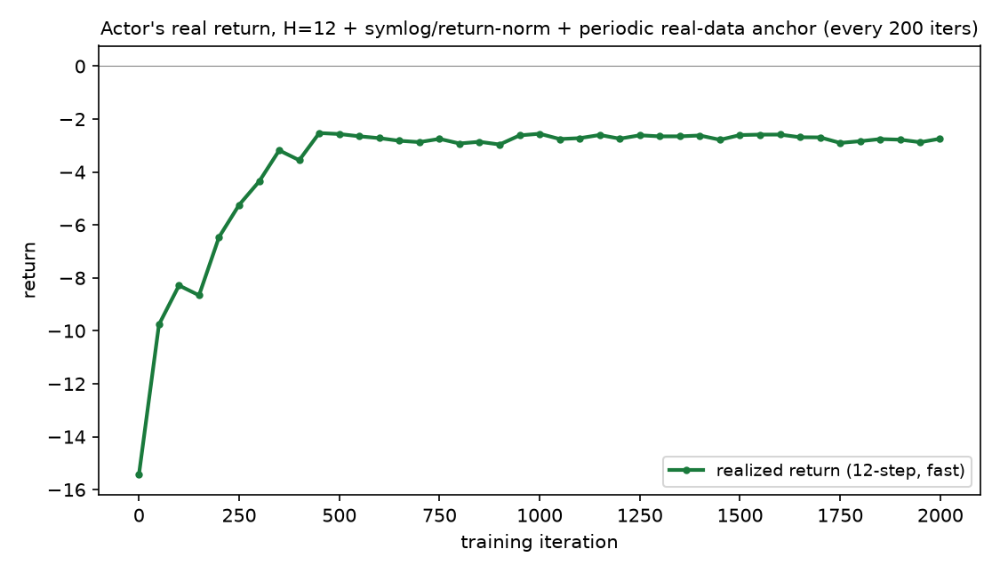
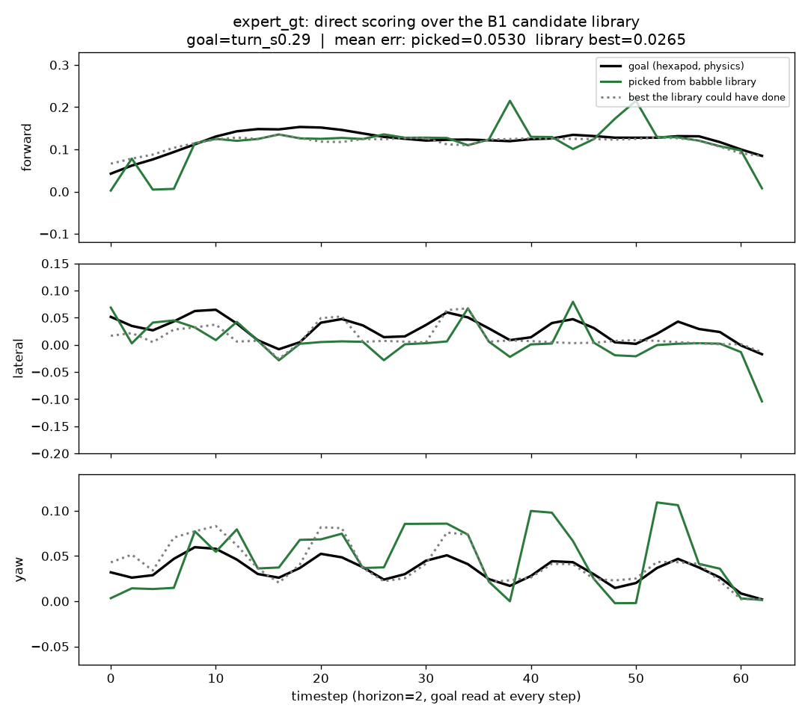
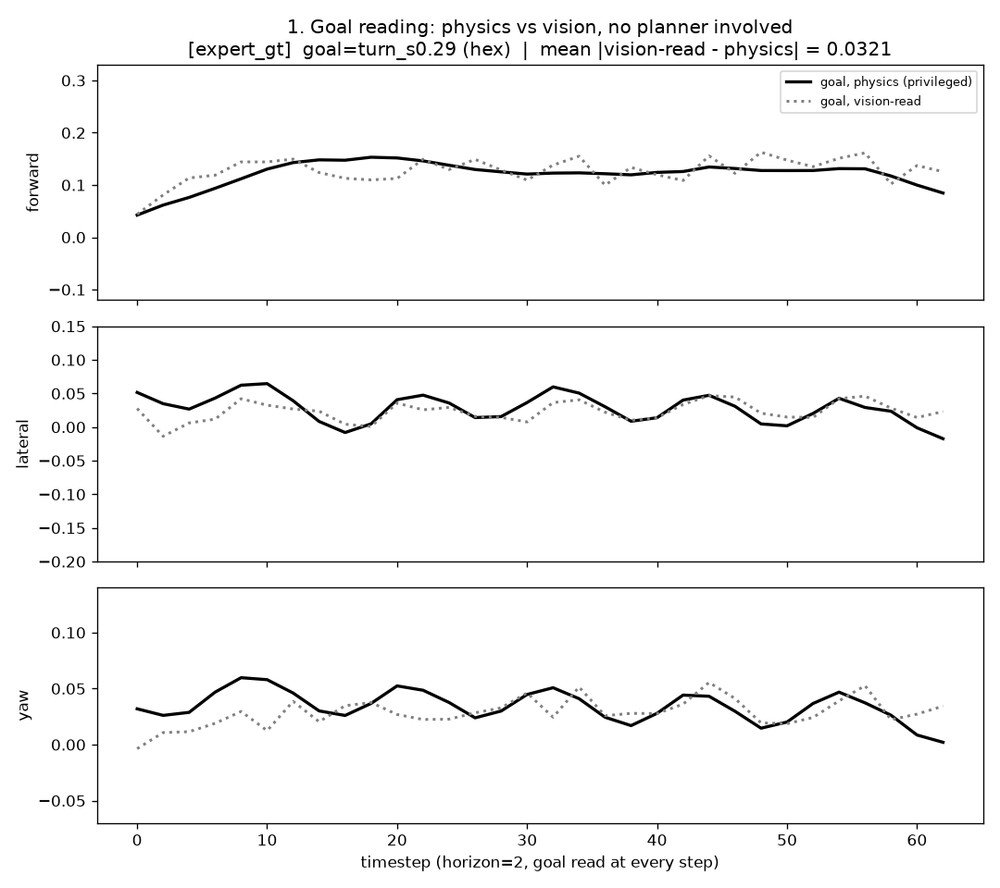
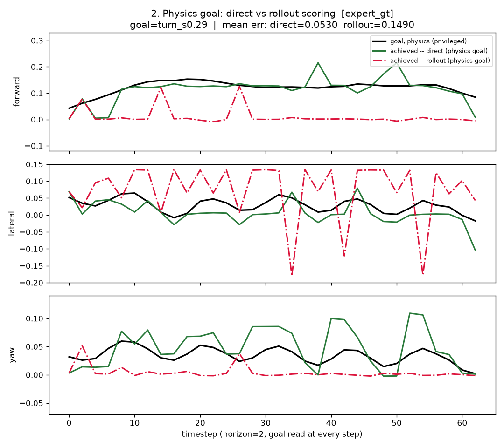
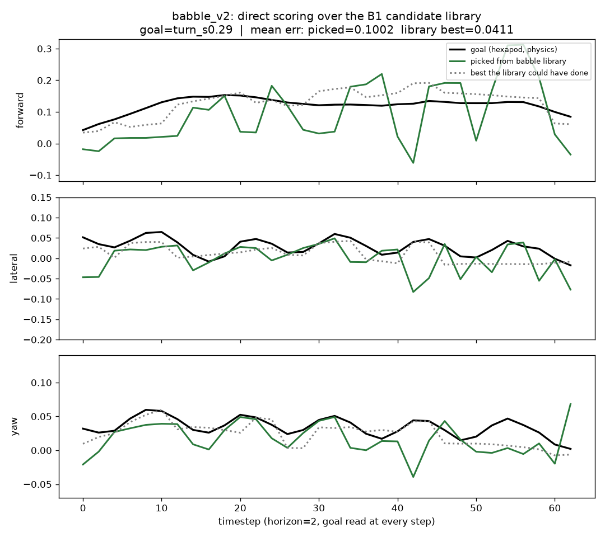
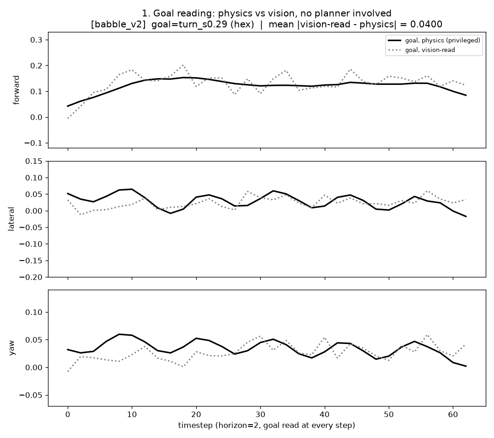
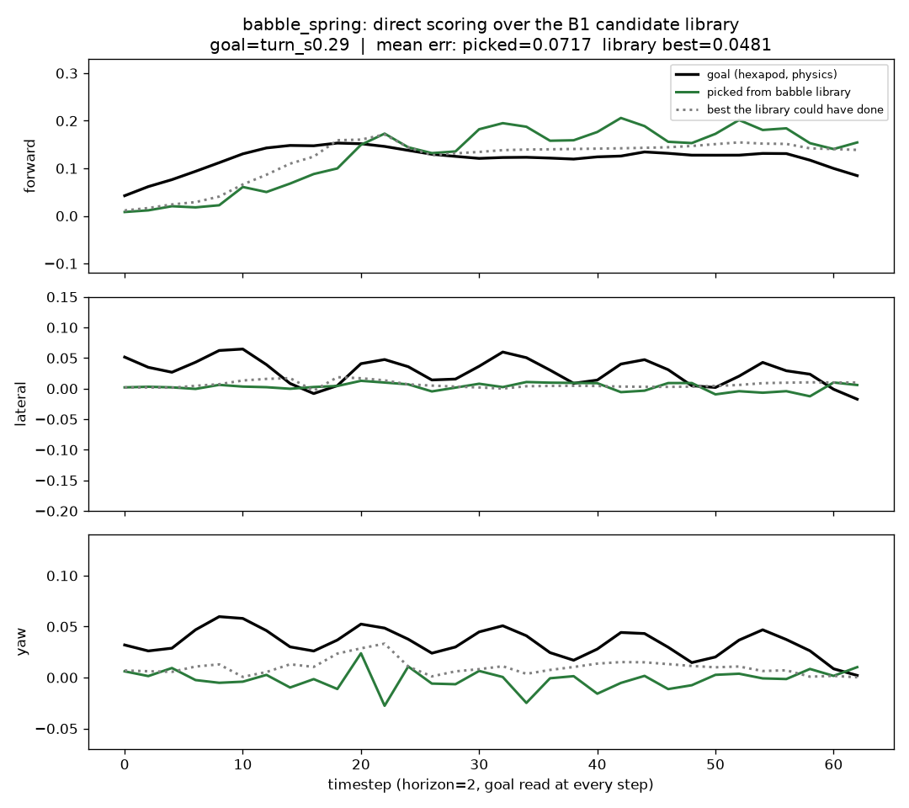
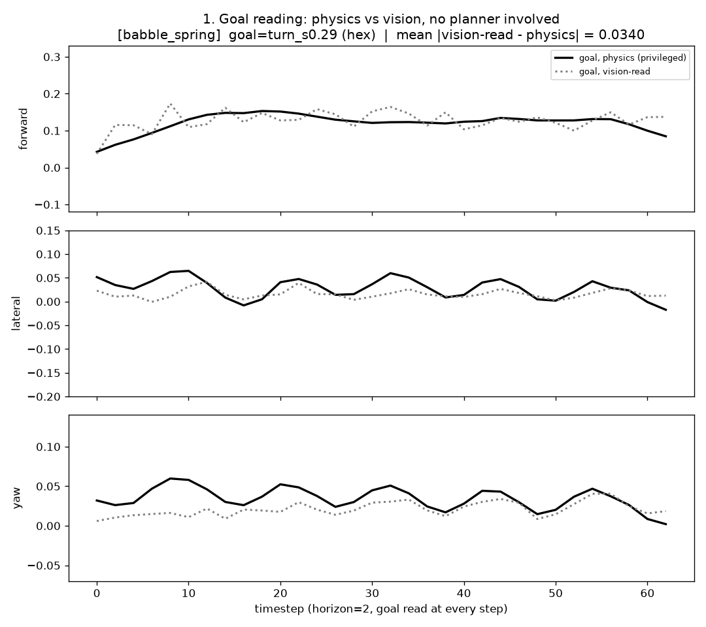

# Progress Update — Cross-Morphology and Cross-Embodiment Latent Action Models

Stick insect (*Medauroidea extradentata*) and Unitree B1, simulated in CoppeliaSim.

> **How to read this deck — one throughline, three stages.** Stage 1 (Sections 1–6) builds the
> pipeline and forces a shared latent objective on a controlled testbed where every body shares one
> joint space. Stage 2 (Sections 7–10, Slides 11–15) extends that objective to two bodies whose
> action spaces share nothing, validates that the shared coordinate transfers, and then asks the
> question that leaves open: does the resulting world model actually *use* the action it's given?
> Two independent fixes answer it — one on the training objective (Slide 15), one on the camera
> (Slides 13–14) — and both stay in, since neither one subsumes the other. Stage 3 (Slide 16 on) is
> where the resulting model stands today: a closed-loop test of what those fixes bought, and two
> real controllers built on top of it.

## Contents

| stage | # | jump to |
|---|---|---|
| Stage 1 | 1 | [Background — a locomotion controller is fitted to one body](#1-background-—-a-locomotion-controller-is-fitted-to-one-body) |
| Stage 1 | 2 | [Background — idea forming from the literature](#2-background-—-idea-forming-from-the-literature) |
| Stage 1 | 3 | [Methodology — pretraining pipeline](#3-methodology-—-pretraining-pipeline) |
| Stage 1 | 4 | [Exp 1.1 — decoder reads the frame or recalls the nearest body?](#4-experiment-11-does-the-decoder-read-the-frame-or-recall-the-nearest-training-body) |
| Stage 1 | 5 | [Exp 1.2 — transfer inside vs. outside the training geometry's span](#5-experiment-12-transfer-inside-vs-outside-the-training-geometrys-span) |
| Stage 1 | 6 | [Exp 1.3 — how much of the command comes from the transition](#6-experiment-13-how-much-of-the-command-comes-from-the-transition-not-just-the-pose) |
| Stage 2 | 7 | [What crossing embodiments with vision requires](#7-methodology-—-stage-2-what-crossing-embodiments-with-vision-requires) |
| Stage 2 | 8 | [Exp 2.1a — does a shared-coordinate loss need to exist at all?](#8-experiment-21a-does-a-shared-coordinate-loss-need-to-exist-at-all) |
| Stage 2 | 10 | [Exp 2.2 — zero-shot vs. staged adaptation to a genuinely different robot](#10-experiment-22-zero-shot-vs-staged-adaptation-to-a-genuinely-different-robot) |
| Stage 2 | S11 | [Motivation for Exp 2.4 — pose determines the future](#slide-11-—-motivation-for-experiment-24-pose-determines-the-future-so-the-action-is-redundant) |
| Stage 2 | S12 | [Motivation for Exp 2.4, cont. — the principle explains published results](#slide-12-—-motivation-for-experiment-24-continued-the-principle-explains-results-that-are-already-published) |
| Stage 2 | S13 | [Exp 2.4 — move the camera onto the body](#slide-13-—-experiment-24-the-second-independent-fix-—-move-the-camera-onto-the-body) |
| Stage 2 | S14 | [Exp 2.4, cont. — what egocentric fixed, and what it didn't](#slide-14-—-experiment-24-continued-what-egocentric-actually-fixed-and-what-it-didnt) |
| Stage 2 | S15 | [Exp 2.3 — context collapse, a second independent fix](#slide-15-—-experiment-23-context-collapse-—-a-second-independent-fix-found-later) |
| **Stage 3** | — | [Closed-loop control and real controllers (intro)](#stage-3-—-closed-loop-control-and-real-controllers) |
| Stage 3 | S16 | [Exp 3.1 — imagination-RL: the wall is the rollout](#slide-16-—-experiment-31-imagination-rl-—-the-wall-is-the-rollout) |
| Stage 3 | S18 | [Exp 3.3 — scoring in the shared coordinate vs. raw frame distance](#slide-18-—-experiment-33-scoring-in-the-shared-coordinate-vs-raw-frame-distance) |
| Stage 3 | S19 | [Controller vs. what we test, and what Froude is](#slide-19-—-controller-vs-what-we-test-and-what-froude-is) |
| Stage 3 | S21 | [Exp 3.4 — the 2×2: which half is broken](#slide-21-—-experiment-34-the-2×2-—-which-half-is-broken-goal-source-or-scoring-mechanism) |
| Stage 3 | S22 | [Exp 3.5 — `z` is a lossy bottleneck](#slide-22-—-experiment-35-z-is-a-lossy-bottleneck-—-the-shared-coordinate-lives-downstream-of-it-not-in-it) |
| Stage 3 | S23 | [Plan: main plan, continuing plan, plan B](#slide-23-—-plan-main-plan-continuing-plan-plan-b) |


---

## 1. Background — A locomotion controller is fitted to one body

The analogy this thesis attempts is a real one in psychology: **Social Learning Theory**, vicarious
learning (Albert Bandura, 1977) — the acquisition of a behaviour by observing another agent perform
it, with no direct instruction. A held-out body's controller, with no prior knowledge of the
behaviour required of it, is informed only by video of a different body's behaviour. It does not
resemble that body and has never itself performed the behaviour, with no direct instruction and no
kinematic account of either body supplied to bridge them.

- The behaviour crosses through what is *observed*, not by telling the model about the bodies
  involved.
- **The problem.** A locomotion controller maps state to joint commands. With a morphology change,
  the same numerical command can produce a different physical result: the robot stumbles, stands at
  a different height, or does not move at all. Every body needs its own commands for the same
  behaviour.
- **The contribution.** A world model that plans toward a goal defined in a coordinate shared across
  bodies whose action spaces have nothing in common — no kinematic model, no retargeting, no
  existing controller on the target robot. The only thing the two robots share is what a camera
  sees.
- **The gap, stated against what exists:**

```
                          needs a kinematic model
                                    ▲
          joint-tokenised universal  │   retargeting-based cross-morphology
          controllers (graph /       │   controllers (body description + IK)
          transformer over the tree) │
      ────────────────────────────────┼────────────────────────────────▶  crosses leg count
                                    │
          morphology-parameter       │   ███ THIS WORK ███
          quadruped world models     │   video only, eighteen joints ↔ twelve
                                    │
                          needs no kinematics
```

Everything that crosses leg count needs a body model. Everything that needs no body model doesn't
cross leg count. The lower-right quadrant is empty, and locomotion has no end-effector pose to
retreat to the way manipulation does: eighteen and twelve joint targets share no dimension.

> **บทพูด (TH).** ปัญหาคือ policy ที่เทรนให้หุ่นตัวหนึ่งใช้กับหุ่นตัวอื่นไม่ได้เลย เปลี่ยนความยาวขา
> เปลี่ยนโครงกระดูก ต้องเทรนใหม่ทุกครั้ง แนวคิดที่ตรงที่สุดมีชื่อในจิตวิทยาอยู่แล้วคือ **vicarious
> learning** — เรียนรู้พฤติกรรมจากการ**ดู**ตัวอื่นทำ ไม่ต้องมีใครสอนตรง ๆ ไม่ต้องเคยทำเองมาก่อน และร่างไม่
> จำเป็นต้องเหมือนกัน **โจทย์**: หุ่นคนละร่างสั่งคำสั่งตัวเลขเดียวกันแล้วได้ผลจริงต่างกัน ต้องมีของตัวเอง
> **สิ่งที่เราเสนอ**: world model ที่วางแผนผ่านพิกัดร่วม ไม่ต้อง kinematic model ไม่ retarget ไม่ต้องมี
> controller อยู่แล้วบนหุ่นเป้าหมาย — สิ่งเดียวที่สองตัวแชร์กันคือสิ่งที่กล้องเห็น ดูแผนภาพ: ช่องขวาล่าง
> (ข้ามขาได้ + ไม่ต้อง kinematics) ว่างอยู่ เพราะการเดินไม่มีตำแหน่งปลายมือให้หนีไปแบบ manipulation

### Requirements

| # | requirement | why |
|---|---|---|
| R1 | the shared quantity must mean the same physical thing on both bodies without a hand-built correspondence | otherwise it isn't cross-embodiment, it's relabelling |
| R2 | no CAD/URDF, no kinematic tree, no per-robot adapter fitted from that robot's own proprioception | this is the exact thing every existing route (Section 2) supplies and this thesis withholds |
| R3 | readable from **egocentric video alone** at deployment time | proprioception-free is the whole point — an animal or damaged robot has no other channel |
| R4 | the visual encoder stays frozen | isolates the claim to what a frozen, off-the-shelf video model already carries |
| R5 | the representation must be shown to be *used* by the forward model, not just decodable from it | Experiment 2.3/2.4 exist because R5 is not automatically satisfied by R1–R4 |

### Scope and Assumptions

- Entirely simulation: hexapod in CoppeliaSim/Bullet, Unitree B1 in MuJoCo. No sim-to-real.
- Two-stage design: Stage 1 (hexapod leg-length variants, one joint space) is a **controlled
  prerequisite**, not the claim — it cannot show vision beats proprioception, because all variants
  share one 18-D joint space. Stage 2 (hexapod × B1, disjoint 18-D/12-D spaces) is where the claim
  is actually tested.
- Camera is egocentric by design decision, not accident — and that decision is itself one of the
  measured results (Experiment 2.4), not an assumption taken for granted going in.
- Behaviours are drawn from a **curated library** (forward/turn/strafe at several speeds), not an
  unconstrained babble space, for Stages 1–2; babble is a separate, later extension (Slide 25).
- **Explicitly not claimed:** real-robot transfer, zero-shot cross-embodiment, reliable multi-step
  closed-loop control, a scaling law over many embodiments.

---

## 2. Background — Idea forming from the literature

- **Hu, Chen, and Lipson (2025)**, *Egocentric Visual Self-Modeling for Autonomous Robot Dynamics
  Prediction and Adaptation*. They learn a task-agnostic visual self-model for a legged robot from a
  single egocentric camera and random motor babbling, with no prior knowledge of the robot's
  morphology, kinematics, or task, and use it to plan locomotion and even to detect and recover from
  physical damage. Their claim is that the body description was never necessary. Their self-model is
  fitted to one robot at a time: each body is babbled and modelled separately, there is no action
  representation shared between bodies, and nothing is ever transferred from one body to another.
  **Extending that premise across embodiments is what this thesis attempts.**
- **Huang et al., *Cross-Embodiment Robot Foundation World Models with Latent Actions*, ICML 2026.**
  Different robots have different action formats, so they discard explicit action labels as the
  conditioning signal and define a latent action instead — the world model is conditioned on `z`
  rather than on any robot's native command vector. One latent space covers several embodiments, and
  adding embodiments *improves* it rather than fragmenting it. **This is the piece we adapt into
  locomotion.** Their setting is manipulation, where every embodiment already shares one task space
  (end-effector pose); locomotion has no such shared space to condition on, which is exactly the gap
  Section 1 draws.

> **บทพูด (TH).** สองงานนี้เป็นจุดเริ่ม **Hu et al. (2025)** พิสูจน์ว่าไม่ต้องรู้ kinematics เลยก็ควบคุม
> ได้ ด้วยแค่ babble กับกล้องตัวเดียว แต่ทำทีละตัว ไม่เคยแชร์อะไรข้ามหุ่น — งานนี้เอาแนวคิดนั้นไปทดสอบข้ามหุ่น
> **Huang et al. (ICML 2026)** เสนอ latent action แทนคำสั่งดิบของแต่ละหุ่น เพราะหุ่นแต่ละตัวมี action
> format ไม่เหมือนกัน ใช้ latent เดียวครอบหลายร่างได้ และยิ่งเพิ่มร่างยิ่งดีขึ้น — แต่ของเขาคือ manipulation
> ที่มี task space ร่วมอยู่แล้ว (ตำแหน่งปลายมือ) การเดินไม่มีของแบบนั้นให้ยืม นี่คือช่องว่างที่ section 1 พูดถึง

---

## 3. Methodology — Pretraining pipeline

```
   frame ──▶ [ frozen visual encoder ] ──▶ observation
                                               │
                            observation pair ──┴──▶ [ inverse model ] ──▶ latent action
                                                                              │
            observation + latent action ──▶ [ forward model  ] ──▶ predicted next observation
            observation + latent action ──▶ [ command decoder] ──▶ joint command
```

- **Encoder:** a one-billion-parameter video model, frozen throughout, never trained on robots. The
  three modules on top of it are about five million parameters each.
- **Inverse model:** given a transition, what action produced it? — this is where the latent action
  comes from.
- **Forward model:** does the latent action let us predict what happens next?
- **Command decoder:** can the latent action be turned back into an executable joint command? It
  never sees the second frame — whatever the transition contributes has to pass through the 64-number
  latent, and that bottleneck is the whole design.
- **Training signal:** predict the next observation, and recover the real joint command, nominally
  equal weight — but the two losses differ in scale by two orders of magnitude, so next-observation
  prediction takes roughly 99% of the gradient in practice. The term meant to ground the latent in
  real commands runs on the remainder.

> **บทพูด (TH).** encoder เป็นโมเดลวิดีโอพันล้านพารามิเตอร์ **แช่แข็งไว้ ไม่เคยเทรนกับหุ่นยนต์เลย** เทรนแค่
> สามโมดูลเล็ก ๆ บนมัน: inverse model ถามว่า "เปลี่ยนจากภาพนี้ไปภาพนั้น เกิดจากคำสั่งอะไร", forward model
> ถามว่า "คำสั่งที่ถอดได้ ทำนายอนาคตได้ไหม", command decoder ถามว่า "แปลงกลับเป็นคำสั่งข้อต่อที่สั่งได้จริง
> ไหม" — decoder ไม่เคยเห็นเฟรมที่สอง ต้องลอดผ่าน latent 64 ตัวเท่านั้น และ loss สองก้อนต่างสเกลกันร้อยเท่า
> ทำให้การทำนายภาพกินเกรเดียนต์ไปราว 99%

---


## 4. Experiment 1.1: does the decoder read the frame, or recall the nearest training body?

**Assumption** : If the latent truly separates movement from body, a
held-out body's commands should come from its own geometry, not a memorized nearby body. 

**Input→Output** : body A's frame + body B's latent (a forced conflict); output: predicted joint command against body B's true command. 

**Answers** : **Objective 1** — establishes the fix the shared coordinate
needs before it can be trusted at all.

**Dataset** : 9 six-legged walkers (scaling coxa/femur/tibia independently), 30 clips
each (270 clips total); 2 bodies dropped for stumbling. **5 bodies train** (last 1 of 30 clips per
body held out internally as validation); **`c08f09t09` (1 body, all 30 clips) is held out
entirely** as the unseen-body test — it lies inside the training bodies' convex hull (Experiment
1.2 also runs a second held-out body, `c06f06t06`, that lies outside it).
```
**Commands are retargeted.** Data used in training takes one foot trajectory in Cartesian space,
solved separately for each body by inverse kinematics: same intended behaviour, genuinely different
joint numbers.
```

**Behaviour:** forward walking, one speed.

**The hypothesis.** If the latent truly separates movement from body, then a body never seen in
training should receive commands appropriate to its own geometry — not the commands of whichever
training body it most resembles.

| held-out c08f09t09 | coxa | femur | tibia |
|---|---|---|---|
| the truth | 0.80 | 0.90 | 0.90 |
| probe on the visual encoder (4,227 params) | 0.84 | 0.91 | 0.91 |
| the motion decoder (5.2M params) | 0.62 | 0.96 | 0.96 |

The probe lands close everywhere; the decoder implies a coxa **22% shorter than the body actually
has**. The bigger model is the one that misreads it.

**Follow-up experiment: is the decoder reading the frame, or recalling the latent's nearest body?**

Give the motion decoder body A's frame together with body B's latent —  Differ from Body A frame by 21°. The decoder answers with body B's command, to within 6°: it follows the latent and ignores the
frame. 

Expected result : the image should carry which body, the latent should carry what movement.
and it would fail outright, because the model never learned the frame-action relationship that idea depends on.

**The fix is therefore in the objective:** every body
shares the same intent and differs only in geometry, so add one loss term that makes that explicit —
take body A's latent, show the decoder body B's frame, and require body B's command (`A's latent,
B's frame, B's command`).

| held-out body test | without the term | with it |
|---|---|---|
| command error | 3.67° | 3.44° |
| image's worth to the decoder | 0.4× | 9.6× |
| movement's share of the latent | 82% | 93% |
| body identity's share of the latent | 12% | 3% |

**Finding** The decoder was recalling the nearest training body, not reading
geometry; the cross-body loss term fixes it, validated in-distribution. 

**Remaining gap** whether the fix holds outside the geometry the training data spans — bridges directly to Experiment 1.2.

> **บทพูด (TH).** หุ่นทุกตัวมีขา 6 ขา 18 ข้อต่อเหมือนกัน ต่างกันแค่ความยาวขา คำสั่งได้จากแก้ IK จาก
> รอยเท้าเดียวกัน — เจตนาเดียวกัน ตัวเลขคำสั่งต่างกันจริง **probe เล็กจิ๋วอ่านความยาวขาของหุ่นที่ไม่เคยเห็นได้
> แม่น แต่ decoder ใหญ่กว่าพันเท่าอ่านผิด** (coxa สั้นกว่าจริง 22%) swap test บอกสาเหตุ: สลับ latent คนละตัว
> มันตอบตาม latent ไม่สนใจภาพเลย — **มันจำหุ่นที่ใกล้ที่สุดในชุดเทรนได้ ไม่ได้อ่านรูปร่างจากภาพ** ลองแก้ที่
> โมเดลมาสี่ทางแล้วไม่ได้ผล เพราะปัญหาไม่ใช่ความสามารถ แต่ loss ไม่เคยบังคับให้อ่านรูปร่างจากภาพเลย — เพิ่ม
> loss term เดียว (latent ของ A คู่กับภาพของ B ต้องตอบคำสั่งของ B) ภาพมีค่าต่อ decoder เพิ่มขึ้น 22 เท่า
> และ latent สะอาดขึ้น (การเคลื่อนไหว 82→93%, ตัวตนของร่าง 12→3%)

---

## 5. Experiment 1.2: transfer inside vs. outside the training geometry's span

**Assumption** : Transfer only holds within the geometric span the training
data actually covers — extrapolation is not assumed to work.

**Input→Output** : Input: a held-out body's frame; output:
predicted joint command (R² against ground truth), measured inside vs. outside the training span.. 

**Answers** : Scopes **Objective 1**  states the condition under which the coordinate is learnable at all.


| | ground truth (IK) | control | with the cross-body loss |
|---|---|---|---|
| forward distance | 100% | 85% | 90% |
| heading deviation | 0° | 11.8° | 5.5° |
| worst joint-limit excursion | 0° | 8.2° | 3.9° |

Inside the geometry the training set spans, the predicted commands actually walk, driven open-loop
through the same physics used to collect the data, on a body never trained on.

| same model | error | R² |
|---|---|---|
| a body with geometry inside the training span | 3.4° | 0.81 |
| a body with femur/tibia ratio outside the training span | 13.4° | −0.34 |

Outside that span, the same weights fail — proved, not assumed.

**Test:** same budget, same held-out body, but the training set now contains bodies whose segments
don't move together the way every other training body's do.

| same model | coxa | femur | tibia |
|---|---|---|---|
| ground truth | 1.00 | 1.00 | 0.80 |
| probe fitted on the original dataset | 0.955 | 0.819 | 0.819 |
| probe fitted on the original dataset + the added bodies | 0.973 | 0.954 | 0.772 |

The distance from the held-out body's segment scales to the nearest mixture of the training bodies
predicts this failure on its own — no encoder, no model, no learning at all. Every body that cannot
be mixed from the training set fails; the one that can, succeeds.

**A tool this produced:** before committing to a train/held-out split, fit the probe on the training
bodies and read off how well it recovers the held-out one. A large error there says the split is
asking for a direction the data does not span, and the run will not answer the question meant to be
asked — check this before spending the training run, not after.

**Finding** Transfer holds inside the training geometry's span, fails outside it, and the failure
is predictable in advance from the probe alone.

**Remaining gap** whether the action itself matters at all, or the whole prediction is pose-driven —
bridges to Experiment 1.3.

> **บทพูด (TH).** ในช่วงรูปร่างที่ข้อมูลครอบคลุม คำสั่งที่ทำนายเดินได้จริง (ระยะ 90%, เลี้ยวเพี้ยนน้อยกว่า
> ครึ่ง) นอกช่วงนั้นพังทันที (13.4°, R² ติดลบ) **สาเหตุพิสูจน์ได้ ไม่ใช่แค่เดา**: ลองเพิ่มหุ่นที่สองท่อนขา
> ไม่เท่ากันเข้าไปในชุดเทรน แค่ probe อย่างเดียว (ไม่ต้องเทรน decoder ใหม่เลย) ก็บอกได้แล้วว่าจะพังไหม —
> **เครื่องมือที่ได้จากตรงนี้**: ก่อนจะ split train/held-out ให้ fit probe บนชุดเทรนแล้วดูว่า probe อ่านตัว
> held-out ได้แม่นแค่ไหนก่อน ถ้าคลาดมากคือ split นั้นถามคำถามที่ข้อมูลตอบไม่ได้ตั้งแต่ต้น

---

## 6. Experiment 1.3: how much of the command comes from the transition, not just the pose

**Assumption** : Gait periodicity may make the pose alone predictive of what comes next, independent
of the action — a hypothesis this stage motivates but does not test directly.

**Input→Output** : the current frame's embedding, with the true transition corrupted or removed;
output: predicted command / next embedding.

**Answers** : motivates **Objective 3**'s mechanism question; the direct test is Experiment 2.3.

| what the ITM is given as the next frame | change |
|---|---|
| the true next frame | 3.37° (1×) |
| the current frame again (no transition) | 1.34× |
| `e_{t-1}` (wrong transition) | 1.65× |
| `e_random` (other time) | 3.44× |
| `ITM(None)` | 3.48× |

Without the transition, the motion decoder `MD(e_t, z_t)` cannot work — `z` is carrying the movement
it needs. A wrong transition hurts *more* than no transition; removing the transition entirely costs
31% accuracy. The latent action is genuinely sensitive to what the second frame contains.
                

| steps ahead | `e_{t+h}` | `e_0` | beats `e_0` by |
|---|---|---|---|
| 1 | 1.39 | 2.11 | 1.52× |
| 3 | 1.78 | 3.05 | 1.72× |
| 5 | 2.12 | 3.57 | 1.69× |
| 10 | 2.98 | 4.36 | 1.46× |


**The claim this section can actually make, stated narrowly: a gait is a limit cycle, and one frame
already shows where in that cycle the body is.** Two pieces of evidence, both direct measurements,
neither one a claim about whether the action matters:

**(1) One frame already tells which feet are in stance vs. swing**

| predict from | frame `t` | frames `t`, `t+1 | note |
|---|---|---|---|
| `a_{t+1}` | 5.02° error | 4.54° error | pair helps 1.11× |
| `a_{t+1} - a_t` | 2.61° error | 2.40° error | pair helps 1.09× |
| which feet are swinging  | **0.815** accuracy | 0.840 accuracy | pair barely adds anything |

The transition adds almost nothing, 1 frame alone all but settles which feet are down. 

**(2) The gait is measurably periodic**, dominant period ≈6.6 frames (offset-sweep spectrum,
figure below), a real but secondary ≈19.7-frame component.



**(3) The direct test, run on this exact single-embodiment setup, at every horizon from `e_1` to
`e_16` — not just one step:** swap what `z` the forward model gets, holding the reading otherwise
identical.

| target | `FTM(e_0, ITM(e_0,e_h))` | `FTM(e_0, ITM(e_0,e_0))` | `e_0` held still (no FTM) | **null/real** |
|---|---|---|---|---|
| `e_1` | 1.571 | 1.624 | 2.309 | **1.034** |
| `e_2` | 1.905 | 2.055 | 2.935 | 1.079 |
| `e_3` | 2.166 | 2.353 | 3.277 | 1.087 |
| `e_5` | 2.502 | 2.677 | 3.618 | 1.070 |
| `e_8` | 2.726 | 2.820 | 3.759 | 1.034 |
| `e_16` | 3.457 | 3.554 | 4.636 | 1.028 |

The real action changes prediction error by 3-9% at every horizon tested, 1 to 16 frames, it reads real structure, it just never needs the action to do it.

**Finding** One frame reads gait phase almost as well as a frame pair does (0.815 vs. 0.840); the
gait is confirmed periodic (≈6.6-frame dominant period); the real action changes prediction error
by only 3-9% at every horizon from 1 to 16 frames.

**Remaining gap** why the action still helps almost nothing after Stage 2's fixes — Experiment 2.3
runs the same test on the two-body setup and finds the identical pattern.

> **บทพูด (TH).** ไม่มี transition, MD ทำงานไม่ได้เลย — z แบกข้อมูลการเคลื่อนไหวไว้จริง transition ที่ผิด
> ยิ่งแย่กว่าไม่มี transition ตัด transition ออกเสียแม่นยำแค่ 31%
> **ข้อเคลมจริง ๆ ที่ section นี้พูดได้ แคบ ๆ**: การเดินเป็นวงรอบ (limit cycle) และ**เฟรมเดียวก็บอกเฟสในวงรอบ
> นั้นได้แล้ว** — ตารางจริง (ไม่ใช่แค่เลขเดียว): ทายท่าทั้งชุดจากเฟรมเดียว 5.02° จากคู่เฟรม 4.54° (ดีขึ้น 1.11
> เท่า) / ทายว่าขาไหนกำลังยก (probe ต่อขาแยกกัน 6 ตัว เฉลี่ย) เฟรมเดียว **0.815** จากคู่เฟรม 0.840 — คู่เฟรม
> แทบไม่ช่วยเพิ่มอะไรเลย เฟรมเดียวก็ได้เกือบเท่าคู่เฟรมอยู่แล้ว **ข้อควรระวัง**: เกณฑ์เดา 0.5 เป็นแค่เดาเหรียญ
> ไม่ใช่ baseline ที่วัดจริง ท่าเดินแบบ wave gait ขา stance/swing ไม่ได้ 50/50 จริง ๆ ดังนั้น margin เหนือ
> "โอกาส" อาจแคบกว่าที่ตัวเลขนี้ดูเหมือน
> **ทดสอบตรง ๆ แล้ว บน setup ตัวเดียวนี้เลย ทุก horizon ตั้งแต่ 1 ถึง 16 เฟรม ไม่ใช่แค่สเต็ปเดียว**: action จริง
> vs action ว่างเปล่า (`ITM(e_0,e_0)`) ผ่าน forward model — **null/real อยู่แถว 1.03-1.09 ตลอดทุก horizon**
> ที่ทดสอบ ไม่มีจุดไหนที่ action เริ่มมีค่าขึ้นมาเลย เหมือนผลที่ Experiment 2.3 เจอบน setup สองร่างเป๊ะ โมเดลชนะ
> hold-still ชัดเจนทุก horizon แปลว่าอ่านโครงสร้างจริงได้ แค่ไม่เคยต้องพึ่ง action เลยสักครั้ง
> **สรุป Stage 1**: พิสูจน์ได้ว่า pipeline มีทางไปได้ และปัญหาที่เหลือเกี่ยวกับความเป็นวงรอบของการเดินจริง
> (วัดแล้ว ไม่ใช่แค่สมมติ) — ยังพิสูจน์ไม่ได้ว่าภาพช่วยแชร์พฤติกรรมที่ proprioception ทำไม่ได้ เพราะ setup นี้
> ยังไม่มีหุ่นตัวที่สองที่ action space แยกจากตัวแรกจริง ๆ

---

## 7. Methodology — Stage 2: what crossing embodiments with vision requires

Vision-based world models for locomotion and manipulation, and what each leaves open — separated on
purpose so the search across both literatures is visible:

| | what it establishes | what it does not do |
|---|---|---|
| egocentric visual self-model (locomotion) — Hu et al. 2025 | morphology and kinematics are not needed; babble + a camera suffice to plan, and can detect and recover from damage | no cross-embodiment, no transferring between bodies |
| latent-action world models (manipulation) — Huang et al. 2026 | a shared action between bodies, inferred from video alone | no need to map anything, because all bodies already share the same task space |
| cross-embodiment latent-goal planning (manipulation) | a shared latent goal space across different bodies is achievable | built from retargeted, temporally aligned paired demonstrations |
| action-conditioned video world models | name the failure when prediction ignores the action | diagnosed on manipulation or single-body locomotion, never across embodiments — this is Section 6's own problem, still open, and Section 11 is where it gets confronted directly |

**The key thing none of these three hand us: a shared GOAL.** Manipulation gets its cross-embodiment
coordinate for free — end-effector pose already means the same thing on every arm, because the
kinematics are known. Locomotion has no such prior knowledge at all. No kinematics, no task space,
nothing but vision.

**So a new shared coordinate has to be found, in that same sense — one number that means the same
thing on any legged body. That's Froude.** But computing it still needs privileged knowledge of the
body — true velocity, gravity, hip length (`v`, `g`, `L`) — to build the training label in the first
place. That privilege is only there to *shape the network*: once trained, it reads Froude off video
alone. Privileged at training time, proprioception-free at deployment.

**That coordinate is the Froude number, and the claim rides on it entirely:**

```
   Fr = v / sqrt(g · L)
```

speed made dimensionless by body size (`L` ≈ hip height). Two robots of very different size, walking
"the same way," land on the *same* Froude number:

| | hexapod | B1 |
|---|---|---|
| hip height `L` | ~0.09 m | ~0.56 m |
| a normal walk, m/s | 0.13 | 0.29 |
| **same walk, in Froude** | **~0.13** | **~0.13** |

Three channels: forward, lateral, yaw. This single equation is what makes a goal read off one
body's video mean anything at all to a body that shares no joint, no size, and no kinematics with
it — without it there is no shared target to plan toward, and the whole cross-embodiment claim has
nothing to stand on.

**And this is also where the "no prior" claim actually gets tested.** The goal can be produced two
ways: read the true, privileged number directly off the source body's recorded motion, or read it
off nothing but the source body's *video* — no proprioception, no state, no kinematics, exactly what
a genuinely novel body would have to work with. The claim this thesis needs is that the second way is
**good enough to replace the first**: that vision alone recovers the same shared coordinate a
privileged read would, so that nothing about crossing bodies secretly depends on information the
motivating scenario (an animal, a damaged robot, unknown hardware) could never actually supply.

> **บทพูด (TH).** สามงานนี้ไม่มีตัวไหนให้ **เป้าหมายร่วม** มาเปล่า ๆ เลย — **manipulation ได้พิกัดร่วมมาฟรี**
> (ตำแหน่งปลายมือ) เพราะรู้ kinematics อยู่แล้ว **การเดินไม่มี prior knowledge อะไรเลย** ไม่มี kinematics
> ไม่มี task space มีแค่ภาพ
> **เลยต้องหาพิกัดร่วมใหม่ ในความหมายเดียวกันนั้น** — ตัวเลขเดียวที่ความหมายเหมือนกันบนหุ่นมีขาทุกตัว นั่นคือ
> **Froude** แต่การจะคำนวณมันได้ ยังต้องใช้ความรู้พิเศษของร่างกาย (ความเร็วจริง, แรงโน้มถ่วง, ความยาวขา —
> `v`, `g`, `L`) เพื่อสร้าง label ตอนเทรน — สิทธิพิเศษนี้มีไว้แค่ **สร้างเน็ตเวิร์ก** พอเทรนเสร็จแล้ว มันอ่าน
> Froude จากวิดีโอล้วน ๆ ได้เลย **มีสิทธิพิเศษตอนเทรน ไม่ต้องมี proprioception ตอนใช้งานจริง**
> **ข้อเคลมทั้งหมดตั้งอยู่บนสมการนี้**: `Fr = v / sqrt(g·L)` — ความเร็วหาร
> ด้วยขนาดตัว หุ่นคนละขนาดที่เดินแบบเดียวกันได้ค่าเท่ากันเป๊ะ ถ้าไม่มีสมการนี้ก็ไม่มีเป้าหมายร่วมให้วางแผนไปหา
> เลย ข้อเคลมเรื่องข้ามร่างทั้งหมดจะไม่มีอะไรค้ำ
> **และตรงนี้คือจุดที่ทดสอบข้อเคลม "ไม่ใช้ข้อมูลพิเศษ" จริง ๆ**: เป้าหมายทำได้สองแบบ — อ่านตัวเลขจริงที่อัดไว้
> (มีข้อมูลพิเศษ) กับอ่านจาก**วิดีโอ**ล้วน ๆ ไม่มี proprioception ไม่มี kinematics เลย ซึ่งคือสิ่งเดียวที่หุ่น
> ตัวใหม่จริง ๆ จะมี **ข้อเคลมที่ต้องพิสูจน์คือวิธีที่สองต้องดีพอที่จะแทนวิธีแรกได้** — ว่าภาพเพียงอย่างเดียว
> อ่านพิกัดร่วมได้เท่ากับการอ่านแบบมีสิทธิพิเศษ ไม่งั้นข้อเคลมเรื่องข้ามร่างจะแอบพึ่งข้อมูลที่หุ่นตัวใหม่จริง ๆ
> ไม่มีทางมีได้

---

## 8. Experiment 2.1a: does a shared-coordinate loss need to exist at all?

**Assumption** : a body-motion loss term is necessary to force `z` to mean the same thing on both
bodies — nothing shares that structure for free.

**Input→Output** : the latent action; output: the Cross-Body Head's Froude prediction, R² measured
in all four directions (insect/B1 × insect/B1).

**Answers** : **Objective 1** (the coordinate exists) and part of **Objective 2** (the objective it
needs).

Same as Stage 1: a hypothesis, an objective needs to be handed. Froude is the shared target. To force it to actually be shared across the two bodies' latents, add one loss term, read by a single small
network shared across both bodies — called the **Cross-Body Head**

```
   L_cross = || f_hat_t − f_t ||        f_hat_t = cross_body(z_t)
```

**Setup.** 1 world model, pretrained jointly on both bodies in a single run. Behaviour: forward
walking, matched Froude speed across both robots. Both
robots are walked at that matched speed, so a readout fitted on one body should work on the other.

| | insect→insect | b1→b1 | insect→b1 | b1→insect |
|---|---|---|---|---|
| frozen encoder | 0.676 | 0.753 | −0.046 | 0.131 |
| control, no term | 0.664 | 0.167 | −7.083 | −2.357 |
| + Cross-Body Head, λ=0.5  | 0.815 | 0.881 | 0.749 |  0.704 |
| + Cross-Body Head, λ=0.1 | 0.809 | 0.868 | 0.675 | 0.624 |

Without the term, cross-robot readout is systematically wrong. With it, both directions go positive — and the model is creating structure the encoder did not have.

1 term, 2 wins at once: 38% better at decoding the robot's own joints, and the same cross-robot.

| | decode own joints (error) | cross-robot transfer (R²) |
|---|---|---|
| no body term | 0.3517 | −28.9 / −43.1 |
| **+ shared body term** | **0.2183** | **+0.610 / +0.573** |


**"Shared" vs. "transferred."** Freeze this same `z`, bolt on a fresh head, train it on Froude
alone: real-`z` vs. mean-`z` gap **+1.048 to +1.226** (bar: 0.110), for both the inverse-model
latent and the action-projector latent. A pure normalization artifact would not produce that.

**Finding** Without the Cross-Body Head term, cross-robot readout is systematically negative; with
it, both directions go positive, and `z` carries real, usable directional content, not a
normalization artifact.

> **บทพูด (TH).** ไอเดีย: Froude คือเป้าหมายร่วม (section 7) เพิ่ม loss term บังคับให้ latent สองหุ่น
> ถูกอ่านออกมาตรงกันได้จริง (`L_body = ||b_hat_t − b_t||`) — สองหุ่นเดินที่ Froude เท่ากัน ถ้า readout ที่
> fit จากหุ่นหนึ่งเอาไปใช้กับอีกหุ่นแล้วแย่ ก็เป็นความผิดของ representation ไม่ใช่คำถาม
> **ผล**: ไม่มี term การอ่านข้ามหุ่นผิดเพี้ยนสิ้นเชิง (ติดลบหนัก) มี term แล้วทั้งสองทิศเป็นบวก **term เดียว
> ได้สองอย่างพร้อมกัน**: ถอดคำสั่งข้อต่อของหุ่นตัวเองแม่นขึ้น 38% และข้ามหุ่นได้ด้วย (ตัวเลข R² เดียวกับที่พูด
> ไปแล้วด้านบน ไม่ใช่การทดสอบใหม่)
> **"แชร์กันได้" ไม่เท่ากับ "เอาไปใช้จริง" — เช็คแล้ว**: freeze z ตัวเดิม ต่อหัวใหม่ เทรนอ่าน Froude อย่างเดียว
> **ผ่านเกณฑ์ 10 เท่า** ทั้งจากคู่เฟรมจริงและจาก action เดี่ยวๆ — ถ้าเป็นแค่ normalize เนียนขึ้นจะไม่ได้ผลแบบนี้
> **z มีเนื้อหาจริงที่ใช้ได้ ไม่ใช่แค่ปรับสเกล**


---

## 10. Experiment 2.2: zero-shot vs. staged adaptation to a genuinely different robot

**Assumption** : pretrained dynamics knowledge transfers to a structurally different body through
staged adaptation, cheaper than retraining from nothing.

**Input→Output** : B1's own clips; output: adapted `z`'s correlation (ρ) to Froude, per channel,
zero-shot vs. staged.

**Answers** : **Objective 2** — correspondence-free transfer, under a specific adaptation procedure.

**The setup.** Backbone: the hexapod, pretrained across several behaviours and speeds. Question: can
that pretrain transfer its behaviour understanding to a genuinely different robot (B1) by adapting on
B1's own clips, rather than retraining from nothing? Measured on a stratified, zero-overlap
**24 train / 12 validation / 12 test** split per body (all three disjoint, `wm/runs/beh12_hinge_cleansplit/`)
— staged adaptation uses the 24 train clips, "held-out ratio" below is scored on the 12 held-out
test clips, never touched by any adaptation stage, independently reproduced on two machines.


| B1 | held-out ratio | forward ρ | lateral ρ | yaw ρ | median ρ |
|---|---|---|---|---|---|
| zero-shot | 1.061 | +0.178 | +0.125 | +0.187 | +0.178 |
| **Fine tuned** | **0.730** | **+0.261** | **+0.578** | **+0.474** | **+0.474** |

| hexapod (rehearsal) | held-out ratio | forward ρ | lateral ρ | yaw ρ | median ρ |
|---|---|---|---|---|---|
| Fine tuned | 0.659 | +0.714 | +0.403 | +0.558 | +0.558 |

Ratio is MSE against predicting the target's mean — above 1.0 means worse than guessing the average,
below 1.0 means real signal. 

**Zero-shot fails** and
**Fine tuning clearly works** and hexapod holds a strong readout throughout rehearsal.

**The staged procedure this uses, assembled from pieces that already existed separately but had
never been run as one pipeline before:**

```
  stage 1  wm.adapt        — fine-tune ONLY the inverse/forward model on B1's own clips
  stage 2  fit_projector   — fit a separate network, the PROJECTOR: action → z, no frame pair needed
  stage 3  wm.adapt3       — optional joint fine-tune (skipped here)
  stage 4  fit_body_head   — refit the Cross-Body Head against the projector's own latent
```

**In training,** `z = ITM(e_t, e_{t+1})`, the inverse model reading a real, already-happened frame
pair. **At the moment a controller executes,** the next frame doesn't exist yet — the projector,
`z = proj(action)`, exists precisely to supply a `z` from the action alone, before the outcome is
known. Section 8's own action-lever check used both `z` sources side by side for that reason.
Same 12 held-out B1 clips, same head, the two `z` sources side by side:

| `z` source | held-out ratio | forward ρ | lateral ρ | yaw ρ | median ρ |
|---|---|---|---|---|---|
| `ITM(e_t, e_{t+1})` | 0.730 | +0.261 | +0.578 | +0.474 | +0.474 |
| `proj(action)` | 0.860 | +0.438 | +0.393 | +0.376 | +0.393 |

The control-time path still beats the mean (below 1.0) but is weaker overall (head not refit on projector `z`).

**How many B1 clips does stage 4 actually need — measured, not assumed:**

| B1 clips used | held-out ratio | forward ρ | lateral ρ | yaw ρ | median ρ |
|---|---|---|---|---|---|
| 3 | 1.530 | +0.169 | +0.191 | +0.359 | +0.191 |
| 6 | 0.865 | +0.218 | +0.512 | +0.391 | +0.391 |
| 12 | **0.736** | +0.326 | +0.551 | +0.466 | +0.466 |
| 24 (full) | 0.694 | +0.428 | +0.537 | +0.466 | +0.466 |

A real cliff, not a curve: 3 clips fails outright; 6 already clears the bar; **12 clips (half the
pool) gets within a few points of the full 24**. Half the data does most of the job.


**Finding** Staged adaptation takes B1 from failing outright (ratio 1.061) to genuine signal on every
channel (ratio 0.730, median ρ +0.474), on a clean, leak-free, independently reproduced split.

**Remaining gap** whether the forward model, now well-calibrated to *read* the action, actually *uses* it when predicting —
bridges to Experiment 2.3/2.4.

> **บทพูด (TH).** Backbone คือแมลงหกขาที่ pretrain ไว้หลายพฤติกรรม/ความเร็ว คำถาม: เอาความเข้าใจนั้นไปใช้กับ
> หุ่นที่ต่างกันจริง (B1) ได้ไหม โดย fine-tune ด้วยคลิปของ B1 เอง ไม่ต้องเทรนใหม่ทั้งหมด วัดบน split ที่ไม่มี leak
> ยืนยันซ้ำได้บนสองเครื่อง
> **ผล**: ไม่ปรับตัวเลย (zero-shot) พังสนิท (ratio 1.061 แย่กว่าเดาค่าเฉลี่ย) ปรับแบบ 4 stage แล้วมีสัญญาณจริง
> ทุกช่อง (ratio 0.730, median ρ 0.178→0.474) หุ่นแมลงเองก็ยังอ่านได้ดีตลอด (0.659)
> **z ที่ใช้วัดตรงนี้คือ ITM(e_t, e_{t+1})** อ่านจากคู่เฟรมจริง — ไม่ใช่ z ที่ควบคุมจริงใช้ (ตอนควบคุมยังไม่มีเฟรม
> ถัดไป ต้องใช้ **projector**: z = proj(action) แทน) วัดเวอร์ชัน projector ยังไม่ได้ทำ เป็นขั้นต่อไป
> **แต่ "แค่คลิปไม่กี่คลิป" จริงแค่ stage 1 เดียว** (9 คลิป B1 เท่านั้น) — stage 2 ใช้คลิปทั้งหมดที่มีของทั้งสองร่าง
> ไม่มีตัวจำกัดจำนวนเลย stage 4 ใช้ B1 24 คลิป บวก hexapod 24 คลิปด้วย **ต้นทุนจริงเลยใกล้เคียง
> "ข้อมูล B1 ทั้งชุด" มากกว่า "9 คลิป"**

---

**Stage 2's own readout works, but that's a different claim from "the forward model uses the
action" — and the second one is measurably false as things stand.** Swap in a null action
(`ITM(e_t, e_t)`, no real transition at all) for the real one at one prediction step: the forward
model's error changes by under 3% on both robots (real/null ratio 1.03, F142) — the model already
knows what happens next from the pose alone, whether or not the action it's handed is real. The
Cross-Body Head and the forward model are different parts of the network, so Section 8-10's
readout fix says nothing about this. Two independent fixes address it below.


## Slide 11 — Experiment 2.4: pose determines the future, so the action is redundant

> **When the agent's own configuration is visible and determines what happens next, the action
> carries no information the observation lacks — and a model trained to predict the next observation
> will ignore it.**

**It is not simply "the agent is in frame."** Manipulation puts the arm in frame and its world models
work. The condition is stronger: the visible configuration must determine the **future**, not merely
reveal the current command.

```
  THIRD-PERSON LOCOMOTION           MANIPULATION                  EGOCENTRIC LOCOMOTION
  ┌─────────────────────┐          ┌─────────────────────┐       ┌─────────────────────┐
  │  whole body visible │          │  arm ──▶ object     │       │      the world      │
  │                     │          │       (independent) │       │    (body unseen)    │
  └─────────────────────┘          └─────────────────────┘       └─────────────────────┘
   pose ⇒ the command               pose ≠ the outcome             pose is invisible
   pose ⇒ the next pose (cycle)     object state is free           future depends on action
   ──────────────────────           ──────────────────────         ──────────────────────
   ACTION REDUNDANT                 action needed                  action needed
   the world model collapses        world models work              ◀── the prediction
```

**Periodicity is what makes locomotion the severe case.** A gait is a limit cycle: the pose fixes the
phase and the phase fixes the next pose, so the pose determines not just what the robot is doing but
what it is *about to* do — which is exactly the quantity a forward model is trained on.

**Two interventions separate rhythm from redundancy.** Metric: a ridge probe's command-readability
gap, pair R² minus single-frame R² — does the command become more recoverable from the embedding
once a second frame is added? A clean (unbroken) gait's own gap is +0.102 (single-frame R² 0.729,
pair 0.832), the baseline both rows below are read against. This is a readability probe, not the
trained forward model itself — it says whether the information is *there* to use, not that anything
uses it (that question is Experiment 2.3/2.4's own).

| break the gait with | single-frame R² | pair R² | gap | vs. clean gap (+0.102) |
|---|---|---|---|---|
| random command noise (0.02 rad) | 0.383 | 0.581 | **+0.198** | ~2x larger |
| real stops/speed changes/turn onsets, gated 2.1–5.6x to confirm they reached the robot | — | — | **+0.061** | *smaller*, not larger |

**So the cause is not rhythm as such — it's whether the command is predictable from the pose at
all.** Random noise opens the gap because it's exogenous: nothing about the pose predicts noise, so
the second frame has to carry it. A real command a controller would actually issue does not have
this property, however non-periodic it is, because the body's own configuration already reflects
the intent behind it — confirmed here by the gap going the other way (smaller than the unbroken
clean gait, not larger). The next section stops trying to break the gait's rhythm and asks whether
hiding the pose entirely (moving the camera) restores the command's readability instead.


> **บทพูด (TH).** ประโยคในกรอบคือหลักการของงานนี้: **ถ้าท่าทางของตัวเองมองเห็นได้ และท่าทางนั้นกำหนดอนาคต
> คำสั่งก็ไม่ได้เพิ่มข้อมูลอะไรจากที่ภาพบอกอยู่แล้ว** โมเดลที่ถูกเทรนให้ทำนายภาพถัดไปจึงเมินมันทิ้ง
> **ไม่ใช่แค่ "เห็นตัวเองในภาพ"** — งาน manipulation ก็เห็นแขนตัวเองและยังทำงานได้ เพราะท่าแขนไม่ได้บอกว่า
> **ของ** จะไปอยู่ไหน เงื่อนไขจริงแรงกว่านั้น: ท่าทางต้องกำหนด **อนาคต** ไม่ใช่แค่บอกคำสั่งปัจจุบัน
> **การเดินเป็นกรณีที่หนักที่สุดเพราะมันเป็นวงรอบ** ท่าบอกเฟส เฟสบอกท่าถัดไป
> **วัดด้วย probe**: ช่องว่างความอ่านออกของคำสั่ง (pair R² ลบ single-frame R²) ท่าเดินปกติช่องว่าง +0.102
> ใส่ noise สุ่มแล้วช่องว่างเพิ่มเป็น **+0.198** (เกือบสองเท่า) แต่ใส่การหยุด/เปลี่ยนความเร็ว/เริ่มเลี้ยวแบบจริง
> (เช็คแล้วว่าไปถึงหุ่นจริง 2.1-5.6 เท่า) ช่องว่างกลับ**เล็กลง**เหลือ +0.061 — **สาเหตุไม่ใช่ "จังหวะ" แต่คือ
> คำสั่งทายได้จากท่าทางหรือไม่**: noise สุ่มทายจากท่าไม่ได้เลยเลยต้องพึ่งเฟรมที่สอง ส่วนคำสั่งจริงยังทายจากท่าได้
> เหมือนเดิม (probe นี้วัดแค่ "ข้อมูลอยู่ไหม" ไม่ได้วัดว่าโมเดลที่เทรนจริงเอาไปใช้หรือเปล่า)

---

## Slide 12 — Experiment 2.4: the principle explains results that are already published

*does the visible configuration determine the future?* — check literatures:

| system | agent visible? | pose determines the future? | does it work? | what the principle adds |
|---|---|---|---|---|
| cross-embodiment latent-goal planning (manipulation) | yes | **no**  | **yes** | why it *can* work: the arm's pose says nothing about where the object ends up, so the action stays informative |
| egocentric locomotion self-model | **no** | **no** | **yes** | **why egocentric is necessary** — which that paper does not claim |
| static tabletop manipulation | yes | partly | mixed | names the exception its own authors noted only in passing |
| **ours — third-person locomotion** | yes | **yes** — the gait is a limit cycle | **no** | this is the collapse, measured end to end |

**The general version of this problem has a name and a proposed fix in the literature.** UWM-JEPA
(arXiv 2605.25313) names exactly this failure mode: a teacher-forced prediction target already
contains the action's effect, which "admits an action-invariant solution" — the model can satisfy
the training objective while ignoring the action channel entirely, whenever the target it's scored
against lets it. Their own fix is counterfactual targets (never run here — a different route than
either fix this deck takes); the diagnosis is the same one this project measured directly for
locomotion (Section 6, F142): if the model isn't prevented from reading the answer off context it
already has, nothing forces it to use the action at all.

**The prediction, tested.** If *pose determines the future* is what kills action-conditioning, then
removing the agent's own pose from view should restore it — this is the second, independent fix,
separate from Slide 15's objective-side one. What follows tests that directly and reports which
half held.

> **บทพูด (TH).** ชิ้นส่วนทั้งหมดในตารางนี้ไม่ใช่ของเรา **สิ่งที่เป็นของเราคือเส้นที่ลากเชื่อมมัน**
> เรียงงานที่มีอยู่ด้วยคำถามเดียวคือ "ท่าทางที่มองเห็นได้ กำหนดอนาคตไหม" — **ผลที่เขาตีพิมพ์เรียงตามนั้นพอดีทุกงาน**
> งานที่สำเร็จคืองานที่ท่าทางไม่กำหนดอนาคต (ของวางอยู่บนโต๊ะ / มองไม่เห็นตัวเอง)
> งานที่ล้มคือของเรา ซึ่งท่าทางกำหนดอนาคตเต็มที่เพราะการเดินเป็นวงรอบ
> **ข้อสรุปคือมันเป็นเรื่องของ "มุมกล้อง" ไม่ใช่เรื่อง objective หรือเป้าของการเทรน**
> และขอบเขตที่ต้องพูดเอง: เราปิดเส้นทางแก้แบบหนึ่งไปแล้ว **แต่ยังไม่ได้ลองอีกแบบ จึงไม่เคลมว่ามันแก้ไม่ได้**

---


## Slide 13 — Experiment 2.4: Move the camera to egocentric

**Assumption** : if pose visibility is what kills action-conditioning, removing the agent's own pose from view should restore it.

**Input→Output** : egocentric video; output: command recoverability (R²) and the shared coordinate's own readout, before vs. after the camera move.

**Answers** : **Objective 3** — the mechanism, and one of its two independent fixes.

**The cheapest test that could answer it, built to be discarded:** 4 textured walls and a ceiling around the spawn point, camera moved onto the robot's head. **Not an environment.**

**A leak guard ran first, and the result was not read until it passed:** room appearance predicts heading **below chance** on held-out clips, on both bodies. Nothing is being read off the wallpaper.

| command recoverable from, six-legged insect | third-person | egocentric |
|---|---|---|
| single frame | **0.78** | **0.29** |
| a frame pair | 0.89 | 0.58 |
| **what the transition adds** | +0.11 | **+0.29** |

**Single-frame readability falls by two thirds, and the transition's value nearly triples.** Sideways
motion reads **nothing at all** from one egocentric frame, against 0.61 third-person.**

**Does it break cross-body result**
Fitted on the insect's egocentric observations and applied
to the quadruped **with no refitting at all**:

| the shared coordinate, quadruped unrefitted | forward | lateral | turn |
|---|---|---|---|
| third-person | 0.63 | 0.43 | **0.07** |
| **egocentric** | 0.50 | 0.39 | **0.64** |

**Turning improved the most** —  a head camera sees rotation as
global image flow whatever body is underneath. **Forward and lateral fall.** The coordinate is harder to read from a head view and it still crosses; that trade is the honest summary.


**this proves** : action is less redundant with the pose frame. It does **not** show that a trained world model then uses the transition.

**Finding** Egocentric view cuts single-frame recoverability by two-thirds, and the cross-body still survives.

**Remaining gap** with no action to see from frame, will the FTM predict better.

> **บทพูด (TH).** การทดสอบที่ถูกที่สุดที่ตอบคำถามนี้ได้: **ย้ายกล้องจากข้างสนามไปไว้บนหัวหุ่น** กับห้องสี่ผนัง
> ที่สร้างมาเพื่อทิ้ง ไม่ใช่ environment จริงจัง
> **เช็คการรั่วก่อนอ่านผล**: สีผนังทำนายทิศทางได้ **แย่กว่าการเดาสุ่ม** ทั้งสองตัว → ไม่ได้แอบอ่านจากวอลเปเปอร์
> **ผลแรก**: อ่านคำสั่งจากเฟรมเดียวได้ 0.78 → **0.29** และค่าของ "การเปลี่ยนระหว่างเฟรม" เพิ่มเกือบสามเท่า
> **ผลที่สองคือความเสี่ยงที่ต้องผ่าน**: กล้องบนหัวอาจทำลายผลข้ามร่างที่เรามีอยู่อันเดียว — **ไม่ทำลาย**
> fit บนแมลงแล้วเอาไปใช้กับสี่ขา **โดยไม่ fit ใหม่เลย**: ช่องเลี้ยวจาก 0.07 (ตาย) → **0.64 (แข็งแรงที่สุด)**
> ส่วนเดินหน้า/ไถลข้างลดลง — **อ่านยากขึ้นจากมุมนี้ แต่ยังข้ามร่างได้ นี่คือสรุปที่ซื่อสัตย์**

---

## Slide 14 — Experiment 2.4: what egocentric actually fixed

Egocentric true strength, against chance and against the
allocentric baseline:

**First row, defined here since this is its first appearance: `null/real` = prediction error with a
null (uninformative, `ITM(e_t,e_t)`) action, divided by error with the real recorded one. 1.0 means
the real action changes nothing.** On the original (allocentric/third-person) camera this sits at
**1.03** (real action worth under 3%, both robots, F142) — the concrete evidence behind Section
10's closing claim that the forward model ignores the action as things stand.

| can it... | allocentric | egocentric | verdict |
|---|---|---|---|
| does the prediction depend on the action at all (`null/real` ratio) | 1.03 | 1.16 insect · 1.08 B1, one step | **fixed** |
| read ego-motion in the shared coordinate (turn) | 0.07 | 0.64 | **fixed** |
| order two similar actions within one behaviour | 33% (chance 50%) | 47% | **not fixed** |
| order two different behaviours | 55% (chance 33%) | 52% | **unchanged**  |
| recover the command from (frame, z) | 0.982 | 0.847 | **−14%** |

**"Does prediction depend on the action at all"** asks whether the
forward model's prediction *depends* on the action at all — the core action-blindness problem this whole arc addresses — and it is genuinely fixed here. 

Ordering 2 similar actions within 1 behaviour is a different capability entirely — resolving which of 2 nearly-identical outcomes an
action leads to — and egocentric don't fix it. **A model can attend to the
action channel and still be unable to resolve a small difference in where that action leads.**

> **บทพูด (TH).** เช็คไปทั้งหมด 5 อย่าง ไม่ใช่ 2 อย่าง: **สิ่งที่แก้ได้จริง** คือ (1) การทำนายขึ้นกับ action
> ไหม (1.03 → 1.16/1.08) และ (2) อ่านการเลี้ยวจากพิกัดร่วมได้ไหม (0.07 → 0.64)
> **สิ่งที่ยังไม่แก้**: เรียงลำดับ 2 action ที่คล้ายกันในพฤติกรรมเดียวกัน (33% → 47% ยังใกล้เหรียญ) และเรียง
> ระหว่างพฤติกรรมต่างกัน (55% → 52% ไม่เปลี่ยน เพราะทำได้อยู่แล้วตั้งแต่ต้น) ส่วนการถอดคำสั่งจาก (frame, z)
> กลับแย่ลง 14% ด้วย
> **นี่คือ 2 ความสามารถคนละอย่างกัน**: egocentric แก้ได้แค่ "สนใจ action ไหม" ไม่ได้แก้ "แยกออกไหมว่า action
> ที่คล้ายกันสองอันนำไปสู่ผลต่างกันเล็กน้อยยังไง" — ความหมายของเรื่องนี้ต่อกลไกสองแบบของ Stage 3 อยู่ใน intro
> ของ stage นั้นแล้ว ไม่พูดซ้ำที่นี่

---

## Slide 15 — Experiment 2.3: context collapse

**Assumption** : context collapse is fixable by anchoring prediction over the same horizon the
separation hinge acts on, not by reweighting the loss alone.

**Input→Output** : a frame's embedding plus the real or a null action; output: rolled prediction
error, real-vs-null separation.

**Answers** : **Objective 3** — the mechanism, an algorithm-level fix on this pretrain, checked on
its own terms.

**Where this starts: the command is already readable from 1 frame (R², ridge regression).**

| command recoverable from | one frame R² | a frame pair R² |
|---|---|---|
| six-legged insect | **0.78** | 0.89 |
| — turning only | **0.93** | 0.96 |
| quadruped | 0.16 | 0.34 |

**Citation.** Yeom et al., arXiv 2606.07687 — frozen V-JEPA carries recoverable action structure;
CALVIN's static scene lets one frame substitute for a pair. Same substitution here: 88%
(0.78/0.89), 97% turning (0.93/0.96), 47% quadruped (0.16/0.34).

**The actual problem.** Real action vs. null action through the forward model: prediction error
changes by under 3% (F142). **Context collapse** (ActSWM, 2607.26712).


**Diagnosis: the objective doesn't force separation far enough forward.** The pretraining loss
separates a real action's rolled-forward prediction from a null action's over a multi-step window
(the hinge), but only anchors prediction accuracy at step 1 — nothing stops steps 2 and beyond from
diverging just to satisfy that separation cheaply.

**Fix**: three loss terms added to the existing pretraining objective — two separate/ground, one anchors
(`beh12_hinge_cleansplit/config.yaml`: `lambda_hinge = 0.5`, `lambda_readout = 1.0`, `lambda_rollout = 1.0`,
`hinge_K = 2`, `hinge_margin = 0.1`).

**(1) Hinge loss, `lambda_hinge = 0.5` — separate the real-action rollout from the null-action rollout** (ActSWM).
Both rollouts start from the same frame and run through the FTM for K = 2 steps; only the latent differs:

```
  z      = ITM(e_t, e_{t+1})        real transition
  z_null = ITM(e_t, e_t)            "nothing happened"

  real_k = FTM(real_{k-1}, z)       null_k = FTM(null_{k-1}, z_null)      k = 1..K,  real_0 = null_0 = e_t
  l_k    = max( 0,  cos(real_k, null_k) − (1 − m) )                       m = 0.1

  L_hinge = (1/K) · sum_k l_k
```

- One-sided: once the two rollouts are `m` apart in cosine distance the term gives no gradient. It
  says "different", never "correct".
- `m = 0.1`, not the paper's 0.3: at 0.3 the term overshoots, switches itself off and collapses
  (separation 0.019 → 0.137 → 0.496 → 0.008, gradient down to 0.00006, F141).
- `K = 2`, not the paper's 12 (nor the code default 3): it is set to the depth the anchor in (3) covers.
- The null is `ITM(e_t, e_t)`, not a standing-still action: pretraining has no action projector, and a
  hinge built on `proj(stance)` sends exactly zero gradient into `z` (F141).

**(2) Frozen action readout, `lambda_readout = 1.0` — the rolled-forward prediction must still carry the action** (ActSWM).
A randomly initialised, never-trained 2-layer MLP (hidden 512, GELU) reads the start frame and the
real rollout's last step and must recover the command:

```
  a_hat = Readout( mean_tokens(e_t),  mean_tokens(real_K) )        frozen weights; gradient flows through real_K into the FTM and the ITM (via z)
  L_readout = MSE( a_hat , a_t )                                   a_t = the recorded command window
```

- Frozen and random on purpose: a readout that learns could move the boundary it is scored against
  (our earlier contrastive repair did exactly that, F130/F134). A fixed map cannot, so the only way to
  lower the loss is to make the predicted transition itself carry the action.
- Nothing downstream uses its output; it exists to route gradient into the forward model (and, through `z`, the ITM).

**(3) `lambda_rollout = 1.0` — a 2-step auto-regressive consistency loss that anchors the prediction** (Demo-JEPA's `sloss` shape).
The FTM's own step-1 output is fed back in as the input of step 2, and step 2 is scored against the true
`e_{t+2}`:

```
  z_2        = ITM(e_{t+1}, e_{t+2})              from REAL frames only
  pred_{t+1} = FTM(e_t, z)                        (step 1, already scored by the normal L_recon)
  pred_{t+2} = FTM(pred_{t+1}, z_2)               (step 2 consumes the model's own prediction)

  L_rollout  = MSE( pred_{t+2} , e_{t+2} )
```

- `z_2` never comes from `pred_{t+1}`, so an inaccurate step 1 cannot relabel what the second action
  means; only the FTM's input is auto-regressive.
- It needs a third frame per sample (`rollout_k = 2` in the data loader), so it is a separate flag.
- Why (3) is needed: hinge + readout alone diverged (F141: rollout 3–4× worse than a frozen frame by step 2),
  because the normal reconstruction loss only anchors step 1 and steps 2+ were unopposed. The hinge
  horizon (K = 2) and the anchor depth (2 steps) now match.

```
  L_total = L_base + 0.5 · L_hinge + 1.0 · L_readout + 1.0 · L_rollout
  L_base  = existing terms (next-frame reconstruction, command decoder, cross-body, Froude head)
```

| measurement | before this fix | after this fix |
|---|---|---|
| rollout error/a frozen frame | 0.74 at step 1, climbing to **3.1–3.3×** by steps 2–5 | flat at **0.52–0.58×**, holds through step 10 |
| real-vs-null separation, over training | rises then collapses: 0.02 → 0.14 → 0.50 → **0.008** | rises **0.0007 → 0.35** and holds |

Both measured directly on the hexapod pretrain itself — this fix's own, confirmed result.

**Combined with Slide 13's camera fix, not separate from it:** `beh12_hinge_cleansplit` (Sections
10, 21-22's own checkpoint) is egocentric data trained with `lambda_hinge=0.5`, `lambda_readout=1.0` and
`lambda_rollout=1.0` together. Real-vs-mean gap: B1 **+0.978**, hexapod **+0.686** (bar: 0.110).

**And `null/real` holds on this exact combined checkpoint, not just egocentric alone:**

| lag | `null/real` | reading |
|---|---|---|
| 1 | 1.062 | action buys something |
| 2 | 1.106 | **viable** |
| 3 | 1.115 | **viable** |
| 5 | 1.109 | **viable** |
| 8 | 1.093 | action buys something |

Comfortably clear of the 1.03 allocentric floor at every lag — the fixes stack rather than trade
off (unlike a rejected loss term elsewhere in this project that improved other metrics while
`null/real` silently fell back to ~1.0).

**Finding** The multi-step anchor fix passes all three pre-registered criteria, and `null/real`
holds up on the fully combined checkpoint at every lag tested.

**Remaining gap** true performance in execute control loop.

> **บทพูด (TH).** เริ่มจากตัวเลขเดิม: **คำสั่งข้อต่ออ่านออกได้จากเฟรมเดียว** (R², ridge regression, held out
> by clip) — แมลง 0.78 จากเฟรมเดียว 0.89 จากคู่ ถ้าเลี้ยวอย่างเดียว 0.93→0.96 B1 ต่ำกว่ามาก 0.16→0.34
> **ช่องว่างระหว่าง "อ่านออก" กับ "จำเป็น" คือปัญหาจริง**: ป้อน action จริงแทน action ว่างเปล่า เปลี่ยน error
> การทำนายไม่ถึง 3% (F142) — วงการเรียกอาการนี้ว่า **context collapse** (ActSWM)
> **สาเหตุที่วัดได้**: loss เดิมบังคับแยก action จริงกับ action ว่างเปล่าไปหลายสเต็ปข้างหน้า (hinge) แต่ยึด
> ความแม่นการทำนายไว้แค่สเต็ปแรก — สเต็ปถัดไปเลยหนีไปได้ง่าย ๆ เพื่อสนองแค่ hinge
> **วิธีแก้**: เพิ่ม anchor การทำนายให้ครอบคลุมเท่ากับ horizon ของ hinge (ใช้ loss ที่มีอยู่แล้ว `lambda_rollout`
> แค่ไม่เคยเปิดคู่กัน) — **ค้นพบทีหลังกล้อง egocentric และบนข้อมูลกล้องเดิม เป็นคันโยกที่สองที่แยกจากกันจริง ๆ
> ไม่ได้ต่อยอดจากอันแรก**
> **ก่อนแก้ → หลังแก้ (วัดบน hexapod pretrain เอง)**: rollout error เทียบเฟรมนิ่ง จาก 0.74 พุ่งเป็น 3.1-3.3 เท่า
> ตอน step 2-5 → คงที่ 0.52-0.58 เท่า ถึง step 10 / separation จริง-เท็จ จาก แกว่งแล้วยุบ (0.02→0.14→0.50→0.008)
> → ไต่ขึ้น 0.0007→0.35 แล้วคงที่
> **รวมกับกล้อง egocentric แล้ว**: `beh12_hinge_cleansplit` เทรนด้วย egocentric + hinge + rollout พร้อมกัน
> — real-vs-mean gap B1 +0.978, แมลง +0.686 (เกณฑ์ 0.110)
> **เช็ค null/real บน checkpoint รวมนี้ทุก lag แล้ว**: อยู่แถว 1.06-1.12 ตลอด (lag 2,3,5 ถึงขั้น "viable")
> สูงกว่าเกณฑ์ allocentric เดิม (1.03) ชัดเจน — สองการแก้รวมกันแล้วไม่ได้หักล้างกันเอง

---
# Stage 3 — Closed-loop control and real controllers

> **All of Stage 3 is a preliminary study** 
> So this stage proves the scoring mechanism
> (Froude-space, not frame-space) works when given something to choose between; 
> Not yet built: **(1)** replace the recorded library with a real motor-babble candidate set ,
> **(2)** turn the Froude readout
> into a reward term for an RL policy that acts without any library at all.
> **Path (2)'s own prerequisite — can this scoring
> function tell a locally better action from a slightly worse one, the ability an RL reward needs —
> is checked directly and currently fails: at or below chance on B1 (1.0-2.1% vs. 3.0% chance,
> large-sample re-test), the same place it stood before any fix was thought to help it.**

**Why this stage exists.** This stage asks a different, practical
question: can the model actually *select* the right behaviour once scoring is added on top? An early version scored candidates by raw frame/embedding distance and got almost nothing for it
(18–23%, barely above the 28% chance floor) — because that space carries plenty that has nothing to do with the dynamics. Switching the comparison space to the shared Froude coordinate instead is what turns selection on. 

**The real coarse/fine split, stated precisely — not "which video," but which mechanism the action
comes from:**

| | action selection (coarse) | RL policy (fine) |
|---|---|---|
| what it can do | pick/rank *any* candidate against a recorded library — a whole clip or a small variation within one, doesn't matter which; bounded by what's in the library, cannot produce an action that isn't already in it | choose any continuous action directly, from the full action space — not library-bounded at all |
| status this stage established | works for picking the right behaviour family (Slide 18); ranking fine variations of the same behaviour within the library is still near chance (33%→47%, Slide 14) — same mechanism, harder instance, not a separate capability | Slide 27's real controller is the only thing in this deck that actually is this — and it works, bounded (forward-only, one fixed goal, Slide 27's own scope) |

**Two different ways this stage tries to reach real (RL-policy) fine control, since action selection
by construction never can:**

| | teacher-graded policy | imagination-RL |
|---|---|---|
| mechanism | clone the expert first, then perturb around the student's own action and score each candidate for closest Froude to the goal | an actor-critic trained purely against the world model's *imagined* rollouts; the actor's parameters are updated by gradient, not discrete comparison |
| what it needs | an existing library of the new body's actions — reconstructs the goal's behaviour from that | nothing recorded for the goal itself — reconstructs it through fresh exploration against the world model |
| what it actually is | still action selection underneath — perturb-and-score is the same discrete-candidate mechanism as the coarse row above, just centred on the clone's own action instead of a fixed library | a genuine attempt at the RL-policy row — no scoring against discrete candidates anywhere in it |
| still fails because | inherits action selection's own limit: the grading step can't rank nearby candidates any better than the table above already showed it can't | the critic can't value nearby *imagined* futures precisely enough to produce a useful gradient — a different failure, one level removed |

**Why this matters for what follows.** The teacher-graded route was never going to reach real fine
control — it's action selection wearing a policy-shaped costume, and inherits exactly the ranking
limit already measured. Imagination-RL is the only real attempt at the RL-policy row in this stage,
and it fails for its own, different reason. Slide 16 is imagination-RL hitting its wall; later
slides are the teacher-graded route hitting the *same* underlying ranking wall from a different
angle, not a second independent failure.

> **How to read the rest of this stage.** Slides 16–24 are the closed-loop diagnostics and the
> controllers, on bodies already in pretrain. Slides 25–26 are a separate topic — **motor babble**,
> the standard way to bootstrap a robot nobody has a controller for. B1 and gecko results are kept
> apart there: B1 was in pretrain, gecko never was, and all gecko work stays on Slide 26 alone.
>
> **บทพูด (TH).** เหตุผลที่ stage นี้มีอยู่: stage 2 แก้เรื่อง "โมเดลใช้ action ไหม" กับ "กล้องเปิดหรือปิดสัญญาณ
> นั้น" ไปแล้ว (สไลด์ 15, 13-14) stage นี้ถามคำถามที่ใช้งานจริงกว่า — พอมีระบบให้คะแนนแล้ว เลือกพฤติกรรมที่ถูกได้
> จริงไหม ตอนแรกให้คะแนนด้วยระยะห่างของภาพ/embedding ได้ผลแทบไม่ต่างจากสุ่ม (18-23% เทียบสุ่ม 28%) เพราะพื้นที่
> นั้นมีเรื่องที่ไม่เกี่ยวกับพลศาสตร์ปนอยู่เยอะ พอเปลี่ยนไปให้คะแนนในพิกัด Froude ร่วมแทน (สไลด์ 18) การเลือกถึง
> เริ่มทำงานจริง — นี่คือเส้นเรื่องหลักของทั้ง stage นี้
> **หยาบ/ละเอียดที่แท้จริงคือ**: **action selection (หยาบ)** = เลือก/จัดอันดับ candidate ใด ๆ จาก library ที่
> บันทึกไว้ — จะเป็นทั้งคลิปหรือ variation ย่อยในคลิปก็ตาม ยังเป็นกลไกเดียวกัน ถูกจำกัดด้วยสิ่งที่มีอยู่ใน library
> เท่านั้น (เลือกคลิปทั้งคลิปได้ดี 55%→52%, จัดอันดับ variation ย่อยยังใกล้เหรียญ 33%→47% — ไม่ใช่คนละ
> ความสามารถ แค่โจทย์ยากขึ้น) ส่วน **RL policy (ละเอียดจริง)** = เลือก action ต่อเนื่องเองได้จากพื้นที่เต็ม
> ไม่ผูกกับ library เลย — มีแค่ Slide 27 เท่านั้นที่เป็นแบบนี้จริง ๆ
> **สองทางที่ stage นี้ลองไปให้ถึง RL policy จริง**: teacher-graded policy ยังเป็น action selection แฝงอยู่ข้างใน
> (clone แล้ว perturb+ให้คะแนน ยังคือกลไกเดียวกับแถวหยาบ) เลยสืบทอดข้อจำกัดเดิมมา / imagination-RL เป็นความ
> พยายามจริงไปหา RL policy ไม่มีการให้คะแนน candidate เลย แต่ล้มเพราะ critic แยกอนาคตใกล้ ๆ กันไม่ออก — **คนละ
> สาเหตุกัน** ไม่ใช่ปัญหาเดียวกันแค่ย้ายชั้น
> **ส่วนที่เหลือ**: สไลด์ 16-24 คือ closed-loop กับ controller บนหุ่นที่เคยอยู่ใน pretrain สไลด์ 25-26 คือ
> **motor babble** คนละเรื่อง — วิธีตั้งต้นหุ่นที่ยังไม่มี controller แยก B1 กับ gecko ชัดเจน (B1 เคยอยู่ใน
> pretrain, gecko ไม่เคย) เรื่อง gecko อยู่ที่สไลด์ 26 หน้าเดียว

---

## Slide 16 — Experiment 3.1: imagination-RL — actor-critic converges once horizon and grounding match the model's own reliability

**Assumption** : an actor-critic trained against the frozen world model's imagined rollouts can
learn to value nearby futures well enough to drive a policy, if the imagination horizon and the
critic's own grounding are matched to how far the model's own rollout stays reliable.

**Input→Output** : imagined rollout; output: critic value → policy gradient.

**Answers** : **Objective 3** — this is the first result in this arc where the actor's real,
independently-verified behaviour converges and holds, not just a training-time proxy.

**Setup: frozen FTM, one fixed real (start, goal) pair, no re-grounding.** How far ahead the FTM's
own rollout stays reliable was measured directly (auto-regressive, vs. a "predict no change"
baseline):



Ratio stays below 1.0 (never worse than doing nothing) out to k=60, but the model's edge is already
thin (0.80–0.84) by k=20-30. Horizon picked from this curve: **H=12**.

**Recipe: H=12, symlog critic + return normalisation, periodic reset to a real Monte Carlo return**
(every 200 iterations: roll the current policy forward for real, no critic involved, regress the
critic onto that one number, hard-copy the target network from it).

| iter | realized return (actor) | independent MC-return, measured fresh at each anchor |
|---|---|---|
| 0 | −15.4 | −22.2 |
| 200 | −6.5 | −10.4 |
| 600 | −2.7 | −4.3 |
| 1200 | −2.7 | −4.4 |
| 1999 | −2.7 | (150 iters past last anchor) |



Two independent measurements — one fast (12-step training rollout), one slow and bootstrap-free
(20-step Monte Carlo) — agree the policy improves and then holds, not just on one proxy metric.

**Scope, stated plainly.** This result is for one fixed start state and one fixed goal — the
isolation test's own deliberate design. Extended to 12 diverse (start, goal) tasks with a
goal-conditioned actor/critic, same recipe: train-pool and held-out-pool returns stay essentially
flat (~−30 → ~−29/−30) over the same budget — the single-pair result has not yet been shown to
generalize.

**Finding** The recipe converges to a stable, independently-verified policy on the single-pair
isolation test — the first time in this arc's history. It has not yet been shown to generalize past
that one pair.

**Remaining gap** whether more budget, a larger network, or more tasks per anchor point closes the
generalization gap — untested, not ruled out.

---

> **บทพูด (TH).** วัดก่อนว่าโมเดลโลกเองแม่นถึงกี่สเต็ป (กราฟบน) เลือก horizon=12 จากตรงนั้น แล้วเทรน
> actor-critic ด้วยสูตร: horizon สั้น + symlog/return-norm + รีเซ็ต critic กลับไปหาค่าจริง (Monte Carlo,
> ไม่พึ่ง critic เลย) เป็นระยะทุก 200 iteration
> **ผล**: return จริงดีขึ้นจาก -15.4 เหลือ -2.7 แล้วนิ่งอยู่แบบนั้น ยืนยันตรงกันทั้งค่าเร็ว (12 สเต็ป) และค่าช้า
> แต่แม่นกว่า (MC 20 สเต็ป ไม่พึ่ง critic เลย) — **ครั้งแรกในซีรีส์นี้ที่ actor ลู่เข้าไปหาพฤติกรรมที่ดีและนิ่งจริง**
> **ขอบเขตที่ต้องพูดตรง ๆ**: ทดสอบแค่จุดเริ่มต้น/เป้าหมายจุดเดียว ขยายไปทดสอบกับ 12 เงื่อนไขหลากหลายแล้วผลแทบไม่
> ขยับเลย (train ~-30→-29, held-out ~-30→-30) — ยังไม่พิสูจน์ว่าใช้ได้ทั่วไป

---

## Slide 18 — Experiment 3.3: scoring in the shared coordinate vs. raw frame distance

**Assumption** : scoring candidates in the shared Froude coordinate, not raw frame/embedding
distance, is what a working closed loop needs.

**Input→Output** : a candidate library plus a goal; output: selection accuracy, frame-distance vs.
Froude-distance scoring.

**Answers** : **Objective 3** — establishes action selection (the coarse mechanism, Stage 3's own
intro) as working.

**Setup : the goal is read fresh every timestep
(froude_t)** ; horizons 3/5/10 average a candidate's own short execution window against the
matching window of the goal, the same way a controller running that many open-loop steps would be
judged.

**Scoring in the right space is what turned selection on.** Frame distance reads the current frame,
not the goal. Rescoring by body-motion (Froude) distance fixes that immediately.

| selection rule | same-robot | cross-embod., 3ch |
|---|---|---|
| frame/embedding distance | 18-23% (28% chance) | — |
| **Froude distance, no rollout** | **76-86%** | **68-70%** |
| + FTM rollout added back | — | 33-44%, turning destroyed |

| strafing | 1-channel | 3-channel |
|---|---|---|
| | 13-25% (17% chance) | **86-100%** |

### How close is a "miss," in real units

**regret**: the true distance-to-goal of the candidate
actually picked, minus the true distance-to-goal of the best real candidate available — real (forward/lateral/yaw) Froude units, ground truth on both sides, no model prediction involved in the
grading itself.

| horizon | side_L | side_R | speed | turn | **mean regret** |
|---|---|---|---|---|---|
| 1 | 78% | 83% | 20% | 47% | **0.041** |
| 3 | 76% | 80% | 24% | 55% | **0.032** |
| 5 | 73% | 93% | 14% | 64% | **0.034** |
| 10 | 92% | 84% | 11% | 70% | **0.026** |

`speed` names the wrong family most of the time (11-24%), but its regret is still small — the
candidate it actually picks stays close to the true best one in real units, even when graded a miss.

**Longer horizon scores better because it averages out noise, shorter horizon might be wobble in the gait and the reading shifts. Horizon 10 averages the candidate's own motion over 10 frames, which cancels that
noise and leaves the sustained direction. Regret falls 0.041→0.026 and family accuracy rises as horizon grows for exactly this reason.**


### Limitation: telling similar actions apart, not tracking a moving goal

Picking the right action works. Telling two *nearly identical* actions apart does not.

| question | result |
|---|---|
| walk / turn / strafe | works, crosses embodiments |
| 0.5-sd perturbations of one behaviour, pick the closer | 47% vs a 50% coin |


**Finding** Froude-space scoring turns selection on; wrong picks stay close in real units (regret). Telling nearly-identical actions
apart stays near chance regardless of representation tried.

**Remaining gap** isolating which half of the closed loop — goal or scoring — is actually broken.

> **บทพูด (TH).** ตั้งต้นเดียว ใช้ทั้งสไลด์: **อ่านเป้าใหม่ทุก timestep เสมอ (froude_t) ไม่เคยเฉลี่ยทั้งคลิป**
> — เพราะโมเดลเองก็เทรนด้วยค่าที่ timestep เดียวกันนี้แหละ
>
> **ส่วนที่แก้ได้**: เดิมให้คะแนนด้วยระยะห่างของภาพ ซึ่งไปอ่านเฟรมปัจจุบัน ไม่ได้อ่านเป้า พอเปลี่ยนเป็น Froude
> การทำตามเป้าโผล่มาทันที ขยายจาก 1 เป็น 3 ช่อง การเลือกข้ามหุ่นดีขึ้นเกือบเท่าตัว การไถลข้างจากมองไม่เห็นเลยเป็นเกือบสมบูรณ์
>
> **เพิ่มเติม**: ตอบแค่ "ถูก/ผิด" ไม่พอ — วัด **regret** ด้วย (ผิดจริงแค่ไหน หน่วยเดียวกับ Froude ทั้งเดค)
> `speed` แม่นแค่ 11-24% ด้วยเกณฑ์ถูก/ผิด แต่ regret ยังเล็ก — แปลว่าแม้ "ผิด" ตัวที่เลือกก็ยังใกล้ตัวที่ดีที่สุด
> จริง ๆ (checkpoint ที่ใช้เป็นตัวใกล้เคียง ไม่ใช่ตัวเป๊ะเดียวกับที่เคยรายงานไว้)
>
> **ทำไม horizon ยาวขึ้นแล้วแม่นขึ้น**: ไม่ใช่เพราะโมเดลทำนายอนาคตเก่งขึ้น — horizon 1 อ่านจากคู่เฟรมเดียว
> พอมีจังหวะสั่น/noise นิดเดียวค่าก็เพี้ยน horizon 10 เฉลี่ยการเคลื่อนไหว 10 เฟรม noise หักล้างกันไป เหลือแค่
> ทิศทางจริง regret เลยลดจาก 0.041 เหลือ 0.026 ตามไปด้วย
>
> **ข้อจำกัดจริง**: เลือก**ชนิดท่า**ได้ แยก action ที่**คล้ายกันมาก ๆ** ออกจากกันไม่ได้ (47% เทียบเหรียญ 50%)
> ข้อมูลไม่ได้หาย — probe ตรง ๆ บน embedding ดิบยังอ่านออกชัด แปลว่า pipeline ใช้มันไม่เป็น ไม่ใช่ encoder ทิ้ง
> ลองแก้มา 6 วิธี null หมด claim คือพิกัดกลางที่ข้ามหุ่นได้ ซึ่งเป็นงานหยาบ ๆ และอันนั้นทำได้แล้ว

---

## Slide 19 — Controller vs. what we test, and what Froude is

```
  A CONTROLLER / POLICY                 WHAT WE TEST (a "closed loop")
  ────────────────────                  ──────────────────────────────
  state ──▶ network ──▶ torques         goal ──▶ score RECORDED actions ──▶ replay winner
  invents the motion                    picks from motions that already exist
  can fall over                         cannot fall — the body is posed directly
```

### How a goal is actually made


```
  GOAL — two sources, kept separate
    physics :  read the recorded NUMBER off the source clip   (privileged ceiling)
    vision  :  source clip's video → ITM → body_head          (what deployment does)

  SCORING — two mechanisms, kept separate
    DIRECT   a ──▶ projector ──▶ z ──▶ body_head ──▶ Froude          (no world model)
    ROLLOUT  e_t + z ──▶ FTM ──▶ imagined ──▶ ITM ──▶ body_head      (world model in)

  score = | candidate Froude − goal Froude |   → pick the smallest
```

Crossing the two gives the 2×2 on Slide 21 — separated **on purpose**, since bundling
them confounded an earlier version of this test.

> **บทพูด (TH).** ผมเองก็สับสนบ่อย ขอแยกให้ชัด
> **Controller จริง ๆ** = เน็ตเวิร์ก**คิดท่าเองจาก state** ส่งแรงให้ข้อต่อ และ **ล้มได้**
> **สิ่งที่เราทดสอบ** = มีคลิปอัดไว้ 12 คลิป ระบบแค่**เลือกว่าจะเล่นอันไหน** แล้ว replay — **ล้มไม่ได้เลยโดยโครงสร้าง**
> ตัวเลข "รอด 3/3" จึงไม่ได้แปลว่าเก่ง มันแปลว่าไม่มีอะไรให้ล้ม สิ่งที่พิสูจน์จริงคือ**อ่านเป้าถูกไหม เลือกท่าถูกไหม**
>
> **Froude นิยามไว้แล้วใน Section 7** ตรงนี้แค่พูดว่า **เป้าหมาย**ถูกสร้างขึ้นมายังไง
> **เป้าผลิตได้ 2 แบบ** (อ่านตัวเลขที่อัดไว้ = มีข้อมูลพิเศษ / ถอดจากวิดีโอ = แบบที่ใช้จริง)
> **ให้คะแนนได้ 2 แบบ** (Direct ไม่ใช้ world model / Rollout ใช้) — ที่ต้องแยกสองแกนนี้เพราะเวอร์ชันก่อนเรามัดรวมกัน เลยสรุปไม่ได้ว่าตัวไหนพัง

---

## Slide 21 — Experiment 3.4: the 2×2 — which half is broken, goal source or scoring mechanism

**Assumption** : candidate scoring can fail on either axis independently — the goal's source (vision
vs. privileged) or the scoring mechanism (direct vs. rollout) — and the two must be crossed, not
bundled, or a failure can't be attributed.

**Input→Output** : goal (vision/physics) × scoring (direct/rollout); output: selection accuracy,
distance to the true goal.

**Answers** : **Objectives 2 and 3 together** — transfer quality, and where the closed loop actually
breaks.

```
  goal source (physics / vision)  ×  candidate scoring (direct / rollout)
```


### Section A — Ground-truth B1 (expert candidate library)

**All 12 hexapod goal conditions, each tracked continuously** (checkpoint `beh12_hex-b1_body3/stage3_b1_nce_s0`,
the nearest one available to the checkpoint first reported):

| candidate scoring | goal | goal read err | mean error vs. the goal it was given | mean error vs. the true goal |
|---|---|---|---|---|
| direct | physics (privileged) | 0 | **0.0495** | 0.0495 |
| direct | vision only | 0.0948 | 0.0438 | 0.0964 |
| rollout | physics (privileged) | 0 | 0.1044 | 0.1044 |
| rollout | vision only | 0.0948 | 0.1216 | 0.1467 |

*Real Froude units, mean over 12 conditions (goal read err range 0.047 – 0.188). "Goal read err" = mean
|vision-read goal − physics goal|. The last two columns differ only for the vision goal: one grades the picks
against the goal that was read, the other against the true goal. Rollout keeps its input frame fixed across
the trial (no live closed loop), so read its numbers with that caveat.*

**Direct beats rollout on 12/12 conditions under both goal sources. A goal read from video is not free:** the
read goal is 0.095 from the truth, and graded against the true goal the vision-driven picks are 0.0964 (direct)
and 0.1467 (rollout), against 0.0495 and 0.1044 with the physics goal.

**Win case — `turn_s0.29`** (clean-split checkpoint fitted on the expert library, 24 candidates, held-out
hexapod goal): direct picks 0.0530 from the goal (library best 0.0265), rollout 0.1490; goal read err 0.0321.








**Lost case — none.**

### Section B — Babble B1 (candidate library from motor babble, no ground-truth B1 clips)

Stages 1, 2 and 4 fitted on the babble library alone. Held-out hexapod goals, all 12 conditions, every clip of the
library a candidate, real Froude units:

| candidate library | selected | best the library could do | random pick | share of the random-to-best gap recovered |
|---|---|---|---|---|
| expert (24 clips, for reference) | 0.0668 | 0.0315 | 0.121 | 61% |
| babble v2 (36 clips: forward / sideways / turn) | 0.0923 | 0.0424 | 0.126 | 40% |
| babble spring (40 clips: forward trot only) | 0.0919 | 0.0725 | 0.110 | 48% |

**Library covers the behavior — `turn_s0.29`, babble v2:** picked 0.1002 from the goal, library best 0.0411,
random 0.1187; goal read err 0.0400.






**Library lacks the behavior — same goal `turn_s0.29`, babble spring:** the library is forward trot only (clip-mean
lateral within ±0.012 and yaw within ±0.018), so its picks cannot follow the goal's lateral and yaw. Picked 0.0717,
library best 0.0481, random 0.0885; goal read err 0.0340. Its error is below v2's here because this goal is mostly
forward (≈0.13), which spring covers.






**Reminder (Slide 19): selections from a library, not a controller.** Nothing here can fall; the B1 panels replay
recorded clips.

**Finding** With the ground-truth B1 library, direct scoring beats rollout on all 12 goal conditions under both goal
sources, and a vision-read goal costs accuracy (0.0964 vs. 0.0495 against the true goal). With a babble library
and no ground-truth B1 clips, direct scoring recovers 40% (v2) and 48% (spring) of the random-to-best gap on
held-out goals, against 61% for the expert library.

**Remaining gap** two different losses: v2 covers the goals (best 0.042) but its scorer loses 0.050 to the best
pick, spring's scorer loses 0.019 but the library lacks sideways and turning motion (best 0.114 – 0.154 on the
side goals). Rollout's failure is structural and still unexplained architecturally — bridges to Slide 22.

> **บทพูด (TH).** สไลด์นี้แบ่งเป็นสองส่วน **ส่วน A: B1 ที่มี ground truth** (คลังคลิป expert) — ไขว้สองแกน:
> เป้ามาจากไหน × ให้คะแนนยังไง ครบ 12 เงื่อนไข: direct ชนะ rollout ทุกเงื่อนไข (12/12) แต่เป้าจากวิดีโอไม่ฟรี
> (อ่านเป้าคลาด 0.095 พอวัดกับเป้าจริง direct ได้ 0.0964 เทียบ 0.0495) — ตัวอย่างที่ชนะ `turn_s0.29`: direct 0.0530
> เทียบ rollout 0.1490 ส่วน lost case ไม่มี
> **ส่วน B: B1 ที่ใช้ babble** (ไม่มีคลิป ground truth ของ B1 เลย) fit ทุก stage บน babble ล้วน — เลือกจากคลัง
> ปิดช่องว่างสุ่ม→ดีที่สุดได้ 40% (v2) และ 48% (spring) เทียบ 61% ของ expert — v2 ครอบคลุมทั้งเดินหน้า/ข้าง/เลี้ยว แต่
> ตัวให้คะแนนเลือกพลาด, spring ตัวให้คะแนนดีกว่าแต่คลังมีแค่เดินหน้า จึงตามแกน lateral/yaw ของเป้าไม่ได้
> (ตัวเลขของ v2 ที่ `turn_s0.29` คือ 0.1002 เทียบสุ่ม 0.1187 — ชนะสุ่มแบบไม่มาก)
> **ย้ำ:** นี่คือการเลือกคลิปจากคลัง ไม่ใช่ controller — มันล้มไม่ได้อยู่แล้ว

---

## Slide 22 — Experiment 3.5: `z` is a lossy bottleneck — the shared coordinate lives downstream of it, not in it

**Assumption** : ITM's own transition structure earns its keep over just reading the raw frame pair
directly.

**Input→Output** : `(e_t, e_t+1)`; output: Froude prediction via linear / MLP / `ITM→z→`Cross-Body
Head.

**Answers** : **Objective 1** — this slide tests the architecture itself, not only the objective
it's trained under.

**Result, measured on the real held-out split (`beh12_hinge_cleansplit`, same checkpoint as every
other clean number in this deck): the raw frame pair beats the actual pipeline.**

| way to fit Froude | hexapod held-out R² | B1 held-out R² | both pooled |
|---|---|---|---|
| linear(e_t, e_t+1) → Froude, no ITM, no z | +0.832 | +0.779 | +0.801 |
| MLP(e_t, e_t+1) → Froude, no ITM, no z | +0.855 | +0.867 | +0.862 |
| **ITM(e_t, e_t+1) → z → body_head → Froude (the actual pipeline)** | +0.650 | +0.302 | +0.446 |

A function that never touches `z` at all generalizes clearly better than the pipeline that does.
Isolating the input (fitting the same linear/MLP baselines on `z` itself instead of the raw pair)
shows this isn't `body_head`'s fit being weak — given the same compressed input, `body_head` is on
par with a fresh head (+0.44–0.47 either way). **The information loss is specifically in `z`'s
compression, not in how it's read afterward.**

**Second measurement, same story: cross-embodiment same-behaviour clustering in `body_head`'s Froude
output, three-fold held-out.**

| representation | cross-embodiment gap | within-embodiment gap | ratio |
|---|---|---|---|
| raw z (64-D) | 0.184 | 0.224 | 82% |
| body_head hidden (128-D) | 0.065 | 0.109 | 60% |
| body_head Froude output (3-D) | 0.231 | 0.684 | 34% |

The held-out (train-on-2-seeds, test-on-the-3rd) version of this check gives one positive fold and
two near zero — a much weaker, noisier signal than a clean geometric clustering claim needs.

**Reading.** This slide set out to show `z` itself is the shared cross-embodiment coordinate. It
doesn't hold up: `z`'s compression throws away information the raw frame pair still has, on both
tests. That is the same bottleneck this deck's context-collapse fix (Slide 15) targeted — the fix
made `z` sensitive to the action it should use (F233's action-lever result, Section 8), but it did
not make `z` a richer or more clustered representation than the pixels it was built from. The
shared coordinate this project actually has evidence for is Froude itself, read out through
`body_head` — not `z` as a general-purpose shared latent.

> **บทพูด (TH).** ตั้งใจทดสอบว่า `z` เองเป็นพิกัดร่วมข้ามร่างหรือไม่ — ผลคือไม่ใช่: อ่าน Froude จากคู่เฟรมดิบ
> ตรง ๆ (ไม่ผ่าน ITM/z เลย) แม่นกว่า pipeline จริงที่ผ่าน z (R² รวม 0.80–0.86 เทียบกับ 0.45 ของ pipeline)
> และ clustering ข้ามร่างที่เคยดูดี ก็อ่อนลงมากเมื่อวัดบน held-out ที่สะอาดจริง ๆ สรุปคือ `z` บีบอัดจนเสีย
> ข้อมูลไป ไม่ใช่ตัวอ่านทำงานแย่ — พิกัดร่วมที่โปรเจกต์นี้มีหลักฐานจริง ๆ คือค่า Froude ที่อ่านออกมา
> ผ่าน body_head ไม่ใช่ตัว z เอง

---

## Slide 23 — Plan: main plan, continuing plan, plan B

| | what | status |
|---|---|---|
| **Main plan** | Test under real conditions, as the contribution claims: a new body with **no ground truth**, action selection over a **motor-babble-generated behaviour library** (not recorded expert clips), scored in Froude space | first test done: babble libraries recover 41–48% of the random-to-best gap vs. 54% for the expert library (error 0.093 vs. 0.073; random 0.111–0.127); next: a library covering all three channels |
| **Continuing plan** | Keep debugging what is unsolved (below) | ongoing |
| **Plan B** | PPO trained with Froude as the reward | forward-only tracking reached with a ground-truth reward (0.113 vs. goal 0.105); the model-only reward (`body_head(proj(a))`) has not yet passed its own local-discrimination check |

**Unsolved, in order of what blocks the main plan:**

| open item | where it stands |
|---|---|
| forward model barely uses the action | `null/real` 1.03 → 1.06–1.12 after camera + hinge/rollout fixes (Slide 15) |
| ranking near-identical actions | 33% → 47%, still near a coin (Slide 14) |
| imagination-RL beyond one (start, goal) pair | flat across 12 tasks (Slide 16) |
| stage 4 data cost on a new body | 12 clips ≈ 24 (0.736 vs 0.694); babble data not yet tested (Slide 10) |
| projector path weaker than ITM path | ratio 0.860 vs. 0.730; head not yet refit on projector `z` (Slide 10) |

**Milestones:** proposal defended **27 Jul** (done) · progress update **23 Sep** · final defense **end of Nov**.

> **บทพูด (TH).** **แผนหลัก**: ทดสอบในสถานการณ์จริงตามที่ contribution อ้าง — หุ่นตัวใหม่ที่ไม่มี ground truth
> เลือก action จาก library ที่สร้างจาก motor babble (ไม่ใช้คลิป expert ที่อัดไว้) ให้คะแนนในพิกัด Froude
> **แผนต่อเนื่อง**: ดีบักสิ่งที่ยังแก้ไม่ได้ต่อ (ตารางด้านบน) **แผน B**: เทรน PPO โดยใช้ Froude เป็น reward
> (ทำได้แค่เดินหน้าด้วย reward จาก ground truth ส่วน reward จากโมเดลล้วนยังไม่ผ่านเช็ค)

---
