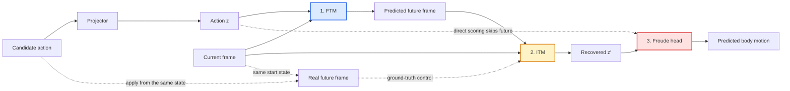

# Weekly Update: A Froude-Grounded Latent Action World Model Across Bodies

Period: 2026-09-20 to 2026-09-30

## The problem this period set out to fix

To choose an action, the world model imagines the future for each candidate action and reads off the resulting motion. That only works if **different actions give different predicted futures**.

- **Row 1:** one start state.
- **Row 2:** the real future 5 steps later under 6 different actions.
- **Rows 3–5:** each model's prediction, shown as the real future it is closest to. Green = it matches the right action; red = it matches another action's future.

Metric: top-1 retrieval accuracy of the predicted future among the 24 actions' real futures (chance 0.042), averaged over all start states.

| model | top-1 retrieval accuracy |
|---|---|
| start of the period (one frame per step) | 0.161 |
| five frames per step | 0.233 |
| current pipeline (below) | 0.266 / 0.271 (seeds S0 / S1) |

**Bodies.**
- **Pretraining body:** hexapod c10f10t10.
- **Test bodies:**
  - c10 itself (same body);
  - hexapod c08f09t09, other leg lengths, zero-shot;
  - Unitree B1 quadruped, adapted.

Clips: [forward](../results/deck/weekly/bodies_forward.mp4), [turn](../results/deck/weekly/bodies_turn.mp4), [sideways](../results/deck/weekly/bodies_sideways.mp4).

**Task:** a goal Froude sequence comes from a held-out hexapod clip. The test body selects one candidate per step from its own clip library.

---

## Metrics

Every table names the metric it uses.

| metric | definition | range / better |
|---|---|---|
| Error E | Mean Euclidean (L2) distance between achieved and goal Froude over decision steps | ≥ 0 / lower |
| Normalised score (NS) | (E_random − E) / (E_random − E_oracle), as the RL "human-normalised score". E_random: uniformly random candidate. E_oracle: hindsight oracle, the best candidate per step knowing the outcome | 0 = random, 1 = oracle / higher |
| Pearson r | Pearson correlation between read and true Froude across the 24 candidate actions from the same start state; per channel fwd / lat / yaw | −1 to 1 / higher |
| Top-1 retrieval accuracy | Per start state, subtract the mean over the 24 actions from the predicted and the real 5-step embedding change; correct if the cosine similarity is highest with the same action's real change | chance 0.042 / higher |
| Body-ID probe accuracy | Logistic regression z → body identity, 5-fold CV grouped by clip, classes balanced | chance 0.33 (3 bodies) / lower = more shared |
| Cross-body R² | Ridge regression z → Froude fit on c10 only, evaluated on another body; < 0 = worse than that body's mean | ≤ 1 / higher = more shared |
| k-NN mixing ratio (k = 10) | Share of each point's 10 nearest neighbours (standardised z) from another body, divided by its value under random mixing | 0 = separated, 1 = mixed |
| Cross-body retrieval | For each c10 transition, the nearest neighbour in standardised z among another body's transitions: 1 − L2(Froude, neighbour's Froude) / mean L2(Froude, random transition of that body) | 0 = random, 1 = identical motion / higher |

- **Froude:** with hip height h and gravity g, forward and lateral speed in the body frame are divided by √(g·h), and yaw rate is multiplied by √(h/g).
- **Normalised-score bounds (oracle / random error):** B1 0.034 / 0.127 (library of 23 clips); c08 0.020 / 0.121; c10 0.0135 / 0.1535.

---

## 1. The pipeline

| part | design | shared or per body |
|---|---|---|
| encoder | frozen V-JEPA2, egocentric camera | shared |
| rendering | every body's room, floor and floor texture scaled with its camera height; rendered from the same camera poses, the hexapod and B1 scenes are indistinguishable to a frame-level body-identity probe (0.552, chance 0.5) | — |
| latent action | z = ITM(e_t, e_t+5): five frames per step, driven by a 5-command chunk, as in LAC-WM | shared |
| forward model | FTM predicts e_t+5 from (e_t, z) | shared |
| motion target that trains z | **Froude head: input z only (no frame), one head for all bodies, its gradient trains z**; the task-space counterpart of LAC-WM's end-effector / camera motion target | shared |
| other training losses | reconstruction; separation between real-z and null-z predictions; frozen read-out; 2-step rollout consistency | shared |
| action projector | the body's commands → z | **per body (the only per-body part)** |
| adaptation | Body in joint pretraining: fit its projector (Stage 2). Unseen body: LoRA on ITM/FTM (Stage 1) with the pretraining losses, then fit its projector. | shared head; per-body projector |

**Two selection mechanisms**

| mechanism | score of candidate a (L2 to the goal) | uses the current state |
|---|---|---|
| direct | Froude head(proj(a)) | no |
| rollout | Froude head(ITM(e_t, FTM(e_t, proj(a)))) | yes |

Rollout starting observation:
- **candidate's recorded frame:** the frame saved with that candidate action in its original clip. This is an offline replay comparison.
- **robot's actual current frame:** the observation at the decision point, shared by all candidate actions. This is the state a live selector must plan from.

Read-out window: 11 steps.

---

## 2. Adapting a body that was not in pretraining

**Now**

| stage | what is trained | data |
|---|---|---|
| 1 | LoRA on the ITM / FTM MLP layers, everything else frozen, with the pretraining losses (reconstruction, separation, Froude loss through the frozen Froude head) | a few clips of the new body |
| 2 | the new body's action projector (commands → z) | the new body's clips |

**Before**

| stage | what is trained | data |
|---|---|---|
| 1 | all ITM / FTM weights, with reconstruction and separation losses | a few clips of the new body |
| 2 | the new body's action projector (commands → z) | the new body's clips |
| 4 | the shared Froude head, refit | the new body's clips + hexapod clips, so the hexapod is still read |

**LoRA instead of updating all weights.** Updating all ITM / FTM weights makes the model forget the hexapod; LoRA adds a small low-rank change on top of the frozen weights. Metric: rollout error relative to always predicting the average z (lower is better, 1.0 = no better than the average).

| Stage 1 | hexapod (already trained on) | B1 (new body) |
|---|---|---|
| all weights updated | 0.918 | 0.307 |
| LoRA rank 2 | 0.786 | 0.319 |

With LoRA, 3 clips of the new body are as good as 15 (rollout error: hexapod 0.764 vs 0.766, B1 0.315 vs 0.307).

**LoRA capacity.** Metric: normalised score on B1 selection (w=11): direct / rollout from the candidate's recorded frame / rollout from the robot's current frame.

| Stage 1 | B1 selection |
|---|---|
| LoRA rank 2, 1000 steps | +0.68 / +0.56 / +0.32 |
| LoRA rank 8, 3000 steps | **+0.87 / +0.66 / +0.41** |
| LoRA rank 8, 3000 steps, current B1 data, S0 / S1 | +0.83 / +0.39 / +0.39, +0.74 / +0.29 / +0.29 |

First two rows: earlier B1 data, S0. The old pipeline on the current data (S0): (re-measuring).

---

## 3. Motion target: Froude only, or Froude + per-body joint commands

The two versions are identical except for an extra motion decoder that predicts each body's joint commands (18-d hexapod, 12-d B1). Two seeds each. Metric: normalised score (0 = random, 1 = oracle).

| test | with joint-command decoder, S0 | with, S1 | **Froude only, S0** | **Froude only, S1** |
|---|---|---|---|---|
| c10 same body, direct | +0.91 | +0.90 | +0.91 | +0.91 |
| c10, rollout (candidate's recorded frame) | +0.72 | +0.73 | +0.74 | +0.76 |
| c10, rollout (robot's actual current frame) | +0.64 | +0.59 | +0.61 | +0.66 |
| c08 zero-shot, direct | +0.80 | +0.79 | +0.78 | +0.79 |
| c08, rollout (candidate's recorded frame) | +0.47 | +0.54 | +0.56 | +0.63 |
| c08, rollout (robot's actual current frame) | +0.52 | +0.43 | +0.53 | +0.54 |
| B1 adapted, direct | +0.80 | +0.85 | +0.83 | +0.74 |
| B1, rollout (candidate's recorded frame) | +0.54 | +0.34 | +0.39 | +0.29 |
| B1, rollout (robot's actual current frame) | +0.46 | +0.38 | +0.39 | +0.29 |

B1 rows: B1 adapted with the page 2 pipeline on the current rendering. c10 and c08 need no adaptation.

- The hexapods: equal, Froude only slightly ahead on c08 rollout from the recorded frame.
- The B1: equal on direct; the joint-command decoder is ahead on rollout by about 0.1 (recorded frame +0.34 to +0.54 vs +0.29 to +0.39; current frame +0.38 to +0.46 vs +0.29 to +0.39).
- The current pipeline uses Froude only (one fewer per-body part); on the B1's rollout it costs about 0.1.

---

## 4. Physics closed loop

- **B1:** the chosen candidate's command is executed by the B1's own walking policy in MuJoCo.
- **c08:** the candidate's joint commands drive the physics-simulated body in CoppeliaSim.

Decision every 2 steps, six goals, no B1 run fell. Hexapod-only models; B1 on the earlier rendering. Metric: error E, mean L2 between achieved and goal Froude (lower is better).

In physics, direct selection follows the goal; rollout is close to or worse than random on the B1 (0.081 / 0.108 vs random 0.089) and 3–4× direct's error on c08 for the same goals.

| version | B1 direct | B1 rollout | c08 direct | c08 rollout |
|---|---|---|---|---|
| with joint-command decoder, S0 / S1 | 0.072 / 0.073 | 0.073 / 0.098 | 0.053 / 0.050 | 0.071 / 0.078 |
| **Froude only (current), S0 / S1** | **0.061 / 0.063** | 0.081 / 0.108 | **0.047 / 0.045** | 0.085 / 0.055 |
| random candidate | 0.089 | 0.089 | 0.126 | 0.126 |

Same goals, direct vs rollout selection (S0; error = mean L2 between achieved and goal Froude, lower is better):

| goal | c08 direct | c08 rollout | B1 direct | B1 rollout |
|---|---|---|---|---|
| turn | 0.024 | 0.106 | 0.078 | 0.086 |
| forward | 0.041 | 0.141 | 0.068 | 0.081 |

**B1** (goal hexapod | B1 in physics, third-person | B1's egocentric input, with Froude traces)

Direct: [turn](../results/deck/weekly/b1_physics_turn.mp4), [forward](../results/deck/weekly/b1_physics_forward.mp4). Rollout: [turn](../results/deck/weekly/b1_physics_turn_rollout.mp4), [forward](../results/deck/weekly/b1_physics_forward_rollout.mp4).

**c08** (goal hexapod third-person | its ego view | c08 in physics, with Froude traces)

Direct: [turn](../results/deck/weekly/physics_turn.mp4), [forward](../results/deck/weekly/physics_forward.mp4). Rollout: [turn](../results/deck/weekly/physics_turn_rollout.mp4), [forward](../results/deck/weekly/physics_forward_rollout.mp4).

---

## 5. Trace the rollout failure: FTM → ITM → Froude head

**Follow one candidate action through the blocks.** Solid arrows show rollout; dashed arrows show the real-future control and the direct shortcut.

- **Selection gap on c10 (the pretraining body):** direct **+0.91**; rollout **+0.74–0.76** from each candidate's recorded frame, **+0.61–0.66** from the robot's actual current frame (normalised score, two seeds).
- **Test:** from one start state, apply each of the 24 candidate actions, render the real future, and read Froude at each point of the chain (24 start states per body).

| Froude reading (Pearson r, forward / lateral / yaw) | hexapod c10 (pretrained) | hexapod c08 (zero-shot) | B1 (adapted, page 2 pipeline) |
|---|---|---|---|
| direct from action | 0.99 / 0.92 / 0.98 | 0.98 / 0.80 / 0.95 | 0.88 / 0.79 / 0.78 |
| candidate's own recorded transition | 0.95 / 0.74 / 0.74 | 0.91 / 0.55 / 0.38 | 0.47 / 0.74 / 0.22 |
| **real** future from the same start state | 0.18 / 0.40 / 0.28 | 0.40 / 0.42 / 0.38 | 0.15 / 0.46 / 0.41 |
| **FTM-predicted** future from that state | 0.25 / 0.36 / 0.60 | 0.35 / 0.31 / 0.62 | 0.32 / 0.24 / 0.45 |

Mean of S0 / S1; 24 start states × 24 actions (c08: × 48). Futures rendered kinematically in each body's training scene; on the B1, futures executed by its walking policy in physics from a saved state give the same drop (0.12–0.19 / −0.43 to −0.10 / 0.45–0.54, earlier checkpoint).

- **Where the information is lost:** already at the real future. Even with a perfect FTM, the read of an alternative action from a shared start state is weak, on all three bodies, including the body the model was pretrained on.

**Is the motion still in z′, or is it the read-out?** Earlier B1 checkpoint (stride 5). A linear probe fitted on same-start alternative transitions, tested on held-out start states:

| read of z′ | real future | FTM-predicted future |
|---|---|---|
| model's Froude head (trained on one-action-per-clip pairs) | 0.24 / 0.52 / 0.24 | 0.10 / 0.23 / 0.21 |
| linear probe fitted on alternative transitions (one probe per column) | **0.58 / 0.60 / 0.56** | **0.48 / 0.63 / 0.72** |

| rollout selection, robot's current frame (w=11) | normalised score |
|---|---|
| model's Froude head | +0.40 |
| the probe (FTM-predicted fit) replacing the head | +0.33 |

**Conclusion.**
- z′ keeps decodable motion information (probe r ≈ 0.6 on held-out start states), but the Froude head, trained on one-action-per-clip transitions, does not generalise to same-start alternatives.
- Refitting the read-out alone on a small set of alternative transitions (8 start states, one room) did not improve selection (+0.40 → +0.33).
- The same failure occurs on the pretrained c10 body: a training-data problem, not specifically a cross-body one.
- Fixing it needs diverse alternative transitions across states and rooms, including multi-step imagined rollouts, during joint training of the ITM, FTM and Froude head (page 8).

---

## 6. Does z transfer across bodies?

The Froude head reads the same motion from c10, c08 and B1 only if their latents carry compatible meanings. We test this with a readout fitted on c10 and applied to the other bodies **without refitting**. Body-ID, mixing and retrieval test whether the wider 64-D space is shared too. Rollout selection remains the practical test.

| pretraining | body-ID probe | cross-body R² c10 → c08 | cross-body R² c10 → B1 | k-NN mixing | retrieval c10 → c08 | retrieval c10 → B1 |
|---|---|---|---|---|---|---|
| hexapod only (B1 not adapted) | (re-measuring) | | | | | |
| hexapod only, B1 adapted (page 2 pipeline; mean S0 / S1) | 0.68 | +0.70 / +0.34 / +0.17 | −0.73 / +0.11 / −0.04 | 0.47 | 0.38 | 0.25 (0.25 / 0.24) |
| joint, no similarity loss | 0.73 | +0.76 / +0.38 / +0.18 | −1.40 / −0.07 / −0.87 | 0.35 | 0.40 | 0.22 |
| joint + Froude-similarity loss | 0.73 | +0.71 / +0.30 / +0.04 | −1.59 / −0.09 / −1.06 | 0.36 | 0.44 | 0.24 |

Joint pretraining uses c10 + B1 (48 clips each, B1 on the current rendering). The similarity loss encourages transitions with similar Froude motion to have similar z.

- z is shared between the two hexapods (c10 → c08 forward R² +0.71 to +0.76, retrieval 0.40–0.44).
- z is not shared with the B1 in any version: retrieval 0.22–0.25 (hexapods 0.38–0.44), forward R² negative. Joint pretraining and the similarity loss do not change this.

---

## 7. Selection when the B1 is in pretraining

Joint models are used as pretrained: only the B1's action projector is fitted. The joint models were pretrained before a B1 label correction (hard-turn clips); their projectors and all evaluation use the corrected data, and retraining is planned. The first column adapts the B1 to a hexapod-only model with the adaptation pipeline of page 2. Metric: normalised score (0 = random, 1 = oracle), w=11.

| test | hexapod-only pretraining; B1 adapted (S0 / S1) | joint, no similarity loss (S0) | joint + similarity loss (S0) |
|---|---|---|---|
| B1 direct | +0.83 / +0.74 | +0.92 | +0.94 |
| B1 rollout (candidate's recorded frame) | +0.39 / +0.29 | +0.61 | +0.45 |
| B1 rollout (robot's actual current frame) | +0.39 / +0.29 | +0.55 | +0.57 |
| B1 direct, goal read from vision | +0.60 / +0.46 | +0.84 | +0.84 |
| B1 rollout (current frame), goal read from vision | +0.25 / +0.35 | +0.56 | +0.57 |
| c08 direct (zero-shot) | +0.78 | +0.78 | +0.79 |
| c10 direct (same body) | +0.91 | +0.90 | +0.91 |
| c10 direct, goal read from vision | +0.82 / +0.84 | +0.87 | +0.85 |

- Joint pretraining gives the best B1 selection (direct +0.92 to +0.94, rollout +0.45 to +0.61) without a shared z: each body's projector and the shared head carry it.
- The similarity loss adds nothing measurable (one seed each).
- Reading the goal from vision instead of the recorded Froude costs 0.08–0.28 on B1 direct (least for the joint models) and 0.03–0.09 on c10 direct.

Unless marked, the goal is the goal clip's recorded Froude. "Goal read from vision": the goal clip's frames read through the model's own ITM + Froude head (11-step window); the picked action is still graded by its real Froude.

---

## 8. The training data: what it lacks, and the plan

**1. Counterfactual transitions.** Each training clip holds one command for its whole length, so from any state the model only ever sees one action and its future. It never sees "same state, different action, different future". Because of this the Froude read-out cannot judge another action's future: on the hexapod c10, Pearson r between read and true Froude (fwd / lat / yaw) is 0.95 / 0.74 / 0.74 on the clip's own future, but 0.18 / 0.40 / 0.28 when another action is applied from the same start state. The same drop on c08 (forward 0.91 → 0.40) and the B1 (0.47 → 0.15).

| | now | should be |
|---|---|---|
| actions seen from one state | 1 | many (all 24 commands from saved states) |
| B1 | one command per clip | save the MuJoCo state, run each command from it, record each future |
| hexapod | one command per clip | clips that switch command every ≥ 15 steps |
| training on alternatives | none | ITM, FTM and Froude head trained together on them, including multi-step imagined rollouts |
| rooms per start state | one | several |

**2. Frame / view style.** Each body is rendered in one style with small image changes, so the model can recognise a body's scene instead of its motion. Changing only the B1 floor tiling and texture scale drops the B1 direct normalised score from +0.94 to +0.24 / −0.08. We follow Egocentric VSM's view randomisation.

| | now | should be (Egocentric VSM) |
|---|---|---|
| crop | 85–100% | 10–100% |
| brightness | ±20% | ×0.1–10 |
| blur | none | kernel 3–41 |
| colour, noise | none | yes |
| ground textures | one per body | several, the same set for every body |
| lighting | fixed | varied |

**3. Amount.** 48 clips per body, ≈2.9k training pairs (frame t → t+5). LAC-WM uses 150k trajectories.

| | now | should be |
|---|---|---|
| clips per body | 48 | test 48 vs 48 + switching vs 96, then scale up |

☐ view augmentation: pilot ready (current, safe, Egocentric VSM strength; 25% of samples kept clean)  ☐ counterfactual branches: tool ready  ☐ randomised rendering, more data: planned

**Next**

| run | question |
|---|---|
| Pretraining with alternative transitions (physics branches on the B1, switching clips on the hexapod) | Does the read of an alternative action's future reach the own-transition level, and rollout reach direct? |
| View augmentation pilot | Does B1 selection survive a rendering change without adaptation, with no loss on the training rendering? |
| Gecko held out | Does a body never seen join, zero-shot and after a small adaptation? |
