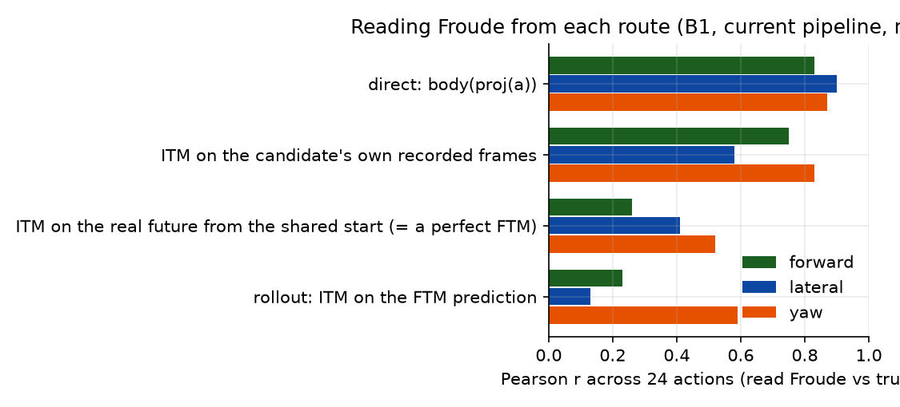
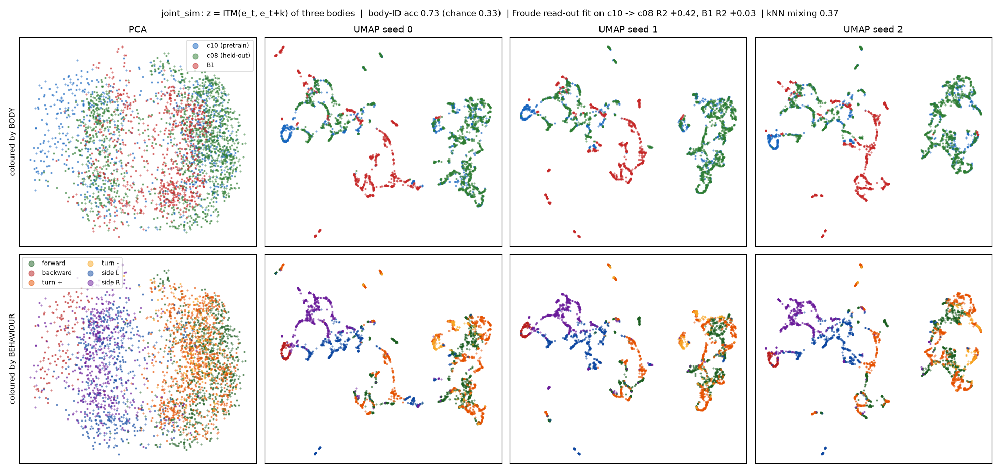

# Weekly Update: A Froude-Grounded Latent Action World Model Across Bodies

Period: 2026-09-20 to 2026-09-29

## The problem this period set out to fix

To choose an action, the world model imagines the future for each candidate action and reads off the resulting motion. That only works if **different actions give different predicted futures**.

- **Row 1:** one start state.
- **Row 2:** the real future 5 steps later under 6 different actions.
- **Rows 3–5:** each model's prediction, shown as the real future it is closest to. Green = it matches the right action; red = it matches another action's future.

Metric: top-1 retrieval accuracy of the predicted future among the 24 actions' real futures (chance 0.042), averaged over all start states.

| model | top-1 retrieval accuracy |
|---|---|
| start of the period (one frame per step) | 0.161 |
| five frames per step | 0.233 |
| current pipeline (below) | 0.266 / 0.271 (seeds S0 / S1) |

**Bodies.**
- **Pretraining body:** hexapod c10f10t10.
- **Test bodies:**
  - c10 itself (same body);
  - hexapod c08f09t09, other leg lengths, zero-shot;
  - Unitree B1 quadruped, adapted.

Clips: [forward](../results/deck/weekly/bodies_forward.mp4), [turn](../results/deck/weekly/bodies_turn.mp4), [sideways](../results/deck/weekly/bodies_sideways.mp4).

**Task:** a goal Froude sequence comes from a held-out hexapod clip. The test body selects one candidate per step from its own clip library.

---

## Metrics

Every table names the metric it uses.

| metric | definition | range / better |
|---|---|---|
| Error E | Mean Euclidean (L2) distance between achieved and goal Froude over decision steps | ≥ 0 / lower |
| Normalised score (NS) | (E_random − E) / (E_random − E_oracle), as the RL "human-normalised score". E_random: uniformly random candidate. E_oracle: hindsight oracle, the best candidate per step knowing the outcome | 0 = random, 1 = oracle / higher |
| Pearson r | Pearson correlation between read and true Froude across the 24 candidate actions from the same start state; per channel fwd / lat / yaw | −1 to 1 / higher |
| Top-1 retrieval accuracy | Per start state, subtract the mean over the 24 actions from the predicted and the real 5-step embedding change; correct if the cosine similarity is highest with the same action's real change | chance 0.042 / higher |
| Body-ID probe accuracy | Logistic regression z → body identity, 5-fold CV grouped by clip, classes balanced | chance 0.33 (3 bodies) / lower = more shared |
| Cross-body R² | Ridge regression z → Froude fit on c10 only, evaluated on another body; < 0 = worse than that body's mean | ≤ 1 / higher = more shared |
| k-NN mixing ratio (k = 10) | Share of each point's 10 nearest neighbours (standardised z) from another body, divided by its value under random mixing | 0 = separated, 1 = mixed |
| Cross-body retrieval | For each c10 transition, the nearest neighbour in standardised z among another body's transitions: 1 − L2(Froude, neighbour's Froude) / mean L2(Froude, random transition of that body) | 0 = random, 1 = identical motion / higher |

- **Froude:** with hip height h and gravity g, forward and lateral speed in the body frame are divided by √(g·h), and yaw rate is multiplied by √(h/g).
- **Normalised-score bounds (oracle / random error):** B1 0.031 / 0.126; c08 0.020 / 0.121; c10 0.0135 / 0.1535.

---

## 1. The pipeline

| part | design | shared or per body |
|---|---|---|
| encoder | frozen V-JEPA2, egocentric camera | shared |
| latent action | z = ITM(e_t, e_t+5): five frames per step, driven by a 5-command chunk, as in LAC-WM | shared |
| forward model | FTM predicts e_t+5 from (e_t, z) | shared |
| motion target that trains z | **Froude head: input z only (no frame), one head for all bodies, its gradient trains z**; the task-space counterpart of LAC-WM's end-effector / camera motion target | shared |
| other training losses | reconstruction; separation between real-z and null-z predictions; frozen read-out; 2-step rollout consistency | shared |
| action projector | the body's commands → z | **per body (the only per-body part)** |
| adaptation to a new body | LoRA rank 2 on ITM / FTM, then the projector, then a Froude-head fit | — |

**Two selection mechanisms**

| mechanism | score of candidate a (L2 to the goal) | uses the current state |
|---|---|---|
| direct | Froude head(proj(a)) | no |
| rollout | Froude head(ITM(e_t, FTM(e_t, proj(a)))) | yes |

Rollout start frame:
- **library start:** the candidate's own recorded frame;
- **current start:** the frame the controlled body is at.

Read-out window: 11 steps.

---

## 2. Motion target: Froude only, or Froude + per-body joint commands

The two versions are identical except for an extra motion decoder that predicts each body's joint commands (18-d hexapod, 12-d B1). Two seeds each. Metric: normalised score (0 = random, 1 = oracle).

| test | with joint-command decoder, S0 | with, S1 | **Froude only, S0** | **Froude only, S1** |
|---|---|---|---|---|
| c10 same body, direct | +0.91 | +0.90 | +0.91 | +0.91 |
| c10, rollout (library start) | +0.72 | +0.73 | +0.74 | +0.76 |
| c10, rollout (current start) | +0.64 | +0.59 | +0.61 | +0.66 |
| c08 zero-shot, direct | +0.80 | +0.79 | +0.78 | +0.79 |
| c08, rollout (library start) | +0.47 | +0.54 | +0.56 | +0.63 |
| c08, rollout (current start) | +0.52 | +0.43 | +0.53 | +0.54 |
| B1 adapted, direct | +0.82 | +0.82 | +0.85 | +0.85 |
| B1, rollout (library start) | +0.62 | +0.44 | +0.47 | +0.59 |
| B1, rollout (current start) | +0.46 | +0.28 | +0.46 | +0.35 |

The current pipeline uses Froude only.

---

## 3. Physics closed loop

- **B1:** the chosen candidate's command is executed by the B1's own walking policy in MuJoCo.
- **c08:** the candidate's joint commands drive the physics-simulated body in CoppeliaSim.

Decision every 2 steps, six goals, no B1 run fell. Metric: error E, mean L2 between achieved and goal Froude (lower is better).

| version | B1 direct | B1 rollout | c08 direct | c08 rollout |
|---|---|---|---|---|
| with joint-command decoder, S0 / S1 | 0.072 / 0.073 | 0.073 / 0.098 | 0.053 / 0.050 | 0.071 / 0.078 |
| **Froude only (current), S0 / S1** | **0.061 / 0.063** | 0.081 / 0.108 | **0.047 / 0.045** | 0.085 / 0.055 |
| random candidate | 0.089 | 0.089 | 0.126 | 0.126 |

B1 clips (goal hexapod | B1 in physics, third-person | B1's egocentric input, with Froude traces): [turn](../results/deck/weekly/b1_physics_turn.mp4), [forward](../results/deck/weekly/b1_physics_forward.mp4).

c08 clips (goal hexapod third-person | its ego view | c08 in physics, with Froude traces): [turn](../results/deck/weekly/physics_turn.mp4), [forward](../results/deck/weekly/physics_forward.mp4).

---

## 4. Where rollout still falls short of direct

Same body (c10), current pipeline. Metric: normalised score.

| | direct | rollout (library start) | rollout (current start) |
|---|---|---|---|
| S0 | +0.91 | +0.74 | +0.61 |
| S1 | +0.91 | +0.76 | +0.66 |

**Reading Froude back out of a future frame** (B1, current pipeline, mean of 2 seeds). The same start state is rendered under each of the 24 actions. Metric: Pearson r across actions between the read and the true Froude.

| reading | r fwd / lat / yaw |
|---|---|
| direct: Froude head(proj(a)) | 0.83 / 0.90 / 0.87 |
| ITM on the candidate's own recorded frames | 0.75 / 0.58 / 0.83 |
| ITM on the **real** future from the shared start state (= a perfect FTM) | 0.26 / 0.41 / 0.52 |
| rollout: ITM on the FTM prediction | 0.23 / 0.13 / 0.59 |

---

## 5. Is z shared across bodies?

**z across bodies.**
- **Metrics:** body-ID probe accuracy (lower = more shared); cross-body R² of a Froude read-out fit on c10 only; k-NN mixing ratio (1 = mixed); cross-body retrieval (0 = random, 1 = identical motion).
- **Froude-similarity loss:** for every pair of transitions, the cosine of their z must match the similarity of their Froude. Cross-body pairs come from a queue of recent z, because each training batch holds one body. This is the form of arXiv 2609.19846, with Froude as the similarity signal.

| pretraining | body-ID probe | cross-body R² c10 → c08 | cross-body R² c10 → B1 | k-NN mixing | retrieval c10 → c08 | retrieval c10 → B1 |
|---|---|---|---|---|---|---|
| hexapod only | 0.69 | +0.78 / +0.36 / +0.18 | −1.30 / −0.02 / +0.26 | 0.44 | 0.44 | 0.05 |
| hexapod + B1 together (one frame per step, no similarity loss) | 0.73 | +0.45 / +0.09 / −0.33 | −0.91 / +0.07 / −0.18 | 0.39 | 0.32 | 0.21 |
| **hexapod + B1 together + Froude-similarity loss** | 0.73 | +0.72 / +0.36 / +0.17 | **+0.13 / +0.30** / −0.34 | 0.37 | 0.43 | **0.34** |

The last row is one seed, with the joint-command decoder on.

---

## 6. Two ways to bring the B1 into the shared space

- **Pretrain together:** the B1 is in pretraining with the hexapod (+ similarity loss); afterwards only the B1's action projector is fitted.
- **Adapt afterwards:** pretrain on the hexapod only, then adapt to the B1. LoRA on ITM / FTM, then the projector, with an optional refit of the Froude head on the B1. The same 48 B1 clips are used at every stage.
- **Anchor:** during adaptation, the hexapod's Froude head (frozen) must read the B1's z correctly, which pulls the B1 into the hexapod's space.

Metrics: normalised score on the B1 (0 = random, 1 = oracle; w=11); cross-body retrieval c10 → B1 (0 = random, 1 = identical motion).

| route | B1 direct | B1 rollout (library start) | B1 rollout (current start) | retrieval c10 → B1 |
|---|---|---|---|---|
| **pretrain together, projector only** | **+0.94** | **+0.76** | **+0.65** | **0.34** |
| adapt, no anchor, Froude head refit | +0.84 | +0.57 | +0.44 | 0.04 |
| adapt, no anchor, no refit | +0.71 | +0.20 | +0.08 | 0.04 |
| adapt with anchor, LoRA rank 2, 1000 steps, no refit | +0.68 | +0.56 | +0.32 | 0.19 |
| adapt with anchor, LoRA rank 8, 3000 steps, no refit | +0.87 | +0.66 | +0.41 | 0.19 |

Hexapod side (pretrain together): c08 direct +0.79, c10 direct +0.91, unchanged from hexapod-only pretraining. Pretrain-together row: one seed, joint-command decoder on.

---

## 7. What the anchored adaptation changes

Cross-body R² of a Froude read-out fit on c10 only, applied to the B1 (fwd / lat / yaw), on the adapted model:

| adaptation | cross-body R² c10 → B1 |
|---|---|
| no anchor | −1.36 / +0.09 / +0.30 |
| anchor, LoRA rank 2, 1000 steps | −0.72 / +0.16 / +0.42 |
| anchor, LoRA rank 8, 3000 steps | +0.14 / +0.24 / +0.45 |
| pretrain together (for reference) | +0.13 / +0.30 / −0.34 |

With the rank-8 anchored adaptation, the hexapod's Froude head reads the B1 without a refit: the Froude refit adds nothing to direct (+0.88 with it vs +0.87 without). Rank and number of steps were changed together.

---

## 8. Next

| run | question |
|---|---|
| Hexapod + B1 together, Froude only; similarity loss on vs off (matched pair) | Is the similarity loss what places the B1 in the hexapod's z? |
| Anchored adaptation: rank and number of steps separated; forgetting on the hexapod measured | What sets how far adaptation can move a new body into the shared space? |
| Pretraining data: behaviour clips vs behaviour + varied-action clips vs the same amount of behaviour clips | Does broader behaviour coverage help, and does coverage of (state, action) combinations add to coverage of actions? |
| Gecko held out | Does a body never seen land in the shared z, zero-shot and after a small adaptation? |
