# Weekly Update: A Froude-Grounded Latent Action World Model Across Bodies

Period: 2026-09-20 to 2026-09-30

## The problem this period set out to fix

To choose an action, the world model imagines the future for each candidate action and reads off the resulting motion. That only works if **different actions give different predicted futures**.

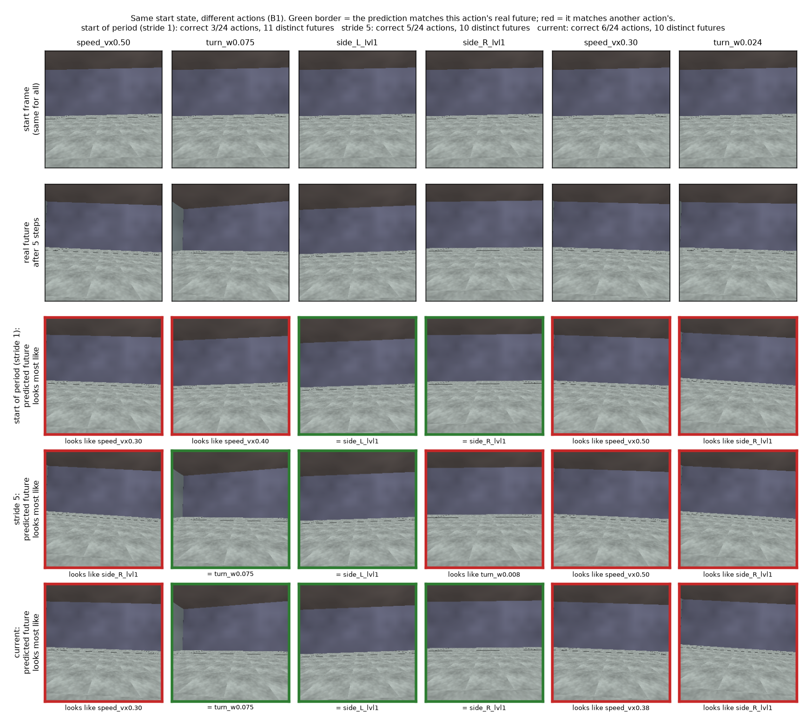

- **Row 1:** one start state.
- **Row 2:** the real future 5 steps later under 6 different actions.
- **Rows 3–5:** each model's prediction, shown as the real future it is closest to. Green = it matches the right action; red = it matches another action's future.

Metric: top-1 retrieval accuracy of the predicted future among the 24 actions' real futures (chance 0.042), averaged over all start states.

| model | top-1 retrieval accuracy |
|---|---|
| start of the period (one frame per step) | 0.161 |
| five frames per step | 0.233 |
| current pipeline (below) | 0.266 / 0.271 (seeds S0 / S1) |

**Bodies.**
- **Pretraining body:** hexapod c10f10t10.
- **Test bodies:**
  - c10 itself (same body);
  - hexapod c08f09t09, other leg lengths, zero-shot;
  - Unitree B1 quadruped, adapted.

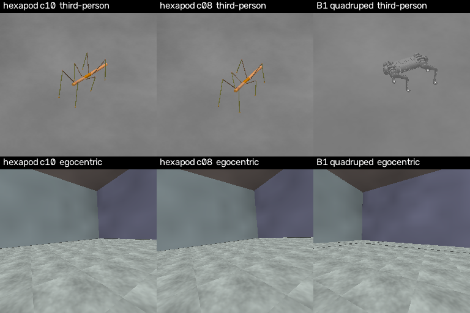

Clips: [forward](../results/deck/weekly/bodies_forward.mp4), [turn](../results/deck/weekly/bodies_turn.mp4), [sideways](../results/deck/weekly/bodies_sideways.mp4).

**Task:** a goal Froude sequence comes from a held-out hexapod clip. The test body selects one candidate per step from its own clip library.

---

## Metrics

Every table names the metric it uses.

| metric | definition | range / better |
|---|---|---|
| Error E | Mean Euclidean (L2) distance between achieved and goal Froude over decision steps | ≥ 0 / lower |
| Normalised score (NS) | (E_random − E) / (E_random − E_oracle), as the RL "human-normalised score". E_random: uniformly random candidate. E_oracle: hindsight oracle, the best candidate per step knowing the outcome | 0 = random, 1 = oracle / higher |
| Pearson r | Pearson correlation between read and true Froude across the 24 candidate actions from the same start state; per channel fwd / lat / yaw | −1 to 1 / higher |
| Top-1 retrieval accuracy | Per start state, subtract the mean over the 24 actions from the predicted and the real 5-step embedding change; correct if the cosine similarity is highest with the same action's real change | chance 0.042 / higher |
| Body-ID probe accuracy | Logistic regression z → body identity, 5-fold CV grouped by clip, classes balanced | chance 0.33 (3 bodies) / lower = more shared |
| Cross-body R² | Ridge regression z → Froude fit on c10 only, evaluated on another body; < 0 = worse than that body's mean | ≤ 1 / higher = more shared |
| k-NN mixing ratio (k = 10) | Share of each point's 10 nearest neighbours (standardised z) from another body, divided by its value under random mixing | 0 = separated, 1 = mixed |
| Cross-body retrieval | For each c10 transition, the nearest neighbour in standardised z among another body's transitions: 1 − L2(Froude, neighbour's Froude) / mean L2(Froude, random transition of that body) | 0 = random, 1 = identical motion / higher |

- **Froude:** with hip height h and gravity g, forward and lateral speed in the body frame are divided by √(g·h), and yaw rate is multiplied by √(h/g).
- **Normalised-score bounds (oracle / random error):** B1 0.034 / 0.127 (library of 23 clips); c08 0.020 / 0.121; c10 0.0135 / 0.1535.

---

## 1. The pipeline

| part | design | shared or per body |
|---|---|---|
| encoder | frozen V-JEPA2, egocentric camera | shared |
| rendering | every body's room, floor and floor texture scaled with its camera height; rendered from the same camera poses, the hexapod and B1 scenes are indistinguishable to a frame-level body-identity probe (0.552, chance 0.5) | — |
| latent action | z = ITM(e_t, e_t+5): five frames per step, driven by a 5-command chunk, as in LAC-WM | shared |
| forward model | FTM predicts e_t+5 from (e_t, z) | shared |
| motion target that trains z | **Froude head: input z only (no frame), one head for all bodies, its gradient trains z**; the task-space counterpart of LAC-WM's end-effector / camera motion target | shared |
| other training losses | reconstruction; separation between real-z and null-z predictions; frozen read-out; 2-step rollout consistency | shared |
| action projector | the body's commands → z | **per body (the only per-body part)** |
| adaptation | Body in joint pretraining: fit its projector (Stage 2). Unseen body: LoRA on ITM/FTM (Stage 1) with the pretraining losses, then fit its projector. | shared head; per-body projector |

**Two selection mechanisms**

| mechanism | score of candidate a (L2 to the goal) | uses the current state |
|---|---|---|
| direct | Froude head(proj(a)) | no |
| rollout | Froude head(ITM(e_t, FTM(e_t, proj(a)))) | yes |

Rollout starting observation:
- **candidate's recorded frame:** the frame saved with that candidate action in its original clip. This is an offline replay comparison.
- **robot's actual current frame:** the observation at the decision point, shared by all candidate actions. This is the state a live selector must plan from.

Read-out window: 11 steps.

---

## 2. Adapting a body that was not in pretraining

**Now**

| stage | what is trained | data |
|---|---|---|
| 1 | LoRA on the ITM / FTM MLP layers, everything else frozen, with the pretraining losses (reconstruction, separation, Froude loss through the frozen Froude head) | a few clips of the new body |
| 2 | the new body's action projector (commands → z) | the new body's clips |

**Before**

| stage | what is trained | data |
|---|---|---|
| 1 | all ITM / FTM weights, with reconstruction and separation losses | a few clips of the new body |
| 2 | the new body's action projector (commands → z) | the new body's clips |
| 4 | the shared Froude head, refit | the new body's clips + hexapod clips, so the hexapod is still read |

**LoRA instead of updating all weights.** Updating all ITM / FTM weights makes the model forget the hexapod; LoRA adds a small low-rank change on top of the frozen weights. Metric: rollout error relative to always predicting the average z (lower is better, 1.0 = no better than the average).

| Stage 1 | hexapod (already trained on) | B1 (new body) |
|---|---|---|
| all weights updated | 0.918 | 0.307 |
| LoRA rank 2 | 0.786 | 0.319 |

With LoRA, 3 clips of the new body are as good as 15 (rollout error: hexapod 0.764 vs 0.766, B1 0.315 vs 0.307).

**LoRA capacity.** Metric: normalised score on B1 selection (w=11): direct / rollout from the candidate's recorded frame / rollout from the robot's current frame.

| Stage 1 | B1 selection |
|---|---|
| LoRA rank 2, 1000 steps | +0.68 / +0.56 / +0.32 |
| LoRA rank 8, 3000 steps | **+0.87 / +0.66 / +0.41** |
| LoRA rank 8, 3000 steps, current B1 data, S0 / S1 | +0.83 / +0.39 / +0.39, +0.74 / +0.29 / +0.29 |

First two rows: earlier B1 data, S0. The old pipeline on the current data (S0): (re-measuring).

---

## 3. Motion target: Froude only, or Froude + per-body joint commands

The two versions are identical except for an extra motion decoder that predicts each body's joint commands (18-d hexapod, 12-d B1). Two seeds each. Metric: normalised score (0 = random, 1 = oracle).

| test | with joint-command decoder, S0 | with, S1 | **Froude only, S0** | **Froude only, S1** |
|---|---|---|---|---|
| c10 same body, direct | +0.91 | +0.90 | +0.91 | +0.91 |
| c10, rollout (candidate's recorded frame) | +0.72 | +0.73 | +0.74 | +0.76 |
| c10, rollout (robot's actual current frame) | +0.64 | +0.59 | +0.61 | +0.66 |
| c08 zero-shot, direct | +0.80 | +0.79 | +0.78 | +0.79 |
| c08, rollout (candidate's recorded frame) | +0.47 | +0.54 | +0.56 | +0.63 |
| c08, rollout (robot's actual current frame) | +0.52 | +0.43 | +0.53 | +0.54 |
| B1 adapted, direct | +0.80 | +0.85 | +0.83 | +0.74 |
| B1, rollout (candidate's recorded frame) | +0.54 | +0.34 | +0.39 | +0.29 |
| B1, rollout (robot's actual current frame) | +0.46 | +0.38 | +0.39 | +0.29 |

B1 rows: B1 adapted with the page 2 pipeline on the current rendering. c10 and c08 need no adaptation.

- The hexapods: equal, Froude only slightly ahead on c08 rollout from the recorded frame.
- The B1: equal on direct; the joint-command decoder is ahead on rollout by about 0.1 (recorded frame +0.34 to +0.54 vs +0.29 to +0.39; current frame +0.38 to +0.46 vs +0.29 to +0.39).
- The current pipeline uses Froude only (one fewer per-body part); on the B1's rollout it costs about 0.1.

---

## 4. Physics closed loop

- **B1:** the chosen candidate's command is executed by the B1's own walking policy in MuJoCo.
- **c08:** the candidate's joint commands drive the physics-simulated body in CoppeliaSim.

Decision every 2 steps, six goals, no B1 run fell. Hexapod-only models; B1 on the earlier rendering. Metric: error E, mean L2 between achieved and goal Froude (lower is better).

In physics, direct selection follows the goal; rollout is close to or worse than random on the B1 (0.081 / 0.108 vs random 0.089) and 3–4× direct's error on c08 for the same goals.

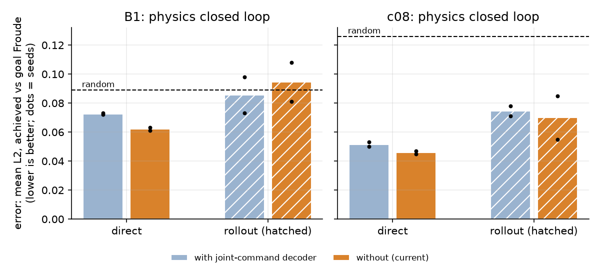

| version | B1 direct | B1 rollout | c08 direct | c08 rollout |
|---|---|---|---|---|
| with joint-command decoder, S0 / S1 | 0.072 / 0.073 | 0.073 / 0.098 | 0.053 / 0.050 | 0.071 / 0.078 |
| **Froude only (current), S0 / S1** | **0.061 / 0.063** | 0.081 / 0.108 | **0.047 / 0.045** | 0.085 / 0.055 |
| random candidate | 0.089 | 0.089 | 0.126 | 0.126 |

Same goals, direct vs rollout selection (S0; error = mean L2 between achieved and goal Froude, lower is better):

| goal | c08 direct | c08 rollout | B1 direct | B1 rollout |
|---|---|---|---|---|
| turn | 0.024 | 0.106 | 0.078 | 0.086 |
| forward | 0.041 | 0.141 | 0.068 | 0.081 |

**B1** (goal hexapod | B1 in physics, third-person | B1's egocentric input, with Froude traces)

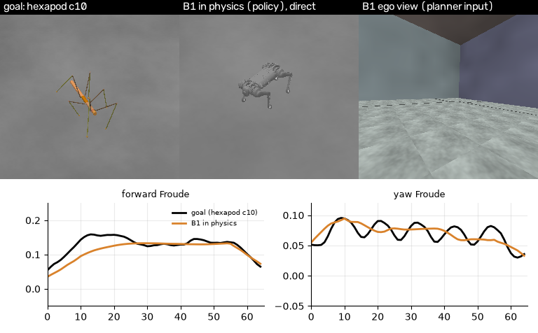
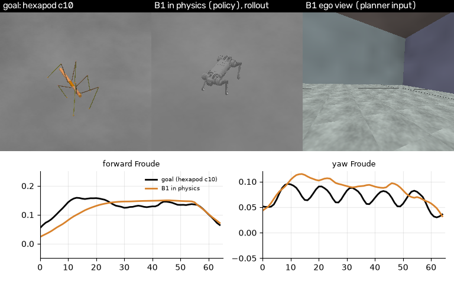

Direct: [turn](../results/deck/weekly/b1_physics_turn.mp4), [forward](../results/deck/weekly/b1_physics_forward.mp4). Rollout: [turn](../results/deck/weekly/b1_physics_turn_rollout.mp4), [forward](../results/deck/weekly/b1_physics_forward_rollout.mp4).

**c08** (goal hexapod third-person | its ego view | c08 in physics, with Froude traces)

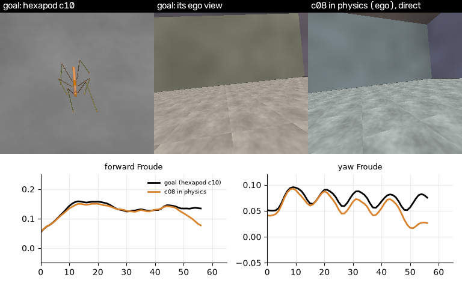
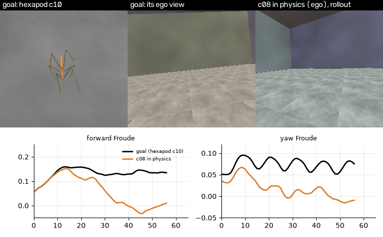

Direct: [turn](../results/deck/weekly/physics_turn.mp4), [forward](../results/deck/weekly/physics_forward.mp4). Rollout: [turn](../results/deck/weekly/physics_turn_rollout.mp4), [forward](../results/deck/weekly/physics_forward_rollout.mp4).

---

## 5. Trace the rollout failure: FTM → ITM → Froude head

**Follow one candidate action through the blocks.** Solid arrows show rollout; dashed arrows show the real-future control and the direct shortcut.

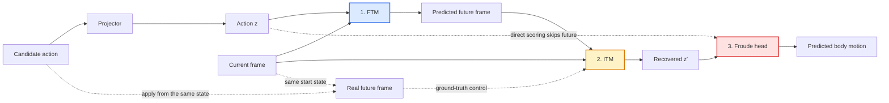

- **Selection gap on c10 (the pretraining body):** direct **+0.91**; rollout **+0.74–0.76** from each candidate's recorded frame, **+0.61–0.66** from the robot's actual current frame (normalised score, two seeds).
- **Test:** from one start state, apply each of the 24 candidate actions, render the real future, and read Froude at each point of the chain (24 start states per body).

| Froude reading (Pearson r, forward / lateral / yaw) | hexapod c10 (pretrained) | hexapod c08 (zero-shot) | B1 (adapted, page 2 pipeline) |
|---|---|---|---|
| direct from action | 0.99 / 0.92 / 0.98 | 0.98 / 0.80 / 0.95 | 0.88 / 0.79 / 0.78 |
| candidate's own recorded transition | 0.95 / 0.74 / 0.74 | 0.91 / 0.55 / 0.38 | 0.47 / 0.74 / 0.22 |
| **real** future from the same start state | 0.18 / 0.40 / 0.28 | 0.40 / 0.42 / 0.38 | 0.15 / 0.46 / 0.41 |
| **FTM-predicted** future from that state | 0.25 / 0.36 / 0.60 | 0.35 / 0.31 / 0.62 | 0.32 / 0.24 / 0.45 |

Mean of S0 / S1; 24 start states × 24 actions (c08: × 48). Futures rendered kinematically in each body's training scene; on the B1, futures executed by its walking policy in physics from a saved state give the same drop (0.12–0.19 / −0.43 to −0.10 / 0.45–0.54, earlier checkpoint).

- **Where the information is lost:** already at the real future. Even with a perfect FTM, the read of an alternative action from a shared start state is weak, on all three bodies, including the body the model was pretrained on.

**Is the motion still in z′, or is it the read-out?** Earlier B1 checkpoint (stride 5). A linear probe fitted on same-start alternative transitions, tested on held-out start states:

| read of z′ | real future | FTM-predicted future |
|---|---|---|
| model's Froude head (trained on one-action-per-clip pairs) | 0.24 / 0.52 / 0.24 | 0.10 / 0.23 / 0.21 |
| linear probe fitted on alternative transitions (one probe per column) | **0.58 / 0.60 / 0.56** | **0.48 / 0.63 / 0.72** |

| rollout selection, robot's current frame (w=11) | normalised score |
|---|---|
| model's Froude head | +0.40 |
| the probe (FTM-predicted fit) replacing the head | +0.33 |

**Conclusion.**
- z′ keeps decodable motion information (probe r ≈ 0.6 on held-out start states), but the Froude head, trained on one-action-per-clip transitions, does not generalise to same-start alternatives.
- Refitting the read-out alone on a small set of alternative transitions (8 start states, one room) did not improve selection (+0.40 → +0.33).
- The same failure occurs on the pretrained c10 body: a training-data problem, not specifically a cross-body one.
- Fixing it needs diverse alternative transitions across states and rooms, including multi-step imagined rollouts, during joint training of the ITM, FTM and Froude head (page 8).

---

## 6. Does z transfer across bodies?

The Froude head reads the same motion from c10, c08 and B1 only if their latents carry compatible meanings. We test this with a readout fitted on c10 and applied to the other bodies **without refitting**. Body-ID, mixing and retrieval test whether the wider 64-D space is shared too. Rollout selection remains the practical test.

| pretraining | body-ID probe | cross-body R² c10 → c08 | cross-body R² c10 → B1 | k-NN mixing | retrieval c10 → c08 | retrieval c10 → B1 |
|---|---|---|---|---|---|---|
| hexapod only (B1 not adapted) | (re-measuring) | | | | | |
| hexapod only, B1 adapted (page 2 pipeline; mean S0 / S1) | 0.68 | +0.70 / +0.34 / +0.17 | −0.73 / +0.11 / −0.04 | 0.47 | 0.38 | 0.25 (0.25 / 0.24) |
| joint, no similarity loss | 0.73 | +0.76 / +0.38 / +0.18 | −1.40 / −0.07 / −0.87 | 0.35 | 0.40 | 0.22 |
| joint + Froude-similarity loss | 0.73 | +0.71 / +0.30 / +0.04 | −1.59 / −0.09 / −1.06 | 0.36 | 0.44 | 0.24 |

Joint pretraining uses c10 + B1 (48 clips each, B1 on the current rendering). The similarity loss encourages transitions with similar Froude motion to have similar z.

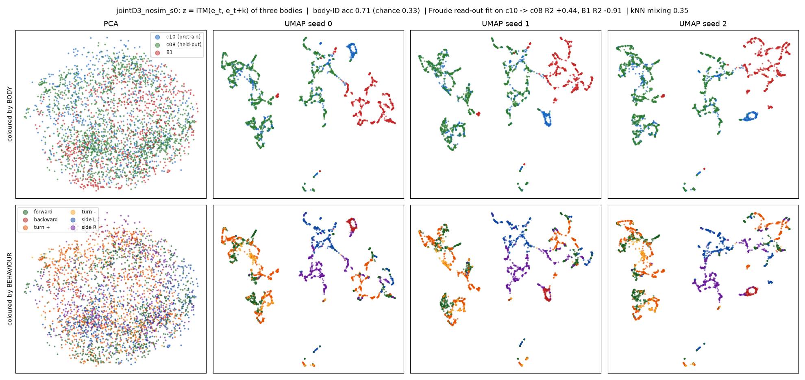

- z is shared between the two hexapods (c10 → c08 forward R² +0.71 to +0.76, retrieval 0.40–0.44).
- z is not shared with the B1 in any version: retrieval 0.22–0.25 (hexapods 0.38–0.44), forward R² negative. Joint pretraining and the similarity loss do not change this.

---

## 7. Selection when the B1 is in pretraining

Joint models are used as pretrained: only the B1's action projector is fitted. The joint models were pretrained before a B1 label correction (hard-turn clips); their projectors and all evaluation use the corrected data, and retraining is planned. The first column adapts the B1 to a hexapod-only model with the adaptation pipeline of page 2. Metric: normalised score (0 = random, 1 = oracle), w=11.

| test | hexapod-only pretraining; B1 adapted (S0 / S1) | joint, no similarity loss (S0) | joint + similarity loss (S0) |
|---|---|---|---|
| B1 direct | +0.83 / +0.74 | +0.92 | +0.94 |
| B1 rollout (candidate's recorded frame) | +0.39 / +0.29 | +0.61 | +0.45 |
| B1 rollout (robot's actual current frame) | +0.39 / +0.29 | +0.55 | +0.57 |
| B1 direct, goal read from vision | +0.60 / +0.46 | +0.84 | +0.84 |
| B1 rollout (current frame), goal read from vision | +0.25 / +0.35 | +0.56 | +0.57 |
| c08 direct (zero-shot) | +0.78 | +0.78 | +0.79 |
| c10 direct (same body) | +0.91 | +0.90 | +0.91 |
| c10 direct, goal read from vision | +0.82 / +0.84 | +0.87 | +0.85 |

- Joint pretraining gives the best B1 selection (direct +0.92 to +0.94, rollout +0.45 to +0.61) without a shared z: each body's projector and the shared head carry it.
- The similarity loss adds nothing measurable (one seed each).
- Reading the goal from vision instead of the recorded Froude costs 0.08–0.28 on B1 direct (least for the joint models) and 0.03–0.09 on c10 direct.

Unless marked, the goal is the goal clip's recorded Froude. "Goal read from vision": the goal clip's frames read through the model's own ITM + Froude head (11-step window); the picked action is still graded by its real Froude.

---

## 8. The training data: what it lacks, and the plan

**1. Counterfactual transitions.** Each training clip holds one command for its whole length, so from any state the model only ever sees one action and its future. It never sees "same state, different action, different future". Because of this the Froude read-out cannot judge another action's future: on the hexapod c10, Pearson r between read and true Froude (fwd / lat / yaw) is 0.95 / 0.74 / 0.74 on the clip's own future, but 0.18 / 0.40 / 0.28 when another action is applied from the same start state. The same drop on c08 (forward 0.91 → 0.40) and the B1 (0.47 → 0.15).

| | now | should be |
|---|---|---|
| actions seen from one state | 1 | many (all 24 commands from saved states) |
| B1 | one command per clip | save the MuJoCo state, run each command from it, record each future |
| hexapod | one command per clip | clips that switch command every ≥ 15 steps |
| training on alternatives | none | ITM, FTM and Froude head trained together on them, including multi-step imagined rollouts |
| rooms per start state | one | several |

**2. Frame / view style.** Each body is rendered in one style with small image changes, so the model can recognise a body's scene instead of its motion. Changing only the B1 floor tiling and texture scale drops the B1 direct normalised score from +0.94 to +0.24 / −0.08. We follow Egocentric VSM's view randomisation.

| | now | should be (Egocentric VSM) |
|---|---|---|
| crop | 85–100% | 10–100% |
| brightness | ±20% | ×0.1–10 |
| blur | none | kernel 3–41 |
| colour, noise | none | yes |
| ground textures | one per body | several, the same set for every body |
| lighting | fixed | varied |

**3. Amount.** 48 clips per body, ≈2.9k training pairs (frame t → t+5). LAC-WM uses 150k trajectories.

| | now | should be |
|---|---|---|
| clips per body | 48 | test 48 vs 48 + switching vs 96, then scale up |

☐ view augmentation: pilot ready (current, safe, Egocentric VSM strength; 25% of samples kept clean)  ☐ counterfactual branches: tool ready  ☐ randomised rendering, more data: planned

**Next**

| run | question |
|---|---|
| Pretraining with alternative transitions (physics branches on the B1, switching clips on the hexapod) | Does the read of an alternative action's future reach the own-transition level, and rollout reach direct? |
| View augmentation pilot | Does B1 selection survive a rendering change without adaptation, with no loss on the training rendering? |
| Gecko held out | Does a body never seen join, zero-shot and after a small adaptation? |

---
---

# Weekly Update: 2026-10-08 (draft)

Period: 2026-10-01 to 2026-10-08. The section above (2026-09-30) is kept as it was; every number in it was measured on the
earlier data and is superseded by the numbers below.

## Where last week ended, and this week's question

- **Last week:** direct selection followed the goal; rollout did not. A model trained on one command per clip could not
  read the future of a different action from the same state (Pearson r 0.15–0.46).
- **Hypothesis:** the training data never shows "same state, different action".
- **This week:**
  1. Rebuild the data so that it does, identically for both bodies.
  2. Check whether rollout now works, with the same tests as last week.
  3. Check that the result does not depend on how the scenes were rendered.
  4. Start the real test: a robot the model knows nothing about, adapted only from its own random motion.

---

## The data, rebuilt

| | now | last week |
|---|---|---|
| splits | train / validation / held-out; no file, frame or room in two splits | test clips overlapped training |
| behaviours | 24 per body; clips cut from one long walk, every clip a different start state | hexapod: the same motion repeated in several rooms |
| Froude labels | at the centre of mass, 1 s average, never across a command switch | at the head, zero-padded edges |
| same state, other actions | **branches** (below) | none |
| both bodies | identical design, room seeds and amounts | different |

**How a branch is made.** Each behaviour's clip gets 3 branch points (early / middle / late in a step). At each point the
robot's state is saved and all 24 behaviours are run from it, the clip's own behaviour included. So every pair
(behaviour before → behaviour after) occurs, from 3 different moments of the gait. Each branch: 10 frames before the switch,
20 after.

**Count (per body, training split):** 24 behaviours × 2 clips = 48 clips; 48 clips × 3 branch points × 24 behaviours =
**3,456 branches**. Validation and held-out: 24 clips × 3 × 24 = 1,728 each.

| per body | last week | now |
|---|---|---|
| training clips (3.3 s each) | 48 | 48 main clips + **3,456 branches** |
| training frames | ≈3,200 (2.6 min) | ≈110,000 (**1.5 h**) |
| training pairs (frame t → t + 5) | ≈2,900 | **40,704** (2,688 + 38,016), about 14× |
| actions seen from one state | 1 | 24 |
| held-out | 24 clips (overlapping training) | 24 clips + 1,728 branches, unseen rooms |

Clips: [hexapod branches](../results/deck/weekly_1008/branches_hexapod.mp4), [B1 and hexapod branches](../results/deck/weekly_1008/branches_b1_hexapod.mp4), [shorter-legged hexapod test clips](../results/deck/weekly_1008/c08_test_clips.mp4).

---

## Result 1: training on other actions' futures makes the model read them

Joint pretraining (six-legged hexapod + B1), the same number of steps, without and with branches; held-out branches.

Metric: Pearson r between the motion read by the model and the true motion, across the 24 behaviours run from one state;
per channel forward / lateral / yaw (higher is better, 1 = perfect ranking).

| read | hexapod c10 | hexapod c08 (never trained) | B1 |
|---|---|---|---|
| direct from the action | 0.97 / 0.85 / 0.78 | 0.97 / 0.81 / 0.76 | 0.98 / 0.98 / 0.47 |
| **real** future, no branches | 0.32 / 0.34 / 0.16 | 0.36 / 0.40 / 0.11 | 0.26 / 0.48 / 0.23 |
| **real** future, with branches | **0.90 / 0.68 / 0.86** | **0.91 / 0.69 / 0.84** | **0.86 / 0.73 / 0.64** |
| **predicted** future, no branches | 0.57 / 0.57 / 0.26 | 0.65 / 0.56 / 0.22 | 0.54 / 0.76 / 0.34 |
| **predicted** future, with branches | **0.85 / 0.80 / 0.41** | **0.85 / 0.76 / 0.34** | **0.83 / 0.85 / 0.42** |

- The read of another action's real future goes from 0.1–0.5 to 0.64–0.91, including the never-trained hexapod.
- Predicted yaw stays the weakest channel (0.34–0.42). The action projector places yaw on a direction the forward model does
  not read; fitting the projector through the forward model raises hexapod yaw to 0.61.

---

## Result 2: rollout now comes close to direct

Columns: joint pretraining without / with branches (two seeds); hexapod-only pretraining with B1 adapted on 44 clips.

Metric: normalised score from error E, the mean L2 between achieved and goal Froude over the decision steps:
(E_random − E) / (E_random − E_oracle); 0 = random candidate, 1 = best candidate in hindsight (higher is better). The
decision span is now 21 frames (1 s, the length of the label) instead of last week's 11.

| test | no branches | branches, S0 / S1 | hexapod-only, B1 adapted |
|---|---|---|---|
| c10 direct | +0.94 | +0.92 / +0.92 | +0.93 |
| c10 rollout (robot's current frame) | +0.59 | +0.71 / +0.68 | +0.69 |
| c08 direct (zero-shot) | +0.91 | +0.90 / +0.90 | +0.91 |
| c08 rollout (current frame) | +0.58 | +0.68 / +0.64 | +0.67 |
| B1 direct | +0.97 | +0.94 / +0.94 | +0.97 |
| B1 rollout (current frame) | +0.72 | +0.75 / +0.73 | +0.70 |
| B1 direct, goal read from video | +0.35 | +0.84 / +0.83 | +0.83 |
| B1 rollout, goal read from video | +0.24 | +0.63 / +0.62 | +0.57 |

**Goal from the recorded motion (proprioceptive) vs goal read from the goal video**, B1, same metric:

| pretraining | recorded goal: direct / rollout | goal read from video: direct / rollout |
|---|---|---|
| joint, no branches | +0.97 / +0.72 | +0.35 / +0.24 |
| joint, with branches | +0.94 / +0.75 | **+0.84 / +0.63** |
| joint, with branches, random rooms | +0.94 / +0.71 | +0.58 / +0.41 |

- Same setup, no branches vs with branches: rollout from the current frame c10 +0.59 → +0.71 / +0.68, c08 +0.58 → +0.68 / +0.64; B1 +0.72 → +0.75 / +0.73.
- Reading the goal from video improves most (B1 +0.35 → +0.84).
- A body absent from pretraining (hexapod-only, B1 adapted) is close to joint pretraining.
- Rollout is not expected to beat direct on this test: goals and candidates are steady walking, where one command has one
  outcome.

---

## Is anything in the data inflating these results?

Results 1 and 2 were measured in rooms scaled to each body's camera height (hexapods 8 m, B1 17.65 m), so every body saw a
similar-looking world. Before testing a new robot, we checked whether this, or anything else in the data, does the work instead
of the motion.

| check | result | consequence |
|---|---|---|
| **room size:** held-out data re-rendered with room size random in 8–26.5 m for every body, same physics, same models | hexapod and every command-driven read unchanged; reading B1's motion from real video drops (below) | all data re-rendered with random room size and start position; pretraining repeated |
| **one frame shows the speed?** ridge probe on a single frame | R² up to 0.69 in rooms seen in training, ≤ 0.13 in new rooms | the room, not the image, carried it |
| **do forward / lateral / yaw describe the camera's motion?** | with the fixed camera offset, R² ≥ 0.99 at 1 s; left out: gait sway | labels are complete for planar motion |
| **wall distance as a speed cue?** | within-clip correlation −0.07 to +0.13 | no shortcut found |

Metric: normalised score from E (as in Result 2); Pearson r for the real-future read.

| room size (same models as Result 2) | original rooms | random size |
|---|---|---|
| hexapod selection, direct / rollout | +0.92 / +0.71 | +0.92 / +0.70 |
| B1 selection, direct / rollout | +0.94 / +0.75 | +0.94 / +0.73 |
| B1 goal read from video, direct / rollout | +0.84 / +0.63 | +0.77 / +0.51 |
| B1 real-future read, forward | 0.87 | 0.39 |

Result 2's selection does not depend on the room scaling; its B1 video-reading numbers partly do (B1 had seen one room size).
From here on, pretraining, adaptation and test all use random rooms.

**Random-room setup.** Every clip is re-rendered with the same physics and labels; only the room changes:
- room size drawn from 8–26.5 m (log-uniform), the clip's start position drawn inside it, room colours and floor texture random;
- one room per clip: a clip and all its branches share that room, so every training clip sits in its own room.

**Room size and a new robot.** B1 absent from pretraining (hexapod only), adapted on 44 tuned clips, against B1 in joint pretraining.

Metric: normalised score from error E, mean L2 between achieved and goal Froude (0 = random, 1 = best in hindsight).

| | pretraining (bodies, rooms) | B1 data in the model | test rooms | direct | rollout |
|---|---|---|---|---|---|
| 1 | hexapod + B1, original rooms | 40,704 B1 pairs (in pretraining) | original | +0.94 | +0.75 |
| 2 | hexapod only, original rooms | 44 tuned clips (2.4 min), original room | original | +0.97 | +0.70 |
| 3 | hexapod + B1, random rooms | 40,704 B1 pairs (in pretraining) | random | +0.94 | **+0.71** |
| 4 | hexapod only, random rooms | 44 tuned clips (2.4 min), random rooms | random | +0.94 | +0.44 |

(B1 adapted on 44 tuned clips, no babbling; tuned library; direct / rollout from the robot's current frame)

- **1 vs 2:** in the original rooms, adapting on 2.4 min comes within 0.05 of having B1 in pretraining.
- **3 vs 4:** in random rooms, pretraining keeps +0.71; adapting on 2.4 min reaches +0.44.
- With one room per clip, the room identifies the clip and therefore its behaviour: a model can learn room → behaviour
  instead of reading the motion (z carries room and clip information). In new rooms this cue is gone. The 44 adaptation clips
  are affected most; in pretraining, the 24 branches per room give many commands for the same room.
- **In progress:** every training clip (with its branches) rendered in two more rooms, same motion, different room (done for
  the hexapod, B1 rendering). Joint pretraining on these is then repeated, and the 44-clip adaptation tested again with
  several rooms per clip. Target: row 4 closer to row 3.

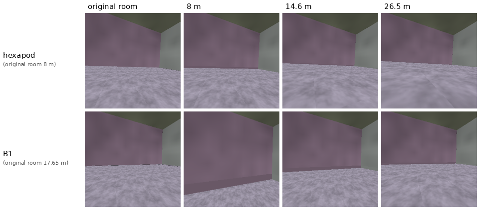

---

## Does z transfer across bodies?

Same tests as last week, on held-out clips:
- body-ID probe: logistic regression z → body (chance 0.33, lower = more shared);
- cross-body R²: a read-out fitted on the six-legged hexapod's z only, applied to another body without refitting (higher =
  more shared);
- k-NN mixing: share of each point's 10 nearest neighbours from another body, relative to random mixing (1 = fully mixed);
- retrieval: how similar in motion each hexapod transition's nearest neighbour from another body is (1 = identical motion).

| pretraining | body-ID probe (chance 0.33, lower = more shared) | cross-body R² c10 → c08 (fwd / lat / yaw) | cross-body R² c10 → B1 (fwd / lat / yaw) | k-NN mixing | retrieval c10 → c08 | retrieval c10 → B1 |
|---|---|---|---|---|---|---|
| last week: hexapod only, B1 adapted | 0.68 | +0.70 / +0.34 / +0.17 | −0.73 / +0.11 / −0.04 | 0.47 | 0.38 | 0.25 |
| joint, no branches | 0.48 | +0.59 / +0.43 / +0.34 | +0.09 / −0.28 / −0.90 | 0.50 | 0.52 | 0.04 |
| joint, with branches (S0 / S1) | 0.55 / 0.53 | +0.76 / +0.52 / +0.47 · +0.77 / +0.43 / +0.49 | −0.63 / +0.14 / +0.04 · −0.27 / +0.53 / −0.34 | 0.46 / 0.46 | 0.63 / 0.66 | 0.25 / 0.30 |
| hexapod only with branches, B1 adapted (44 tuned clips) | **0.40** | +0.74 / +0.42 / +0.53 | **+0.27 / +0.17 / +0.15** | **0.62** | 0.63 | 0.30 |
| hexapod only, random rooms, B1 adapted from 88 babbling clips | 0.46 | +0.56 / +0.42 / +0.37 | −0.06 / −0.11 / +0.08 | 0.58 | 0.58 | 0.12 |
| joint, random rooms | 0.50 | +0.65 / +0.34 / +0.39 | +0.15 / −1.54 / −0.47 | 0.49 | 0.57 | −0.05 |

- Between the two hexapods, branches make z more shared (retrieval 0.52 → 0.63–0.66; forward R² +0.59 → +0.76).
- With B1, joint pretraining keeps the bodies more apart (body-ID 0.50–0.55). Pretraining on the hexapod alone and adapting
  B1 gives the most shared z: body-ID 0.40, mixing 0.62, and the only positive cross-body R² on all three channels.

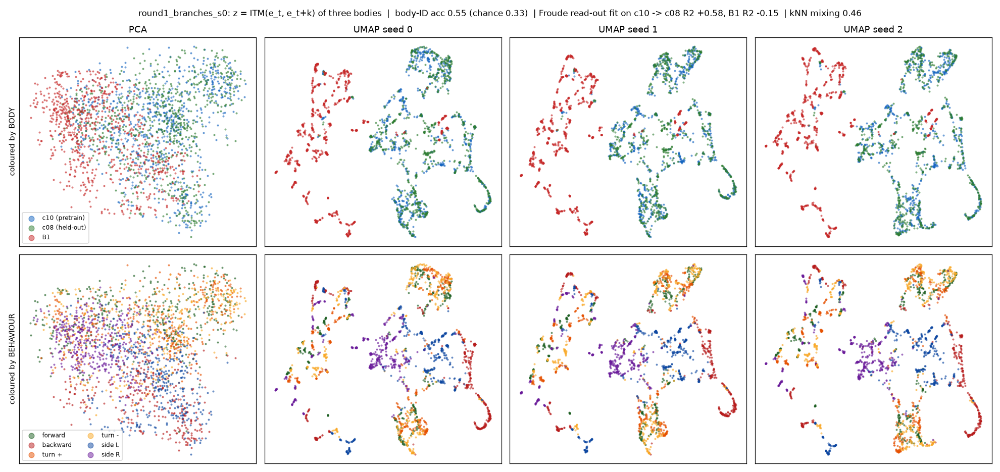

---

## Physics closed loop (random-room model)

Model: joint pretraining with branches, **trained in random rooms** (not the original-room model of Results 1 and 2).

Every 2 frames the planner picks a candidate by direct or by rollout from the robot's live camera view. B1 walks under its own policy in MuJoCo; candidates = its 24 tuned clips; B1 was in joint
pretraining (with branches). Shorter-legged hexapod: never trained, joint commands in CoppeliaSim; candidates = its 24 held-out
clips; hexapod projector, zero-shot. Pretraining, goals and live view in random rooms; goals = held-out hexapod clips; 33
decisions per run, no falls; one seed, one episode per goal.

Metric: error E, mean L2 between achieved and goal Froude (lower is better).

| goal | B1 direct | B1 rollout | B1 random candidate | hexapod direct | hexapod rollout | hexapod random candidate |
|---|---|---|---|---|---|---|
| turn 0.29 | 0.044 | **0.032** | 0.163 | **0.068** | 0.168 | 0.189 |
| turn 0.56 | **0.035** | 0.075 | 0.144 | **0.029** | 0.169 | 0.195 |
| sideways left 0 | **0.015** | 0.061 | 0.105 | **0.042** | 0.049 | 0.124 |
| sideways right 1 | **0.021** | 0.058 | 0.138 | **0.035** | 0.045 | 0.149 |
| speed 7.1 | 0.036 | **0.032** | 0.138 | **0.079** | 0.126 | 0.193 |
| speed 8.8 | **0.059** | 0.085 | 0.169 | 0.195 | **0.171** | 0.175 |
| **mean** | **0.035** | **0.057** | **0.143** | **0.075** | **0.121** | **0.171** |

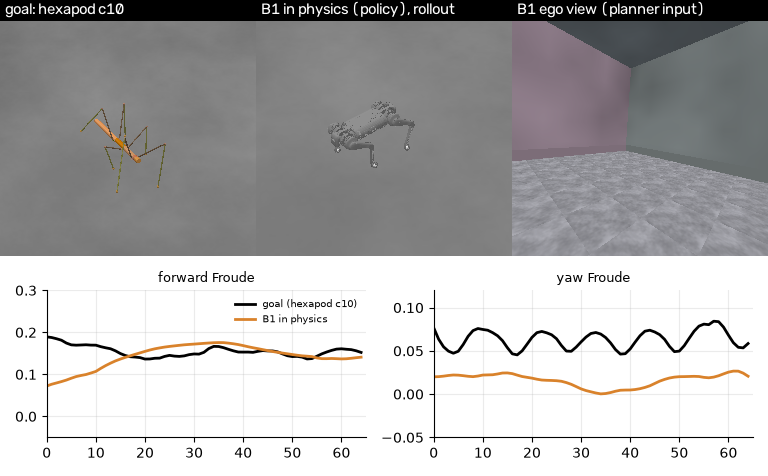

Clips: turn [direct](../results/deck/weekly_1008/b1_physics_turn.mp4), [rollout](../results/deck/weekly_1008/b1_physics_turn_rollout.mp4); forward
[direct](../results/deck/weekly_1008/b1_physics_forward.mp4), [rollout](../results/deck/weekly_1008/b1_physics_forward_rollout.mp4).

- Both follow the goal far better than random (E 0.035 / 0.057 vs 0.143); direct is better on average, rollout on turn 0.29 and
  speed 7.1. One seed, one episode per goal.
- In the turn 0.56 run, rollout keeps forward speed but turns too little (yaw ≈ 0.02 against ≈ 0.07).

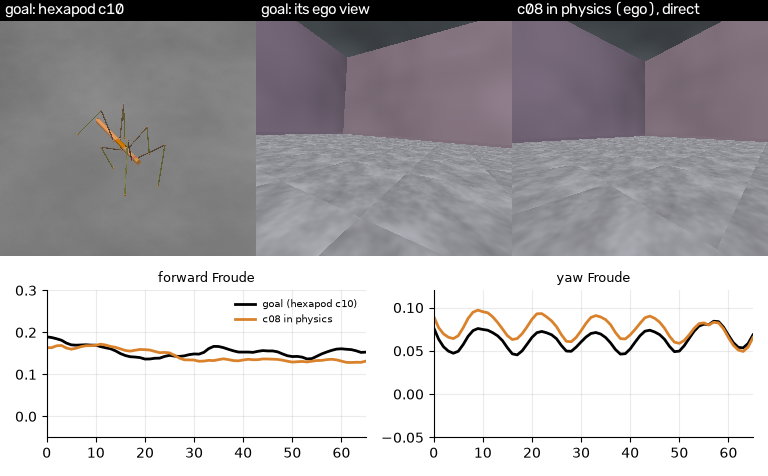

Clips: turn [direct](../results/deck/weekly_1008/physics_turn.mp4), [rollout](../results/deck/weekly_1008/physics_turn_rollout.mp4); forward [direct](../results/deck/weekly_1008/physics_forward.mp4),
[rollout](../results/deck/weekly_1008/physics_forward_rollout.mp4).

- Direct follows 5 of 6 goals well below random.
- Rollout does not track forward speed on the turn and speed goals (forward ≈ 0 on turns, about half the goal on speed);
  on the sideways goals it is close to direct.
- Motion is measured at the centre of mass, like the goals (last week's numbers for this body were measured at the head).

---

## Babbling: adapting a new robot from its own random walking

**Test setup**
- **Model:** pretrained on the six-legged hexapod only (clips + branches, i.e. counterfactual data), B1 never seen.
- **Adaptation data:** B1's own **random babbling**: walking commands drawn from its policy's range (forward ±0.5, sideways ±0.4,
  turn ±0.6), switching every 1–2 s, 3.3 s per clip; labels = measured motion; no knowledge of the task or the goals.
  11 to 176 clips (0.6 to 9.7 min).
- **Adaptation:** low-rank update (LoRA) of the ITM and FTM + a new action projector for B1.
- **Rooms:** pretraining, babbling and test all in random rooms, one room per clip (as on the previous page).
- **Test:** goals = held-out hexapod clips; candidates = 24 B1 clips tuned to the hexapod's behaviours (upper bound for the
  library); same score as Result 2.

**Does random babbling cover what pretraining and the goals need?**

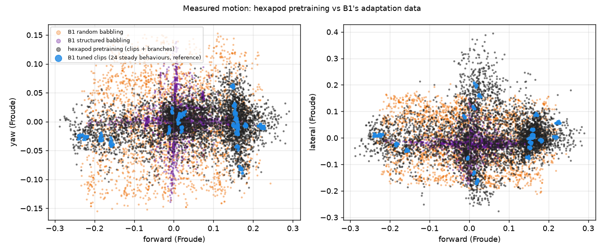

- The hexapod's pretraining data lies mostly along the pure forward / sideways / turn axes (plus branch transitions); random
  babbling covers that range and also the combinations, so the motions the goals ask for are in the adaptation data.

**Result**

Metric: normalised score from error E, mean L2 between achieved and goal Froude (0 = random candidate, 1 = best in hindsight).

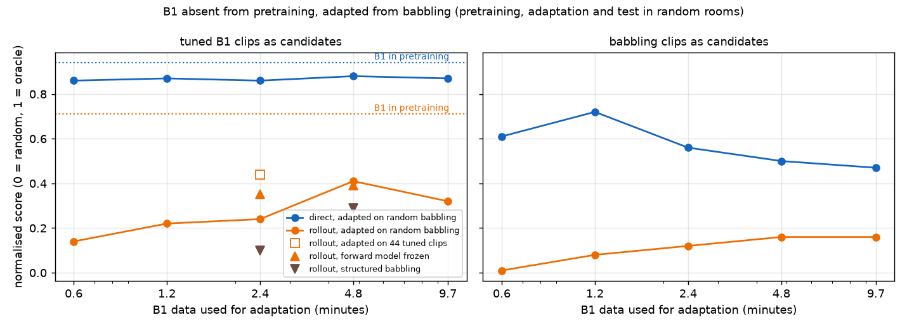

| minutes of babbling (clips) | 0.6 (11) | 1.2 (22) | 2.4 (44) | 4.8 (88) | 9.7 (176) | 2.4 min tuned clips | B1 in pretraining |
|---|---|---|---|---|---|---|---|
| direct | +0.86 | +0.87 | +0.86 | +0.88 | +0.87 | +0.94 | +0.94 |
| rollout | +0.14 | +0.22 | +0.24 | +0.41 | +0.32 | +0.44 | +0.71 |

- **Rollout** improves with more babbling (+0.14 → +0.41), then levels off around +0.4.
- **Direct** needs little data: +0.86 from 0.6 min, then flat, slightly below the +0.94 of the tuned clips.
- Changes to the adaptation recipe (FTM frozen, projector fitted through the FTM) also end near +0.4.
- **The rollout limit follows the rooms, not the babbling:** in random rooms, adapting on the 44 tuned clips also gives +0.44
  (+0.70 in the original rooms, previous page), the same level as babbling (+0.41). Babbling in the original rooms is not yet
  measured.

---

## Next: driving a new robot from its own babbling

Goal of the project: a robot never seen in pretraining, adapted only from its own babbling, selects actions by rollout close to
a robot that was in pretraining (+0.71 now) and follows the goals in the physics loop. Two parts.

**1. Data: randomise properly, so the model reads motion instead of recognising the scene**

| change | what it removes | measured by |
|---|---|---|
| every behaviour (with its branches) rendered in several rooms (two extra rooms per training clip: rendering) | room → behaviour shortcut | behaviour decodable from z in new rooms ≈ chance |
| lighting, textures and colour randomised; colour augmentation also during adaptation | colour / light cues | the same selection score across rooms |
| babbling with many commands per room, rooms shared across clips | room → clip shortcut in the adaptation data | adaptation rollout in random rooms vs +0.71 |
| babbling adaptation first in a fixed room, then in random rooms | mixing of room effect and data quality | the gap between the two |

**2. A shared z: same motion, same z, whatever the body**

| step | why | measured by |
|---|---|---|
| retrain on the randomised data, then measure sharing again | room and clip information in z keeps bodies apart | body identity from z → chance; cross-body motion R² > 0 |
| re-test contrastive alignment (z of different bodies with the same measured motion pulled together) on that model | alignment did not take while z carried the room | the same, plus rollout unchanged or better |
| adapt only the action projector into the shared z | a new body then reuses the pretrained ITM and FTM unchanged | babbling-adapted rollout vs +0.71 |

**Then:** B1 from babbling in the physics loop, and a second new body (four-legged hexapod, hind legs removed) from babbling only.

